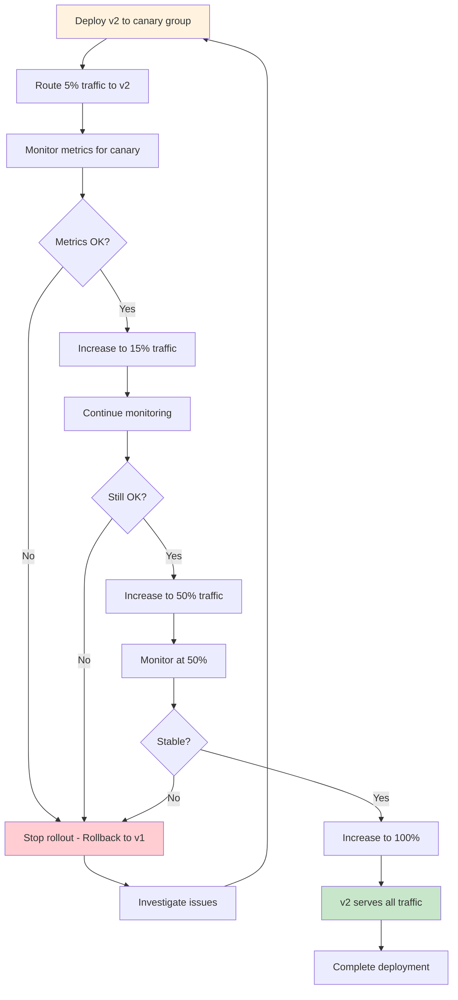

# Canary Release

## Overview

Canary Release is a deployment strategy that gradually rolls out a new version of an application to a small subset of users before making it available to the entire user base. The name derives from the historical practice of miners carrying canary birds to detect dangerous gases - if the canary showed signs of distress, the miners would know to evacuate. Similarly, in software deployment, a small "canary" group receives the new version first, and their experience indicates whether it's safe to proceed with broader deployment.

This strategy provides a safety net for releasing software by limiting the potential blast radius of any issues. If problems are detected in the canary group, the deployment can be quickly halted and rolled back before the majority of users are affected. This approach balances the need for rapid iteration with the requirement for safe, controlled deployments.

The implementation of canary releases typically involves splitting traffic between the current stable version and the new version. This split can be configured at various levels of granularity - by percentage of total requests, by specific user segments, by geographic regions, or by other business criteria. The traffic split can start very small (as low as 1-2% of users) and gradually increase as confidence in the new version grows.

Modern canary deployments often integrate with sophisticated monitoring and analysis tools. Rather than relying solely on manual decision-making, teams can configure automated progressive rollouts based on key metrics. If error rates, latency, or other critical metrics remain within acceptable thresholds for the canary group, the traffic percentage automatically increases. If metrics deteriorate, the rollout automatically halts or rolls back.

The canary approach requires careful infrastructure support. You need the ability to route different users to different versions simultaneously, monitor the health of each version independently, and quickly adjust traffic allocation. Service meshes like Istio, Linkerd, or Envoy provide powerful traffic management capabilities for implementing canary deployments in microservices architectures.

One of the key advantages of canary releases is the ability to gather real-world feedback from actual users. Unlike staging environment testing, canary deployments expose the new version to genuine production traffic patterns, user behaviors, and edge cases that may not be captured in test environments. This real-world validation provides valuable data about how the new version performs under actual load and usage conditions.

## Flow Chart



## Standard Example

```yaml
# Kubernetes Canary Deployment with Istio
# This example shows a sophisticated canary deployment setup

---
# Istio Virtual Service - Configures traffic splitting
apiVersion: networking.istio.io/v1beta1
kind: VirtualService
metadata:
  name: myapp-virtual-service
spec:
  hosts:
  - myapp.example.com
  gateways:
  - myapp-gateway
  http:
  - name: canary-route
    match:
    # Route specific user segments to canary
    - headers:
        x-user-tier:
          exact: premium
    route:
    - destination:
        host: myapp-canary
        port:
          number: 8080
      weight: 100
  - name: percentage-route
    route:
    # Default routing with weighted canary
    - destination:
        host: myapp-primary
        port:
          number: 8080
      weight: 95
    - destination:
        host: myapp-canary
        port:
          number: 8080
      weight: 5

---
# Primary (Stable) Deployment
apiVersion: apps/v1
kind: Deployment
metadata:
  name: myapp-primary
spec:
  replicas: 10
  selector:
    matchLabels:
      app: myapp
      version: v1
  template:
    metadata:
      labels:
        app: myapp
        version: v1
    spec:
      containers:
      - name: myapp
        image: myapp:1.0.0
        ports:
        - containerPort: 8080
        env:
        - name: VERSION
          value: "v1.0.0"
        resources:
          requests:
            memory: "256Mi"
            cpu: "200m"
          limits:
            memory: "512Mi"
            cpu: "1000m"

---
# Canary Deployment
apiVersion: apps/v1
kind: Deployment
metadata:
  name: myapp-canary
spec:
  replicas: 2
  selector:
    matchLabels:
      app: myapp
      version: v2
  template:
    metadata:
      labels:
        app: myapp
        version: v2
    spec:
      containers:
      - name: myapp
        image: myapp:2.0.0
        ports:
        - containerPort: 8080
        env:
        - name: VERSION
          value: "v2.0.0"
        resources:
          requests:
            memory: "256Mi"
            cpu: "200m"
          limits:
            memory: "512Mi"
            cpu: "1000m"

---
# Service for primary
apiVersion: v1
kind: Service
metadata:
  name: myapp-primary
spec:
  selector:
    app: myapp
    version: v1
  ports:
  - port: 8080
    targetPort: 8080

---
# Service for canary
apiVersion: v1
kind: Service
metadata:
  name: myapp-canary
spec:
  selector:
    app: myapp
    version: v2
  ports:
  - port: 8080
    targetPort: 8080

---
# DestinationRule for traffic policy
apiVersion: networking.istio.io/v1beta1
kind: DestinationRule
metadata:
  name: myapp-destination
spec:
  host: myapp
  trafficPolicy:
    connectionPool:
      tcp:
        maxConnections: 100
      http:
        h2UpgradePolicy: UPGRADE
        http1MaxPendingRequests: 100
        http2MaxRequests: 1000
    loadBalancer:
      simple: LEAST_CONN
  subsets:
  - name: v1
    labels:
      version: v1
  - name: v2
    labels:
      version: v2
```

```javascript
// canary-manager.js - Automated canary progression logic
const prometheus = require('prom-client');
const axios = require('axios');

const register = new prometheus.Registry();
prometheus.collectDefaultMetrics({ register });

const errorRateGauge = new prometheus.Gauge({
  name: 'canary_error_rate',
  help: 'Error rate for canary deployment',
  labelNames: ['version'],
});

const latencyGauge = new prometheus.Gauge({
  name: 'canary_latency_p99',
  help: 'P99 latency for canary deployment',
  labelNames: ['version'],
});

class CanaryManager {
  constructor(config) {
    this.config = config;
    this.currentWeight = config.initialWeight;
    this.canaryVersion = config.canaryVersion;
    this.stableVersion = config.stableVersion;
    this.thresholds = config.thresholds;
  }

  async evaluateCanary() {
    const metrics = await this.collectMetrics();
    this.updateGauges(metrics);
    
    if (this.shouldRollback(metrics)) {
      await this.rollback();
      return { action: 'rollback', reason: 'Thresholds exceeded' };
    }
    
    if (this.shouldProgress(metrics)) {
      await this.progress();
      return { action: 'progress', newWeight: this.currentWeight };
    }
    
    return { action: 'maintain', currentWeight: this.currentWeight };
  }

  async collectMetrics() {
    const query = (metric) => 
      axios.get(`${this.config.prometheusUrl}/api/v1/query?query=${metric}`);
    
    const [errorRes, latencyRes] = await Promise.all([
      query(`sum(rate(http_requests_total{service="canary"}[5m])) 
             / sum(rate(http_requests_total{service=~".*"}[5m]))`),
      query(`histogram_quantile(0.99, 
             sum(rate(http_request_duration_seconds_bucket{service="canary"}[5m])) 
             by (le))`)
    ]);
    
    return {
      errorRate: parseFloat(errorRes.data.data.result[0]?.value[1] || 0),
      latencyP99: parseFloat(latencyRes.data.data.result[0]?.value[1] || 0)
    };
  }

  shouldRollback(metrics) {
    return (
      metrics.errorRate > this.thresholds.maxErrorRate ||
      metrics.latencyP99 > this.thresholds.maxLatency
    );
  }

  shouldProgress(metrics) {
    return (
      metrics.errorRate < this.thresholds.maxErrorRate * 0.5 &&
      metrics.latencyP99 < this.thresholds.maxLatency * 0.5 &&
      this.currentWeight < this.config.maxWeight
    );
  }

  async progress() {
    const increment = this.config.increment || 10;
    this.currentWeight = Math.min(
      this.currentWeight + increment,
      this.config.maxWeight
    );
    await this.updateTrafficWeight(this.currentWeight);
  }

  async rollback() {
    this.currentWeight = 0;
    await this.updateTrafficWeight(0);
  }

  async updateTrafficWeight(weight) {
    // Update Istio VirtualService
    const vsPatch = {
      http: [{
        name: 'percentage-route',
        route: [{
          destination: { host: 'myapp-primary', port: { number: 8080 } },
          weight: 100 - weight
        }, {
          destination: { host: 'myapp-canary', port: { number: 8080 } },
          weight: weight
        }]
      }]
    };
    
    await axios.patch(
      `${this.config.istioApi}/apis/networking.istio.io/v1beta1/namespaces/default/virtualservices/myapp-virtual-service`,
      vsPatch,
      { headers: { 'Content-Type': 'application/merge-patch+json' } }
    );
    
    console.log(`Traffic weight updated: canary=${weight}%, primary=${100-weight}%`);
  }
}

module.exports = CanaryManager;
```

## Real-World Examples

### Example 1: Netflix Canary Analysis Platform

Netflix pioneered sophisticated canary deployment practices with their internal tooling. Their Canary Analysis System automatically analyzes metrics from canary deployments, comparing them against the baseline production metrics. The system evaluates multiple dimensions including error rates, latency, and business metrics, and automatically makes go/no-go decisions. If metrics deteriorate beyond acceptable thresholds, the canary is automatically stopped and rolled back.

### Example 1: Shopify's gradual rollout system

Shopify implements canary releases by initially routing a small percentage of traffic to new versions. They use custom-built tooling that monitors key business metrics like conversion rates, cart abandonment, and checkout success rates. Their system can automatically pause rollouts if any metric shows statistically significant degradation, protecting millions of merchants from potential issues.

### Example 2: Spotify's Feature Experimentation

Spotify uses canary-style releases combined with experimentation for their backend services. New versions are initially released to a small percentage of users, and the system measures both technical metrics and user behavior changes. This allows them to detect not just technical issues, but also whether new features negatively impact user engagement or other business outcomes.

### Example 3: Airbnb's Deployment Infrastructure

Airbnb's deployment system implements canary releases with automatic rollback capabilities. Their infrastructure monitors error rates, latency, and customer support tickets. The system can halt canary rollouts if any monitored metric exceeds predefined thresholds, and has the ability to analyze multiple metrics simultaneously to make sophisticated rollout decisions.

### Example 4: Facebook's Phabricator and Gatekeeper

Facebook uses a system called "gatekeepers" to enable canary releases at massive scale. They can route specific percentages of traffic to new versions across their entire infrastructure. Their system integrates with their code review tools, allowing reviewers to approve or reject canary promotion based on the observed metrics.

### Example 5: Google Cloud Run Progressive Rollout

On Google Cloud Run, teams can implement canary deployments by using multiple revisions and adjusting traffic percentages. The Cloud Run console and gcloud CLI allow updating traffic weights between revisions. Combined with Cloud Monitoring, teams can create automated progressive rollouts that respond to observed metrics in real-time.

## Output Statement

Canary releases provide a data-driven approach to software deployment that balances innovation velocity with operational safety. By gradually exposing new versions to increasing proportions of real traffic, teams can detect issues before they affect the entire user base and make informed decisions about promotion based on actual metrics. The strategy requires investment in traffic routing infrastructure, monitoring systems, and automated progression logic, but enables a level of confidence in deployments that traditional approaches cannot match. Organizations implementing canary releases should start with simple percentage-based rollouts and progressively add more sophisticated criteria as their tooling matures.

## Best Practices

1. **Start with a very small initial percentage**: Begin with 1-5% of traffic for the initial canary. This limits the blast radius if issues are discovered while still providing meaningful data about real-world performance.

2. **Define clear metrics and thresholds**: Establish specific, measurable criteria for what constitutes success or failure. Include both technical metrics (error rate, latency) and business metrics (conversion rate, revenue) where applicable.

3. **Run canary long enough to capture issues**: Allow sufficient time for the canary to encounter various scenarios. A minimum of 30 minutes to several hours is typically appropriate, depending on traffic patterns and the nature of the application.

4. **Use automated progression with manual override**: Implement automatic incremental rollout based on healthy metrics, but retain the ability for operators to manually control or halt the rollout at any stage.

5. **Implement multi-metric evaluation**: Evaluate multiple dimensions of health rather than relying on a single metric. A version might have acceptable error rates but elevated latency, indicating emerging problems.

6. **Segment canary users thoughtfully**: Consider routing specific user segments (geographic, tier-based, or behavioral) to the canary rather than random sampling. This can provide more relevant feedback and easier troubleshooting.

7. **Maintain rollback capability**: Ensure rollback can be executed quickly - ideally within seconds. The infrastructure should support immediate traffic redirection back to the stable version.

8. **Correlate with deployment events**: When analyzing metrics, account for time-of-day effects, day-of-week patterns, and any marketing or business events that might influence metrics.

9. **Include negative test cases**: Beyond monitoring for failures, actively test that new functionality works correctly for canary users. Implement synthetic transactions or shadow testing alongside organic traffic.

10. **Document and learn from each canary**: Maintain records of each canary deployment, the metrics observed, and any issues discovered. This data informs future threshold settings and helps improve the overall canary process.