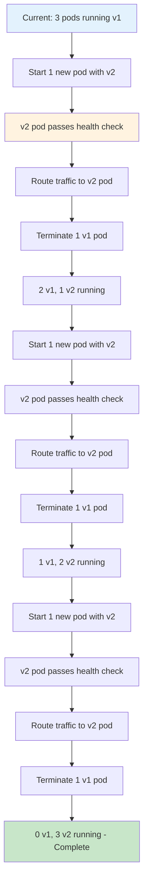

# Rolling Update

## Overview

Rolling Update is a deployment strategy that incrementally replaces instances of an application with new versions. Instead of updating all instances at once (which causes downtime) or maintaining multiple complete environments (which requires more resources), rolling updates replace instances one at a time or in small batches. This approach maintains continuous availability while gradually transitioning to the new version.

The fundamental principle of rolling updates is controlled, incremental replacement. A typical rolling update might proceed as follows: first, a new instance with the new version is started; second, once the new instance passes health checks, it begins receiving traffic; third, an old instance is removed; and finally, the process repeats until all instances are updated. Throughout this process, the service remains available as there are always enough instances to handle the load.

This deployment pattern has become a standard feature in container orchestration platforms and cloud-native deployment tools. Kubernetes, for example, implements rolling updates natively through its Deployment resource, allowing teams to configure update parameters like the maximum number of unavailable pods and the maximum number of pods that can be created above the desired count. These parameters provide control over the tradeoff between update speed and availability.

The key to successful rolling updates is maintaining sufficient capacity throughout the process. The system must have enough healthy instances at each step to handle the expected traffic load. This requires careful capacity planning and often involves temporarily running more instances than the steady-state desired count during the update process.

Rolling updates provide natural rollback capability. If issues are detected during the update process, the orchestration platform can stop further updates, and the remaining instances continue running the old version. Some platforms also support pausing updates mid-rollout, allowing teams to investigate issues before deciding whether to proceed or rollback.

## Flow Chart



## Standard Example

```yaml
# Kubernetes Rolling Update Deployment
# This configuration demonstrates a controlled rolling update with proper health checks

apiVersion: apps/v1
kind: Deployment
metadata:
  name: myapp-deployment
  labels:
    app: myapp
spec:
  # Desired number of replicas
  replicas: 5
  
  # RollingUpdate strategy - key to zero-downtime deployment
  strategy:
    type: RollingUpdate
    rollingUpdate:
      # Maximum number of pods that can be unavailable during update
      # Can be number or percentage (e.g., "25%")
      maxUnavailable: 1
      # Maximum number of pods that can be created over desired replica count
      # Allows temporary over-provisioning during update
      maxSurge: 1
  
  # Label selector for identifying managed pods
  selector:
    matchLabels:
      app: myapp
  
  # Pod template defines the application specification
  template:
    metadata:
      labels:
        app: myapp
        # Version label updates trigger the rolling update
        version: "2.0.0"
    spec:
      # Pod scheduling and behavior configuration
      terminationGracePeriodSeconds: 30
      affinity:
        podAntiAffinity:
          preferredDuringSchedulingIgnoredDuringExecution:
          - weight: 100
            podAffinityTerm:
              labelSelector:
                matchLabels:
                  app: myapp
              topologyKey: kubernetes.io/hostname
      
      containers:
      - name: myapp
        image: myapp:2.0.0
        imagePullPolicy: Always
        
        ports:
        - name: http
          containerPort: 8080
          protocol: TCP
        
        # Environment variables for configuration
        env:
        - name: APP_VERSION
          value: "2.0.0"
        - name: LOG_LEVEL
          value: "info"
        - name: MAX_CONNECTIONS
          value: "100"
        
        # Resource requests and limits
        resources:
          requests:
            memory: "256Mi"
            cpu: "200m"
          limits:
            memory: "512Mi"
            cpu: "1000m"
        
        # Liveness probe - determines if container should be restarted
        livenessProbe:
          httpGet:
            path: /health/live
            port: http
          initialDelaySeconds: 30
          periodSeconds: 10
          failureThreshold: 3
          timeoutSeconds: 5
        
        # Readiness probe - determines if container can receive traffic
        readinessProbe:
          httpGet:
            path: /health/ready
            port: http
          initialDelaySeconds: 5
          periodSeconds: 5
          failureThreshold: 3
          timeoutSeconds: 3
        
        # Startup probe - for slow starting applications
        startupProbe:
          httpGet:
            path: /health/startup
            port: http
          periodSeconds: 10
          failureThreshold: 30
        
        # Pre-stop hook for graceful shutdown
        lifecycle:
          preStop:
            exec:
              command:
              - sh
              - -c
              - "sleep 10"
        
        # Volume mounts for configuration or data
        volumeMounts:
        - name: config
          mountPath: /etc/config
          readOnly: true
        - name: tmp
          mountPath: /tmp
      
      volumes:
      - name: config
        configMap:
          name: myapp-config
      - name: tmp
        emptyDir: {}

---
# Service for routing traffic to pods
apiVersion: v1
kind: Service
metadata:
  name: myapp-service
spec:
  selector:
    app: myapp
  ports:
  - port: 80
    targetPort: 8080
  # Ensures service stays available during pod changes
  sessionAffinity: None
  type: ClusterIP
```

```bash
#!/bin/bash
# rolling-update.sh - Manual rolling update with monitoring

set -e

NAMESPACE="production"
DEPLOYMENT_NAME="myapp-deployment"
NEW_VERSION="2.0.0"
MAX_UNAVAILABLE=1
CHECK_INTERVAL=30

echo "=== Starting Rolling Update to ${NEW_VERSION} ==="

# Get current replicas
CURRENT_REPLICAS=$(kubectl get deployment ${DEPLOYMENT_NAME} -n ${NAMESPACE} -o jsonpath='{.spec.replicas}')
echo "Current replicas: ${CURRENT_REPLICAS}"

# Start the rolling update by changing the image
echo "Updating deployment image..."
kubectl set image deployment/${DEPLOYMENT_NAME} \
    myapp=myapp:${NEW_VERSION} -n ${NAMESPACE}

# Monitor the rolling update progress
while true; do
    # Get deployment status
    READY=$(kubectl get deployment ${DEPLOYMENT_NAME} -n ${NAMESPACE} -o jsonpath='{.status.readyReplicas}')
    UPDATED=$(kubectl get deployment ${DEPLOYMENT_NAME} -n ${NAMESPACE} -o jsonpath='{.status.updatedReplicas}')
    AVAILABLE=$(kubectl get deployment ${DEPLOYMENT_NAME} -n ${NAMESPACE} -o jsonpath='{.status.availableReplicas}')
    
    echo "Ready: ${READY}/${CURRENT_REPLICAS} | Updated: ${UPDATED} | Available: ${AVAILABLE}"
    
    # Check if rollout is complete
    if [ "${UPDATED}" = "${CURRENT_REPLICAS}" ] && [ "${READY}" = "${CURRENT_REPLICAS}" ]; then
        echo "Rolling update completed successfully!"
        break
    fi
    
    # Check for failures
    FAILURE=$(kubectl get deployment ${DEPLOYMENT_NAME} -n ${NAMESPACE} -o jsonpath='{.status.conditions[?(@.type=="Failed")].status}')
    if [ "${FAILURE}" = "True" ]; then
        echo "Rolling update failed! Getting details..."
        kubectl rollout status deployment/${DEPLOYMENT_NAME} -n ${NAMESPACE} --timeout=0s
        exit 1
    fi
    
    sleep ${CHECK_INTERVAL}
done

# Final verification
echo "Performing final health check..."
kubectl rollout status deployment/${DEPLOYMENT_NAME} -n ${NAMESPACE}

echo "=== Rolling Update Complete ==="
```

## Real-World Examples

### Example 1: Kubernetes Deployment with HPA

A production Kubernetes cluster running a Node.js API service implements rolling updates combined with Horizontal Pod Autoscaler (HPA). During updates, the HPA continues to function, adding or removing pods based on load while the rolling update proceeds. The deployment configuration uses maxUnavailable: 1 and maxSurge: 1 to ensure there are always enough pods to handle traffic. The application implements graceful shutdown handling SIGTERM signals, allowing in-flight requests to complete before the pod terminates.

### Example 2: AWS ECS Rolling Update

On Amazon ECS, rolling updates work through the task definition and service configuration. A team updates their service by registering a new task definition with the updated container image, and ECS automatically orchestrates the replacement of tasks. The service's minimumHealthyPercent and maximumPercent settings control how aggressively the update proceeds. CloudWatch metrics monitor the update, and CloudWatch alarms can trigger automatic rollbacks if error rates exceed thresholds.

### Example 3: Docker Swarm Rolling Updates

Docker Swarm implements rolling updates through the docker service update command. Teams can configure --update-delay, --update-parallelism, and --update-failure-action parameters to control the update behavior. The swarm manager monitors task health after each update and automatically rolls back if tasks fail. This approach is suitable for smaller-scale deployments and organizations using Docker as their container platform.

### Example 4: Terraform-Managed Infrastructure Updates

When infrastructure is managed through Terraform, rolling updates can be triggered by changes to the underlying compute resources. An organization might use Terraform to manage AWS Auto Scaling Groups, where changes to the launch template trigger a rolling replacement of instances. The ASG's lifecycle hook ensures instances are properly registered with the load balancer before receiving traffic, and old instances are drained before termination.

### Example 5: Nomad Rolling Deployments

HashiCorp Nomad implements rolling deployments through the update block in job specifications. Teams configure canary, rolling, or blue-green strategies. The rolling strategy ensures a specified number of canaries are deployed first, health is checked, and then the remaining instances are updated. Nomad's integration with Consul for service discovery ensures traffic is only routed to healthy instances during the update process.

## Output Statement

Rolling updates provide a practical balance between deployment speed and availability. By incrementally replacing instances, this strategy maintains service continuity while allowing issues to be detected and addressed before they affect all users. The pattern is well-supported by modern container orchestration platforms, which provide configurable parameters to control the update behavior. Success with rolling updates requires careful attention to health checks, graceful shutdown handling, and capacity planning to ensure the service remains available throughout the transition.

## Best Practices

1. **Configure appropriate maxUnavailable and maxSurge values**: The settings determine the tradeoff between update speed and availability. A conservative approach (maxUnavailable: 1, maxSurge: 1) maintains capacity but takes longer, while aggressive settings speed the update but temporarily reduce capacity.

2. **Implement robust health checks**: Liveness, readiness, and startup probes should accurately reflect the application's health. Incorrect probe configuration can cause premature pod termination or delayed traffic routing, both of which can cause issues during updates.

3. **Handle graceful shutdown**: Applications must properly handle SIGTERM signals, finish processing in-flight requests, and stop accepting new connections before the termination grace period expires. This prevents request failures during pod termination.

4. **Set appropriate resource requests**: Ensure resource requests are set so the scheduler can properly distribute pods across nodes. During updates with maxSurge, additional pods will be created temporarily.

5. **Use preStop lifecycle hooks**: For applications that need more time to drain connections than the default grace period provides, configure a preStop hook to delay the SIGTERM signal.

6. **Monitor update progress**: Implement monitoring that tracks the update progress and alerts on stalls or failures. The platform's status commands provide rollout state, but integrate with alerting systems for proactive notification.

7. **Implement application-level readiness**: Beyond platform health checks, implement application-specific readiness checks that verify dependencies (databases, APIs) are accessible. This prevents routing traffic to pods that appear ready but cannot actually process requests.

8. **Test the update process regularly**: Regular practice of the update process (including rollbacks) builds confidence and reveals issues before they occur in production. Include updates in regular disaster recovery testing.

9. **Plan for capacity during updates**: During rolling updates with maxSurge, more resources may be consumed temporarily. Ensure the cluster or infrastructure has capacity to accommodate the temporary increase.

10. **Implement automatic rollback triggers**: Configure automatic rollback based on metrics like error rate spikes, latency increases, or pod crash loops. Most orchestration platforms support this either natively or through external automation.