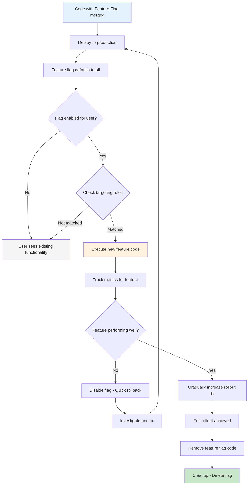

# Feature Flag Pattern

## Overview

Feature Flags (also known as Feature Toggles) are a powerful software development technique that allows teams to modify system behavior without deploying new code. A feature flag is a boolean configuration value that controls whether a specific feature is enabled or disabled at runtime. This simple mechanism provides tremendous flexibility in software release management, enabling practices like trunk-based development, A/B testing, and gradual rollouts.

The fundamental concept behind feature flags is the separation of code deployment from feature release. Traditionally, teams would need to deploy code to release a new feature, creating a tight coupling between these two operations. With feature flags, code containing new functionality is deployed alongside existing code, but the feature remains hidden until explicitly enabled. This decoupling enables teams to deploy code frequently and safely, while controlling when features become visible to users.

Feature flags support various use cases beyond simple on/off functionality. Release flags control the availability of incomplete features during development. Experiment flags enable A/B testing and multivariate testing. Operational flags control performance-related features like caching or logging levels. Permission flags implement tier-based feature access. Each flag type serves a different purpose and may have different lifecycle management requirements.

The implementation of feature flags ranges from simple configuration files to sophisticated dedicated services. Simple implementations might use environment variables or configuration files that are read at startup. More sophisticated implementations use specialized feature management platforms like LaunchDarkly, Split.io, or Unleash, which provide additional capabilities like user targeting, gradual rollouts, and analytics. Some organizations build internal solutions using databases or feature flag services.

One of the key benefits of feature flags is enabling trunk-based development. In trunk-based development, developers work in short-lived branches that merge to main frequently (often multiple times per day). Without feature flags, this approach would cause incomplete features to reach production. With feature flags, incomplete features can be merged safely, deployed to production, but remain hidden from users until ready.

Feature flag management also introduces complexity that must be managed carefully. Flags that remain in code indefinitely create technical debt and increase maintenance burden. Teams need processes for cleaning up flags after features are fully released. Naming conventions, organization, and documentation become important as the number of flags grows.

## Flow Chart



## Standard Example

```javascript
// feature-flag-client.js - Simple feature flag implementation
const redis = require('redis');
const logger = require('./logger');

class FeatureFlagClient {
  constructor(options = {}) {
    this.flags = {};
    this.defaults = {};
    this.cacheDuration = options.cacheDuration || 60000;
    this.redisClient = null;
    this.fallbackDefaults = options.fallbackDefaults || {};
    
    this.initialize(options);
  }

  async initialize(options) {
    if (options.redisUrl) {
      this.redisClient = redis.createClient({ url: options.redisUrl });
      this.redisClient.on('error', (err) => {
        logger.error('Redis connection error:', err.message);
      });
      await this.redisClient.connect();
    }
    
    this.defaults = options.defaultFlags || {};
    await this.refreshFlags();
    
    setInterval(() => this.refreshFlags(), this.cacheDuration);
  }

  async refreshFlags() {
    try {
      if (this.redisClient) {
        const keys = await this.redisClient.keys('feature:*');
        const pipeline = this.redisClient.pipeline();
        
        keys.forEach(key => pipeline.get(key));
        const results = await pipeline.exec();
        
        keys.forEach((key, index) => {
          const flagName = key.replace('feature:', '');
          const value = results[index];
          this.flags[flagName] = value === 'true';
        });
      }
    } catch (error) {
      logger.warn('Failed to refresh feature flags:', error.message);
    }
  }

  isEnabled(flagName, defaultValue = null) {
    const cachedValue = this.flags[flagName];
    const defaultValueToUse = defaultValue !== null 
      ? defaultValue 
      : this.defaults[flagName] 
      ?? this.fallbackDefaults[flagName] 
      ?? false;
    
    return cachedValue !== undefined ? cachedValue : defaultValueToUse;
  }

  isEnabledForUser(flagName, user, defaultValue = false) {
    if (!this.isEnabled(flagName, defaultValue)) {
      return false;
    }
    
    const targetingRules = this.getTargetingRules(flagName);
    if (!targetingRules) {
      return true;
    }
    
    return this.evaluateTargeting(targetingRules, user);
  }

  getTargetingRules(flagName) {
    const rulesKey = `feature:rules:${flagName}`;
    return this.rulesCache?.[flagName];
  }

  evaluateTargeting(rules, user) {
    if (rules.percentage !== undefined) {
      const userHash = this.hashUser(user.id);
      return (userHash % 100) < rules.percentage;
    }
    
    if (rules.users?.includes(user.id)) {
      return true;
    }
    
    if (rules.groups?.includes(user.group)) {
      return true;
    }
    
    if (rules.emailDomains?.some(domain => user.email?.endsWith(domain))) {
      return true;
    }
    
    return false;
  }

  hashUser(userId) {
    let hash = 0;
    for (let i = 0; i < userId.length; i++) {
      const char = userId.charCodeAt(i);
      hash = ((hash << 5) - hash) + char;
      hash = hash & hash;
    }
    return Math.abs(hash);
  }

  async close() {
    if (this.redisClient) {
      await this.redisClient.quit();
    }
  }
}

module.exports = FeatureFlagClient;
```

```javascript
// Using the feature flag client in application code
const express = require('express');
const FeatureFlagClient = require('./feature-flag-client');

const app = express();
const flags = new FeatureFlagClient({
  redisUrl: process.env.REDIS_URL,
  fallbackDefaults: {
    'new-checkout-flow': false,
    'recommendation-engine': true,
    'dark-mode': false,
  },
});

app.get('/checkout', async (req, res) => {
  const user = await getUserFromSession(req.sessionId);
  
  if (flags.isEnabledForUser('new-checkout-flow', user)) {
    return res.render('checkout-v2', { 
      user,
      features: {
        expressCheckout: true,
        savedCards: true,
        oneClick: flags.isEnabled('one-click-purchase', false),
      }
    });
  }
  
  return res.render('checkout-v1', { user });
});

app.get('/api/recommendations', async (req, res) => {
  const user = await getUserFromSession(req.sessionId);
  
  const useNewEngine = flags.isEnabledForUser('recommendation-engine', user);
  
  if (useNewEngine) {
    const recommendations = await getMLRecommendations(user.id);
    return res.json({ 
      source: 'ml-model-v2',
      items: recommendations 
    });
  }
  
  const recommendations = await getRuleBasedRecommendations(user.id);
  return res.json({ 
    source: 'rules-v1',
    items: recommendations 
  });
});

app.get('/theme', (req, res) => {
  const forceTheme = req.query.theme;
  if (forceTheme) {
    return res.json({ theme: forceTheme });
  }
  
  if (flags.isEnabled('dark-mode')) {
    return res.json({ theme: 'dark' });
  }
  
  return res.json({ theme: 'light' });
});

app.listen(3000, () => {
  console.log('Server started with feature flags');
});
```

```yaml
# LaunchDarkly flag configuration example (ld-config.json)
{
  "flags": {
    "new-checkout-flow": {
      "name": "New Checkout Flow",
      "description": "Enables the redesigned checkout experience",
      "on": false,
      "targets": [
        {
          "values": ["user-123", "user-456"],
          "attribute": "key"
        }
      ],
      "rules": [
        {
          "rollout": {
            "variations": [
              { "weight": 5000, "untracked": false },
              { "weight": 5000, "untracked": false }
            ]
          },
          "clauses": [
            {
              "attribute": "country",
              "operator": "in",
              "values": ["US", "CA", "UK"]
            }
          ]
        }
      ]
    },
    "recommendation-engine": {
      "name": "ML Recommendation Engine",
      "on": true,
      "fallthrough": {
        "rollout": {
          "variations": [
            { "weight": 10000 }
          ]
        }
      }
    },
    "database-cache": {
      "name": "Redis Cache Layer",
      "on": true,
      "rules": [
        {
          "clauses": [
            {
              "attribute": "segment",
              "operator": "in",
              "values": ["premium", "enterprise"]
            }
          ],
          "rollout": {
            "variations": [
              { "weight": 10000 }
            ]
          }
        }
      ]
    }
  }
}
```

## Real-World Examples

### Example 1: Netflix Feature Flags for Microservices

Netflix uses an internal feature flag system called FF4J (Feature Flipping for Java) across their microservices architecture. Their implementation supports complex targeting rules based on user attributes, device type, geographic region, and account tier. Teams can perform gradual rollouts targeting specific percentages of users, test with internal employees first, and quickly disable features if issues arise. The system integrates with their monitoring and alerting infrastructure to trigger automatic flag disabling based on error rate thresholds.

### Example 2: Facebook's Gatekeeper System

Facebook's Gatekeeper system is one of the most sophisticated feature flag implementations at scale. It allows Facebook to control every aspect of their applications, from UI changes to backend processing logic. The system can target specific user segments (by location, language, account age), run A/B tests with statistical significance calculation, and manage thousands of concurrent experiments. Gatekeeper's configuration changes propagate to all servers within seconds, enabling rapid response to issues.

### Example 3: Etsy A/B Testing Platform

Etsy built an internal experimentation platform that combines feature flags with statistical analysis. When a new feature is released behind a flag, the platform automatically tracks metrics like conversion rate, revenue per visitor, and user engagement. The system performs statistical significance testing and can automatically promote or reject features based on predefined success criteria. This data-driven approach helps Etsy make informed decisions about which features to fully release.

### Example 4: Shopify App Extension Flags

Shopify uses feature flags to manage their merchant-facing feature releases. Different merchants (based on plan tier, region, or opt-in status) see different feature sets. The flag system enables Shopify to release features gradually, gather feedback from early adopters, and iterate before broader release. Merchants can opt into beta features, providing real-world testing that complements internal QA.

### Example 5: Cloudflare Workers Feature Flags

Cloudflare uses feature flags to control functionality in their edge computing platform. Their implementation allows customers to enable or disable specific capabilities like Node.js compatibility, specific API features, or performance optimizations. The flags can be toggled at the account level or individual worker level, giving customers fine-grained control over their execution environment.

## Output Statement

Feature flags provide essential capabilities for modern software development, enabling frequent and safe releases, A/B testing, and operational control over feature behavior. By decoupling code deployment from feature release, teams can adopt trunk-based development practices, reduce batch size, and deliver value to users faster. The key to successful feature flag implementation is establishing clear flag lifecycle management, using appropriate flag granularity, and integrating with monitoring systems for automated control. Organizations should implement flag cleanup processes to prevent technical debt accumulation as the number of flags grows.

## Best Practices

1. **Establish flag lifecycle management**: Define clear stages for feature flags - from development (off by default) to release (gradual rollout) to cleanup (remove flag code). Set expectations for how long flags should exist and track them in a registry.

2. **Use appropriate flag granularity**: Distinguish between release flags (temporary), experiment flags (temporary), operational flags (persistent), and permission flags (persistent). Each type has different management requirements.

3. **Implement proper flag naming conventions**: Use consistent, descriptive names that indicate the flag's purpose and scope. Consider prefixes like "feat_" for features, "exp_" for experiments, "ops_" for operational toggles.

4. **Store flags in a centralized system**: Use a dedicated feature flag service rather than hardcoding flags in application code or configuration files. This enables centralized management, audit trails, and programmatic control.

5. **Integrate with monitoring and alerting**: Connect feature flags to your observability infrastructure. Track metrics like error rates and latency segmented by flag state, and configure automatic flag disabling when thresholds are exceeded.

6. **Implement proper access controls**: Control who can modify feature flags in production. Critical flags should require approval processes, while development flags might be modified freely in non-production environments.

7. **Test flag behavior thoroughly**: Test both the enabled and disabled states of each feature flag. Ensure the application behaves correctly regardless of flag state and that transitions don't cause issues.

8. **Use gradual rollouts**: Instead of flipping flags on/off globally, use percentage-based rollouts to catch issues early. Start with a small percentage and increase as confidence builds.

9. **Document flag purpose and owners**: Maintain documentation for each flag explaining why it exists, who is responsible for it, and what conditions should trigger its change or removal.

10. **Implement flag cleanup in CI/CD**: Include flag cleanup (removing dead code) as part of the regular development workflow. Automate detection of unused flags and include their removal in pull request reviews.