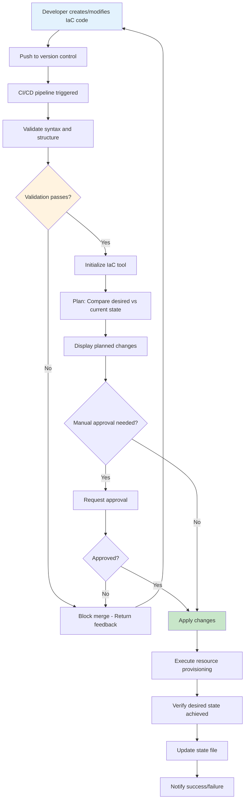

# Infrastructure as Code

## Overview

Infrastructure as Code (IaC) is the practice of managing and provisioning computing infrastructure through machine-readable definition files rather than physical hardware configuration or interactive configuration tools. This approach brings software engineering practices to infrastructure management, enabling version control, automated testing, code review, and collaborative development of infrastructure definitions.

The concept emerged from the need to treat infrastructure with the same rigor as application code. In traditional IT operations, infrastructure was manually provisioned and configured, leading to inconsistencies between environments, difficulties in reproducing configurations, and operational drift over time. IaC addresses these challenges by defining infrastructure in declarative configuration files that can be versioned, reviewed, and executed automatically.

Modern IaC tools operate by comparing the desired state defined in configuration files against the current state of the infrastructure, then determining and executing the changes needed to achieve the desired state. This idempotent approach ensures that applying the same configuration multiple times produces the same result, regardless of the initial state. This property is crucial for achieving consistent, repeatable infrastructure deployments.

The benefits of IaC extend beyond consistency. Teams can automate infrastructure provisioning, reducing manual effort and errors. Multiple environments can be rapidly created from the same definitions, enabling consistent development, staging, and production setups. Infrastructure changes become auditable through version control history. Disaster recovery improves as infrastructure can be recreated from code. And teams can implement GitOps workflows where infrastructure changes follow the same review and deployment processes as application code.

Popular IaC tools include Terraform (which works across multiple cloud providers), AWS CloudFormation (for AWS resources), Ansible (which uses an agentless push model), Chef and Puppet (which use a pull-based configuration management approach), and Pulumi (which allows infrastructure definition using general-purpose programming languages).

## Flow Chart



## Standard Example

```hcl
# Terraform Infrastructure Configuration
# This example demonstrates a complete infrastructure setup

# Configure Terraform provider
terraform {
  required_version = ">= 1.5.0"
  
  required_providers {
    aws = {
      source  = "hashicorp/aws"
      version = "~> 5.0"
    }
    random = {
      source  = "hashicorp/random"
      version = "~> 3.5"
    }
  }
  
  # Remote state storage for collaboration
  backend "s3" {
    bucket         = "terraform-state-bucket"
    key            = "prod/infrastructure/terraform.tfstate"
    region         = "us-east-1"
    dynamodb_table = "terraform-locks"
    encrypt        = true
  }
}

# Variables for customization
variable "environment" {
  description = "Environment name (dev, staging, prod)"
  type        = string
  validation {
    condition     = contains(["dev", "staging", "prod"], var.environment)
    error_message = "Environment must be dev, staging, or prod."
  }
}

variable "vpc_cidr" {
  description = "CIDR block for VPC"
  type        = string
  default     = "10.0.0.0/16"
}

variable "availability_zones" {
  description = "List of availability zones"
  type        = list(string)
  default     = ["us-east-1a", "us-east-1b", "us-east-1c"]
}

variable "tags" {
  description = "Tags to apply to resources"
  type        = map(string)
  default     = {}
}

# Local values for computed values
locals {
  common_tags = merge(var.tags, {
    Environment = var.environment
    ManagedBy   = "Terraform"
    Project     = "Microservices"
  })
  
  name_prefix = "myapp-${var.environment}"
}

# Provider configuration
provider "aws" {
  region = "us-east-1"
  
  default_tags {
    tags = local.common_tags
  }
}

# VPC Configuration
resource "aws_vpc" "main" {
  cidr_block           = var.vpc_cidr
  enable_dns_hostnames = true
  enable_dns_support  = true
  
  tags = {
    Name = "${local.name_prefix}-vpc"
  }
}

# Internet Gateway
resource "aws_internet_gateway" "main" {
  vpc_id = aws_vpc.main.id
  
  tags = {
    Name = "${local.name_prefix}-igw"
  }
}

# Public Subnets
resource "aws_subnet" "public" {
  count                   = length(var.availability_zones)
  vpc_id                  = aws_vpc.main.id
  cidr_block             = cidrsubnet(var.vpc_cidr, 4, count.index)
  availability_zone       = var.availability_zones[count.index]
  map_public_ip_on_launch = true
  
  tags = {
    Name = "${local.name_prefix}-public-${count.index + 1}"
    Type = "Public"
  }
}

# Private Subnets
resource "aws_subnet" "private" {
  count             = length(var.availability_zones)
  vpc_id            = aws_vpc.main.id
  cidr_block        = cidrsubnet(var.vpc_cidr, 4, count.index + length(var.availability_zones))
  availability_zone = var.availability_zones[count.index]
  
  tags = {
    Name = "${local.name_prefix}-private-${count.index + 1}"
    Type = "Private"
  }
}

# Route Tables
resource "aws_route_table" "public" {
  vpc_id = aws_vpc.main.id
  
  route {
    cidr_block = "0.0.0.0/0"
    gateway_id = aws_internet_gateway.main.id
  }
  
  tags = {
    Name = "${local.name_prefix}-public-rt"
  }
}

resource "aws_route_table_association" "public" {
  count          = length(var.availability_zones)
  subnet_id      = aws_subnet.public[count.index].id
  route_table_id = aws_route_table.public.id
}

# Security Groups
resource "aws_security_group" "alb" {
  name        = "${local.name_prefix}-alb-sg"
  description = "Security group for Application Load Balancer"
  vpc_id      = aws_vpc.main.id
  
  ingress {
    description = "HTTP"
    from_port   = 80
    to_port     = 80
    protocol    = "tcp"
    cidr_blocks = ["0.0.0.0/0"]
  }
  
  ingress {
    description = "HTTPS"
    from_port   = 443
    to_port     = 443
    protocol    = "tcp"
    cidr_blocks = ["0.0.0.0/0"]
  }
  
  egress {
    from_port   = 0
    to_port     = 0
    protocol    = "-1"
    cidr_blocks = ["0.0.0.0/0"]
  }
}

resource "aws_security_group" "ecs" {
  name        = "${local.name_prefix}-ecs-sg"
  description = "Security group for ECS tasks"
  vpc_id      = aws_vpc.main.id
  
  ingress {
    description     = "From ALB"
    from_port       = 8080
    to_port         = 8080
    protocol        = "tcp"
    security_groups = [aws_security_group.alb.id]
  }
  
  egress {
    from_port   = 0
    to_port     = 0
    protocol    = "-1"
    cidr_blocks = ["0.0.0.0/0"]
  }
}

# Application Load Balancer
resource "aws_lb" "main" {
  name               = "${local.name_prefix}-alb"
  internal           = false
  load_balancer_type = "application"
  security_groups    = [aws_security_group.alb.id]
  subnets            = aws_subnet.public[*].id
  
  enable_deletion_protection = var.environment == "prod" ? true : false
  
  tags = {
    Name = "${local.name_prefix}-alb"
  }
}

resource "aws_lb_target_group" "app" {
  name     = "${local.name_prefix}-tg"
  port     = 8080
  protocol = "HTTP"
  vpc_id   = aws_vpc.main.id
  
  health_check {
    enabled             = true
    healthy_threshold   = 2
    unhealthy_threshold = 2
    timeout             = 5
    interval            = 30
    path                = "/health"
    matcher             = "200"
  }
}

resource "aws_lb_listener" "http" {
  load_balancer_arn = aws_lb.main.arn
  port              = "80"
  protocol          = "HTTP"
  
  default_action {
    type             = "forward"
    target_group_arn = aws_lb_target_group.app.arn
  }
}

# ECS Cluster
resource "aws_ecs_cluster" "main" {
  name = "${local.name_prefix}-cluster"
  
  setting {
    name  = "containerInsights"
    value = "enabled"
  }
  
  tags = {
    Name = "${local.name_prefix}-cluster"
  }
}

# ECS Task Definition
resource "aws_ecs_task_definition" "app" {
  family                   = "${local.name_prefix}-task"
  network_mode             = "awsvpc"
  requires_compatibilities = ["FARGATE"]
  cpu                      = "256"
  memory                   = "512"
  execution_role_arn       = aws_iam_role.ecs_execution.arn
  task_role_arn            = aws_iam_role.ecs_task.arn
  
  container_definitions = jsonencode([
    {
      name      = "app"
      image     = "nginx:latest"
      essential = true
      portMappings = [
        {
          containerPort = 8080
          protocol      = "tcp"
        }
      ]
      logConfiguration = {
        logDriver = "awslogs"
        options = {
          "awslogs-group"         = "/ecs/${local.name_prefix}-task"
          "awslogs-region"       = "us-east-1"
          "awslogs-stream-prefix": "ecs"
        }
      }
    }
  ])
}

# ECS Service
resource "aws_ecs_service" "main" {
  name            = "${local.name_prefix}-service"
  cluster         = aws_ecs_cluster.main.id
  task_definition = aws_ecs_task_definition.app.arn
  desired_count   = var.environment == "prod" ? 3 : 2
  launch_type     = "FARGATE"
  
  network_configuration {
    subnets          = aws_subnet.private[*].id
    security_groups  = [aws_security_group.ecs.id]
    assign_public_ip = false
  }
  
  load_balancer {
    target_group_arn = aws_lb_target_group.app.arn
    container_name   = "app"
    container_port   = 8080
  }
  
  depends_on = [aws_lb_listener.http]
  
  lifecycle {
    ignore_changes = [desired_count]
  }
}

# IAM Roles
resource "aws_iam_role" "ecs_execution" {
  name = "${local.name_prefix}-ecs-execution-role"
  
  assume_role_policy = jsonencode({
    Version = "2012-10-17"
    Statement = [{
      Action = "sts:AssumeRole"
      Effect = "Allow"
      Principal = {
        Service = "ecs-tasks.amazonaws.com"
      }
    }]
  })
}

resource "aws_iam_role_policy_attachment" "ecs_execution" {
  role       = aws_iam_role.ecs_execution.name
  policy_arn = "arn:aws:iam::aws:policy/service-role/AmazonECSTaskExecutionRolePolicy"
}

resource "aws_iam_role" "ecs_task" {
  name = "${local.name_prefix}-ecs-task-role"
  
  assume_role_policy = jsonencode({
    Version = "2012-10-17"
    Statement = [{
      Action = "sts:AssumeRole"
      Effect = "Allow"
      Principal = {
        Service = "ecs-tasks.amazonaws.com"
      }
    }]
  })
}

# Outputs
output "vpc_id" {
  description = "ID of the VPC"
  value       = aws_vpc.main.id
}

output "alb_dns_name" {
  description = "DNS name of the Application Load Balancer"
  value       = aws_lb.main.dns_name
}

output "ecs_cluster_name" {
  description = "Name of the ECS Cluster"
  value       = aws_ecs_cluster.main.name
}
```

```bash
#!/bin/bash
# infrastructure-test.sh - Test infrastructure changes before applying

set -e

echo "=== Running Infrastructure Tests ==="

# Check Terraform syntax
echo "Validating Terraform configuration..."
terraform fmt -check -recursive
terraform validate

# Run plan and capture output
echo "Generating execution plan..."
terraform plan -out=tfplan

# Display plan summary
echo "Plan Summary:"
terraform show -json tfplan | jq -r '
  .resource_changes[] | 
  select(.change.actions | length > 0) |
  "\(.type) \(.change.actions | join(", "))"
'

# Run automated tests using Terratest
echo "Running infrastructure tests..."
go test -v -timeout 30m ./tests/...

# If tests pass, apply
if [ $? -eq 0 ]; then
  echo "Applying changes..."
  terraform apply tfplan
else
  echo "Tests failed - not applying changes"
  exit 1
fi

echo "=== Infrastructure Deployment Complete ==="
```

## Real-World Examples

### Example 1: Netflix Infrastructure Automation

Netflix uses a combination of custom tooling and open-source projects to manage their massive AWS infrastructure. Their Eureka service registry, Zuul edge gateway, and Titus container management platform are all defined as code. Netflix's deployment automation can provision thousands of instances across multiple regions in minutes, with all configurations stored in version control. Their infrastructure code undergoes rigorous code review and automated testing before any changes are applied.

### Example 2: Spotify Infrastructure with Terraform

Spotify manages their infrastructure using Terraform with a custom internal workflow built on top of it. Their infrastructure code is organized in modules that are shared across teams. Each team owns their infrastructure and can provision resources within their allocated quotas. Spotify uses Spinnaker for deployment orchestration and integrates Terraform with their internal service catalog for self-service infrastructure provisioning.

### Example 3: Airbnb's Infrastructure Modules

Airbnb created a library of Terraform modules that encapsulate common infrastructure patterns. Their "airflow" modules handle the creation of ECS clusters, load balancers, and associated networking. Teams compose these modules to create their specific infrastructure configurations. This approach ensures consistency while allowing flexibility. All infrastructure changes go through code review and automated testing in CI/CD pipelines.

### Example 4: Capital One's Cloud-First IaC

Capital One adopted a cloud-first strategy with heavy investment in Infrastructure as Code. Their "Cloud Custodian" tool provides policy-as-code enforcement, ensuring infrastructure complies with security and operational policies. They use Terraform Enterprise for state management and have built custom tooling to integrate with their internal governance workflows.

### Example 5: Shopify's Monorepo Infrastructure

Shopify keeps their infrastructure code in the same monorepo as their application code. Their Terraform configuration defines the entire infrastructure for each environment. When developers modify code that requires infrastructure changes, they modify both in the same PR. This tight integration ensures infrastructure and application changes are always synchronized.

## Output Statement

Infrastructure as Code transforms infrastructure management from a manual, error-prone process into a controlled, automated, and repeatable practice. By defining infrastructure in code, organizations can achieve consistency across environments, enable rapid provisioning, maintain audit trails, and implement GitOps workflows. The key to successful IaC adoption is establishing appropriate module patterns, implementing rigorous testing, and developing governance processes that balance autonomy with control. Organizations should start with foundational infrastructure components and progressively expand to cover more complex configurations.

## Best Practices

1. **Store infrastructure code in version control**: All IaC configurations should be in the same version control system as application code. This enables code review, change tracking, and rollback capabilities.

2. **Use modules for reusability**: Create modular, parameterized configurations for common infrastructure patterns. Modules should be versioned and published to a registry for consumption by other teams.

3. **Implement proper state management**: Choose appropriate state storage (remote for collaboration), enable state locking to prevent conflicts, and consider state encryption for sensitive data.

4. **Validate changes before applying**: Always run plan operations before apply to review planned changes. Use policy-as-code tools like Sentinel, OPA, or Checkov to enforce compliance rules.

5. **Implement proper secret management**: Never store secrets in configuration files. Use dedicated secrets management solutions like HashiCorp Vault, AWS Secrets Manager, or Azure Key Vault.

6. **Separate concerns with workspaces**: Use separate workspaces or directories for different environments (dev, staging, prod). This provides isolation and prevents accidental cross-environment changes.

7. **Test infrastructure code**: Implement automated testing for infrastructure using tools like Terratest, kitchen-terraform, or other IaC testing frameworks. Test that resources are created correctly and behave as expected.

8. **Enforce naming conventions**: Establish and enforce consistent naming conventions for resources. This improves readability and makes it easier to identify resources in logs and dashboards.

9. **Implement drift detection**: Regularly compare actual infrastructure state against the desired state in code to detect and remediate drift. Some tools provide this natively; others require custom automation.

10. **Document infrastructure decisions**: Maintain documentation explaining why infrastructure choices were made. Include architecture decision records (ADRs) for significant changes.