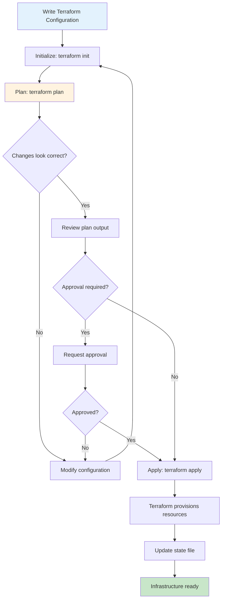

# Terraform Patterns

## Overview

Terraform is an open-source Infrastructure as Code tool created by HashiCorp that enables declarative provisioning of infrastructure across multiple cloud providers and services. It uses a configuration language called HCL (HashiCorp Configuration Language) to define desired infrastructure state, then automatically provisions and manages that infrastructure through a concept called "plan and apply".

The power of Terraform lies in its provider ecosystem and state management. Providers exist for virtually every major cloud service (AWS, Azure, GCP), SaaS platforms, and even on-premises infrastructure. The state file acts as the source of truth for the current infrastructure, allowing Terraform to determine the minimal set of changes needed to achieve the desired state.

Terraform patterns are proven approaches and architectural structures that emerge from real-world usage of the tool. These patterns help teams organize their Terraform code for scalability, maintainability, and collaboration. They address challenges like managing multiple environments, organizing modules for reuse, handling sensitive data, and implementing proper workflows.

The modular architecture of Terraform encourages code reuse through modules. A module is a container for multiple resources that are used together. Teams can create their own modules to encapsulate infrastructure patterns, or use modules from the public Terraform Registry. This composition model allows complex infrastructure to be built from simpler building blocks.

State management is critical in Terraform usage. The state must be stored remotely for team collaboration, protected with appropriate access controls, and handled carefully to avoid corruption or loss. Terraform Cloud and Terraform Enterprise provide managed state storage with additional features, while teams can also use S3 with DynamoDB locking for self-hosted solutions.

## Flow Chart



## Standard Example

```hcl
# Terraform Root Module - Entry point for infrastructure
# This demonstrates comprehensive Terraform patterns

# =============================================================================
# ORGANIZATION: Pattern-based Terraform configuration
# =============================================================================

terraform {
  required_version = ">= 1.5.0"
  
  required_providers {
    aws = {
      source  = "hashicorp/aws"
      version = "~> 5.0"
    }
    random = {
      source  = "hashicorp/random"
      version = "~> 3.5"
    }
    archive = {
      source  = "hashicorp/archive"
      version = "~> 2.4"
    }
    cloudinit = {
      source  = "hashicorp/cloudinit"
      version = "~> 2.3"
    }
  }
}

# =============================================================================
# DATA SOURCES: Read existing infrastructure
# =============================================================================

data "aws_caller_identity" "current" {}
data "aws_region" "current" {}
data "aws_availability_zones" "available" {}

data "terraform_remote_state" "network" {
  backend = "s3"
  config = {
    bucket = "terraform-state-bucket"
    key    = "network/terraform.tfstate"
  }
}

# =============================================================================
# VARIABLES: Input parameters for customization
# =============================================================================

variable "environment" {
  description = "Environment name"
  type        = string
  validation {
    condition     = can(regex("^(dev|staging|prod)$", var.environment))
    error_message = "Must be dev, staging, or prod."
  }
}

variable "project_name" {
  description = "Project name for resource naming"
  type        = string
  default     = "myapp"
}

variable "instance_config" {
  description = "EC2 instance configuration"
  type = object({
    instance_type = string
    volume_size   = number
    volume_type   = string
  })
  default = {
    instance_type = "t3.medium"
    volume_size   = 50
    volume_type   = "gp3"
  }
}

variable "tags" {
  description = "Common tags for all resources"
  type        = map(string)
  default     = {}
}

variable "enable_deletion_protection" {
  description = "Enable deletion protection for critical resources"
  type        = bool
  default     = false
}

# =============================================================================
# LOCALS: Computed values and formatting
# =============================================================================

locals {
  name_prefix = "${var.project_name}-${var.environment}"
  
  common_tags = merge(
    var.tags,
    {
      Environment = var.environment
      Project     = var.project_name
      ManagedBy   = "Terraform"
      Owner       = "platform-team"
    }
  )
  
  all_azs = data.aws_availability_zones.available.names
  
  ami_map = {
    dev     = "ami-0abcdef1234567890"
    staging = "ami-0abcdef1234567890"
    prod    = "ami-0abcdef1234567890"
  }
}

# =============================================================================
# PROVIDER CONFIGURATION
# =============================================================================

provider "aws" {
  region = "us-east-1"
  
  default_tags {
    tags = local.common_tags
  }
  
  skip_credentials_validation = false
  skip_requesting_account_id = false
}

# =============================================================================
# NETWORK MODULE USAGE
# =============================================================================

module "network" {
  source = "./modules/network"
  
  environment     = var.environment
  project_name   = var.project_name
  vpc_cidr       = "10.0.0.0/16"
  availability_zones = local.all_azs
  
  tags = local.common_tags
}

# =============================================================================
# SECURITY MODULE USAGE
# =============================================================================

module "security" {
  source = "./modules/security"
  
  environment         = var.environment
  project_name       = var.project_name
  vpc_id             = module.network.vpc_id
  allowed_ssh_cidrs  = ["10.0.0.0/8"]
  
  tags = local.common_tags
}

# =============================================================================
# COMPUTE MODULE USAGE
# =============================================================================

module "compute" {
  source = "./modules/compute"
  
  environment          = var.environment
  project_name        = var.project_name
  vpc_id              = module.network.vpc_id
  subnet_ids          = module.network.private_subnet_ids
  security_group_ids  = [module.security.instance_sg_id]
  instance_config    = var.instance_config
  ami_id              = local.ami_map[var.environment]
  
  tags = local.common_tags
  
  depends_on = [
    module.network,
    module.security
  ]
}

# =============================================================================
# DATABASE MODULE USAGE
# =============================================================================

module "database" {
  source = "./modules/database"
  
  environment              = var.environment
  project_name            = var.project_name
  vpc_id                  = module.network.vpc_id
  subnet_ids              = module.network.private_subnet_ids
  db_instance_class       = var.environment == "prod" ? "db.r6g.xlarge" : "db.t3.medium"
  allocated_storage       = var.environment == "prod" ? 500 : 100
  backup_retention_days   = var.environment == "prod" ? 30 : 7
  multi_az                = var.environment == "prod"
  
  tags = local.common_tags
  
  depends_on = [module.network]
}

# =============================================================================
# RANDOM ID GENERATION
# =============================================================================

resource "random_id" "bucket_suffix" {
  byte_length = 8
}

# =============================================================================
# S3 BUCKET FOR APPLICATION DATA
# =============================================================================

resource "aws_s3_bucket" "app_data" {
  bucket = "${local.name_prefix}-data-${random_id.bucket_suffix.hex}"
  
  tags = local.common_tags
}

resource "aws_s3_bucket_versioning" "app_data" {
  bucket = aws_s3_bucket.app_data.id
  
  versioning_configuration {
    status = "Enabled"
  }
}

resource "aws_s3_bucket_server_side_encryption" "app_data" {
  bucket = aws_s3_bucket.app_data.id
  
  server_side_encryption_configuration {
    rule {
      apply_server_side_encryption_by_default {
        sse_algorithm = "AES256"
      }
    }
  }
}

resource "aws_s3_bucket_public_access_block" "app_data" {
  bucket = aws_s3_bucket.app_data.id
  
  block_public_acls       = true
  block_public_policy     = true
  ignore_public_acls      = true
  restrict_public_buckets = true
}

# =============================================================================
# DYNAMODB TABLE FOR APPLICATION STATE
# =============================================================================

resource "aws_dynamodb_table" "app_state" {
  name           = "${local.name_prefix}-state"
  billing_mode   = "PAY_PER_REQUEST"
  hash_key       = "id"
  
  attribute {
    name = "id"
    type = "S"
  }
  
  ttl {
    attribute_name = "expires_at"
    enabled        = true
  }
  
  tags = local.common_tags
}

# =============================================================================
# IAM ROLE FOR APPLICATION
# =============================================================================

resource "aws_iam_role" "app_role" {
  name = "${local.name_prefix}-app-role"
  
  assume_role_policy = jsonencode({
    Version = "2012-10-17"
    Statement = [{
      Action = "sts:AssumeRole"
      Effect = "Allow"
      Principal = {
        Service = "ec2.amazonaws.com"
      }
    }]
  })
}

resource "aws_iam_role_policy" "app_s3_read" {
  name = "${local.name_prefix}-s3-read"
  role = aws_iam_role.app_role.id
  
  policy = jsonencode({
    Version = "2012-10-17"
    Statement = [{
      Action = [
        "s3:GetObject",
        "s3:ListBucket"
      ]
      Effect = "Allow"
      Resource = [
        aws_s3_bucket.app_data.arn,
        "${aws_s3_bucket.app_data.arn}/*"
      ]
    }]
  })
}

resource "aws_iam_role_policy" "app_dynamodb" {
  name = "${local.name_prefix}-dynamodb"
  role = aws_iam_role.app_role.id
  
  policy = jsonencode({
    Version = "2012-10-17"
    Statement = [{
      Action = [
        "dynamodb:GetItem",
        "dynamodb:PutItem",
        "dynamodb:Query"
      ]
      Effect = "Allow"
      Resource = aws_dynamodb_table.app_state.arn
    }]
  })
}

# =============================================================================
# CLOUDWATCH LOG GROUP
# =============================================================================

resource "aws_cloudwatch_log_group" "app_logs" {
  name              = "/aws/${local.name_prefix}"
  retention_in_days = var.environment == "prod" ? 30 : 7
  
  tags = local.common_tags
}

# =============================================================================
# OUTPUTS: Expose values to other configurations
# =============================================================================

output "environment" {
  description = "Environment name"
  value       = var.environment
}

output "vpc_id" {
  description = "ID of the VPC"
  value       = module.network.vpc_id
}

output "compute_instance_ids" {
  description = "IDs of compute instances"
  value       = module.compute.instance_ids
}

output "database_endpoint" {
  description = "Database connection endpoint"
  value       = module.database.endpoint
  sensitive   = true
}

output "s3_bucket_name" {
  description = "S3 bucket name for application data"
  value       = aws_s3_bucket.app_data.id
}

output "dynamodb_table_name" {
  description = "DynamoDB table name for application state"
  value       = aws_dynamodb_table.app_state.name
}
```

```hcl
# module-example/modules/compute/main.tf
# Example of well-structured module

variable "environment" {
  description = "Environment name"
  type        = string
}

variable "project_name" {
  description = "Project name"
  type        = string
}

variable "vpc_id" {
  description = "VPC ID for security groups"
  type        = string
}

variable "subnet_ids" {
  description = "Subnet IDs for instances"
  type        = list(string)
}

variable "security_group_ids" {
  description = "Additional security groups"
  type        = list(string)
  default     = []
}

variable "instance_config" {
  description = "Instance configuration"
  type = object({
    instance_type = string
    volume_size   = number
    volume_type   = string
  })
}

variable "ami_id" {
  description = "AMI ID for instances"
  type        = string
}

variable "tags" {
  description = "Tags to apply to resources"
  type        = map(string)
  default     = {}
}

locals {
  name_prefix = "${var.project_name}-${var.environment}"
  
  instance_tags = merge(var.tags, {
    Name = "${local.name_prefix}-instance"
    Role = "compute"
  })
}

resource "aws_instance" "app" {
  count = 3
  
  ami           = var.ami_id
  instance_type = var.instance_config.instance_type
  
  subnet_id = var.subnet_ids[count.index % length(var.subnet_ids)]
  
  vpc_security_group_ids = concat(
    [aws_security_group.instance.id],
    var.security_group_ids
  )
  
  root_block_device {
    volume_size = var.instance_config.volume_size
    volume_type = var.instance_config.volume_type
    encrypted   = true
  }
  
  tags = local.instance_tags
  
  lifecycle {
    create_before_destroy = true
  }
}

resource "aws_security_group" "instance" {
  name        = "${local.name_prefix}-compute-sg"
  description = "Security group for compute instances"
  vpc_id      = var.vpc_id
  
  ingress {
    from_port   = 443
    to_port     = 443
    protocol    = "tcp"
    cidr_blocks = ["10.0.0.0/8"]
  }
  
  egress {
    from_port   = 0
    to_port     = 0
    protocol    = "-1"
    cidr_blocks = ["0.0.0.0/0"]
  }
  
  tags = var.tags
}

output "instance_ids" {
  description = "IDs of created instances"
  value       = aws_instance.app[*].id
}

output "private_ips" {
  description = "Private IP addresses of instances"
  value       = aws_instance.app[*].private_ip
}
```

## Real-World Examples

### Example 1: Terraform Workspaces for Multi-Environment

A common pattern is using Terraform workspaces to manage multiple environments. Each workspace maintains its own state file, allowing the same configuration to be applied to dev, staging, and production with different variable values. The workspace is selected either in the configuration or via the command line, and resources are tagged with the environment name to distinguish them.

### Example 2: Module Composition for Kubernetes

Teams running Kubernetes on AWS commonly compose modules for EKS cluster, node groups, add-ons (like nginx-ingress, metrics-server, external-dns), and networking. Each module is maintained by a different team but consumed together in the root module. This pattern enables teams to upgrade components independently while maintaining consistent base infrastructure.

### Example 3: Remote State with Data Sources

For complex architectures, one Terraform configuration provisions networking (VPC, subnets, routing) and stores state remotely. Subsequent configurations for compute, database, and application layers use terraform_remote_state data source to read the network details. This separation allows different teams to own different parts of the infrastructure while maintaining dependencies.

### Example 4: Conditional Resources Based on Environment

Organizations often need different configurations for different environments. Using conditional expressions, Terraform can create resources only in certain environments or with different configurations. For example, production might have Multi-AZ RDS with read replicas while dev uses a single instance.

### Example 5: Terratest for Infrastructure Testing

Mature teams implement automated testing of Terraform configurations using Terratest (Go-based testing). Tests create real resources, verify they have expected properties, then clean up. This catches configuration errors before apply and validates that infrastructure behaves as expected.

## Output Statement

Terraform patterns enable scalable, maintainable infrastructure management through modular design, proper state handling, and workflow integration. The key patterns include organizing code into modules for reuse, using workspaces or directories for environment separation, implementing proper state management with remote storage, and validating changes through plan and policy checks. Teams should invest in creating well-designed modules that encapsulate organizational standards and patterns, enabling self-service infrastructure provisioning while maintaining consistency.

## Best Practices

1. **Use modules for organization**: Create reusable modules for common infrastructure patterns. Publish modules to a private registry for organization-wide consumption. Keep modules focused and composable.

2. **Implement proper state management**: Use remote state storage (S3, Terraform Cloud) for team collaboration. Enable state locking to prevent concurrent modifications. Protect state with appropriate access controls and encryption.

3. **Separate environments appropriately**: Choose between workspaces or separate directories based on your workflow. Workspaces are simpler but have limitations; directories provide more isolation but require more automation.

4. **Always review plans before applying**: Never apply without reviewing the plan. Use policy-as-code to enforce organizational standards automatically during plan review.

5. **Use validation in CI/CD**: Implement automated validation in pipelines - syntax checking, formatting, validation, and policy enforcement should all run automatically before merge.

6. **Handle secrets properly**: Never store secrets in Terraform configuration or state files. Use external secrets management with data sources or the terraform provider for HashiCorp Vault.

7. **Implement tagging strategies**: Establish consistent tagging across all resources. Use locals to merge common tags with resource-specific tags.

8. **Use for_each and count appropriately**: Use for_each when resources are distinct and need individual identification. Use count when resources are identical in configuration.

9. **Implement drift detection**: Regularly run terraform refresh or plan to detect infrastructure drift. Address drift through configuration updates or manual reconciliation.

10. **Document module interfaces**: Clearly document required and optional variables, expected outputs, and any dependencies for modules. Good documentation enables self-service consumption.