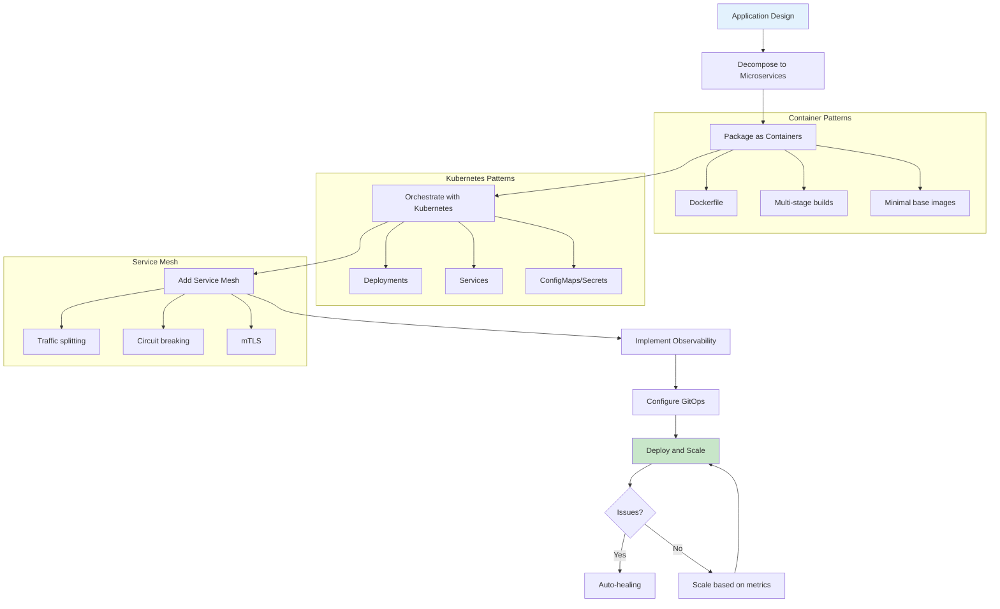

# Cloud Native Patterns

## Overview

Cloud Native refers to an approach to building and running applications that exploit the advantages of the cloud computing model. Cloud Native applications are designed and built to run on cloud platforms, taking full advantage of cloud computing models including containers, microservices, serverless computing, immutable infrastructure, and declarative APIs.

The Cloud Native Computing Foundation (CNCF) defines cloud native technologies as enabling organizations to build and run scalable applications in modern, dynamic environments such as public, private, and hybrid clouds. These technologies include containers, service meshes, microservices, immutable infrastructure, and declarative APIs. Together, these patterns enable loosely coupled systems that are resilient, manageable, and observable.

The emergence of cloud native patterns was driven by the limitations of traditional application deployment. Monolithic applications struggled to scale, update quickly, and recover from failures. Cloud native patterns address these limitations through decomposition (microservices), packaging (containers), orchestration (Kubernetes), and operational practices (observability, automation).

Cloud native architecture typically involves several key patterns working together. Containers provide consistent packaging across environments. Microservices enable independent deployment and scaling. Service meshes handle service-to-service communication. Kubernetes provides orchestration and management. Observability tools provide insight into system behavior. And declarative infrastructure enables reproducible deployments.

The benefits of cloud native include rapid scaling based on demand, resilience through redundancy and automatic recovery, faster development cycles through independent services, efficient resource utilization, and operational automation through declarative specifications. However, these benefits come with increased complexity in operations, networking, and distributed system management.

## Flow Chart



## Standard Example

```yaml
# Kubernetes Cloud Native Deployment
# This comprehensive example demonstrates multiple cloud native patterns

---
# Namespace for logical isolation
apiVersion: v1
kind: Namespace
metadata:
  name: production
  labels:
    environment: production
    team: platform

---
# ResourceQuota - Resource limits per namespace
apiVersion: v1
kind: ResourceQuota
metadata:
  name: compute-quota
  namespace: production
spec:
  hard:
    requests.cpu: "10"
    requests.memory: 20Gi
    limits.cpu: "20"
    limits.memory: 40Gi
    persistentvolumeclaims: "10"
    pods: "50"

---
# LimitRange - Default resource limits
apiVersion: v1
kind: LimitRange
metadata:
  name: default-limits
  namespace: production
spec:
  limits:
  - default:
      cpu: "500m"
      memory: "512Mi"
    defaultRequest:
      cpu: "200m"
      memory: "256Mi"
    type: Container

---
# NetworkPolicy - Zero-trust networking
apiVersion: networking.k8s.io/v1
kind: NetworkPolicy
metadata:
  name: app-network-policy
  namespace: production
spec:
  podSelector:
    matchLabels:
      app: api-service
  policyTypes:
  - Ingress
  - Egress
  ingress:
  - from:
    - podSelector:
        matchLabels:
          app: ingress-controller
    ports:
    - protocol: TCP
      port: 8080
  - from:
    - namespaceSelector:
        matchLabels:
          name: production
    ports:
    - protocol: TCP
      port: 8080
  egress:
  - to:
    - podSelector:
        matchLabels:
          app: database
    ports:
    - protocol: TCP
      port: 5432
  - to:
    - namespaceSelector: {}
      podSelector:
        matchLabels:
          k8s-app: kube-dns

---
# HorizontalPodAutoscaler - Auto-scaling based on metrics
apiVersion: autoscaling/v2
kind: HorizontalPodAutoscaler
metadata:
  name: api-service-hpa
  namespace: production
spec:
  scaleTargetRef:
    apiVersion: apps/v1
    kind: Deployment
    name: api-service
  minReplicas: 3
  maxReplicas: 20
  metrics:
  - type: Resource
    resource:
      name: cpu
      target:
        type: Utilization
        averageUtilization: 70
  - type: Resource
    resource:
      name: memory
      target:
        type: Utilization
        averageUtilization: 80
  - type: Pods
    pods:
      metric:
        name: http_requests_per_second
      target:
        type: AverageValue
        averageValue: "1000"
  behavior:
    scaleDown:
      stabilizationWindowSeconds: 300
      policies:
      - type: Percent
        value: 10
        periodSeconds: 60
    scaleUp:
      stabilizationWindowSeconds: 0
      policies:
      - type: Percent
        value: 100
        periodSeconds: 15

---
# PodDisruptionBudget - Maintain availability during disruptions
apiVersion: policy/v1
kind: PodDisruptionBudget
metadata:
  name: api-service-pdb
  namespace: production
spec:
  minAvailable: 2
  selector:
    matchLabels:
      app: api-service

---
# Deployment - Application deployment with rolling update
apiVersion: apps/v1
kind: Deployment
metadata:
  name: api-service
  namespace: production
  labels:
    app: api-service
    version: v2.0.0
spec:
  replicas: 5
  strategy:
    type: RollingUpdate
    rollingUpdate:
      maxUnavailable: 1
      maxSurge: 2
  selector:
    matchLabels:
      app: api-service
  template:
    metadata:
      labels:
        app: api-service
        version: v2.0.0
      annotations:
        prometheus.io/scrape: "true"
        prometheus.io/port: "9090"
    spec:
      terminationGracePeriodSeconds: 30
      affinity:
        podAntiAffinity:
          preferredDuringSchedulingIgnoredDuringExecution:
          - weight: 100
            podAffinityTerm:
              labelSelector:
                matchLabels:
                  app: api-service
              topologyKey: kubernetes.io/hostname
        nodeAffinity:
          preferredDuringSchedulingIgnoredDuringExecution:
          - weight: 80
            preference:
              matchExpressions:
              - key: node-type
                operator: In
                values:
                - compute-optimized
      topologySpreadConstraints:
      - maxSkew: 1
        topologyKey: topology.kubernetes.io/zone
        whenUnsatisfiable: ScheduleAnyway
        labelSelector:
          matchLabels:
            app: api-service
      containers:
      - name: api
        image: myapp/api:2.0.0
        imagePullPolicy: Always
        ports:
        - containerPort: 8080
          name: http
        - containerPort: 9090
          name: metrics
        env:
        - name: ENV
          value: "production"
        - name: LOG_LEVEL
          value: "info"
        - name: DB_HOST
          valueFrom:
            configMapKeyRef:
              name: api-config
              key: database.host
        - name: API_KEY
          valueFrom:
            secretKeyRef:
              name: api-secrets
              key: api-key
        resources:
          requests:
            cpu: "200m"
            memory: "256Mi"
            ephemeral-storage: "1Gi"
          limits:
            cpu: "1000m"
            memory: "512Mi"
            ephemeral-storage: "2Gi"
        livenessProbe:
          httpGet:
            path: /health/live
            port: 8080
          initialDelaySeconds: 10
          periodSeconds: 10
          failureThreshold: 3
          timeoutSeconds: 5
        readinessProbe:
          httpGet:
            path: /health/ready
            port: 8080
          initialDelaySeconds: 5
          periodSeconds: 5
          failureThreshold: 3
          timeoutSeconds: 3
        startupProbe:
          httpGet:
            path: /health/startup
            port: 8080
          periodSeconds: 5
          failureThreshold: 30
        lifecycle:
          preStop:
            httpGet:
              path: /shutdown
              port: 8080
      - name: sidecar
        image: prometheus/client:1.0.0
        ports:
        - containerPort: 9090
        volumeMounts:
        - name: prometheus-config
          mountPath: /etc/prometheus
      volumes:
      - name: prometheus-config
        configMap:
          name: prometheus-config

---
# Service - Stable network endpoint
apiVersion: v1
kind: Service
metadata:
  name: api-service
  namespace: production
  labels:
    app: api-service
spec:
  type: ClusterIP
  selector:
    app: api-service
  ports:
  - name: http
    port: 80
    targetPort: 8080
  - name: metrics
    port: 9090
    targetPort: 9090
  sessionAffinity: ClientIP
  sessionAffinityConfig:
    clientIP:
      timeoutSeconds: 10800

---
# ConfigMap - Configuration data
apiVersion: v1
kind: ConfigMap
metadata:
  name: api-config
  namespace: production
data:
  database.host: "postgres.production.svc.cluster.local"
  database.port: "5432"
  database.name: "appdb"
  cache.enabled: "true"
  cache.ttl: "3600"
  rate-limit.enabled: "true"
  rate-limit.requests: "1000"

---
# Secret - Sensitive data
apiVersion: v1
kind: Secret
metadata:
  name: api-secrets
  namespace: production
type: Opaque
stringData:
  api-key: "secret-key-value"
  database-password: "db-password-value"
  jwt-secret: "jwt-secret-value"

---
# PodMonitor - Prometheus scraping
apiVersion: monitoring.coreos.com/v1
kind: PodMonitor
metadata:
  name: api-service-monitor
  namespace: production
spec:
  selector:
    matchLabels:
      app: api-service
  podMetricsEndpoints:
  - port: metrics
    path: /metrics
    interval: 15s
```

```yaml
# Istio Service Mesh Configuration
apiVersion: networking.istio.io/v1beta1
kind: VirtualService
metadata:
  name: api-service-vs
  namespace: production
spec:
  hosts:
  - api-service
  gateways:
  - ingress-gateway
  http:
  - match:
    - headers:
        x-canary:
          exact: "true"
    route:
    - destination:
        host: api-service
        subset: v2
        port:
          number: 80
      weight: 100
  - route:
    - destination:
        host: api-service
        subset: v1
        port:
          number: 80
      weight: 90
    - destination:
        host: api-service
        subset: v2
        port:
          number: 80
      weight: 10

---
apiVersion: networking.istio.io/v1beta1
kind: DestinationRule
metadata:
  name: api-service-dest
  namespace: production
spec:
  host: api-service
  trafficPolicy:
    connectionPool:
      tcp:
        maxConnections: 100
      http:
        h2UpgradePolicy: UPGRADE
        http1MaxPendingRequests: 100
        http2MaxRequests: 1000
    loadBalancer:
      simple: LEAST_CONN
    outlierDetection:
      consecutive5xxErrors: 5
      interval: 30s
      baseEjectionTime: 30s
      maxEjectionPercent: 50
  subsets:
  - name: v1
    labels:
      version: v1.0.0
  - name: v2
    labels:
      version: v2.0.0

---
apiVersion: security.istio.io/v1beta1
kind: PeerAuthentication
metadata:
  name: api-service-mtls
  namespace: production
spec:
  mtls:
    mode: STRICT

---
apiVersion: security.istio.io/v1beta1
kind: AuthorizationPolicy
metadata:
  name: api-service-auth
  namespace: production
spec:
  selector:
    matchLabels:
      app: api-service
  rules:
  - from:
    - source:
        principals:
        - "cluster.local/ns/production/sa/ingress-sa"
    to:
    - operations:
      - paths:
        - /api/*
        methods:
        - GET
        - POST
```

## Real-World Examples

### Example 1: Spotify's Kubernetes Platform

Spotify built their "Backstage" platform on Kubernetes, enabling developers to deploy services through self-service portals. Their platform handles thousands of microservices, with each team owning their own deployments, scaling, and monitoring. They use a custom abstraction layer over Kubernetes that provides standardized patterns while allowing team-specific customization.

### Example 2: Netflix's Microservices on Kubernetes

Netflix runs their streaming platform on Kubernetes with extensive use of service meshes. Their infrastructure automatically handles the massive scale of video streaming, with features like dynamic throttling, regional failover, and capacity planning. They contribute extensively to open-source projects like Eureka, Hystrix, and Zuul.

### Example 3: Airbnb's Cloud Native Infrastructure

Airbnb built their "Nighthawk" platform to enable Kubernetes adoption across the organization. They implemented multi-cluster Kubernetes to provide isolation between different product lines and provide developers with standardized deployment patterns, monitoring, and security policies.

### Example 4: Shopify's Cloud Native Commerce

Shopify runs their commerce platform on Kubernetes with a focus on reliability and scale. They use GitOps for deployment, extensive observability, and automated scaling. Their infrastructure can handle massive spikes during sales events through intelligent capacity management.

### Example 5: Google's GKE and Cloud Operations

Google's own services run on GKE, demonstrating cloud native patterns at massive scale. They use internal versions of Kubernetes (Borg) and have pioneered patterns like workload identity, managed services, and multi-cluster services that later became available in open-source Kubernetes.

## Output Statement

Cloud Native patterns enable organizations to build applications that are scalable, resilient, and manageable in cloud environments. The key patterns include containerization for consistent packaging, microservices for independent deployment, Kubernetes for orchestration, service meshes for communication handling, and observability for operational insight. Adopting these patterns requires investment in platform engineering, developer education, and operational tooling, but enables rapid innovation and efficient resource utilization.

## Best Practices

1. **Start with containerization**: Package applications in containers using Docker or similar technologies. Use minimal base images and follow best practices for image layering and caching.

2. **Implement proper resource management**: Set appropriate requests and limits for CPU and memory. Use quality-of-service classes appropriately for different workload types.

3. **Design for resilience**: Implement health checks (liveness, readiness, startup probes), pod disruption budgets, and anti-affinity rules. Design for failures rather than trying to prevent all failures.

4. **Use declarative configurations**: Define desired state in configuration files rather than imperative commands. This enables reproducibility and easier version control.

5. **Implement observability early**: Add logging, metrics, and tracing from the start. Use standard formats and integrate with common observability platforms.

6. **Secure by default**: Implement network policies, pod security policies, and secrets management. Use RBAC appropriately and enable encryption in transit.

7. **Automate deployments**: Use GitOps or similar approaches for automated, version-controlled deployments. Implement proper CI/CD pipelines with testing and validation.

8. **Use service meshes for complex communication**: For applications with many microservices, consider service meshes for traffic management, security, and observability at the service level.

9. **Implement auto-scaling**: Configure horizontal and vertical pod autoscaling based on appropriate metrics. Consider cluster autoscaling for node-level scaling.

10. **Use managed services where possible**: Leverage cloud provider managed services (databases, message queues, caches) to reduce operational burden while maintaining cloud native compatibility.