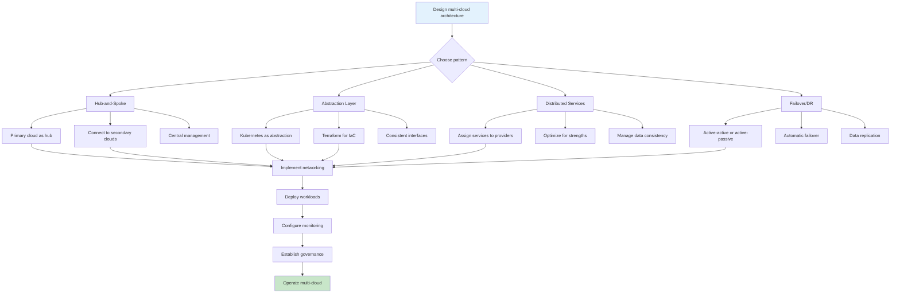

# Multi-Cloud Patterns

## Overview

Multi-cloud refers to the strategy of using cloud services from multiple providers simultaneously. This approach has gained significant traction as organizations seek to avoid vendor lock-in, optimize costs across providers, leverage best-of-breed services, and improve resilience through geographic and provider redundancy. Rather than committing entirely to AWS, Azure, Google Cloud, or any single provider, multi-cloud architectures distribute workloads across multiple clouds.

The drivers for multi-cloud adoption vary by organization. Some pursue it for risk mitigation - avoiding outages that affect all regions of a single provider. Others optimize costs by running different workloads on the most cost-effective provider for their specific requirements. Many leverage best-of-breed approaches, using each provider's strongest services for particular workloads. Regulatory requirements may also drive multi-cloud, with data sovereignty or compliance requirements mandating specific providers or regions.

However, multi-cloud introduces significant complexity that must be managed carefully. Each cloud provider has different APIs, service names, pricing models, and operational characteristics. Managing this diversity requires abstraction layers, standardized tooling, and cross-cloud expertise. Organizations must balance the benefits against the operational overhead of maintaining multiple platforms.

Several patterns have emerged for managing multi-cloud complexity. The hub-and-spoke model uses one cloud as the primary hub with connections to other clouds. The abstraction layer pattern uses tools like Kubernetes or Terraform to provide a consistent interface across providers. The distributed services pattern assigns specific services to specific providers based on their strengths. And the failover pattern maintains active-active or active-passive configurations across providers for disaster recovery.

The key to successful multi-cloud implementation is choosing the right level of abstraction. Too little abstraction creates vendor lock-in within each provider. Too much abstraction loses the benefits of each provider's unique capabilities. The optimal approach typically involves standardizing on infrastructure-level abstractions while allowing teams to leverage provider-specific services where they provide meaningful value.

## Flow Chart



## Standard Example

```hcl
# Terraform Multi-Cloud Configuration
# This example demonstrates managing multiple cloud providers

# =============================================================================
# Configuration for multiple providers
# =============================================================================

terraform {
  required_version = ">= 1.5.0"
  
  required_providers {
    aws = {
      source  = "hashicorp/aws"
      version = "~> 5.0"
    }
    azurerm = {
      source  = "hashicorp/azurerm"
      version = "~> 3.0"
    }
    google = {
      source  = "hashicorp/google"
      version = "~> 5.0"
    }
  }
  
  # Multi-cloud state management
  backend "s3" {
    bucket = "terraform-multi-cloud-state"
    key    = "infrastructure/terraform.tfstate"
    region = "us-east-1"
  }
}

# =============================================================================
# AWS Provider Configuration
# =============================================================================

provider "aws" {
  alias  = "aws_primary"
  region = "us-east-1"
  
  default_tags {
    tags = {
      ManagedBy = "Terraform"
      Platform  = "Multi-Cloud"
    }
  }
}

provider "aws" {
  alias  = "aws_secondary"
  region = "us-west-2"
}

# =============================================================================
# Azure Provider Configuration
# =============================================================================

provider "azurerm" {
  features {}
  subscription_id = var.azure_subscription_id
  tenant_id       = var.azure_tenant_id
  client_id       = var.azure_client_id
  client_secret   = var.azure_client_secret
}

# =============================================================================
# Google Cloud Provider Configuration
# =============================================================================

provider "google" {
  project = var.gcp_project_id
  region  = "us-central1"
}

# =============================================================================
# AWS Primary Region Resources
# =============================================================================

module "aws_vpc" {
  source  = "./modules/vpc"
  providers = {
    aws = aws.aws_primary
  }
  
  environment = var.environment
  cidr_block = "10.1.0.0/16"
  
  name_prefix = "primary"
}

module "aws_eks" {
  source  = "./modules/eks"
  providers = {
    aws = aws.aws_primary
  }
  
  cluster_name    = "primary-cluster"
  cluster_version = "1.28"
  vpc_id         = module.aws_vpc.vpc_id
  subnet_ids     = module.aws_vpc.private_subnet_ids
  
  node_groups = {
    general = {
      instance_types = ["m5.xlarge"]
      min_size       = 2
      max_size       = 10
      desired_size   = 3
    }
  }
}

module "aws_rds" {
  source  = "./modules/database"
  providers = {
    aws = aws.aws_primary
  }
  
  engine         = "postgres"
  engine_version = "15.3"
  instance_class = "db.r6g.xlarge"
  allocated_storage = 500
  
  vpc_id         = module.aws_vpc.vpc_id
  subnet_ids    = module.aws_vpc.private_subnet_ids
}

# =============================================================================
# AWS Secondary Region Resources (DR)
# =============================================================================

module "aws_vpc_secondary" {
  source  = "./modules/vpc"
  providers = {
    aws = aws.aws_secondary
  }
  
  environment = var.environment
  cidr_block = "10.2.0.0/16"
  
  name_prefix = "secondary"
}

module "aws_rds_replica" {
  source  = "./modules/database"
  providers = {
    aws = aws.aws_secondary
  }
  
  identifier     = "postgres-replica"
  engine         = "postgres"
  instance_class = "db.r6g.xlarge"
  source_db_instance_identifier = module.aws_rds.identifier
  
  vpc_id      = module.aws_vpc_secondary.vpc_id
  subnet_ids = module.aws_vpc_secondary.private_subnet_ids
  
  skip_final_snapshot = true
  
  tags = {
    Role = "Disaster Recovery"
  }
}

# =============================================================================
# Azure Resources
# =============================================================================

resource "azurerm_resource_group" "main" {
  name     = "multi-cloud-rg"
  location = "eastus"
  
  tags = {
    Environment = var.environment
  }
}

resource "azurerm_virtual_network" "main" {
  name                = "azure-vnet"
  address_space       = ["10.3.0.0/16"]
  location           = azurerm_resource_group.main.location
  resource_group_name = azurerm_resource_group.main.name
  
  tags = {
    Environment = var.environment
  }
}

resource "azurerm_subnet" "private" {
  name                 = "private-subnet"
  resource_group_name  = azurerm_resource_group.main.name
  virtual_network_name = azurerm_virtual_network.main.name
  address_prefixes     = ["10.3.1.0/24"]
}

resource "azurerm_kubernetes_cluster" "main" {
  name                = "azure-aks"
  location            = azurerm_resource_group.main.location
  resource_group_name = azurerm_resource_group.main.name
  dns_prefix          = "multicloud"
  
  default_node_pool {
    name       = "default"
    node_count = 3
    vm_size    = "Standard_DS2_v2"
  }
  
  identity {
    type = "SystemAssigned"
  }
  
  tags = {
    Environment = var.environment
  }
}

# =============================================================================
# Google Cloud Resources
# =============================================================================

resource "google_compute_network" "main" {
  name                    = "gcp-network"
  auto_create_subnetworks = false
  
  routing_mode = "REGIONAL"
}

resource "google_compute_subnetwork" "private" {
  name          = "gcp-private-subnet"
  region        = "us-central1"
  network       = google_compute_network.main.name
  ip_cidr_range = "10.4.0.0/16"
  
  secondary_ip_range {
    range_name    = "pod-range"
    ip_cidr_range = "10.5.0.0/16"
  }
  
  secondary_ip_range {
    range_name    = "service-range"
    ip_cidr_range = "10.6.0.0/16"
  }
}

resource "google_container_cluster" "primary" {
  name     = "gcp-gke"
  location = "us-central1"
  
  remove_default_node_pool = true
  
  initial_node_count = 3
  
  network         = google_compute_network.main.name
  subnetwork      = google_compute_subnetwork.private.name
  
  workload_identity_config {
    workload_pool = "${var.gcp_project_id}.svc.id.goog"
  }
  
  master_authorized_networks_config {
    cidr_blocks {
      cidr_block   = "10.0.0.0/8"
      display_name = "VPC"
    }
  }
}

resource "google_container_node_pool" "primary" {
  name       = "primary-nodepool"
  cluster    = google_container_cluster.primary.name
  location   = "us-central1"
  node_count = 3
  
  node_config {
    machine_type = "n2-standard-4"
    
    service_account = "default"
    scopes          = ["cloud-platform"]
  }
}

# =============================================================================
# Cross-Cloud Networking
# =============================================================================

# AWS to Azure VPN Connection
resource "aws_vpn_connection" "aws_azure" {
  vpn_gateway_id = module.aws_vpc.vpn_gateway_id
  customer_gateway_id = aws_customer_gateway.azure.id
  
  type        = "ipsec.1"
  static_routes_only = true
  
  tags = {
    Connection = "AWS-to-Azure"
  }
}

resource "aws_customer_gateway" "azure" {
  bgp_asn     = 65001
  ip_address  = azurerm_virtual_network_gateway.azure.public_ip
  type        = "ipsec.1"
  
  tags = {
    Connection = "Azure-to-AWS"
  }
}

resource "azurerm_virtual_network_gateway" "azure" {
  name                = "azure-vpn-gw"
  location            = azurerm_resource_group.main.location
  resource_group_name = azurerm_resource_group.main.name
  
  type     = "Vpn"
  vpn_type = "RouteBased"
  
  sku_name = "VpnGw1"
  
  ip_configuration {
    name                 = "vnet-gateway-ip-config"
    public_ip_address_id = azurerm_public_ip.azure.id
    subnet_id           = azurerm_subnet.gateway.id
  }
}

# =============================================================================
# Global Load Balancing
# =============================================================================

resource "aws_lb" "global" {
  name               = "multi-cloud-alb"
  internal           = false
  load_balancer_type = "application"
  security_groups   = [module.aws_vpc.security_group_id]
  subnets           = module.aws_vpc.public_subnet_ids
}

resource "aws_lb_target_group" "primary" {
  name     = "primary-tg"
  port     = 80
  protocol = "HTTP"
  vpc_id   = module.aws_vpc.vpc_id
  
  health_check {
    path = "/health"
    healthy_threshold   = 2
    unhealthy_threshold = 2
  }
}

resource "aws_lb_target_group" "secondary" {
  name     = "secondary-tg"
  port     = 80
  protocol = "HTTP"
  vpc_id   = module.aws_vpc_secondary.vpc_id
  
  health_check {
    path = "/health"
    healthy_threshold   = 2
    unhealthy_threshold = 2
  }
}

resource "aws_lb_listener" "main" {
  load_balancer_arn = aws_lb.global.arn
  port             = "80"
  protocol         = "HTTP"
  
  default_action {
    type             = "forward"
    target_group_arn = aws_lb_target_group.primary.arn
  }
}

# =============================================================================
# Outputs
# =============================================================================

output "aws_primary_cluster_endpoint" {
  value = module.aws_eks.cluster_endpoint
}

output "azure_aks_endpoint" {
  value = azurerm_kubernetes_cluster.main.kube_config.0.host
}

output "gcp_gke_endpoint" {
  value = google_container_cluster.primary.endpoint
}

output "global_lb_dns" {
  value = aws_lb.global.dns_name
}
```

```yaml
# Kubernetes multi-cloud federation manifest
apiVersion: core/v1
kind: ConfigMap
metadata:
  name: cloud-config
  namespace: default
data:
  clouds.yaml: |
    clouds:
      aws-primary:
        auth-url: ""
        username: ""
        password: ""
        region: us-east-1
      azure:
        auth-url: ""
        tenant-id: ""
        subscription-id: ""
        client-id: ""
        client-secret: ""
      gcp:
        auth-type: json
        credentials: |
          { "type": "service_account", ... }
---
apiVersion: v1
kind: Secret
metadata:
  name: cloud-credentials
  namespace: default
type: Opaque
stringData:
  aws-access-key: ""
  aws-secret-key: ""
  azure-client-secret: ""
  gcp-service-account: ""

---
# Cross-cluster service
apiVersion: networking.k8s.io/v1
kind: Service
metadata:
  name: global-service
  annotations:
    cloud.google.com/backend-config: '{"default": "global-backend"}'
spec:
  selector:
    app: myapp
  ports:
  - port: 80
    targetPort: 8080
  type: ClusterIP
```

## Real-World Examples

### Example 1: Netflix Multi-Region Architecture

Netflix runs across multiple AWS regions with the ability to fail over between regions. Their internal tools manage deployment, scaling, and failover across regions. While primarily AWS-focused, Netflix has used multi-cloud for specific workloads and continues to evaluate cloud options.

### Example 2: Hulu's AWS and GCP Hybrid

Hulu historically ran on both AWS and Google Cloud, using each provider for specific workloads. AWS handled streaming and content delivery while GCP was used for data analytics and machine learning. This allowed them to leverage each provider's strengths while maintaining flexibility.

### Example 3: Capital One's Multi-Cloud Strategy

Capital One uses both AWS and Azure, with significant infrastructure on both platforms. They built internal tools to abstract cloud-specific details while allowing teams to leverage provider-specific services. Their approach emphasizes infrastructure as code and automation across both providers.

### Example 4: Spotify's GKE and Custom Infrastructure

Spotify uses Google Cloud as primary with on-premises infrastructure. Their Kubernetes clusters run across GKE and their internal Titus platform, with workloads intelligently placed based on requirements and cost optimization.

### Example 5: Enterprise Kubernetes Platforms

Large enterprises like banks and retailers often implement multi-cloud through Kubernetes platforms that abstract underlying cloud differences. Tools like Anthos, Azure Arc, and Rancher provide multi-cluster management across clouds while allowing provider-specific integrations.

## Output Statement

Multi-cloud patterns enable organizations to avoid vendor lock-in, optimize costs, and improve resilience by distributing workloads across cloud providers. The key patterns include hub-and-spoke for centralized management, abstraction layers for consistent interfaces, distributed services for best-of-breed utilization, and failover configurations for disaster recovery. Successful multi-cloud implementation requires significant investment in cross-cloud expertise, tooling, and operational processes, and organizations should carefully evaluate whether the benefits justify the complexity for their specific use cases.

## Best Practices

1. **Choose a primary cloud for operations**: Designate one provider as the primary operational cloud while using others for specific workloads. This reduces complexity while maintaining multi-cloud benefits.

2. **Implement strong abstraction at appropriate layers**: Use Kubernetes for workload abstraction while allowing teams to leverage provider-specific services at the application level.

3. **Standardize on infrastructure as code**: Use tools like Terraform that work across providers to maintain consistent infrastructure definitions. Create provider-agnostic modules where possible.

4. **Implement cross-cloud networking**: Plan for connectivity between cloud providers using VPNs, direct connections, or transit services. Ensure latency and bandwidth meet application requirements.

5. **Use consistent security patterns**: Apply consistent security policies across clouds through policy-as-code tools. Implement identity management that spans providers.

6. **Plan for data consistency**: When data spans multiple clouds, design for eventual consistency and implement appropriate synchronization mechanisms. Consider data residency requirements.

7. **Implement unified monitoring**: Use tools that can aggregate metrics and logs across clouds. Implement consistent tagging to enable cross-cloud analysis and correlation.

8. **Manage complexity through automation**: Automate operational tasks across all clouds. Use GitOps to manage configurations consistently and reduce manual errors.

9. **Design for failure at each layer**: Plan for provider outages by implementing appropriate redundancy. Test failover procedures regularly to ensure they work when needed.

10. **Build cross-cloud expertise**: Invest in training and hiring for multi-cloud skills. Create documentation and playbooks that address operational tasks across all providers.