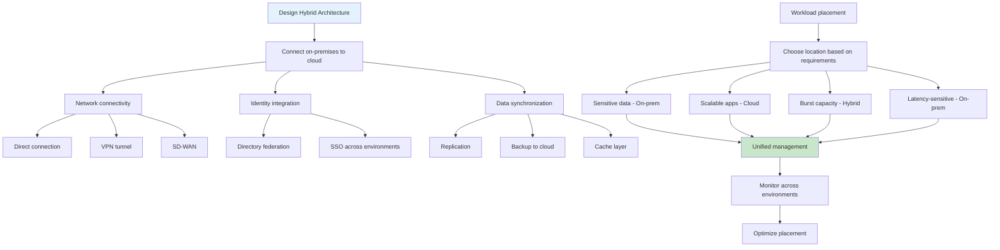

# Hybrid Cloud Patterns

## Overview

Hybrid cloud is an architecture that combines on-premises infrastructure with cloud services, creating a unified computing environment that leverages the benefits of both. This approach allows organizations to keep sensitive data and critical workloads on their own infrastructure while using cloud services for scalable, on-demand resources.

The hybrid cloud model addresses several common enterprise requirements. Many organizations have existing infrastructure investments that cannot be easily moved to the cloud. Regulatory compliance may mandate that certain data or workloads remain on-premises. Some applications may have strict latency requirements that preclude cloud deployment. And many organizations want to use cloud burst capacity during peak demand while running regular workloads on their own infrastructure.

Modern hybrid cloud implementations typically involve a software-defined approach where on-premises infrastructure is extended with cloud-like capabilities. This includes hyper-converged infrastructure (HCI), cloud-based management platforms, and seamless networking between on-premises and cloud environments. The goal is to create a single, cohesive infrastructure where workloads can move freely based on requirements.

Key technologies enabling hybrid cloud include network extensions (VPN, Direct Connect, ExpressRoute), identity federation (SAML, OAuth, directory integration), data synchronization (replication, caching), and management platforms that span both environments. Major cloud providers offer specific hybrid cloud services - AWS Outposts, Azure Stack, Google Anthos - that provide consistent experiences between cloud and on-premises.

The benefits of hybrid cloud include better control over sensitive workloads, optimization of costs by using cloud for variable demand, leverage of existing infrastructure investments, and flexibility to meet diverse workload requirements. The challenges include increased complexity, networking considerations, data consistency, and the need for consistent management across environments.

## Flow Chart



## Standard Example

```hcl
# Terraform Hybrid Cloud Configuration
# This example demonstrates connecting on-premises to AWS cloud

# =============================================================================
# AWS VPC Configuration (Cloud Side)
# =============================================================================

terraform {
  required_version = ">= 1.5.0"
  
  required_providers {
    aws = {
      source  = "hashicorp/aws"
      version = "~> 5.0"
    }
  }
}

# On-premises AWS Direct Connect Connection
resource "aws_dx_connection" "hybrid" {
  name       = "on-prem-to-cloud"
  bandwidth  = "1Gbps"
  location   = "EqDC2"
  provider_name = "aws"
  
  tags = {
    Environment = "hybrid"
    Purpose     = "Direct Connect"
  }
}

# Virtual Private Gateway for VPN
resource "aws_vpn_gateway" "cloud_gateway" {
  amazon_side_asn = "65001"
  
  tags = {
    Name = "hybrid-cloud-vgw"
  }
}

# Attach VPN to VPC
resource "aws_vpn_gateway_attachment" "cloud_vpc" {
  vpn_gateway_id = aws_vpn_gateway.cloud_gateway.id
  vpc_id        = module.vpc.vpc_id
}

# VPN Connection from on-premises
resource "aws_vpn_connection" "on_prem_vpn" {
  vpn_gateway_id = aws_vpn_gateway.cloud_gateway.id
  customer_gateway_id = aws_customer_gateway.on_prem.id
  
  type                    = "ipsec.1"
  static_routes_only     = true
  enable_acceleration     = false
  
  tunnel1 {
    tunnel_inside_cidr      = "169.254.50.0/30"
    pre_shared_key          = var.tunnel1_psk
  }
  
  tunnel2 {
    tunnel_inside_cidr      = "169.254.51.0/30"
    pre_shared_key          = var.tunnel2_psk
  }
  
  tags = {
    Name = "on-prem-vpn"
  }
}

resource "aws_customer_gateway" "on_prem" {
  bgp_asn     = 65000
  ip_address  = var.on_prem_gateway_ip
  type        = "ipsec.1"
  
  tags = {
    Name = "on-prem-cgw"
  }
}

# VPC for cloud resources
module "vpc" {
  source  = "terraform-aws-modules/vpc/aws"
  version = "~> 5.0"
  
  name = "hybrid-cloud-vpc"
  cidr = "10.100.0.0/16"
  
  azs             = ["us-east-1a", "us-east-1b", "us-east-1c"]
  private_subnets = ["10.100.1.0/24", "10.100.2.0/24", "10.100.3.0/24"]
  public_subnets  = ["10.100.101.0/24", "10.100.102.0/24", "10.100.103.0/24"]
  
  enable_nat_gateway = true
  enable_vpn_gateway = true
  
  tags = {
    Environment = "hybrid"
  }
}

# Transit Gateway for connecting multiple networks
resource "aws_ec2_transit_gateway" "hybrid_tgw" {
  description = "Hybrid cloud transit gateway"
  
  amazon_asn  = "64512"
  auto_accept_shared_attachments = "enable"
  
  default_route_table_association = "enable"
  default_route_table_propagation = "enable"
  
  tags = {
    Name = "hybrid-tgw"
  }
}

# Attach VPC to Transit Gateway
resource "aws_ec2_transit_gateway_vpc_attachment" "cloud_vpc_attachment" {
  transit_gateway_id = aws_ec2_transit_gateway.hybrid_tgw.id
  vpc_id            = module.vpc.vpc_id
  subnet_ids        = module.vpc.private_subnets
}

# Route tables for on-premises communication
resource "aws_route_table" "on_prem_route" {
  vpc_id = module.vpc.vpc_id
  
  route {
    cidr_block    = "192.168.0.0/16"
    transit_gateway_id = aws_ec2_transit_gateway.hybrid_tgw.id
  }
  
  tags = {
    Name = "on-prem-route"
  }
}

# Security Group for Hybrid Access
resource "aws_security_group" "hybrid_app" {
  name        = "hybrid-app-sg"
  description = "Security group for hybrid application"
  vpc_id      = module.vpc.vpc_id
  
  # Allow traffic from on-premises
  ingress {
    from_port       = 443
    to_port         = 443
    protocol        = "tcp"
    cidr_blocks     = ["192.168.0.0/16"]
    description     = "On-premises HTTPS"
  }
  
  # Allow traffic from VPC
  ingress {
    from_port   = 443
    to_port     = 443
    protocol    = "tcp"
    self        = true
  }
  
  egress {
    from_port   = 0
    to_port     = 0
    protocol    = "-1"
    cidr_blocks = ["0.0.0.0/0"]
  }
  
  tags = {
    Environment = "hybrid"
  }
}

# EC2 Instances in cloud
resource "aws_instance" "cloud_app" {
  count = 3
  
  ami           = "ami-0c55b159cbfafe1f0"
  instance_type = "t3.medium"
  subnet_id     = module.vpc.private_subnets[count.index]
  
  vpc_security_group_ids = [aws_security_group.hybrid_app.id]
  
  user_data = <<-EOF
              #!/bin/bash
              yum update -y
              amazon-ssm-agent.start
              echo "On-prem network: 192.168.0.0/16" >> /etc/hosts
              EOF
  
  tags = {
    Name = "hybrid-app-${count.index + 1}"
    Role = "Application"
  }
}

# CloudWatch monitoring for hybrid environment
resource "aws_cloudwatch_log_group" "hybrid_logs" {
  name              = "/hybrid/cloud"
  retention_in_days = 30
  
  tags = {
    Environment = "hybrid"
  }
}

# IAM Role that can be assumed from on-premises
resource "aws_iam_role" "hybrid_role" {
  name = "hybrid-app-role"
  
  assume_role_policy = jsonencode({
    Version = "2012-10-17"
    Statement = [{
      Action = "sts:AssumeRole"
      Effect = "Allow"
      Principal = {
        AWS = ["arn:aws:iam::${var.on_prem_account_id}:root"]
      }
    }]
  })
}

resource "aws_iam_role_policy" "hybrid_s3" {
  name = "hybrid-s3-access"
  role = aws_iam_role.hybrid_role.id
  
  policy = jsonencode({
    Version = "2012-10-17"
    Statement = [{
      Action = [
        "s3:GetObject",
        "s3:PutObject"
      ]
      Effect = "Allow"
      Resource = "arn:aws:s3:::hybrid-data-bucket/*"
    }]
  })
}

# S3 Bucket for hybrid data sharing
resource "aws_s3_bucket" "hybrid_data" {
  bucket = "hybrid-data-bucket-${random_id.bucket_suffix.hex}"
}

resource "aws_s3_bucket_policy" "hybrid_data_policy" {
  bucket = aws_s3_bucket.hybrid_data.id
  
  policy = jsonencode({
    Version = "2012-10-17"
    Statement = [{
      Effect = "Allow"
      Principal = {
        AWS = aws_iam_role.hybrid_role.arn
      }
      Action = "s3:*"
      Resource = [
        aws_s3_bucket.hybrid_data.arn,
        "${aws_s3_bucket.hybrid_data.arn}/*"
      ]
    }]
  })
}

resource "random_id" "bucket_suffix" {
  byte_length = 8
}

# Outputs
output "on_prem_cidr" {
  description = "On-premises network CIDR"
  value       = var.on_prem_cidr
}

output "vpc_cidr" {
  description = "Cloud VPC CIDR"
  value       = module.vpc.vpc_cidr_block
}

output "direct_connect_id" {
  description = "Direct Connect connection ID"
  value       = aws_dx_connection.hybrid.id
}

output "transit_gateway_id" {
  description = "Transit Gateway ID for hybrid networking"
  value       = aws_ec2_transit_gateway.hybrid_tgw.id
}
```

```yaml
# Kubernetes Hybrid Cloud Configuration with Anthos
# Example: GKE On-Prem connected to GKE Cloud

---
# GKE Hub membership for hybrid
apiVersion: container.googleapis.com/v1
kind: ContainerCluster
metadata:
  name: onprem-cluster
  namespace: default
spec:
  location: on-premises-datacenter
  enableIpAlias: true
  networkConfig:
    clusterNetwork: "10.96.0.0/14"
    servicesCidr: "10.100.0.0/16"
    clusterIPv4CidrBlock: "10.96.0.0/14"
---
# Connect to GKE Cloud
apiVersion: gkehub.googleapis.com/v1
kind: Feature
metadata:
  name: feature
spec:
  configmanagement:
    version: "1.12.0"
    configSync:
      git:
        repo: https://github.com/org/repo
        branch: main
        dir: "/"
        sourceFormat: "unstructured"
    policyController:
      enabled: true
      auditInterval: 60s
    helms:
    - name: "anthos-service"
      chart: "service-chart"
      version: "1.0.0"
---
# Config Sync for GitOps
apiVersion: configsync.gkehub.googleapis.com/v1
kind: ConfigSync
metadata:
  name: config-sync
spec:
  sourceFormat: "unstructured"
  git:
    repo: https://github.com/org/config-repo
    branch: "main"
    dir: "."
    auth: "token"
    secretRef: "git-creds"
---
# Multi-cluster service
apiVersion: networking.k8s.io/v1
kind: Service
metadata:
  name: hybrid-service
  annotations:
    cloud.google.com/backend-config: '{"default": "backend-config"}'
spec:
  selector:
    app: hybrid-app
  ports:
  - port: 80
    targetPort: 8080
  type: NodePort

---
# Backend config for load balancing
apiVersion: cloud.google.com/v1
kind: BackendConfig
metadata:
  name: backend-config
spec:
  healthCheck:
    checkIntervalSec: 15
    timeoutSec: 5
    healthyThreshold: 3
    unhealthyThreshold: 3
    type: HTTP
    requestPath: /health
    port: 8080
  connectionDraining:
    drainingTimeoutSec: 60
  sessionAffinity:
    affinityType: "CLIENT_IP"
  cdn:
    enabled: false

---
# Workload identity for cloud access
apiVersion: v1
kind: ServiceAccount
metadata:
  name: hybrid-workload-sa
  namespace: default
---
apiVersion: iam.googleapis.com/v1
kind: WorkloadIdentityPool
metadata:
  name: hybrid-pool
spec:
  displayName: Hybrid Workload Identity Pool
---
apiVersion: iam.googleapis.com/v1
kind: WorkloadIdentityPoolProvider
metadata:
  name: onprem-provider
spec:
  workloadIdentityPoolId: hybrid-pool
  providerId: onprem-provider
  issuer: "https://onprem-cluster.example.com"
  attributeMapping:
    "google.subject": "assertion.sub"
---
# RBAC for cross-cluster access
apiVersion: rbac.authorization.k8s.io/v1
kind: ClusterRoleBinding
metadata:
  name: hybrid-admin-binding
subjects:
- kind: User
  name: onprem-admin@company.com
  apiGroup: rbac.authorization.k8s.io
roleRef:
  kind: ClusterRole
  name: cluster-admin
  apiGroup: rbac.authorization.k8s.io
```

## Real-World Examples

### Example 1: AWS Outposts for Enterprise

A large enterprise runs SAP and other mission-critical workloads on AWS Outposts in their own data center. They use Outposts for applications with strict latency requirements or data sovereignty needs, while using standard AWS regions for scalable web applications. The Outposts provide the same APIs and management experience as AWS Cloud, simplifying operations.

### Example 2: Azure Stack for Global Retail

A global retailer uses Azure Stack in stores worldwide to ensure applications work even without reliable internet connectivity. Each store has local Azure Stack HCI for point-of-sale and inventory systems, with cloud connectivity for reporting and analytics when available. This hybrid approach ensures business continuity while leveraging cloud capabilities.

### Example 3: Google Anthos for Banking

A bank uses Google Anthos to run identical Kubernetes clusters on-premises and in GCP. Their development teams deploy once and the workload runs wherever needed. Anthos Config Management ensures consistent policies across all clusters, and Anthos Service Mesh provides observability across the hybrid environment.

### Example 4: Manufacturing IoT Hybrid

A manufacturing company runs IoT data collection and analysis on-premises using specialized infrastructure close to factory floor equipment. They use cloud for historical analytics, machine learning model training, and centralized dashboards. Edge computing on-premises handles time-sensitive analytics while cloud handles complex batch processing.

### Example 5: Healthcare Hybrid Cloud

Healthcare organizations often run electronic health record (EHR) systems on-premises for data sovereignty and compliance, while using cloud for telehealth platforms, analytics, and machine learning. They maintain identity federation between on-premises Active Directory and cloud identity providers to ensure seamless access across environments.

## Output Statement

Hybrid cloud patterns enable organizations to leverage cloud capabilities while maintaining on-premises control for sensitive or latency-critical workloads. The key to successful implementation is establishing reliable connectivity between environments, implementing unified identity and access management, creating consistent data management patterns, and using management platforms that span both environments. Organizations should start by connecting existing infrastructure to cloud services, then progressively move workloads based on their specific requirements and constraints.

## Best Practices

1. **Start with network connectivity**: Establish reliable, high-bandwidth connectivity between on-premises and cloud using Direct Connect, ExpressRoute, or SD-WAN. This foundation enables all other hybrid patterns.

2. **Implement unified identity**: Use directory federation, SAML, or OAuth to provide single sign-on across environments. This simplifies access management and improves security.

3. **Use consistent tooling**: Deploy infrastructure as code and management tools that work across both environments. This reduces operational complexity and enables consistent workflows.

4. **Plan data placement carefully**: Define clear criteria for where data and workloads reside based on regulatory requirements, latency needs, and cost considerations.

5. **Implement hybrid storage patterns**: Use tiered storage with on-premises for hot data and cloud for archival, backups, and disaster recovery. Implement appropriate data synchronization.

6. **Enable workload mobility**: Design applications that can run in either environment. Use containers and Kubernetes for portability, but test application behavior in both locations.

7. **Implement consistent monitoring**: Use tools that can aggregate metrics and logs from both environments. Implement consistent alerting across the hybrid infrastructure.

8. **Design for network failures**: Plan for connectivity disruptions. Applications should handle temporary loss of cloud connectivity gracefully, with appropriate fallbacks.

9. **Use cloud burst for capacity**: Design applications to scale into cloud during peak demand. This provides cost optimization while maintaining local control for baseline capacity.

10. **Maintain security consistency**: Apply consistent security policies across environments. Use centralized policy enforcement and ensure security controls work in both locations.