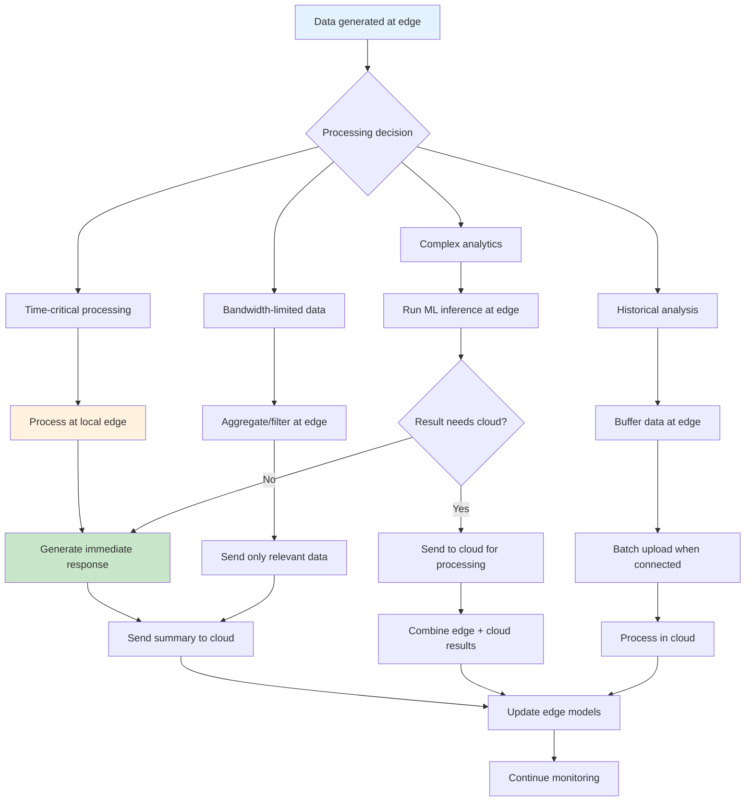

# Edge Computing Patterns

## Overview

Edge computing is a distributed computing paradigm that brings computation and data storage closer to the sources of data. Rather than sending all data to centralized cloud data centers for processing, edge computing performs processing at or near the data source - at the "edge" of the network. This approach reduces latency, saves bandwidth, improves reliability, and enables real-time processing that cloud-centric architectures cannot achieve.

The need for edge computing has grown with the proliferation of Internet of Things (IoT) devices, autonomous vehicles, smart cities, and applications requiring real-time responses. These scenarios generate enormous volumes of data that cannot all be sent to centralized locations due to latency requirements, bandwidth constraints, or connectivity limitations. Edge computing addresses these challenges by processing data locally and only transmitting summarized or relevant results to the cloud.

Edge computing exists on a spectrum - from simple IoT devices with minimal processing capabilities to sophisticated edge clusters running containerized applications. The edge can include retail stores, factory floors, vehicles, cell towers, branch offices, and many other locations. Each edge location has different compute capacity, network connectivity, and operational characteristics that must be considered in the architecture.

Key patterns in edge computing include edge orchestration for managing distributed edge nodes, edge caching for reducing latency and bandwidth, edge analytics for processing data locally, edge AI for running machine learning models at the edge, and edge gateway patterns for bridging edge devices to cloud services. Each pattern addresses specific use cases and requirements.

The relationship between edge and cloud is complementary rather than competitive. Cloud provides centralized management, analytics at scale, and model training capabilities, while edge provides low-latency processing and offline operation. A well-designed architecture distributes workloads appropriately between edge and cloud based on their requirements.

## Flow Chart



## Standard Example

```yaml
# Kubernetes Edge Deployment with K3s and Fleet
# This example demonstrates managing edge clusters from a central location

---
# Fleet Manager Configuration - Central management
apiVersion: management.cattle.io/v3
kind: ClusterGroup
metadata:
  name: edge-locations
spec:
  clusterSelector:
    matchLabels:
      env: edge

---
# Edge Cluster Registration
apiVersion: fleet.cattle.io/v1alpha1
kind: GitRepo
metadata:
  name: edge-applications
  namespace: fleet-default
spec:
  repo: https://github.com/org/edge-deployments
  branch: main
  paths:
  - path: /edge-apps
  targets:
  - clusterGroup: edge-locations
  serviceAccount: fleet-server
  pollingInterval: 30s

---
# Edge Workload - Lightweight deployment
apiVersion: apps/v1
kind: Deployment
metadata:
  name: edge-processing
  namespace: default
spec:
  replicas: 1
  selector:
    matchLabels:
      app: edge-processing
  template:
    metadata:
      labels:
        app: edge-processing
    spec:
      # Lightweight K3s node selector
      nodeSelector:
        node-type: edge
      # Tolerate edge-specific taints
      tolerations:
      - key: "edge"
        operator: "Exists"
        effect: "NoSchedule"
      containers:
      - name: processor
        image: edge-processor:latest
        ports:
        - containerPort: 8080
        env:
        - name: EDGE_MODE
          value: "true"
        - name: CLOUD_ENDPOINT
          value: "https://cloud.example.com"
        - name: LOCAL_PROCESSING
          value: "true"
        resources:
          requests:
            memory: "128Mi"
            cpu: "100m"
          limits:
            memory: "256Mi"
            cpu: "500m"
        volumeMounts:
        - name: cache
          mountPath: /data
      volumes:
      - name: cache
        emptyDir:
          sizeLimit: 1Gi

---
# Edge Service for local communication
apiVersion: v1
kind: Service
metadata:
  name: edge-service
  labels:
    app: edge-processing
spec:
  type: NodePort
  selector:
    app: edge-processing
  ports:
  - port: 8080
    targetPort: 8080
    nodePort: 30080

---
# ConfigMap for edge configuration
apiVersion: v1
kind: ConfigMap
metadata:
  name: edge-config
data:
  processing-interval: "100ms"
  batch-size: "100"
  upload-interval: "60s"
  offline-mode: "true"
  cache-size: "100MB"
  
---
# Edge Device Protocol Translation
apiVersion: apps/v1
kind: Deployment
metadata:
  name: edge-gateway
spec:
  replicas: 3
  selector:
    matchLabels:
      app: edge-gateway
  template:
    metadata:
      labels:
        app: edge-gateway
    spec:
      containers:
      - name: mqtt-broker
        image: eclipse-mosquitto:2.0
        ports:
        - containerPort: 1883
          name: mqtt
        - containerPort: 9001
          name: websocket
        volumeMounts:
        - name: mosquitto-conf
          mountPath: /mosquitto/config
        - name: mosquitto-data
          mountPath: /mosquitto/data
      - name: protocol-bridge
        image: protocol-bridge:latest
        env:
        - name: SOURCE_PROTOCOLS
          value: "modbus,bacnet,opcua"
        - name: TARGET_PROTOCOL
          value: "mqtt"
        - name: MQTT_BROKER
          value: "localhost:1883"
      volumes:
      - name: mosquitto-conf
        configMap:
          name: mosquitto-config
      - name: mosquitto-data
        emptyDir: {}

---
# Edge Data Synchronization
apiVersion: batch/v1
kind: CronJob
metadata:
  name: edge-sync
spec:
  schedule: "*/5 * * * *"
  jobTemplate:
    spec:
      template:
        spec:
          restartPolicy: OnFailure
          containers:
          - name: sync
            image: edge-sync:latest
            env:
            - name: SYNC_ENDPOINT
              value: "https://cloud.example.com/api/sync"
            - name: SYNC_INTERVAL
              value: "300"
            - name: BATCH_SIZE
              value: "1000"
            - name: COMPRESSION
              value: "true"
            - name: ENCRYPTION
              value: "true"

---
# Distributed tracing for edge
apiVersion: opentelemetry.io/v1alpha1
kind: OpenTelemetryCollector
metadata:
  name: edge-collector
spec:
  config: |
    receivers:
      otlp:
        protocols:
          grpc:
            endpoint: 0.0.0.0:4317
          http:
            endpoint: 0.0.0.0:4318
      jaeger:
        protocols:
          thrift_http:
            endpoint: 0.0.0.0:14268
    processors:
      batch:
        timeout: 10s
        send_batch_size: 1000
      memory_limiter:
        check_interval: 1s
        limit_mib: 100
      filter:
        spans:
          include:
            match_type: strict
            attributes:
              - key: component
                value: edge
    exporters:
      otlp:
        endpoint: "https://cloud.example.com:4317"
        tls:
          insecure: false
      logging:
        loglevel: debug
    service:
      pipelines:
        traces:
          receivers: [otlp, jaeger]
          processors: [batch, memory_limiter, filter]
          exporters: [otlp, logging]
```

```python
# edge-processing/edge_ai.py
# Edge AI inference with local model and cloud fallback

import torch
import torchvision.models as models
import requests
import json
import os
from datetime import datetime
from pathlib import Path

class EdgeAIProcessor:
    def __init__(self, config):
        self.config = config
        self.model = None
        self.labels = None
        self.cloud_endpoint = config.get('cloud_endpoint')
        self.local_processing = config.get('local_processing', True)
        self.offline_mode = config.get('offline_mode', False)
        
        self.initialize_model()
        self.load_labels()
    
    def initialize_model(self):
        """Load pre-trained model for edge inference"""
        try:
            # Load a lightweight model suitable for edge
            self.model = models.mobilenet_v3_small(pretrained=False)
            self.model.eval()
            
            # Try to load locally fine-tuned weights
            model_path = Path('/data/model/edge_model.pth')
            if model_path.exists():
                self.model.load_state_dict(
                    torch.load(model_path, map_location='cpu')
                )
                print(f"Loaded custom edge model from {model_path}")
            else:
                print("Using pretrained model weights")
                
        except Exception as e:
            print(f"Error initializing model: {e}")
            self.model = None
    
    def load_labels(self):
        """Load classification labels"""
        labels_path = Path('/data/model/labels.json')
        if labels_path.exists():
            with open(labels_path) as f:
                self.labels = json.load(f)
        else:
            self.labels = [f"class_{i}" for i in range(1000)]
    
    def preprocess(self, image_data):
        """Preprocess input for model"""
        # Convert to tensor and normalize
        # This is simplified - real implementation would use proper preprocessing
        tensor = torch.tensor(image_data).float() / 255.0
        tensor = tensor.unsqueeze(0)  # Add batch dimension
        return tensor
    
    def predict_local(self, input_data):
        """Run inference on edge device"""
        if self.model is None:
            return None
        
        try:
            with torch.no_grad():
                input_tensor = self.preprocess(input_data)
                output = self.model(input_tensor)
                probabilities = torch.nn.functional.softmax(output[0], dim=0)
                
                # Get top prediction
                confidence, predicted = torch.max(probabilities, 0)
                
                return {
                    'prediction': self.labels[predicted.item()],
                    'confidence': confidence.item(),
                    'source': 'edge_local'
                }
        except Exception as e:
            print(f"Local inference error: {e}")
            return None
    
    def predict_cloud(self, input_data):
        """Fallback to cloud inference"""
        if not self.cloud_endpoint or self.offline_mode:
            return None
        
        try:
            response = requests.post(
                f"{self.cloud_endpoint}/predict",
                json={'data': input_data.tolist()},
                timeout=5
            )
            if response.status_code == 200:
                result = response.json()
                result['source'] = 'cloud'
                return result
        except Exception as e:
            print(f"Cloud inference error: {e}")
        
        return None
    
    def predict(self, input_data):
        """Main prediction method with fallback logic"""
        # Try local inference first
        if self.local_processing and self.model is not None:
            result = self.predict_local(input_data)
            if result and result['confidence'] > 0.8:
                return result
        
        # Try cloud inference as fallback
        cloud_result = self.predict_cloud(input_data)
        if cloud_result:
            return cloud_result
        
        # If all else fails and offline, return local even with low confidence
        if self.local_processing and self.model is not None:
            result = self.predict_local(input_data)
            if result:
                result['confidence'] = result['confidence'] * 0.5  # Reduce confidence
                return result
        
        return {'error': 'No inference available', 'source': 'none'}
    
    def update_model(self, new_model_path):
        """Update edge model with new version from cloud"""
        try:
            # Download new model
            response = requests.get(f"{self.cloud_endpoint}/model/latest")
            if response.status_code == 200:
                model_data = response.content
                
                # Save to local path
                with open('/data/model/edge_model_new.pth', 'wb') as f:
                    f.write(model_data)
                
                # Load and validate
                new_model = models.mobilenet_v3_small(pretrained=False)
                new_model.load_state_dict(
                    torch.load('/data/model/edge_model_new.pth', map_location='cpu')
                )
                
                # Replace old model
                Path('/data/model/edge_model.pth').rename('/data/model/edge_model_old.pth')
                Path('/data/model/edge_model_new.pth').rename('/data/model/edge_model.pth')
                
                self.model = new_model
                print("Model updated successfully")
                
        except Exception as e:
            print(f"Model update failed: {e}")

# Main processing loop
if __name__ == "__main__":
    config = {
        'cloud_endpoint': os.environ.get('CLOUD_ENDPOINT'),
        'local_processing': os.environ.get('LOCAL_PROCESSING', 'true').lower() == 'true',
        'offline_mode': os.environ.get('OFFLINE_MODE', 'false').lower() == 'true'
    }
    
    processor = EdgeAIProcessor(config)
    
    # Simulate processing loop
    import time
    while True:
        # In real implementation, this would read from sensors or message queue
        input_data = []  # Placeholder for actual input
        result = processor.predict(input_data)
        
        if result:
            print(f"Prediction: {result}")
        
        time.sleep(1)
```

```yaml
# Docker Compose for Edge Device
version: '3.8'

services:
  # Lightweight edge runtime (K3s agent or containerd)
  edge-runtime:
    image: rancher/k3s:v1.28.0-k3s1
    privileged: true
    volumes:
      - /var/lib/rancher:/var/lib/rancher
      - /var/lib/containerd:/var/lib/containerd
    network_mode: host
    environment:
      - K3S_URL=https://cloud-k3s-server:6443
      - K3S_TOKEN=${K3S_TOKEN}
      - K3S_NODE_NAME=${EDGE_DEVICE_ID}

  # Local MQTT broker for IoT data
  mqtt-broker:
    image: eclipse-mosquitto:2.0
    ports:
      - "1883:1883"
    volumes:
      - ./mosquitto.conf:/mosquitto/config/mosquitto.conf
      - mosquitto-data:/mosquitto/data
    restart: unless-stopped

  # Edge AI inference container
  ai-inference:
    build: ./ai-inference
    volumes:
      - ./models:/models
      - ./cache:/cache
    environment:
      - MODEL_PATH=/models/model.pt
      - THREADS=4
      - MAX_MEMORY=512m
    deploy:
      resources:
        limits:
          memory: 1G
          cpus: '2'
        reservations:
          memory: 256m
          cpus: '0.5'

  # Local time-series database for buffering
  timeseries:
    image: influxdb:2.7
    volumes:
      - influxdb-data:/var/lib/influxdb2
    environment:
      - DOCKER_INFLUXDB_INIT_MODE=setup
      - DOCKER_INFLUXDB_INIT_USERNAME=admin
      - DOCKER_INFLUXDB_INIT_PASSWORD=${INFLUXDB_PASSWORD}
      - DOCKER_INFLUXDB_INIT_ORG=edge
      - DOCKER_INFLUXDB_INIT_BUCKET=sensor_data

  # Sync agent for cloud communication
  sync-agent:
    build: ./sync-agent
    depends_on:
      - timeseries
    environment:
      - CLOUD_API_URL=https://cloud.example.com/api
      - SYNC_INTERVAL=300
      - BUFFER_PATH=/data/buffer
    volumes:
      - ./sync-state:/data
    restart: unless-stopped

volumes:
  mosquitto-data:
  influxdb-data:
```

## Real-World Examples

### Example 1: Smart Retail Edge Platform

A retail chain deploys edge computing in each store to process point-of-sale transactions locally, analyze customer behavior in real-time, and manage inventory. Each store runs Kubernetes with local data storage, processing transactions without cloud connectivity. Aggregated data syncs to the cloud for central analytics, but critical store operations continue even during network outages.

### Example 2: Autonomous Vehicle Edge AI

Self-driving cars run sophisticated AI models locally for real-time decision making. Edge processing handles object detection, path planning, and safety decisions within milliseconds. Cloud connectivity provides model updates, traffic information, and fleet-level analytics, but the vehicle operates safely even when disconnected. The edge AI runs on specialized hardware optimized for inference at low power.

### Example 3: Manufacturing IoT Edge

A factory floor uses edge computing to process sensor data from machinery in real-time. Edge analytics detect anomalies, predict maintenance needs, and trigger immediate alerts. Only summarized data and alerts are sent to the cloud for central monitoring. The edge platform handles thousands of sensors, providing millisecond-level response times that cloud processing cannot achieve.

### Example 4: Smart City Edge Infrastructure

A city deploys edge computing at traffic intersections, public transit stops, and utility installations. Each edge location processes video feeds locally for real-time analytics - traffic flow optimization, public safety monitoring, environmental sensing. The distributed architecture reduces bandwidth requirements while enabling immediate local responses.

### Example 5: Healthcare Edge for Patient Monitoring

Hospitals use edge computing for real-time patient monitoring. Edge devices process data from medical equipment, detect anomalies, and trigger immediate alerts. Patient data stays local for privacy compliance, while aggregated anonymized data goes to the cloud for population health analytics. The edge platform must meet strict reliability and regulatory requirements.

## Output Statement

Edge computing patterns enable real-time processing and reduced latency for distributed applications. The key patterns include edge orchestration for managing distributed nodes, edge AI for running ML models locally, edge gateways for protocol translation, and hybrid edge-cloud architectures for combining local and centralized processing. Successful edge computing requires careful consideration of resource constraints, intermittent connectivity, and the tradeoff between local processing and cloud connectivity. Organizations should implement edge patterns progressively, starting with high-value, latency-sensitive workloads.

## Best Practices

1. **Design for intermittent connectivity**: Edge devices may lose connectivity. Implement local buffering, offline operation capabilities, and automatic resumption when connectivity returns.

2. **Use lightweight runtimes**: Choose optimized software for edge - K3s instead of full Kubernetes, containerd instead of full Docker, lightweight ML frameworks like TensorFlow Lite or ONNX Runtime.

3. **Implement intelligent data filtering**: Not all data needs to go to the cloud. Filter, aggregate, and process data at the edge, sending only relevant information to central systems.

4. **Use model optimization techniques**: Reduce ML model size and complexity for edge inference using quantization, pruning, and knowledge distillation while maintaining accuracy.

5. **Implement secure device identity**: Use hardware security modules or TPM for device identity, and implement mutual TLS for all cloud communications from edge devices.

6. **Plan for edge lifecycle management**: Edge devices may be difficult to access. Implement remote management, automated updates, and graceful degradation for updates.

7. **Use appropriate data synchronization strategies**: Choose between real-time streaming, periodic batch sync, or store-and-forward based on data criticality and connectivity.

8. **Implement local resilience**: Edge devices should handle failures gracefully. Use redundant storage, local caching of critical configuration, and automatic recovery mechanisms.

9. **Test edge behavior in realistic conditions**: Simulate network interruptions, limited resources, and other edge-specific conditions in testing to ensure robustness.

10. **Balance central control with local autonomy**: Provide mechanisms for local decision-making while maintaining central governance. Use policies to define what can be decided locally versus what requires cloud input.