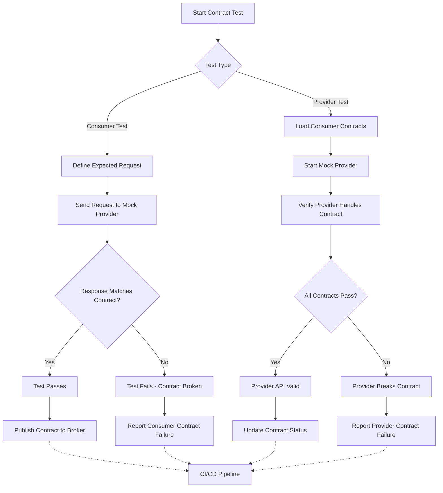

# Contract Testing

## Overview

### What is Contract Testing?

Contract testing is a testing technique that verifies the interactions between services work correctly by testing the contracts of their interfaces. In microservices architectures, where services communicate over networks, contract testing ensures that the provider's API complies with what consumers expect and that consumers correctly handle the provider's responses. This approach catches integration issues early, before services are deployed to production, without requiring full end-to-end test environments.

Contract testing addresses a fundamental challenge in distributed systems: verifying that changes to one service don't break its consumers. Traditional integration testing requires deploying both services together, which becomes impractical as the number of services grows. Contract testing decouples this verification by testing only the interface contract—the requests a consumer makes and the responses a provider returns.

### The Role of Contracts in Microservices

A contract consists of two parts: the request pattern that a consumer sends to a provider, and the expected response structure that the consumer expects to receive. The provider service implements these contracts through its API endpoints, maintaining backward compatibility while evolving its functionality. When either side changes, contract tests verify that the established contract remains satisfied.

Consumer-driven contracts represent a paradigm shift in how teams approach API design. Rather than the provider team defining what the API should look like, consumers express their actual needs, and the provider team ensures the API meets those requirements. This approach produces APIs that are more aligned with real-world usage patterns.

### Contract Testing vs Other Testing Approaches

Unlike unit tests that verify internal logic or integration tests that verify database interactions, contract tests focus specifically on the interface boundary between services. A contract test sends HTTP requests or messages to a service endpoint and validates that the response matches the expected structure and behavior defined in the contract. This validation includes checking HTTP status codes, response headers, and body content against expected schemas.

Contract testing complements but does not replace other testing levels. Unit tests verify business logic correctness, integration tests verify data persistence, and contract tests verify service communication. Together, these test types provide comprehensive coverage across different aspects of the system.

---

## Flow Chart: Contract Testing Workflow



The contract testing workflow involves both consumer and provider perspectives. Consumer tests validate that the consumer can successfully interact with a mock provider that returns responses matching the contract. Provider tests verify that the provider's actual implementation satisfies all registered consumer contracts.

---

## Standard Example

### Contract Test Implementation Using Pact

The following example demonstrates contract testing using the Pact framework, a popular consumer-driven contract testing tool. This implementation shows both consumer and provider perspectives:

```javascript
// consumer-contract.test.js - Consumer-side contract testing

const { like, term, eachLike } = require('pact-core');

describe('User Service Contract Tests', () => {
    const provider = pact({
        consumer: 'user-service-consumer',
        provider: 'user-service-provider',
        port: 8080,
        log: logFile,
        dir: pactDir,
        logLevel: 'INFO',
    });

    beforeAll(() => provider.setup());
    afterAll(() => provider.finalize());

    describe('when fetching user profile', () => {
        beforeAll(() => {
            provider.addInteraction({
                state: 'a user exists with id "user-123"',
                uponReceiving: 'a request for user profile',
                withRequest: {
                    method: 'GET',
                    path: '/api/v1/users/user-123',
                    headers: {
                        'Accept': 'application/json',
                        'Authorization': 'Bearer valid-token',
                    },
                },
                willRespondWith: {
                    status: 200,
                    headers: {
                        'Content-Type': 'application/json',
                    },
                    body: like({
                        userId: 'user-123',
                        email: 'john@example.com',
                        name: 'John Doe',
                        profile: {
                            avatarUrl: like('https://avatar.example.com/john.jpg'),
                            bio: like('Software engineer'),
                        },
                        createdAt: like('2024-01-15T10:30:00Z'),
                    }),
                },
            });
        });

        it('should return user profile with expected structure', async () => {
            const userService = new UserService('http://localhost:8080');
            const response = await userService.getUserProfile('user-123', 'valid-token');
            
            expect(response.userId).toBe('user-123');
            expect(response.email).toBe('john@example.com');
            expect(response.name).toBe('John Doe');
            expect(response.profile).toBeDefined();
            expect(response.profile.avatarUrl).toBe('https://avatar.example.com/john.jpg');
        });

        afterAll(() => provider.addInteraction());
    });

    describe('when creating a new user', () => {
        beforeAll(() => {
            provider.addInteraction({
                state: 'no user exists with email "new@example.com"',
                uponReceiving: 'a request to create a new user',
                withRequest: {
                    method: 'POST',
                    path: '/api/v1/users',
                    headers: {
                        'Content-Type': 'application/json',
                        'Authorization': 'Bearer admin-token',
                    },
                    body: like({
                        email: 'new@example.com',
                        name: 'New User',
                        password: 'securePassword123',
                    }),
                },
                willRespondWith: {
                    status: 201,
                    headers: {
                        'Content-Type': 'application/json',
                        'Location': term({
                            matcher: '^/api/v1/users/[a-z-]+$',
                            generate: '/api/v1/users/new-user-123',
                        }),
                    },
                    body: like({
                        userId: 'new-user-123',
                        email: 'new@example.com',
                        name: 'New User',
                        status: 'ACTIVE',
                    }),
                },
            });
        });

        it('should create user and return created resource', async () => {
            const userService = new UserService('http://localhost:8080');
            const result = await userService.createUser({
                email: 'new@example.com',
                name: 'New User',
                password: 'securePassword123',
            }, 'admin-token');
            
            expect(result.userId).toBe('new-user-123');
            expect(result.status).toBe('ACTIVE');
        });
    });
});
```

### Commented Code Explanation

**Provider Setup**: The Pact provider is configured with consumer and provider names that identify the services participating in the contract. The port configuration specifies where the mock provider will listen for requests during testing.

**Interaction Definition**: Each interaction defines a specific request that the consumer expects to send and the response that the provider should return. The `state` field describes the preconditions necessary for the test to execute, such as a user existing in the database.

**Matching Rules**: The `like()` function creates flexible matchers that allow slight variations in the response values while still validating the structure. `term()` creates regex-based matchers for values like theLocation header that follows a specific pattern.

**Verification**: The consumer test sends an actual request through its service client and verifies that the response matches the expected contract. This verifies that the consumer correctly processes the contract response.

---

## Real-World Example 1: Netflix API Contract Testing

### Netflix Contract Testing Implementation

Netflix implements comprehensive contract testing across their hundreds of microservices to ensure API compatibility as the platform evolves. Their approach combines consumer-driven contracts with automated verification pipelines.

**Scale**: Netflix operates over 1,000 microservices, with API changes happening continuously across teams. Manual verification of every API change would be impossible, making automated contract testing essential.

**Implementation Details**:

Netflix uses a modified version of the Pact framework integrated with their internal tooling. Teams define contracts in a shared repository, and the CI pipeline automatically verifies provider compatibility:

```java
// Netflix-style contract definition

package com.netflix.api.contracts;

import com.netflix.pact.consumer.dsl.*;
import com.netflix.pact.provider.ProviderRunner;
import com.netflix.pact.provider.junit.Provider;
import com.netflix.pact.provider.junit.Target;
import com.netflix.pact.provider.junit.loader.PactBroker;
import org.junit.runners.Parameterized;
import static com.netflix.pact.consumer.dsl.Match.*;

public class NetflixMetadataServiceContractTest {
    
    @Provider("metadata-service")
    @PactFolder("contracts")
    public static class MetadataServiceProviderTest {
        
        @Target
        public MockServer metadataService;
        
        @State("metadata available for title TMDB-550")
        void setupTitleMetadata() {
            Title title = new Title();
            title.setTitleId("TMDB-550");
            title.setName("Fight Club");
            title.setSynopsis("An insomniac office worker...");
            title.setGenres(List.of("Drama", "Thriller"));
            title.setMetadata(new TitleMetadata(
                "https://metadata.netflix.com/titles/TMDB-550",
                "https://images.netflix.com/fight-club.jpg",
                139,
                1999
            ));
            metadataService.addTitle("TMDB-550", title);
        }
        
        @State("no title exists with id UNKNOWN-999")
        void setupNoTitle() {
            // No setup needed - returns 404
        }
    }
    
    @Consumer("recommendation-service")
    @PactBroker(host = "pact-broker.netflix.io", protocol = "https")
    public static class RecommendationServiceConsumerTest {
        
        @Pact(verification = "mock")
        @PactFolder("contracts")
        public static RequestResponsePact getTitlesPact(PactDslWithProvider builder) {
            return builder
                .given("titles available in catalog")
                .uponReceiving("a request for recommended titles")
                .path("/api/v1/recommendations")
                .query("userId=user-123&limit=10")
                .method("GET")
                .willRespondWith()
                .status(200)
                .headers(Map.of("Content-Type", "application/json"))
                .body(newJsonArrayMinLike(1, 10, title -> {
                    title.titleId(eachLike("TMDB-550"));
                    title.name(like("Fight Club"));
                    title.score(like(0.95));
                    title.reason(like("Because you watched Inception"));
                }).build())
                .toPact();
        }
    }
}
```

### Architecture Details

Netflix's contract testing infrastructure includes a Pact broker that stores and manages contracts across services. The broker allows providers to query all consumers of their API and verify compatibility before deployment.

---

## Real-World Example 2: Uber Service Contracts

### Uber Contract Testing Approach

Uber implements contract testing to verify API compatibility across their trip management, driver, and rider services. Their approach emphasizes consumer-driven contracts where the consuming service defines its requirements.

**Requirements**: Uber services must maintain backward compatibility as the platform adds features for new markets. Contract testing ensures that API changes don't break existing consumers.

**Implementation**:

```go
// Uber-style contract testing

package contracts

import (
    "testing"
    "github.com/pact-foundation/pact-go/dsl"
)

func TestTripServiceContract(t *testing.T) {
    
    pact := &dsl.Pact{
        Consumer: "rider-service",
        Provider: "trip-service",
        Host:     "127.0.0.1",
    }
    
    defer pact.Teardown()
    
    // Define contract for requesting a trip
    t.Run("should create trip request", func(st *testing.T) {
        pact.AddInteraction().
            Given("a rider exists with id rider-123").
            Given("drivers are available in surge zone test-zone").
            UponReceiving("a request to create a new trip").
            WithRequest(dsl.Request{
                Method: "POST",
                Path:   "/api/v1/trips",
                Headers: dsl.Map{
                    "Authorization": "Bearer rider-token-123",
                    "Content-Type":  "application/json",
                },
                Body: `{
                    "pickupLocation": {
                        "latitude": 37.7749,
                        "longitude": -122.4194,
                        "address": "123 Market St, San Francisco, CA"
                    },
                    "dropoffLocation": {
                        "latitude": 37.8044,
                        "longitude": -122.2712,
                        "address": "1 Ferry Building, San Francisco, CA"
                    },
                    "serviceType": "uberx"
                }`,
            }).
            WillRespondWith(dsl.Response{
                Status: 201,
                Headers: dsl.Map{
                    "Content-Type": "application/json",
                    "Location": `regex{^/api/v1/trips/[a-z-]+$}`,
                },
                Body: `{
                    "tripId": "trip-abc123",
                    "status": "SEARCHING",
                    "estimatedPickupMinutes": 5,
                    "estimatedPrice": {
                        "amount": 15.50,
                        "currency": "USD",
                        "breakdown": [
                            { "description": "Base Fare", "amount": 7.00 },
                            { "description": "Distance", "amount": 5.50 },
                            { "description": "Fees", "amount": 3.00 }
                        ]
                    },
                    "availableDrivers": [
                        {
                            "driverId": "driver-1",
                            "name": "John D",
                            "vehicle": "Toyota Prius",
                            "rating": 4.9,
                            "etaMinutes": 3
                        }
                    ]
                }`,
            })
        
        err := pact.Verify(func(svc sclient.Client) error {
            resp, err := svc.PostTripRequest("rider-token-123", TripRequest{
                PickupLocation: Location{
                    Latitude:  37.7749,
                    Longitude: -122.4194,
                    Address:   "123 Market St, San Francisco, CA",
                },
                DropoffLocation: Location{
                    Latitude:  37.8044,
                    Longitude: -122.2712,
                    Address:   "1 Ferry Building, San Francisco, CA",
                },
                ServiceType: "uberx",
            })
            
            if err != nil {
                return err
            }
            
            if resp.Status != "SEARCHING" {
                return fmt.Errorf("expected status SEARCHING, got %s", resp.Status)
            }
            
            if resp.TripID == "" {
                return fmt.Errorf("expected trip ID in response")
            }
            
            return nil
        })
        
        if err != nil {
            t.Fatalf("Contract verification failed: %v", err)
        }
    })
}
```

---

## Best Practices

### Implementing Contract Testing Effectively

**Start with High-Value Contracts**: Focus contract testing on APIs that are frequently used, have multiple consumers, or undergo frequent changes. All APIs benefit from contract testing, but priority should go to those with the highest risk of breaking changes.

**Define Clear Contract Ownership**: Each consumer should own and maintain its contract definitions. The provider team is responsible for ensuring the provider satisfies all consumer contracts, but consumers define what they need.

**Integrate into CI/CD Pipeline**: Contract verification should run automatically as part of the deployment pipeline. Providers should not deploy changes that break existing consumer contracts without explicit approval from affected teams.

**Version Contracts Carefully**: Contract versions should align with API versions. When a provider introduces a breaking change, new contract versions should be created rather than modifying existing ones until consumers migrate.

### Common Contract Testing Pitfalls

**Avoid Testing Implementation Details**: Contract tests should verify the interface contract, not internal logic. Testing implementation details creates brittle contracts that break when internal implementations change.

**Don't Over-Match**: Using too many matchers or overly flexible matching can result in contracts that pass verification but mask actual incompatibility. Striking the right balance between flexibility and strictness is essential.

**Ensure Contract Synchronization**: Contract changes must be synchronized between consumer and provider teams. Using a Pact broker or similar central contract storage helps ensure all teams access the latest contracts.

---

## Additional Resources

### Learning More About Contract Testing

**Documentation**:
- Pact Contract Testing documentation at https://docs.pact.io
- Consumer-Driven Contracts article by Ian Robinson

**Tools**:
- Pact (multiple language implementations)
- Spring Cloud Contract
- Hoverfly (native HTTP mocking)

**Community**:
- Contract Testing Slack workspace
- microservice-testing discussion groups