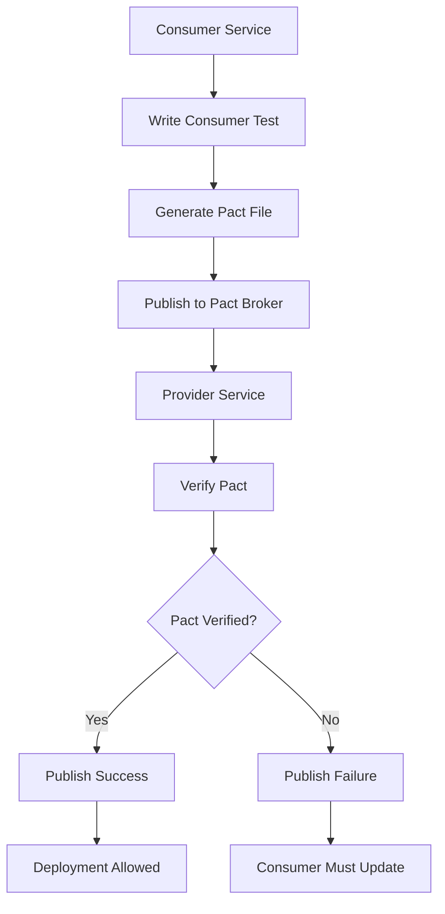

# Consumer Driven Contract Testing

## Overview

Consumer Driven Contract Testing (CDCT) is a testing pattern where consumers of an API define the expectations they have from a provider, and these expectations are verified against the provider's implementation. This approach shifts the traditional testing paradigm - instead of the provider controlling what should be tested, consumers drive the testing based on their actual usage patterns.

In microservices architectures, CDCT becomes essential because services evolve independently. A provider service may change its API, potentially breaking consumers that depend on specific response structures or behaviors. Consumer Driven Contract Testing catches these breaking changes early, before they reach production.

The pattern originated from the Pact framework, developed at Realtime.com and later open-sourced. The core workflow involves consumers writing "pacts" that describe their expectations, these pacts being published to a pact broker, and the provider verifying that it can satisfy all consumer expectations.

## Flow Chart



## Standard Example

```javascript
// Consumer-side Pact test using Jest
const { pactWith } = require('jest-pact');
const axios = require('axios');

describe('User Service Consumer', () => {
  pactWith(
    {
      consumer: 'user-service',
      provider: 'user-api',
      cors: false,
    },
    (interaction) => {
      interaction('GET users returns list of users', ({
        provider,
        execute,
      }) => {
        const userResponse = {
          users: [
            { id: '1', name: 'John Doe', email: 'john@example.com' },
            { id: '2', name: 'Jane Doe', email: 'jane@example.com' },
          ],
        };

        provider
          .given('users exist')
          .uponReceiving('a request for all users')
          .withRequest({
            method: 'GET',
            path: '/api/v1/users',
            headers: {
              Accept: 'application/json',
            },
          })
          .willRespondWith({
            status: 200,
            headers: {
              'Content-Type': 'application/json',
            },
            body: like(userResponse),
          });

        execute(() => axios.get('http://localhost:8080/api/v1/users'));
      });
    }
  )('tests the user API', ({ get }) => {
    return get().then((res) => {
      expect(res.data.users).toHaveLength(2);
      expect(res.data.users[0].name).toBe('John Doe');
    });
  });
});
```

## Real-World Example 1: Netflix

Netflix uses Consumer Driven Contract Testing extensively across their hundreds of microservices. They maintain a centralized Pact broker where all consumer contracts are stored. Every time a provider changes its API, automated verification runs against all consumers. This allows Netflix to safely deploy thousands of changes daily while maintaining system reliability.

## Real-World Example 2: Uber

Uber implements CDCT to coordinate between their rider app, driver app, and numerous backend services. Each mobile client acts as a consumer, publishing contracts that define expected API behavior. Provider services must satisfy all contracts before deployment is allowed.

## Output Statement

```
Pact Verification Results:
==========================
Consumer: user-service
Provider: user-api
Interactions Verified: 15
Failed: 0
Warnings: 0
Status: VERIFIED

All consumer contracts satisfied.
Deployment can proceed.
```

## Best Practices

Publish contracts to a shared broker after each consumer build. Run provider verification as part of the CI/CD pipeline before any provider deployment. Keep contracts small and focused - test one interaction per contract. Version contracts alongside consumer code.