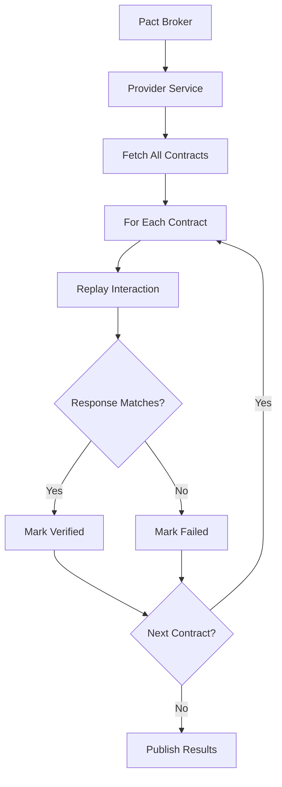

# Provider Verification Testing

## Overview

Provider Verification Testing is the counterpart to Consumer Driven Contract Testing. After consumers publish their contracts (expectations) to a central broker, the provider service must verify that it can satisfy all those contracts. This verification ensures that the provider's implementation matches what consumers expect.

The verification process typically runs in a test environment where the provider is deployed alongside a mock or test version of its dependencies. The test framework reads all contracts from the broker, replays each interaction against the provider, and verifies the responses match expectations.

Provider verification catches breaking changes before they reach production. When a provider changes its API, it must first ensure all existing consumers can still use the service. If verification fails, deployment is blocked until the provider either fixes the issue or coordinates with consumers.

## Flow Chart



## Standard Example

```java
// Provider verification using Spring Boot and Pact
@SpringBootTest(webEnvironment = WebEnvironment.MOCK)
@Provider("user-api")
@PactFolder("pacts")
@VerificationReports
class UserApiProviderTest {
    
    @MockRestServiceServer mockServer;
    
    @State("users exist") // Setup state
    void setupUsers() {
        // Create test data
        userRepository.save(User.builder()
            .id("1")
            .name("John Doe")
            .email("john@example.com")
            .build());
    }
    
    @TestTemplate
    @ExtendWith(PactVerificationInvocationContextProvider.class)
    void verifyPact(PactVerificationContext context) {
        context.verifyInteraction();
    }
    
    @BeforeEach
    void setup(PactVerificationContext context) {
        mockServer = MockRestServiceServer.bindTo(restTemplate).build();
        context.setTarget(new MockMvcTarget());
    }
}
```

## Real-World Example 1: Amazon

Amazon uses provider verification extensively in their service-oriented architecture. Each service must pass contract verification before deployment. Their internal tooling automatically detects which services might be affected by a proposed change and runs targeted verification.

## Real-World Example 2: Stripe

Stripe implements provider verification for their payment APIs. Their extensive consumer base (numerous third-party integrations) makes contract testing critical. Any API change goes through contract verification before production deployment.

## Output Statement

```
Provider Verification Results:
=============================
Provider: user-api
Contracts Verified: 12
Verified Successfully: 10
Failed: 2

Failed Interactions:
1. GET /api/v1/users/{id} - Expected 'email' field, got null
2. POST /api/v1/users - Response status 201 changed to 200

Actions Required: Fix failing interactions before deployment
```

## Best Practices

Run provider verification in CI pipeline before any deployment. Use test environments with realistic data. Handle state setup for each contract scenario. Publish verification results back to the broker for consumer visibility.