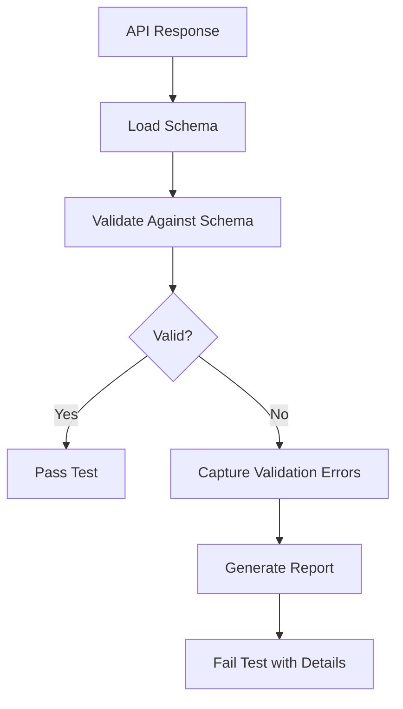

# Schema Validation Testing

## Overview

Schema Validation Testing ensures that API responses conform to a defined schema or contract. This testing pattern catches issues where response data structures deviate from expected formats, such as missing fields, incorrect types, or unexpected additional properties.

Schema validation is particularly important in microservices where services communicate through APIs. A service might work correctly in isolation but fail when integrated with others because data formats don't match expectations. Schema validation testing catches these mismatches early.

Tools like JSON Schema, OpenAPI validators, and GraphQL schema checkers enable automated schema validation. These tools compare actual API responses against the defined schema and report any violations.

## Flow Chart



## Standard Example

```javascript
const Ajv = require('ajv');
const ajv = new Ajv({ allErrors: true });

const userSchema = {
  type: 'object',
  required: ['id', 'name', 'email'],
  properties: {
    id: { type: 'string' },
    name: { type: 'string', minLength: 1 },
    email: { type: 'string', format: 'email' },
    age: { type: 'integer', minimum: 0 },
  },
  additionalProperties: false,
};

async function validateUserResponse(response) {
  const validate = ajv.compile(userSchema);
  const valid = validate(response.data);
  
  if (!valid) {
    throw new Error(
      `Schema validation failed: ${JSON.stringify(validate.errors, null, 2)}`
    );
  }
}

// Usage in test
test('GET /users returns valid user schema', async () => {
  const response = await axios.get('http://localhost:3000/api/users/1');
  
  expect(() => validateUserResponse(response)).not.toThrow();
});
```

## Real-World Example 1: GitHub

GitHub uses schema validation for their API responses. Their API returns comprehensive error schemas and validates all responses against OpenAPI specifications. Third-party developers rely on these consistent schemas.

## Real-World Example 2: Twilio

Twilio validates all API responses against predefined schemas. Their documentation explicitly defines response schemas, and automated tests ensure responses conform exactly to specifications.

## Output Statement

```
Schema Validation Results:
=========================
Endpoint: GET /users/1
Expected Schema: UserSchema v2.0
Status: FAILED

Validation Errors:
1. $.age: should be integer, got string "thirty"
2. $.phone: property not allowed in response
3. $.email: invalid format "not-an-email"

Test Failed: Schema violations detected
```

## Best Practices

Define schemas using JSON Schema or OpenAPI. Validate both request and response schemas. Use strict mode to catch additional properties. Include schema version in validation to track changes over time.