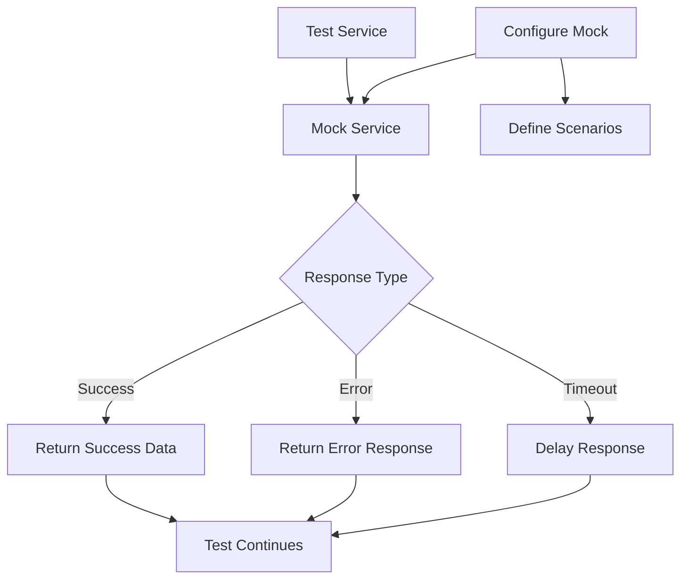

# Mock Service Patterns

## Overview

Mock Service Patterns involve creating fake implementations of external services or dependencies for testing purposes. Instead of calling real services (which may be unavailable, slow, or expensive), tests use mock services that simulate the behavior of actual services.

Mocks are essential in microservices testing because services often depend on other services that may not be available during testing. A mock service can simulate various scenarios including success responses, error conditions, and slow responses - allowing comprehensive testing without external dependencies.

There are various types of test doubles: stubs (pre-programmed responses), mocks (assertions about how they were called), and fakes (simplified working implementations). Each serves different testing purposes.

## Flow Chart



## Standard Example

```javascript
const nock = require('nock');

// Mock external API
const mockApi = nock('http://external-api.example.com')
  .get('/users/123')
  .reply(200, {
    id: '123',
    name: 'John Doe',
    email: 'john@example.com',
  })
  .post('/users')
  .reply(201, { id: '456', status: 'created' });

// Test using mock
test('fetchUser returns user data', async () => {
  const user = await userService.fetchUser('123');
  
  expect(user.name).toBe('John Doe');
  expect(nock.isDone()).toBe(true);
});

// Mock with delay
nock('http://external-api.example.com')
  .get('/slow')
  .delay(2000)
  .reply(200, { data: 'delayed response' });

// Mock error response
nock('http://external-api.example.com')
  .get('/error')
  .reply(500, { error: 'Internal Server Error' });
```

## Real-World Example 1: WireMock

WireMock is a popular mock service tool used by many companies including Netflix. It provides sophisticated mock capabilities including stateful behavior, fault injection, and request recording. Netflix uses WireMock for testing integration with external APIs.

## Real-World Example 2: MockServer

MockServer is another popular choice, used by companies for mocking HTTP services during testing. It supports expectations, verification, and fault simulation.

## Output Statement

```
Mock Service Configuration:
===========================
Mock: User API Mock
State: Active
Endpoints: 3 configured

Test Results:
- Success scenario: PASSED
- Error scenario: PASSED  
- Timeout scenario: PASSED
- Slow response: PASSED

Total Tests: 4, Passed: 4
```

## Best Practices

Use mocks consistently across test suites. Configure realistic response times. Test both success and failure scenarios. Verify mock interactions when needed. Clean up mocks after each test.