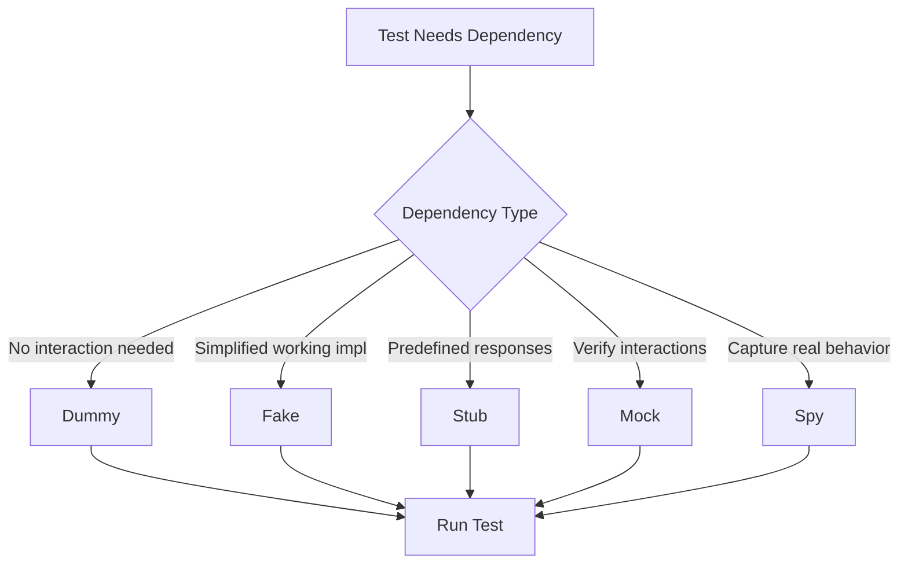

# Test Doubles

## Overview

Test Doubles are replacement objects that mimic real objects for testing purposes. They allow tests to run in isolation without depending on real implementations that may be slow, unavailable, or difficult to set up. The concept was popularized by Gerard Meszaros in his book "xUnit Test Patterns."

There are five main types of test doubles: Dummy objects (passed but never used), Fake objects (working implementations with shortcuts), Stubs (pre-programmed responses), Mocks (objects with expectations), and Spies (wrapping real objects to capture behavior).

Understanding when to use each type of test double is crucial for writing effective tests. Using the wrong type can lead to brittle tests that break unnecessarily or tests that don't catch real bugs.

## Flow Chart



## Standard Example

```java
// Different types of test doubles in Java

// Dummy - passed but not used
class DummyOrderProcessor implements OrderProcessor {
    @Override
    public void process(Order order) {
        // Do nothing - never actually called
    }
}

// Stub - predefined responses
class StubPaymentService implements PaymentService {
    @Override
    public boolean processPayment(String userId, double amount) {
        return true; // Always succeeds
    }
}

// Fake - simplified working implementation
class FakeUserRepository implements UserRepository {
    private Map<String, User> users = new HashMap<>();
    
    @Override
    public User findById(String id) {
        return users.get(id);
    }
    
    @Override
    public void save(User user) {
        users.put(user.getId(), user);
    }
}

// Mock - with expectations
class MockOrderValidator implements OrderValidator {
    private boolean validateCalled = false;
    private Order lastValidatedOrder;
    
    @Override
    public boolean validate(Order order) {
        validateCalled = true;
        lastValidatedOrder = order;
        return true;
    }
    
    public boolean wasValidateCalled() { return validateCalled; }
    public Order getLastValidatedOrder() { return lastValidatedOrder; }
}

// Spy - wrapping real implementation
class OrderRepositorySpy implements OrderRepository {
    private final OrderRepository realRepo;
    private List<Order> savedOrders = new ArrayList<>();
    
    public OrderRepositorySpy(OrderRepository realRepo) {
        this.realRepo = realRepo;
    }
    
    @Override
    public Order findById(String id) {
        return realRepo.findById(id);
    }
    
    @Override
    public void save(Order order) {
        savedOrders.add(order);
        realRepo.save(order);
    }
    
    public List<Order> getSavedOrders() { return savedOrders; }
}
```

## Real-World Example 1: Mockito

Mockito is the most popular mocking framework for Java. It allows creating mocks and stubs easily. Many companies use Mockito for unit testing, including companies like Google and Atlassian.

## Real-World Example 2: Jest Mock Functions

Jest provides built-in mock functionality used extensively in JavaScript testing. It supports module mocking, function mocking, and spies.

## Output Statement

```
Test Double Usage Summary:
========================
Test: Order Processing Flow
- Dummy: NotificationService (injected but not used)
- Stub: PaymentService (always returns success)
- Fake: UserRepository (in-memory storage)
- Mock: EmailService (verifies send called)
- Spy: OrderRepository (tracks save calls)

Result: All tests passed
- Payment processed correctly
- Email notification sent exactly once
- Order saved with correct data
```

## Best Practices

Choose the right type of test double for your test purpose. Use fakes for simplifying complex dependencies. Use mocks when you need to verify interactions. Use spies when you want to wrap real implementations. Keep test doubles focused and simple.