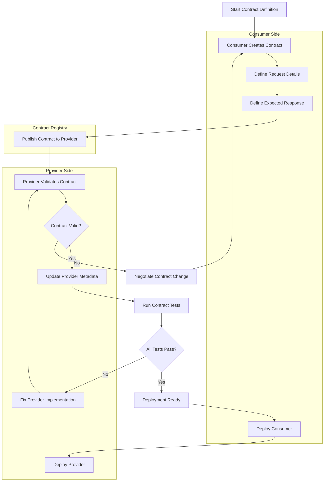

# Consumer-Driven Contract Testing

## Overview

Consumer-Driven Contract Testing (CDCT) is an integration testing approach where the consumer of a service defines the expected behavior of a service provider through contracts. In microservices architectures, this pattern ensures that service providers meet the exact requirements of their consumers without requiring full integration environments or complex test setups.

The fundamental principle behind CDCT is that the consumer knows what it needs from a provider better than anyone else. Rather than having providers define their interfaces independently and hope consumers can adapt, CDCT puts the consumer in control by explicitly stating their expectations. This approach creates a more resilient integration between services and prevents breaking changes from propagating through the system.

Consumer-Driven Contract Testing emerged as a response to the challenges of testing microservices in complex distributed systems. Traditional approaches often require spinning up entire systems of services, which becomes impractical as the number of services grows. CDCT provides a lightweight alternative by testing integrations in isolation while still ensuring compatibility between services.

The process begins with consumers creating contract definitions that specify the exact requests they will make and the responses they expect. These contracts are then validated against the provider without needing the full ecosystem. Providers can verify their implementations against multiple contracts from different consumers, ensuring they meet all their consumer's requirements simultaneously.

### Key Characteristics

Consumer-Driven Contract Testing has several distinguishing characteristics that set it apart from other testing approaches. First, it is consumer-centric, meaning the tests are written from the perspective of what the consumer needs, not what the provider thinks it should offer. This ensures that all provider functionality actually serves a purpose for its consumers.

Second, CDCT promotes loose coupling between services. Since contracts are explicitly defined and tested independently, both consumers and providers can evolve without breaking the integration. Providers can add new features without affecting existing contracts, and consumers can adopt new provider versions with confidence.

Third, the approach enables parallel development. Teams can work on different services simultaneously without waiting for complete integration environments. As long as contracts are agreed upon, development can proceed independently, with integration testing happening continuously through contract validation.

## Flow Chart



The flow chart illustrates the complete Consumer-Driven Contract Testing lifecycle. It begins with the consumer creating a contract that defines both the request format and expected response. This contract is then published to a central registry where providers can access it. The provider validates the contract against their implementation, making any necessary adjustments. Once all contracts validate successfully, both services can be deployed with confidence in their compatibility.

## Standard Example

```java
// Consumer Service - OrderService.java
package com.example.consumer.order;

import org.springframework.stereotype.Service;
import org.springframework.web.client.RestTemplate;
import org.springframework.beans.factory.annotation.Autowired;
import org.springframework.beans.factory.annotation.Value;

@Service
public class OrderService {
    
    @Autowired
    private RestTemplate restTemplate;
    
    @Value("${provider.order-service.url}")
    private String orderServiceUrl;
    
    /**
     * Fetches order details from the order service provider.
     * This consumer expects specific response fields and formats.
     */
    public Order getOrder(String orderId) {
        String url = orderServiceUrl + "/api/v1/orders/" + orderId;
        return restTemplate.getForObject(url, Order.class);
    }
    
    /**
     * Creates a new order through the provider service.
     * The request payload structure is defined in the contract.
     */
    public Order createOrder(OrderRequest request) {
        String url = orderServiceUrl + "/api/v1/orders";
        return restTemplate.postForObject(url, request, Order.class);
    }
}

// Consumer Contract Definition - OrderContract.java
package com.example.consumer.contracts;

import au.com.dius.pact.consumer.dsl.PactDslJsonBody;
import au.com.dius.pact.consumer.dsl.PactDslWithProvider;
import au.com.dius.pact.consumer.junit.PactRunner;
import au.com.dius.pact.consumer.junit.ProviderState;
import au.com.dius.pact.consumer.junit.Consumer;
import au.com.dius.pact.core.model.RequestResponsePact;
import au.com.dius.pact.core.model.V4Pact;
import org.junit.runner.RunWith;

import java.util.HashMap;
import java.util.Map;

import static org.junit.Assert.assertEquals;

/**
 * Consumer-Driven Contract for Order Service.
 * 
 * This contract defines what the consumer (OrderService) expects from 
 * the provider (Order Service Provider). The contract is written from
 * the consumer's perspective, specifying exactly what requests will
 * be made and what responses are expected.
 */
@RunWith(PactRunner.class)
public class OrderContract {
    
    /**
     * Defines the pact between consumer and provider.
     * The provider name must match the provider service name.
     */
    @Consumer("orderService")
    @PactFolder("pacts")
    public RequestResponsePact createPact(PactDslWithProvider builder) {
        
        Map<String, String> headers = new HashMap<>();
        headers.put("Content-Type", "application/json");
        headers.put("Accept", "application/json");
        
        // Define the GET /api/v1/orders/{orderId} interaction
        builder
            .uponReceiving("a request to get an order by ID")
            .path("/api/v1/orders/ORD-12345")
            .method("GET")
            .headers(headers)
            .willRespond()
            .status(200)
            .headers(headers)
            .body(new PactDslJsonBody()
                .stringType("orderId", "ORD-12345")
                .stringType("customerId", "CUST-001")
                .stringType("status", "CONFIRMED")
                .decimalType("totalAmount", 199.99)
                .datetime("createdAt", "yyyy-MM-dd'T'HH:mm:ss.SSS'Z'")
                .eachLike("items", item -> {
                    item.stringType("productId", "PROD-001");
                    item.integerType("quantity", 2);
                    item.decimalType("price", 99.99);
                })
            )
            .toPact(V4Pact.class);
            
        // Define the POST /api/v1/orders interaction
        builder
            .uponReceiving("a request to create a new order")
            .path("/api/v1/orders")
            .method("POST")
            .headers(headers)
            .body(new PactDslJsonBody()
                .stringType("customerId", "CUST-001")
                .array("items", items -> {
                    items.object(item -> {
                        item.stringType("productId", "PROD-001");
                        item.integerType("quantity", 2);
                    });
                })
            )
            .willRespond()
            .status(201)
            .headers(headers)
            .body(new PactDslJsonBody()
                .stringType("orderId", "ORD--new123")
                .stringType("customerId", "CUST-001")
                .stringType("status", "PENDING")
                .decimalType("totalAmount", 199.99)
            );
            
        return builder.toPact();
    }
    
    /**
     * Provider states define preconditions for the contract test.
     * These ensure the provider has the necessary data to respond correctly.
     */
    @ProviderState("an order with ID ORD-12345 exists")
    public void orderExists() {
        // Setup code to create test data on provider side
        // This would typically call a test data setup endpoint
    }
}

// Provider Verification - OrderServiceProviderTest.java
package com.example.provider.order;

import au.com.dius.pact.provider.junit5.PactVerificationInvocationContextProvider;
import au.com.dius.pact.provider.junit5.PactVerification;
import au.com.dius.pact.core.model.V4Pact;
import org.junit.jupiter.api.Test;
import org.junit.jupiter.api.extension.ExtendWith;

import org.springframework.boot.test.context.SpringBootTest;
import org.springframework.boot.test.web.client.TestRestTemplate;
import org.springframework.http.HttpStatus;
import org.springframework.http.ResponseEntity;
import org.springframework.beans.factory.annotation.Autowired;

import static org.junit.jupiter.api.Assertions.assertEquals;

/**
 * Provider-side verification of consumer contracts.
 * 
 * The provider must verify that it can satisfy all consumer contracts.
 * This test runs against the provider service to ensure
 * responses match what consumers expect.
 */
@SpringBootTest(webEnvironment = SpringBootTest.WebEnvironment.RANDOM_PORT)
@ExtendWith(PactVerificationInvocationContextProvider.class)
public class OrderServiceProviderTest {
    
    @Autowired
    private TestRestTemplate restTemplate;
    
    @PactVerification("a request to get an order by ID")
    @Test
    public void testGetOrder() {
        ResponseEntity<String> response = restTemplate.getForEntity(
            "/api/v1/orders/ORD-12345", 
            String.class
        );
        
        assertEquals(HttpStatus.OK, response.getStatusCode());
    }
}
```

This example demonstrates a complete Consumer-Driven Contract Testing implementation using the Pact framework. The consumer service (OrderService) defines its expected interactions through a contract that specifies exact request paths, methods, headers, and response structures. The provider then verifies that it can satisfy this contract.

The contract defines two key interactions: fetching an order by ID and creating a new order. Each interaction specifies the exact request format and expected response structure. The contract uses Pact's domain-specific language to define expected response bodies with specific field types and values.

## Real-World Examples

### E-Commerce Platform

In a large e-commerce platform, the Order Service acts as a consumer of multiple backend services. When the Order Service needs to calculate shipping costs, it consumes the Shipping Service. The contract specifies that the Shipping Service must accept a request with destination postal code and package weight, returning a response with estimated delivery date and shipping cost.

If the Shipping Service wants to add international shipping support, they cannot simply change the response format because it would break existing contracts. Instead, they would negotiate with consumers to create a new contract version, allowing them to add the new functionality while maintaining backward compatibility through versioned endpoints.

### Financial Services

A payment processing system uses CDCT to ensure that multiple consumer services can depend on the Payment Gateway. Different consumer services (subscription billing, one-time payments, refunds) each have their own contracts with the Payment Gateway. This allows the Payment Gateway to evolve independently while ensuring all consumer contracts remain satisfied.

When adding support for a new payment method like cryptocurrency, the payment team can add new contract versions without affecting existing integrations. Each consumer can then adopt the new contract on their own schedule, reducing the risk of widespread breaking changes.

### Healthcare Information Systems

In healthcare applications, patient data services must comply with strict regulations. Consumer applications define contracts that specify exactly what patient data fields they need, helping providers implement data minimization principles. This ensures that services only expose the minimum necessary data to each consumer, improving privacy and security.

Different departments (billing, clinical, administration) have different data needs, and each defines contracts reflecting those specific requirements. The patient data service can verify that it satisfies all contracts simultaneously, ensuring comprehensive compliance.

## Output Statement

Consumer-Driven Contract Testing produces several key outputs that enable reliable microservices integration.

**Contract Documents**: Machine-readable contract files (in Pact format, JSON Schema, or OpenAPI) that define the exact interface expectations between services. These files serve as the single source of truth for service integrations.

**Provider Verification Results**: A report showing whether a provider successfully satisfies all consumer contracts. This includes which contracts pass or fail, along with specific mismatch details when failures occur.

**Compatibility Matrix**: A matrix showing which service versions are compatible with each other, enabling safe deployment decisions. This helps teams understand the integration landscape and plan upgrades.

**Change Impact Analysis**: Information about which consumers would be affected by provider changes, enabling coordinate deployments when necessary.

Example output from a Pact provider verification:

```
Verifying provider 'Order Service Provider' against consumers:
✓ orderService - get order by ID: PASSED
✓ orderService - create new order: PASSED
✓ billingService - get order total: PASSED
✓ notificationService - order status update: PASSED

All 4 consumer contracts passed.
Provider is ready for deployment.
```

## Best Practices

### Define Contracts Early

Create contracts as part of the design phase, not after implementation. This ensures that providers know exactly what to implement and consumers know what to expect. Early contract definition prevents costly rework when services are already built.

Document contracts in shared locations where all teams can access them. Use contract registry tools like Pact Broker or Swagger Hub to manage contracts across services, enabling providers to discover all consumers and their requirements.

### Keep Contracts Focused

Each contract should focus on a single consumer-provider interaction. Avoid combining unrelated expectations in one contract, as this makes contracts harder to maintain and update. Small, focused contracts are easier to change and reason about.

Separate contracts by use case rather than by endpoint. A single endpoint might have different expectations from different consumers, and each consumer should have its own contract reflecting their specific needs.

### Version Contracts Explicitly

Always version contracts to enable parallel development. When provider changes are necessary, create a new contract version rather than changing existing ones. This allows consumers to adopt changes on their own schedule.

Use semantic versioning for contracts and communicate version changes clearly. Include migration guides when contract versions change, helping consumers understand what they need to do to adopt new versions.

### Test Contracts Continuously

Integrate contract testing into CI/CD pipelines to catch integration issues early. Run consumer contract tests on every build and provider verification tests on every deployment.

Automate contract updates when provider implementations change. If a provider makes a change that breaks a contract, the team should know immediately rather than discovering the issue in integration environments.

### Maintain Contract Documentation

Document not just the contract structure but the business meaning behind each field. This helps providers understand why certain fields are required and prevents unnecessary changes.

Include examples and edge cases in contract documentation. Show how consumers handle different response scenarios, helping providers understand expected error handling and recovery paths.