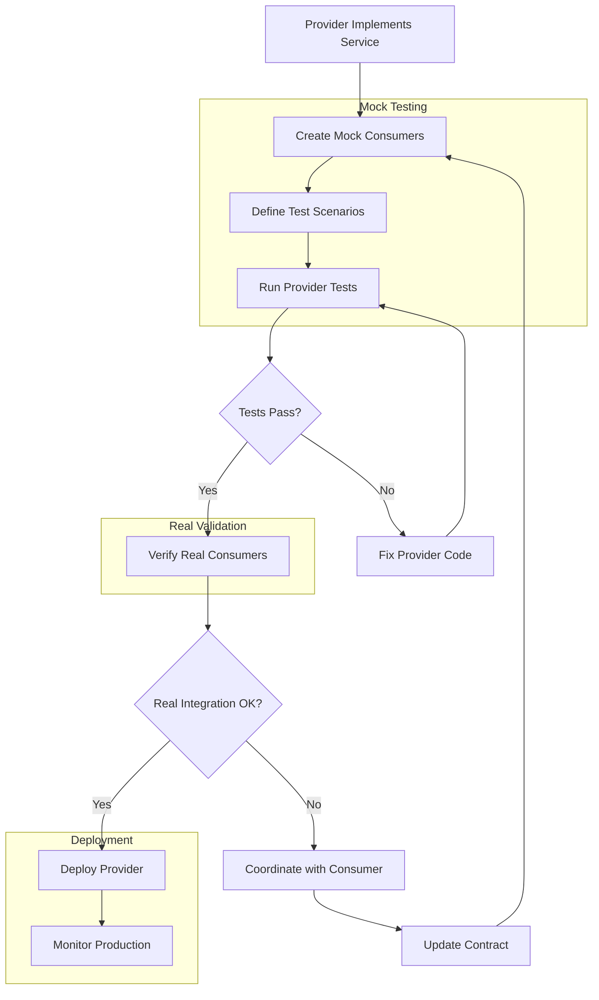

# Provider-Driven Testing

## Overview

Provider-Driven Testing (PDT) is a testing methodology where the service provider takes responsibility for testing integrations with its consumers. Unlike Consumer-Driven Contract Testing where consumers define what they need, Provider-Driven Testing reverses this relationship, allowing providers to verify their compatibility with all their consumers through automated testing.

This approach complements Consumer-Driven Contract Testing and provides a more comprehensive testing strategy for microservices integrations. While CDCT ensures providers meet consumer requirements, PDT allows providers to validate their understanding of consumer expectations and catch integration issues from the provider's perspective.

Provider-Driven Testing is particularly valuable in situations where multiple consumers depend on a single provider service. A provider can use PDT to verify that changes don't break any consumer integrations, reducing the risk of deployments that affect multiple downstream services.

The methodology involves providers creating and maintaining mock consumers that simulate consumer behavior. These mocks make requests to the provider just as real consumers would, verifying that responses match what consumers expect. Providers can run these tests independently without requiring consumer services to be available.

### Key Benefits

Provider-Driven Testing offers several significant benefits for microservices architectures. First, it provides proactive integration verification. Providers can test their integrations before consumers are even developed, ensuring that any consumer will be able to use the service correctly.

Second, PDT enables independent testing cycles. Since providers control their own tests, they don't need to coordinate with consumer teams to verify integrations. This accelerates development and reduces dependencies between teams.

Third, the approach improves documentation. Test cases serve as living documentation of how consumers interact with the provider. New team members can understand API usage by examining the test cases rather than reading abstract documentation.

Fourth, PDT facilitates easier onboarding. New consumers can reference provider tests to understand exactly how to integrate with the service. This reduces questions to the provider team and accelerates consumer development.

## Flow Chart



The flow chart shows the Provider-Driven Testing lifecycle. Providers create mock consumers that simulate real consumer behavior. These mocks define various test scenarios that cover different use cases. Tests run against the provider implementation, verifying correct behavior. Once provider tests pass, real consumer integration is verified. Only after both validation steps succeed is the provider deployed to production.

## Standard Example

```typescript
// Provider Service Implementation - OrderService.ts
import express, { Request, Response } from 'express';
import { Body, Json, Get, Post, Route } from 'tsoa';

const app = express();
app.use(express.json());

interface Order {
    orderId: string;
    customerId: string;
    status: 'PENDING' | 'CONFIRMED' | 'SHIPPED' | 'DELIVERED';
    totalAmount: number;
    items: OrderItem[];
    createdAt: string;
    updatedAt: string;
}

interface OrderItem {
    productId: string;
    quantity: number;
    price: number;
}

interface CreateOrderRequest {
    customerId: string;
    items: Array<{
        productId: string;
        quantity: number;
    }>;
}

interface OrderServiceState {
    orders: Map<string, Order>;
}

/**
 * Order Service Provider Implementation.
 * 
 * This service provides order management functionality for
 * multiple consumer services including Billing, Shipping,
 * and Notification services.
 */
class OrderService {
    private orders: Map<string, Order> = new Map();
    
    /**
     * Retrieves an order by its unique identifier.
     * Returns the complete order details including items.
     */
    public getOrder(orderId: string): Order | null {
        return this.orders.get(orderId) || null;
    }
    
    /**
     * Creates a new order with the provided items.
     * Automatically calculates total amount from item prices.
     */
    public createOrder(request: CreateOrderRequest): Order {
        let totalAmount = 0;
        const items: OrderItem[] = request.items.map(item => {
            const price = this.getProductPrice(item.productId);
            totalAmount += price * item.quantity;
            return {
                productId: item.productId,
                quantity: item.quantity,
                price: price
            };
        });
        
        const order: Order = {
            orderId: `ORD-${Date.now()}`,
            customerId: request.customerId,
            status: 'PENDING',
            totalAmount: totalAmount,
            items: items,
            createdAt: new Date().toISOString(),
            updatedAt: new Date().toISOString()
        };
        
        this.orders.set(order.orderId, order);
        return order;
    }
    
    /**
     * Updates the status of an existing order.
     */
    public updateOrderStatus(orderId: string, status: Order['status']): Order | null {
        const order = this.orders.get(orderId);
        if (!order) return null;
        
        order.status = status;
        order.updatedAt = new Date().toISOString();
        return order;
    }
    
    private getProductPrice(productId: string): number {
        const prices: Record<string, number> = {
            'PROD-001': 29.99,
            'PROD-002': 49.99,
            'PROD-003': 99.99
        };
        return prices[productId] || 19.99;
    }
}

// Mock Consumer - MockBillingConsumer.ts
import request from 'supertest';

/**
 * Mock Billing Consumer for Provider-Driven Testing.
 * 
 * This mock simulates how the Billing Service interacts
 * with the Order Service. It tests the provider's ability
 * to satisfy billing integration requirements.
 */
class MockBillingConsumer {
    private baseUrl: string;
    
    constructor(baseUrl: string) {
        this.baseUrl = baseUrl;
    }
    
    /**
     * Tests retrieving order total for billing calculations.
     * The billing service needs order ID and total amount.
     */
    async testGetOrderTotal(): Promise<{
        success: boolean;
        orderId?: string;
        totalAmount?: number;
        error?: string;
    }> {
        const testOrderId = 'ORD-TEST-001';
        
        try {
            const response = await request(this.baseUrl)
                .get(`/api/v1/orders/${testOrderId}`);
            
            if (response.status !== 200) {
                return {
                    success: false,
                    error: `Expected 200, got ${response.status}`
                };
            }
            
            const data = response.body;
            
            // Validate required fields for billing
            if (!data.orderId) {
                return {
                    success: false,
                    error: 'Missing orderId field'
                };
            }
            
            if (typeof data.totalAmount !== 'number') {
                return {
                    success: false,
                    error: 'totalAmount must be a number'
                };
            }
            
            return {
                success: true,
                orderId: data.orderId,
                totalAmount: data.totalAmount
            };
        } catch (error) {
            return {
                success: false,
                error: error.message
            };
        }
    }
    
    /**
     * Tests creating an order for subscription billing.
     * Subscription billing expects recurring totals.
     */
    async testSubscriptionOrder(): Promise<{
        success: boolean;
        orderId?: string;
        error?: string;
    }> {
        const requestBody = {
            customerId: 'CUST-SUBSCRIPTION',
            items: [
                { productId: 'PROD-SUB-001', quantity: 1 }
            ]
        };
        
        try {
            const response = await request(this.baseUrl)
                .post('/api/v1/orders')
                .send(requestBody)
                .set('Content-Type', 'application/json');
            
            if (response.status !== 201) {
                return {
                    success: false,
                    error: `Expected 201, got ${response.status}`
                };
            }
            
            const data = response.body;
            
            if (!data.orderId) {
                return {
                    success: false,
                    error: 'Missing orderId in response'
                };
            }
            
            return {
                success: true,
                orderId: data.orderId
            };
        } catch (error) {
            return {
                success: false,
                error: error.message
            };
        }
    }
}

// Provider Test Suite - OrderServiceProviderTest.ts
import request from 'supertest';
import { describe, it, expect, beforeEach } from 'vitest';

const ORDER_SERVICE_URL = 'http://localhost:3000';

/**
 * Provider-Driven Test Suite for Order Service.
 * 
 * These tests verify that the provider correctly handles
 * requests from various consumer types. Tests are organized
 * by consumer to clearly show which integrations work.
 */
describe('Order Service Provider Tests', () => {
    let mockBillingConsumer: MockBillingConsumer;
    let mockShippingConsumer: MockShippingConsumer;
    let mockNotificationConsumer: MockNotificationConsumer;
    
    beforeEach(() => {
        mockBillingConsumer = new MockBillingConsumer(ORDER_SERVICE_URL);
        mockShippingConsumer = new MockShippingConsumer(ORDER_SERVICE_URL);
        mockNotificationConsumer = new MockNotificationConsumer(ORDER_SERVICE_URL);
    });
    
    /**
     * Billing Consumer Tests
     * Verify integration with the Billing Service
     */
    describe('Billing Consumer Integration', () => {
        it('should return order for billing calculations', async () => {
            const result = await mockBillingConsumer.testGetOrderTotal();
            expect(result.success).toBe(true);
        });
        
        it('should handle subscription orders', async () => {
            const result = await mockBillingConsumer.testSubscriptionOrder();
            expect(result.success).toBe(true);
        });
    });
    
    /**
     * Shipping Consumer Tests
     * Verify integration with the Shipping Service
     */
    describe('Shipping Consumer Integration', () => {
        it('should provide shipping address for orders', async () => {
            const result = await mockShippingConsumer.testGetShippingDetails();
            expect(result.success).toBe(true);
        });
        
        it('should notify on order status changes', async () => {
            const result = await mockShippingConsumer.testStatusChangeNotification();
            expect(result.success).toBe(true);
        });
    });
    
    /**
     * Notification Consumer Tests
     * Verify integration with the Notification Service
     */
    describe('Notification Consumer Integration', () => {
        it('should provide customer contact for notifications', async () => {
            const result = await mockNotificationConsumer.testGetCustomerContact();
            expect(result.success).toBe(true);
        });
    });
});

// Mock Shipping Consumer
class MockShippingConsumer {
    private baseUrl: string;
    
    constructor(baseUrl: string) {
        this.baseUrl = baseUrl;
    }
    
    async testGetShippingDetails(): Promise<{ success: boolean; error?: string }> {
        try {
            const response = await request(this.baseUrl)
                .get('/api/v1/orders/ORD-SHIP-001/shipping');
            
            if (response.status !== 200) {
                return { success: false, error: `Expected 200, got ${response.status}` };
            }
            
            return { success: true };
        } catch (error) {
            return { success: false, error: error.message };
        }
    }
    
    async testStatusChangeNotification(): Promise<{ success: boolean; error?: string }> {
        try {
            const response = await request(this.baseUrl)
                .put('/api/v1/orders/ORD-SHIP-001/status')
                .send({ status: 'SHIPPED' });
            
            if (response.status !== 200) {
                return { success: false, error: `Expected 200, got ${response.status}` };
            }
            
            return { success: true };
        } catch (error) {
            return { success: false, error: error.message };
        }
    }
}

// Mock Notification Consumer
class MockNotificationConsumer {
    private baseUrl: string;
    
    constructor(baseUrl: string) {
        this.baseUrl = baseUrl;
    }
    
    async testGetCustomerContact(): Promise<{ success: boolean; error?: string }> {
        try {
            const response = await request(this.baseUrl)
                .get('/api/v1/orders/ORD-NOTIF-001/customer');
            
            if (response.status !== 200) {
                return { success: false, error: `Expected 200, got ${response.status}` };
            }
            
            return { success: true };
        } catch (error) {
            return { success: false, error: error.message };
        }
    }
}
```

This example demonstrates Provider-Driven Testing using mock consumers. The implementation includes the Order Service provider along with mock consumers that simulate Billing, Shipping, and Notification services. Each mock consumer tests specific integration points, verifying that the provider responds correctly to consumer requests.

## Real-World Examples

### Payment Gateway

A payment gateway service uses Provider-Driven Testing to verify integration with numerous consumer applications. The mock consumers simulate different payment scenarios: one-time purchases, subscription payments, refunds, and partial refunds. Each mock tests the specific payment flows that real consumers will perform.

The payment team can run these tests before deploying any changes, ensuring that existing consumer integrations continue to work. New consumer integrations can reference the test suite to understand required fields and expected responses.

### User Authentication Service

An authentication service uses Provider-Driven Testing to ensure compatibility with various client applications. Different consumers have different requirements: some need just user identifiers, others need full profile data, and some require multi-factor authentication status.

Mock consumers verify that each consumer type receives the appropriate response. The authentication team can add new consumer types by creating new mock tests without affecting existing ones.

### Inventory Management

An inventory service uses Provider-Driven Testing to verify integration with e-commerce platforms, point-of-sale systems, and warehouse management software. Each consumer type has different data requirements and update frequencies. Mock consumers simulate each integration type, ensuring the provider handles all scenarios correctly.

## Output Statement

Provider-Driven Testing produces several important outputs for development teams.

**Integration Test Reports**: Detailed reports showing which consumer integrations are verified and the results of each test. These reports help teams understand the compatibility of provider changes with existing consumers.

Example test report:

```
Provider-Driven Test Results for Order Service v2.3.0
=================================================

Billing Consumer Tests:
✓ Get Order Total: PASSED
✓ Subscription Order Creation: PASSED
✓ Refund Processing: PASSED
✓ Invoice Generation: PASSED

Shipping Consumer Tests:
✓ Get Shipping Details: PASSED
✓ Order Status Updates: PASSED
✓ Delivery Tracking: PASSED

Notification Consumer Tests:
✓ Get Customer Contact: PASSED
✓ Send Order Confirmation: PASSED
✓ Send Shipping Update: PASSED

Total: 11/11 tests passed
```

**Mock Consumer Definitions**: Reusable mock definitions that can be shared with consumer developers for local testing. These mocks help consumers understand API behavior before integrating with the real provider.

**Integration Coverage Maps**: Visual representations showing which provider endpoints are covered by mock consumer tests. This helps identify untested integration points that might cause issues in production.

## Best Practices

### Create Realistic Mocks

Mock consumers should accurately simulate real consumer behavior. Include realistic request patterns, timing considerations, and error handling. Avoid creating mocks that only test the happy path; add tests for edge cases and failure scenarios.

Maintain mock definitions in sync with actual consumer implementations. When consumers change their integration patterns, update the corresponding mocks to reflect the new behavior.

### Test Against Contract Definitions

Provider-Driven Testing should verify compliance with published contract definitions. Use OpenAPI specifications or similar contract documents to ensure that mocks accurately represent consumer expectations.

Generate mock tests automatically from contract definitions where possible. This reduces manual effort and ensures contracts and tests stay synchronized.

### Run Tests Frequently

Integrate provider-driven tests into CI/CD pipelines to run on every build. Early detection of integration issues prevents problems in production and reduces debugging time.

Run full test suites before deployments, even if only one consumer integration changes. Providers must ensure backward compatibility with all consumers.

### Document Test Scenarios

Each test scenario should be well-documented explaining what consumer behavior is being simulated and what outcomes are expected. This documentation helps new team members understand provider-consumer relationships.

Include business context in test documentation, explaining why certain integrations exist and what consumer needs they fulfill.

### Keep Mocks Independent

Each mock consumer test should be independent and not depend on the results of other tests. Reset provider state between tests to ensure reliable, repeatable test runs.

Use test data factories to create consistent test data across all mock consumer tests. This ensures that test failures are due to actual integration issues rather than test data problems.