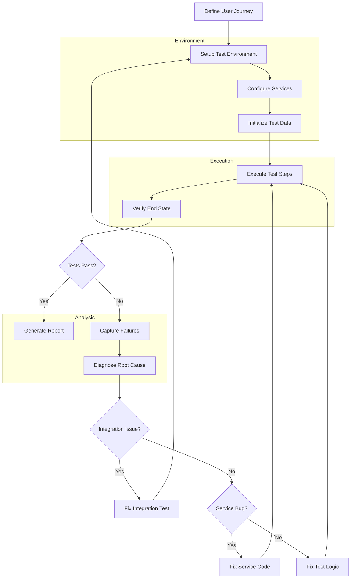

# End-to-End Testing

## Overview

End-to-End (E2E) Testing is a comprehensive testing methodology that validates entire application workflows from the user's perspective, covering all integrated components, services, and infrastructure. In microservices architectures, E2E testing ensures that the complete system functions correctly as a unified whole, catching integration issues that unit and integration tests cannot detect.

Unlike unit tests that focus on individual components or service tests that verify pairwise integrations, E2E tests simulate real user journeys through the entire application. These tests verify that all services, databases, message queues, and external integrations work together correctly to deliver the expected user experience.

E2E testing is the highest level of testing in the testing pyramid, providing the greatest confidence in system correctness but at the cost of slower execution and more complex setup. Successful E2E tests indicate that the system is ready for production, but they are typically run less frequently than lower-level tests due to their resource requirements.

### Testing Scope

End-to-End Testing encompasses multiple layers of the application stack. At the user interface level, tests verify that web pages render correctly and user interactions produce expected results. At the API level, tests call service endpoints and validate the complete response chain. At the data level, tests verify that information is correctly stored and retrieved across database services.

In microservices environments, E2E testing must also handle service coordination. Tests verify that services can discover each other, that inter-service communication works correctly, and that the system handles failures gracefully when individual services become unavailable.

### When to Use E2E Testing

E2E tests are most valuable for critical user journeys that involve multiple services. Use E2E testing for core business workflows like placing an order, processing a payment, or generating reports. These workflows involve numerous services working together, and issues can only be detected when the full workflow executes.

Reserve E2E tests for validating the most important system behaviors. Do not use E2E tests for every scenario; use faster unit and integration tests for routine validation. This approach provides good coverage while maintaining reasonable test execution times.

## Flow Chart



The flow chart illustrates the End-to-End Testing process. Tests begin with defining the user journey to validate. The test environment is set up with all required services. Each service is configured with appropriate settings. Test data is initialized with the necessary state. Test steps execute to simulate the user journey. The end state is verified against expected outcomes. When tests fail, failures are captured and root causes diagnosed.

## Standard Example

```python
# End-to-End Test Suite - OrderWorkflowTests.py
import pytest
import requests
import time
import uuid
from datetime import datetime, timedelta
from typing import Dict, List, Any
from dataclasses import dataclass

# Test Configuration
API_GATEWAY_URL = "http://localhost:8080"
SERVICE_TIMEOUT = 30
TEST_CUSTOMER_ID = f"CUST-TEST-{uuid.uuid4().hex[:8]}"

@dataclass
class TestOrder:
    order_id: str
    customer_id: str
    status: str
    total_amount: float
    items: List[Dict[str, Any]]

class EndToEndOrderWorkflow:
    """
    End-to-End test suite for the complete order workflow.
    
    This test suite validates the entire order process from
    browsing products to order delivery, covering all services
    in the e-commerce platform.
    """
    
    def __init__(self):
        self.api_gateway = API_GATEWAY_URL
        self.test_customer_id = TEST_CUSTOMER_ID
        self.created_orders: List[TestOrder] = []
    
    def setup_method(self):
        """Setup test environment before each test."""
        self._create_test_customer()
        self._seed_product_inventory()
    
    def teardown_method(self):
        """Cleanup after each test."""
        self._cleanup_test_orders()
        self._cleanup_test_customer()
    
    def _create_test_customer(self):
        """Create a test customer account."""
        response = requests.post(
            f"{self.api_gateway}/api/v1/customers",
            json={
                "customerId": self.test_customer_id,
                "email": f"test_{self.test_customer_id}@example.com",
                "name": "Test User",
                "address": {
                    "street": "123 Test Street",
                    "city": "Test City",
                    "state": "TS",
                    "zipCode": "12345",
                    "country": "US"
                }
            },
            timeout=SERVICE_TIMEOUT
        )
        assert response.status_code == 201, f"Failed to create test customer: {response.text}"
    
    def _seed_product_inventory(self):
        """Seed available products for testing."""
        products = [
            {"productId": "PROD-E2E-001", "name": "Test Product 1", "price": 29.99, "stock": 100},
            {"productId": "PROD-E2E-002", "name": "Test Product 2", "price": 49.99, "stock": 50},
        ]
        
        for product in products:
            response = requests.post(
                f"{self.api_gateway}/api/v1/products",
                json=product,
                timeout=SERVICE_TIMEOUT
            )
            if response.status_code != 201:
                # Product might already exist, try to update stock
                requests.put(
                    f"{self.api_gateway}/api/v1/products/{product['productId']}/stock",
                    json={"stock": product["stock"]},
                    timeout=SERVICE_TIMEOUT
                )
    
    def _cleanup_test_orders(self):
        """Clean up created test orders."""
        for order in self.created_orders:
            try:
                requests.delete(
                    f"{self.api_gateway}/api/v1/orders/{order.order_id}",
                    timeout=SERVICE_TIMEOUT
                )
            except:
                pass  # Ignore cleanup errors
    
    def _cleanup_test_customer(self):
        """Clean up test customer."""
        try:
            requests.delete(
                f"{self.api_gateway}/api/v1/customers/{self.test_customer_id}",
                timeout=SERVICE_TIMEOUT
            )
        except:
            pass  # Ignore cleanup errors
    
    def test_complete_order_workflow(self):
        """
        Test the complete order workflow end-to-end.
        
        This test validates:
        1. Customer authentication
        2. Product browsing
        3. Cart management
        4. Order placement
        5. Payment processing
        6. Order confirmation
        7. Inventory update
        """
        
        # Step 1: Authenticate customer
        customer = self._authenticate_customer()
        assert customer is not None, "Customer authentication failed"
        
        # Step 2: Browse products
        products = self._browse_products()
        assert len(products) > 0, "No products available"
        
        # Step 3: Add items to cart
        cart = self._add_to_cart(products[0]["productId"], 2)
        assert cart["itemCount"] == 2, "Cart item count incorrect"
        
        # Step 4: Place order
        order = self._place_order(cart["cartId"])
        assert order["status"] == "CONFIRMED", "Order not confirmed"
        
        # Step 5: Process payment
        payment = self._process_payment(order["orderId"], 59.98)
        assert payment["status"] == "COMPLETED", "Payment not completed"
        
        # Step 6: Verify order confirmation
        order_details = self._get_order_details(order["orderId"])
        assert order_details["status"] == "CONFIRMED", "Order status incorrect"
        
        # Step 7: Verify inventory update
        inventory = self._get_inventory(products[0]["productId"])
        assert inventory["stock"] == 98, "Inventory not updated correctly"
        
        # Store order for cleanup
        self.created_orders.append(TestOrder(
            order_id=order["orderId"],
            customer_id=self.test_customer_id,
            status=order_details["status"],
            total_amount=order_details["totalAmount"],
            items=order_details["items"]
        ))
    
    def _authenticate_customer(self) -> Dict[str, Any]:
        """Authenticate the test customer."""
        response = requests.post(
            f"{self.api_gateway}/api/v1/auth/login",
            json={
                "customerId": self.test_customer_id,
                "password": "test-password"
            },
            timeout=SERVICE_TIMEOUT
        )
        
        if response.status_code == 200:
            return response.json()
        elif response.status_code == 404:
            # Customer doesn't exist yet, this is fine
            return {"customerId": self.test_customer_id}
        
        pytest.fail(f"Authentication failed: {response.status_code} - {response.text}")
    
    def _browse_products(self) -> List[Dict[str, Any]]:
        """Browse available products."""
        response = requests.get(
            f"{self.api_gateway}/api/v1/products",
            params={"inStock": True},
            timeout=SERVICE_TIMEOUT
        )
        
        assert response.status_code == 200, f"Product browse failed: {response.text}"
        return response.json()["products"]
    
    def _add_to_cart(self, product_id: str, quantity: int) -> Dict[str, Any]:
        """Add a product to the shopping cart."""
        response = requests.post(
            f"{self.api_gateway}/api/v1/cart/items",
            json={
                "customerId": self.test_customer_id,
                "productId": product_id,
                "quantity": quantity
            },
            timeout=SERVICE_TIMEOUT
        )
        
        assert response.status_code == 200, f"Add to cart failed: {response.text}"
        return response.json()
    
    def _place_order(self, cart_id: str) -> Dict[str, Any]:
        """Place an order from the cart."""
        response = requests.post(
            f"{self.api_gateway}/api/v1/orders",
            json={
                "customerId": self.test_customer_id,
                "cartId": cart_id,
                "shippingAddress": {
                    "street": "123 Test Street",
                    "city": "Test City",
                    "state": "TS",
                    "zipCode": "12345",
                    "country": "US"
                }
            },
            timeout=SERVICE_TIMEOUT
        )
        
        assert response.status_code == 201, f"Order placement failed: {response.text}"
        return response.json()
    
    def _process_payment(self, order_id: str, amount: float) -> Dict[str, Any]:
        """Process payment for an order."""
        response = requests.post(
            f"{self.api_gateway}/api/v1/payments",
            json={
                "orderId": order_id,
                "amount": amount,
                "paymentMethod": {
                    "type": "CREDIT_CARD",
                    "cardNumber": "4111111111111111",
                    "expiryDate": "12/25",
                    "cvv": "123"
                }
            },
            timeout=SERVICE_TIMEOUT
        )
        
        assert response.status_code == 200, f"Payment processing failed: {response.text}"
        return response.json()
    
    def _get_order_details(self, order_id: str) -> Dict[str, Any]:
        """Get order details."""
        response = requests.get(
            f"{self.api_gateway}/api/v1/orders/{order_id}",
            timeout=SERVICE_TIMEOUT
        )
        
        assert response.status_code == 200, f"Get order failed: {response.text}"
        return response.json()
    
    def _get_inventory(self, product_id: str) -> Dict[str, Any]:
        """Get product inventory level."""
        response = requests.get(
            f"{self.api_gateway}/api/v1/products/{product_id}/inventory",
            timeout=SERVICE_TIMEOUT
        )
        
        assert response.status_code == 200, f"Get inventory failed: {response.text}"
        return response.json()


# Pytest Test Runner
@pytest.mark.e2e
class TestOrderWorkflow:
    """Pytest test class for order workflow E2E tests."""
    
    @pytest.fixture(autouse=True)
    def setup(self):
        """Setup test fixtures."""
        self.workflow = EndToEndOrderWorkflow()
        self.workflow.setup_method()
        yield
        self.workflow.teardown_method()
    
    def test_complete_order_workflow(self):
        """Run the complete order workflow test."""
        self.workflow.test_complete_order_workflow()
    
    def test_order_cancellation_workflow(self):
        """Test the order cancellation workflow."""
        # Place an order
        products = self.workflow._browse_products()
        cart = self.workflow._add_to_cart(products[0]["productId"], 1)
        order = self.workflow._place_order(cart["cartId"])
        
        # Cancel the order
        response = requests.post(
            f"{self.api_gateway}/api/v1/orders/{order['orderId']}/cancel",
            json={"reason": "Customer request"},
            timeout=SERVICE_TIMEOUT
        )
        
        assert response.status_code == 200, f"Order cancellation failed: {response.text}"
        
        # Verify cancellation
        order_details = self.workflow._get_order_details(order["orderId"])
        assert order_details["status"] == "CANCELLED", "Order not cancelled"
```

This comprehensive example demonstrates End-to-End testing using Python. The test suite validates the complete order workflow including customer authentication, product browsing, cart management, order placement, payment processing, and inventory updates. It uses the API Gateway as the entry point for all service calls, simulating how a real user would interact with the system.

## Real-World Examples

### Banking Application

A banking E2E test validates the fund transfer workflow. The test creates two accounts, deposits funds into one account, transfers money to the other, and verifies the balance updates on both accounts. This test validates the complete flow across Account Management, Transaction Processing, and Notification services.

Additional E2E tests verify loan applications, credit card applications, and statement generation. Each workflow is tested end-to-end to ensure the banking system handles complete user journeys correctly.

### Healthcare Portal

A healthcare portal E2E test validates patient appointment scheduling. The test creates a patient record, searches for available appointments, books an appointment, sends confirmation, and verifies the appointment appears in the patient's schedule.

Tests also validate prescription refills, medical record access, and billing workflows. Each test covers multiple services including Patient Management, Scheduling, Medical Records, and Billing.

### Food Delivery Platform

A food delivery E2E test validates the complete order flow. The test creates a customer account, searches for restaurants, selects menu items, places an order, confirms payment, selects a delivery driver, and tracks the delivery status.

The test verifies all services coordinate correctly including Restaurant Management, Order Management, Payment Processing, Driver Assignment, and Delivery Tracking.

## Output Statement

End-to-End Testing produces comprehensive outputs that demonstrate system readiness.

**Test Execution Report**: A detailed report showing the status of each E2E test, including execution time and any failures. This report helps teams understand which user journeys are working correctly.

Example E2E test report:

```
End-to-End Test Results
======================
Test Suite: Order Workflow
Executed: 2024-01-15T10:30:00Z

test_complete_order_workflow:
  Status: PASSED
  Duration: 12.34s
  Steps: 7/7 passed

test_order_cancellation_workflow:
  Status: PASSED
  Duration: 8.21s
  Steps: 5/5 passed

test_payment_failure_handling:
  Status: PASSED
  Duration: 5.67s
  Steps: 4/4 passed

Summary:
  Total: 3/3 tests passed
  Passed: 3
  Failed: 0
  Duration: 26.22s
```

**Journey Coverage Map**: A visual map showing which user journeys have E2E test coverage. This helps identify untested critical paths that might need test coverage.

**Performance Metrics**: E2E tests collect performance data for each step, enabling teams to identify slow services in the workflow. This data helps prioritize performance optimization efforts.

## Best Practices

### Use realistic test data

E2E tests should use data that represents real production scenarios. Avoid using unrealistic data that might mask issues that would appear in production. Use realistic customer data, product catalogs, and transaction amounts.

Create test data factories that generate realistic data distributions. This ensures tests validate realistic system behavior.

### Isolate test environments

E2E tests require isolated environments that don't interfere with other tests or production systems. Use containerization or environment provisioning to ensure each test run has a clean environment.

Clean up test data after each test run to prevent data pollution that could affect subsequent tests.

### Parallelize where possible

E2E tests can be parallelized across different user journeys. Use test parallelization to reduce overall test execution time while maintaining test isolation.

Identify independent tests that can run concurrently. Be careful not to parallelize tests that share resources or data.

### Prioritize critical journeys

Not all user journeys need E2E tests. Focus E2E testing on the most critical paths that directly impact business outcomes. Use unit and integration tests for less critical scenarios.

Document which journeys have E2E coverage and which rely on lower-level tests. This helps teams understand the overall testing strategy.

### Capture detailed failures

When E2E tests fail, capture comprehensive information for debugging. Log all service responses, timing information, and system state at the point of failure.

Include correlation IDs in all service requests to enable tracing across services. This makes it easier to understand the complete flow when diagnosing failures.