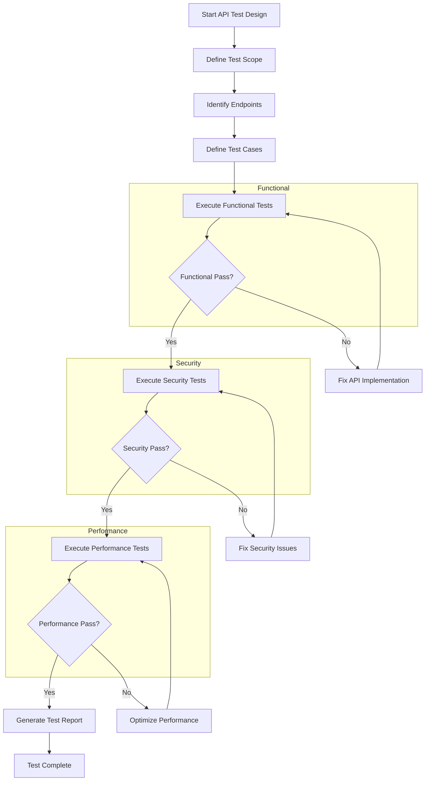

# API Testing

## Overview

API Testing is a critical practice in microservices architectures that validates the correctness, reliability, and performance of service interfaces. Unlike end-to-end testing that validates complete user workflows, API testing focuses specifically on verifying that services expose and consume interfaces correctly according to their specifications.

API testing becomes especially important in microservices environments where services communicate over networks and must handle various request types, response formats, error conditions, and concurrent access patterns. Poorly designed APIs can cause cascading failures throughout the system, making comprehensive API testing essential for system reliability.

The practice encompasses multiple testing dimensions including functional correctness, security validation, performance measurement, and compliance with API specifications. Each dimension addresses different aspects of API quality and helps ensure that APIs meet both technical requirements and business needs.

### Testing Dimensions

Functional testing verifies that API endpoints return correct responses for valid requests and appropriate error responses for invalid requests. This includes testing all supported operations, verifying response data structures, and validating business logic implementation.

Security testing validates that APIs properly authenticate requests, authorize access to resources, and protect sensitive data. This includes testing authentication mechanisms, authorization rules, input validation, and protection against common attacks.

Performance testing measures API response times under various load conditions and validates that APIs meet defined performance targets. This includes testing response latency, throughput limits, and resource utilization.

## Flow Chart



The flow chart illustrates the API testing process across multiple dimensions. After defining test scope and identifying endpoints, tests are executed in sequence: functional tests first, then security tests, then performance tests. Each dimension must pass before progressing to the next. Fixes are applied locally to avoid regressing previously passing tests.

## Standard Example

```javascript
// API Test Suite - OrderAPI.test.js
const axios = require('axios');
const chai = require('chai');
const expect = chai.expect;

const API_BASE_URL = process.env.API_BASE_URL || 'http://localhost:8080';

class OrderAPIClient {
    constructor(baseUrl) {
        this.baseUrl = baseUrl;
        this.client = axios.create({
            baseURL: baseUrl,
            timeout: 10000,
            headers: {
                'Content-Type': 'application/json'
            }
        });
    }
    
    async getOrder(orderId) {
        return this.client.get(`/api/v1/orders/${orderId}`);
    }
    
    async createOrder(orderData) {
        return this.client.post('/api/v1/orders', orderData);
    }
    
    async updateOrder(orderId, updateData) {
        return this.client.put(`/api/v1/orders/${orderId}`, updateData);
    }
    
    async deleteOrder(orderId) {
        return this.client.delete(`/api/v1/orders/${orderId}`);
    }
    
    async getOrders(params) {
        return this.client.get('/api/v1/orders', { params });
    }
}

/**
 * API Test Suite for Order Service.
 * 
 * This suite validates all Order Service API endpoints
 * including functional correctness, error handling,
 * and performance requirements.
 */
describe('Order API Tests', () => {
    let apiClient;
    const testCustomerId = 'CUST-API-TEST-001';
    
    beforeAll(() => {
        apiClient = new OrderAPIClient(API_BASE_URL);
    });
    
    /**
     * Functional Tests - GET /api/v1/orders/{orderId}
     */
    describe('GET /api/v1/orders/:orderId', () => {
        let testOrderId;
        
        beforeEach(async () => {
            const response = await apiClient.createOrder({
                customerId: testCustomerId,
                items: [
                    { productId: 'PROD-001', quantity: 1 }
                ]
            });
            testOrderId = response.data.orderId;
        });
        
        afterEach(async () => {
            try {
                await apiClient.deleteOrder(testOrderId);
            } catch (e) {
                // Ignore cleanup errors
            }
        });
        
        it('should return order details for valid order ID', async () => {
            const response = await apiClient.getOrder(testOrderId);
            
            expect(response.status).to.equal(200);
            expect(response.data).to.have.property('orderId');
            expect(response.data.orderId).to.equal(testOrderId);
            expect(response.data).to.have.property('customerId');
            expect(response.data.customerId).to.equal(testCustomerId);
            expect(response.data).to.have.property('status');
            expect(response.data).to.have.property('totalAmount');
            expect(response.data).to.have.property('items');
        });
        
        it('should return 404 for non-existent order', async () => {
            try {
                await apiClient.getOrder('ORDER-NONEXISTENT');
                expect.fail('Expected request to fail');
            } catch (error) {
                expect(error.response.status).to.equal(404);
                expect(error.response.data).to.have.property('error');
            }
        });
        
        it('should return 400 for invalid order ID format', async () => {
            try {
                await apiClient.getOrder('INVALID@ORDER#ID');
                expect.fail('Expected request to fail');
            } catch (error) {
                expect(error.response.status).to.equal(400);
                expect(error.response.data).to.have.property('error');
            }
        });
    });
    
    /**
     * Functional Tests - POST /api/v1/orders
     */
    describe('POST /api/v1/orders', () => {
        it('should create order with valid data', async () => {
            const orderData = {
                customerId: testCustomerId,
                items: [
                    { productId: 'PROD-001', quantity: 2 },
                    { productId: 'PROD-002', quantity: 1 }
                ]
            };
            
            const response = await apiClient.createOrder(orderData);
            
            expect(response.status).to.equal(201);
            expect(response.data).to.have.property('orderId');
            expect(response.data).to.have.property('customerId');
            expect(response.data.customerId).to.equal(testCustomerId);
            expect(response.data).to.have.property('status');
            expect(response.data.status).to.equal('PENDING');
            expect(response.data).to.have.property('items');
            expect(response.data.items).to.have.length(2);
            
            await apiClient.deleteOrder(response.data.orderId);
        });
        
        it('should return 400 for missing customer ID', async () => {
            const orderData = {
                items: [
                    { productId: 'PROD-001', quantity: 1 }
                ]
            };
            
            try {
                await apiClient.createOrder(orderData);
                expect.fail('Expected request to fail');
            } catch (error) {
                expect(error.response.status).to.equal(400);
            }
        });
        
        it('should return 400 for empty items array', async () => {
            const orderData = {
                customerId: testCustomerId,
                items: []
            };
            
            try {
                await apiClient.createOrder(orderData);
                expect.fail('Expected request to fail');
            } catch (error) {
                expect(error.response.status).to.equal(400);
                expect(error.response.data).to.have.property('error');
            }
        });
        
        it('should return 400 for negative quantity', async () => {
            const orderData = {
                customerId: testCustomerId,
                items: [
                    { productId: 'PROD-001', quantity: -1 }
                ]
            };
            
            try {
                await apiClient.createOrder(orderData);
                expect.fail('Expected request to fail');
            } catch (error) {
                expect(error.response.status).to.equal(400);
            }
        });
    });
    
    /**
     * Security Tests
     */
    describe('Security Tests', () => {
        it('should require authentication for protected endpoints', async () => {
            const unauthenticatedClient = new OrderAPIClient(API_BASE_URL);
            unauthenticatedClient.client.defaults.headers['Authorization'] = 'Invalidtoken';
            
            try {
                await unauthenticatedClient.getOrder('ORDER-001');
                expect.fail('Expected request to fail');
            } catch (error) {
                expect(error.response.status).to.equal(401);
            }
        });
        
        it('should prevent SQL injection in order ID', async () => {
            const maliciousOrderId = "ORDER-001'; DROP TABLE orders;--";
            
            try {
                await apiClient.getOrder(maliciousOrderId);
                expect.fail('Expected request to fail');
            } catch (error) {
                expect([400, 404]).to.include(error.response.status);
            }
        });
        
        it('should prevent XSS in order ID parameters', async () => {
            const xssPayload = '<script>alert("xss")</script>';
            
            try {
                await apiClient.getOrder(xssPayload);
                expect.fail('Expected request to fail');
            } catch (error) {
                expect([400, 404]).to.include(error.response.status);
            }
        });
        
        it('should limit request body size', async () => {
            const largeData = {
                customerId: testCustomerId,
                items: Array(10000).fill({ productId: 'PROD-001', quantity: 1 })
            };
            
            try {
                await apiClient.createOrder(largeData);
                expect.fail('Expected request to fail');
            } catch (error) {
                expect(error.response.status).to.equal(413);
            }
        });
        
        it('should enforce rate limiting', async () => {
            const requests = Array(150).fill().map(() => 
                apiClient.getOrders({ limit: 1 })
            );
            
            let rateLimited = false;
            try {
                await Promise.all(requests);
            } catch (error) {
                if (error.response?.status === 429) {
                    rateLimited = true;
                }
            }
            
            expect(rateLimited).to.be.true;
        });
    });
    
    /**
     * Performance Tests
     */
    describe('Performance Tests', () => {
        it('should respond within 500ms for simple requests', async () => {
            const startTime = Date.now();
            await apiClient.getOrders({ limit: 10 });
            const duration = Date.now() - startTime;
            
            expect(duration).to.be.lessThan(500);
        });
        
        it('should handle concurrent requests efficiently', async () => {
            const concurrentRequests = 50;
            const startTime = Date.now();
            
            const requests = Array(concurrentRequests).fill().map(() =>
                apiClient.getOrders({ limit: 10 })
            );
            
            await Promise.all(requests);
            const duration = Date.now() - startTime;
            
            expect(duration).to.be.lessThan(2000);
        });
        
        it('should maintain performance under load', async () => {
            const warmup = Array(10).fill().map(() =>
                apiClient.getOrders({ limit: 10 })
            );
            await Promise.all(warmup);
            
            const durations = [];
            for (let i = 0; i < 100; i++) {
                const startTime = Date.now();
                await apiClient.getOrders({ limit: 10 });
                durations.push(Date.now() - startTime);
            }
            
            const avgDuration = durations.reduce((a, b) => a + b, 0) / durations.length;
            const p95Duration = durations.sort((a, b) => a - b)[Math.floor(durations.length * 0.95)];
            
            expect(avgDuration).to.be.lessThan(500);
            expect(p95Duration).to.be.lessThan(1000);
        });
    });
});

module.exports = OrderAPIClient;
```

This comprehensive example demonstrates API testing for an Order Service using JavaScript. The test suite covers functional tests for all CRUD operations, security tests for authentication and input validation, and performance tests for response times and concurrency handling.

## Real-World Examples

### REST API Testing

A RESTful e-commerce API is tested comprehensively with tests for each HTTP method on each endpoint. GET requests verify resource retrieval, POST requests verify resource creation, PUT requests verify updates, and DELETE requests verify removal. Response codes are validated against HTTP standards, and response bodies are validated against expected schemas.

### GraphQL API Testing

A GraphQL API requires different testing approaches focused on query execution and mutation handling. Tests verify that queries return correct data shapes, that variables work correctly, that fragments reduce duplication, and that mutations create expected side effects. Error handling for malformed queries is also tested.

### gRPC API Testing

A gRPC API uses Protocol Buffers for serialization, requiring custom testing approaches. Tests verify that protobuf messages serialize and deserialize correctly, that streaming operations work properly, and that service stubs handle bidirectional communication. Reflection is used to dynamically discover available services.

## Output Statement

API testing produces detailed reports across all testing dimensions.

**Functional Test Results**: Shows which endpoints and operations work correctly, including response codes, response bodies, and error handling. This report validates that all API functionality works as specified.

Example functional test output:

```
Order API Functional Tests
=========================

GET /api/v1/orders/:orderId
  ✓ Returns order for valid ID
  ✓ Returns 404 for non-existent order
  ✓ Returns 400 for invalid order ID format

POST /api/v1/orders
  ✓ Creates order with valid data
  ✓ Returns 400 for missing customer ID
  ✓ Returns 400 for empty items array
  ✓ Returns 400 for negative quantity

Security Tests
  ✓ Rejects unauthenticated requests
  ✓ Prevents SQL injection
  ✓ Prevents XSS attacks
  ✓ Limits request body size
  ✓ Enforces rate limiting

Performance Tests
  ✓ Responds within 500ms
  ✓ Handles concurrent requests efficiently
  ✓ Maintains performance under load

Results: 18/18 tests passed
```

**Security Test Results**: Shows security validation results including authentication, authorization, and input validation tests.

**Performance Test Results**: Shows response time measurements including averages, percentiles, and under-load behavior.

## Best Practices

### Test the contract, not the implementation

API tests should verify behavior against the API specification, not implementation details. This allows API implementations to change without breaking tests as long as external behavior remains consistent. Use contract tests to enforce specification compliance.

### Cover both positive and negative cases

Tests should include both valid requests that should succeed and invalid requests that should fail. Negative tests verify proper error handling and prevent malformed data from entering the system. Aim for comprehensive input validation coverage.

### Include security tests from the beginning

Security should not be an afterthought. Include authentication, authorization, and input validation tests as part of initial API testing. This prevents security vulnerabilities from reaching production.

### Measure and enforce performance

Performance requirements should be part of API testing criteria. Define performance targets and enforce them as part of test passes. Store historical performance data to identify degradation early.

### Use test doubles for external dependencies

When APIs depend on external services, use test doubles to isolate API testing. This ensures tests verify the API itself, not the external service. Use contracts to define test double behavior.