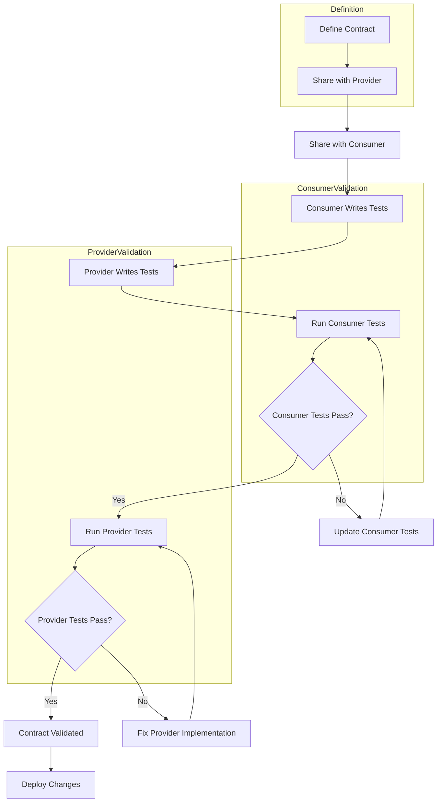

# Contract Testing

## Overview

Contract Testing is a methodology that verifies the integration points between services agree on the format and behavior of data exchanged. In microservices architectures where services evolve independently, contract testing ensures that changes in one service do not break integrations with dependent services.

Contract testing originated from the need to test microservices integrations without requiring full system deployments. Traditional integration testing requires all services to be running, which becomes impractical as the number of services grows. Contract testing solves this by verifying only the interface compatibility between service pairs.

The practice combines elements of both Consumer-Driven Contract Testing and Provider-Driven Testing, providing a balanced approach where both sides of an integration participate in verifying correctness. Contracts are typically expressed in a standardized format like OpenAPI for REST APIs or Protocol Buffers for gRPC services.

Contract testing differs from traditional integration testing in that it does not require the full application stack. Tests run against individual services with mocked or simplified dependencies, verifying only that the service correctly produces and consumes messages according to the contract.

### Why Contract Testing Matters

Microservices architectures have many integration points that can change independently. Without contract testing, changes to one service can break dependent services without immediate detection. Contract testing catches these issues early, during development, before services are deployed.

Contract testing also enables teams to work independently. Each team can verify their service works correctly against contracts defined with other teams, without requiring coordination or synchronized deployments. This accelerates development cycles and reduces team dependencies.

The methodology supports evolution by allowing services to add new capabilities without breaking existing integrations. New contract versions can coexist with old versions, and services can migrate to new versions on their own schedules.

## Flow Chart



The flow chart shows the contract testing lifecycle. Contracts are defined in a standardized format and shared with both provider and consumer. Each side writes tests against the contract. Consumer tests verify that the provider produces correct responses. Provider tests verify that it can handle consumer requests. Both test suites must pass for the contract to be considered valid.

## Standard Example

```typescript
// Contract Definition - OrderContract.ts
import { z } from 'zod';

/**
 * Order Contract Schema Definition.
 * 
 * This contract defines the expected structure of order data
 * exchanged between the Order API and its consumers.
 */
export const OrderItemSchema = z.object({
    productId: z.string().min(1),
    quantity: z.number().int().positive(),
    price: z.number().nonnegative()
});

export const OrderRequestSchema = z.object({
    customerId: z.string().min(1),
    items: z.array(OrderItemSchema).min(1),
    shippingAddress: z.object({
        street: z.string(),
        city: z.string(),
        state: z.string().length(2),
        zipCode: z.string().regex(/^\d{5}$/),
        country: z.string().default('US')
    }).optional()
});

export const OrderResponseSchema = z.object({
    orderId: z.string(),
    customerId: z.string(),
    status: z.enum(['PENDING', 'CONFIRMED', 'SHIPPED', 'DELIVERED', 'CANCELLED']),
    totalAmount: z.number(),
    items: z.array(OrderItemSchema),
    createdAt: z.string().datetime(),
    updatedAt: z.string().datetime()
});

export type Order = z.infer<typeof OrderResponseSchema>;
export type OrderRequest = z.infer<typeof OrderRequestSchema>;

// Consumer Contract Test - OrderConsumerContractTest.ts
import { describe, it, expect, beforeAll } from 'vitest';
import axios from 'axios';
import { OrderResponseSchema, OrderRequestSchema } from './OrderContract';

const API_BASE_URL = 'http://localhost:8080';

/**
 * Consumer Contract Tests for Order Service.
 * 
 * These tests verify that the Order Service provider
 * correctly implements the contract from the consumer's
 * perspective.
 */
describe('Order Consumer Contract Tests', () => {
    let apiClient;
    const mockServerUrl = `${API_BASE_URL}/api/v1`;
    
    beforeAll(() => {
        apiClient = axios.create({
            baseURL: mockServerUrl,
            timeout: 10000
        });
    });
    
    /**
     * Verify GET /orders/:orderId response matches contract
     */
    it('should return order matching OrderResponseSchema', async () => {
        const orderId = 'ORDER-TEST-001';
        
        const response = await apiClient.get(`/orders/${orderId}`);
        
        expect(response.status).toBe(200);
        
        const result = OrderResponseSchema.safeParse(response.data);
        
        expect(result.success).toBe(true);
        
        if (!result.success) {
            console.error('Contract validation errors:', result.error.issues);
        }
    });
    
    /**
     * Verify POST /orders request matches contract
     */
    it('should accept request matching OrderRequestSchema', async () => {
        const validRequest = {
            customerId: 'CUST-001',
            items: [
                { productId: 'PROD-001', quantity: 2, price: 29.99 }
            ],
            shippingAddress: {
                street: '123 Main St',
                city: 'Test City',
                state: 'CA',
                zipCode: '12345',
                country: 'US'
            }
        };
        
        const result = OrderRequestSchema.safeParse(validRequest);
        
        expect(result.success).toBe(true);
        
        const response = await apiClient.post('/orders', validRequest);
        
        expect(response.status).toBe(201);
        expect(response.data).toHaveProperty('orderId');
    });
    
    /**
     * Verify response fields have correct types
     */
    it('should return orderId as string', async () => {
        const response = await apiClient.get('/orders/ORDER-TEST-001');
        
        expect(typeof response.data.orderId).toBe('string');
    });
    
    /**
     * Verify response has required fields
     */
    it('should have all required fields', async () => {
        const response = await apiClient.get('/orders/ORDER-TEST-001');
        
        const requiredFields = ['orderId', 'customerId', 'status', 'totalAmount', 'items', 'createdAt', 'updatedAt'];
        
        for (const field of requiredFields) {
            expect(response.data).toHaveProperty(field);
        }
    });
    
    /**
     * Verify status is valid enum value
     */
    it('should have valid status values', async () => {
        const response = await apiClient.get('/orders/ORDER-TEST-001');
        
        const validStatuses = ['PENDING', 'CONFIRMED', 'SHIPPED', 'DELIVERED', 'CANCELLED'];
        
        expect(validStatuses).toContain(response.data.status);
    });
    
    /**
     * Verify datetime fields are ISO 8601 format
     */
    it('should return datetime in ISO 8601 format', async () => {
        const response = await apiClient.get('/orders/ORDER-TEST-001');
        
        const iso8601Regex = /^\d{4}-\d{2}-\d{2}T\d{2}:\d{2}:\d{2}(\.\d{3})?Z$/;
        
        expect(response.data.createdAt).toMatch(iso8601Regex);
        expect(response.data.updatedAt).toMatch(iso8601Regex);
    });
    
    /**
     * Verify error responses match contract
     */
    it('should return 404 for non-existent order', async () => {
        try {
            await apiClient.get('/orders/NONEXISTENT');
            fail('Expected request to fail');
        } catch (error) {
            expect(error.response.status).toBe(404);
            expect(error.response.data).toHaveProperty('error');
        }
    });
});

/**
 * Pact-based Contract Test - OrderPactContract.ts
 * 
 * Alternative approach using Pact framework
 */
import { pact, Transaction } from '@pact-foundation/pact';

describe('Order Service Contract Tests', () => {
    const provider = pact({
        consumer: 'order-client',
        provider: 'order-service',
        port: 8080
    });
    
    beforeAll(async () => {
        await provider.setup();
    });
    
    afterAll(async () => {
        await provider.finalize();
    });
    
    describe('GET /orders/:orderId', () => {
        it('should return order details', async () => {
            provider.given('an order exists');
            
            const interaction = await provider.receive(
                'a request for order details',
                {
                    onRequest: (request) => {
                        request.path.equal('/api/v1/orders/ORDER-001');
                        request.method.equal('GET');
                    },
                    onResponse: (response) => {
                        response.status.equal(200);
                        response.headers['Content-Type'].equal('application/json');
                        response.body.equal({
                            orderId: 'ORDER-001',
                            customerId: 'CUST-001',
                            status: 'CONFIRMED',
                            totalAmount: 99.99,
                            items: []
                        });
                    }
                }
            );
            
            expect(interaction).toHaveOccured();
        });
    });
});
```

This example demonstrates contract testing using both schema validation and Pact framework. The contract defines expected data structures using Zod schemas, and consumer tests verify that responses from the provider match these schemas. This approach catches contract violations early and ensures both services agree on the data format.

## Real-World Examples

### REST API Contracts

REST APIs use OpenAPI specifications as contracts. Services generate client libraries from the specification, and contract tests verify that the running service produces responses matching the specification. Tools like Swagger Inspector and Rest Assured automate contract testing for REST APIs.

### Message Queue Contracts

Message queue contracts define the structure of messages passed between services. Contract testing verifies that producers create messages matching the expected schema and that consumers can correctly process these messages. Schema registries like Confluent Schema Registry manage these contracts centrally.

### Database Contracts

Database contracts define table schemas and data access patterns. Contract testing verifies that services correctly read and write data according to the defined schema. This is especially important when multiple services access the same database.

## Output Statement

Contract testing produces several important outputs that validate service integrations.

**Contract Validation Report**: Shows which contracts have been validated and the results of each validation. This report confirms that service interfaces are compatible.

Example contract validation output:

```
Contract Validation Report
========================

Contract: Order Service API
Version: 1.2.0

Consumer Validation:
  ✓ GET /orders/:orderId returns correct response schema
  ✓ POST /orders accepts correct request schema
  ✓ Order ID is returned as string
  ✓ All required fields present
  ✓ Status values are valid enum values
  ✓ Datetime fields are ISO 8601 format

Provider Validation:
  ✓ Handles valid GET requests
  ✓ Handles valid POST requests
  ✓ Returns correct error codes
  ✓ Response times within limits

Results: 10/10 validations passed

Status: CONTRACT VALIDATED
```

**Schema Compliance Report**: Shows whether provider responses match the expected schema, including specific field mismatches and type violations.

**Integration Compatibility Matrix**: Shows which service versions are compatible with each other based on contract validation results.

## Best Practices

### Define contracts in shared formats

Use standardized contract formats like OpenAPI, JSON Schema, or Protocol Buffers. These formats enable automatic validation and code generation. Store contracts in shared repositories accessible to all teams.

### Version contracts explicitly

Contract versions should be explicit and traceable. Use semantic versioning and maintain backward compatibility when possible. Breaking changes should require new contract versions.

### Automate contract validation

Integrate contract validation into CI/CD pipelines. Validate contracts on every build to catch integration issues immediately. Automate contract updates when APIs change.

### Test both producer and consumer sides

Contract testing should validate both sides of the integration. Producer tests verify correct response generation; consumer tests verify correct request handling. Both perspectives are necessary for complete validation.

### Document contract changes

Contract changes should be documented with migration guides. Show what changed between versions and what consumers need to do to adapt. This helps teams understand the impact of contract changes.