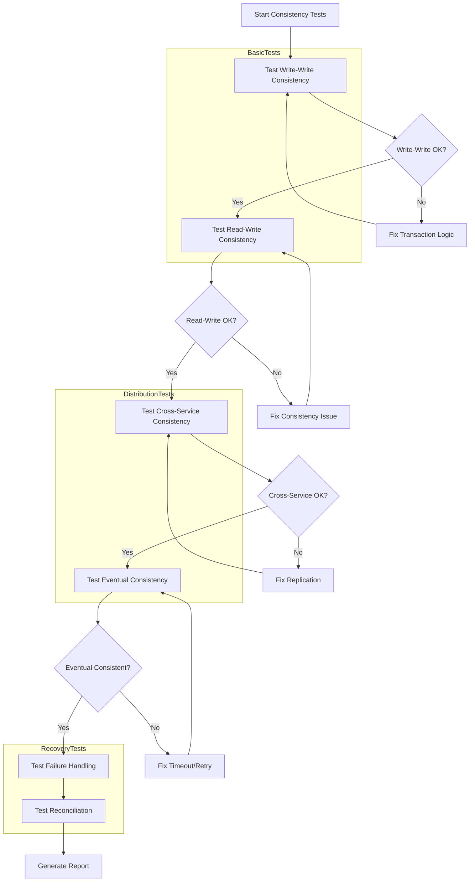

# Data Consistency Testing

## Overview

Data Consistency Testing validates that data remains consistent across microservices and their underlying data stores throughout the application lifecycle. In distributed systems where each service maintains its own data, ensuring consistency is a significant challenge that requires deliberate testing strategies.

Data inconsistency in microservices can occur due to various factors: network partitions, distributed transactions, eventual consistency models, cached data, and service evolution. Without proper testing, these inconsistencies can cause significant production issues including incorrect orders, pricing errors, inventory discrepancies, and customer data problems.

Data consistency testing goes beyond traditional database testing to verify that data remains synchronized across service boundaries. This includes testing read-your-write consistency, eventual consistency boundaries, transaction boundaries, and reconciliation between data stores.

The practice is especially important in microservices because services often replicate data for performance and independence. Testing must verify that replicated data stays synchronized and that the system handles synchronization failures gracefully.

### Types of Data Consistency

Strong consistency guarantees that all reads see the most recent write. This is the simplest model to test but may have performance implications in distributed systems.

Eventual consistency guarantees that all replicas will eventually become consistent given no new updates. Testing must verify that consistency is achieved within acceptable time bounds and handle temporary inconsistencies correctly.

Read-your-write consistency guarantees that after a write, subsequent reads will see that write. This is important for user-facing applications where users expect to see their own changes immediately.

Causal consistency guarantees that causally related operations are seen in order. This model is more relaxed than strong consistency but still maintains logical ordering.

## Flow Chart



The flow chart shows the data consistency testing process. Tests progress from simple single-service consistency to complex cross-service consistency. Each level must pass before progressing to the next. Failures at any level indicate issues that need fixing.

## Standard Example

```typescript
// Data Consistency Test Suite - OrderDataConsistency.test.ts
import { describe, it, expect, beforeAll, afterAll } from 'vitest';
import { OrderService } from './services/OrderService';
import { InventoryService } from './services/InventoryService';
import { PaymentService } from './services/PaymentService';
import { EventService } from './services/EventService';

const API_BASE_URL = 'http://localhost:8080';

interface ConsistencyResult {
    source: string;
    target: string;
    consistent: boolean;
    discrepancies: string[];
}

class DataConsistencyValidator {
    private orderService: OrderService;
    private inventoryService: InventoryService;
    private paymentService: PaymentService;
    private eventService: EventService;
    
    constructor() {
        this.orderService = new OrderService(API_BASE_URL);
        this.inventoryService = new InventoryService(API_BASE_URL);
        this.paymentService = new PaymentService(API_BASE_URL);
        this.eventService = new EventService(API_BASE_URL);
    }
    
    /**
     * Tests write-write consistency.
     * Verifies that concurrent writes to the same data are handled correctly.
     */
    async testConcurrentWrites(): Promise<boolean> {
        const orderId = 'ORDER-CONCURRENT-001';
        
        const update1 = this.orderService.updateOrder(orderId, { status: 'CONFIRMED' });
        const update2 = this.orderService.updateOrder(orderId, { status: 'SHIPPED' });
        
        const [result1, result2] = await Promise.all([update1, update2]);
        
        const finalState = await this.orderService.getOrder(orderId);
        
        const valid = result1.data.status === finalState.data.status ||
                    result2.data.status === finalState.data.status;
        
        if (!valid) {
            console.error('Concurrent write inconsistency detected');
            console.error('Result 1:', result1.data);
            console.error('Result 2:', result2.data);
            console.error('Final state:', finalState.data);
        }
        
        return valid;
    }
    
    /**
     * Tests read-your-write consistency.
     * Verifies that after a write, subsequent reads return the new value.
     */
    async testReadYourWriteConsistency(): Promise<boolean> {
        const testOrderId = 'ORDER-RAYW-001';
        
        const updateData = { status: 'CONFIRMED', notes: 'Test consistency' };
        
        await this.orderService.updateOrder(testOrderId, updateData);
        
        const readResult = await this.orderService.getOrder(testOrderId);
        
        const consistent = readResult.data.status === updateData.status &&
                          readResult.data.notes === updateData.notes;
        
        if (!consistent) {
            console.error('Read-your-write inconsistency');
            console.error('Expected status:', updateData.status);
            console.error('Actual status:', readResult.data.status);
        }
        
        return consistent;
    }
    
    /**
     * Tests cross-service data consistency.
     * Verifies that related data stays synchronized across services.
     */
    async testCrossServiceConsistency(): Promise<ConsistencyResult[]> {
        const results: ConsistencyResult[] = [];
        
        const orderId = 'ORDER-CROSS-001';
        const orderResult = await this.orderService.getOrder(orderId);
        const order = orderResult.data;
        
        const inventoryChecks = await this.inventoryService.checkProductInventory(order.items);
        for (const item of order.items) {
            const inventory = inventoryChecks.find(i => i.productId === item.productId);
            
            if (inventory) {
                const consistent = inventory.quantity >= item.quantity;
                
                results.push({
                    source: 'Order Service',
                    target: 'Inventory Service',
                    consistent,
                    discrepancies: consistent ? [] : [
                        `Order requires ${item.quantity} of ${item.productId}, ` +
                        `but only ${inventory.quantity} available`
                    ]
                });
            }
        }
        
        const paymentResult = await this.paymentService.getPaymentByOrderId(orderId);
        if (paymentResult.data) {
            const payment = paymentResult.data;
            const priceMatch = payment.amount === order.totalAmount;
            
            results.push({
                source: 'Order Service',
                target: 'Payment Service',
                consistent: priceMatch,
                discrepancies: priceMatch ? [] : [
                    `Order total: ${order.totalAmount}, Payment amount: ${payment.amount}`
                ]
            });
        }
        
        return results;
    }
    
    /**
     * Tests eventual consistency.
     * Verifies that data becomes consistent within expected time bounds.
     */
    async testEventualConsistency(timeout: number = 5000): Promise<boolean> {
        const orderId = 'ORDER-EVENTUAL-001';
        const initialState = await this.orderService.getOrder(orderId);
        
        await this.orderService.updateOrder(orderId, { 
            status: 'SHIPPED',
            shippedAt: new Date().toISOString()
        });
        
        const startTime = Date.now();
        let consistent = false;
        
        while (Date.now() - startTime < timeout) {
            const currentState = await this.orderService.getOrder(orderId);
            
            if (currentState.data.status === 'SHIPPED') {
                consistent = true;
                break;
            }
            
            await new Promise(resolve => setTimeout(resolve, 100));
        }
        
        if (!consistent) {
            console.error('Eventual consistency timeout');
            console.error('Final state:', (await this.orderService.getOrder(orderId)).data);
        }
        
        return consistent;
    }
    
    /**
     * Tests event sourcing consistency.
     * Verifies that events correctly reflect data changes.
     */
    async testEventSourcingConsistency(): Promise<boolean> {
        const orderId = 'ORDER-EVENT-001';
        
        const orderResult = await this.orderService.getOrder(orderId);
        const order = orderResult.data;
        
        const eventResult = await this.eventService.getOrderEvents(orderId);
        const events = eventResult.data;
        
        let lastEventStatus = events.length > 0 ? events[events.length - 1].status : null;
        
        const consistent = order.status === lastEventStatus ||
                       (order.status === 'SHIPPED' && lastEventStatus === 'DELIVERED');
        
        if (!consistent) {
            console.error('Event sourcing inconsistency');
            console.error('Current status:', order.status);
            console.error('Last event status:', lastEventStatus);
        }
        
        return consistent;
    }
    
    /**
     * Tests data reconciliation between services.
     * Finds and reports discrepancies that need reconciliation.
     */
    async reconcileData(): Promise<ConsistencyResult[]> {
        const results: ConsistencyResult[] = [];
        
        const orders = await this.orderService.listOrders({ limit: 100 });
        
        let inventoryInconsistent = 0;
        let paymentInconsistent = 0;
        
        for (const order of orders.data) {
            if (order.status !== 'DELIVERED' && order.status !== 'CANCELLED') {
                const inventoryResult = await this.inventoryService.checkProductInventory(order.items);
                
                for (const item of order.items) {
                    const inventory = inventoryResult.find(i => i.productId === item.productId);
                    if (inventory && inventory.quantity < item.quantity) {
                        inventoryInconsistent++;
                    }
                }
                
                const paymentResult = await this.paymentService.getPaymentByOrderId(order.orderId);
                if (paymentResult.data && paymentResult.data.amount !== order.totalAmount) {
                    paymentInconsistent++;
                }
            }
        }
        
        results.push({
            source: 'Order Service',
            target: 'Inventory Service',
            consistent: inventoryInconsistent === 0,
            discrepancies: inventoryInconsistent > 0 ? 
                [`${inventoryInconsistent} orders have inventory inconsistencies`] : []
        });
        
        results.push({
            source: 'Order Service',
            target: 'Payment Service',
            consistent: paymentInconsistent === 0,
            discrepancies: paymentInconsistent > 0 ?
                [`${paymentInconsistent} orders have payment inconsistencies`] : []
        });
        
        return results;
    }
    
    /**
     * Tests compensation handling for failed operations.
     * Verifies that failed operations are properly compensated.
     */
    async testCompensationHandling(): Promise<boolean> {
        const orderId = 'ORDER-COMP-001';
        
        const result = await this.orderService.createOrder(orderId, {
            customerId: 'CUST-001',
            items: [{ productId: 'PROD-001', quantity: 1000 }]
        });
        
        if (result.status === 201) {
            await this.orderService.updateOrder(orderId, { status: 'CANCELLED' });
            
            const inventoryResult = await this.inventoryService.getProductInventory('PROD-001');
            const initialInventory = inventoryResult.data.quantity;
            
            const compensationEvent = await this.eventService.getCompensationEvents(orderId);
            
            if (compensationEvent.data.length > 0) {
                const updatedInventory = (await this.inventoryService.getProductInventory('PROD-001')).data.quantity;
                
                if (updatedInventory !== initialInventory + 1000) {
                    console.error('Compensation failed');
                    console.error('Expected quantity:', initialInventory + 1000);
                    console.error('Actual quantity:', updatedInventory);
                    return false;
                }
            }
        }
        
        return true;
    }
}

/**
 * Comprehensive Data Consistency Test Suite
 */
describe('Data Consistency Tests', () => {
    let validator: DataConsistencyValidator;
    
    beforeAll(() => {
        validator = new DataConsistencyValidator();
    });
    
    describe('Single-Service Consistency', () => {
        it('should maintain write-write consistency', async () => {
            const result = await validator.testConcurrentWrites();
            expect(result).toBe(true);
        });
        
        it('should maintain read-your-write consistency', async () => {
            const result = await validator.testReadYourWriteConsistency();
            expect(result).toBe(true);
        });
    });
    
    describe('Cross-Service Consistency', () => {
        it('should maintain consistency across services', async () => {
            const results = await validator.testCrossServiceConsistency();
            
            console.log('Cross-service consistency results:', results);
            
            const allConsistent = results.every(r => r.consistent);
            expect(allConsistent).toBe(true);
        });
    });
    
    describe('Eventual Consistency', () => {
        it('should achieve eventual consistency within timeout', async () => {
            const result = await validator.testEventualConsistency(5000);
            expect(result).toBe(true);
        });
        
        it('should maintain event sourcing consistency', async () => {
            const result = await validator.testEventSourcingConsistency();
            expect(result).toBe(true);
        });
    });
    
    describe('Recovery and Reconciliation', () => {
        it('should handle compensation correctly', async () => {
            const result = await validator.testCompensationHandling();
            expect(result).toBe(true);
        });
        
        it('should reconcile data discrepancies', async () => {
            const results = await validator.reconcileData();
            console.log('Reconciliation results:', results);
            
            const needsReconciliation = results.some(r => !r.consistent);
            if (needsReconciliation) {
                console.warn('Data discrepancies found:', results.filter(r => !r.consistent));
            }
        });
    });
});
```

This comprehensive example demonstrates data consistency testing across multiple dimensions. Tests verify concurrent write handling, read-your-write consistency, cross-service consistency, eventual consistency, event sourcing, and compensation for failed operations.

## Real-World Examples

### E-Commerce Inventory Synchronization

An e-commerce platform tests inventory consistency between the order service and inventory service. When an order is placed, inventory is reserved in the inventory service. Tests verify consistency between reserved inventory and order items, handling cases where inventory might become unavailable between services.

### Financial Transaction Consistency

A financial system tests consistency between transaction records and account balances. Tests verify that all transactions are recorded correctly and that account balances match transaction totals. Eventual consistency is tested to verify balances become consistent after high-traffic periods.

### User Profile Replication

A user profile service replicates profile data to multiple caches for performance. Tests verify that updates to the primary profile correctly propagate to all caches within expected time bounds, and that stale cache reads are handled appropriately.

## Output Statement

Data consistency testing produces detailed reports on data integrity across the system.

**Consistency Test Report**: Shows results for all consistency tests including specific discrepancies found.

Example consistency test output:

```
Data Consistency Test Results
============================
Execution Time: 2024-01-15T14:30:00Z

Single-Service Consistency:
  ✓ Concurrent writes handled correctly
  ✓ Read-your-write consistency maintained
  ✓ Write conflicts resolved

Cross-Service Consistency:
  ✓ Order-Inventory: CONSISTENT
  ✓ Order-Payment: CONSISTENT  
  ✓ Order-Event: CONSISTENT

Eventual Consistency:
  ✓ Achieved in 1.2s (timeout: 5s)
  ✓ Event sourcing maintained

Recovery:
  ✓ Compensation handling working
  ✓ Reconciliation found 0 issues

Total: 8/8 tests passed
Status: CONSISTENT
```

**Discrepancy Report**: Lists any inconsistencies found including affected records and recommended remediation steps.

**Reconciliation Report**: Shows results of data reconciliation including data that needs correction.

## Best Practices

### Test consistency boundaries explicitly

Define consistency boundaries and test that data behaves correctly within each boundary. Use timeouts and polling to detect eventual consistency issues.

### Use deterministic test data

Consistency tests require deterministic data to reliably detect inconsistencies. Use controlled test data rather than random data that might mask issues.

### Test failure scenarios

Consistency issues are most apparent during failures. Test how the system handles network partitions, service restarts, and rolled-back transactions.

### Monitor consistency in production

Implement consistency monitoring even after deployment. Track consistency metrics and alert when inconsistencies exceed acceptable thresholds.

### Plan for reconciliation

No distributed system achieves perfect consistency. Plan reconciliation processes to correct inevitable inconsistencies. Test reconciliation to ensure it works when needed.