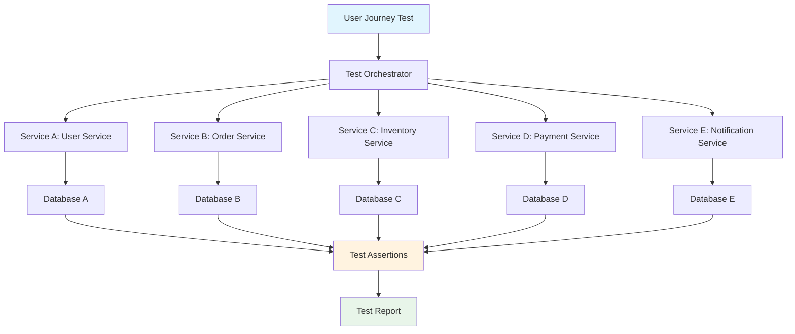
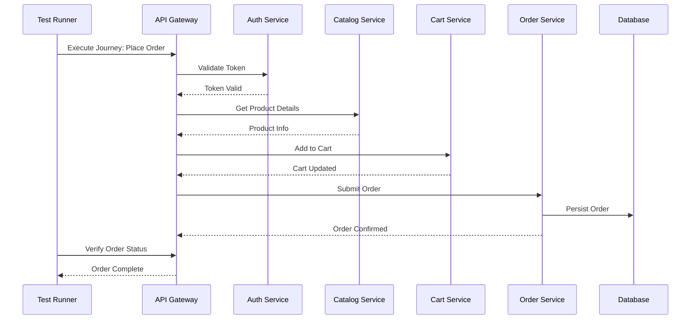

# User Journey Testing in Microservices

## Overview

User Journey Testing validates complete user workflows that span multiple microservices. Unlike unit tests that verify individual components in isolation, user journey tests simulate real-world scenarios where a user interacts with several services in sequence to accomplish meaningful tasks. In a microservices architecture, this is particularly challenging because each service may be developed by different teams, use different technologies, and have different failure modes. User journey testing ensures that the system works as an integrated whole from the user's perspective.

The fundamental principle behind user journey testing is that users don't care about individual services—they care about completing tasks. When a user places an order, they interact with the catalog service, inventory service, payment service, shipping service, and notification service. If any of these fail or have incorrect integrations, the user's experience is degraded. User journey tests catch these integration issues that unit and integration tests miss.

User journey tests are typically executed in staging or production-like environments where all services are deployed and configured to mirror production behavior. These tests require careful orchestration to set up the system state, execute the journey, and verify the final outcome. They also need to be isolated from each other to prevent test pollution and should be able to run in parallel when possible.

Key characteristics of user journey testing include: end-to-end coverage from UI to database, testing across service boundaries, validation of asynchronous operations and eventual consistency, handling of distributed transactions, and verification of data consistency across services. These tests are more expensive to run than unit tests but provide the highest confidence in system behavior.

### Flow Chart: User Journey Testing Architecture



### User Journey Testing Flow in Microservices



## Standard Example

```javascript
// user-journey.test.js - User Journey Testing Framework
const axios = require('axios');
const { v4: uuidv4 } = require('uuid');

/**
 * User Journey Test Suite: E-commerce Order Placement
 * 
 * This test validates the complete order placement workflow across multiple microservices:
 * 1. User Authentication
 * 2. Product Search and Selection
 * 3. Cart Management
 * 4. Checkout Process
 * 5. Order Confirmation
 * 6. Inventory Updates
 * 7. Notification Delivery
 */

class UserJourneyTestRunner {
    constructor(config) {
        this.baseUrl = config.apiGatewayUrl;
        this.services = config.services;
        this.testData = {};
    }

    /**
     * Initialize test environment and clean up previous test data
     */
    async setup() {
        console.log('Setting up test environment...');
        
        // Generate unique test identifiers
        this.testData.testId = uuidv4();
        this.testData.email = `test-${this.testData.testId}@example.com`;
        
        // Clean up any existing test data
        await this.cleanupTestData();
        
        // Verify all services are healthy
        await this.verifyServicesHealth();
        
        console.log('Test environment ready');
    }

    /**
     * Verify all required microservices are available
     */
    async verifyServicesHealth() {
        const healthChecks = await Promise.allSettled([
            this.checkServiceHealth(this.services.auth),
            this.checkServiceHealth(this.services.catalog),
            this.checkServiceHealth(this.services.cart),
            this.checkServiceHealth(this.services.orders),
            this.checkServiceHealth(this.services.inventory),
            this.checkServiceHealth(this.services.notifications)
        ]);

        const failedServices = healthChecks
            .filter((result, index) => result.status === 'rejected')
            .map((_, index) => ['auth', 'catalog', 'cart', 'orders', 'inventory', 'notifications'][index]);

        if (failedServices.length > 0) {
            throw new Error(`Services unavailable: ${failedServices.join(', ')}`);
        }
    }

    async checkServiceHealth(serviceUrl) {
        const response = await axios.get(`${serviceUrl}/health`, { timeout: 5000 });
        if (response.status !== 200) {
            throw new Error(`Service unhealthy: ${serviceUrl}`);
        }
        return response.data;
    }

    /**
     * Journey Step 1: User Registration and Authentication
     */
    async step1_registerAndLogin() {
        console.log('Step 1: Registering user...');
        
        // Register new user
        const registerResponse = await axios.post(`${this.services.auth}/api/v1/auth/register`, {
            email: this.testData.email,
            password: 'TestPassword123!',
            firstName: 'Test',
            lastName: 'User'
        });

        this.testData.userId = registerResponse.data.userId;
        this.testData.token = registerResponse.data.accessToken;

        // Verify token works
        const profileResponse = await axios.get(
            `${this.services.auth}/api/v1/users/profile`,
            { headers: { Authorization: `Bearer ${this.testData.token}` } }
        );

        console.log(`User registered: ${this.testData.userId}`);
        return {
            userId: this.testData.userId,
            token: this.testData.token
        };
    }

    /**
     * Journey Step 2: Product Search and Selection
     */
    async step2_searchProducts() {
        console.log('Step 2: Searching products...');

        // Search for products
        const searchResponse = await axios.get(
            `${this.services.catalog}/api/v1/products/search`,
            {
                params: {
                    query: 'laptop',
                    category: 'electronics',
                    limit: 10
                },
                headers: { Authorization: `Bearer ${this.testData.token}` }
            }
        );

        this.testData.products = searchResponse.data.products;
        
        // Select first available product
        const availableProduct = this.testData.products.find(p => p.stock > 0);
        if (!availableProduct) {
            throw new Error('No available products found');
        }

        this.testData.selectedProduct = availableProduct;
        console.log(`Selected product: ${availableProduct.name}`);

        return availableProduct;
    }

    /**
     * Journey Step 3: Add to Cart
     */
    async step3_addToCart() {
        console.log('Step 3: Adding product to cart...');

        const addToCartResponse = await axios.post(
            `${this.services.cart}/api/v1/cart/items`,
            {
                productId: this.testData.selectedProduct.id,
                quantity: 1
            },
            { headers: { Authorization: `Bearer ${this.testData.token}` } }
        );

        this.testData.cartId = addToCartResponse.data.cartId;
        this.testData.cartItems = addToCartResponse.data.items;

        console.log(`Added to cart. Cart total: ${addToCartResponse.data.total}`);
        return addToCartResponse.data;
    }

    /**
     * Journey Step 4: Checkout Process
     */
    async step4_checkout() {
        console.log('Step 4: Initiating checkout...');

        // Get shipping options
        const shippingResponse = await axios.get(
            `${this.services.orders}/api/v1/shipping/options`,
            {
                params: { addressId: this.testData.addressId },
                headers: { Authorization: `Bearer ${this.testData.token}` }
            }
        );

        // Select standard shipping
        const shippingOption = shippingResponse.data.options.find(o => o.type === 'standard');
        this.testData.shippingOption = shippingOption;

        // Process payment
        const paymentResponse = await axios.post(
            `${this.services.orders}/api/v1/payments/process`,
            {
                amount: this.testData.cartItems.reduce((sum, item) => sum + item.price * item.quantity, 0),
                currency: 'USD',
                paymentMethod: 'credit_card',
                cardDetails: {
                    number: '4111111111111111',
                    expiry: '12/26',
                    cvv: '123'
                }
            },
            { headers: { Authorization: `Bearer ${this.testData.token}` } }
        );

        this.testData.paymentId = paymentResponse.data.paymentId;
        console.log(`Payment processed: ${this.testData.paymentId}`);

        return { shippingOption, paymentId: this.testData.paymentId };
    }

    /**
     * Journey Step 5: Place Order
     */
    async step5_placeOrder() {
        console.log('Step 5: Placing order...');

        const orderResponse = await axios.post(
            `${this.services.orders}/api/v1/orders`,
            {
                cartId: this.testData.cartId,
                shippingAddress: {
                    street: '123 Test Street',
                    city: 'Test City',
                    state: 'TS',
                    zipCode: '12345',
                    country: 'US'
                },
                shippingOptionId: this.testData.shippingOption.id,
                paymentId: this.testData.paymentId
            },
            { headers: { Authorization: `Bearer ${this.testData.token}` } }
        );

        this.testData.orderId = orderResponse.data.orderId;
        this.testData.orderStatus = orderResponse.data.status;

        console.log(`Order placed: ${this.testData.orderId}, Status: ${this.testData.orderStatus}`);

        // Wait for order processing
        await this.waitForOrderProcessing();

        return orderResponse.data;
    }

    /**
     * Wait for asynchronous order processing to complete
     */
    async waitForOrderProcessing(maxAttempts = 10) {
        for (let i = 0; i < maxAttempts; i++) {
            const orderStatusResponse = await axios.get(
                `${this.services.orders}/api/v1/orders/${this.testData.orderId}`,
                { headers: { Authorization: `Bearer ${this.testData.token}` } }
            );

            const status = orderStatusResponse.data.status;
            if (['confirmed', 'processing', 'shipped'].includes(status)) {
                this.testData.orderStatus = status;
                console.log(`Order status: ${status}`);
                return;
            }

            await new Promise(resolve => setTimeout(resolve, 1000));
        }

        throw new Error('Order processing did not complete in time');
    }

    /**
     * Journey Step 6: Verify Inventory Update
     */
    async step6_verifyInventory() {
        console.log('Step 6: Verifying inventory update...');

        const inventoryResponse = await axios.get(
            `${this.services.inventory}/api/v1/products/${this.testData.selectedProduct.id}/stock`,
            { headers: { Authorization: `Bearer ${this.testData.token}` } }
        );

        const initialStock = this.testData.selectedProduct.stock;
        const currentStock = inventoryResponse.data.availableStock;

        // Verify stock was decremented
        if (currentStock !== initialStock - 1) {
            throw new Error(`Inventory not updated correctly. Expected: ${initialStock - 1}, Got: ${currentStock}`);
        }

        console.log(`Inventory verified: ${currentStock} units remaining`);
        return { initialStock, currentStock };
    }

    /**
     * Journey Step 7: Verify Notification
     */
    async step7_verifyNotification() {
        console.log('Step 7: Verifying notification delivery...');

        // Check notification status
        const notificationResponse = await axios.get(
            `${this.services.notifications}/api/v1/notifications`,
            {
                params: { orderId: this.testData.orderId },
                headers: { Authorization: `Bearer ${this.testData.token}` }
            }
        );

        const notifications = notificationResponse.data.notifications;
        const orderNotification = notifications.find(n => n.type === 'order_confirmation');

        if (!orderNotification) {
            throw new Error('Order confirmation notification not found');
        }

        if (orderNotification.status !== 'delivered') {
            throw new Error(`Notification not delivered. Status: ${orderNotification.status}`);
        }

        console.log('Notification delivered successfully');
        return orderNotification;
    }

    /**
     * Execute complete user journey
     */
    async executeJourney() {
        const results = {
            journeyName: 'Place Order',
            startTime: new Date().toISOString(),
            steps: [],
            success: false
        };

        try {
            // Setup
            await this.setup();

            // Execute journey steps
            results.steps.push({ name: 'registerAndLogin', result: await this.step1_registerAndLogin() });
            results.steps.push({ name: 'searchProducts', result: await this.step2_searchProducts() });
            results.steps.push({ name: 'addToCart', result: await this.step3_addToCart() });
            results.steps.push({ name: 'checkout', result: await this.step4_checkout() });
            results.steps.push({ name: 'placeOrder', result: await this.step5_placeOrder() });
            results.steps.push({ name: 'verifyInventory', result: await this.step6_verifyInventory() });
            results.steps.push({ name: 'verifyNotification', result: await this.step7_verifyNotification() });

            results.success = true;
            console.log('User journey completed successfully!');

        } catch (error) {
            results.error = error.message;
            results.stack = error.stack;
            console.error('User journey failed:', error.message);
        }

        results.endTime = new Date().toISOString();
        results.duration = new Date(results.endTime) - new Date(results.startTime);

        return results;
    }

    /**
     * Cleanup test data after test execution
     */
    async cleanup() {
        console.log('Cleaning up test data...');
        
        if (this.testData.orderId) {
            try {
                await axios.delete(
                    `${this.services.orders}/api/v1/orders/${this.testData.orderId}`,
                    { headers: { Authorization: `Bearer ${this.testData.token}` } }
                );
            } catch (e) {
                console.warn('Failed to cleanup order:', e.message);
            }
        }

        if (this.testData.cartId) {
            try {
                await axios.delete(
                    `${this.services.cart}/api/v1/cart/${this.testData.cartId}`,
                    { headers: { Authorization: `Bearer ${this.testData.token}` } }
                );
            } catch (e) {
                console.warn('Failed to cleanup cart:', e.message);
            }
        }

        console.log('Cleanup complete');
    }

    async cleanupTestData() {
        // Implementation for cleaning up test data
    }
}

// Test execution
async function runUserJourneyTests() {
    const config = {
        apiGatewayUrl: 'http://localhost:8080',
        services: {
            auth: 'http://localhost:8001',
            catalog: 'http://localhost:8002',
            cart: 'http://localhost:8003',
            orders: 'http://localhost:8004',
            inventory: 'http://localhost:8005',
            notifications: 'http://localhost:8006'
        }
    };

    const runner = new UserJourneyTestRunner(config);

    try {
        const results = await runner.executeJourney();
        
        // Generate test report
        console.log('\n=== User Journey Test Report ===');
        console.log(`Journey: ${results.journeyName}`);
        console.log(`Status: ${results.success ? 'PASSED' : 'FAILED'}`);
        console.log(`Duration: ${results.duration}ms`);
        console.log(`Steps Completed: ${results.steps.length}`);
        
        if (!results.success) {
            console.log(`Error: ${results.error}`);
            process.exit(1);
        }

    } finally {
        await runner.cleanup();
    }
}

module.exports = { UserJourneyTestRunner, runUserJourneyTests };
```

```javascript
// tests/user-journey.test.js
const { UserJourneyTestRunner } = require('../src/user-journey-test');

describe('User Journey Tests', () => {
    let runner;

    beforeAll(async () => {
        runner = new UserJourneyTestRunner({
            apiGatewayUrl: process.env.API_GATEWAY_URL || 'http://localhost:8080',
            services: {
                auth: process.env.AUTH_SERVICE_URL || 'http://localhost:8001',
                catalog: process.env.CATALOG_SERVICE_URL || 'http://localhost:8002',
                cart: process.env.CART_SERVICE_URL || 'http://localhost:8003',
                orders: process.env.ORDERS_SERVICE_URL || 'http://localhost:8004',
                inventory: process.env.INVENTORY_SERVICE_URL || 'http://localhost:8005',
                notifications: process.env.NOTIFICATIONS_SERVICE_URL || 'http://localhost:8006'
            }
        });
    });

    test('Complete order placement journey', async () => {
        const results = await runner.executeJourney();
        
        expect(results.success).toBe(true);
        expect(results.steps).toHaveLength(7);
        expect(results.duration).toBeLessThan(30000); // Should complete within 30 seconds
    });

    test('User can search, select, and purchase products', async () => {
        await runner.setup();
        
        // Register and login
        const authResult = await runner.step1_registerAndLogin();
        expect(authResult.userId).toBeDefined();
        expect(authResult.token).toBeDefined();

        // Search products
        const product = await runner.step2_searchProducts();
        expect(product.id).toBeDefined();
        expect(product.stock).toBeGreaterThan(0);

        // Add to cart
        const cart = await runner.step3_addToCart();
        expect(cart.cartId).toBeDefined();
        expect(cart.items).toHaveLength(1);

        // Checkout
        const checkout = await runner.step4_checkout();
        expect(checkout.paymentId).toBeDefined();

        // Place order
        const order = await runner.step5_placeOrder();
        expect(order.orderId).toBeDefined();
        expect(order.status).toMatch(/confirmed|processing/);

        await runner.cleanup();
    });

    test('Handles service failures gracefully', async () => {
        await runner.setup();
        
        // Attempt journey with simulated payment failure
        try {
            await runner.step1_registerAndLogin();
            await runner.step2_searchProducts();
            await runner.step3_addToCart();
            
            // This should fail due to invalid payment
            await runner.step4_checkout();
            fail('Should have thrown an error');
        } catch (error) {
            expect(error.message).toContain('payment');
        } finally {
            await runner.cleanup();
        }
    });
});
```

## Real-World Examples

### Netflix: User Journey Testing for Streaming

Netflix handles millions of user journeys daily, from account creation to video playback. Their user journey testing framework validates the complete streaming experience across dozens of microservices.

Key aspects of Netflix's approach:
- **Journey Coverage**: Tests cover account creation, subscription management, content browsing, video playback, and recommendation interactions
- **Real User Data**: Uses anonymized production traffic patterns to create realistic test scenarios
- **Chaos Integration**: Journey tests run alongside chaos engineering to verify resilience
- **Performance Gates**: Each journey has strict performance SLAs that must be met before deployment

```javascript
// Netflix-style streaming journey test
class StreamingJourneyTest {
    async testCompletePlaybackJourney() {
        // 1. User authentication
        const auth = await this.authService.validateCredentials(userCredentials);
        
        // 2. Get personalized recommendations
        const recommendations = await this.recommendationService.getPersonalizedList(auth.userId);
        
        // 3. Browse content catalog
        const browseResults = await this.catalogService.searchContent({
            genre: recommendations.preferredGenres[0],
            quality: 'HD'
        });
        
        // 4. Select title and get metadata
        const titleMetadata = await this.metadataService.getTitleDetails(browseResults.titles[0].id);
        
        // 5. Check content availability
        const availability = await this.contentService.checkAvailability(titleMetadata.contentId);
        
        // 6. Initialize playback session
        const session = await this.playbackService.createSession({
            userId: auth.userId,
            contentId: titleMetadata.contentId,
            deviceId: this.deviceId
        });
        
        // 7. Verify streaming starts successfully
        const streamStatus = await this.playbackService.getStreamStatus(session.sessionId);
        
        // Assertions
        expect(streamStatus.status).toBe('playing');
        expect(streamStatus.bufferLevel).toBeGreaterThan(5); // At least 5 seconds buffered
    }
}
```

### Amazon: Order Placement Journey Testing

Amazon's order placement journey spans over 100 microservices. Their testing approach ensures that every user can complete purchases regardless of which services are under load or experiencing issues.

Key testing patterns:
- **Multi-Region Testing**: Validates journeys work across different geographic regions
- **Inventory Race Conditions**: Tests concurrent purchasing of limited-stock items
- **Payment Failure Recovery**: Verifies graceful handling when payment services fail
- **Cart Abandonment**: Tests data consistency when users abandon carts mid-journey
- **Order Modification**: Validates order changes propagate correctly across services

```javascript
// Amazon-style order journey test
class AmazonOrderJourneyTest {
    async testCompleteOrderJourney() {
        // Create authenticated session
        const session = await this.authService.createSession(credentials);
        
        // Add multiple items to cart
        const cart = await this.cartService.addItems(session.sessionId, [
            { asin: 'B08N5WRWNW', quantity: 1 },
            { asin: 'B07YTF92QT', quantity: 2 }
        ]);
        
        // Apply promotional code
        const discount = await this.promotionService.applyCode(cart.cartId, 'SAVE20');
        
        // Select shipping address
        const address = await this.addressService.selectAddress(session.userId, 'default');
        
        // Get shipping options
        const shippingOptions = await this.shippingService.getOptions(address.zipCode);
        
        // Select fastest available option
        const selectedShipping = shippingOptions.find(opt => opt.deliveryDays === 2);
        
        // Process payment
        const paymentResult = await this.paymentService.process({
            cartId: cart.cartId,
            paymentMethod: 'credit_card',
            billingAddress: address
        });
        
        // Place order
        const order = await this.orderService.place({
            cartId: cart.cartId,
            shippingOption: selectedShipping.id,
            paymentId: paymentResult.paymentId
        });
        
        // Verify order confirmation
        const confirmation = await this.orderService.getConfirmation(order.orderId);
        
        expect(confirmation.status).toBe('confirmed');
        expect(confirmation.total).toBeLessThan(cart.subtotal);
        expect(confirmation.items).toHaveLength(2);
    }
}
```

## Output Statement

User Journey Testing provides the highest level of confidence that microservices work together correctly from the user's perspective. By testing complete workflows that span multiple services, teams can catch integration issues, data consistency problems, and end-to-end failures that unit and integration tests miss. The investment in user journey testing pays dividends in reduced production incidents and improved user satisfaction.

The key outputs of user journey testing include:
- **Pass/Fail Status**: Whether the complete journey executes successfully
- **Step-by-Step Results**: Detailed results for each journey step
- **Performance Metrics**: Time taken for each step and overall journey
- **Service Dependencies**: Mapping of which services are involved in each journey
- **Failure Analysis**: Detailed error information when journeys fail
- **Coverage Reports**: Which user journeys are covered by automated tests

```json
{
    "journeyName": "Place Order",
    "status": "PASSED",
    "duration": 4523,
    "steps": [
        { "name": "registerAndLogin", "duration": 234, "status": "passed" },
        { "name": "searchProducts", "duration": 156, "status": "passed" },
        { "name": "addToCart", "duration": 89, "status": "passed" },
        { "name": "checkout", "duration": 1203, "status": "passed" },
        { "name": "placeOrder", "duration": 567, "status": "passed" },
        { "name": "verifyInventory", "duration": 145, "status": "passed" },
        { "name": "verifyNotification", "duration": 1129, "status": "passed" }
    ],
    "services": {
        "auth": "200ms",
        "catalog": "156ms",
        "cart": "89ms",
        "orders": "1770ms",
        "inventory": "145ms",
        "notifications": "1129ms"
    },
    "assertions": {
        "total": 15,
        "passed": 15,
        "failed": 0
    }
}
```

## Best Practices

**1. Prioritize Critical User Journeys**

Not all journeys are equally important. Focus testing on journeys that generate the most revenue, have the highest user traffic, or cause the most severe impact when they fail. Create a journey priority matrix and allocate testing resources accordingly. Critical journeys like checkout, login, and payment should have comprehensive coverage, while less critical journeys may have lighter testing.

```javascript
const JOURNEY_PRIORITIES = {
    checkout: { priority: 'critical', frequency: 'every deployment' },
    login: { priority: 'critical', frequency: 'every deployment' },
    payment: { priority: 'critical', frequency: 'every deployment' },
    search: { priority: 'high', frequency: 'daily' },
    browse: { priority: 'medium', frequency: 'nightly' },
    profile_update: { priority: 'low', frequency: 'weekly' }
};
```

**2. Implement Journey Test Isolation**

Each test should start with a clean state and not depend on the results of previous tests. Use database transactions that roll back after each test, or implement thorough cleanup procedures. This prevents test pollution where one failing test causes subsequent tests to fail. Parallel test execution requires additional care to ensure tests don't interfere with each other.

**3. Use Realistic Test Data**

Create test data that mirrors production patterns including realistic user profiles, product catalogs, and order histories. Avoid using obvious test data like "Test User" or "Product 123" that might behave differently than production data. Consider using data masking or synthetic data generation that preserves the statistical properties of production data.

**4. Handle Asynchronous Operations**

Microservices often use asynchronous patterns like event-driven architecture or eventual consistency. Your journey tests must account for this by implementing appropriate wait strategies, polling mechanisms, or event listening to verify asynchronous outcomes. Don't assume that because a request returned successfully, the final state has been reached.

**5. Implement Comprehensive Assertions**

Journey tests should verify not just that operations complete without errors, but that the correct data flows through the system. Assert on database state, message queue contents, cache entries, and external service calls. Verify that side effects like notifications, analytics events, and audit logs are created correctly.

**6. Monitor Performance in Journey Tests**

Include performance assertions in your journey tests to catch performance regressions early. Define SLAs for each journey step and for the overall journey. Track performance trends over time to identify gradual degradation before it becomes a problem.

```javascript
const PERFORMANCE_SLAS = {
    'registerAndLogin': 500,  // ms
    'searchProducts': 300,
    'addToCart': 200,
    'checkout': 2000,
    'placeOrder': 1000,
    'verifyInventory': 500,
    'verifyNotification': 2000,
    'totalJourney': 8000
};
```

**7. Make Journey Tests Maintainable**

Break large journeys into smaller, composable steps that can be combined in different ways. Use the Page Object pattern to encapsulate service interactions. Create reusable journey components for common patterns like authentication or checkout. This makes tests easier to maintain and allows for more flexible test scenarios.

**8. Run Journey Tests in CI/CD Pipeline**

Integrate journey tests into your continuous integration pipeline, running them after unit and integration tests pass. Configure pipeline gates to block deployments if critical journey tests fail. Consider running a subset of journey tests on every commit and full journey tests on merge to main branch.

**9. Use Journey Test Results for Monitoring**

Leverage journey test infrastructure for synthetic monitoring in production. The same test code that validates deployments can run continuously against production to detect issues before users encounter them. This provides early warning of service degradation or integration failures.

**10. Document Journey Test Coverage**

Maintain documentation that maps user journeys to test coverage, showing which journeys are tested, at what level, and what the expected outcomes are. This helps teams understand test coverage gaps and prioritize additional test development. Include diagrams showing journey flows and the services involved in each.