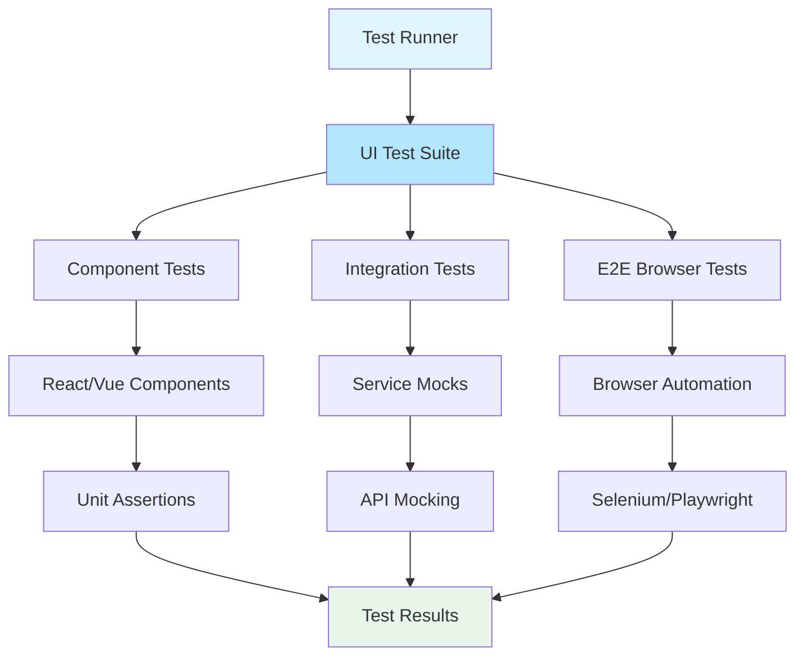
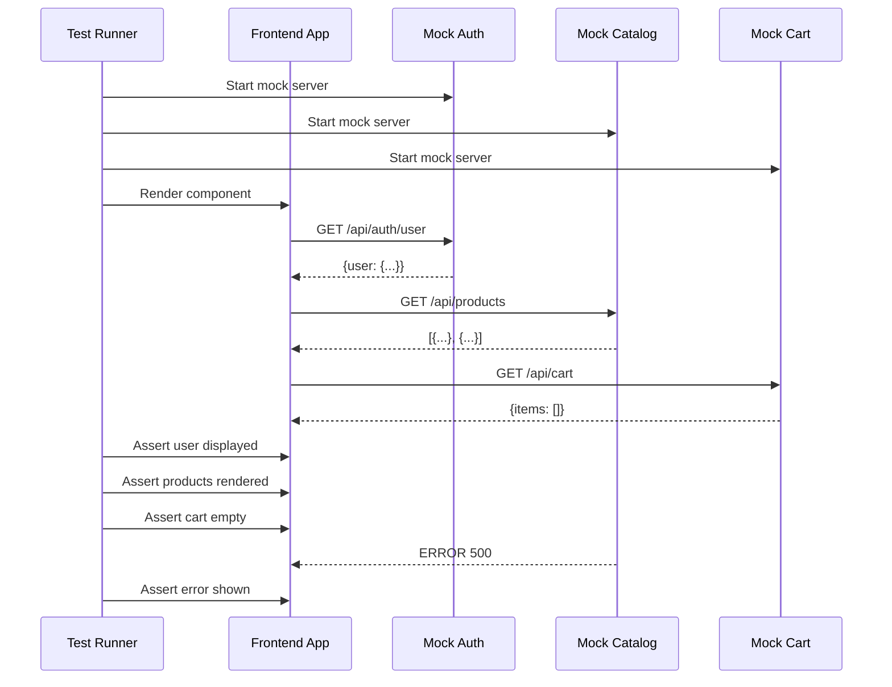

# UI Testing for Microservices Frontends

## Overview

UI Testing in a microservices context presents unique challenges that differ significantly from monolithic applications. The frontend must integrate with multiple backend services, each potentially using different APIs, authentication mechanisms, and error handling patterns. UI tests must validate not just the visual presentation but also the correct interaction with these distributed services, handling partial failures gracefully, and providing coherent user experiences despite backend complexity.

The fundamental challenge is that the UI serves as the orchestration layer for multiple microservices. When a user performs an action, it may trigger calls to auth service, catalog service, cart service, payment service, and others. The UI must handle successful responses, partial failures, timeouts, and retry scenarios from each of these services while maintaining a consistent user experience. UI tests validate this orchestration logic and ensure users receive appropriate feedback regardless of backend service states.

Effective UI testing for microservices requires understanding the contract between the frontend and each service, simulating various backend scenarios, and verifying that the UI correctly surfaces information from multiple sources. Tests should cover happy paths, error handling, loading states, and edge cases where services respond with unexpected data or fail entirely.

Another critical aspect is testing the integration points where services meet. The UI might correctly display data from one service but fail to integrate properly with another. Tests should verify data flows correctly through the UI from each service, ensuring that the assembled experience works as intended.

### Flow Chart: UI Testing Architecture in Microservices



### Microservices UI Testing Flow



## Standard Example

```javascript
// ui-testing-framework.js - UI Testing Framework for Microservices

const { chromium, firefox, webkit } = require('playwright');
const axios = require('axios');

/**
 * UI Test Suite for E-commerce Microservices Frontend
 * 
 * This framework provides comprehensive UI testing capabilities for
 * microservices-based frontends, including:
 * - Component testing with mocked services
 * - Integration testing with real service interactions
 * - End-to-end browser testing
 * - Service failure simulation
 */

class MicroservicesUITestFramework {
    constructor(config) {
        this.config = config;
        this.browser = null;
        this.context = null;
        this.mocks = new Map();
    }

    /**
     * Initialize the test framework and launch browser
     */
    async initialize() {
        const browserType = this.config.browser || 'chromium';
        
        switch (browserType) {
            case 'firefox':
                this.browser = await firefox.launch(this.config.browserOptions);
                break;
            case 'webkit':
                this.browser = await webkit.launch(this.config.browserOptions);
                break;
            default:
                this.browser = await chromium.launch(this.config.browserOptions);
        }

        this.context = await this.browser.newContext({
            viewport: this.config.viewport || { width: 1280, height: 720 },
            locale: this.config.locale || 'en-US'
        });

        console.log(`Browser initialized: ${browserType}`);
    }

    /**
     * Start mock servers to simulate microservice responses
     */
    async startServiceMocks(services) {
        for (const [serviceName, serviceConfig] of Object.entries(services)) {
            const mockServer = new ServiceMockServer(serviceConfig);
            await mockServer.start();
            this.mocks.set(serviceName, mockServer);
            console.log(`Mock ${serviceName} started on port ${mockServer.port}`);
        }
    }

    /**
     * Create a new page for testing
     */
    async createPage() {
        const page = await this.context.newPage();
        return new PageWrapper(page, this.mocks);
    }

    /**
     * Clean up resources
     */
    async cleanup() {
        for (const mock of this.mocks.values()) {
            await mock.stop();
        }
        if (this.context) {
            await this.context.close();
        }
        if (this.browser) {
            await this.browser.close();
        }
    }
}

/**
 * Service Mock Server for simulating microservice responses
 */
class ServiceMockServer {
    constructor(config) {
        this.port = config.port || 3000 + Math.floor(Math.random() * 1000);
        this.routes = new Map();
        this.server = null;
        this.delay = config.delay || 0;
        this.errorRate = config.errorRate || 0;
    }

    async start() {
        // Simple mock server implementation
        const express = require('express');
        this.server = express();
        
        this.server.use(express.json());
        this.server.use((req, res, next) => {
            setTimeout(next, this.delay);
        });

        // Add route handlers
        this.server.all('*', async (req, res) => {
            const routeKey = `${req.method}:${req.path}`;
            const handler = this.routes.get(routeKey);

            if (Math.random() < this.errorRate) {
                return res.status(500).json({ error: 'Simulated error' });
            }

            if (handler) {
                const response = await handler(req);
                return res.status(response.status || 200).json(response.body);
            }

            res.status(404).json({ error: 'Not found' });
        });

        return new Promise((resolve) => {
            this.server.listen(this.port, () => {
                console.log(`Mock server listening on ${this.port}`);
                resolve();
            });
        });
    }

    route(method, path, handler) {
        this.routes.set(`${method}:${path}`, handler);
    }

    async stop() {
        if (this.server) {
            return new Promise((resolve) => {
                this.server.close(resolve);
            });
        }
    }
}

/**
 * Page Wrapper with fluent API for common assertions
 */
class PageWrapper {
    constructor(page, mocks) {
        this.page = page;
        this.mocks = mocks;
    }

    /**
     * Navigate to a URL
     */
    async goto(url, options = {}) {
        await this.page.goto(url, options);
        return this;
    }

    /**
     * Wait for element to be visible
     */
    async waitForSelector(selector, options = {}) {
        await this.page.waitForSelector(selector, options);
        return this;
    }

    /**
     * Click an element
     */
    async click(selector, options = {}) {
        await this.page.click(selector, options);
        return this;
    }

    /**
     * Fill input field
     */
    async fill(selector, value) {
        await this.page.fill(selector, value);
        return this;
    }

    /**
     * Get text content of element
     */
    async textContent(selector) {
        return await this.page.textContent(selector);
    }

    /**
     * Get attribute value
     */
    async getAttribute(selector, attribute) {
        return await this.page.getAttribute(selector, attribute);
    }

    /**
     * Check if element is visible
     */
    async isVisible(selector) {
        const element = await this.page.$(selector);
        return element ? await element.isVisible() : false;
    }

    /**
     * Wait for network idle
     */
    async waitForNetworkIdle(options = {}) {
        await this.page.waitForLoadState('networkidle', options);
        return this;
    }

    /**
     * Take screenshot
     */
    async screenshot(options = {}) {
        return await this.page.screenshot(options);
    }

    /**
     * Evaluate JavaScript in page context
     */
    async evaluate(fn, ...args) {
        return await this.page.evaluate(fn, ...args);
    }

    /**
     * Wait for API response
     */
    async waitForApiResponse(urlPattern, options = {}) {
        const response = await this.page.waitForResponse(
            response => response.url().match(urlPattern) && response.status() === 200,
            options
        );
        return response;
    }

    /**
     * Assert element contains text
     */
    async assertText(selector, expectedText) {
        const actualText = await this.textContent(selector);
        if (!actualText.includes(expectedText)) {
            throw new Error(`Expected "${expectedText}" but found "${actualText}"`);
        }
    }

    /**
     * Assert element is visible
     */
    async assertVisible(selector) {
        const visible = await this.isVisible(selector);
        if (!visible) {
            throw new Error(`Element "${selector}" is not visible`);
        }
    }

    /**
     * Assert element is hidden
     */
    async assertHidden(selector) {
        const visible = await this.isVisible(selector);
        if (visible) {
            throw new Error(`Element "${selector}" should be hidden but is visible`);
        }
    }

    /**
     * Assert URL matches pattern
     */
    async assertUrl(pattern) {
        const url = this.page.url();
        if (!url.match(pattern)) {
            throw new Error(`Expected URL "${pattern}" but got "${url}"`);
        }
    }
}

/**
 * Example UI Tests for Microservices E-commerce Application
 */
class EcommerceUITests {
    constructor(framework) {
        this.framework = framework;
    }

    /**
     * Test: User login flow
     * Validates interaction with auth service through UI
     */
    async testLoginFlow() {
        const page = await this.framework.createPage();
        
        // Configure auth service mock
        this.framework.mocks.get('auth').route('POST', '/api/v1/auth/login', (req) => ({
            body: {
                success: true,
                token: 'eyJhbGciOiJIUzI1NiIsInR5cCI6IkpXVCJ9',
                user: {
                    id: 'user-123',
                    email: 'test@example.com',
                    name: 'Test User'
                }
            }
        }));

        // Navigate to login page
        await page.goto('http://localhost:3000/login');
        
        // Fill login form
        await page.fill('#email', 'test@example.com');
        await page.fill('#password', 'password123');
        
        // Click login button
        await page.click('#login-button');
        
        // Wait for navigation or success indicator
        await page.waitForNetworkIdle({ timeout: 5000 });
        
        // Assert login successful
        await page.assertUrl('/dashboard');
        await page.assertVisible('#user-menu');
        
        console.log('Login flow test passed');
    }

    /**
     * Test: Product catalog displays correctly
     * Validates catalog service integration
     */
    async testProductCatalog() {
        const page = await this.framework.createPage();
        
        // Configure catalog service mock
        this.framework.mocks.get('catalog').route('GET', '/api/v1/products', (req) => ({
            body: {
                products: [
                    { id: 'prod-1', name: 'Laptop Pro', price: 1299.99, image: '/img/laptop.jpg' },
                    { id: 'prod-2', name: 'Wireless Mouse', price: 49.99, image: '/img/mouse.jpg' },
                    { id: 'prod-3', name: 'USB-C Hub', price: 79.99, image: '/img/hub.jpg' }
                ],
                total: 3,
                page: 1
            }
        }));

        // Navigate to catalog
        await page.goto('http://localhost:3000/catalog');
        
        // Wait for products to load
        await page.waitForSelector('.product-card', { timeout: 10000 });
        
        // Assert products are displayed
        const productCount = await this.framework.page.$$eval('.product-card', cards => cards.length);
        if (productCount !== 3) {
            throw new Error(`Expected 3 products but found ${productCount}`);
        }
        
        // Verify product details
        await page.assertText('.product-card:first-child .product-name', 'Laptop Pro');
        await page.assertText('.product-card:first-child .product-price', '$1,299.99');
        
        console.log('Product catalog test passed');
    }

    /**
     * Test: Shopping cart functionality
     * Validates cart service integration
     */
    async testAddToCart() {
        const page = await this.framework.createPage();
        
        // Configure mocks
        this.framework.mocks.get('catalog').route('GET', '/api/v1/products/prod-1', () => ({
            body: { id: 'prod-1', name: 'Test Product', price: 99.99, stock: 10 }
        }));

        this.framework.mocks.get('cart').route('POST', '/api/v1/cart/items', () => ({
            body: {
                success: true,
                cartId: 'cart-123',
                items: [{ productId: 'prod-1', quantity: 1, price: 99.99 }]
            }
        }));

        // Navigate to product page
        await page.goto('http://localhost:3000/product/prod-1');
        
        // Wait for product to load
        await page.waitForSelector('.add-to-cart-button');
        
        // Add to cart
        await page.click('.add-to-cart-button');
        
        // Wait for cart update
        await page.waitForSelector('.cart-count', { state: 'visible' });
        
        // Assert cart count
        const cartCount = await page.textContent('.cart-count');
        if (cartCount !== '1') {
            throw new Error(`Expected cart count "1" but got "${cartCount}"`);
        }
        
        // Assert success message
        await page.assertVisible('.toast-success');
        
        console.log('Add to cart test passed');
    }

    /**
     * Test: Service failure handling
     * Validates UI gracefully handles backend service failures
     */
    async testServiceFailureHandling() {
        const page = await this.framework.createPage();
        
        // Configure catalog service to return error
        this.framework.mocks.get('catalog').route('GET', '/api/v1/products', () => ({
            status: 503,
            body: { error: 'Service unavailable' }
        }));

        // Navigate to catalog
        await page.goto('http://localhost:3000/catalog');
        
        // Wait for error handling
        await page.waitForSelector('.error-message', { timeout: 10000 });
        
        // Assert error message displayed
        await page.assertVisible('.error-message');
        await page.assertText('.error-message', 'Unable to load products. Please try again.');
        
        // Assert retry button available
        await page.assertVisible('.retry-button');
        
        // Test retry functionality
        this.framework.mocks.get('catalog').route('GET', '/api/v1/products', () => ({
            body: { products: [], total: 0 }
        }));
        
        await page.click('.retry-button');
        await page.waitForSelector('.loading-indicator');
        
        console.log('Service failure handling test passed');
    }

    /**
     * Test: Checkout flow with multiple services
     * Validates complete checkout journey across services
     */
    async testCheckoutFlow() {
        const page = await this.framework.createPage();
        
        // Setup mock responses for all services involved in checkout
        this.framework.mocks.get('cart').route('GET', '/api/v1/cart/cart-123', () => ({
            body: {
                cartId: 'cart-123',
                items: [
                    { productId: 'prod-1', name: 'Product 1', quantity: 2, price: 50.00 }
                ],
                subtotal: 100.00
            }
        }));

        this.framework.mocks.get('shipping').route('GET', '/api/v1/shipping/options', () => ({
            body: {
                options: [
                    { id: 'standard', name: 'Standard Shipping', price: 5.00, days: '5-7' },
                    { id: 'express', name: 'Express Shipping', price: 15.00, days: '1-2' }
                ]
            }
        }));

        this.framework.mocks.get('payment').route('POST', '/api/v1/payments/process', () => ({
            body: {
                success: true,
                paymentId: 'pay-123',
                transactionId: 'txn-456'
            }
        }));

        this.framework.mocks.get('orders').route('POST', '/api/v1/orders', () => ({
            body: {
                orderId: 'order-789',
                status: 'confirmed',
                estimatedDelivery: '2024-01-15'
            }
        }));

        // Navigate to checkout
        await page.goto('http://localhost:3000/checkout/cart-123');
        
        // Wait for cart to load
        await page.waitForSelector('.checkout-cart-items');
        
        // Select shipping option
        await page.click('input[value="express"]');
        
        // Proceed to payment
        await page.click('#proceed-to-payment');
        
        // Fill payment details
        await page.fill('#card-number', '4111111111111111');
        await page.fill('#expiry', '12/26');
        await page.fill('#cvv', '123');
        
        // Place order
        await page.click('#place-order');
        
        // Wait for order confirmation
        await page.waitForSelector('.order-confirmation', { timeout: 10000 });
        
        // Assert order confirmed
        await page.assertVisible('.order-success');
        await page.assertText('.order-id', 'order-789');
        
        console.log('Checkout flow test passed');
    }

    /**
     * Test: Real-time updates from services
     * Validates UI updates when services push updates
     */
    async testRealTimeUpdates() {
        const page = await this.framework.createPage();
        
        // Start with initial cart state
        this.framework.mocks.get('cart').route('GET', '/api/v1/cart/cart-123', () => ({
            body: { items: [], count: 0 }
        }));

        await page.goto('http://localhost:3000/cart');
        
        // Simulate WebSocket message (via console)
        await page.evaluate(() => {
            window.dispatchEvent(new CustomEvent('cart-updated', {
                detail: { items: [{ productId: 'prod-1', quantity: 1 }], count: 1 }
            }));
        });

        // Wait for UI to update
        await page.waitForTimeout(500);
        
        // Assert cart updated
        const cartCount = await page.textContent('.cart-badge');
        if (cartCount !== '1') {
            throw new Error(`Expected cart count "1" but got "${cartCount}"`);
        }
        
        console.log('Real-time updates test passed');
    }
}

// Run all tests
async function runUITests() {
    const framework = new MicroservicesUITestFramework({
        browser: 'chromium',
        viewport: { width: 1920, height: 1080 },
        browserOptions: { headless: true }
    });

    await framework.initialize();

    // Start service mocks
    await framework.startServiceMocks({
        auth: { port: 8001, delay: 100 },
        catalog: { port: 8002, delay: 200 },
        cart: { port: 8003, delay: 150 },
        shipping: { port: 8004, delay: 100 },
        payment: { port: 8005, delay: 300 },
        orders: { port: 8006, delay: 200 }
    });

    const tests = new EcommerceUITests(framework);

    const results = [];

    // Run test cases
    const testCases = [
        { name: 'Login Flow', fn: tests.testLoginFlow.bind(tests) },
        { name: 'Product Catalog', fn: tests.testProductCatalog.bind(tests) },
        { name: 'Add to Cart', fn: tests.testAddToCart.bind(tests) },
        { name: 'Service Failure Handling', fn: tests.testServiceFailureHandling.bind(tests) },
        { name: 'Checkout Flow', fn: tests.testCheckoutFlow.bind(tests) },
        { name: 'Real-time Updates', fn: tests.testRealTimeUpdates.bind(tests) }
    ];

    for (const testCase of testCases) {
        console.log(`\nRunning: ${testCase.name}`);
        try {
            await testCase.fn();
            results.push({ name: testCase.name, status: 'PASSED' });
        } catch (error) {
            results.push({ name: testCase.name, status: 'FAILED', error: error.message });
            console.error(`Test failed: ${error.message}`);
        }
    }

    // Print summary
    console.log('\n=== UI Test Results ===');
    results.forEach(r => {
        console.log(`${r.status}: ${r.name}${r.error ? ` - ${r.error}` : ''}`);
    });

    await framework.cleanup();

    const passed = results.filter(r => r.status === 'PASSED').length;
    console.log(`\nTotal: ${passed}/${results.length} tests passed`);
}

module.exports = { MicroservicesUITestFramework, EcommerceUITests };
```

## Real-World Examples

### Netflix: UI Testing for Video Streaming Platform

Netflix's UI testing approach handles the complexity of testing a frontend that communicates with dozens of backend services for content delivery, recommendations, playback, and user management.

Key aspects of Netflix's UI testing:
- **Component-Level Testing**: Each UI component is tested with mocked service responses to ensure correct rendering
- **Service Contract Testing**: Tests validate that the UI correctly handles all possible service response formats
- **Visual Regression Testing**: Captures screenshots to detect unintended visual changes
- **Device-Specific Testing**: Tests run across multiple devices and browsers
- **Playback Testing**: Special focus on video player controls and streaming indicators

```javascript
// Netflix-style video player UI test
class NetflixPlayerTest {
    async testVideoPlaybackControls() {
        // Mock content service
        const contentService = new MockContentService();
        contentService.mock('GET', '/api/v1/content/movie-123', {
            title: 'Test Movie',
            streamUrl: 'https://cdn.netflix.com/stream/movie.m3u8',
            duration: 7200,
            subtitles: ['en', 'es', 'fr']
        });

        // Mock recommendation service
        const recommendationService = new MockRecommendationService();
        recommendationService.mock('GET', '/api/v1/recommendations', {
            items: []
        });

        const page = await this.createTestPage();
        
        // Navigate to movie page
        await page.goto('/video/movie-123');
        
        // Wait for player to initialize
        await page.waitForSelector('.video-player');
        
        // Start playback
        await page.click('.play-button');
        
        // Verify playback started
        await page.waitForSelector('.playing-indicator');
        
        // Test controls
        await page.click('.volume-button');
        await page.assertVisible('.volume-muted');
        
        // Seek to position
        await page.evaluate(() => {
            window.videoPlayer.seek(1800); // 30 minutes
        });
        
        // Verify seek worked
        const currentTime = await page.evaluate(() => window.videoPlayer.getCurrentTime());
        expect(currentTime).toBeGreaterThan(1790);
        
        // Test subtitle selection
        await page.click('.subtitles-button');
        await page.click('.subtitle-option:has-text("Español")');
        
        const subtitleLanguage = await page.evaluate(() => window.videoPlayer.getSubtitleLanguage());
        expect(subtitleLanguage).toBe('es');
    }

    async testRecommendationPanel() {
        // Mock recommendation service with realistic data
        const mockRecommendations = {
            "continue-watching": [
                { contentId: 'show-1', title: 'Stranger Things', progress: 0.75 },
                { contentId: 'movie-2', title: 'Inception', progress: 0.3 }
            ],
            "because-you-watched": [
                { contentId: 'movie-3', title: 'The Matrix', similarity: 0.9 },
                { contentId: 'movie-4', title: 'Dark City', similarity: 0.85 }
            ],
            "trending": [
                { contentId: 'show-5', title: 'Breaking Bad', popularity: 0.95 },
                { contentId: 'show-6', title: 'The Wire', popularity: 0.9 }
            ]
        };

        this.recommendationService.mock('GET', '/api/v1/recommendations', mockRecommendations);

        const page = await this.createTestPage();
        await page.goto('/browse');

        // Wait for recommendations to load
        await page.waitForSelector('.recommendation-row');

        // Verify all categories displayed
        const categories = await page.$$eval('.recommendation-row h3', els => els.map(e => e.textContent));
        expect(categories).toContain('Continue Watching');
        expect(categories).toContain('Because You Watched');
        expect(categories).toContain('Trending Now');

        // Verify thumbnails loaded
        const thumbnails = await page.$$('.recommendation-thumbnail');
        expect(thumbnails.length).toBeGreaterThan(5);
    }
}
```

### Amazon: UI Testing for E-commerce Platform

Amazon's UI must integrate with numerous backend services for product search, inventory, pricing, cart, checkout, and order management. Their testing ensures the UI correctly orchestrates these services.

Key testing patterns:
- **Search and Discovery**: Tests product search, filters, sorting, and recommendations
- **Product Detail Pages**: Validates product information from multiple services
- **Shopping Cart**: Tests cart operations with inventory validation
- **Checkout Flow**: Validates address selection, payment processing, and order placement
- **Order Management**: Tests order history, tracking, and returns

```javascript
// Amazon-style e-commerce UI test
class AmazonUITest {
    async testProductSearchWithFilters() {
        // Mock search service
        const searchService = new MockSearchService();
        searchService.mock('GET', '/api/v1/search', {
            results: [
                { asin: 'B08N5WRWNW', title: 'Apple MacBook Pro', price: 1999.99, rating: 4.8 },
                { asin: 'B07YTF92QT', title: 'Dell XPS 15', price: 1499.99, rating: 4.5 }
            ],
            totalResults: 2,
            filters: {
                brand: ['Apple', 'Dell', 'Lenovo'],
                priceRange: ['$1000-$1500', '$1500-$2000', '$2000+']
            }
        });

        const page = await this.createTestPage();
        
        // Perform search
        await page.goto('/search?q=laptop');
        await page.fill('#search-input', 'laptop');
        await page.click('#search-submit');
        
        // Wait for results
        await page.waitForSelector('.search-results');
        
        // Apply brand filter
        await page.click('.filter-option:has-text("Apple")');
        
        // Wait for filtered results
        await page.waitForSelector('.product-item');
        
        // Verify filtered results
        const resultTitles = await page.$$eval('.product-title', els => els.map(e => e.textContent));
        expect(resultTitles.every(t => t.includes('Apple'))).toBe(true);
        
        // Sort by price
        await page.selectOption('#sort-select', 'price-asc');
        
        // Verify sorted order
        const prices = await page.$$eval('.product-price', els => els.map(e => parseFloat(e.textContent.replace('$', ''))));
        expect(prices).toEqual(prices.sort((a, b) => a - b));
    }

    async testAddToCartWithInventoryCheck() {
        // Mock inventory service - item in stock
        const inventoryService = new MockInventoryService();
        inventoryService.mock('GET', '/api/v1/inventory/B08N5WRWNW', {
            asin: 'B08N5WRWNW',
            available: true,
            quantity: 15,
            warehouse: 'nearest'
        });

        // Mock price service
        const priceService = new MockPriceService();
        priceService.mock('GET', '/api/v1/pricing/B08N5WRWNW', {
            asin: 'B08N5WRWNW',
            currentPrice: 1999.99,
            previousPrice: 2299.99,
            discount: '13%'
        });

        const page = await this.createTestPage();
        
        // Navigate to product page
        await page.goto('/product/B08N5WRWNW');
        
        // Verify inventory status displayed
        await page.assertText('.inventory-status', 'In Stock');
        
        // Add to cart
        await page.click('#add-to-cart-button');
        
        // Verify cart updated
        await page.waitForSelector('.cart-confirmation');
        await page.assertVisible('.cart-success-message');
        
        // Verify cart count
        const cartCount = await page.textContent('#cart-count');
        expect(cartCount).toBe('1');
    }

    async testOneClickCheckout() {
        // Setup complete checkout mocks
        const checkoutService = new MockCheckoutService();
        
        // Mock addresses
        checkoutService.mock('GET', '/api/v1/user/addresses', {
            addresses: [
                { id: 'addr-1', default: true, street: '123 Main St', city: 'Seattle' }
            ]
        });

        // Mock payment methods
        checkoutService.mock('GET', '/api/v1/user/payment-methods', {
            methods: [
                { id: 'pm-1', type: 'credit_card', default: true }
            ]
        });

        // Mock Prime eligibility
        checkoutService.mock('GET', '/api/v1/checkout/eligibility', {
            primeEligible: true,
            primeDeliveryDate: 'Tomorrow'
        });

        const page = await this.createTestPage();
        
        // Navigate to checkout with cart
        await page.goto('/checkout/one-click');
        
        // Verify address pre-selected
        await page.assertText('.selected-address', '123 Main St, Seattle');
        
        // Verify payment pre-selected
        await page.assertVisible('.selected-payment');
        
        // Verify Prime delivery shown
        await page.assertText('.delivery-date', 'FREE delivery: Tomorrow');
        
        // Place order
        await page.click('#place-order-button');
        
        // Verify confirmation
        await page.waitForSelector('.order-confirmation');
        const orderId = await page.textContent('.order-id');
        expect(orderId).toMatch(/^ORDER-\d+$/);
    }
}
```

## Output Statement

UI Testing for microservices frontends validates that the user interface correctly integrates with multiple backend services, providing a coherent and functional experience. Effective UI tests catch integration issues, service failure handling problems, and user experience issues that unit tests cannot detect.

The key outputs of UI testing include:
- **Test Results**: Pass/fail status for each UI test case
- **Screenshots**: Visual evidence of UI state at test failure points
- **Console Logs**: JavaScript errors and warnings captured during tests
- **Network Logs**: API calls and responses for debugging
- **Performance Metrics**: UI rendering and interaction times
- **Coverage Reports**: Which UI components and service integrations are tested

```json
{
    "testSuite": "E-commerce UI Tests",
    "totalTests": 24,
    "passed": 22,
    "failed": 2,
    "duration": "4m 32s",
    "results": [
        { "name": "Login Flow", "status": "passed", "duration": "2.3s" },
        { "name": "Product Catalog", "status": "passed", "duration": "3.1s" },
        { "name": "Add to Cart", "status": "passed", "duration": "2.8s" },
        { "name": "Service Failure Handling", "status": "passed", "duration": "1.9s" },
        { "name": "Checkout Flow", "status": "passed", "duration": "8.5s" },
        { "name": "Real-time Updates", "status": "failed", "duration": "1.2s", "error": "Cart count not updated" }
    ],
    "serviceIntegration": {
        "auth": { "tests": 4, "passed": 4 },
        "catalog": { "tests": 6, "passed": 5 },
        "cart": { "tests": 5, "passed": 5 },
        "payment": { "tests": 4, "passed": 4 },
        "orders": { "tests": 5, "passed": 4 }
    }
}
```

## Best Practices

**1. Mock External Services at the Right Level**

Use service mocks that respond with realistic data matching production contracts. Avoid mocking too deeply within the frontend code; instead, use network-level mocking or service virtualization to test the actual HTTP interactions. This ensures your tests catch issues with service communication, not just isolated component logic.

```javascript
// Good: Network-level mock
const mockServer = new MockServiceWorker();
mockServer.use(
    rest.get('https://api.example.com/products', (req, res, ctx) => {
        return res(
            ctx.json({
                products: [
                    { id: '1', name: 'Test Product', price: 99.99 }
                ]
            })
        );
    })
);

// Bad: Mocking inside component
const useProducts = () => {
    // This doesn't test real API integration
    return useState([{ id: '1', name: 'Test Product' }]);
};
```

**2. Test Service Failure Scenarios**

Microservices are distributed systems where failures are inevitable. Your UI tests should validate graceful handling of service timeouts, errors, and partial failures. Test scenarios like service returning error status, service taking too long to respond, service returning malformed data, and network connectivity issues.

```javascript
// Test service timeout handling
async testServiceTimeout() {
    // Configure mock to delay response beyond timeout
    serviceMock.delay('GET', '/api/products', 30000); // 30 second delay
    
    const page = await createTestPage();
    await page.goto('/products');
    
    // UI should show timeout error after configured timeout
    await page.waitForSelector('.error-timeout');
    await page.assertText('.error-timeout', 'Request timed out');
}
```

**3. Implement Visual Regression Testing**

Capture screenshots at key points in your tests to detect unintended visual changes. Use tools like Percy, Chromatic, or backstopJS to compare screenshots across commits. This catches CSS regressions, layout issues, and broken UI elements that functional tests might miss.

**4. Test Across Browsers and Devices**

Different browsers and devices may render UI differently. Run your UI tests across Chrome, Firefox, Safari, and Edge, as well as various viewport sizes and device types. Focus testing on browsers and devices most commonly used by your target audience.

**5. Use Meaningful Test Data**

Create test data that resembles real production data including realistic product names, prices, and user information. This helps catch issues like text truncation, number formatting, and date display that might not appear with generic test data.

**6. Implement Proper Waiting Strategies**

Avoid hardcoded sleeps; instead use explicit waits for elements to appear, disappear, or contain specific text. Playwright and Selenium provide robust waiting mechanisms that handle dynamic content better than arbitrary delays.

```javascript
// Good: Explicit wait
await page.waitForSelector('.product-loaded', { state: 'visible', timeout: 10000 });

// Bad: Arbitrary sleep
await new Promise(resolve => setTimeout(resolve, 5000));
```

**7. Test Accessibility**

Include accessibility testing in your UI test suite. Use tools like axe-core or Lighthouse to detect accessibility violations during UI tests. This ensures your application is usable by people with disabilities and often catches structural issues in the UI.

**8. Keep Tests Independent**

Each UI test should be able to run independently without relying on the state created by previous tests. Use setup and teardown methods to create fresh state for each test. This enables parallel test execution and prevents cascading failures.

**9. Use Page Object Pattern**

Encapsulate page interactions in page object classes that provide a clean API for test code. This improves test maintainability when UI changes; you update the page object rather than all test cases.

```javascript
// Page Object
class ProductPage {
    constructor(page) {
        this.page = page;
    }

    async addToCart() {
        await this.page.click('#add-to-cart');
        await this.page.waitForSelector('.cart-updated');
    }

    async getPrice() {
        return await this.page.textContent('.price');
    }
}

// Test usage
test('Add to cart updates price', async () => {
    const productPage = new ProductPage(page);
    await productPage.goto('/product/123');
    await productPage.addToCart();
    expect(await cartPage.getItemCount()).toBe(1);
});
```

**10. Monitor Test Performance**

Track UI test execution times and optimize slow tests. Slow UI tests indicate problems with test setup, service mocks, or unnecessary waits. Fast tests enable quicker feedback cycles and more frequent execution.