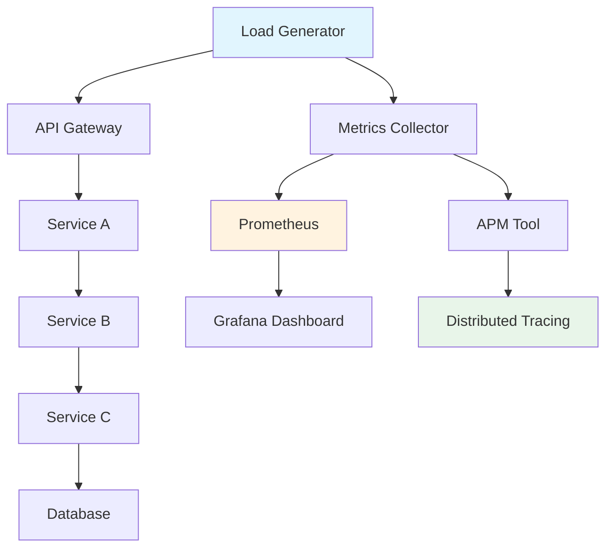
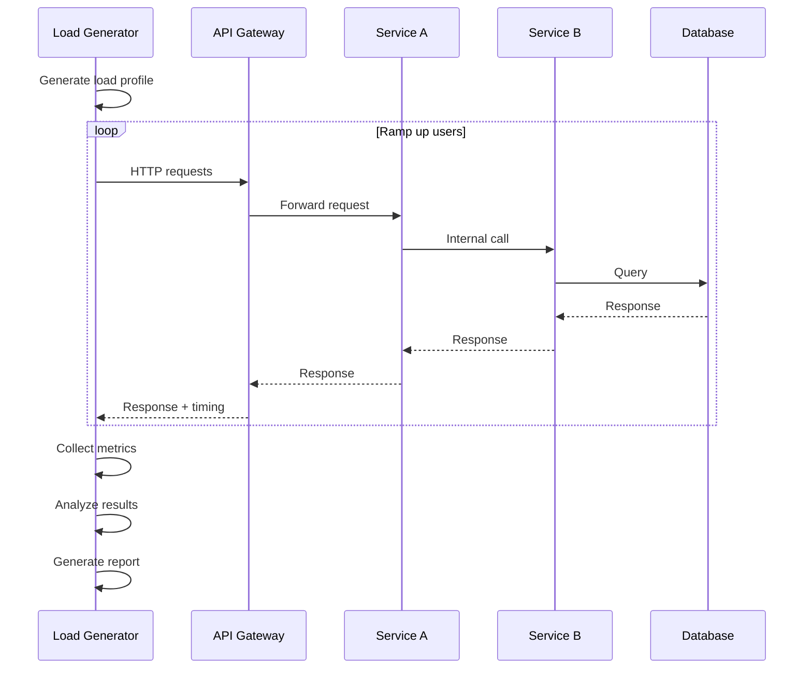

# Performance Testing for Microservices

## Overview

Performance Testing in microservices environments measures how the system behaves under various load conditions, focusing on response times, throughput, resource utilization, and scalability. Unlike monolithic applications where performance testing targets a single application, microservices performance testing must account for network latency between services, service discovery overhead, distributed tracing complexity, and the cumulative effect of multiple services working together.

The primary goal of performance testing is to establish baseline performance metrics and identify bottlenecks before they impact production users. In a microservices architecture, performance issues often stem from inter-service communication patterns, database connection pooling, message queue throughput, or inefficient service orchestration. Performance tests simulate realistic workloads and measure how the system scales.

Key aspects of microservices performance testing include measuring end-to-end latency across service chains, identifying which service contributes most to total response time, testing under failure conditions to verify graceful degradation, and validating that caching and circuit breakers improve performance. Performance testing should be automated and integrated into the CI/CD pipeline to catch performance regressions early.

The distributed nature of microservices means that performance issues can be subtle and difficult to diagnose. A single request might traverse five or six services, each adding latency. Performance tests must capture detailed metrics for each service in the call chain to pinpoint where delays occur.

### Flow Chart: Performance Testing Architecture



### Performance Testing Flow



## Standard Example

```javascript
// performance-test.js - Performance Testing Framework for Microservices

const axios = require('axios');
const { performance } = require('perf_hooks');

/**
 * Performance Testing Framework for Microservices
 * 
 * This framework provides comprehensive performance testing capabilities:
 * - Response time measurement
 * - Throughput testing
 * - Resource utilization monitoring
 * - Service-level performance analysis
 * - Trend analysis and benchmarking
 */

class MicroservicesPerformanceTest {
    constructor(config) {
        this.config = config;
        this.results = [];
        this.metrics = {
            responseTimes: [],
            throughput: [],
            errors: [],
            serviceTimes: {}
        };
    }

    /**
     * Execute performance test with specified load profile
     */
    async runPerformanceTest(loadProfile) {
        console.log(`Starting performance test: ${loadProfile.name}`);
        console.log(`Users: ${loadProfile.users}, Duration: ${loadProfile.duration}s`);

        const startTime = Date.now();
        const endTime = startTime + (loadProfile.duration * 1000);
        
        // Track concurrent requests
        let activeRequests = 0;
        let completedRequests = 0;
        let totalRequests = 0;
        
        // Initialize metrics per service
        for (const service of this.config.services) {
            this.metrics.serviceTimes[service.name] = [];
        }

        // Create request generator
        const requestGenerator = this.createRequestGenerator(loadProfile);
        
        // Start metrics collection
        const metricsInterval = setInterval(() => {
            this.collectSystemMetrics();
        }, 1000);

        // Execute load test
        const promises = [];
        
        while (Date.now() < endTime) {
            // Control concurrency based on target users
            while (activeRequests < loadProfile.users && promises.length < loadProfile.users) {
                const promise = this.executeRequest(loadProfile.endpoint, loadProfile.method)
                    .then(result => {
                        activeRequests--;
                        completedRequests++;
                        this.recordRequest(result);
                    })
                    .catch(error => {
                        activeRequests--;
                        completedRequests++;
                        this.recordError(error);
                    });
                
                promises.push(promise);
                activeRequests++;
                totalRequests++;
            }

            // Wait for some requests to complete
            if (promises.length > 0) {
                await Promise.race(promises.filter(p => p.status === 'pending'));
            }
            
            // Remove completed promises
            const completed = promises.filter(p => p.status === 'fulfilled' || p.status === 'rejected');
            completed.forEach(p => {
                const index = promises.indexOf(p);
                if (index > -1) promises.splice(index, 1);
            });
        }

        // Wait for remaining requests
        await Promise.all(promises);

        clearInterval(metricsInterval);

        const duration = (Date.now() - startTime) / 1000;
        
        return this.generateTestReport(loadProfile, duration, totalRequests, completedRequests);
    }

    /**
     * Create request generator based on load profile
     */
    createRequestGenerator(loadProfile) {
        const endpoints = Array.isArray(loadProfile.endpoint) 
            ? loadProfile.endpoint 
            : [loadProfile.endpoint];

        return {
            next() {
                const endpoint = endpoints[Math.floor(Math.random() * endpoints.length)];
                return {
                    endpoint,
                    method: loadProfile.method || 'GET',
                    payload: loadProfile.payload
                };
            }
        };
    }

    /**
     * Execute single request and measure timing
     */
    async executeRequest(endpoint, method = 'GET', payload = null) {
        const startTime = performance.now();
        const requestStart = Date.now();

        try {
            const config = {
                method,
                url: `${this.config.baseUrl}${endpoint}`,
                timeout: this.config.timeout || 30000,
                headers: {
                    'Content-Type': 'application/json',
                    ...this.config.headers
                }
            };

            if (payload) {
                config.data = payload;
            }

            const response = await axios(config);
            const endTime = performance.now();
            
            return {
                success: true,
                statusCode: response.status,
                responseTime: endTime - startTime,
                timestamp: requestStart,
                responseSize: JSON.stringify(response.data).length,
                headers: response.headers
            };

        } catch (error) {
            const endTime = performance.now();
            
            return {
                success: false,
                error: error.message,
                responseTime: endTime - startTime,
                timestamp: requestStart,
                statusCode: error.response?.status
            };
        }
    }

    /**
     * Record successful request metrics
     */
    recordRequest(result) {
        this.metrics.responseTimes.push(result.responseTime);
        
        // Calculate percentiles
        this.calculatePercentiles();
    }

    /**
     * Record error metrics
     */
    recordError(error) {
        this.metrics.errors.push({
            timestamp: Date.now(),
            error: error.error || error.message,
            statusCode: error.statusCode
        });
    }

    /**
     * Calculate response time percentiles
     */
    calculatePercentiles() {
        const sorted = [...this.metrics.responseTimes].sort((a, b) => a - b);
        
        return {
            p50: sorted[Math.floor(sorted.length * 0.5)],
            p90: sorted[Math.floor(sorted.length * 0.9)],
            p95: sorted[Math.floor(sorted.length * 0.95)],
            p99: sorted[Math.floor(sorted.length * 0.99)],
            min: sorted[0],
            max: sorted[sorted.length - 1],
            mean: sorted.reduce((a, b) => a + b, 0) / sorted.length
        };
    }

    /**
     * Collect system-level metrics
     */
    async collectSystemMetrics() {
        try {
            // Collect metrics from each service
            for (const service of this.config.services) {
                try {
                    const response = await axios.get(`${service.url}/metrics`, {
                        timeout: 2000
                    });
                    
                    if (!this.metrics.serviceTimes[service.name]) {
                        this.metrics.serviceTimes[service.name] = [];
                    }
                    
                    this.metrics.serviceTimes[service.name].push({
                        timestamp: Date.now(),
                        cpu: response.data.cpu || 0,
                        memory: response.data.memory || 0,
                        requests: response.data.requests || 0,
                        responseTime: response.data.avgResponseTime || 0
                    });
                } catch (e) {
                    // Service may not have metrics endpoint
                }
            }
        } catch (error) {
            console.warn('Failed to collect system metrics:', error.message);
        }
    }

    /**
     * Generate comprehensive test report
     */
    generateTestReport(loadProfile, duration, totalRequests, completedRequests) {
        const successfulRequests = totalRequests - this.metrics.errors.length;
        const percentiles = this.calculatePercentiles();

        const report = {
            testName: loadProfile.name,
            timestamp: new Date().toISOString(),
            duration: duration.toFixed(2),
            loadProfile: {
                users: loadProfile.users,
                endpoint: loadProfile.endpoint,
                method: loadProfile.method
            },
            summary: {
                totalRequests,
                completedRequests,
                successfulRequests,
                failedRequests: this.metrics.errors.length,
                throughput: (totalRequests / duration).toFixed(2) + ' req/s',
                errorRate: ((this.metrics.errors.length / totalRequests) * 100).toFixed(2) + '%'
            },
            responseTime: {
                min: percentiles.min.toFixed(2) + 'ms',
                max: percentiles.max.toFixed(2) + 'ms',
                mean: percentiles.mean.toFixed(2) + 'ms',
                p50: percentiles.p50.toFixed(2) + 'ms',
                p90: percentiles.p90.toFixed(2) + 'ms',
                p95: percentiles.p95.toFixed(2) + 'ms',
                p99: percentiles.p99.toFixed(2) + 'ms'
            },
            serviceMetrics: {},
            errors: this.metrics.errors.slice(0, 10), // Include first 10 errors
            recommendations: []
        };

        // Calculate service-level metrics
        for (const [serviceName, metrics] of Object.entries(this.metrics.serviceTimes)) {
            if (metrics.length > 0) {
                const avgCpu = metrics.reduce((sum, m) => sum + m.cpu, 0) / metrics.length;
                const avgMemory = metrics.reduce((sum, m) => sum + m.memory, 0) / metrics.length;
                const avgResponseTime = metrics.reduce((sum, m) => sum + m.responseTime, 0) / metrics.length;

                report.serviceMetrics[serviceName] = {
                    avgCpu: avgCpu.toFixed(2) + '%',
                    avgMemory: avgMemory.toFixed(2) + '%',
                    avgResponseTime: avgResponseTime.toFixed(2) + 'ms'
                };

                // Generate recommendations
                if (avgCpu > 80) {
                    report.recommendations.push(`${serviceName}: High CPU usage - consider scaling or optimization`);
                }
                if (avgMemory > 85) {
                    report.recommendations.push(`${serviceName}: High memory usage - investigate memory leaks`);
                }
                if (avgResponseTime > 500) {
                    report.recommendations.push(`${serviceName}: Slow response time - optimize query or add caching`);
                }
            }
        }

        return report;
    }

    /**
     * Run a series of performance tests with increasing load
     */
    async runLoadProgression() {
        const results = [];
        const profiles = [
            { name: 'Baseline', users: 10, duration: 30, endpoint: '/api/products' },
            { name: 'Moderate Load', users: 50, duration: 30, endpoint: '/api/products' },
            { name: 'High Load', users: 100, duration: 30, endpoint: '/api/products' },
            { name: 'Stress', users: 200, duration: 30, endpoint: '/api/products' }
        ];

        for (const profile of profiles) {
            console.log(`\nRunning: ${profile.name}`);
            const result = await this.runPerformanceTest(profile);
            results.push(result);
            
            // Cool down period between tests
            await this.sleep(10000);
        }

        return results;
    }

    /**
     * Compare results and identify trends
     */
    analyzeTrends(results) {
        return {
            throughputTrend: results.map(r => parseFloat(r.summary.throughput)),
            responseTimeTrend: results.map(r => parseFloat(r.responseTime.mean)),
            errorRateTrend: results.map(r => parseFloat(r.summary.errorRate)),
            slowestService: Object.entries(results[results.length - 1].serviceMetrics)
                .sort((a, b) => parseFloat(b[1].avgResponseTime) - parseFloat(a[1].avgResponseTime))[0]
        };
    }

    sleep(ms) {
        return new Promise(resolve => setTimeout(resolve, ms));
    }
}

/**
 * Service Performance Monitoring
 */
class ServicePerformanceMonitor {
    constructor(serviceUrl) {
        this.serviceUrl = serviceUrl;
        this.healthChecks = [];
    }

    /**
     * Monitor service health over time
     */
    async monitor(durationMs, intervalMs = 1000) {
        const endTime = Date.now() + durationMs;
        
        while (Date.now() < endTime) {
            const start = Date.now();
            
            try {
                const response = await axios.get(`${this.serviceUrl}/health`);
                const latency = Date.now() - start;
                
                this.healthChecks.push({
                    timestamp: new Date().toISOString(),
                    status: response.status,
                    latency,
                    healthy: response.data.status === 'healthy'
                });
            } catch (error) {
                this.healthChecks.push({
                    timestamp: new Date().toISOString(),
                    status: 'unhealthy',
                    error: error.message,
                    healthy: false
                });
            }
            
            await this.sleep(intervalMs);
        }

        return this.generateHealthReport();
    }

    /**
     * Generate health report from collected data
     */
    generateHealthReport() {
        const healthy = this.healthChecks.filter(h => h.healthy).length;
        const total = this.healthChecks.length;
        const latencies = this.healthChecks.filter(h => h.healthy).map(h => h.latency);

        return {
            serviceUrl: this.serviceUrl,
            uptime: ((healthy / total) * 100).toFixed(2) + '%',
            totalChecks: total,
            healthyChecks: healthy,
            avgLatency: (latencies.reduce((a, b) => a + b, 0) / latencies.length).toFixed(2) + 'ms',
            minLatency: Math.min(...latencies) + 'ms',
            maxLatency: Math.max(...latencies) + 'ms'
        };
    }

    sleep(ms) {
        return new Promise(resolve => setTimeout(resolve, ms));
    }
}

/**
 * End-to-End Performance Test Example
 */
async function runPerformanceTests() {
    const test = new MicroservicesPerformanceTest({
        baseUrl: 'http://localhost:8080',
        timeout: 30000,
        services: [
            { name: 'api-gateway', url: 'http://localhost:8000' },
            { name: 'product-service', url: 'http://localhost:8001' },
            { name: 'order-service', url: 'http://localhost:8002' },
            { name: 'user-service', url: 'http://localhost:8003' }
        ]
    });

    // Test 1: Baseline performance
    const baselineResult = await test.runPerformanceTest({
        name: 'Baseline Test',
        users: 10,
        duration: 30,
        endpoint: '/api/v1/products',
        method: 'GET'
    });

    console.log('\n=== Baseline Test Results ===');
    console.log(`Throughput: ${baselineResult.summary.throughput}`);
    console.log(`Mean Response Time: ${baselineResult.responseTime.mean}`);
    console.log(`P95 Response Time: ${baselineResult.responseTime.p95}`);

    // Test 2: High load performance
    const highLoadResult = await test.runPerformanceTest({
        name: 'High Load Test',
        users: 100,
        duration: 30,
        endpoint: '/api/v1/products',
        method: 'GET'
    });

    console.log('\n=== High Load Test Results ===');
    console.log(`Throughput: ${highLoadResult.summary.throughput}`);
    console.log(`Mean Response Time: ${highLoadResult.responseTime.mean}`);
    console.log(`P95 Response Time: ${highLoadResult.responseTime.p95}`);

    // Test 3: Complex query performance
    const complexQueryResult = await test.runPerformanceTest({
        name: 'Complex Query Test',
        users: 20,
        duration: 30,
        endpoint: '/api/v1/orders/search',
        method: 'POST'
    });

    console.log('\n=== Complex Query Test Results ===');
    console.log(`Throughput: ${complexQueryResult.summary.throughput}`);
    console.log(`Mean Response Time: ${complexQueryResult.responseTime.mean}`);
    console.log(`P95 Response Time: ${complexQueryResult.responseTime.p95}`);

    // Service monitoring
    console.log('\n=== Service Health Monitoring ===');
    const monitor = new ServicePerformanceMonitor('http://localhost:8001');
    const healthReport = await monitor.monitor(30000);
    console.log(`Uptime: ${healthReport.uptime}`);
    console.log(`Avg Latency: ${healthReport.avgLatency}`);
}

module.exports = { MicroservicesPerformanceTest, ServicePerformanceMonitor };
```

## Real-World Examples

### Netflix: Performance Testing for Streaming Platform

Netflix faces unique performance challenges with millions of users streaming content simultaneously. Their performance testing infrastructure validates that the platform can handle peak loads while maintaining quality of experience.

Key aspects:
- **Global Distribution Testing**: Tests across multiple regions with varying network conditions
- **Video Encoding Performance**: Measures encoding throughput and latency
- **CDN Performance**: Validates content delivery network performance
- **Playback Initialization**: Measures time from click to first frame
- **Adaptive Bitrate Testing**: Tests switching between quality levels

```javascript
// Netflix-style streaming performance test
class StreamingPerformanceTest {
    async testPlaybackInitialization() {
        const results = [];
        
        // Test playback start time across different conditions
        const testScenarios = [
            { network: '4G', location: 'US-East', quality: 'auto' },
            { network: 'WiFi', location: 'EU-West', quality: '1080p' },
            { network: 'Broadband', location: 'Asia-Pacific', quality: '4K' }
        ];

        for (const scenario of testScenarios) {
            const times = [];
            
            for (let i = 0; i < 100; i++) {
                const startTime = Date.now();
                
                // Simulate playback request
                const response = await this.cdnService.getManifest(scenario.contentId);
                const manifestTime = Date.now() - startTime;
                
                // Simulate segment fetch
                const segmentStart = Date.now();
                await this.cdnService.getSegment(response.segments[0]);
                const segmentTime = Date.now() - segmentStart;
                
                times.push({
                    manifest: manifestTime,
                    firstSegment: segmentTime,
                    total: manifestTime + segmentTime
                });
            }

            results.push({
                scenario,
                avgManifest: this.average(times.map(t => t.manifest)),
                avgFirstSegment: this.average(times.map(t => t.firstSegment)),
                avgTotal: this.average(times.map(t => t.total)),
                p95: this.percentile(times.map(t => t.total), 0.95)
            });
        }

        return results;
    }

    async testConcurrentStreams() {
        // Test system capacity for concurrent streams
        const loadLevels = [1000, 5000, 10000, 50000, 100000];
        const results = [];

        for (const targetStreams of loadLevels) {
            const startTime = Date.now();
            
            // Simulate stream requests
            const streams = await this.simulateStreams(targetStreams);
            
            // Measure quality metrics
            const qualityMetrics = await this.measureStreamQuality(streams);
            
            results.push({
                targetStreams,
                actualStreams: streams.length,
                avgBitrate: qualityMetrics.avgBitrate,
                rebufferRatio: qualityMetrics.rebufferRatio,
                startupTime: qualityMetrics.startupTime,
                duration: Date.now() - startTime
            });
        }

        return results;
    }
}
```

### Amazon: Performance Testing for E-commerce Platform

Amazon's performance testing ensures the platform can handle massive traffic during events like Prime Day. Tests validate that search, product pages, cart, checkout, and payment all perform under extreme load.

Key testing patterns:
- **Search Performance**: Tests search latency under high load
- **Product Page Load**: Measures page render time with multiple services
- **Cart Operations**: Validates cart read/write performance
- **Checkout Throughput**: Tests payment processing capacity
- **Inventory Accuracy**: Validates real-time inventory updates under load

```javascript
// Amazon-style e-commerce performance test
class EcommercePerformanceTest {
    async testSearchPerformance() {
        const searchTerms = [
            'laptop', 'phone', 'headphones', 'camera', 'watch',
            'shoes', 'clothes', 'book', 'toys', 'kitchen'
        ];

        // Baseline test
        const baseline = await this.runSearchLoad(searchTerms, 10, 60);
        
        // Peak load test
        const peakLoad = await this.runSearchLoad(searchTerms, 500, 60);
        
        // Stress test
        const stress = await this.runSearchLoad(searchTerms, 2000, 60);

        return {
            baseline: this.analyzeResults(baseline),
            peakLoad: this.analyzeResults(peakLoad),
            stress: this.analyzeResults(stress)
        };
    }

    async runSearchLoad(terms, concurrentUsers, duration) {
        const results = [];
        const endTime = Date.now() + (duration * 1000);

        while (Date.now() < endTime) {
            const promises = [];
            
            for (let i = 0; i < concurrentUsers; i++) {
                const term = terms[Math.floor(Math.random() * terms.length)];
                
                promises.push(this.measureSearchTime(term));
            }

            const batchResults = await Promise.all(promises);
            results.push(...batchResults);
        }

        return results;
    }

    async measureSearchTime(term) {
        const startTime = Date.now();
        
        // Search request
        const response = await axios.get(`${this.searchService}/search`, {
            params: { q: term, page: 1, size: 20 }
        });
        
        const searchTime = Date.now() - startTime;
        
        // Measure product detail fetch for first result
        if (response.data.results.length > 0) {
            const productStart = Date.now();
            await axios.get(`${this.catalogService}/products/${response.data.results[0].id}`);
            const productTime = Date.now() - productStart;
            
            return {
                searchTime,
                productTime,
                totalTime: searchTime + productTime,
                resultsCount: response.data.results.length
            };
        }
        
        return { searchTime, productTime: 0, totalTime: searchTime, resultsCount: 0 };
    }

    async testCheckoutPerformance() {
        const testCarts = this.generateTestCarts(1000);
        
        // Measure checkout throughput
        const startTime = Date.now();
        
        const checkoutPromises = testCarts.map(cart => 
            this.processCheckout(cart)
        );
        
        const results = await Promise.allSettled(checkoutPromises);
        
        const duration = Date.now() - startTime;
        
        return {
            totalCheckouts: testCarts.length,
            duration: duration + 'ms',
            throughput: (testCarts.length / (duration / 1000)).toFixed(2) + ' checkouts/s',
            successRate: results.filter(r => r.status === 'fulfilled').length / testCarts.length * 100 + '%',
            avgProcessingTime: this.average(
                results
                    .filter(r => r.status === 'fulfilled')
                    .map(r => r.value.processingTime)
            ) + 'ms'
        };
    }
}
```

## Output Statement

Performance testing provides critical insights into how microservices behave under various load conditions. By measuring response times, throughput, resource utilization, and error rates, teams can identify bottlenecks, validate scalability, and establish performance baselines for production monitoring.

The key outputs of performance testing include:
- **Response Time Metrics**: Min, max, mean, and percentile response times
- **Throughput Analysis**: Requests per second at various load levels
- **Resource Utilization**: CPU, memory, and network usage per service
- **Error Analysis**: Error rates and types of failures under load
- **Service Dependency Performance**: Time spent in each service along the request path
- **Recommendations**: Specific actions to improve performance

```json
{
    "testName": "Product API Performance Test",
    "timestamp": "2024-01-15T10:30:00Z",
    "load": {
        "users": 100,
        "duration": 60,
        "endpoint": "/api/v1/products"
    },
    "summary": {
        "totalRequests": 45632,
        "successfulRequests": 45421,
        "failedRequests": 211,
        "throughput": "760.5 req/s",
        "errorRate": "0.46%"
    },
    "responseTime": {
        "min": "45ms",
        "max": "2341ms",
        "mean": "123ms",
        "p50": "98ms",
        "p90": "245ms",
        "p95": "456ms",
        "p99": "1234ms"
    },
    "serviceMetrics": {
        "api-gateway": { "avgCpu": "45%", "avgMemory": "62%", "avgResponseTime": "12ms" },
        "product-service": { "avgCpu": "78%", "avgMemory": "71%", "avgResponseTime": "89ms" },
        "inventory-service": { "avgCpu": "34%", "avgMemory": "45%", "avgResponseTime": "22ms" }
    },
    "recommendations": [
        "product-service: High CPU usage - consider horizontal scaling",
        "p95 response time exceeds target - investigate slow queries"
    ]
}
```

## Best Practices

**1. Establish Performance Baselines**

Before making changes, establish baseline performance metrics that represent acceptable performance. Use these baselines to detect regressions and validate improvements. Include response time targets at various percentile levels (p50, p90, p95, p99), throughput targets for normal and peak loads, and resource utilization thresholds for each service.

```javascript
const PERFORMANCE_BASELINES = {
    'api-gateway': {
        responseTime: { p50: '50ms', p95: '150ms', p99: '300ms' },
        throughput: '1000 req/s',
        cpu: '70%',
        memory: '80%'
    },
    'product-service': {
        responseTime: { p50: '100ms', p95: '300ms', p99: '500ms' },
        throughput: '500 req/s',
        cpu: '75%',
        memory: '85%'
    },
    // ...
};
```

**2. Test Across the Stack**

Performance issues can originate anywhere in the technology stack. Test database queries, message queue processing, cache hit rates, and network latency between services. Don't assume the frontend is the bottleneck—measure each component.

**3. Use Realistic Workloads**

Create test workloads that mirror production traffic patterns. Use production traffic analysis to understand request distribution, peak times, and common user journeys. Synthetic random traffic may not expose issues that appear with realistic patterns.

**4. Measure Service-Level Metrics**

In addition to end-to-end metrics, measure performance for each service in the call chain. Use distributed tracing to understand where time is spent. This helps identify which service is causing slowdowns.

```javascript
// Example: Service-level timing
const timing = {
    'api-gateway': [],
    'auth-service': [],
    'product-service': [],
    'inventory-service': []
};

// Capture timing for each service
request.on('response', (response) => {
    timing['api-gateway'].push(measureTime(start, now));
});

// Aggregate and report
for (const [service, times] of Object.entries(timing)) {
    console.log(`${service} avg: ${average(times)}ms`);
}
```

**5. Test Degraded Performance**

Measure performance when services are running at reduced capacity, with network latency, or under partial failure. This helps understand worst-case user experience and validates that degraded modes work correctly.

**6. Automate Performance Tests**

Integrate performance tests into CI/CD pipelines to catch regressions before deployment. Run baseline tests on every merge and comprehensive tests on release candidates. Use performance gates to block deployments that exceed thresholds.

**7. Use Appropriate Load Generation Tools**

Choose load generation tools that match your testing needs. Tools like k6, Gatling, or Locust provide good scripting capabilities for complex scenarios. For Kubernetes environments, tools like kubectl can generate load within the cluster.

**8. Monitor for Context Switching**

In microservices, context switching between services adds overhead. Test with real service calls rather than mocked responses to capture this overhead. Use connection pooling and keep-alive to minimize connection establishment costs.

**9. Test Caching Effectiveness**

Measure cache hit rates and the performance impact of caching. Test with both warm and cold caches to understand the performance difference. Validate cache invalidation strategies work correctly.

**10. Document and Share Results**

Create performance test reports that are accessible to all stakeholders. Include visualizations of trends over time. Share findings across teams to drive performance improvements throughout the organization.