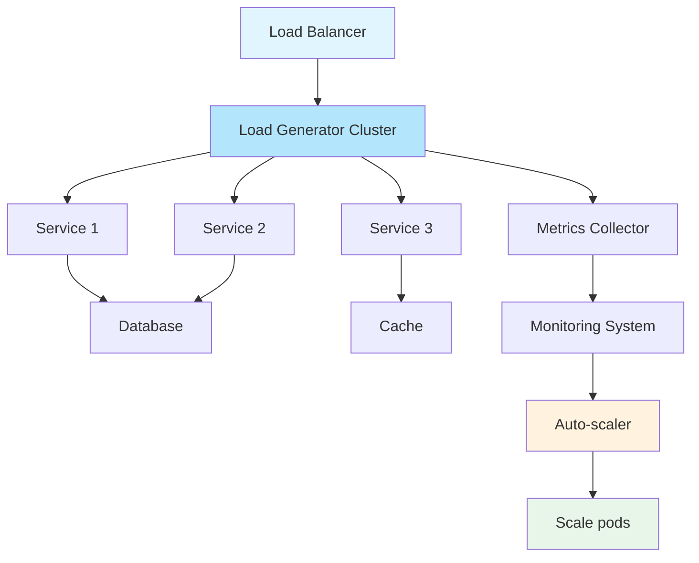
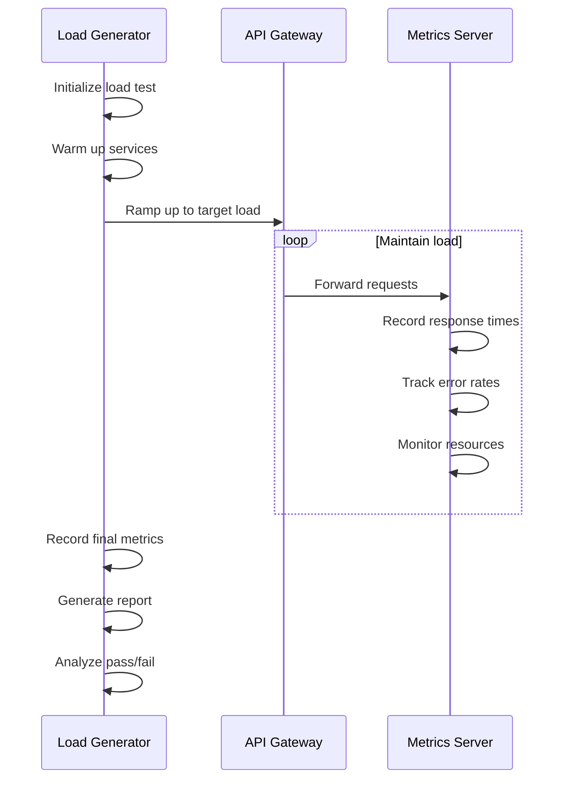

# Load Testing for Microservices

## Overview

Load Testing validates that microservices can handle expected user loads while maintaining acceptable performance. Unlike performance testing which focuses on measuring response times under various conditions, load testing specifically targets the system's behavior at expected production volumes. The primary goal is to verify that the system can handle anticipated traffic without degradation.

In microservices architectures, load testing must account for the distributed nature of the system. Each service may have different capacity limits, and the overall system capacity is limited by the weakest service in the chain. Load tests should simulate realistic traffic patterns, including peaks and valleys, and measure how services interact under load.

Key aspects of load testing include validating service scalability, measuring throughput limits, identifying degradation points, testing autoscaling behavior, and verifying that load balancing correctly distributes traffic. Load tests should be run regularly to detect capacity issues as the system grows and changes.

Load testing differs from stress testing in that stress testing pushes the system beyond normal operating capacity to find breaking points, while load testing validates behavior at expected capacity levels. Both are important, but they serve different purposes in a comprehensive testing strategy.

### Flow Chart: Load Testing Architecture



### Load Testing Flow



## Standard Example

```javascript
// load-test.js - Load Testing Framework for Microservices

const axios = require('axios');
const { EventEmitter } = require('events');

/**
 * Load Testing Framework for Microservices
 * 
 * Provides comprehensive load testing capabilities:
 * - Configurable load patterns
 * - Real-time metrics collection
 * - Service health monitoring
 * - Automated pass/fail evaluation
 */

class LoadTestRunner extends EventEmitter {
    constructor(config) {
        super();
        this.config = config;
        this.results = {
            requests: [],
            errors: [],
            latencies: [],
            throughput: []
        };
        this.running = false;
        this.workers = [];
    }

    /**
     * Run load test with specified configuration
     */
    async runTest(testConfig) {
        console.log(`Starting load test: ${testConfig.name}`);
        console.log(`Target: ${testConfig.targetRPS} RPS for ${testConfig.duration}s`);

        this.running = true;
        
        const startTime = Date.now();
        const endTime = startTime + (testConfig.duration * 1000);
        
        // Initialize workers
        const numWorkers = Math.min(testConfig.workers || 10, testConfig.targetRPS);
        const requestsPerWorker = Math.ceil(testConfig.targetRPS / numWorkers);
        
        for (let i = 0; i < numWorkers; i++) {
            this.workers.push(this.createWorker(i, requestsPerWorker, testConfig));
        }

        // Start metrics collection
        const metricsInterval = setInterval(() => {
            this.emit('metrics', this.getCurrentMetrics());
        }, 1000);

        // Run test
        await Promise.all(this.workers.map(w => w.promise));

        clearInterval(metricsInterval);
        this.running = false;

        return this.generateReport(testConfig, Date.now() - startTime);
    }

    /**
     * Create a load test worker
     */
    createWorker(id, requestsPerSecond, config) {
        let completedRequests = 0;
        
        const executeRequests = async () => {
            while (this.running && Date.now() < (Date.now() + config.duration * 1000)) {
                const batchSize = Math.min(requestsPerSecond, 10);
                
                const promises = [];
                for (let i = 0; i < batchSize; i++) {
                    if (!this.running) break;
                    
                    promises.push(this.executeRequest(config)
                        .then(result => {
                            completedRequests++;
                            this.recordResult(result);
                        })
                        .catch(error => {
                            this.recordError(error);
                        }));
                }
                
                await Promise.all(promises);
                
                // Maintain rate
                await this.sleep(1000);
            }
        };

        return {
            id,
            promise: executeRequests()
        };
    }

    /**
     * Execute a single request
     */
    async executeRequest(config) {
        const startTime = Date.now();
        
        try {
            const response = await axios({
                method: config.method || 'GET',
                url: this.getUrl(config),
                headers: config.headers || {},
                data: config.body,
                timeout: config.timeout || 30000
            });

            return {
                success: true,
                statusCode: response.status,
                latency: Date.now() - startTime,
                timestamp: Date.now()
            };

        } catch (error) {
            return {
                success: false,
                statusCode: error.response?.status,
                error: error.message,
                latency: Date.now() - startTime,
                timestamp: Date.now()
            };
        }
    }

    /**
     * Get URL with path parameters
     */
    getUrl(config) {
        let url = this.config.baseUrl + config.endpoint;
        
        if (config.pathParams) {
            Object.entries(config.pathParams).forEach(([key, value]) => {
                url = url.replace(`{${key}}`, value);
            });
        }
        
        if (config.queryParams) {
            const params = new URLSearchParams(config.queryParams);
            url += '?' + params.toString();
        }
        
        return url;
    }

    /**
     * Record successful request result
     */
    recordResult(result) {
        this.results.requests.push(result);
        this.results.latencies.push(result.latency);
        
        // Track throughput per second
        const second = Math.floor(result.timestamp / 1000);
        const existing = this.results.throughput.find(t => t.second === second);
        
        if (existing) {
            existing.count++;
        } else {
            this.results.throughput.push({ second, count: 1 });
        }
    }

    /**
     * Record error
     */
    recordError(error) {
        this.results.errors.push({
            ...error,
            timestamp: Date.now()
        });
    }

    /**
     * Get current metrics
     */
    getCurrentMetrics() {
        const recentLatencies = this.results.latencies.slice(-100);
        
        return {
            totalRequests: this.results.requests.length,
            totalErrors: this.results.errors.length,
            currentRPS: recentLatencies.length,
            avgLatency: this.calculateAverage(recentLatencies),
            p95Latency: this.calculatePercentile(recentLatencies, 0.95)
        };
    }

    /**
     * Generate test report
     */
    generateReport(config, duration) {
        const latencies = this.results.latencies.sort((a, b) => a - b);
        
        const report = {
            testName: config.name,
            targetRPS: config.targetRPS,
            duration: (duration / 1000).toFixed(2) + 's',
            
            summary: {
                totalRequests: this.results.requests.length,
                successfulRequests: this.results.requests.filter(r => r.success).length,
                failedRequests: this.results.errors.length,
                errorRate: (this.results.errors.length / this.results.requests.length * 100).toFixed(2) + '%',
                actualRPS: (this.results.requests.length / (duration / 1000)).toFixed(2)
            },
            
            latency: {
                min: Math.min(...latencies).toFixed(2) + 'ms',
                max: Math.max(...latencies).toFixed(2) + 'ms',
                mean: this.calculateAverage(latencies).toFixed(2) + 'ms',
                p50: this.calculatePercentile(latencies, 0.5).toFixed(2) + 'ms',
                p90: this.calculatePercentile(latencies, 0.9).toFixed(2) + 'ms',
                p95: this.calculatePercentile(latencies, 0.95).toFixed(2) + 'ms',
                p99: this.calculatePercentile(latencies, 0.99).toFixed(2) + 'ms'
            },
            
            throughput: {
                peak: Math.max(...this.results.throughmap(t => t.count)),
                average: (this.results.requests.length / (duration / 1000)).toFixed(2)
            },
            
            errors: this.analyzeErrors(),
            
            verdict: this.evaluatePassFail(config, latencies)
        };

        return report;
    }

    /**
     * Analyze error patterns
     */
    analyzeErrors() {
        const errorGroups = {};
        
        this.results.errors.forEach(error => {
            const key = error.statusCode || 'network';
            if (!errorGroups[key]) {
                errorGroups[key] = { count: 0, examples: [] };
            }
            errorGroups[key].count++;
            
            if (errorGroups[key].examples.length < 3) {
                errorGroups[key].examples.push(error.error || error.message);
            }
        });
        
        return errorGroups;
    }

    /**
     * Evaluate pass/fail criteria
     */
    evaluatePassFail(config, latencies) {
        const criteria = config.passCriteria || {
            errorRate: 1.0,  // Max 1% errors
            p95Latency: 500, // Max 500ms p95
            minRPS: config.targetRPS * 0.9 // Min 90% of target
        };

        const errorRate = (this.results.errors.length / this.results.requests.length) * 100;
        const p95Latency = this.calculatePercentile(latencies, 0.95);
        const actualRPS = this.results.requests.length / (config.duration);
        
        const passed = {
            errorRate: errorRate <= criteria.errorRate,
            p95Latency: p95Latency <= criteria.p95Latency,
            minRPS: actualRPS >= criteria.minRPS
        };

        return {
            passed: Object.values(passed).every(v => v),
            criteria: passed,
            summary: passed ? 'PASS' : 'FAIL'
        };
    }

    /**
     * Helper: Calculate average
     */
    calculateAverage(values) {
        if (values.length === 0) return 0;
        return values.reduce((a, b) => a + b, 0) / values.length;
    }

    /**
     * Helper: Calculate percentile
     */
    calculatePercentile(sortedValues, percentile) {
        if (sortedValues.length === 0) return 0;
        const index = Math.floor(sortedValues.length * percentile);
        return sortedValues[index];
    }

    /**
     * Helper: Sleep
     */
    sleep(ms) {
        return new Promise(resolve => setTimeout(resolve, ms));
    }
}

/**
 * Load Pattern Generators
 */
class LoadPatternGenerator {
    /**
     * Step load pattern - gradually increase load
     */
    static step(targetRPS, steps, durationPerStep) {
        return {
            name: 'Step Load Test',
            phases: Array.from({ length: steps }, (_, i) => ({
                targetRPS: targetRPS * (i + 1) / steps,
                duration: durationPerStep
            }))
        };
    }

    /**
     * Ramp load pattern - smooth increase to target
     */
    static ramp(startRPS, endRPS, duration) {
        const steps = 10;
        const stepDuration = duration / steps;
        
        return {
            name: 'Ramp Load Test',
            phases: Array.from({ length: steps }, (_, i) => ({
                targetRPS: startRPS + (endRPS - startRPS) * (i + 1) / steps,
                duration: stepDuration
            }))
        };
    }

    /**
     * Spike load pattern - sudden burst
     */
    static spike(baselineRPS, spikeRPS, spikeDuration, recoveryDuration) {
        return {
            name: 'Spike Load Test',
            phases: [
                { targetRPS: baselineRPS, duration: 30 },
                { targetRPS: spikeRPS, duration: spikeDuration },
                { targetRPS: baselineRPS, duration: recoveryDuration }
            ]
        };
    }

    /**
     * Soak load pattern - sustained load over time
     */
    static soak(targetRPS, duration) {
        return {
            name: 'Soak Load Test',
            phases: [
                { targetRPS: targetRPS * 0.5, duration: 60 },
                { targetRPS: targetRPS, duration: duration },
                { targetRPS: targetRPS * 0.5, duration: 60 }
            ]
        };
    }

    /**
     * Wave load pattern - sinusoidal load variation
     */
    static wave(baseRPS, peakRPS, duration, cycles) {
        const phaseDuration = duration / cycles;
        
        return {
            name: 'Wave Load Test',
            phases: Array.from({ length: cycles * 2 }, (_, i) => {
                const isPeak = i % 2 === 1;
                return {
                    targetRPS: isPeak ? peakRPS : baseRPS,
                    duration: phaseDuration
                };
            })
        };
    }
}

/**
 * Service Load Test Scenario
 */
class ServiceLoadScenario {
    constructor(serviceConfig) {
        this.serviceConfig = serviceConfig;
    }

    /**
     * Test API Gateway load handling
     */
    async testGatewayLoad() {
        const runner = new LoadTestRunner({
            baseUrl: this.serviceConfig.gatewayUrl
        });

        const config = {
            name: 'API Gateway Load Test',
            targetRPS: 1000,
            duration: 60,
            workers: 20,
            endpoint: '/api/v1/products',
            method: 'GET',
            passCriteria: {
                errorRate: 0.5,
                p95Latency: 200,
                minRPS: 900
            }
        };

        runner.on('metrics', (m) => {
            console.log(`RPS: ${m.currentRPS}, Errors: ${m.totalErrors}, p95: ${m.p95Latency}ms`);
        });

        return runner.runTest(config);
    }

    /**
     * Test authenticated endpoint load
     */
    async testAuthenticatedEndpointLoad() {
        // Get auth token
        const authResponse = await axios.post(`${this.serviceConfig.authUrl}/login`, {
            username: 'testuser',
            password: 'testpass'
        });
        
        const token = authResponse.data.token;

        const runner = new LoadTestRunner({
            baseUrl: this.serviceConfig.gatewayUrl
        });

        const config = {
            name: 'Authenticated Endpoint Load Test',
            targetRPS: 500,
            duration: 60,
            workers: 10,
            endpoint: '/api/v1/user/profile',
            method: 'GET',
            headers: {
                'Authorization': `Bearer ${token}`
            },
            passCriteria: {
                errorRate: 1.0,
                p95Latency: 300,
                minRPS: 450
            }
        };

        return runner.runTest(config);
    }

    /**
     * Test write-heavy endpoint load
     */
    async testWriteEndpointLoad() {
        const runner = new LoadTestRunner({
            baseUrl: this.serviceConfig.gatewayUrl
        });

        const config = {
            name: 'Write Endpoint Load Test',
            targetRPS: 100,
            duration: 60,
            workers: 5,
            endpoint: '/api/v1/orders',
            method: 'POST',
            body: {
                items: [{ productId: 'prod-1', quantity: 1 }],
                shippingAddress: { street: '123 Test St', city: 'Test', state: 'TS', zip: '12345' }
            },
            passCriteria: {
                errorRate: 0.5,
                p95Latency: 500,
                minRPS: 90
            }
        };

        return runner.runTest(config);
    }

    /**
     * Test database-dependent endpoint
     */
    async testDatabaseDependentLoad() {
        const runner = new LoadTestRunner({
            baseUrl: this.serviceConfig.gatewayUrl
        });

        const config = {
            name: 'Database Query Load Test',
            targetRPS: 200,
            duration: 60,
            workers: 10,
            endpoint: '/api/v1/orders/search',
            method: 'POST',
            body: {
                query: 'status:pending',
                page: 1,
                size: 20
            },
            passCriteria: {
                errorRate: 1.0,
                p95Latency: 400,
                minRPS: 180
            }
        };

        return runner.runTest(config);
    }

    /**
     * Test external service dependency
     */
    async testExternalServiceLoad() {
        const runner = new LoadTestRunner({
            baseUrl: this.serviceConfig.gatewayUrl
        });

        const config = {
            name: 'External Service Load Test',
            targetRPS: 50,
            duration: 60,
            workers: 5,
            endpoint: '/api/v1/shipping/rates',
            method: 'GET',
            queryParams: {
                fromZip: '10001',
                toZip: '90210',
                weight: '5'
            },
            passCriteria: {
                errorRate: 2.0,
                p95Latency: 1000,
                minRPS: 45
            }
        };

        return runner.runTest(config);
    }
}

/**
 * Run comprehensive load tests
 */
async function runLoadTests() {
    const serviceConfig = {
        gatewayUrl: 'http://localhost:8080',
        authUrl: 'http://localhost:8001'
    };

    const scenario = new ServiceLoadScenario(serviceConfig);

    console.log('\n=== Load Test Suite ===\n');

    // Test 1: Basic API Gateway load
    console.log('Test 1: API Gateway Load');
    const gatewayResult = await scenario.testGatewayLoad();
    console.log(`Result: ${gatewayResult.verdict.summary}`);
    console.log(`RPS: ${gatewayResult.summary.actualRPS}`);
    console.log(`Error Rate: ${gatewayResult.summary.errorRate}`);
    console.log(`p95 Latency: ${gatewayResult.latency.p95}`);

    // Test 2: Authenticated endpoint
    console.log('\nTest 2: Authenticated Endpoint Load');
    const authResult = await scenario.testAuthenticatedEndpointLoad();
    console.log(`Result: ${authResult.verdict.summary}`);

    // Test 3: Write endpoint
    console.log('\nTest 3: Write Endpoint Load');
    const writeResult = await scenario.testWriteEndpointLoad();
    console.log(`Result: ${writeResult.verdict.summary}`);

    // Test 4: Database query
    console.log('\nTest 4: Database Query Load');
    const dbResult = await scenario.testDatabaseDependentLoad();
    console.log(`Result: ${dbResult.verdict.summary}`);

    // Summary
    console.log('\n=== Load Test Summary ===');
    const allPassed = [gatewayResult, authResult, writeResult, dbResult]
        .every(r => r.verdict.passed);
    console.log(`Overall: ${allPassed ? 'ALL PASSED' : 'SOME FAILED'}`);
}

module.exports = { LoadTestRunner, LoadPatternGenerator, ServiceLoadScenario };
```

## Real-World Examples

### Netflix: Load Testing for Streaming Infrastructure

Netflix's load testing validates that their infrastructure can handle millions of concurrent streams. They use sophisticated load testing tools that simulate real-world viewing patterns.

Key aspects:
- **Playback Session Load**: Simulates millions of concurrent playback sessions
- **CDN Load Testing**: Tests content delivery network capacity
- **API Gateway Load**: Validates API handling capacity
- **Recommendation Service Load**: Tests recommendation engine performance

```javascript
// Netflix-style streaming load test
class StreamingLoadTest {
    /**
     * Test concurrent playback capacity
     */
    async testConcurrentPlayback() {
        const loadPatterns = [
            { streams: 100000, duration: 60, quality: 'SD' },
            { streams: 500000, duration: 60, quality: 'HD' },
            { streams: 1000000, duration: 60, quality: 'HD' }
        ];

        const results = [];

        for (const pattern of loadPatterns) {
            const startTime = Date.now();
            
            // Launch simulated playback sessions
            const sessions = await this.launchPlaybackSessions(pattern.streams, pattern.quality);
            
            // Monitor quality metrics
            const metrics = await this.monitorPlaybackQuality(sessions);
            
            const duration = Date.now() - startTime;
            
            results.push({
                targetStreams: pattern.streams,
                actualStreams: sessions.length,
                quality: pattern.quality,
                avgBitrate: metrics.avgBitrate,
                rebufferRatio: metrics.rebufferRatio,
                startTime: metrics.avgStartTime,
                duration: duration,
                successRate: (sessions.filter(s => s.status === 'playing').length / sessions.length * 100).toFixed(2) + '%'
            });
            
            // Cleanup
            await this.stopPlaybackSessions(sessions);
        }

        return results;
    }

    /**
     * Test API gateway under load
     */
    async testApiGatewayLoad() {
        const testScenarios = [
            { endpoint: '/browse', method: 'GET', targetRPS: 50000 },
            { endpoint: '/search', method: 'GET', targetRPS: 20000 },
            { endpoint: '/playback', method: 'POST', targetRPS: 10000 },
            { endpoint: '/profiles', method: 'GET', targetRPS: 30000 }
        ];

        const results = [];

        for (const scenario of testScenarios) {
            const result = await this.runLoadTest({
                ...scenario,
                duration: 300,
                rampUpTime: 60
            });

            results.push({
                endpoint: scenario.endpoint,
                targetRPS: scenario.targetRPS,
                achievedRPS: result.actualRPS,
                p95Latency: result.p95Latency,
                errorRate: result.errorRate
            });
        }

        return results;
    }
}
```

### Amazon: Load Testing for E-commerce Platform

Amazon's load testing ensures the platform can handle massive traffic during sales events. They test at scales that exceed normal peak traffic by significant margins.

Key testing patterns:
- **Checkout Load**: Validates payment processing under high load
- **Search Load**: Tests search service capacity
- **Inventory Load**: Validates real-time inventory updates
- **Cart Operations**: Tests cart read/write performance at scale

```javascript
// Amazon-style e-commerce load test
class EcommerceLoadTest {
    /**
     * Test checkout capacity
     */
    async testCheckoutCapacity() {
        const testLoads = [100, 500, 1000, 5000, 10000];
        const results = [];

        for (const concurrentUsers of testLoads) {
            console.log(`Testing checkout with ${concurrentUsers} concurrent users`);
            
            const users = await this.createTestUsers(concurrentUsers);
            const startTime = Date.now();
            
            // Launch concurrent checkout attempts
            const checkoutPromises = users.map(user => 
                this.processCheckout(user, this.getTestCart())
            );
            
            const outcomes = await Promise.allSettled(checkoutPromises);
            const duration = Date.now() - startTime;
            
            const successful = outcomes.filter(o => o.status === 'fulfilled').length;
            const failed = outcomes.filter(o => o.status === 'rejected').length;
            
            results.push({
                concurrentUsers,
                duration: duration + 'ms',
                successfulCheckouts: successful,
                failedCheckouts: failed,
                throughput: (successful / (duration / 1000)).toFixed(2) + ' checkouts/s',
                avgTimePerCheckout: (duration / concurrentUsers).toFixed(0) + 'ms'
            });

            // Cleanup
            await this.cleanupTestOrders(successful);
        }

        return results;
    }

    /**
     * Test search capacity
     */
    async testSearchCapacity() {
        const searchTerms = this.getPopularSearchTerms();
        const loadLevels = [1000, 5000, 10000, 50000];
        
        const results = [];

        for (const rps of loadLevels) {
            console.log(`Testing search at ${rps} RPS`);
            
            const startTime = Date.now();
            const requests = [];
            
            // Generate search requests
            for (let i = 0; i < rps * 60; i++) {
                const term = searchTerms[Math.floor(Math.random() * searchTerms.length)];
                requests.push(this.executeSearch(term));
            }
            
            const outcomes = await Promise.allSettled(requests);
            const duration = Date.now() - startTime;
            
            const successful = outcomes.filter(o => o.status === 'fulfilled').length;
            
            results.push({
                targetRPS: rps,
                actualRPS: (requests.length / (duration / 1000)).toFixed(0),
                successful: successful,
                failed: requests.length - successful,
                avgLatency: this.calculateAvgLatency(outcomes.filter(o => o.status === 'fulfilled'))
            });
        }

        return results;
    }
}
```

## Output Statement

Load testing validates that microservices can handle expected production loads while maintaining acceptable performance. By testing at target capacities, teams can identify capacity constraints, verify autoscaling configurations, and establish performance baselines for production monitoring.

The key outputs of load testing include:
- **Throughput Verification**: Whether the system achieves target requests per second
- **Error Rate Analysis**: Percentage of failed requests under load
- **Response Time Distribution**: Latency percentiles at target load
- **Capacity Limits**: The load level where performance degrades
- **Pass/Fail Status**: Whether the system meets defined criteria

```json
{
    "testName": "Product API Load Test",
    "targetRPS": 1000,
    "duration": "60s",
    "summary": {
        "totalRequests": 59823,
        "successfulRequests": 59541,
        "failedRequests": 282,
        "errorRate": "0.47%",
        "actualRPS": "997.05"
    },
    "latency": {
        "min": "23ms",
        "max": "1842ms",
        "mean": "87ms",
        "p50": "65ms",
        "p90": "156ms",
        "p95": "198ms",
        "p99": "445ms"
    },
    "verdict": {
        "passed": true,
        "criteria": {
            "errorRate": true,
            "p95Latency": true,
            "minRPS": true
        },
        "summary": "PASS"
    }
}
```

## Best Practices

**1. Define Clear Pass/Fail Criteria**

Establish specific thresholds for what constitutes a passing load test. Include maximum error rate, maximum p95/p99 latency, and minimum throughput. These criteria should be based on production requirements and service level objectives.

```javascript
const PASS_CRITERIA = {
    errorRate: 0.5,      // Max 0.5% errors
    p95Latency: 200,    // Max 200ms p95
    p99Latency: 500,    // Max 500ms p99
    minThroughput: 900, // Min 900 RPS
    maxCpuUsage: 80     // Max 80% CPU
};
```

**2. Use Realistic Load Patterns**

Design load patterns that mirror actual production traffic. Analyze production traffic patterns to understand typical request distributions, peak times, and popular endpoints. Use varied patterns including steady load, gradual increases, and realistic traffic spikes.

**3. Test Incrementally**

Start with lower load levels and gradually increase to target capacity. This helps identify at what level performance starts degrading and provides cleaner data for capacity planning. Document how performance changes as load increases.

**4. Monitor All Components**

Collect metrics from all system components during load tests including CPU, memory, disk I/O, network I/O, database connections, and queue depths. This provides complete visibility into system behavior and helps identify bottlenecks.

**5. Test During Business Hours When Possible**

Some performance issues only manifest under realistic conditions including background jobs, batch processing, and other concurrent activities. Schedule load tests during representative times rather than in isolated off-hours windows.

**6. Include Think Time and Variability**

Real users don't send requests at constant intervals. Add randomized think times between requests and vary request sizes, payload types, and user behaviors. This more accurately simulates real-world usage and can expose issues that constant-rate testing misses.

**7. Test Degraded Modes**

Validate system behavior when services are running at reduced capacity or when dependencies are slow. Load tests should include scenarios where some services are degraded to ensure the system degrades gracefully.

**8. Use Distributed Load Generation**

For high-volume testing, use multiple load generator instances distributed across different machines or regions. This avoids the load generator itself becoming a bottleneck and better simulates distributed user traffic.

**9. Capture Detailed Error Information**

When load tests encounter errors, capture detailed information about the errors including response bodies, status codes, and timing. This helps diagnose whether errors are due to the system being overloaded or other issues.

**10. Establish Regular Cadence**

Run load tests regularly—ideally nightly for critical paths and weekly for comprehensive coverage. Track results over time to detect gradual degradation and plan capacity increases before problems occur.

**11. Test Database Connection Pool Limits**

In microservices, database connection exhaustion is a common failure mode under load. Explicitly test with connection pool settings to understand how the system behaves when connections are exhausted.

**12. Validate Autoscaling Configuration**

If using autoscaling, verify that the system scales appropriately under load. Measure how quickly new instances become available and whether scaling keeps up with increasing load.