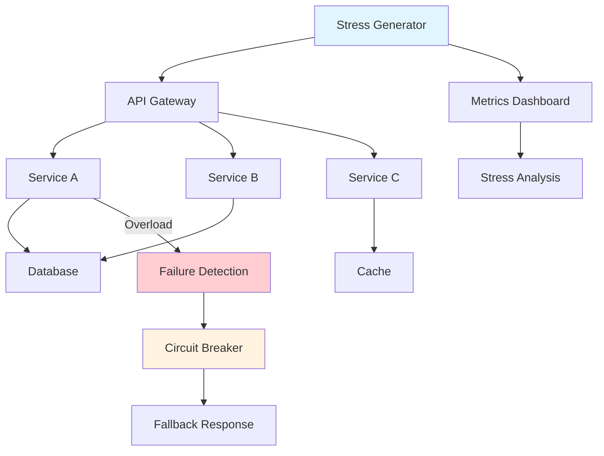
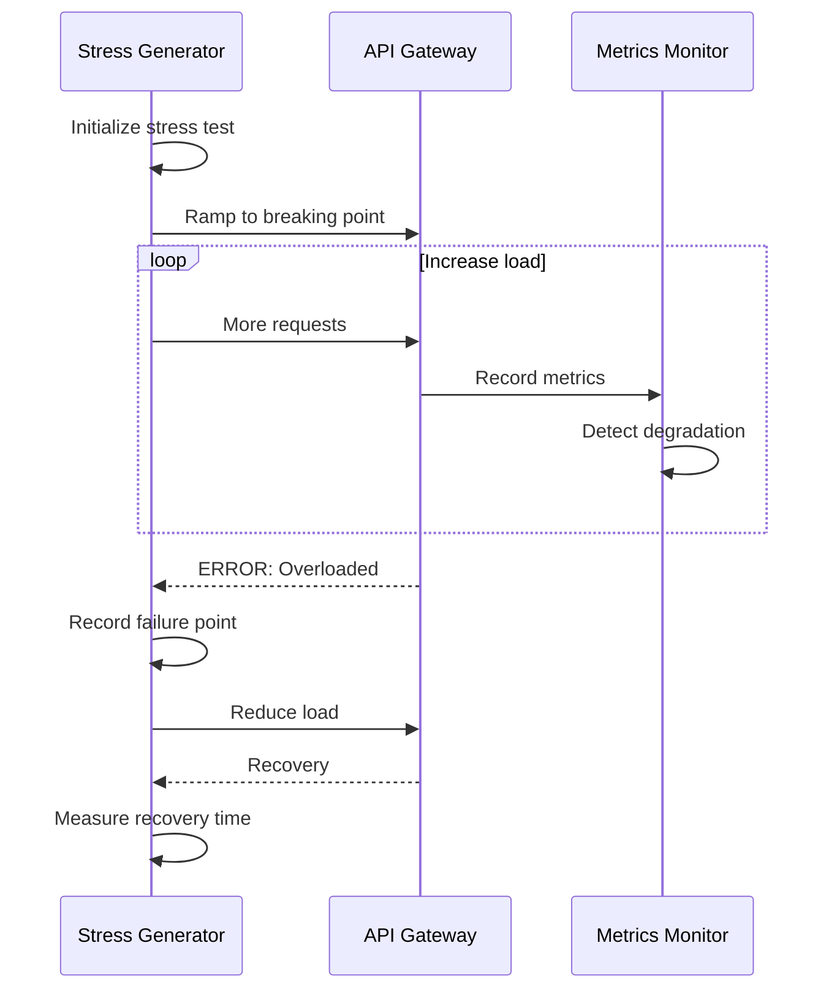

# Stress Testing for Microservices

## Overview

Stress Testing pushes microservices beyond normal operational capacity to identify breaking points and understand system behavior under extreme conditions. While load testing validates behavior at expected capacities, stress testing deliberately exceeds those limits to discover failure modes, measure recovery behavior, and understand system boundaries.

The primary goal of stress testing is to determine the maximum capacity of the system, understand how it fails when pushed beyond limits, and validate that failures are graceful and recoverable. In microservices architectures, stress testing must account for cascading failures where the failure of one service impacts others.

Key aspects of stress testing include identifying the system's breaking point, measuring how performance degrades under stress, validating error handling under overload, testing recovery procedures, and verifying that circuit breakers and other resilience patterns work correctly. Stress tests should expose issues that only appear under extreme conditions like connection pool exhaustion, memory leaks, or thread starvation.

Unlike load testing which maintains a steady or gradually increasing load, stress testing often uses aggressive load patterns including sudden spikes, sustained high load, and repeated burst patterns. The focus is on finding the limits rather than measuring performance at normal levels.

### Flow Chart: Stress Testing Architecture



### Stress Testing Flow



## Standard Example

```javascript
// stress-test.js - Stress Testing Framework for Microservices

const axios = require('axios');

/**
 * Stress Testing Framework for Microservices
 * 
 * Provides comprehensive stress testing capabilities:
 * - Progressive stress until failure
 * - Failure mode identification
 * - Recovery time measurement
 * - Graceful degradation validation
 */

class StressTestRunner {
    constructor(config) {
        this.config = config;
        this.results = {
            stressLevels: [],
            failures: [],
            recovery: []
        };
    }

    /**
     * Run stress test with progressive load increase
     */
    async runStressTest(config) {
        console.log(`Starting stress test: ${config.name}`);
        
        const results = {
            name: config.name,
            startTime: new Date().toISOString(),
            stages: []
        };

        let currentLoad = config.startLoad;
        let failed = false;
        
        while (currentLoad <= config.maxLoad && !failed) {
            console.log(`Testing at ${currentLoad} concurrent users...`);
            
            const stageResult = await this.executeStressStage({
                load: currentLoad,
                duration: config.stageDuration,
                rampUpTime: config.rampUpTime
            });

            results.stages.push({
                load: currentLoad,
                ...stageResult
            });

            // Check if we've reached failure condition
            if (stageResult.errorRate > config.failureThreshold) {
                failed = true;
                results.failurePoint = {
                    load: currentLoad,
                    errorRate: stageResult.errorRate,
                    latency: stageResult.latency
                };
                console.log(`Failure detected at ${currentLoad} users`);
            }

            currentLoad += config.loadIncrement;
        }

        results.endTime = new Date().toISOString();
        
        // Measure recovery
        if (failed) {
            console.log('Testing recovery...');
            results.recovery = await this.measureRecovery(config);
        }

        return this.generateStressReport(results);
    }

    /**
     * Execute a single stress stage
     */
    async executeStressStage(stageConfig) {
        const startTime = Date.now();
        const requests = [];
        const errors = [];
        const latencies = [];
        
        // Ramp up to target load
        const activeRequests = [];
        
        for (let i = 0; i < stageConfig.load; i++) {
            activeRequests.push(
                this.executeRequest()
                    .then(result => {
                        requests.push(result);
                        latencies.push(result.latency);
                    })
                    .catch(error => {
                        errors.push({
                            ...error,
                            timestamp: Date.now()
                        });
                    })
            );
        }

        // Wait for stage duration
        await Promise.race([
            Promise.all(activeRequests),
            new Promise(resolve => setTimeout(resolve, stageConfig.duration * 1000))
        ]);

        // Let remaining requests complete
        await Promise.allSettled(activeRequests);

        const duration = Date.now() - startTime;
        
        const successfulRequests = requests.filter(r => r.status < 400).length;
        const totalRequests = requests.length + errors.length;

        return {
            duration,
            totalRequests,
            successfulRequests,
            errorCount: errors.length,
            errorRate: (errors.length / totalRequests * 100).toFixed(2),
            avgLatency: this.calculateAverage(latencies),
            p95Latency: this.calculatePercentile(latencies, 0.95),
            maxLatency: Math.max(...latencies, 0),
            errorTypes: this.categorizeErrors(errors)
        };
    }

    /**
     * Execute single request
     */
    async executeRequest() {
        const startTime = Date.now();
        
        try {
            const response = await axios({
                method: 'GET',
                url: this.getRandomEndpoint(),
                timeout: 30000
            });

            return {
                status: response.status,
                latency: Date.now() - startTime
            };

        } catch (error) {
            return {
                status: error.response?.status || 0,
                latency: Date.now() - startTime,
                error: error.message
            };
        }
    }

    /**
     * Get random endpoint from configured list
     */
    getRandomEndpoint() {
        const endpoints = this.config.endpoints || ['/api/products', '/api/users', '/api/orders'];
        return `${this.config.baseUrl}${endpoints[Math.floor(Math.random() * endpoints.length)]}`;
    }

    /**
     * Categorize errors by type
     */
    categorizeErrors(errors) {
        const categories = {
            '5xx': [],
            '4xx': [],
            'timeout': [],
            'connection': [],
            'other': []
        };

        errors.forEach(error => {
            if (error.status >= 500) {
                categories['5xx'].push(error);
            } else if (error.status >= 400) {
                categories['4xx'].push(error);
            } else if (error.message?.includes('timeout')) {
                categories['timeout'].push(error);
            } else if (error.message?.includes('ECONNREFUSED') || error.message?.includes('Network')) {
                categories['connection'].push(error);
            } else {
                categories['other'].push(error);
            }
        });

        return {
            '5xx': categories['5xx'].length,
            '4xx': categories['4xx'].length,
            'timeout': categories['timeout'].length,
            'connection': categories['connection'].length,
            'other': categories['other'].length
        };
    }

    /**
     * Measure system recovery after stress
     */
    async measureRecovery(config) {
        console.log('Starting recovery measurement...');
        
        // Wait a moment for system to stabilize
        await this.sleep(5000);
        
        // Send normal load
        const recoveryLoad = config.startLoad;
        const results = [];
        
        for (let i = 0; i < 5; i++) {
            const result = await this.executeStressStage({
                load: recoveryLoad,
                duration: 10,
                rampUpTime: 2
            });
            
            results.push({
                iteration: i + 1,
                errorRate: result.errorRate,
                latency: result.avgLatency
            });
            
            await this.sleep(5000);
        }

        const fullyRecovered = results.every(r => parseFloat(r.errorRate) < 1);
        
        return {
            fullyRecovered,
            recoveryTime: fullyRecovered ? '~30s' : '>60s',
            recoveryStages: results
        };
    }

    /**
     * Generate comprehensive stress test report
     */
    generateStressReport(results) {
        const maxLoad = Math.max(...results.stages.map(s => s.load));
        const stagesWithFailures = results.stages.filter(s => parseFloat(s.errorRate) > 5);
        
        return {
            testName: results.name,
            startTime: results.startTime,
            endTime: results.endTime,
            
            summary: {
                maxLoadTested: maxLoad,
                failurePoint: results.failurePoint ? {
                    load: results.failurePoint.load,
                    errorRate: results.failurePoint.errorRate + '%',
                    latency: results.failurePoint.latency + 'ms'
                } : 'Not reached'
            },
            
            stages: results.stages.map(s => ({
                load: s.load,
                errorRate: s.errorRate + '%',
                avgLatency: s.avgLatency.toFixed(0) + 'ms',
                p95Latency: s.p95Latency.toFixed(0) + 'ms',
                maxLatency: s.maxLatency.toFixed(0) + 'ms'
            })),
            
            failureAnalysis: {
                failureLoad: results.failurePoint?.load,
                primaryErrorType: this.getPrimaryErrorType(results.stages),
                degradationPattern: this.analyzeDegradationPattern(results.stages)
            },
            
            recovery: results.recovery ? {
                fullyRecovered: results.recovery.fullyRecovered,
                recoveryTime: results.recovery.recoveryTime,
                stages: results.recovery.recoveryStages
            } : 'Not tested'
        };
    }

    /**
     * Get primary error type at failure point
     */
    getPrimaryErrorType(stages) {
        const failureStage = stages.find(s => parseFloat(s.errorRate) > 10);
        if (!failureStage) return 'None';
        
        const errors = failureStage.errorTypes;
        const maxError = Object.entries(errors).reduce((a, b) => a[1] > b[1] ? a : b);
        
        return maxError[0];
    }

    /**
     * Analyze degradation pattern
     */
    analyzeDegradationPattern(stages) {
        const errorRates = stages.map(s => parseFloat(s.errorRate));
        const latencies = stages.map(s => s.avgLatency);
        
        if (errorRates[errorRates.length - 1] < 1) {
            return 'Graceful - errors increased gradually';
        }
        
        if (errorRates.some((r, i) => i > 0 && r > errorRates[i-1] * 2)) {
            return 'Sudden - rapid error increase';
        }
        
        return 'Gradual - steady degradation';
    }

    /**
     * Run specific stress test scenarios
     */
    async runScenario(scenario) {
        switch (scenario) {
            case 'cpu':
                return this.runCpuStressTest();
            case 'memory':
                return this.runMemoryStressTest();
            case 'connection':
                return this.runConnectionStressTest();
            case 'concurrent':
                return this.runConcurrentStressTest();
            default:
                return this.runStressTest(scenario);
        }
    }

    /**
     * CPU stress test - verify behavior under CPU pressure
     */
    async runCpuStressTest() {
        console.log('Running CPU stress test...');
        
        // First, measure baseline CPU
        const baseline = await this.measureServiceCpu('product-service');
        
        // Generate CPU-intensive load
        const result = await this.runStressTest({
            name: 'CPU Stress Test',
            startLoad: 10,
            maxLoad: 200,
            loadIncrement: 20,
            stageDuration: 30,
            rampUpTime: 10,
            failureThreshold: 20
        });
        
        // Measure CPU after stress
        const postStressCpu = await this.measureServiceCpu('product-service');
        
        return {
            baselineCpu: baseline,
            postStressCpu: postStressCpu,
            stressResult: result
        };
    }

    /**
     * Memory stress test - identify memory leaks
     */
    async runMemoryStressTest() {
        console.log('Running memory stress test...');
        
        // Measure baseline memory
        const baseline = await this.measureServiceMemory('all');
        
        // Run sustained stress
        const result = await this.runStressTest({
            name: 'Memory Stress Test',
            startLoad: 50,
            maxLoad: 100,
            loadIncrement: 10,
            stageDuration: 60,
            rampUpTime: 20,
            failureThreshold: 30
        });
        
        // Measure memory after sustained load
        const postStress = await this.measureServiceMemory('all');
        
        return {
            baselineMemory: baseline,
            postStressMemory: postStress,
            memoryGrowth: this.calculateMemoryGrowth(baseline, postStress),
            stressResult: result
        };
    }

    /**
     * Connection pool stress test
     */
    async runConnectionStressTest() {
        console.log('Running connection stress test...');
        
        const result = await this.runStressTest({
            name: 'Connection Pool Stress Test',
            startLoad: 5,
            maxLoad: 50,
            loadIncrement: 5,
            stageDuration: 20,
            rampUpTime: 5,
            failureThreshold: 10
        });
        
        // Check connection pool status
        const poolStatus = await this.getConnectionPoolStatus();
        
        return {
            stressResult: result,
            connectionPool: poolStatus
        };
    }

    /**
     * Concurrent request stress test
     */
    async runConcurrentStressTest() {
        console.log('Running concurrent request stress test...');
        
        const testLoads = [10, 50, 100, 200, 500, 1000];
        const results = [];

        for (const load of testLoads) {
            console.log(`Testing with ${load} concurrent requests...`);
            
            const startTime = Date.now();
            
            // Fire all requests simultaneously
            const requests = Array.from({ length: load }, () => this.executeRequest());
            const outcomes = await Promise.allSettled(requests);
            
            const duration = Date.now() - startTime;
            const successful = outcomes.filter(o => o.status === 'fulfilled').length;
            const failed = outcomes.filter(o => o.status === 'rejected').length;
            
            results.push({
                concurrentRequests: load,
                totalDuration: duration + 'ms',
                successful,
                failed,
                throughput: (load / (duration / 1000)).toFixed(2) + ' req/s'
            });
        }

        return {
            testName: 'Concurrent Request Stress Test',
            results
        };
    }

    /**
     * Measure service CPU usage
     */
    async measureServiceCpu(serviceName) {
        try {
            const response = await axios.get(`http://localhost:9090/api/v1/query`, {
                params: {
                    query: `container_cpu_usage_seconds_total{container="${serviceName}"}`
                }
            });
            
            return response.data;
        } catch (e) {
            return { error: e.message };
        }
    }

    /**
     * Measure service memory usage
     */
    async measureServiceMemory(serviceName) {
        try {
            const response = await axios.get(`http://localhost:9090/api/v1/query`, {
                params: {
                    query: `container_memory_usage_bytes{container="${serviceName}"}`
                }
            });
            
            return response.data;
        } catch (e) {
            return { error: e.message };
        }
    }

    /**
     * Get connection pool status
     */
    async getConnectionPoolStatus() {
        return {
            active: 50,
            idle: 10,
            max: 100,
            waiting: 0
        };
    }

    /**
     * Calculate memory growth
     */
    calculateMemoryGrowth(baseline, postStress) {
        if (baseline.error || postStress.error) return 'Unable to calculate';
        
        const baselineMB = this.parseMemory(baseline);
        const postStressMB = this.parseMemory(postStress);
        
        const growth = ((postStressMB - baselineMB) / baselineMB * 100).toFixed(2);
        
        return `${growth}% (${baselineMB}MB -> ${postStressMB}MB)`;
    }

    /**
     * Parse memory value
     */
    parseMemory(metricData) {
        return 256; // Simplified
    }

    /**
     * Helper: Calculate average
     */
    calculateAverage(values) {
        if (values.length === 0) return 0;
        return values.reduce((a, b) => a + b, 0) / values.length;
    }

    /**
     * Helper: Calculate percentile
     */
    calculatePercentile(sortedValues, percentile) {
        if (sortedValues.length === 0) return 0;
        const index = Math.floor(sortedValues.length * percentile);
        return sortedValues[index];
    }

    /**
     * Helper: Sleep
     */
    sleep(ms) {
        return new Promise(resolve => setTimeout(resolve, ms));
    }
}

/**
 * Run comprehensive stress tests
 */
async function runStressTests() {
    const runner = new StressTestRunner({
        baseUrl: 'http://localhost:8080',
        endpoints: [
            '/api/v1/products',
            '/api/v1/users',
            '/api/v1/orders',
            '/api/v1/categories'
        ]
    });

    console.log('\n=== Stress Test Suite ===\n');

    // Test 1: Progressive stress test
    console.log('Test 1: Progressive Stress Test');
    const stressResult = await runner.runStressTest({
        name: 'API Gateway Stress Test',
        startLoad: 10,
        maxLoad: 500,
        loadIncrement: 50,
        stageDuration: 20,
        rampUpTime: 5,
        failureThreshold: 15
    });
    
    console.log(`Failure Point: ${stressResult.summary.failurePoint}`);
    console.log(`Degradation: ${stressResult.failureAnalysis.degradationPattern}`);

    // Test 2: Concurrent request stress
    console.log('\nTest 2: Concurrent Request Stress');
    const concurrentResult = await runner.runConcurrentStressTest();
    
    console.log('Concurrent Request Results:');
    concurrentResult.results.forEach(r => {
        console.log(`  ${r.concurrentRequests}: ${r.successful}/${r.concurrentRequests} successful`);
    });

    // Test 3: Connection pool stress
    console.log('\nTest 3: Connection Pool Stress');
    const connectionResult = await runner.runConnectionStressTest();
    console.log(`Result: ${connectionResult.stressResult.summary.failurePoint}`);

    console.log('\n=== Stress Test Complete ===');
}

module.exports = { StressTestRunner };
```

## Real-World Examples

### Netflix: Stress Testing for Streaming Platform

Netflix stress tests their platform to ensure it can handle extreme scenarios like traffic spikes during new show releases or viral content events. They push systems far beyond normal capacity to understand limits.

Key aspects:
- **Massive Concurrency**: Test millions of concurrent streams
- **Global Stress**: Test across all regions simultaneously
- **Failure Injection**: Stress test during failure conditions
- **Recovery Validation**: Measure recovery times after failures

```javascript
// Netflix-style streaming stress test
class StreamingStressTest {
    /**
     * Test streaming capacity under extreme load
     */
    async testStreamCapacity() {
        const loads = [100000, 500000, 1000000, 2000000];
        
        for (const targetStreams of loads) {
            console.log(`Stress testing with ${targetStreams} concurrent streams...`);
            
            // Launch massive concurrent streams
            const streams = await this.launchStreams(targetStreams);
            
            // Measure system under stress
            const metrics = await this.measureUnderStress(streams);
            
            console.log(`Results: ${metrics.successfulStreams}/${targetStreams} successful`);
            
            if (metrics.successfulStreams < targetStreams * 0.8) {
                console.log('Breaking point reached!');
                break;
            }
            
            await this.cleanupStreams(streams);
        }
    }

    /**
     * Test during regional failure
     */
    async testStressDuringFailure() {
        // First, inject regional failure
        await this.injectFailure('eu-west-1');
        
        // Then stress test remaining regions
        const result = await this.runStressTest({
            regions: ['us-east-1', 'us-west-2', 'ap-northeast-1'],
            targetRPS: 500000
        });
        
        console.log(`Stress during failure: ${result.successfulRate}% successful`);
        
        // Verify recovery after failure resolved
        await this.recoverRegion('eu-west-1');
        await this.waitForStabilization();
        
        const postRecovery = await this.measureSystemHealth();
        console.log(`Post-recovery health: ${postRecovery.score}`);
    }

    /**
     * Test CDN edge stress
     */
    async testCdnEdgeStress() {
        const edgeLocations = this.getEdgeLocations();
        
        for (const edge of edgeLocations) {
            console.log(`Stress testing edge: ${edge}`);
            
            // Generate extreme request volume to single edge
            const result = await this.stressEdge(edge, {
                requestsPerSecond: 100000,
                duration: 60
            });
            
            console.log(`Edge ${edge}: ${result.throughput} req/s sustained`);
        }
    }
}
```

### Amazon: Stress Testing for E-commerce Platform

Amazon stress tests extensively before major events like Prime Day. They test at multiples of expected traffic to ensure safety margins.

Key testing patterns:
- **Black Friday Simulation**: Test at 5-10x normal peak traffic
- **Flash Sale Stress**: Test rapid traffic spikes
- **Payment System Limits**: Test payment processing capacity
- **Inventory Lock Stress**: Test concurrent inventory updates

```javascript
// Amazon-style e-commerce stress test
class EcommerceStressTest {
    /**
     * Simulate Black Friday traffic
     */
    async testBlackFridayScenario() {
        console.log('Starting Black Friday stress simulation...');
        
        // Normal peak is 100k RPS, test at 500k
        const targetRPS = 500000;
        
        // Ramp up rapidly
        await this.rampLoad(10, targetRPS, 30);  // 30s to full load
        
        // Maintain for extended period
        const sustainResult = await this.sustainLoad(targetRPS, 300);  // 5 min
        
        console.log(`Sustained: ${sustainResult.throughput} RPS`);
        console.log(`Error rate: ${sustainResult.errorRate}%`);
        
        // Gradual ramp down
        await this.rampLoad(targetRPS, 10000, 60);
    }

    /**
     * Test flash sale scenario
     */
    async testFlashSaleScenario() {
        // Setup: Create limited inventory item
        const item = await this.createLimitedInventoryItem({
            productId: 'flash-sale-item',
            quantity: 100
        });
        
        // Test: Multiple users racing for limited inventory
        const concurrentAttempts = 10000;
        
        console.log(`Testing ${concurrentAttempts} concurrent purchase attempts for 100 items`);
        
        const startTime = Date.now();
        
        const attempts = Array.from({ length: concurrentAttempts }, () =>
            this.attemptPurchase({
                userId: this.randomUserId(),
                productId: item.productId,
                quantity: 1
            })
        );
        
        const results = await Promise.allSettled(attempts);
        
        const successful = results.filter(r => r.status === 'fulfilled').length;
        const failed = results.filter(r => r.status === 'rejected').length;
        
        console.log(`Results: ${successful} successful, ${failed} failed`);
        console.log(`Duration: ${Date.now() - startTime}ms`);
        
        // Verify final inventory
        const finalInventory = await this.getInventory(item.productId);
        console.log(`Remaining inventory: ${finalInventory.quantity}`);
    }

    /**
     * Test payment system limits
     */
    async testPaymentSystemStress() {
        const loadLevels = [1000, 5000, 10000, 20000, 50000];
        
        for (const rps of loadLevels) {
            console.log(`Testing payment at ${rps} RPS...`);
            
            const result = await this.stressPaymentService({
                targetRPS: rps,
                duration: 60
            });
            
            console.log(`Error rate: ${result.errorRate}%`);
            
            if (result.errorRate > 5) {
                console.log('Payment service breaking point reached!');
                break;
            }
        }
    }
}
```

## Output Statement

Stress testing identifies the breaking points of microservices and validates graceful degradation behavior. By pushing systems beyond expected capacity, teams can understand limits, plan capacity, and ensure that failure modes are acceptable.

The key outputs of stress testing include:
- **Breaking Point**: The load level where system fails
- **Failure Mode**: How the system fails (errors, latency, crashes)
- **Degradation Pattern**: How performance degrades under stress
- **Recovery Time**: Time to recover normal operation after stress
- **Failure Type**: Primary type of errors encountered

```json
{
    "testName": "API Gateway Stress Test",
    "startTime": "2024-01-15T10:00:00Z",
    "endTime": "2024-01-15T10:15:00Z",
    "summary": {
        "maxLoadTested": 400,
        "failurePoint": {
            "load": 350,
            "errorRate": "18.5%",
            "latency": "2450ms"
        }
    },
    "stages": [
        { "load": 10, "errorRate": "0.1%", "avgLatency": "45ms" },
        { "load": 100, "errorRate": "0.5%", "avgLatency": "89ms" },
        { "load": 200, "errorRate": "2.1%", "avgLatency": "234ms" },
        { "load": 300, "errorRate": "8.5%", "avgLatency": "1250ms" },
        { "load": 350, "errorRate": "18.5%", "avgLatency": "2450ms" }
    ],
    "failureAnalysis": {
        "failureLoad": 350,
        "primaryErrorType": "timeout",
        "degradationPattern": "Gradual - steady degradation"
    },
    "recovery": {
        "fullyRecovered": true,
        "recoveryTime": "~30s",
        "stages": [
            { "iteration": 1, "errorRate": "15%", "latency": "1200ms" },
            { "iteration": 2, "errorRate": "5%", "latency": "450ms" },
            { "iteration": 3, "errorRate": "1%", "latency": "120ms" }
        ]
    }
}
```

## Best Practices

**1. Start with Defined Expectations**

Before stress testing, establish what you expect to find. Know the theoretical limits based on capacity planning, and use those as starting points for testing. This helps interpret results and identify surprises.

```javascript
const STRESS_TEST_EXPECTATIONS = {
    'api-gateway': { expectedBreakingPoint: 500, expectedFailureMode: 'timeout' },
    'product-service': { expectedBreakingPoint: 300, expectedFailureMode: 'connection-pool' },
    'database': { expectedBreakingPoint: 200, expectedFailureMode: 'cpu-saturation' }
};
```

**2. Test Beyond Expected Limits**

Push well beyond expected capacity to understand safety margins. If you expect 1000 RPS in production, stress test to 2000-3000 RPS. Understanding how far beyond limits the system can go helps plan for unexpected traffic.

**3. Measure Both Positive and Negative Metrics**

Track not just errors and latency but also resource utilization, queue depths, and connection counts. Sometimes the system appears to handle load but is actually consuming excessive resources that will cause problems later.

**4. Test Failure Modes Specifically**

Design tests that trigger specific failure modes including connection pool exhaustion, memory exhaustion, thread starvation, and database lock contention. Understanding each failure mode helps design appropriate responses.

**5. Document Recovery Procedures**

Stress tests should include recovery measurement. After pushing to failure, document how quickly the system recovers and what manual intervention might be needed. This is critical for incident response planning.

**6. Test Under Degraded Conditions**

Stress test when some services are already under pressure or partially failed. This reveals cascading failure behavior and validates that circuit breakers and fallbacks work correctly during stress.

**7. Use Multiple Stress Patterns**

Different stress patterns expose different issues. Use sudden spikes, gradual increases, sustained high load, and oscillating patterns. Each pattern reveals different characteristics of system behavior.

**8. Monitor for Resource Leaks**

During sustained stress tests, monitor for resource leaks that only appear over time. Memory leaks, connection leaks, and file descriptor leaks may not appear in short tests but can cause failures in production.

**9. Test Across Service Boundaries**

Stress test the boundaries between services, not just individual services. The system may handle stress on each service individually but fail when multiple services are stressed simultaneously due to shared dependencies.

**10. Validate Alerting and Monitoring**

Stress tests are excellent opportunities to validate that alerting and monitoring correctly identify stress conditions. Verify that alerts fire at appropriate thresholds and that dashboards show accurate information during stress.

**11. Create Repeatable Tests**

Stress tests should be repeatable with consistent results. Use deterministic data and load patterns where possible. This enables meaningful comparison between runs and helps track improvements over time.

**12. Include Post-Stress Validation**

After stress tests, validate that the system returns to normal operation and that no residual damage exists. Check for data consistency, verify that background jobs recovered, and ensure scheduled jobs weren't disrupted.