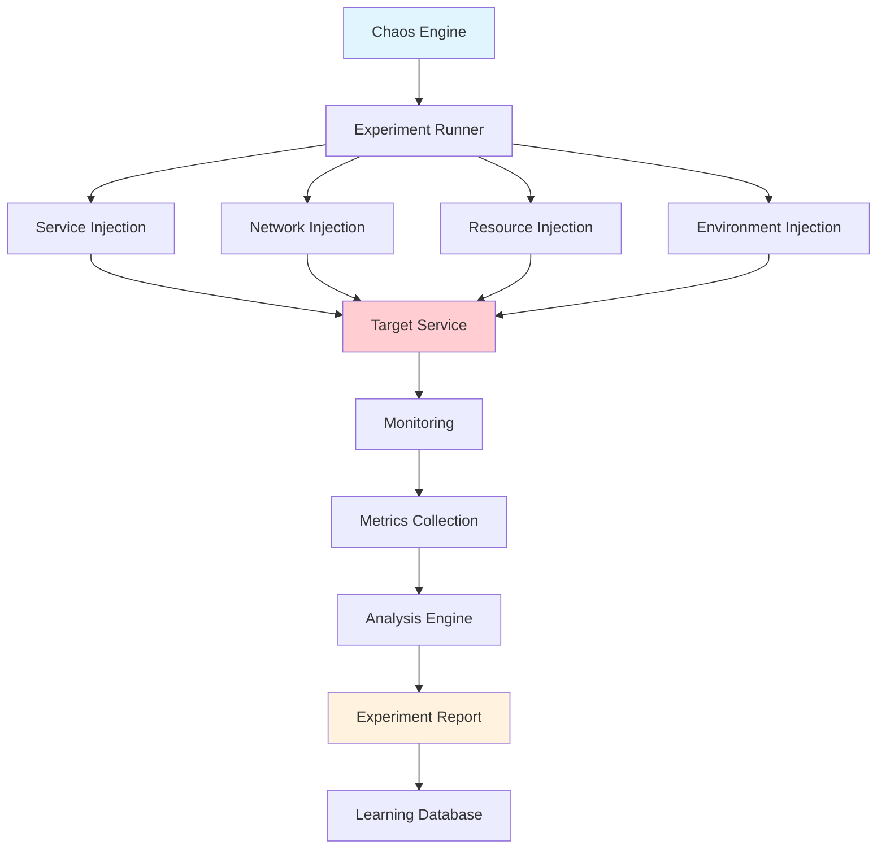
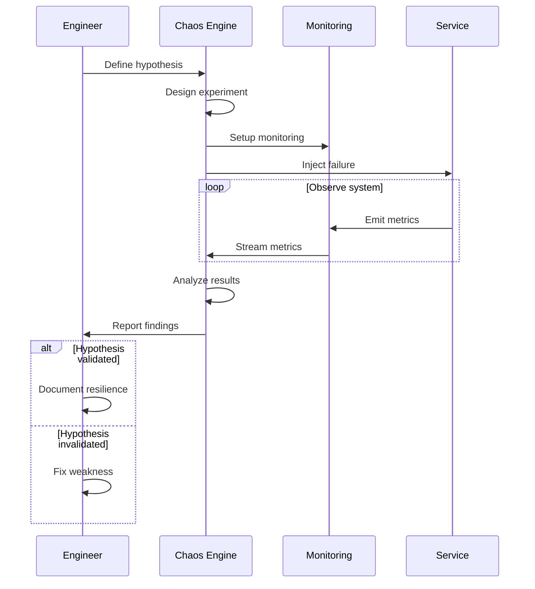

# Chaos Engineering for Microservices

## Overview

Chaos Engineering is the discipline of experimenting on production-like systems to discover weaknesses before they cause outages in production. In microservices architectures, where services are distributed and interdependent, chaos engineering helps teams understand how the system behaves when components fail, network connectivity is degraded, or resource constraints are encountered.

The fundamental premise of chaos engineering is that failures are inevitable in complex distributed systems. Rather than trying to prevent all failures (which is impossible), chaos engineering accepts this reality and focuses on building resilience. By deliberately introducing failures in a controlled manner, teams can identify hidden weaknesses, validate assumptions about system behavior, and improve incident response procedures.

Key aspects of chaos engineering include defining steady-state hypotheses about system behavior, designing experiments that test those hypotheses, running experiments in production-like environments, and learning from the results. Unlike traditional testing that verifies expected behavior, chaos engineering discovers unexpected behaviors and failure modes.

Chaos engineering differs from stress testing in that stress testing focuses on capacity limits under high load, while chaos engineering focuses on resilience under failure conditions. Both are valuable but test different aspects of system behavior.

### Flow Chart: Chaos Engineering Architecture



### Chaos Engineering Flow



## Standard Example

```javascript
// chaos-engineering.js - Chaos Engineering Framework for Microservices

const axios = require('axios');
const EventEmitter = require('events');

/**
 * Chaos Engineering Framework for Microservices
 * 
 * Provides comprehensive chaos testing capabilities:
 * - Service-level fault injection
 * - Network chaos (latency, partition, loss)
 * - Resource chaos (CPU, memory, disk)
 * - Experiment orchestration and monitoring
 */

class ChaosEngine extends EventEmitter {
    constructor(config) {
        super();
        this.config = config;
        this.experiments = [];
        this.activeExperiments = new Map();
        this.hypotheses = [];
    }

    /**
     * Define a chaos experiment
     */
    defineExperiment(experimentConfig) {
        const experiment = {
            id: this.generateId(),
            name: experimentConfig.name,
            description: experimentConfig.description,
            
            // Target configuration
            target: experimentConfig.target,  // service, endpoint, pod
            scope: experimentConfig.scope || 'single',  // single, subset, all
            
            // Failure injection
            action: experimentConfig.action,  // terminate, delay, error, etc.
            parameters: experimentConfig.parameters || {},
            
            // Experiment control
            duration: experimentConfig.duration,  // How long to run
            steadyStateDuration: experimentConfig.steadyStateDuration || 30,  // Time to observe normal behavior
            
            // Monitoring
            metrics: experimentConfig.metrics || [],
            successCriteria: experimentConfig.successCriteria || {}
        };

        this.experiments.push(experiment);
        return experiment;
    }

    /**
     * Define and track a hypothesis
     */
    defineHypothesis(hypothesisConfig) {
        const hypothesis = {
            id: this.generateId(),
            name: hypothesisConfig.name,
            description: hypothesisConfig.description,
            systemState: hypothesisConfig.systemState,
            expectedBehavior: hypothesisConfig.expectedBehavior,
            experiments: []
        };

        this.hypotheses.push(hypothesis);
        return hypothesis;
    }

    /**
     * Run a chaos experiment
     */
    async runExperiment(experimentId, targetConfig) {
        const experiment = this.experiments.find(e => e.id === experimentId);
        if (!experiment) {
            throw new Error(`Experiment ${experimentId} not found`);
        }

        console.log(`Starting chaos experiment: ${experiment.name}`);
        
        const result = {
            experimentId: experiment.id,
            experimentName: experiment.name,
            startTime: new Date().toISOString(),
            status: 'running',
            phases: []
        };

        try {
            // Phase 1: Establish steady state
            console.log('Phase 1: Establishing steady state...');
            const steadyState = await this.measureSteadyState(experiment, targetConfig);
            result.phases.push({
                phase: 'steady-state',
                ...steadyState
            });

            // Phase 2: Inject failure
            console.log('Phase 2: Injecting failure...');
            const injectionResult = await this.injectFailure(experiment, targetConfig);
            result.phases.push({
                phase: 'injection',
                ...injectionResult
            });

            // Phase 3: Observe behavior
            console.log('Phase 3: Observing system behavior...');
            const behavior = await this.observeBehavior(experiment, targetConfig);
            result.phases.push({
                phase: 'observation',
                ...behavior
            });

            // Phase 4: Clean up
            console.log('Phase 4: Cleaning up...');
            await this.cleanup(experiment, targetConfig);

            // Phase 5: Analyze results
            const analysis = this.analyzeResults(result, experiment);
            result.status = analysis.hypothesisValidated ? 'validated' : 'invalidated';
            result.analysis = analysis;

            console.log(`Experiment complete: ${result.status}`);

        } catch (error) {
            result.status = 'error';
            result.error = error.message;
            console.error('Experiment failed:', error.message);
        }

        result.endTime = new Date().toISOString();
        return result;
    }

    /**
     * Measure steady state before experiment
     */
    async measureSteadyState(experiment, targetConfig) {
        const measurements = [];
        const duration = experiment.steadyStateDuration * 1000;
        const startTime = Date.now();

        while (Date.now() - startTime < duration) {
            const metrics = await this.collectMetrics(experiment.metrics, targetConfig);
            measurements.push({
                timestamp: Date.now(),
                ...metrics
            });
            
            await this.sleep(1000);
        }

        return {
            duration: (Date.now() - startTime) / 1000 + 's',
            sampleCount: measurements.length,
            avgMetrics: this.averageMetrics(measurements)
        };
    }

    /**
     * Inject failure into target system
     */
    async injectFailure(experiment, targetConfig) {
        const startTime = Date.now();

        switch (experiment.action) {
            case 'terminate':
                return await this.injectTerminateFailure(experiment, targetConfig);
            
            case 'delay':
                return await this.injectDelayFailure(experiment, targetConfig);
            
            case 'error':
                return await this.injectErrorFailure(experiment, targetConfig);
            
            case 'packet-loss':
                return await this.injectPacketLossFailure(experiment, targetConfig);
            
            case 'cpu-stress':
                return await this.injectCpuStress(experiment, targetConfig);
            
            case 'memory-stress':
                return await this.injectMemoryStress(experiment, targetConfig);
            
            default:
                throw new Error(`Unknown action: ${experiment.action}`);
        }
    }

    /**
     * Inject service termination
     */
    async injectTerminateFailure(experiment, targetConfig) {
        const targetService = targetConfig.services.find(s => s.name === experiment.target);
        
        if (!targetService) {
            throw new Error(`Target service ${experiment.target} not found`);
        }

        console.log(`Terminating service: ${targetService.name}`);
        
        // Scale down to zero or delete pods
        await axios.post(`${targetConfig.k8sApi}/namespaces/${targetConfig.namespace}/scale`, {
            apiVersion: 'apps/v1',
            kind: 'Deployment',
            metadata: { name: targetService.name },
            spec: { replicas: 0 }
        });

        return {
            action: 'terminate',
            target: experiment.target,
            injectedAt: new Date().toISOString(),
            expectedDuration: experiment.duration + 's'
        };
    }

    /**
     * Inject network delay
     */
    async injectDelayFailure(experiment, targetConfig) {
        const delay = experiment.parameters.delay || 5000;  // 5 seconds default
        const jitter = experiment.parameters.jitter || 1000;
        
        console.log(`Injecting network delay: ${delay}ms (+/- ${jitter}ms)`);
        
        // Apply network delay using iptables or similar
        // This is a simplified example
        const targetService = targetConfig.services.find(s => s.name === experiment.target);
        
        // In real implementation, use chaos mesh or similar tool
        return {
            action: 'delay',
            target: experiment.target,
            parameters: { delay, jitter },
            injectedAt: new Date().toISOString()
        };
    }

    /**
     * Inject error responses
     */
    async injectErrorFailure(experiment, targetConfig) {
        const errorCode = experiment.parameters.errorCode || 500;
        const percentage = experiment.parameters.percentage || 100;
        
        console.log(`Injecting ${errorCode} errors at ${percentage}% rate`);
        
        return {
            action: 'error',
            target: experiment.target,
            parameters: { errorCode, percentage },
            injectedAt: new Date().toISOString()
        };
    }

    /**
     * Inject packet loss
     */
    async injectPacketLossFailure(experiment, targetConfig) {
        const lossRate = experiment.parameters.lossRate || 50;
        
        console.log(`Injecting ${lossRate}% packet loss`);
        
        return {
            action: 'packet-loss',
            target: experiment.target,
            parameters: { lossRate },
            injectedAt: new Date().toISOString()
        };
    }

    /**
     * Inject CPU stress
     */
    async injectCpuStress(experiment, targetConfig) {
        const percentage = experiment.parameters.percentage || 90;
        const duration = experiment.parameters.duration || experiment.duration;
        
        console.log(`Injecting CPU stress: ${percentage}% for ${duration}s`);
        
        return {
            action: 'cpu-stress',
            target: experiment.target,
            parameters: { percentage, duration },
            injectedAt: new Date().toISOString()
        };
    }

    /**
     * Inject memory stress
     */
    async injectMemoryStress(experiment, targetConfig) {
        const percentage = experiment.parameters.percentage || 90;
        
        console.log(`Injecting memory stress: ${percentage}%`);
        
        return {
            action: 'memory-stress',
            target: experiment.target,
            parameters: { percentage },
            injectedAt: new Date().toISOString()
        };
    }

    /**
     * Observe system behavior during experiment
     */
    async observeBehavior(experiment, targetConfig) {
        const startTime = Date.now();
        const duration = (experiment.duration || 60) * 1000;
        const observations = [];

        while (Date.now() - startTime < duration) {
            const metrics = await this.collectMetrics(experiment.metrics, targetConfig);
            
            observations.push({
                timestamp: Date.now(),
                ...metrics
            });

            // Check if system has degraded
            const degradation = this.checkDegradation(metrics, experiment.successCriteria);
            if (degradation.degraded) {
                observations[observations.length - 1].degraded = true;
                observations[observations.length - 1].degradationReason = degradation.reason;
            }

            await this.sleep(1000);
        }

        return {
            duration: (Date.now() - startTime) / 1000 + 's',
            observations: observations.length,
            degradationEvents: observations.filter(o => o.degraded).length,
            metrics: this.summarizeObservations(observations)
        };
    }

    /**
     * Check for system degradation
     */
    checkDegradation(metrics, criteria) {
        if (!criteria) return { degraded: false };
        
        if (criteria.maxErrorRate && metrics.errorRate > criteria.maxErrorRate) {
            return { degraded: true, reason: `Error rate ${metrics.errorRate}% exceeds ${criteria.maxErrorRate}%` };
        }
        
        if (criteria.maxLatency && metrics.p99Latency > criteria.maxLatency) {
            return { degraded: true, reason: `P99 latency ${metrics.p99Latency}ms exceeds ${criteria.maxLatency}ms` };
        }
        
        if (criteria.minAvailability && metrics.availability < criteria.minAvailability) {
            return { degraded: true, reason: `Availability ${metrics.availability}% below ${criteria.minAvailability}%` };
        }
        
        return { degraded: false };
    }

    /**
     * Collect metrics from monitoring system
     */
    async collectMetrics(metricNames, targetConfig) {
        const metrics = {};
        
        for (const name of metricNames) {
            try {
                const response = await axios.get(`${targetConfig.prometheusUrl}/api/v1/query`, {
                    params: { query: name }
                });
                
                if (response.data.status === 'success' && response.data.data.result.length > 0) {
                    metrics[name] = parseFloat(response.data.data.result[0].value[1]);
                }
            } catch (e) {
                metrics[name] = null;
            }
        }

        return {
            errorRate: metrics['error_rate'] || 0,
            latency: metrics['latency_p99'] || 0,
            p99Latency: metrics['latency_p99'] || 0,
            availability: metrics['availability'] || 100,
            ...metrics
        };
    }

    /**
     * Clean up after experiment
     */
    async cleanup(experiment, targetConfig) {
        console.log('Cleaning up chaos injection...');
        
        switch (experiment.action) {
            case 'terminate':
                // Scale back up
                const targetService = targetConfig.services.find(s => s.name === experiment.target);
                await axios.post(`${targetConfig.k8sApi}/namespaces/${targetConfig.namespace}/scale`, {
                    apiVersion: 'apps/v1',
                    kind: 'Deployment',
                    metadata: { name: targetService.name },
                    spec: { replicas: targetService.replicas }
                });
                break;
            
            case 'delay':
            case 'error':
            case 'packet-loss':
                // Remove network chaos
                console.log('Network chaos cleanup complete');
                break;
            
            case 'cpu-stress':
            case 'memory-stress':
                // Remove resource chaos
                console.log('Resource chaos cleanup complete');
                break;
        }
    }

    /**
     * Analyze experiment results
     */
    analyzeResults(result, experiment) {
        const observationPhase = result.phases.find(p => p.phase === 'observation');
        const steadyPhase = result.phases.find(p => p.phase === 'steady-state');
        
        if (!observationPhase || !steadyPhase) {
            return { hypothesisValidated: false, reason: 'Incomplete data' };
        }

        // Compare steady state to observed behavior
        const errorRateIncrease = observationPhase.metrics.avgErrorRate - steadyPhase.avgMetrics.errorRate;
        const latencyIncrease = observationPhase.metrics.avgLatency - steadyPhase.avgMetrics.latency;
        
        const tolerance = experiment.successCriteria?.tolerance || 0.1;
        const hypothesisValidated = errorRateIncrease < tolerance && latencyIncrease < tolerance * 1000;
        
        return {
            hypothesisValidated,
            errorRateIncrease: errorRateIncrease.toFixed(2) + '%',
            latencyIncrease: latencyIncrease.toFixed(0) + 'ms',
            degradationEvents: observationPhase.degradationEvents,
            analysis: hypothesisValidated 
                ? 'System maintained resilience as expected'
                : 'System degraded beyond acceptable threshold'
        };
    }

    /**
     * Generate experiment ID
     */
    generateId() {
        return 'exp-' + Math.random().toString(36).substr(2, 9);
    }

    /**
     * Calculate average metrics
     */
    averageMetrics(measurements) {
        const keys = Object.keys(measurements[0] || {}).filter(k => k !== 'timestamp');
        const averages = {};
        
        for (const key of keys) {
            const values = measurements.map(m => m[key]).filter(v => typeof v === 'number');
            averages[key] = values.length > 0 ? values.reduce((a, b) => a + b, 0) / values.length : 0;
        }
        
        return averages;
    }

    /**
     * Summarize observations
     */
    summarizeObservations(observations) {
        const errorRates = observations.map(o => o.errorRate);
        const latencies = observations.map(o => o.latency);
        
        return {
            avgErrorRate: this.average(errorRates).toFixed(2),
            maxErrorRate: Math.max(...errorRates).toFixed(2),
            avgLatency: this.average(latencies).toFixed(0),
            maxLatency: Math.max(...latencies).toFixed(0)
        };
    }

    /**
     * Average helper
     */
    average(values) {
        return values.length > 0 ? values.reduce((a, b) => a + b, 0) / values.length : 0;
    }

    /**
     * Sleep helper
     */
    sleep(ms) {
        return new Promise(resolve => setTimeout(resolve, ms));
    }
}

/**
 * Predefined Chaos Experiments
 */
class ChaosExperiments {
    /**
     * Service termination experiment
     */
    static serviceTerminationExperiment() {
        return {
            name: 'Service Termination',
            description: 'Test system behavior when a critical service is terminated',
            target: 'payment-service',
            action: 'terminate',
            duration: 60,
            metrics: ['error_rate', 'latency_p99', 'availability'],
            successCriteria: {
                maxErrorRate: 5,
                minAvailability: 95
            }
        };
    }

    /**
     * Network delay experiment
     */
    static networkDelayExperiment() {
        return {
            name: 'Network Latency',
            description: 'Test system behavior with increased network latency',
            target: 'database',
            action: 'delay',
            parameters: { delay: 5000, jitter: 1000 },
            duration: 60,
            metrics: ['error_rate', 'latency_p99', 'connection_pool_usage'],
            successCriteria: {
                maxLatency: 8000,
                tolerance: 0.2
            }
        };
    }

    /**
     * Partial failure experiment
     */
    static partialFailureExperiment() {
        return {
            name: 'Partial Service Failure',
            description: 'Test system behavior when some instances fail',
            target: 'catalog-service',
            action: 'terminate',
            scope: 'subset',
            parameters: { percentage: 50 },
            duration: 120,
            metrics: ['error_rate', 'latency_p99', 'request_distribution'],
            successCriteria: {
                maxErrorRate: 10,
                minAvailability: 90
            }
        };
    }

    /**
     * Cascading failure experiment
     */
    static cascadingFailureExperiment() {
        return {
            name: 'Cascading Failure Prevention',
            description: 'Verify circuit breakers prevent cascading failures',
            target: 'inventory-service',
            action: 'error',
            parameters: { errorCode: 503, percentage: 100 },
            duration: 90,
            metrics: ['circuit_breaker_state', 'error_rate', 'fallback_invoked'],
            successCriteria: {
                maxErrorRate: 15,
                fallbackInvoked: true
            }
        };
    }

    /**
     * Resource exhaustion experiment
     */
    static resourceExhaustionExperiment() {
        return {
            name: 'Connection Pool Exhaustion',
            description: 'Test behavior when database connections are exhausted',
            target: 'order-service',
            action: 'delay',
            parameters: { delay: 30000 },
            duration: 60,
            metrics: ['connection_pool_exhausted', 'error_rate', 'latency_p99'],
            successCriteria: {
                maxErrorRate: 20,
                connectionPoolExhausted: false
            }
        };
    }
}

/**
 * Run chaos engineering experiments
 */
async function runChaosExperiments() {
    const chaos = new ChaosEngine({
        prometheusUrl: 'http://localhost:9090',
        k8sApi: 'http://localhost:8001',
        namespace: 'production'
    });

    // Define hypothesis
    chaos.defineHypothesis({
        name: 'System Resilience Hypothesis',
        description: 'When a non-critical service fails, the system should continue operating with degraded functionality',
        systemState: 'All services healthy',
        expectedBehavior: 'Request success rate remains above 90%'
    });

    // Define experiment
    const experiment = chaos.defineExperiment({
        name: 'Payment Service Termination',
        description: 'Test what happens when payment service is terminated',
        target: 'payment-service',
        action: 'terminate',
        duration: 60,
        steadyStateDuration: 30,
        metrics: ['error_rate', 'latency_p99', 'availability'],
        successCriteria: {
            maxErrorRate: 10,
            minAvailability: 90
        }
    });

    // Run experiment
    const targetConfig = {
        services: [
            { name: 'payment-service', replicas: 3 },
            { name: 'order-service', replicas: 5 },
            { name: 'catalog-service', replicas: 3 }
        ],
        prometheusUrl: 'http://localhost:9090',
        k8sApi: 'http://localhost:8001',
        namespace: 'production'
    };

    const result = await chaos.runExperiment(experiment.id, targetConfig);

    console.log('\n=== Chaos Experiment Results ===');
    console.log(`Status: ${result.status}`);
    console.log(`Hypothesis: ${result.analysis?.hypothesisValidated ? 'VALIDATED' : 'INVALIDATED'}`);
    console.log(`Analysis: ${result.analysis?.analysis}`);

    return result;
}

module.exports = { ChaosEngine, ChaosExperiments };
```

## Real-World Examples

### Netflix: Chaos Engineering for Streaming Platform

Netflix pioneered chaos engineering with their Chaos Monkey tool and continues to run extensive experiments to ensure resilience across their global infrastructure.

Key aspects:
- **Service Termination**: Regularly terminate services to verify resilience
- **Region Failure**: Test behavior during regional outages
- **Latency Injection**: Introduce latency to test timeout behavior
- **Chaos Automation**: Automate experiments in production

```javascript
// Netflix-style chaos engineering
class NetflixChaosEngineering {
    /**
     * Simulate regional failure
     */
    async testRegionalFailure() {
        // Define hypothesis
        const hypothesis = {
            name: 'Regional Failure Hypothesis',
            statement: 'When a region fails, traffic should failover to remaining regions within 60 seconds'
        };

        // Design experiment
        const experiment = {
            name: 'us-east-1 Failure',
            action: 'terminate-region',
            target: 'us-east-1',
            duration: 300,
            metrics: [
                'failover_duration',
                'request_success_rate',
                'error_rate',
                'latency_p99'
            ],
            successCriteria: {
                maxFailoverTime: 60,
                minSuccessRate: 0.95
            }
        };

        // Execute experiment
        const result = await this.executeExperiment(experiment);
        
        return {
            hypothesis,
            result,
            validated: result.failoverDuration < 60 && result.successRate > 0.95
        };
    }

    /**
     * Test dependency failure handling
     */
    async testDependencyFailure() {
        // Test what happens when recommendation service fails
        const experiment = {
            name: 'Recommendation Service Failure',
            action: 'error',
            target: 'recommendation-service',
            parameters: {
                errorCode: 503,
                percentage: 100
            },
            metrics: [
                'recommendation_fallback_used',
                'homepage_load_time',
                'error_rate'
            ]
        };

        const result = await this.executeExperiment(experiment);
        
        console.log(`Fallback used: ${result.fallbackUsed}`);
        console.log(`Homepage degraded but functional: ${result.homepageFunctional}`);
    }

    /**
     * Test chaos during peak traffic
     */
    async testChaosDuringPeak() {
        // Run experiment during peak hours
        await this.startMonitoring();
        await this.injectChaos({
            target: 'api-gateway',
            action: 'cpu-stress',
            percentage: 80
        });
        
        const metrics = await this.collectMetrics(60);
        
        return {
            errorRate: metrics.errorRate,
            latencyIncrease: metrics.latencyP99Increase,
            systemDegraded: metrics.errorRate > 0.01
        };
    }
}
```

### Amazon: Chaos Engineering for E-commerce Platform

Amazon uses chaos engineering extensively to ensure their e-commerce platform remains reliable during failures and high-traffic events.

Key testing patterns:
- **Availability Zone Failure**: Test behavior when an entire AZ becomes unavailable
- **Database Failover**: Test automatic failover behavior
- **Network Partition**: Test behavior during network issues
- **Dependency Degradation**: Test behavior when dependencies are slow

```javascript
// Amazon-style chaos engineering
class AmazonChaosEngineering {
    /**
     * Test database failover
     */
    async testDatabaseFailover() {
        const experiment = {
            name: 'Primary DB Failover',
            action: 'terminate',
            target: 'primary-database',
            metrics: [
                'failover_duration',
                'connection_errors',
                'transaction_rollback_rate',
                'data_consistency'
            ]
        };

        // Monitor before
        const beforeState = await this.captureDatabaseState();
        
        // Execute
        const result = await this.executeChaosExperiment(experiment);
        
        // Verify after
        const afterState = await this.captureDatabaseState();
        
        return {
            failoverDuration: result.failoverDuration,
            dataConsistent: this.verifyDataConsistency(beforeState, afterState),
            transactionsRolledBack: result.rolledBackTransactions
        };
    }

    /**
     * Test availability zone failure
     */
    async testAZFailure() {
        const experiment = {
            name: 'Availability Zone Failure',
            action: 'isolate-az',
            target: 'us-east-1a',
            duration: 180,
            metrics: [
                'request_routing',
                'error_rate_by_az',
                'latency_distribution'
            ]
        };

        const result = await this.executeChaosExperiment(experiment);
        
        console.log(`Requests rerouted: ${result.reroutedRequests}`);
        console.log(`Error rate spike: ${result.errorSpike}%`);
        
        return {
            automaticFailover: result.automaticallyRerouted,
            customerImpact: result.errorSpike < 5 ? 'minimal' : 'significant'
        };
    }

    /**
     * Test circuit breaker behavior
     */
    async testCircuitBreaker() {
        const experiment = {
            name: 'Circuit Breaker Activation',
            action: 'error',
            target: 'payment-gateway',
            parameters: {
                errorCode: 500,
                percentage: 100,
                duration: 60
            },
            metrics: [
                'circuit_breaker_state',
                'fallback_response_time',
                'primary_recovery_attempts'
            ]
        };

        // Fire enough errors to open circuit
        await this.executeChaosExperiment(experiment);
        
        // Verify circuit opened
        const circuitState = await this.getCircuitBreakerState('payment-gateway');
        
        return {
            circuitOpened: circuitState.state === 'open',
            fallbackUsed: circuitState.fallbackCount > 0,
            recoveryTime: circuitState.timeToRecover
        };
    }

    /**
     * Test during deployment
     */
    async testDuringDeployment() {
        // Run chaos during canary deployment
        const result = await this.coordinatedExperiment({
            deployment: 'canary',
            chaos: {
                target: 'new-version-service',
                action: 'terminate',
                percentage: 10
            },
            measure: ['error_rate', 'latency', 'deployment_health']
        });

        return {
            canaryRolledBack: result.rollbackTriggered,
            errorImpact: result.incrementalErrors,
            latencyImpact: result.incrementalLatency
        };
    }
}
```

## Output Statement

Chaos engineering provides empirical evidence about system resilience by deliberately introducing failures and observing system behavior. This approach discovers weaknesses that traditional testing misses and validates that resilience mechanisms work correctly.

The key outputs of chaos engineering include:
- **Hypothesis Validation**: Whether the resilience hypothesis was proven or disproven
- **Failure Discovery**: Specific failure modes discovered during experiments
- **Degradation Behavior**: How the system degrades under failure conditions
- **Recovery Validation**: Whether the system recovers correctly
- **Improvement Recommendations**: Specific actions to improve resilience

```json
{
    "experiment": {
        "id": "exp-abc123",
        "name": "Payment Service Termination",
        "startTime": "2024-01-15T10:00:00Z",
        "endTime": "2024-01-15T10:05:00Z"
    },
    "hypothesis": {
        "name": "Payment Service Failure Resilience",
        "statement": "When payment service fails, orders can still be placed but payment processing is deferred",
        "validated": true
    },
    "results": {
        "status": "validated",
        "steadyStateErrorRate": "0.1%",
        "chaosStateErrorRate": "2.5%",
        "steadyStateLatency": "120ms",
        "chaosStateLatency": "450ms",
        "degradationEvents": 3
    },
    "analysis": "System maintained resilience. Error rate increased but stayed within tolerance. Fallback mechanisms worked correctly.",
    "recommendations": [
        "Consider adding retry with backoff for payment service calls",
        "Monitor fallback response time - it increased significantly"
    ]
}
```

## Best Practices

**1. Start with Low-Impact Experiments**

Begin with experiments that have minimal blast radius. Test non-critical services first, use small percentages, and have quick rollback procedures. This builds confidence in the chaos engineering process and reveals issues without causing significant impact.

```javascript
const EXPERIMENT_TIERS = [
    { tier: 1, impact: 'low', services: ['logging', 'analytics'] },
    { tier: 2, impact: 'medium', services: ['recommendations', 'reviews'] },
    { tier: 3, impact: 'high', services: ['checkout', 'payment'] }
];

// Always start with tier 1
```

**2. Define Clear Hypotheses**

Before each experiment, define what you expect to happen. This focuses the experiment and makes results easier to interpret. The hypothesis should be falsifiable—if the system behaves as expected, the hypothesis is validated; otherwise, it's invalidated.

```javascript
const hypothesis = {
    systemState: 'All services running normally',
    when: 'Catalog service becomes unavailable',
    then: 'Product pages should show cached data with degraded search',
    expectedBehavior: 'Success rate > 80%, degraded but functional'
};
```

**3. Measure Steady State First**

Before injecting chaos, establish a baseline of normal system behavior. This provides a comparison point for analyzing the impact of failures. Run experiments long enough to establish statistically meaningful baselines.

**4. Run Experiments in Production-Like Environments**

The value of chaos engineering comes from testing realistic conditions. While you may start in staging, production-like environments reveal the true resilience characteristics. Consider using canary deployments or production parallel environments.

**5. Automate Experiment Execution**

Manual chaos experiments are valuable but don't scale. Automate experiment execution to run regularly and consistently. This builds a library of experiments that can be run on schedule or triggered by changes.

**6. Include Real-Time Monitoring**

Chaos experiments need comprehensive monitoring to observe system behavior. Instrument services with metrics, logs, and traces. Set up dashboards that show the current state during experiments. Real-time visibility is essential for understanding what happens during failures.

**7. Have Rollback Procedures Ready**

Every chaos experiment should have a documented rollback procedure. If things go wrong beyond expected boundaries, you need to be able to quickly restore normal operation. Test rollback procedures regularly—don't wait for an emergency to discover they don't work.

**8. Run Experiments Regularly**

A single chaos experiment provides limited value. Run experiments regularly to build confidence over time, catch issues that emerge as the system evolves, and maintain awareness of system behavior. Consider running a subset of experiments on every deployment.

**9. Learn from Each Experiment**

Document what you learned from each experiment, regardless of outcome. Both validated and invalidated hypotheses provide value. Use learnings to improve system design, update monitoring, and refine future experiments.

**10. Communicate Before and After**

Notify stakeholders before running experiments, especially in production. Explain what's being tested, expected impact, and how to report issues. After experiments, share results with the team and incorporate learnings into system improvements.

**11. Gradually Increase Blast Radius**

As your confidence grows and issues are addressed, gradually increase the scope and severity of experiments. Test more critical services, larger percentages, and more severe failure modes. This progressive approach minimizes risk while maximizing learning.

**12. Test Resiliency Patterns Specifically**

Design experiments that specifically test resilience patterns like circuit breakers, retry logic, timeouts, fallbacks, and load shedding. Verify that these patterns activate correctly and provide the expected protection.

```javascript
const resilienceTests = [
    { pattern: 'circuit-breaker', experiment: 'Force consecutive failures' },
    { pattern: 'retry', experiment: 'Simulate transient failures' },
    { pattern: 'fallback', experiment: 'Make primary service unavailable' },
    { pattern: 'timeout', experiment: 'Add extreme delay to service' },
    { pattern: 'bulkhead', experiment: 'Exhaust connection pool' }
];
```

**13. Measure Recovery Time**

In addition to measuring how the system behaves during failure, measure how long it takes to recover. Fast recovery is as important as graceful degradation. Include recovery time in your success criteria.

**14. Use Game Days**

Coordinate chaos experiments across teams during game days. These exercises simulate major failure scenarios and test entire incident response procedures. Game days reveal gaps in playbooks, communication, and technical responses.