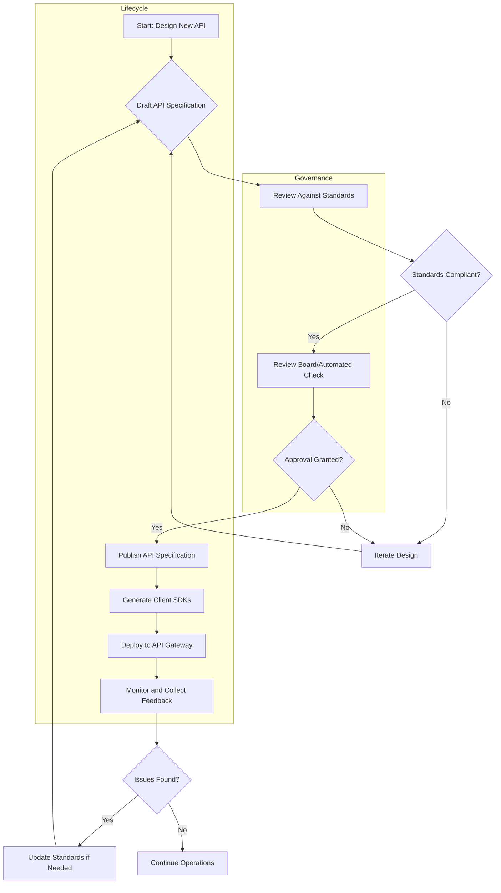

# API Design Standards

## Overview

API Design Standards establish consistent conventions for designing and building APIs across an organization. These standards ensure that all APIs follow uniform patterns for URL structure, request/response formats, error handling, authentication, and naming conventions. The primary goal is to create a cohesive API ecosystem where developers can easily understand and integrate with any API within the enterprise without needing to learn new patterns for each service.

API design standards serve multiple critical purposes in enterprise architecture. First, they ensure consistency across all APIs, making it easier for consumers to work with multiple APIs. When all APIs follow the same conventions, developers can apply their knowledge from one API to others, reducing the learning curve and time to productivity. Second, well-designed standards improve developer experience by providing clear expectations and reducing the need for custom documentation for each service. Third, consistent APIs simplify testing and monitoring since similar patterns can be applied across all services. Fourth, APIs designed to standards are easier to maintain and evolve over time as the organization grows.

The design standards typically cover several key areas: URI structure and resource naming, HTTP methods and their appropriate usage, request and response formats (typically JSON), error handling and status codes, versioning approach, authentication and authorization mechanisms, rate limiting and throttling policies, pagination conventions, field naming conventions (typically camelCase vs snake_case), and hypermedia link patterns. Organizations may also include standards around API documentation format, testing requirements, and security considerations.

Establishing API design standards requires collaboration between platform teams, security teams, and API producers. The standards should be documented in a living style guide that evolves based on real-world usage and feedback. Enforcement of these standards typically happens through code review processes and may be augmented with automated linting tools that validate API specifications against the defined standards before deployment.

## Flow Chart: API Design Standards Workflow



The workflow above illustrates the iterative nature of API design within a standards-based governance framework. The process begins when a team needs to design a new API or modify an existing one. They first draft an API specification, which could be in OpenAPI (Swagger), GraphQL schema, or another supported format. This specification is then reviewed against the organization's API design standards to ensure compliance with naming conventions, resource structures, error handling patterns, and other requirements.

If the design is not standards-compliant, the team iterates on their design until it meets all requirements. This may involve renaming endpoints, restructuring resources, adjusting error responses, or making other modifications. Once compliant, the specification goes through a formal review process that may involve a governance board or automated validation tool. This review ensures the design meets not only technical standards but also business requirements, security guidelines, and architectural alignment.

Upon approval, the API specification is published to a central registry where consumers can discover it. Client SDKs may be automatically generated from the specification to accelerate adoption. The API is then deployed through an API gateway that enforces security, rate limiting, and other policies. Ongoing monitoring collects feedback about API usage, errors, and performance, which informs future improvements to both the API and the standards themselves.

## Standard Example: REST API Design Convention

```yaml
# OpenAPI 3.0 Specification for a User Management API
# This example demonstrates consistent API design standards

openapi: 3.0.3
info:
  title: User Management API
  version: 1.0.0
  description: |
    Standard User Management API for enterprise applications.
    Follows v1.0 of the Enterprise API Design Standards.
  contact:
    name: Platform Team
    email: platform@example.com
  license:
    name: MIT
    url: https://opensource.org/licenses/MIT

# Server configuration with consistent base path
servers:
  - url: https://api.example.com/v1
    description: Production server
  - url: https://sandbox.example.com/v1
    description: Sandbox server for testing

# Security schemes - consistent across all APIs
components:
  securitySchemes:
    BearerAuth:
      type: http
      scheme: bearer
      bearerFormat: JWT
      description: |
        JWT token obtained from the Authentication API.
        Include in Authorization header: Bearer <token>
    ApiKeyAuth:
      type: apiKey
      in: header
      name: X-API-Key
      description: |
        API key for server-to-server communication.
        Request from developer portal.

# Standardized paths following naming conventions
paths:
  # Resource names in plural form (kebab-case for URLs)
  /users:
    # Consistent method usage
    get:
      summary: List all users
      description: |
        Returns a paginated list of users.
        Results are sorted by creation date (newest first).
      operationId: listUsers
      tags:
        - Users
      security:
        - BearerAuth: []
      parameters:
        # Standard pagination parameters
        - name: page
          in: query
          description: Page number (1-indexed)
          schema:
            type: integer
            default: 1
            minimum: 1
        - name: page_size
          in: query
          description: Number of items per page
          schema:
            type: integer
            default: 20
            minimum: 1
            maximum: 100
        # Standard filtering
        - name: status
          in: query
          description: Filter by user status
          schema:
            type: string
            enum: [active, inactive, suspended]
        # Standard sorting
        - name: sort_by
          in: query
          description: Field to sort by
          schema:
            type: string
            enum: [created_at, updated_at, email]
          default: created_at
        - name: sort_order
          in: query
          description: Sort direction
          schema:
            type: string
            enum: [asc, desc]
          default: desc
      responses:
        # Consistent response structure
        '200':
          description: Successful response
          headers:
            X-Pagination:
              description: Pagination metadata
              schema:
                $ref: '#/components/schemas/Pagination'
          content:
            application/json:
              schema:
                $ref: '#/components/schemas/UserList'
        '400':
          $ref: '#/components/responses/BadRequest'
        '401':
          $ref: '#/components/responses/Unauthorized'
        '429':
          $ref: '#/components/responses/TooManyRequests'
        '500':
          $ref: '#/components/responses/InternalServerError'
    
    post:
      summary: Create a new user
      operationId: createUser
      tags:
        - Users
      requestBody:
        required: true
        content:
          application/json:
            schema:
              $ref: '#/components/schemas/CreateUserRequest'
      responses:
        '201':
          description: User created successfully
          headers:
            Location:
              description: URL of created resource
              schema:
                type: string
                format: uri
          content:
            application/json:
              schema:
                $ref: '#/components/schemas/User'
        '400':
          $ref: '#/components/responses/BadRequest'
        '401':
          $ref: '#/components/responses/Unauthorized'
        '409':
          $ref: '#/components/responses/Conflict'
        '422':
          $ref: '#/components/responses/UnprocessableEntity'
        '429':
          $ref: '#/components/responses/TooManyRequests'
        '500':
          $ref: '#/components/responses/InternalServerError'

  # Standard path pattern: /resources/{id}
  /users/{user_id}:
    parameters:
      - name: user_id
        in: path
        required: true
        description: Unique user identifier (UUID format)
        schema:
          type: string
          format: uuid
        example: 550e8400-e29b-41d4-a716-446655440000
    
    get:
      summary: Get a user by ID
      operationId: getUser
      tags:
        - Users
      responses:
        '200':
          description: Successful response
          content:
            application/json:
              schema:
                $ref: '#/components/schemas/User'
        '400':
          $ref: '#/components/responses/BadRequest'
        '401':
          $ref: '#/components/responses/Unauthorized'
        '404':
          $ref: '#/components/responses/NotFound'
        '429':
          $ref: '#/components/responses/TooManyRequests'
        '500':
          $ref: '#/components/responses/InternalServerError'
    
    patch:
      summary: Partial update of a user
      operationId: updateUser
      tags:
        - Users
      requestBody:
        required: true
        content:
          application/json:
            schema:
              $ref: '#/components/schemas/UpdateUserRequest'
      responses:
        '200':
          description: User updated successfully
          content:
            application/json:
              schema:
                $ref: '#/components/schemas/User'
        '400':
          $ref: '#/components/responses/BadRequest'
        '401':
          $ref: '#/components/responses/Unauthorized'
        '404':
          $ref: '#/components/responses/NotFound'
        '409':
          $ref: '#/components/responses/Conflict'
        '422':
          $ref: '#/components/responses/UnprocessableEntity'
        '429':
          $ref: '#/components/responses/TooManyRequests'
        '500':
          $ref: '#/components/responses/InternalServerError'
    
    delete:
      summary: Delete a user
      operationId: deleteUser
      tags:
        - Users
      responses:
        '204':
          description: User deleted successfully
        '400':
          $ref: '#/components/responses/BadRequest'
        '401':
          $ref: '#/components/responses/Unauthorized'
        '404':
          $ref: '#/components/responses/NotFound'
        '429':
          $ref: '#/components/responses/TooManyRequests'
        '500':
          $ref: '#/components/responses/InternalServerError'

# Standardized component schemas
components:
  schemas:
    # Base error response structure - consistent across all APIs
    Error:
      type: object
      description: Standard error response
      required:
        - code
        - message
      properties:
        code:
          type: string
          description: Machine-readable error code
          example: INVALID_REQUEST
        message:
          type: string
          description: Human-readable error message
          example: The request body contains invalid data
        details:
          type: array
          description: Additional error details
          items:
            type: object
            properties:
              field:
                type: string
                description: Field that caused the error
                example: email
              message:
                type: string
                description: Detail message for this field
                example: Invalid email format
    
    # Pagination metadata - standardized
    Pagination:
      type: object
      properties:
        page:
          type: integer
          description: Current page number
          example: 1
        page_size:
          type: integer
          description: Items per page
          example: 20
        total_count:
          type: integer
          description: Total number of items
          example: 150
        total_pages:
          type: integer
          description: Total number of pages
          example: 8
        has_next:
          type: boolean
          description: Whether there is a next page
          example: true
        has_previous:
          type: boolean
          description: Whether there is a previous page
          example: false
    
    # User-specific schemas
    UserList:
      type: object
      required:
        - data
        - pagination
      properties:
        data:
          type: array
          items:
            $ref: '#/components/schemas/User'
        pagination:
          $ref: '#/components/schemas/Pagination'
    
    User:
      type: object
      required:
        - id
        - email
        - created_at
      properties:
        id:
          type: string
          format: uuid
          description: Unique user identifier
          example: 550e8400-e29b-41d4-a716-446655440000
        email:
          type: string
          format: email
          description: User email address
          example: john.doe@example.com
        first_name:
          type: string
          description: User first name
          example: John
        last_name:
          type: string
          description: User last name
          example: Doe
        status:
          type: string
          enum: [active, inactive, suspended]
          description: Account status
          example: active
        created_at:
          type: string
          format: date-time
          description: Creation timestamp (ISO 8601)
          example: 2024-01-15T09:30:00Z
        updated_at:
          type: string
          format: date-time
          description: Last update timestamp
          example: 2024-01-15T09:30:00Z
    
    CreateUserRequest:
      type: object
      required:
        - email
        - first_name
        - last_name
      properties:
        email:
          type: string
          format: email
        first_name:
          type: string
          minLength: 1
          maxLength: 100
        last_name:
          type: string
          minLength: 1
          maxLength: 100
    
    UpdateUserRequest:
      type: object
      properties:
        email:
          type: string
          format: email
        first_name:
          type: string
          minLength: 1
          maxLength: 100
        last_name:
          type: string
          minLength: 1
          maxLength: 100
        status:
          type: string
          enum: [active, inactive, suspended]
  
  # Standardized error responses - consistent across all APIs
  responses:
    BadRequest:
      description: Bad Request - Invalid request parameters
      content:
        application/json:
          schema:
            $ref: '#/components/schemas/Error'
      headers:
        X-Request-Id:
          description: Unique request identifier for debugging
          schema:
            type: string
            format: uuid
    
    Unauthorized:
      description: Unauthorized - Authentication required
      content:
        application/json:
          schema:
            $ref: '#/components/schemas/Error'
    
    Forbidden:
      description: Forbidden - Insufficient permissions
      content:
        application/json:
          schema:
            $ref: '#/components/schemas/Error'
    
    NotFound:
      description: Not Found - Resource does not exist
      content:
        application/json:
          schema:
            $ref: '#/components/schemas/Error'
    
    Conflict:
      description: Conflict - Resource already exists
      content:
        application/json:
          schema:
            $ref: '#/components/schemas/Error'
    
    UnprocessableEntity:
      description: Unprocessable Entity - Validation failed
      content:
        application/json:
          schema:
            $ref: '#/components/schemas/Error'
    
    TooManyRequests:
      description: Too Many Requests - Rate limit exceeded
      headers:
        Retry-After:
          description: Seconds to wait before retrying
          schema:
            type: integer
        X-RateLimit-Limit:
          description: Request limit for this window
          schema:
            type: integer
        X-RateLimit-Remaining:
          description: Remaining requests in window
          schema:
            type: integer
      content:
        application/json:
          schema:
            $ref: '#/components/schemas/Error'
    
    InternalServerError:
      description: Internal Server Error
      content:
        application/json:
          schema:
            $ref: '#/components/schemas/Error'