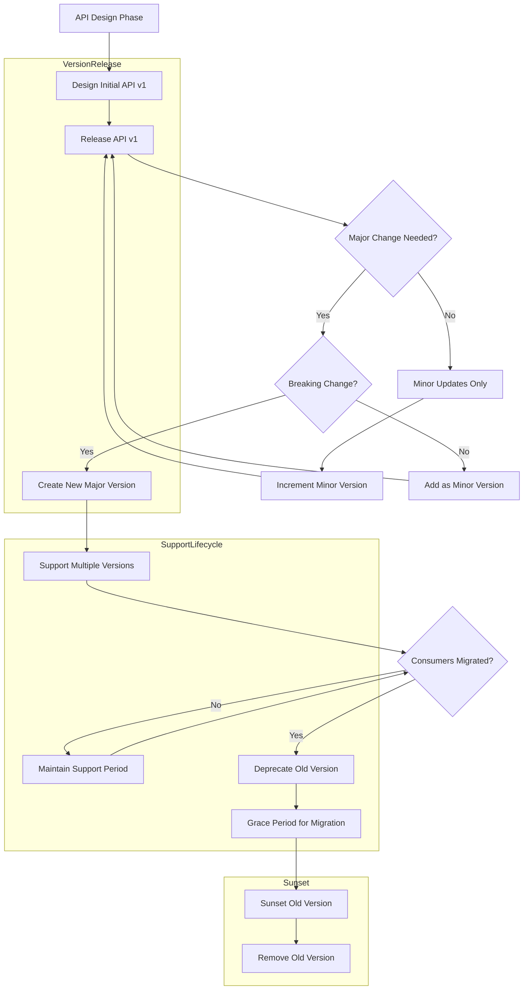

# API Versioning

## Overview

API Versioning is the practice of managing changes to an API over time while maintaining backward compatibility for existing consumers. As APIs evolve to add new features, fix bugs, or refactor functionality, there needs to be a strategy to introduce these changes without breaking existing integrations. Versioning provides a mechanism to support multiple versions of an API simultaneously, allowing consumers to migrate to newer versions at their own pace while the API provider can eventually deprecate older versions.

Versioning is essential for several reasons in a microservices architecture. First, it provides stability for existing consumers who have built integrations around specific API contracts. When these consumers upgrade their systems, they can choose to adopt newer API versions on their schedule. Second, versioning enables API providers to make breaking changes (such as removing fields, changing field types, or restructuring endpoints) without disrupting current operations. Third, it allows different consumer cohorts to use different API versions based on their maturity and requirements, supporting a gradual migration path. Fourth, versioning provides clear boundaries for API lifecycle management, including deprecation timelines and support windows.

There are several common approaches to API versioning, each with advantages and trade-offs. URL path versioning includes the version identifier directly in the URL path (e.g., /v1/users, /v2/users), which is simple to understand and implement but creates separate endpoints for each version. Header versioning uses HTTP headers to specify the version (e.g., Accept: application/vnd.example.v1+json), keeping URLs cleaner but requiring more complex client implementation. Query parameter versioning adds the version as a query parameter (e.g., /users?version=1), which is easy to implement but can be less intuitive. Content negotiation uses HTTP Accept headers to specify version and media type, following REST principles but being less visible and harder to debug.

The choice of versioning strategy should consider the organization's specific requirements, existing infrastructure, and consumer expectations. Many organizations default to URL path versioning for its transparency and ease of use, even though it technically violates some REST principles. Regardless of the chosen strategy, consistency across all APIs in the organization is more important than choosing the "perfect" approach.

## Flow Chart: API Versioning Lifecycle



The versioning lifecycle begins when designing a new API. The initial release is typically version 1.0.0 or 1.0. When the API needs updates, the process evaluates whether the changes are breaking or non-breaking. Non-breaking changes (such as adding new optional fields, adding new endpoints, or adding new enum values) can be released as minor version increments within the same major version. These updates are automatically available to all existing consumers without any action required.

When breaking changes are needed (such as removing or renaming fields, changing field types, removing endpoints, or changing response structure), a new major version is created. This major version increment signals to consumers that they may need to modify their integrations. The new major version is released alongside existing versions, allowing consumers to migrate gradually. During the support period, the API provider maintains both versions, addressing bugs and security issues for each.

The deprecation and sunset process provides a clear timeline for consumers to migrate. After a major version is deprecated, a grace period is announced (typically 6-12 months) during which consumers are encouraged to migrate but the deprecated version still functions. After the grace period, the old version is sunset and eventually removed from service. This structured approach ensures consumers have adequate time to plan and execute their migrations.

## Standard Example: Multi-Version API Gateway Configuration

```yaml
# API Gateway Configuration demonstrating multi-version support
# Using URL path versioning strategy (most common)

versioning:
  # Default version when no version specified
  default_version: v1
  
  # Versioning strategy: PATH (URL contains version)
  strategy: path
  
  # Header-based fallback for clients that prefer headers
  fallback_strategy: header
  version_header: Accept-Version

# Version-specific configurations
versions:
  v1:
    # Released date and support timeline
    released: 2023-01-15
    status: deprecated
    sunset_date: 2024-07-01
    
    # Deprecation notice sent to consumers
    deprecation_notice: |
      API v1 will be sunset on July 1, 2024.
      Please migrate to v2 before this date.
    
    # Migration path
    migration_guide: /docs/migration/v1-to-v2
    
    # Rate limits specific to this version
    rate_limits:
      requests_per_minute: 100
      burst: 20
    
    # Feature flags for gradual rollout
    features:
      new_response_format: false
      extended_fields: false
    
    # Endpoints available in this version
    endpoints:
      /users:
        methods: [GET, POST]
        deprecated: true
      /users/{id}:
        methods: [GET, PATCH, DELETE]
        deprecated: true
      /products:
        methods: [GET]
        deprecated: true
      /orders:
        methods: [GET, POST]
        deprecated: true
    
    # Response schema version identifier
    schema_version: "1.0"
    
    # Transform layer for backward compatibility
    transforms:
      - type: response_field_mapping
        from: createdDate
        to: created_at
      - type: status_code_normalization
        legacy_codes:
          422: 400
        normalize_to: 422

  v2:
    released: 2023-06-01
    status: active
    support_tier: standard
    
    # Current stable version
    features:
      new_response_format: true
      extended_fields: true
      batch_operations: true
      webhooks: true
    
    # Enhanced rate limits
    rate_limits:
      requests_per_minute: 1000
      burst: 200
    
    # Endpoints with full functionality
    endpoints:
      /users:
        methods: [GET, POST]
        features: [pagination, filtering, sorting]
      /users/{id}:
        methods: [GET, PATCH, DELETE]
        features: [partial_update, history]
      /products:
        methods: [GET, POST, PATCH]
        features: [inventory, variants]
      /orders:
        methods: [GET, POST, PATCH]
        features: [status_tracking, cancellation]
      /webhooks:
        methods: [GET, POST, DELETE]
        features: [subscriptions, retry_policy]
    
    # Response schema with enrichment
    schema_version: "2.0"
    
    # Response includes version metadata
    response_metadata:
      include_version: true
      include_deprecated_warnings: true

  v3:
    released: 2024-01-15
    status: beta
    support_tier: limited
    
    # Beta version - limited availability
    access:
      requires_beta_flag: true
      max_consumers: 100
    
    # Preview features
    preview_features:
      graphql: true
      batch_operations_v2: true
      ai_predictions: true
    
    # Testing infrastructure
    testing:
      sandbox_only: true
      mock_data_available: true
    
    rate_limits:
      requests_per_minute: 500
      burst: 50
    
    endpoints:
      /users:
        methods: [GET, POST]
        preview: true
      /users/{id}:
        methods: [GET, PATCH, DELETE]
        preview: true
      /graphql:
        methods: [POST]
        preview: true
      /ai:
        methods: [POST]
        preview: true
    
    schema_version: "3.0"

# Routing configuration
routes:
  # Explicit version routing
  - path: /v1/users
    version: v1
    backend: https://api-v1.example.com
    strip_version_path: false
  
  - path: /v2/users
    version: v2
    backend: https://api-v2.example.com
    strip_version_path: false
  
  - path: /v3/users
    version: v3
    backend: https://api-v3.example.com
    strip_version_path: false
  
  # Header-based version routing
  - path: /users
    backend: https://api-v2.example.com
    strip_version_path: false
    version_header: Accept-Version

# Deprecation notifications
deprecation:
  # Timeline configuration
  timeline:
    announced: 6 months before sunset
    deprecated: 3 months before sunset
    sunset: after deprecation period
  
  # Notification channels
  notifications:
    - type: response_header
      name: Deprecation
      include_date: true
    - type: response_warning
      header: Warning
      include_in: v1 responses
    - type: email
      to: registered_consumers
      frequency: monthly
    - type: developer_portal
      notice_banner: true
    - type: status_page
      update: true
  
  # Sunset headers
  sunset_headers:
    Sunset: true
    Link: rel=alternate

# Version negotiation
negotiation:
  # Allow clients to request version range
  allow_version_range: true
  
  # Response includes available versions
  advertise_versions: true
  
  # PreferHeader for version preference
  prefer_header: Prefer
  prefer_values:
    - wait=30
    - return=representation
    - respond-async