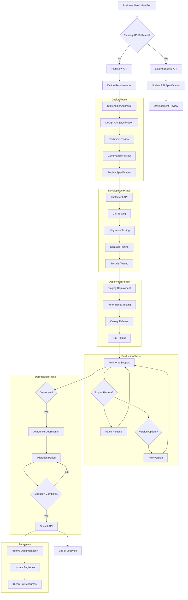

# API Lifecycle Management

## Overview

API Lifecycle Management encompasses the entire journey of an API from initial conception through design, development, deployment, versioning, and eventual retirement. It's a comprehensive framework that ensures APIs are designed thoughtfully, built reliably, deployed consistently, maintained effectively, and retired gracefully. In microservices architectures where hundreds of APIs may exist, systematic lifecycle management is critical for maintaining coherence, preventing chaos, and ensuring that APIs serve business objectives throughout their existence.

The API lifecycle typically includes several distinct phases. The planning phase involves identifying business needs, evaluating existing capabilities, and determining whether a new API is required or if an existing API can be extended or modified. The design phase creates the API specification, including endpoints, data models, error handling, and security requirements. This specification serves as a contract between API producers and consumers. The development phase implements the API according to the specification, including business logic, data persistence, and integration with other services. The testing phase validates the API against requirements, including functional testing, security testing, load testing, and contract testing to ensure compatibility with existing consumers.

The deployment phase transitions the API from development to production, including configuring the API gateway, setting up monitoring, establishing logging, and configuring security policies. The production phase maintains the API in operation, including monitoring performance, addressing bugs, releasing updates, and managing versioning. The deprecation phase signals to consumers that an API or version will be retired, providing advance notice and migration guidance. The retirement phase removes the API from service, ensuring a clean shutdown and archival of documentation. Each phase has specific activities, deliverables, and approval gates that ensure quality and consistency.

An effective lifecycle management framework addresses not only technical concerns but also organizational aspects. It defines roles and responsibilities for API ownership, establishes governance processes for design review and approval, creates standards for documentation and metadata, and implements tooling for automation. The framework should be flexible enough to accommodate different API types (internal, partner, public) while maintaining consistency in core processes.

## Flow Chart: Complete API Lifecycle



The lifecycle begins when a business need is identified. The first decision point evaluates whether existing APIs can fulfill the need, either through direct use or extension. If a new API is needed, the planning phase defines requirements and secures stakeholder approval. The design phase creates a detailed specification that goes through technical and governance review before being published. This published specification serves as the contract that consumers and developers rely upon.

Development implements the API according to the specification, with multiple testing phases ensuring quality. Testing includes unit tests for individual components, integration tests for service interactions, contract tests to ensure API compatibility, and security testing to identify vulnerabilities. Deployment follows a progressive approach, first staging, then canary release (exposing to a small percentage of traffic), and finally full rollout. This approach allows issues to be detected and addressed before affecting all consumers.

Production phase is typically the longest phase, during which the API serves real traffic and delivers business value. Maintenance includes bug fixes, performance improvements, and feature additions. When significant changes are needed, new versions are created following the versioning strategy. Eventually, APIs may be deprecated when they reach end of life, providing consumers with adequate time to migrate. The deprecation phase includes announcements, migration support, and eventually graceful shutdown. Retirement archives relevant information and cleans up resources to prevent technical debt accumulation.

## Standard Example: API Lifecycle Configuration

```yaml
# API Lifecycle Management Configuration
# Defines policies and automation for API lifecycle

name: User Management API
identifier: com.example.user-management

# Lifecycle metadata
lifecycle:
  # Current phase
  phase: production
  
  # Key dates
  created: 2023-01-15
  last_modified: 2024-02-20
  
  # Ownership
  owner:
    team: Platform Team
    contact: platform@example.com
    slack_channel: "#api-platform"
  
  # Business context
  business_unit: Customer Experience
  cost_center: CX-001
  
  # Priority and classification
  priority: high
  tier: tier_1
  data_classification: PII

# Stages and gates
stages:
  planning:
    enabled: true
    required_approvers:
      - business_analyst
      - product_owner
    deliverables:
      - business_requirements
      - api_canvas
      - feasibility_assessment
    automated_checks:
      - duplicate_api_check
      - architecture_alignment
  
  design:
    enabled: true
    required_approvers:
      - api_designer
      - security_review
      - architecture_review
    deliverables:
      - openapi_specification
      - api_documentation
      - security_assessment
      - test_plan
    automated_checks:
      - openapi_validation
      - naming_convention_check
      - security_rules_check
      - breaking_change_detection
    standards:
      response_time:
        target: 200ms
        maximum: 500ms
      availability:
        target: 99.9%
        measurement: monthly
      error_rate:
        target: 0.1%
        maximum: 1%
  
  development:
    enabled: true
    required_approvers:
      - tech_lead
    branch_strategy: trunk_based
    code_standards:
      language_version: "2023"
      coverage:
        minimum: 80%
        critical_paths: 90%
    quality_gates:
      - static_analysis
      - linting
      - unit_tests
      - code_review
  
  testing:
    enabled: true
    environments:
      - name: integration
        automatic: true
        data_refresh: daily
      - name: staging
        automatic: true
        data_refresh: on_deploy
      - name: performance
        automatic: false
        data_snapshot: latest
    test_types:
      functional:
        minimum_coverage: 95%
        critical_paths: 100%
      contract:
        enabled: true
        provider: pact_broker
      security:
        enabled: true
        scan_types:
          - SAST
          - DAST
          - dependency_scan
      performance:
        enabled: true
        load_profiles:
          normal: 1000 rps
          peak: 5000 rps
          stress: 10000 rps
      contract_migration:
        enabled: true
        pact_version: v3
  
  deployment:
    enabled: true
    strategy: blue_green
    approval_required: true
    required_approvers:
      - release_manager
    environments:
      - name: development
        automatic: true
        approval: false
      - name: staging
        automatic: false
        approval: true
      - name: production
        automatic: false
        approval: true
        change_ticket: required
    rollout:
      strategy: canary
      initial_percentage: 5
      increment: 10
      interval: 30m
      rollback_on_errors: true
  
  production:
    enabled: true
    monitoring:
      metrics:
        - request_count
        - response_time
        - error_rate
        - availability
      alerting:
        - type: pagerduty
          conditions:
            - error_rate > 1% for 5m
            - response_time > 1s for 5m
            - availability < 99.9%
        - type: slack
          conditions:
            - error_rate > 5% for 1m
      dashboard: grafana
      health_check:
        endpoint: /health
        interval: 30s
        timeout: 5s
    support:
      tier: 24x7
      escalation:
        - level: 1 (Support Team)
          timeout: 1h
        - level: 2 (API Team)
          timeout: 4h
        - level: 3 (Engineering Lead)
          timeout: 8h
    maintenance:
      scheduled_window:
        day: Saturday
        time: 02:00-04:00 UTC
      notification_required: 72h
      allowed_downtime: 30m
  
  deprecation:
    enabled: true
    policies:
      announcement:
        advance_notice: 6 months
        channels:
          - developer_portal
          - email
          - status_page
      migration_support:
        technical_assistance: true
        migration_guide: required
        sandbox_access: true
      compatibility:
        maintain_backwards_compatibility: true
        fix_critical_bugs: true
        security_patches: true
      sunset:
        after: 6 months from deprecation
        hard_stop: true
    procedures:
      - monitor_migration_progress
      - send_migration_reminders
      - provide_migration_incentives
      - enforce_migration_deadlines
  
  retirement:
    enabled: true
    policies:
      preservation:
        documentation: 2 years
        telemetry_data: 1 year
        customer_data: per_policy
      notification:
        final_warning: 30 days
        post_sunset_support: 30 days
      cleanup:
        delete_after: 90 days
        backup_before: true
    audit:
      retention: 7 years
      access: authorized_personnel

# Version information
versions:
  current: v2.1
  supported:
    - v2.1
    - v2.0
  deprecated:
    - v1.0
  sunset:
    - v1.0: 2024-06-01

# Documentation links
documentation:
  specification: /apis/specs/user-management/v2.1
  documentation: /apis/docs/user-management
  migration_guide: /apis/migration/v1-to-v2
  changelog: /apis/changelog/user-management
  status_page: status.example.com

# Integrations
integrations:
  api_gateway: api-gateway-prod
  logging: elk-stack
  metrics: prometheus
  monitoring: grafana
  testing: pact_broker
  documentation:.readme.io