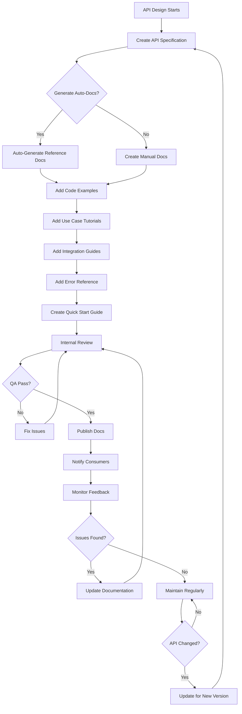

# API Documentation

## Overview

API Documentation serves as the primary communication channel between API providers and consumers. It encompasses everything from technical specifications that describe endpoints, parameters, and responses to conceptual guides that explain business logic and use cases. Effective documentation is crucial for API adoption, as developers often decide whether to use an API based on the quality and completeness of its documentation. Poor documentation leads to support requests, integration delays, and frustration, while excellent documentation accelerates adoption and reduces the burden on support teams.

API documentation typically includes several distinct types of content. Reference documentation describes each endpoint in detail, including HTTP methods, URLs, query parameters, request bodies, response formats, status codes, and error schemas. This is often generated automatically from API specifications like OpenAPI (Swagger) documents. Getting Started guides provide tutorials that walk new developers through authentication, making their first API call, and understanding basic usage patterns. These guides help developers quickly achieve their first success with the API. Conceptual documentation explains the business domain, terminology, and design decisions behind the API. This helps consumers understand not just how to use the API but why certain design choices were made.

Use Case documentation shows common integration patterns and real-world scenarios, such as "how to process webhooks" or "how to implement pagination." These practical examples demonstrate the API in action and help developers apply it to their specific needs. Integration Guides provide language-specific examples for common SDKs and libraries, showing how to use the API from different programming environments. Error Reference documentation explains all possible error codes and messages, including causes and suggested resolutions. Changelog documentation tracks all changes to the API, including new features, bug fixes, breaking changes, and deprecations, helping consumers understand what changed between versions.

Modern API documentation extends beyond static content to include interactive elements. Interactive API consoles allow developers to make real API calls directly from the documentation, using their own API keys. This immediate feedback dramatically accelerates the learning process. SDK documentation provides language-specific references for official and community SDKs. Status and availability dashboards show current API status and historical uptime. Community resources include forums, Stack Overflow tags, and sample code repositories where developers can learn from peers.

## Flow Chart: Documentation Development and Publishing



Documentation development typically begins early in the API design process. The API specification serves as the foundation, from which reference documentation can often be automatically generated. After generating this base documentation, additional content is added manually: code examples showing usage in various languages, use case tutorials demonstrating common scenarios, integration guides for specific SDKs, and error reference documentation explaining all possible errors and their resolutions. A quick start guide helps new developers make their first API call quickly.

All documentation goes through internal review to verify accuracy, clarity, and completeness. Issues found during review are fixed before publishing. Once published, consumers are notified through appropriate channels (developer portal, email, changelog). Ongoing monitoring collects feedback, which informs documentation improvements. When the API changes, documentation is updated to reflect new endpoints, parameters, examples, and error codes before the API changes are released.

## Standard Example: Swagger UI Configuration and Integration

```html
<!DOCTYPE html>
<html lang="en">
<head>
  <meta charset="UTF-8">
  <meta name="viewport" content="width=device-width, initial-scale=1.0">
  <title>User Management API - Documentation</title>
  
  <!-- Swagger UI CSS -->
  <link rel="stylesheet" type="text/css" 
        href="https://cdn.example.com/swagger-ui/5.0.0/swagger-ui.css">
  
  <style>
    /* Custom styling to match company brand */
    :root {
      --primary-color: #2563eb;
      --secondary-color: #1e40af;
      --text-color: #1f2937;
      --bg-color: #ffffff;
      --code-bg: #f3f4f6;
    }
    
    body {
      font-family: -apple-system, BlinkMacSystemFont, "Segoe UI", Roboto, sans-serif;
      margin: 0;
      padding: 0;
      color: var(--text-color);
    }
    
    .topbar {
      background: var(--primary-color);
      padding: 1rem 2rem;
      display: flex;
      justify-content: space-between;
      align-items: center;
    }
    
    .topbar h1 {
      color: white;
      margin: 0;
      font-size: 1.5rem;
    }
    
    .version-selector {
      display: flex;
      gap: 0.5rem;
      align-items: center;
    }
    
    .version-selector select {
      padding: 0.5rem;
      border-radius: 4px;
      border: 1px solid rgba(255,255,255,0.3);
      background: rgba(255,255,255,0.1);
      color: white;
    }
    
    #swagger-ui {
      max-width: 1400px;
      margin: 0 auto;
      padding: 2rem;
    }
    
    /* Custom branding for Swagger UI */
    .swagger-ui .topbar {
      background: var(--primary-color);
    }
    
    .swagger-ui .info .title {
      font-size: 2.5rem;
    }
    
    .swagger-ui .info .description {
      font-size: 1.1rem;
      line-height: 1.6;
    }
    
    .header-badge {
      display: inline-block;
      padding: 0.25rem 0.75rem;
      border-radius: 9999px;
      font-size: 0.875rem;
      margin-left: 1rem;
    }
    
    .badge-stable {
      background: #dcfce7;
      color: #166534;
    }
    
    .badge-beta {
      background: #fef9c3;
      color: #854d0e;
    }
    
    .badge-deprecated {
      background: #fee2e2;
      color: #991b1b;
    }
  </style>
</head>
<body>
  <!-- Custom top bar -->
  <div class="topbar">
    <div>
      <h1>User Management API</h1>
      <span style="color: rgba(255,255,255,0.8);">Enterprise Identity Platform</span>
    </div>
    <div class="version-selector">
      <label for="version" style="color: white;">Version:</label>
      <select id="version" onchange="switchVersion(this.value)">
        <option value="v1">v1.0 (Deprecated)</option>
        <option value="v2" selected>v2.0 (Current)</option>
        <option value="v3">v3.0 (Beta)</option>
      </select>
    </div>
  </div>
  
  <!-- Swagger UI container -->
  <div id="swagger-ui"></div>
  
  <!-- Swagger UI Bundle -->
  <script src="https://cdn.example.com/swagger-ui/5.0.0/swagger-ui-bundle.js"></script>
  
  <script>
    // API configuration
    const API_CONFIG = {
      // OpenAPI specification URL
      url: '/api/specs/user-management/v2/openapi.json',
      
      // OAuth configuration (if applicable)
      oauthConfig: {
        clientId: '{CLIENT_ID}',
        realm: 'user-management-api',
        appName: 'User Management API Developer Portal',
        scopeSeparator: ' ',
        additionalQueryStringParams: {}
      },
      
      // API key authentication
      apiKey: 'X-API-Key',
      
      // Pre-authorization (use carefully!)
      // Only for demo environments
      // prefetchApiKey: 'demo-key-12345'
    };
    
    // Initialize Swagger UI
    window.onload = function() {
      const ui = SwaggerUIBundle({
        ...API_CONFIG,
        
        // Display options
        deepLinking: true,
        displayDocExpansion: 'list',
        displayRequestDuration: true,
        docExpansion: 'list',
        filter: true,
        showExtensions: true,
        showCommonExtensions: true,
        
        // Try it out configuration
        tryItOutEnabled: true,
        supportedSubmitMethods: ['get', 'post', 'put', 'patch', 'delete'],
        
        // Request snippet configuration
        requestSnippetsEnabled: true,
        requestSnippets: {
          generators: {
            curl: {
              title: 'cURL',
              default: true
            },
            'node/axios': {
              title: 'Node.js Axios'
            },
            python: {
              title: 'Python Requests'
            },
            ruby: {
              title: 'Ruby'
            },
            go: {
              title: 'Go'
            },
            java: {
              title: 'Java'
            },
            csharp: {
              title: 'C#'
            },
            php: {
              title: 'PHP'
            }
          }
        },
        
        // Response consumer configuration
        presets: [
          SwaggerUIBundle.presets.apis,
          SwaggerUIBundle.SwaggerUIStandalonePreset
        ],
        
        // Layout configuration
        layout: 'StandaloneLayout'
      });
      
      window.ui = ui;
    };
    
    // Version switching function
    function switchVersion(version) {
      const specUrls = {
        'v1': '/api/specs/user-management/v1/openapi.json',
        'v2': '/api/specs/user-management/v2/openapi.json',
        'v3': '/api/specs/user-management/v3/openapi.json'
      };
      
      window.ui.initAsync({
        url: specUrls[version]
      });
    }
  </script>
</body>
</html>

<!--
  CUSTOM DOCUMENTATION COMPONENTS
  
  This file can be enhanced with additional interactive components
  that extend beyond standard Swagger UI functionality.
-->

<!-- Example: Custom Interactive Examples Component -->
<script>
  // Custom example manager for interactive code samples
  class ExampleManager {
    constructor() {
      this.examples = {};
      this.currentLanguage = 'curl';
    }
    
    // Register an example for an endpoint
    registerExample(endpoint, method, examples) {
      const key = `${endpoint}:${method}`;
      this.examples[key] = examples;
    }
    
    // Generate code example for a specific language
    generateExample(endpoint, method, params = {}) {
      const key = `${endpoint}:${method}`;
      const exampleSet = this.examples[key];
      
      if (!exampleSet) return null;
      
      return exampleSet[this.currentLanguage]
        || exampleSet['curl']; // fallback to curl
    }
  }
  
  // Example: Register examples for user creation
  const exampleManager = new ExampleManager();
  
  exampleManager.registerExample('/users', 'POST', {
    curl: `curl -X POST https://api.example.com/v2/users \\
  -H "Authorization: Bearer {TOKEN}" \\
  -H "Content-Type: application/json" \\
  -d '{
    "email": "john.doe@example.com",
    "first_name": "John",
    "last_name": "Doe"
  }'`,
    
    'node/axios': `const axios = require('axios');

const response = await axios.post('https://api.example.com/v2/users', {
  email: 'john.doe@example.com',
  first_name: 'John',
  last_name: 'Doe'
}, {
  headers: {
    'Authorization': 'Bearer {TOKEN}'
  }
});

console.log(response.data);`,
    
    python: `import requests

response = requests.post(
    'https://api.example.com/v2/users',
    json={
        'email': 'john.doe@example.com',
        'first_name': 'John',
        'last_name': 'Doe'
    },
    headers={
        'Authorization': 'Bearer {TOKEN}'
    }
)

print(response.json())`
  });
</script>