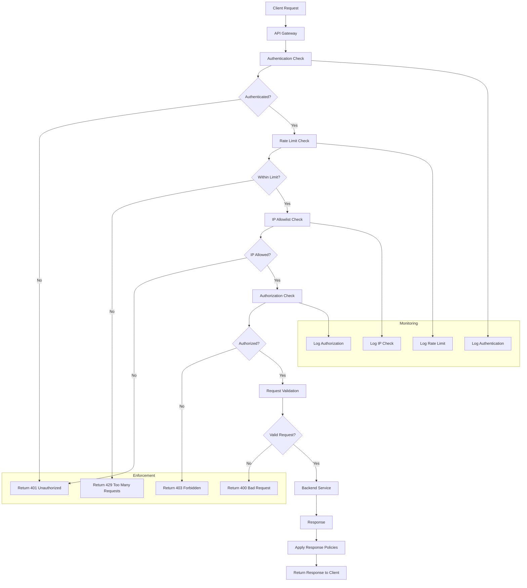

# API Policies

## Overview

API Policies define the rules, constraints, and governance mechanisms that govern API usage, access, and behavior. These policies ensure that APIs are used securely, fairly, and in alignment with business objectives. They encompass authentication and authorization requirements, rate limiting and throttling rules, data handling requirements, compliance obligations, and acceptable use definitions. Effective policy enforcement protects both API providers and consumers, ensuring stable service delivery while preventing abuse.

API policies serve multiple critical functions in enterprise architectures. Security policies define how APIs authenticate requests and authorize access to resources, ensuring that only legitimate consumers can access APIs and only to the extent permitted. Rate limiting policies prevent individual consumers from overwhelming APIs, ensuring fair resource allocation across all consumers. Data policies govern how sensitive data is handled through APIs, ensuring compliance with privacy regulations like GDPR, HIPAA, or PCI-DSS. Availability policies define service level expectations, maintenance windows, and incident response procedures. Compliance policies ensure APIs meet regulatory and industry standards.

The policy framework typically operates at multiple layers. At the API gateway or edge layer, policies like rate limiting, authentication, and IP allowlisting are enforced before requests reach backend services. At the service layer, business logic policies determine authorization decisions based on user roles, permissions, and resource ownership. At the data layer, policies govern field-level access, data masking, and retention. Comprehensive policy enforcement requires consistent application across all layers.

Policy management in large organizations requires tooling and automation. Policies should be defined in code (policy-as-code) to enable version control, review processes, and automated testing. Policy changes should follow change management procedures, including review and approval from security and compliance teams. Consumers should be notified of policy changes with adequate lead time. Enforcement should be transparent, with clear error messages when policies are violated. Monitoring should track policy violations to identify patterns and inform policy adjustments.

## Flow Chart: Policy Enforcement Pipeline



The policy enforcement pipeline processes each API request through a series of policy checks. The gateway first validates authentication, ensuring the client presents valid credentials. Failed authentication returns a 401 response with information about how to obtain valid credentials. Rate limiting checks ensure the client has not exceeded their allocated request quota. When limits are exceeded, a 429 response is returned along with information about retry timing.

IP allowlisting verifies the client originates from an approved network when this policy applies. Authorization checks confirm the authenticated client has permission to access the requested resource. Request validation ensures the request body, parameters, and headers conform to requirements. After policy checks pass, the request proceeds to backend services.

All policy decisions are logged for monitoring and audit purposes. The logs capture policy evaluations, outcomes, and relevant context. These logs inform dashboards showing policy violation patterns, help identify abusing consumers, and support incident investigation. Policy violations may trigger alerts and automated responses like temporarily blocking offending clients.

## Standard Example: API Gateway Policy Configuration

```yaml
# API Gateway Policy Configuration
# Defines all policies for API access and behavior

gateway:
  name: api-gateway-prod
  version: "3.0"
  environment: production

# Global policies applied to all APIs
global_policies:
  # Request/Response logging
  logging:
    enabled: true
    log_level: info
    include:
      - request_id
      - timestamp
      - client_ip
      - method
      - path
      - status_code
      - response_time
      - request_size
      - response_size
    sensitive_fields:
      - password
      - credit_card
      - api_key
      - access_token
    retention_days: 90
  
  # CORS policy for browser-based clients
  cors:
    enabled: true
    allowed_origins:
      - https://app.example.com
      - https://dashboard.example.com
    allowed_methods:
      - GET
      - POST
      - PUT
      - DELETE
      - OPTIONS
    allowed_headers:
      - Authorization
      - Content-Type
      - X-Request-Id
      - X-Correlation-Id
    exposed_headers:
      - X-RateLimit-Limit
      - X-RateLimit-Remaining
      - X-RateLimit-Reset
    max_age: 86400
    allow_credentials: true
  
  # Security headers
  security_headers:
    - name: Strict-Transport-Security
      value: max-age=31536000; includeSubDomains
    - name: X-Content-Type-Options
      value: nosniff
    - name: X-Frame-Options
      value: DENY
    - name: X-XSS-Protection
      value: 1; mode=block
    - name: Content-Security-Policy
      value: default-src 'none'

# Authentication policies by API
authentication:
  user_management_api:
    type: oauth2
    flows:
      - client_credentials
      - authorization_code
    token_endpoint: /oauth/token
    revoke_endpoint: /oauth/revoke
    token_lifetime:
      access_token: 3600
      refresh_token: 86400
    required_scopes:
      - users:read
      - users:write
  
  payment_api:
    type: oauth2
    flows:
      - client_credentials
    token_endpoint: /oauth/token
    token_lifetime:
      access_token: 1800
    required_scopes:
      - payments:read
      - payments:write
  
  analytics_api:
    type: api_key
    keys_per_consumer: 5
    rotation_allowed: true
    rotation_interval_days: 90

# Rate limiting policies
rate_limits:
  # Default tier limits
  tiers:
    free:
      requests_per_minute: 60
      requests_per_day: 1000
      burst: 10
    standard:
      requests_per_minute: 500
      requests_per_day: 50000
      burst: 50
    premium:
      requests_per_minute: 5000
      requests_per_day: 500000
      burst: 200
    enterprise:
      requests_per_minute: 50000
      burst: 1000
  
  # Per-endpoint rate limits (override tier)
  endpoint_overrides:
    - path: /users/search
      methods: [GET]
      limit: 100 per minute
    - path: /users/bulk-import
      methods: [POST]
      limit: 10 per minute
    - path: /webhooks
      methods: [POST]
      limit: 5000 per minute
  
  # Rate limit response headers
  headers:
    limit: X-RateLimit-Limit
    remaining: X-RateLimit-Remaining
    reset: X-RateLimit-Reset
    retry_after: Retry-After
  
  # Rate limit error handling
  error_response:
    code: RATE_LIMIT_EXCEEDED
    message: Too many requests. Please slow down.
    status_code: 429

# Authorization policies per API
authorization:
  user_management_api:
    model: rbac
    roles:
      admin:
        permissions:
          - users:read
          - users:write
          - users:delete
      manager:
        permissions:
          - users:read
          - users:write
      user:
        permissions:
          - users:read:own
          - users:write:own
    default_role: user
  
  payment_api:
    model: resource_scope
    resource_ownership:
      enabled: true
      owner_field: customer_id
    scope_mapping:
      payments:read: All payment resources owned by the customer
      payments:write: Payment resources owned by customer

# IP-based access control
ip_allowlist:
  enabled: true
  default_policy: deny
  
  rules:
    # Internal services - unrestricted
    - name: internal-services
      ip_ranges:
        - 10.0.0.0/8
        - 172.16.0.0/12
      action: allow
      apis:
        - "*"
    
    # Partner integrations - specific IPs
    - name: partner-acme
      ip_ranges:
        - 203.0.113.0/24
      action: allow
      apis:
        - payment_api
        - inventory_api
    
    # External developers - deny all
    - name: external-default
      ip_ranges:
        - "0.0.0.0/0"
      action: deny

# Request validation policies
request_validation:
  enabled: true
  max_request_size: 1048576  # 1MB
  allowed_content_types:
    - application/json
    - application/x-www-form-urlencoded
    - multipart/form-data
  
  # Schema validation per endpoint
  schemas:
    - path: /users
      method: POST
      required_fields:
        - email
        - first_name
        - last_name
      field_constraints:
        email:
          format: email
          max_length: 255
        first_name:
          type: string
          min_length: 1
          max_length: 100
        last_name:
          type: string
          min_length: 1
          max_length: 100

# Response policies
response_policies:
  # Data masking for sensitive fields
  data_masking:
    enabled: true
    rules:
      - field: credit_card
        mask: "************{last4}"
      - field: ssn
        mask: "***-**-{last4}"
      - field: password
        mask: "[REDACTED]"
      - field: email
        conditions:
          role: user
        mask: "{first_char}***@{domain}"
  
  # Response compression
  compression:
    enabled: true
    algorithms:
      - gzip
      - deflate
    min_size: 1024
  
  # Pagination defaults
  pagination:
    default_page_size: 20
    max_page_size: 100

# Deprecation and sunset policies
deprecation:
  # Deprecation notice period
  notice_period_days: 180
  
  # Sunset grace period
  grace_period_days: 90
  
  # Features disabled during sunset
  sunset_features:
    - new_consumer_registration
    - token_refresh
  
  # Response headers for deprecated APIs
  headers:
    - name: Deprecation
      value: "true"
      include_after: deprecation_notice
    - name: Sunset
      date: "{sunset_date}"
      include_after: deprecation_notice

# Compliance policies
compliance:
  # Data retention
  data_retention:
    request_logs: 1 year
    access_logs: 3 years
    audit_logs: 7 years
  
  # Audit requirements
  audit:
    enabled: true
    log_all_data_access: true
    log_field_level: true
  
  # GDPR compliance
  gdpr:
    data_export_endpoint: /users/{id}/export
    data_deletion_endpoint: /users/{id}
    right_to_forgotten: true
  
  # PCI-DSS compliance
  pci:
    mask_credit_cards: true
    no_card_storage: true
    secure_transmission_only: true

# Monitoring and alerting
monitoring:
  # Policy violation alerting
  alerting:
    rate_limit_violations:
      threshold: 10 per minute
      severity: warning
      notification: slack
    
    authentication_failures:
      threshold: 20 per minute
      severity: critical
      notification: pagerduty
    
    authorization_violations:
      threshold: 5 per minute
      severity: warning
      notification: slack
  
  # Logging for compliance
  compliance_logging:
    enabled: true
    destinations:
      - elasticsearch
      - splunk
    fields:
      - timestamp
      - consumer_id
      - api_name
      - endpoint
      - policy_decision
      - violation_details