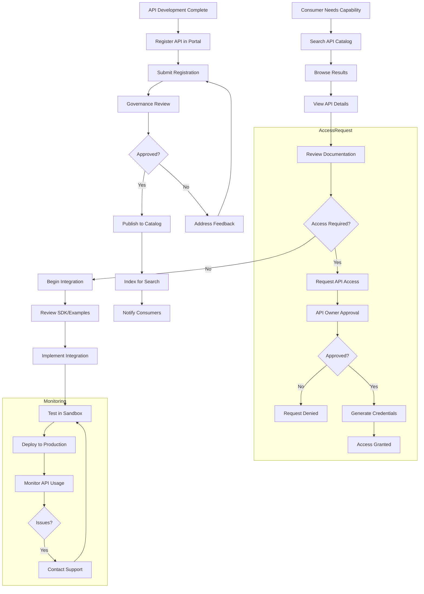

# API Registration

## Overview

API Registration establishes the authoritative record of all APIs within an organization, enabling discovery, governance, and management. It serves as the central registry where all APIs are documented, categorized, and tracked throughout their lifecycle. An effective registration system ensures that the organization has a complete picture of its API landscape, prevents duplication of effort, facilitates interoperability between services, and provides the foundation for API governance and monitoring.

API registration encompasses several key elements. API metadata includes the name, description, version, owner, and contact information for each registered API. Technical specifications reference the API's interface definition (OpenAPI, GraphQL schema, gRPC protocol). Categorization assigns APIs to logical groups based on domain, consumer type, or other relevant criteria. Lifecycle status tracks whether an API is in planning, development, active, deprecated, or retired. Usage metrics capture adoption, traffic patterns, and consumption data. Policy references link to the access policies, rate limits, and terms of service governing each API.

Registration serves multiple organizational needs. For API consumers, it enables discovery of available APIs, understanding of their capabilities and constraints, and access to documentation and support. For API producers, it provides visibility into how their APIs are being used, facilitates feedback collection, and supports deprecation planning. For governance teams, it provides the foundation for policy enforcement, compliance tracking, and architectural oversight. For leadership, it offers visibility into the API portfolio's size, health, and strategic alignment.

Modern registration systems are more than simple directories; they are platforms supporting the entire API lifecycle. Self-service registration allows API producers to register their APIs with appropriate metadata and specifications. Automated discovery can detect APIs in the infrastructure and prompt for registration. Integration with API gateways enables automatic sync of traffic statistics and policy data. Approval workflows ensure new APIs go through appropriate governance review before becoming visible to consumers. Deprecation tracking helps manage the transition away from legacy APIs while tracking consumer migration.

## Flow Chart: API Registration and Discovery



API registration begins when an API is ready for consumption. The API producer submits registration with all required metadata and the API specification. Governance review ensures the API meets organizational standards and identifies any conflicts with existing APIs. Once approved, the API is published to the catalog and indexed for search. Consumers are notified of new or relevant APIs through appropriate channels.

The consumer journey begins when a need is identified that might be fulfilled by an existing API. Searching or browsing the catalog reveals relevant options. Detailed API pages show capabilities, documentation, and access requirements. If access is needed, the consumer requests access, which the API owner approves (or denies) based on policies. Approved consumers receive credentials for the sandbox environment, where they can test their integration. After testing, the integration is deployed to production where ongoing monitoring tracks usage and identifies issues.

## Standard Example: API Registration System

```yaml
# API Registration System Configuration
# Defines the registry structure, validation rules, and integrations

registry:
  name: API Registry
  version: "2.0"
  environment: production

# API Registration Schema
api_schema:
  # Required metadata for all APIs
  required_fields:
    - name
    - identifier
    - description
    - version
    - owner
    - category
    - specification_url
    
  # Optional metadata
  optional_fields:
    - tags
    - documentation_url
    - sandbox_url
    - support_contact
    - service_level
    - data_classification
    - dependencies
    - related_apis
  
  # Field validation rules
  validation:
    name:
      pattern: "^[A-Z][A-Za-z0-9_-]*$"
      max_length: 50
      unique: true
    identifier:
      pattern: "^[a-z][a-z0-9.-]*[a-z0-9]$"
      max_length: 100
      unique: true
    version:
      pattern: "^\\d+\\.\\d+(\\.\\d+)?$"
    
# API Categories for Organization
categories:
  - name: Identity & Access Management
    code: IAM
    description: Authentication, authorization, and user management
    icon: lock
    
  - name: Customer Data
    code: CUSTOMER_DATA
    description: Customer information and preferences
    icon: users
    
  - name: Payments
    code: PAYMENTS
    description: Payment processing and financial transactions
    icon: credit-card
    
  - name: Analytics
    code: ANALYTICS
    description: Metrics, reporting, and business intelligence
    icon: chart-bar
    
  - name: Integration
    code: INTEGRATION
    description: Third-party integrations and webhooks
    icon: plug
    
  - name: Internal Services
    code: INTERNAL
    description: Internal backend services
    icon: server

# Registration Workflow
workflow:
  states:
    - draft
    - pending_review
    - review_in_progress
    - approved
    - rejected
    - published
    - deprecated
    - retired
  
  transitions:
    - from: draft
      to: pending_review
      trigger: submit
      require_role: API Producer
    
    - from: pending_review
      to: review_in_progress
      trigger: start_review
      require_role: API Governor
    
    - from: review_in_progress
      to: approved
      trigger: approve
      require_role: API Governor
    
    - from: review_in_progress
      to: rejected
      trigger: reject
      require_role: API Governor
    
    - from: approved
      to: published
      trigger: publish
      require_role: API Producer
    
    - from: published
      to: deprecated
      trigger: deprecate
      require_role: API Owner
    
    - from: deprecated
      to: retired
      trigger: retire
      require_role: API Owner
  
  # Approval requirements
  approval:
    - role: API Governor
      require: all_apis
    - role: Security Reviewer
      require_conditions:
        - data_classification: PII
        - data_classification: Financial
    - role: Architecture Reviewer
      require_conditions:
        - tier: tier_1

# Registration Validation Rules
validation:
  # Naming conventions
  naming:
    api_name: kebab-case
    endpoint_path: kebab-case
    field_names: snake_case
    
  # Specification requirements
  specification:
    format: [openapi, graphql, grpc]
    version: latest
    validate_on_registration: true
    
  # Documentation requirements
  documentation:
    required_sections:
      - Getting Started
      - Authentication
      - Endpoints Reference
      - Error Codes
      - Changelog
    min_examples_per_endpoint: 2
    
  # Security requirements
  security:
    require_authentication: true
    require_authorization_model: true
    require_rate_limiting: true

# Search and Discovery Configuration
search:
  # Searchable fields
  searchable:
    - name
    - description
    - category
    - tags
    - owner
    - endpoints.path
    - endpoints.summary
  
  # Boost factor for relevance
  relevance:
    name: 2.0
    description: 1.5
    category: 1.0
    tags: 1.5
    endpoint_path: 1.0
  
  # Filters available to consumers
  filters:
    - category
    - status
    - owner
    - data_classification
    - tier
  
  # Faceted navigation
  facets:
    - category
      display_name: Category
    - status
      display_name: Status
    - owner.team
      display_name: Team
    - data_classification
      display_name: Data Sensitivity

# API Page Configuration
api_page:
  sections:
    - name: Overview
      include:
        - name
        - description
        - version
        - status_badge
        - owner
        - category
    
    - name: Getting Started
      include:
        - base_url
        - authentication
        - quick_start_guide
    
    - name: Documentation
      include:
        - reference
        - examples
        - sdk_documentation
    
    - name: Terms
      include:
        - rate_limits
        - service_level
        - support_tier
    
    - name: Related
      include:
        - related_apis
        - dependencies

# Integration with API Gateway
gateway_integration:
  sync_enabled: true
  sync_interval: 15 minutes
  data_included:
    - traffic_stats
    - error_rate
    - response_time
    - active_consumers

# Integration with Monitoring
monitoring_integration:
  sync_enabled: true
  sync_interval: 5 minutes
  metrics_included:
    - request_count
    - error_count
    - response_time_p50
    - response_time_p95
    - response_time_p99

# Consumer Management
consumers:
  # Registration request fields
  registration_request:
    - consumer_name
    - use_case
    - expected_volume
    - environments
    
  # Approval workflow
  approval_workflow:
    - step: review_request
      role: API Owner
    - step: security_review
      role: Security Reviewer
      condition: data_classification == PII
    
  # Credential management
  credentials:
    types:
      - API Key
      - OAuth Client
    rotation:
      enabled: true
      warning_days: 30

# Analytics and Reporting
analytics:
  # Dashboard metrics
  dashboard:
    - total_apis
    - active_apis
    - deprecated_apis
    - total_consumers
    - total_requests
    
  # Reports
  reports:
    - name: API Adoption Report
      frequency: monthly
      include:
        - new_apis_registered
        - apis_by_category
        - popular_apis
        - consumer_growth
    
    - name: API Usage Report
      frequency: weekly
      include:
        - top_apis
        - traffic_trends
        - error_rates
        - response_times
    
    - name: Deprecation Progress
      frequency: monthly
      include:
        - deprecated_apis
        - consumer_migration_status
        - sunset_timeline

# Notifications
notifications:
  new_api_registration:
    channels:
      - email
      - slack
    recipients:
      - API Consumers Group
  
  api_deprecation:
    channels:
      - email
      - developer_portal
      - status_page
    timeline:
      - 6 months before sunset
      - 3 months before sunset
      - 1 month before sunset
      - 1 week before sunset
      - sunset date
  
  policy_changes:
    channels:
      - email
      - slack
    timeline:
      - 30 days before implementation
      - 7 days before implementation

# Retention and Archive
archive:
  # Data retention
  retention:
    api_records: forever
    access_logs: 1 year
    metrics: 3 years
  
  # What to preserve
  preserve:
    - name
    - description
    - version_history
    - specification_snapshots
    - documentation
    - usage_statistics
    - consumer_list