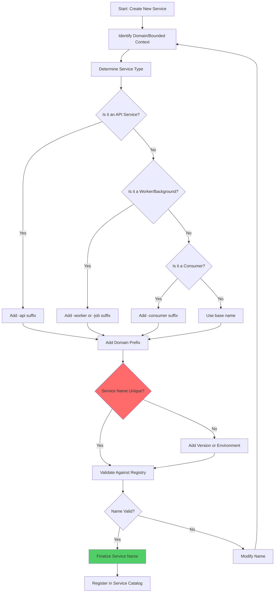

# Service Naming Convention

## Overview

Service naming conventions are fundamental governance patterns that establish consistent, meaningful, and discoverable names for microservices within an organization. A well-designed naming convention provides immediate context about a service's purpose, domain, and technical characteristics without requiring developers to dig into documentation or source code. This consistency becomes increasingly critical as organizations scale from dozens to hundreds of services.

The primary goals of service naming conventions include improving discoverability through intuitive name patterns, establishing clear ownership and domain boundaries, enabling automated tooling for deployment and monitoring, and preventing naming conflicts across teams. Effective naming conventions balance descriptiveness with brevity, technical clarity with business alignment, and standardization with flexibility for special cases. Organizations that invest in robust naming conventions early benefit from reduced onboarding time for new developers, easier cross-team collaboration, and more maintainable infrastructure as the system grows.

### Key Naming Convention Components

**Domain Prefix Pattern**: The most common approach uses a domain or team prefix to group related services, such as `payment-`, `user-`, or `inventory-`. This creates natural namespaces that align with organizational boundaries and make it easy to identify the owning team.

**Environment Indicators**: Optional suffixes or prefixes indicate deployment environments (dev, staging, production) to prevent accidental deployments to wrong environments and clarify monitoring dashboards.

**Service Type Suffixes**: Indicating the type of service (api, worker, consumer, gateway) helps developers understand the service's role in the architecture at a glance.

## Flow Chart



## Standard Example (TypeScript)

```typescript
/**
 * Service Naming Convention Implementation
 * This module provides utilities for generating, validating, and managing
 * service names across a microservices platform
 */

interface ServiceNameComponents {
  domain: string;
  serviceType: string;
  environment?: string;
  version?: string;
  region?: string;
}

interface ServiceMetadata {
  name: string;
  fullQualifiedName: string;
  domain: string;
  serviceType: ServiceType;
  environment?: Environment;
  version?: string;
  owner: string;
  description: string;
  tags: string[];
}

enum ServiceType {
  API = 'api',
  WORKER = 'worker',
  CONSUMER = 'consumer',
  GATEWAY = 'gateway',
  SCHEDULER = 'scheduler',
  FUNCTION = 'function'
}

enum Environment {
  DEVELOPMENT = 'dev',
  STAGING = 'staging',
  PRODUCTION = 'prod'
}

class ServiceNamingConvention {
  private static readonly DOMAIN_PATTERN = /^[a-z][a-z0-9-]{2,30}$/;
  private static readonly SERVICE_TYPE_PATTERN = /^(api|worker|consumer|gateway|scheduler|function)$/;
  private static readonly ENVIRONMENT_PATTERN = /^(dev|staging|prod)$/;
  private readonly domainPrefix: string;
  private readonly defaultEnvironment: Environment;

  constructor(config: { domainPrefix: string; defaultEnvironment?: Environment }) {
    if (!ServiceNamingConvention.DOMAIN_PATTERN.test(config.domainPrefix)) {
      throw new Error(`Invalid domain prefix: ${config.domainPrefix}`);
    }
    this.domainPrefix = config.domainPrefix;
    this.defaultEnvironment = config.defaultEnvironment || Environment.DEVELOPMENT;
  }

  /**
   * Generate a service name based on components
   */
  generateName(components: ServiceNameComponents): string {
    const parts: string[] = [this.domainPrefix];

    if (components.serviceType) {
      parts.push(components.serviceType);
    }

    const serviceName = parts.join('-');

    if (!this.validateName(serviceName)) {
      throw new Error(`Generated name "${serviceName}" is invalid`);
    }

    return serviceName;
  }

  /**
   * Generate full qualified domain name for service discovery
   */
  generateFQDN(serviceName: string, environment: Environment, region?: string): string {
    const parts = [serviceName, environment];

    if (region) {
      parts.push(region);
    }

    return parts.join('.') + '.internal';
  }

  /**
   * Parse a service name into its component parts
   */
  parseName(serviceName: string): ServiceNameComponents | null {
    const parts = serviceName.split('-');

    if (parts.length < 2) {
      return null;
    }

    const domain = parts[0];
    const serviceType = parts[parts.length - 1];
    const middleParts = parts.slice(1, -1);

    return {
      domain,
      serviceType,
      environment: parts.includes('dev') || parts.includes('staging') || parts.includes('prod')
        ? parts.find(p => ['dev', 'staging', 'prod'].includes(p)) as Environment
        : undefined,
      version: middleParts.find(p => p.match(/^v\d+$/))?.replace('v', ''),
      region: parts.find(p => p.length === 2 && p.match(/^[a-z]{2}$/))
    };
  }

  /**
   * Validate a service name against naming conventions
   */
  validateName(name: string): boolean {
    const parts = name.split('-');

    if (parts.length < 2 || parts.length > 5) {
      return false;
    }

    if (!ServiceNamingConvention.DOMAIN_PATTERN.test(parts[0])) {
      return false;
    }

    const serviceType = parts[parts.length - 1];
    if (!Object.values(ServiceType).includes(serviceType as ServiceType)) {
      return false;
    }

    for (const part of parts.slice(1)) {
      if (!ServiceNamingConvention.DOMAIN_PATTERN.test(part)) {
        return false;
      }
    }

    return true;
  }

  /**
   * Generate Kubernetes resource names following naming conventions
   */
  generateK8sNames(serviceName: string): {
    deployment: string;
    service: string;
    configmap: string;
    secret: string;
    horizontalPodAutoscaler: string;
  } {
    const sanitized = serviceName.replace(/\./g, '-').toLowerCase();

    return {
      deployment: `${sanitized}-deployment`,
      service: `${sanitized}-service`,
      configmap: `${sanitized}-config`,
      secret: `${sanitized}-secret`,
      horizontalPodAutoscaler: `${sanitized}-hpa`
    };
  }

  /**
   * Generate Prometheus metric labels following conventions
   */
  generateMetricsLabels(serviceMetadata: ServiceMetadata): Record<string, string> {
    return {
      service_name: serviceMetadata.name,
      service_domain: serviceMetadata.domain,
      service_type: serviceMetadata.serviceType,
      environment: serviceMetadata.environment || 'unknown',
      owner: serviceMetadata.owner
    };
  }
}

/**
 * Service Registry Integration with Naming Convention
 */
class ServiceRegistry {
  private services: Map<string, ServiceMetadata> = new Map();
  private namingConvention: ServiceNamingConvention;

  constructor(namingConvention: ServiceNamingConvention) {
    this.namingConvention = namingConvention;
  }

  /**
   * Register a new service with automatic name validation
   */
  registerService(metadata: Omit<ServiceMetadata, 'name'>): ServiceMetadata {
    const fullName = this.namingConvention.generateName({
      domain: metadata.domain,
      serviceType: metadata.serviceType,
      environment: metadata.environment,
      version: metadata.version
    });

    if (this.services.has(fullName)) {
      throw new Error(`Service "${fullName}" is already registered`);
    }

    const serviceMetadata: ServiceMetadata = {
      ...metadata,
      name: fullName,
      fullQualifiedName: this.namingConvention.generateFQDN(
        fullName,
        metadata.environment || Environment.DEVELOPMENT
      )
    };

    this.services.set(fullName, serviceMetadata);
    return serviceMetadata;
  }

  /**
   * Lookup service by partial name with fuzzy matching
   */
  lookupService(query: string): ServiceMetadata[] {
    const results: ServiceMetadata[] = [];

    for (const [name, metadata] of this.services) {
      if (name.includes(query) || metadata.description.toLowerCase().includes(query.toLowerCase())) {
        results.push(metadata);
      }
    }

    return results.sort((a, b) => a.name.localeCompare(b.name));
  }

  /**
   * Get all services by domain
   */
  getServicesByDomain(domain: string): ServiceMetadata[] {
    return Array.from(this.services.values())
      .filter(m => m.domain === domain);
  }

  /**
   * Get all services by type
   */
  getServicesByType(type: ServiceType): ServiceMetadata[] {
    return Array.from(this.services.values())
      .filter(m => m.serviceType === type);
  }
}

// Example usage demonstrating the naming convention
const naming = new ServiceNamingConvention({
  domainPrefix: 'payment',
  defaultEnvironment: Environment.DEVELOPMENT
});

const registry = new ServiceRegistry(naming);

try {
  const paymentApi = registry.registerService({
    domain: 'payment',
    serviceType: ServiceType.API,
    environment: Environment.PRODUCTION,
    owner: 'payments-team',
    description: 'Handles all payment processing operations',
    tags: ['payments', 'critical', 'PCI-DSS']
  });

  console.log('Service Registered:', paymentApi);

  const k8sNames = naming.generateK8sNames(paymentApi.name);
  console.log('K8s Names:', k8sNames);

  const metricsLabels = naming.generateMetricsLabels(paymentApi);
  console.log('Metrics Labels:', metricsLabels);
} catch (error) {
  console.error('Registration failed:', error);
}
```

## Real-World Examples

### Amazon AWS Service Naming

Amazon AWS employs a systematic naming convention across their vast array of services:

- **Service Family Pattern**: Services are grouped by functionality (EC2, S3, Lambda, DynamoDB)
- **Abbreviated Prefixes**: Internal services use shortened prefixes (ecs-, eks-, rds-)
- **Regional Suffixes**: Service endpoints include region identifiers (us-east-1, eu-west-1)
- **Version Indicators**: API versions are embedded in paths (/v1/, /v2/)

Example: `arn:aws:ec2:us-east-1:123456789012:instance/i-1234567890abcdef0`

### Netflix Naming Conventions

Netflix's microservices follow domain-driven prefixes that align with their organizational structure:

- **Zuul Gateway Services**: Named with `zuul-` prefix (zuul-origin, zuul-edge)
- **Eureka Service Names**: Use domain prefixes (movie-api, recommendation-service)
- **Internal Abbreviations**: Common abbreviations for service types (-svc, -server, -client)
- **Environment Tags**: Environment indicators in service discovery metadata

### Uber Service Naming

Uber's platform uses geographic and functional prefixes for their microservices:

- **Geo-Prefixed Names**: Services prefixed with region codes (surge-pricing, dispatch-us)
- **Functional Grouping**: Services grouped by business function (trips, payments, maps)
- **Team-Aligned Ownership**: Service names indicate owning team for accountability
- **Versioned APIs**: Clear API versioning in service names (user-v2, billing-v3)

## Output Statement

Service naming conventions provide the foundation for a scalable microservices platform by:

- **Improved Discoverability**: Clear, consistent names make it easy to find and understand services
- **Clear Ownership**: Naming patterns reveal domain boundaries and team responsibilities
- **Automation Enablement**: Standardized names enable tooling for deployment, monitoring, and security
- **Reduced Cognitive Load**: Developers spend less time deciphering service purposes
- **Self-Documenting Architecture**: Names convey meaning without additional documentation

## Best Practices

1. **Establish Clear Domain Prefixes**: Start service names with the bounded context or team name. Use `payment-`, `user-`, `inventory-` to group related services under clear ownership.

   ```typescript
   // Good: Clear domain identification
   const serviceName = 'payment-api';
   
   // Bad: Ambiguous naming
   const badName = 'svc-001';
   ```

2. **Use Standard Service Type Suffixes**: Append appropriate suffixes indicating service type for immediate context about the service's role in the architecture.

   ```typescript
   const serviceTypes = {
     API: 'api',           // payment-api, user-api
     WORKER: 'worker',     // email-worker, data-processor
     CONSUMER: 'consumer',  // order-consumer, event-consumer
     GATEWAY: 'gateway',   // mobile-gateway, web-gateway
     SCHEDULER: 'scheduler': // report-scheduler, cleanup-scheduler
   };
   ```

3. **Include Environment Indicators**: Add environment suffixes or prefixes to prevent deployment mistakes and improve monitoring clarity.

   ```typescript
   const environmentSuffix = {
     development: '-dev',
     staging: '-staging',
     production: ''  // No suffix for production
   };
   
   const fullName = `payment-api${environmentSuffix[Environment.DEVELOPMENT]}`;
   ```

4. **Enforce Name Validation**: Implement automated validation in CI/CD pipelines to reject non-compliant service names before they reach production.

   ```typescript
   function validateServiceName(name: string): boolean {
     const pattern = /^[a-z][a-z0-9-]{2,50}\.(api|worker|consumer|gateway)$/;
     return pattern.test(name);
   }
   
   // Add to CI pipeline
   if (!validateServiceName(serviceName)) {
     throw new Error(`Invalid service name: ${serviceName}`);
   }
   ```

5. **Limit Name Length**: Keep service names under 50 characters to avoid issues with DNS limits, Kubernetes resource names, and display issues in dashboards.

   ```typescript
   const MAX_NAME_LENGTH = 50;
   
   if (serviceName.length > MAX_NAME_LENGTH) {
     throw new Error('Service name exceeds maximum length of 50 characters');
   }
   ```

6. **Use Only Lowercase Characters**: Standardize on lowercase to prevent case-sensitivity issues across different systems and operating systems.

   ```typescript
   const normalizeServiceName = (name: string): string => {
     return name.toLowerCase().replace(/[^a-z0-9-]/g, '-');
   };
   ```

7. **Avoid Special Characters**: Restrict names to alphanumeric characters and hyphens only to ensure compatibility with DNS, Kubernetes, and other infrastructure tools.

   ```typescript
   const ALLOWED_CHARS = /^[a-z0-9-]+$/;
   
   if (!ALLOWED_CHARS.test(serviceName)) {
     throw new Error('Service name contains invalid characters');
   }
   ```

8. **Document Naming Decisions**: Maintain a living document of naming conventions with examples, anti-patterns, and exception handling procedures for edge cases.

   ```typescript
   interface NamingConventionDoc {
     version: string;
     lastUpdated: Date;
     patterns: NamingPattern[];
     exceptions: ExceptionCase[];
     examples: GoodAndBadExamples[];
   }
   ```

9. **Version APIs in the Path, Not the Name**: Include version numbers in API endpoints (/v1/users) rather than service names to allow smoother migrations.

   ```typescript
   const serviceVersion = 'v2';
   const endpoint = `/api/${serviceVersion}/users`;
   // Service name remains: user-api
   ```

10. **Review and Iterate**: Schedule quarterly reviews of naming conventions to address new service types, organizational changes, and lessons learned from scaling.

    ```typescript
    class NamingConventionReview {
      async review(): Promise<ReviewResult> {
        const currentConventions = await this.loadCurrentConventions();
        const services = await this.getAllServices();
        const violations = await this.findViolations(services, currentConventions);
        
        return {
          violations,
          recommendations: this.generateRecommendations(violations),
          nextReviewDate: this.calculateNextReviewDate()
        };
      }
    }
    ```