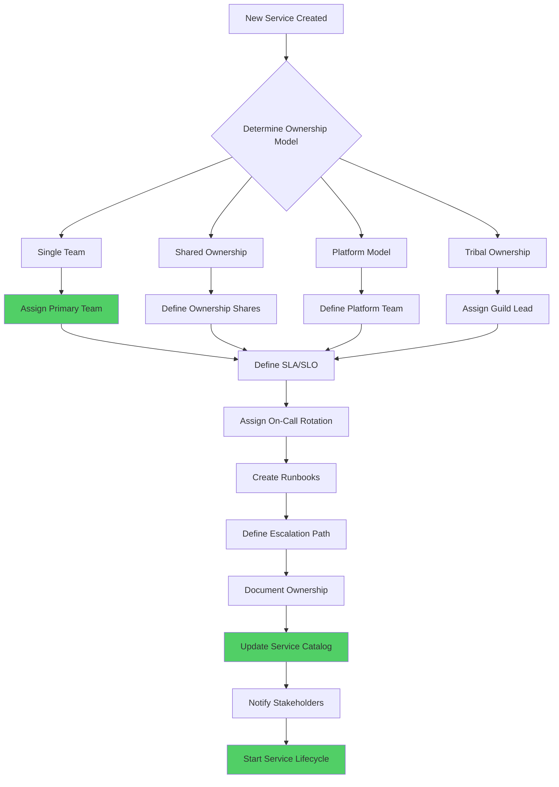

# Service Ownership

## Overview

Service ownership defines the organizational responsibility structure for microservices, establishing which team or individual is accountable for the development, operation, maintenance, and evolution of each service. This governance pattern is essential for scaling microservices architectures, as it provides clear lines of accountability, reduces confusion about who to contact for issues or feature requests, and enables efficient incident response and on-call management.

The concept of ownership extends beyond code responsibility to encompass the entire lifecycle of a service. This includes defining SLAs and SLOs, maintaining documentation and runbooks, ensuring security and compliance, managing dependencies, and planning deprecation when the service reaches end-of-life. Effective ownership models prevent the "tragedy of the commons" where no team feels responsible for shared services, leading to neglect and technical debt accumulation.

### Ownership Models

There are several established models for service ownership, each with trade-offs:

**Single Team Ownership**: One team owns a service end-to-end, from development to operations. This provides clear accountability but can create bottlenecks if the team is small or the service is critical.

**Shared Ownership**: Multiple teams share responsibility for a service, typically organized around shared infrastructure or cross-cutting concerns. This provides redundancy but can lead to coordination overhead.

**Platform Ownership**: A platform team provides shared services that other teams consume, with the platform team responsible for infrastructure and the consuming teams responsible for configuration and usage.

**Tribal/Guild Ownership**: Informal communities of practice guide technical decisions while formal teams handle execution, creating a matrix of accountability.

## Flow Chart



## Standard Example (TypeScript)

```typescript
/**
 * Service Ownership Management System
 * Implements ownership tracking, escalation, and accountability
 */

interface Team {
  id: string;
  name: string;
  email: string;
  slackChannel: string;
  onCallRotation: OnCallRotation;
  escalationContacts: Contact[];
}

interface Contact {
  name: string;
  role: string;
  email: string;
  phone?: string;
  slackId?: string;
}

interface OnCallRotation {
  primary: string;
  secondary: string;
  scheduleUrl: string;
  handoffTime: string;
}

interface ServiceOwnership {
  serviceId: string;
  serviceName: string;
  primaryTeam: Team;
  secondaryTeams?: Team[];
  ownershipModel: OwnershipModel;
  ownershipPercentage?: number;
  slas: ServiceLevelAgreement[];
  onCallRotation: OnCallRotation;
  runbooks: Runbook[];
  escalationPath: EscalationPath;
  metadata: OwnershipMetadata;
}

enum OwnershipModel {
  SINGLE_TEAM = 'single_team',
  SHARED = 'shared',
  PLATFORM = 'platform',
  TRIBAL = 'tribal'
}

interface ServiceLevelAgreement {
  name: string;
  target: number;
  window: string;
  description: string;
}

interface Runbook {
  id: string;
  title: string;
  url: string;
  lastUpdated: Date;
  owner: string;
}

interface EscalationPath {
  level1: string;  // On-call engineer
  level2: string;  // Team lead
  level3: string;  // Engineering manager
  level4: string;  // Platform/DevOps lead
  level5: string;  // VP Engineering
}

interface OwnershipMetadata {
  createdAt: Date;
  lastReviewed: Date;
  nextReviewDate: Date;
  documentUrl: string;
  codeRepoUrl: string;
}

class ServiceOwnershipManager {
  private ownershipRecords: Map<string, ServiceOwnership> = new Map();
  private teams: Map<string, Team> = new Map();

  /**
   * Register a new team in the ownership system
   */
  registerTeam(team: Team): void {
    this.teams.set(team.id, team);
    console.log(`Team "${team.name}" registered successfully`);
  }

  /**
   * Establish ownership for a service
   */
  establishOwnership(
    serviceId: string,
    serviceName: string,
    primaryTeamId: string,
    model: OwnershipModel,
    secondaryTeamIds?: string[]
  ): ServiceOwnership {
    const primaryTeam = this.teams.get(primaryTeamId);
    if (!primaryTeam) {
      throw new Error(`Primary team "${primaryTeamId}" not found`);
    }

    const secondaryTeams = secondaryTeamIds
      ?.map(id => this.teams.get(id))
      .filter((team): team is Team => team !== undefined);

    const ownership: ServiceOwnership = {
      serviceId,
      serviceName,
      primaryTeam,
      secondaryTeams,
      ownershipModel: model,
      slas: [],
      onCallRotation: primaryTeam.onCallRotation,
      runbooks: [],
      escalationPath: this.generateDefaultEscalationPath(primaryTeam),
      metadata: {
        createdAt: new Date(),
        lastReviewed: new Date(),
        nextReviewDate: new Date(Date.now() + 90 * 24 * 60 * 60 * 1000),
        documentUrl: '',
        codeRepoUrl: ''
      }
    };

    this.ownershipRecords.set(serviceId, ownership);
    console.log(`Ownership established for service "${serviceName}" by team "${primaryTeam.name}"`);
    return ownership;
  }

  /**
   * Define SLA for a service
   */
  defineSLA(
    serviceId: string,
    sla: ServiceLevelAgreement
  ): void {
    const ownership = this.ownershipRecords.get(serviceId);
    if (!ownership) {
      throw new Error(`Service "${serviceId}" not found`);
    }

    ownership.slas.push(sla);
    console.log(`SLA "${sla.name}" added for service "${ownership.serviceName}"`);
  }

  /**
   * Add runbook to service ownership
   */
  addRunbook(
    serviceId: string,
    runbook: Runbook
  ): void {
    const ownership = this.ownershipRecords.get(serviceId);
    if (!ownership) {
      throw new Error(`Service "${serviceId}" not found`);
    }

    ownership.runbooks.push(runbook);
    console.log(`Runbook "${runbook.title}" added to service "${ownership.serviceName}"`);
  }

  /**
   * Get ownership for a service
   */
  getOwnership(serviceId: string): ServiceOwnership | undefined {
    return this.ownershipRecords.get(serviceId);
  }

  /**
   * Get all services owned by a team
   */
  getServicesByTeam(teamId: string): ServiceOwnership[] {
    return Array.from(this.ownershipRecords.values())
      .filter(o => o.primaryTeam.id === teamId ||
        o.secondaryTeams?.some(t => t.id === teamId));
  }

  /**
   * Generate default escalation path based on team structure
   */
  private generateDefaultEscalationPath(team: Team): EscalationPath {
    return {
      level1: team.onCallRotation.primary,
      level2: team.escalationContacts[0]?.name || 'Team Lead',
      level3: team.escalationContacts[1]?.name || 'Engineering Manager',
      level4: 'Platform Lead',
      level5: 'VP Engineering'
    };
  }

  /**
   * Review and update ownership periodically
   */
  async reviewOwnership(serviceId: string): Promise<ReviewResult> {
    const ownership = this.ownershipRecords.get(serviceId);
    if (!ownership) {
      throw new Error(`Service "${serviceId}" not found`);
    }

    const now = new Date();
    const daysUntilReview = Math.ceil(
      (ownership.metadata.nextReviewDate.getTime() - now.getTime()) / (1000 * 60 * 60 * 24)
    );

    const isOverdue = daysUntilReview <= 0;

    return {
      serviceId,
      serviceName: ownership.serviceName,
      isOverdue,
      daysUntilReview,
      ownershipModel: ownership.ownershipModel,
      currentTeam: ownership.primaryTeam.name,
      recommendations: this.generateReviewRecommendations(ownership)
    };
  }

  private generateReviewRecommendations(ownership: ServiceOwnership): string[] {
    const recommendations: string[] = [];

    if (ownership.slas.length === 0) {
      recommendations.push('Define SLAs for this service');
    }

    if (ownership.runbooks.length === 0) {
      recommendations.push('Add runbooks for common operational tasks');
    }

    if (ownership.metadata.nextReviewDate < new Date()) {
      recommendations.push('Schedule ownership review with stakeholders');
    }

    return recommendations;
  }

  /**
   * Transfer ownership to a different team
   */
  async transferOwnership(
    serviceId: string,
    newTeamId: string,
    transferPlan: TransferPlan
  ): Promise<void> {
    const ownership = this.ownershipRecords.get(serviceId);
    if (!ownership) {
      throw new Error(`Service "${serviceId}" not found`);
    }

    const newTeam = this.teams.get(newTeamId);
    if (!newTeam) {
      throw new Error(`Team "${newTeamId}" not found`);
    }

    console.log(`Initiating ownership transfer for "${ownership.serviceName}" from "${ownership.primaryTeam.name}" to "${newTeam.name}"`);

    await this.performTransferChecklist(transferPlan);

    ownership.primaryTeam = newTeam;
    ownership.metadata.lastReviewed = new Date();
    ownership.metadata.nextReviewDate = new Date(Date.now() + 90 * 24 * 60 * 60 * 1000);

    console.log(`Ownership transfer completed for "${ownership.serviceName}"`);
  }

  private async performTransferChecklist(plan: TransferPlan): Promise<void> {
    console.log('Performing transfer checklist:');
    console.log(`  - Documentation review: ${plan.documentationReviewed ? 'Complete' : 'Pending'}`);
    console.log(`  - Runbook transfer: ${plan.runbooksTransferred ? 'Complete' : 'Pending'}`);
    console.log(`  - On-call handoff: ${plan.onCallHandoffComplete ? 'Complete' : 'Pending'}`);
    console.log(`  - Knowledge transfer sessions: ${plan.knowledgeTransferComplete ? 'Complete' : 'Pending'}`);
    console.log(`  - Stakeholder notification: ${plan.stakeholdersNotified ? 'Complete' : 'Pending'}`);
  }
}

interface ReviewResult {
  serviceId: string;
  serviceName: string;
  isOverdue: boolean;
  daysUntilReview: number;
  ownershipModel: OwnershipModel;
  currentTeam: string;
  recommendations: string[];
}

interface TransferPlan {
  documentationReviewed: boolean;
  runbooksTransferred: boolean;
  onCallHandoffComplete: boolean;
  knowledgeTransferComplete: boolean;
  stakeholdersNotified: boolean;
  transitionCompleteDate: Date;
}

// Example usage
const ownershipManager = new ServiceOwnershipManager();

const paymentsTeam: Team = {
  id: 'payments-team',
  name: 'Payments Team',
  email: 'payments-team@company.com',
  slackChannel: '#payments-team',
  onCallRotation: {
    primary: 'john-oncall',
    secondary: 'jane-backup',
    scheduleUrl: 'https://opsgenie.com/schedules/payments',
    handoffTime: '09:00 UTC'
  },
  escalationContacts: [
    { name: 'Alice Smith', role: 'Team Lead', email: 'alice@company.com', slackId: '@alice' },
    { name: 'Bob Johnson', role: 'Engineering Manager', email: 'bob@company.com' }
  ]
};

const inventoryTeam: Team = {
  id: 'inventory-team',
  name: 'Inventory Team',
  email: 'inventory-team@company.com',
  slackChannel: '#inventory-team',
  onCallRotation: {
    primary: 'inventory-oncall',
    secondary: 'inventory-backup',
    scheduleUrl: 'https://opsgenie.com/schedules/inventory',
    handoffTime: '09:00 UTC'
  },
  escalationContacts: [
    { name: 'Carol Williams', role: 'Team Lead', email: 'carol@company.com' }
  ]
};

ownershipManager.registerTeam(paymentsTeam);
ownershipManager.registerTeam(inventoryTeam);

const ownership = ownershipManager.establishOwnership(
  'payment-service-001',
  'payment-api',
  'payments-team',
  OwnershipModel.SINGLE_TEAM
);

ownershipManager.defineSLA(ownership.serviceId, {
  name: 'API Response Time',
  target: 200,
  window: '5m',
  description: '95th percentile response time must be under 200ms'
});

ownershipManager.addRunbook(ownership.serviceId, {
  id: 'rb-001',
  title: 'Payment Processing Failures',
  url: 'https://runbooks.company.com/payment-failures',
  lastUpdated: new Date(),
  owner: 'payments-team'
});

console.log('\nOwnership Record:', JSON.stringify(ownership, null, 2));

const services = ownershipManager.getServicesByTeam('payments-team');
console.log('\nServices owned by Payments Team:', services.map(s => s.serviceName));
```

## Real-World Examples

### Google SRE Ownership Model

Google implements a rigorous ownership model as part of their Site Reliability Engineering practices:

- **Owners File**: Every service has an `OWNERS` file in the repository defining reviewers and approvers
- **Workload Ownership**: Services declare their SLOs, error budgets, and error budget policies
- **On-Call Ownership**: Clear on-call rotations with escalation paths defined in rotation tools
- **Borg Configuration**: Services declare ownership in their Borg configuration for resource management

### Netflix Ownership Framework

Netflix combines multiple ownership patterns:

- **Platform Teams**: Core infrastructure (compute, storage, networking) owned by platform teams
- **Product Teams**: Business logic services owned by product-aligned teams
- **Shared Services**: Cross-cutting concerns (auth, payments) owned by dedicated shared service teams
- **TAC (Technical Action Committee)**: Cross-team coordination for architectural decisions

### Spotify Guild Model

Spotify uses a hybrid model combining team and guild ownership:

- **Squads**: Autonomous cross-functional teams responsible for specific features
- **Tribes**: Collections of squads working on related domains
- **Guilds**: Cross-cutting communities of practice for technical areas
- **Chapter Leaders**: Technical leads within squads who also participate in guilds

## Output Statement

Service ownership patterns provide essential governance for microservices by:

- **Clear Accountability**: Establishing who is responsible for service reliability, features, and decisions
- **Efficient Incident Response**: Defining escalation paths and on-call ownership for faster MTTR
- **Sustainable Development**: Enabling team autonomy while maintaining organizational coordination
- **Knowledge Management**: Ensuring documentation, runbooks, and expertise are properly maintained
- **Scalable Operations**: Supporting organizational growth without ownership confusion

## Best Practices

1. **Define Clear Team Boundaries**: Establish bounded contexts aligned with business domains to avoid ownership overlaps and gaps.

   ```typescript
   interface TeamBoundary {
     domain: string;
     subdomains: string[];
     excludedServices: string[];
     collaborationPoints: CollaborationPoint[];
   }
   ```

2. **Document Ownership in Code**: Include ownership metadata in service configuration and code repositories for discoverability.

   ```yaml
   # service.yaml
   ownership:
     team: payments-team
     contact: payments-team@company.com
     slack: #payments-ops
     oncall: https://opsgenie.com/schedules/payments
     runbooks:
       - https://runbooks.company.com/payment-api
       - https://runbooks.company.com/refunds
   ```

3. **Implement Shared Ownership with Clear Roles**: When multiple teams share ownership, define specific responsibilities for each team.

   ```typescript
   interface SharedOwnership {
     primaryTeam: Team;
     secondaryTeams: {
       team: Team;
       responsibilities: string[];
       percentage: number;
     }[];
   }
   ```

4. **Establish SLA Ownership**: Each service should have defined SLAs owned by the responsible team.

   ```typescript
   interface SLAOwnership {
     serviceId: string;
     slas: {
       name: string;
       target: number;
       owner: string;
       errorBudgetPolicy: string;
     }[];
   }
   ```

5. **Create On-Call Rotation Standards**: Define how on-call rotates and who has primary/secondary responsibility.

   ```typescript
   const ONCALL_STANDARDS = {
     rotationPeriod: '7 days',
     handoffTime: '10:00 UTC',
     maxConsecutiveShifts: 3,
     requiredBacklogSize: 2,
     escalationTimeout: '15 minutes'
   };
   ```

6. **Maintain Runbook Repository**: Ensure all services have operational runbooks accessible to on-call engineers.

   ```typescript
   interface RunbookMetadata {
     serviceId: string;
     title: string;
     scenarios: {
       name: string;
       steps: string[];
       automatedResolution?: boolean;
     }[];
     lastReviewed: Date;
   }
   ```

7. **Define Escalation Paths Clearly**: Create multi-level escalation paths with clear triggers and expected response times.

   ```typescript
   const ESCALATION_PATH = {
     level1: { role: 'On-Call Engineer', responseTime: '15 minutes' },
     level2: { role: 'Team Lead', responseTime: '30 minutes' },
     level3: { role: 'Engineering Manager', responseTime: '1 hour' },
     level4: { role: 'VP Engineering', responseTime: '2 hours' }
   };
   ```

8. **Schedule Regular Ownership Reviews**: Quarterly reviews ensure ownership stays current as teams and services evolve.

   ```typescript
   class OwnershipReviewScheduler {
     scheduleReview(ownership: ServiceOwnership): Date {
       const reviewInterval = 90 * 24 * 60 * 60 * 1000; // 90 days
       return new Date(ownership.lastReviewed.getTime() + reviewInterval);
     }
   }
   ```

9. **Implement Ownership Transfer Process**: Have documented procedures for transferring ownership between teams.

   ```typescript
   interface TransferProcess {
     phases: {
       announcement: { duration: '1 week' };
       knowledgeTransfer: { sessions: 3 };
       parallelOncall: { duration: '1 week' };
       fullTransfer: { date: Date };
     };
   }
   ```

10. **Integrate Ownership with Service Catalog**: Make ownership data searchable and visible in the service catalog for all developers.

    ```typescript
    class OwnershipCatalogIntegration {
      syncToCatalog(ownership: ServiceOwnership): void {
        catalog.updateService(ownership.serviceId, {
          owner: ownership.primaryTeam.name,
          contact: ownership.primaryTeam.email,
          oncall: ownership.onCallRotation.scheduleUrl,
          escalation: ownership.escalationPath
        });
      }
    }
    ```