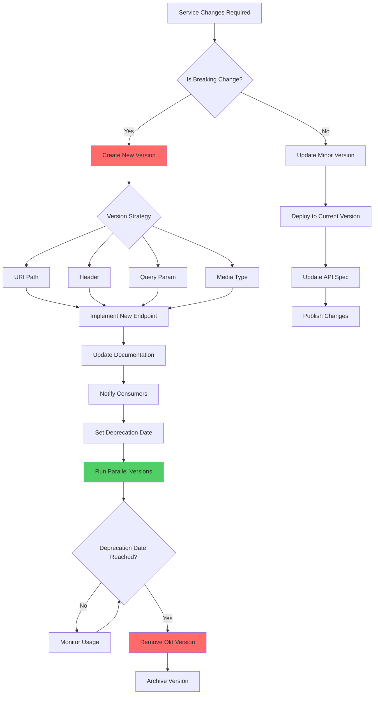

# Service Versioning

## Overview

Service versioning is a critical governance pattern that manages changes to service APIs and interfaces over time while maintaining backward compatibility for existing consumers. Proper versioning allows services to evolve without breaking dependent services, enables phased rollouts of new features, and provides clear contract definitions between service providers and consumers. Without effective versioning strategies, organizations face the "dependency hell" where changes become impossible due to unpredictable breaking changes across many consumers.

The versioning strategy should address multiple dimensions of service evolution: API endpoints, message formats, protocol changes, and behavioral changes. Each dimension may require different versioning approaches. The choice of versioning scheme significantly impacts developer experience, tooling requirements, and the ability to deprecate old versions gracefully. Organizations must balance the complexity of maintaining multiple versions against the flexibility needed to evolve services independently.

Effective service versioning also requires supporting infrastructure including version detection mechanisms, deprecation timelines and notifications, automated testing across versions, and documentation that clearly communicates version-specific behavior. The governance around versioning must be enforced through code review, API review processes, and tooling that validates version compliance.

### Versioning Strategies

**URI Path Versioning**: Including the version in the URL path (e.g., `/api/v1/users`). Simple to implement but mixes resource location with version identification.

**Header Versioning**: Using custom headers (e.g., `Accept-Version: v1`). Keeps URLs clean but requires additional client configuration.

**Query Parameter Versioning**: Specifying version as a query parameter (e.g., `/api/users?version=v1`). Flexible but can be less intuitive.

**Media Type Versioning**: Using Content-Type headers with custom media types. Most formally correct but requires sophisticated client support.

## Flow Chart



## Standard Example (TypeScript)

```typescript
/**
 * Service Versioning Management System
 * Implements semantic versioning, version negotiation, and deprecation management
 */

interface ApiVersion {
  version: string;
  major: number;
  minor: number;
  patch: number;
  status: VersionStatus;
  releaseDate: Date;
  deprecationDate?: Date;
  sunsetDate?: Date;
  supportedFeatures: Set<string>;
  breakingChanges: BreakingChange[];
}

enum VersionStatus {
  DEVELOPMENT = 'development',
  BETA = 'beta',
  STABLE = 'stable',
  DEPRECATED = 'deprecated',
  SUNSET = 'sunset',
  ARCHIVED = 'archived'
}

interface BreakingChange {
  description: string;
  affectedEndpoints: string[];
  migrationGuide: string;
  severity: 'high' | 'medium' | 'low';
}

interface VersionCompatibility {
  fromVersion: string;
  toVersion: string;
  compatibilityLevel: CompatibilityLevel;
  migrationRequired: boolean;
}

enum CompatibilityLevel {
  FULLY_COMPATIBLE = 'fully_compatible',
  BACKWARD_COMPATIBLE = 'backward_compatible',
  FORWARD_COMPATIBLE = 'forward_compatible',
  INCOMPATIBLE = 'incompatible'
}

interface VersionPolicy {
  maxActiveVersions: number;
  minSupportDuration: string;
  deprecationNoticePeriod: string;
  sunsetPeriod: string;
  allowedStatuses: VersionStatus[];
}

interface ConsumerInfo {
  consumerId: string;
  consumerName: string;
  versionsInUse: Set<string>;
  lastChecked: Date;
  contactEmail: string;
}

class SemanticVersion {
  private readonly version: string;
  private readonly major: number;
  private readonly minor: number;
  private readonly patch: number;

  constructor(versionString: string) {
    const parsed = SemanticVersion.parse(versionString);
    this.major = parsed.major;
    this.minor = parsed.minor;
    this.patch = parsed.patch;
    this.version = `${this.major}.${this.minor}.${this.patch}`;
  }

  private static parse(versionString: string): { major: number; minor: number; patch: number } {
    const match = versionString.match(/^v?(\d+)\.(\d+)\.(\d+)/);
    if (!match) {
      throw new Error(`Invalid version string: ${versionString}`);
    }
    return {
      major: parseInt(match[1], 10),
      minor: parseInt(match[2], 10),
      patch: parseInt(match[3], 10)
    };
  }

  getMajor(): number { return this.major; }
  getMinor(): number { return this.minor; }
  getPatch(): number { return this.patch; }
  toString(): string { return this.version; }

  compareTo(other: SemanticVersion): number {
    if (this.major !== other.major) return this.major - other.major;
    if (this.minor !== other.minor) return this.minor - other.minor;
    return this.patch - other.patch;
  }

  isBreakingChange(other: SemanticVersion): boolean {
    return this.major > other.major;
  }

  isNewFeature(other: SemanticVersion): boolean {
    return this.major === other.major && this.minor > other.minor;
  }

  isPatch(other: SemanticVersion): boolean {
    return this.major === other.major && this.minor === other.minor && this.patch > other.patch;
  }
}

class VersionManager {
  private versions: Map<string, ApiVersion> = new Map();
  private policy: VersionPolicy;
  private consumers: Map<string, ConsumerInfo> = new Map();

  constructor(policy: VersionPolicy) {
    this.policy = policy;
  }

  /**
   * Create a new version of the API
   */
  createVersion(
    major: number,
    minor: number,
    patch: number,
    status: VersionStatus,
    features: string[]
  ): ApiVersion {
    const versionString = `${major}.${minor}.${patch}`;
    const existingVersion = this.versions.get(versionString);

    if (existingVersion) {
      throw new Error(`Version ${versionString} already exists`);
    }

    const version: ApiVersion = {
      version: versionString,
      major,
      minor,
      patch,
      status,
      releaseDate: new Date(),
      supportedFeatures: new Set(features),
      breakingChanges: []
    };

    this.versions.set(versionString, version);
    console.log(`Created version ${versionString} with status ${status}`);
    return version;
  }

  /**
   * Upgrade minor version (backward compatible)
   */
  createMinorVersion(baseVersion: string, newFeatures: string[]): ApiVersion {
    const base = this.versions.get(baseVersion);
    if (!base) {
      throw new Error(`Base version ${baseVersion} not found`);
    }

    return this.createVersion(
      base.major,
      base.minor + 1,
      0,
      VersionStatus.STABLE,
      [...Array.from(base.supportedFeatures), ...newFeatures]
    );
  }

  /**
   * Create major version (breaking changes)
   */
  createMajorVersion(baseVersion: string, breakingChanges: BreakingChange[]): ApiVersion {
    const base = this.versions.get(baseVersion);
    if (!base) {
      throw new Error(`Base version ${baseVersion} not found`);
    }

    const newVersion = this.createVersion(
      base.major + 1,
      0,
      0,
      VersionStatus.BETA,
      []
    );

    newVersion.breakingChanges = breakingChanges;
    return newVersion;
  }

  /**
   * Deprecate a version with timeline
   */
  deprecateVersion(versionString: string, deprecationDate: Date, sunsetDate: Date): void {
    const version = this.versions.get(versionString);
    if (!version) {
      throw new Error(`Version ${versionString} not found`);
    }

    version.status = VersionStatus.DEPRECATED;
    version.deprecationDate = deprecationDate;
    version.sunsetDate = sunsetDate;

    console.log(`Version ${versionString} deprecated. Deprecation: ${deprecationDate}, Sunset: ${sunsetDate}`);
  }

  /**
   * Get version by URI path
   */
  getVersionFromPath(path: string): string | null {
    const match = path.match(/\/v(\d+)/);
    return match ? match[1] : null;
  }

  /**
   * Get version from header
   */
  getVersionFromHeader(headers: Record<string, string>): string | null {
    return headers['Accept-Version'] || headers['X-API-Version'] || null;
  }

  /**
   * Get version from query parameter
   */
  getVersionFromQuery(query: Record<string, string>): string | null {
    return query['version'] || query['api_version'] || null;
  }

  /**
   * Resolve version with fallback strategy
   */
  resolveVersion(
    requestedVersion: string | null,
    availableVersions: string[]
  ): ApiVersion | null {
    if (!requestedVersion) {
      return this.getLatestStableVersion();
    }

    const requested = this.versions.get(requestedVersion);
    if (requested && requested.status !== VersionStatus.ARCHIVED) {
      return requested;
    }

    return this.findCompatibleVersion(requestedVersion, availableVersions);
  }

  /**
   * Get the latest stable version
   */
  getLatestStableVersion(): ApiVersion | null {
    let latest: ApiVersion | null = null;

    for (const version of this.versions.values()) {
      if (version.status === VersionStatus.STABLE) {
        if (!latest || new SemanticVersion(version.version).compareTo(new SemanticVersion(latest.version)) > 0) {
          latest = version;
        }
      }
    }

    return latest;
  }

  /**
   * Find compatible version when requested version is unavailable
   */
  private findCompatibleVersion(requested: string, available: string[]): ApiVersion | null {
    const requestedSem = new SemanticVersion(requested);

    for (const versionString of available) {
      const version = this.versions.get(versionString);
      if (!version || version.status === VersionStatus.ARCHIVED) continue;

      const availableSem = new SemanticVersion(versionString);

      if (availableSem.getMajor() === requestedSem.getMajor() &&
          availableSem.getMinor() <= requestedSem.getMinor()) {
        return version;
      }
    }

    return this.getLatestStableVersion();
  }

  /**
   * Check version compatibility
   */
  checkCompatibility(fromVersion: string, toVersion: string): VersionCompatibility {
    const from = this.versions.get(fromVersion);
    const to = this.versions.get(toVersion);

    if (!from || !to) {
      throw new Error('One or both versions not found');
    }

    const fromSem = new SemanticVersion(fromVersion);
    const toSem = new SemanticVersion(toVersion);

    if (fromSem.getMajor() === toSem.getMajor()) {
      return {
        fromVersion,
        toVersion,
        compatibilityLevel: CompatibilityLevel.BACKWARD_COMPATIBLE,
        migrationRequired: to.breakingChanges.length > 0
      };
    }

    return {
      fromVersion,
      toVersion,
      compatibilityLevel: CompatibilityLevel.INCOMPATIBLE,
      migrationRequired: true
    };
  }

  /**
   * Register consumer version usage
   */
  registerConsumer(consumer: ConsumerInfo): void {
    this.consumers.set(consumer.consumerId, consumer);
  }

  /**
   * Get consumers still using deprecated versions
   */
  getConsumersOnDeprecatedVersions(): Map<string, ConsumerInfo[]> {
    const result = new Map<string, ConsumerInfo[]>();

    for (const [versionString, version] of this.versions) {
      if (version.status === VersionStatus.DEPRECATED || version.status === VersionStatus.SUNSET) {
        const consumers: ConsumerInfo[] = [];

        for (const consumer of this.consumers.values()) {
          if (consumer.versionsInUse.has(versionString)) {
            consumers.push(consumer);
          }
        }

        if (consumers.length > 0) {
          result.set(versionString, consumers);
        }
      }
    }

    return result;
  }

  /**
   * Generate version compatibility matrix
   */
  generateCompatibilityMatrix(): string[][] {
    const versions = Array.from(this.versions.keys())
      .filter(v => this.versions.get(v)?.status !== VersionStatus.ARCHIVED)
      .sort((a, b) => new SemanticVersion(a).compareTo(new SemanticVersion(b)));

    const matrix: string[][] = [];

    for (const from of versions) {
      const row: string[] = [];
      for (const to of versions) {
        const compat = this.checkCompatibility(from, to);
        row.push(compat.compatibilityLevel.charAt(0));
      }
      matrix.push(row);
    }

    return matrix;
  }
}

/**
 * API Gateway Version Routing
 */
class VersionRouter {
  private versionManager: VersionManager;
  private defaultVersion: string;

  constructor(versionManager: VersionManager, defaultVersion: string) {
    this.versionManager = versionManager;
    this.defaultVersion = defaultVersion;
  }

  /**
   * Route request to appropriate version handler
   */
  async route(request: ServiceRequest): Promise<ServiceResponse> {
    let versionString: string | null = null;

    versionString = this.versionManager.getVersionFromPath(request.path) ||
      this.versionManager.getVersionFromHeader(request.headers) ||
      this.versionManager.getVersionFromQuery(request.query) ||
      this.defaultVersion;

    const availableVersions = Array.from(this.versionManager['versions'].keys());
    const version = this.versionManager.resolveVersion(versionString, availableVersions);

    if (!version) {
      throw new Error('No compatible version available');
    }

    if (version.status === VersionStatus.DEPRECATED) {
      console.warn(`Warning: Using deprecated version ${versionString}`);
    }

    return this.forwardToVersion(request, version);
  }

  private async forwardToVersion(request: ServiceRequest, version: ApiVersion): Promise<ServiceResponse> {
    console.log(`Routing to version ${version.version}`);
    return { status: 200, body: { version: version.version } };
  }
}

interface ServiceRequest {
  path: string;
  headers: Record<string, string>;
  query: Record<string, string>;
  body: unknown;
}

interface ServiceResponse {
  status: number;
  body: unknown;
}

// Example usage
const policy: VersionPolicy = {
  maxActiveVersions: 3,
  minSupportDuration: '12 months',
  deprecationNoticePeriod: '6 months',
  sunsetPeriod: '3 months',
  allowedStatuses: [VersionStatus.DEVELOPMENT, VersionStatus.BETA, VersionStatus.STABLE, VersionStatus.DEPRECATED]
};

const versionManager = new VersionManager(policy);

versionManager.createVersion(1, 0, 0, VersionStatus.STABLE, ['user-crud', 'user-search']);
versionManager.createVersion(1, 1, 0, VersionStatus.STABLE, ['user-crud', 'user-search', 'user-analytics']);
versionManager.createVersion(2, 0, 0, VersionStatus.BETA, ['user-crud-v2', 'user-search-v2']);

versionManager.deprecateVersion(
  '1.0.0',
  new Date('2025-01-01'),
  new Date('2025-04-01')
);

versionManager.registerConsumer({
  consumerId: 'mobile-app',
  consumerName: 'Mobile App',
  versionsInUse: new Set(['1.0.0', '1.1.0']),
  lastChecked: new Date(),
  contactEmail: 'mobile-team@company.com'
});

const compatibility = versionManager.checkCompatibility('1.0.0', '1.1.0');
console.log('Compatibility:', compatibility);

const deprecatedConsumers = versionManager.getConsumersOnDeprecatedVersions();
console.log('Consumers on deprecated versions:', deprecatedConsumers);
```

## Real-World Examples

### Stripe API Versioning

Stripe implements a sophisticated versioning system:

- **Major Versions in URI**: API versions are specified as `/v1/`, `/v2019-02-11/`
- **Date-Based Versions**: Specific versions are dated (e.g., `v2019-02-11`)
- **Backward Compatibility**: Changes are backward compatible within major version
- **Long Support Windows**: Old versions remain available for extended periods
- **Upgrade Assistance**: Dashboard shows which API features are available in each version

### GitHub API Versioning

GitHub uses header-based versioning with clear deprecation policies:

- **Accept Header**: `Accept: application/vnd.github.v3+json`
- **Preview Versions**: Unstable APIs marked as "preview"
- **Deprecation Timelines**: 24-month support for stable API versions
- **Migration Guides**: Detailed guides for moving between versions

### Twilio API Versioning

Twilio combines URI and date-based versioning:

- **Version in Path**: `/2010-04-01/Accounts/{AccountSid}/Messages.json`
- **Stable Versions**: Each date represents a stable, supported version
- **Automatic Upgrades**: Optional automatic migration to newer versions
- **Detailed Changelogs**: Complete changelog for each version

## Output Statement

Service versioning enables safe evolution of microservices by:

- **Backward Compatibility**: Preserving existing consumer functionality while adding new features
- **Controlled Rollouts**: Enabling gradual migration to new versions with parallel support
- **Clear Contracts**: Providing explicit interface definitions for each version
- **Deprecation Management**: Supporting graceful sunsetting of old versions with clear timelines
- **Consumer Awareness**: Allowing consumers to choose when to adopt new versions

## Best Practices

1. **Use Semantic Versioning**: Follow MAJOR.MINOR.PATCH format to clearly communicate the nature of changes.

   ```typescript
   const applyVersioning = (current: string, changeType: 'major' | 'minor' | 'patch'): string => {
     const [major, minor, patch] = current.split('.').map(Number);
     switch (changeType) {
       case 'major': return `${major + 1}.0.0`;
       case 'minor': return `${major}.${minor + 1}.0`;
       case 'patch': return `${major}.${minor}.${patch + 1}`;
     }
   };
   ```

2. **Establish Clear Versioning Strategy**: Choose one primary strategy (URI, header, query, media type) and apply consistently.

   ```typescript
   const VERSIONING_STRATEGY = {
     type: 'uri_path',  // /api/v1/users
     defaultVersion: 'v1',
     headerName: 'X-API-Version',
     queryParam: 'version'
   };
   ```

3. **Support Multiple Active Versions**: Maintain at least two major versions during transitions to allow consumer migration.

   ```typescript
   const MULTI_VERSION_SUPPORT = {
     maxMajorVersions: 3,
     maxMinorVersionsPerMajor: 5,
     overlapPeriod: '6 months'
   };
   ```

4. **Communicate Deprecation Early**: Provide deprecation notices well in advance with clear migration paths.

   ```typescript
   interface DeprecationNotice {
     version: string;
     deprecationDate: Date;
     sunsetDate: Date;
     breakingChanges: string[];
     migrationGuide: string;
     alternativeVersions: string[];
   }
   ```

5. **Version Your Schema Too**: Apply versioning to data schemas and message formats, not just API endpoints.

   ```typescript
   interface VersionedSchema {
     schemaId: string;
     version: string;
     schema: object;
     compatibleVersions: string[];
   }
   ```

6. **Automate Version Detection**: Build tooling that automatically detects version from request context.

   ```typescript
   const detectVersion = (request: Request): string => {
     return request.path.match(/\/v(\d+)/)?.[1] ||
       request.headers['X-API-Version'] ||
       request.query.version ||
       'v1';
   };
   ```

7. **Test All Active Versions**: Maintain test suites that verify functionality across all supported versions.

   ```typescript
   const versionTestMatrix = versions.flatMap(v =>
     consumers.flatMap(c => ({
       providerVersion: v,
       consumerVersion: c,
       testSuite: 'integration'
     }))
   );
   ```

8. **Monitor Version Adoption**: Track which versions consumers are using to plan deprecation timing.

   ```typescript
   const VERSION_ADOPTION_THRESHOLD = {
     deprecation: 0.1,  // Deprecate when < 10% usage
     sunset: 0.02      // Sunset when < 2% usage
   };
   ```

9. **Document Version-Specific Features**: Clearly indicate which features are available in each version.

   ```typescript
   const VERSION_FEATURE_MATRIX = {
     'v1': ['users-read', 'users-write'],
     'v2': ['users-read', 'users-write', 'users-bulk', 'users-analytics'],
     'v3': ['users-read', 'users-write', 'users-bulk', 'users-analytics', 'users-realtime']
   };
   ```

10. **Enforce Version Compliance**: Add linting and validation in CI/CD to ensure version consistency.

    ```typescript
    const versionCompliance = {
      checkApiSpec: true,
      validateVersionInPath: true,
      rejectUnknownVersions: true,
      logDeprecatedUsage: true
    };
    ```