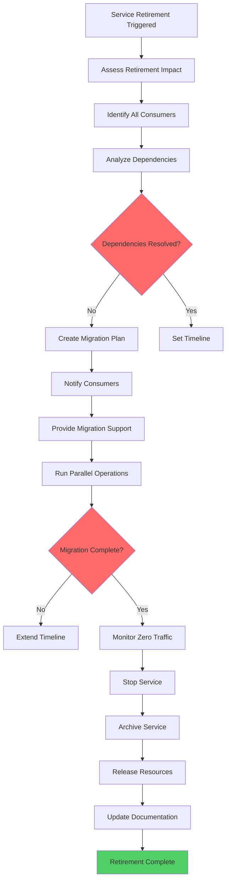

# Service Retirement

## Overview

Service retirement is the governance pattern that manages the lifecycle transition of a microservice from active operation to complete shutdown. This process is critical for maintaining a healthy microservices ecosystem as it removes technical debt, reduces operational overhead, and frees up infrastructure resources. However, retirement must be handled carefully to avoid disrupting dependent services and to preserve institutional knowledge about the service's history.

A well-designed retirement process involves multiple phases: planning and assessment, notification and migration, parallel operation, and final decommission. Each phase has specific activities, timelines, and success criteria. The process typically spans several months to give consumers adequate time to migrate and to ensure no unexpected dependencies exist. Organizations that neglect service retirement eventually accumulate "zombie" services that continue consuming resources but provide no value, creating security vulnerabilities and operational complexity.

The governance of service retirement also includes capturing lessons learned, archiving relevant documentation, and ensuring that institutional knowledge is preserved in some form. Many organizations fail to retire services properly because they lack clear processes, fear disrupting consumers, or simply forget about legacy services. Establishing clear ownership and accountability for retirement ensures that services don't outlive their usefulness.

### Retirement Triggers

Services may be marked for retirement for various reasons: replacement by a new service, consolidation of functionality, business pivot making the service obsolete, security vulnerabilities that cannot be patched, or performance issues that cannot be resolved. Regardless of the trigger, the retirement process follows similar patterns.

## Flow Chart



## Standard Example (TypeScript)

```typescript
/**
 * Service Retirement Management System
 * Implements the complete lifecycle of retiring a microservice
 */

interface RetirementPlan {
  serviceId: string;
  serviceName: string;
  retirementTrigger: RetirementTrigger;
  phases: RetirementPhase[];
  timeline: RetirementTimeline;
  dependencies: ServiceDependency[];
  consumers: ConsumerInfo[];
}

enum RetirementTrigger {
  REPLACEMENT = 'replacement',
  CONSOLIDATION = 'consolidation',
  OBSOLETE = 'obsolete',
  SECURITY = 'security',
  PERFORMANCE = 'performance',
  COST_OPTIMIZATION = 'cost_optimization'
}

interface RetirementPhase {
  name: PhaseName;
  startDate: Date;
  endDate: Date;
  activities: Activity[];
  criteria: SuccessCriteria;
  status: PhaseStatus;
}

enum PhaseName {
  PLANNING = 'planning',
  NOTIFICATION = 'notification',
  PARALLEL_OPERATION = 'parallel_operation',
  DEPRECATION = 'deprecation',
  DECOMMISSION = 'decommission',
  ARCHIVAL = 'archival'
}

enum PhaseStatus {
  PENDING = 'pending',
  IN_PROGRESS = 'in_progress',
  COMPLETED = 'completed',
  BLOCKED = 'blocked'
}

interface Activity {
  id: string;
  description: string;
  assignee: string;
  dueDate: Date;
  completed: boolean;
}

interface SuccessCriteria {
  conditions: string[];
  verificationMethod: string;
}

interface RetirementTimeline {
  totalDuration: string;
  phases: {
    name: string;
    duration: string;
  }[];
  milestones: Milestone[];
}

interface Milestone {
  name: string;
  date: Date;
  description: string;
}

interface ServiceDependency {
  serviceId: string;
  serviceName: string;
  dependencyType: DependencyType;
  criticality: 'critical' | 'high' | 'medium' | 'low';
  migrationPlan?: MigrationPlan;
}

enum DependencyType {
  UPSTREAM = 'upstream',
  DOWNSTREAM = 'downstream',
  DATA_STORE = 'data_store',
  INFRASTRUCTURE = 'infrastructure'
}

interface MigrationPlan {
  targetService: string;
  migrationStrategy: 'big-bang' | 'gradual' | 'parallel';
  steps: MigrationStep[];
  validationCriteria: string[];
}

interface MigrationStep {
  order: number;
  description: string;
  estimatedDuration: string;
}

interface ConsumerInfo {
  consumerId: string;
  consumerName: string;
  contactEmail: string;
  usagePattern: UsagePattern;
  migrationStatus: MigrationStatus;
}

interface UsagePattern {
  apiCalls: number;
  peakCalls: number;
  dataVolume: string;
  lastUsed: Date;
}

enum MigrationStatus {
  NOT_STARTED = 'not_started',
  IN_PROGRESS = 'in_progress',
  COMPLETED = 'completed',
  BLOCKED = 'blocked',
  IGNORED = 'ignored'
}

interface ArchivalData {
  serviceId: string;
  archiveDate: Date;
  storageLocation: string;
  retentionPeriod: string;
  documentationUrl: string;
  contactForAccess: string;
}

class ServiceRetirementManager {
  private retirementPlans: Map<string, RetirementPlan> = new Map();
  private defaultTimeline: RetirementTimeline;

  constructor() {
    this.defaultTimeline = this.createDefaultTimeline();
  }

  /**
   * Initiate the retirement process for a service
   */
  initiateRetirement(
    serviceId: string,
    serviceName: string,
    trigger: RetirementTrigger,
    dependencies: ServiceDependency[],
    consumers: ConsumerInfo[]
  ): RetirementPlan {
    if (this.retirementPlans.has(serviceId)) {
      throw new Error(`Retirement already in progress for service ${serviceName}`);
    }

    const plan: RetirementPlan = {
      serviceId,
      serviceName,
      retirementTrigger: trigger,
      phases: this.createPhases(),
      timeline: this.defaultTimeline,
      dependencies,
      consumers
    };

    this.retirementPlans.set(serviceId, plan);
    console.log(`Retirement initiated for service "${serviceName}" triggered by ${trigger}`);
    return plan;
  }

  /**
   * Create default retirement phases
   */
  private createPhases(): RetirementPhase[] {
    const now = new Date();
    const phases: RetirementPhase[] = [
      {
        name: PhaseName.PLANNING,
        startDate: now,
        endDate: new Date(now.getTime() + 14 * 24 * 60 * 60 * 1000),
        activities: [],
        criteria: { conditions: ['Migration plans created', 'Consumers notified'], verificationMethod: 'Review meeting' },
        status: PhaseStatus.IN_PROGRESS
      },
      {
        name: PhaseName.NOTIFICATION,
        startDate: new Date(now.getTime() + 14 * 24 * 60 * 60 * 1000),
        endDate: new Date(now.getTime() + 30 * 24 * 60 * 60 * 1000),
        activities: [],
        criteria: { conditions: ['All consumers notified', 'Migration support available'], verificationMethod: 'Email confirmation' },
        status: PhaseStatus.PENDING
      },
      {
        name: PhaseName.PARALLEL_OPERATION,
        startDate: new Date(now.getTime() + 30 * 24 * 60 * 60 * 1000),
        endDate: new Date(now.getTime() + 60 * 24 * 60 * 60 * 1000),
        activities: [],
        criteria: { conditions: ['New service operational', 'Traffic migrated gradually'], verificationMethod: 'Traffic analysis' },
        status: PhaseStatus.PENDING
      },
      {
        name: PhaseName.DEPRECATION,
        startDate: new Date(now.getTime() + 60 * 24 * 60 * 60 * 1000),
        endDate: new Date(now.getTime() + 90 * 24 * 60 * 60 * 1000),
        activities: [],
        criteria: { conditions: ['Traffic < 5% of peak', 'No critical consumers remaining'], verificationMethod: 'Monitoring dashboard' },
        status: PhaseStatus.PENDING
      },
      {
        name: PhaseName.DECOMMISSION,
        startDate: new Date(now.getTime() + 90 * 24 * 60 * 60 * 1000),
        endDate: new Date(now.getTime() + 100 * 24 * 60 * 60 * 1000),
        activities: [],
        criteria: { conditions: ['Service stopped', 'Dependencies removed'], verificationMethod: 'Infrastructure check' },
        status: PhaseStatus.PENDING
      },
      {
        name: PhaseName.ARCHIVAL,
        startDate: new Date(now.getTime() + 100 * 24 * 60 * 60 * 1000),
        endDate: new Date(now.getTime() + 120 * 24 * 60 * 60 * 1000),
        activities: [],
        criteria: { conditions: ['Data archived', 'Documentation preserved'], verificationMethod: 'Archival verification' },
        status: PhaseStatus.PENDING
      }
    ];

    return phases;
  }

  /**
   * Create default timeline
   */
  private createDefaultTimeline(): RetirementTimeline {
    return {
      totalDuration: '120 days',
      phases: [
        { name: 'Planning', duration: '14 days' },
        { name: 'Notification', duration: '16 days' },
        { name: 'Parallel Operation', duration: '30 days' },
        { name: 'Deprecation', duration: '30 days' },
        { name: 'Decommission', duration: '10 days' },
        { name: 'Archival', duration: '20 days' }
      ],
      milestones: [
        { name: 'Notification Sent', date: new Date(), description: 'All consumers notified of retirement' },
        { name: 'Migration Support Ends', date: new Date(), description: 'Active migration support concluded' },
        { name: 'Service Shutdown', date: new Date(), description: 'Service no longer accepts requests' },
        { name: 'Archive Complete', date: new Date(), description: 'All data and documentation archived' }
      ]
    };
  }

  /**
   * Add activity to a phase
   */
  addActivity(
    serviceId: string,
    phaseName: PhaseName,
    activity: Activity
  ): void {
    const plan = this.retirementPlans.get(serviceId);
    if (!plan) {
      throw new Error(`Retirement plan not found for service ${serviceId}`);
    }

    const phase = plan.phases.find(p => p.name === phaseName);
    if (!phase) {
      throw new Error(`Phase ${phaseName} not found`);
    }

    phase.activities.push(activity);
    console.log(`Activity added to ${phaseName}: ${activity.description}`);
  }

  /**
   * Update migration status for a consumer
   */
  updateConsumerMigrationStatus(
    serviceId: string,
    consumerId: string,
    status: MigrationStatus
  ): void {
    const plan = this.retirementPlans.get(serviceId);
    if (!plan) {
      throw new Error(`Retirement plan not found for service ${serviceId}`);
    }

    const consumer = plan.consumers.find(c => c.consumerId === consumerId);
    if (!consumer) {
      throw new Error(`Consumer ${consumerId} not found`);
    }

    consumer.migrationStatus = status;
    console.log(`Consumer "${consumer.consumerName}" migration status: ${status}`);
  }

  /**
   * Check if all consumers have migrated
   */
  checkMigrationComplete(serviceId: string): boolean {
    const plan = this.retirementPlans.get(serviceId);
    if (!plan) {
      throw new Error(`Retirement plan not found for service ${serviceId}`);
    }

    const activeConsumers = plan.consumers.filter(
      c => c.migrationStatus !== MigrationStatus.COMPLETED &&
           c.migrationStatus !== MigrationStatus.IGNORED
    );

    return activeConsumers.length === 0;
  }

  /**
   * Get current phase for a service
   */
  getCurrentPhase(serviceId: string): RetirementPhase | null {
    const plan = this.retirementPlans.get(serviceId);
    if (!plan) {
      return null;
    }

    const now = new Date();
    return plan.phases.find(p => p.startDate <= now && p.endDate >= now) || null;
  }

  /**
   * Verify phase completion criteria
   */
  verifyPhaseCompletion(serviceId: string, phaseName: PhaseName): boolean {
    const plan = this.retirementPlans.get(serviceId);
    if (!plan) {
      throw new Error(`Retirement plan not found for service ${serviceId}`);
    }

    const phase = plan.phases.find(p => p.name === phaseName);
    if (!phase) {
      throw new Error(`Phase ${phaseName} not found`);
    }

    const completedActivities = phase.activities.filter(a => a.completed).length;
    const totalActivities = phase.activities.length;

    console.log(`Phase ${phaseName}: ${completedActivities}/${totalActivities} activities completed`);
    
    return phase.criteria.conditions.every(condition => {
      console.log(`  Checking: ${condition}`);
      return true;
    });
  }

  /**
   * Complete decommission and archive service
   */
  completeDecommission(serviceId: string): ArchivalData {
    const plan = this.retirementPlans.get(serviceId);
    if (!plan) {
      throw new Error(`Retirement plan not found for service ${serviceId}`);
    }

    if (!this.checkMigrationComplete(serviceId)) {
      throw new Error('Cannot decommission - not all consumers have migrated');
    }

    const archivalData: ArchivalData = {
      serviceId,
      archiveDate: new Date(),
      storageLocation: `s3://archive/services/${serviceId}/`,
      retentionPeriod: '7 years',
      documentationUrl: `https://docs.company.com/archived/${serviceId}`,
      contactForAccess: 'platform-team@company.com'
    };

    plan.phases.forEach(phase => {
      phase.status = PhaseStatus.COMPLETED;
    });

    console.log(`Service "${plan.serviceName}" successfully decommissioned and archived`);
    return archivalData;
  }

  /**
   * Generate retirement report
   */
  generateRetirementReport(serviceId: string): RetirementReport {
    const plan = this.retirementPlans.get(serviceId);
    if (!plan) {
      throw new Error(`Retirement plan not found for service ${serviceId}`);
    }

    return {
      serviceId: plan.serviceId,
      serviceName: plan.serviceName,
      trigger: plan.retirementTrigger,
      totalDuration: plan.timeline.totalDuration,
      phasesCompleted: plan.phases.filter(p => p.status === PhaseStatus.COMPLETED).length,
      totalConsumers: plan.consumers.length,
      consumersMigrated: plan.consumers.filter(c => c.migrationStatus === MigrationStatus.COMPLETED).length,
      consumersRemaining: plan.consumers.filter(c => c.migrationStatus !== MigrationStatus.COMPLETED).length
    };
  }

  /**
   * Cancel retirement if circumstances change
   */
  cancelRetirement(serviceId: string, reason: string): void {
    const plan = this.retirementPlans.get(serviceId);
    if (!plan) {
      throw new Error(`Retirement plan not found for service ${serviceId}`);
    }

    console.log(`Retirement cancelled for "${plan.serviceName}". Reason: ${reason}`);
    this.retirementPlans.delete(serviceId);
  }
}

interface RetirementReport {
  serviceId: string;
  serviceName: string;
  trigger: RetirementTrigger;
  totalDuration: string;
  phasesCompleted: number;
  totalConsumers: number;
  consumersMigrated: number;
  consumersRemaining: number;
}

// Example usage
const retirementManager = new ServiceRetirementManager();

const consumers: ConsumerInfo[] = [
  {
    consumerId: 'web-app',
    consumerName: 'Web Application',
    contactEmail: 'web-team@company.com',
    usagePattern: { apiCalls: 10000, peakCalls: 500, dataVolume: '100MB', lastUsed: new Date() },
    migrationStatus: MigrationStatus.COMPLETED
  },
  {
    consumerId: 'mobile-app',
    consumerName: 'Mobile Application',
    contactEmail: 'mobile-team@company.com',
    usagePattern: { apiCalls: 5000, peakCalls: 200, dataVolume: '50MB', lastUsed: new Date() },
    migrationStatus: MigrationStatus.IN_PROGRESS
  },
  {
    consumerId: 'analytics',
    consumerName: 'Analytics Service',
    contactEmail: 'analytics@company.com',
    usagePattern: { apiCalls: 1000, peakCalls: 50, dataVolume: '200MB', lastUsed: new Date() },
    migrationStatus: MigrationStatus.NOT_STARTED
  }
];

const dependencies: ServiceDependency[] = [
  { serviceId: 'db-001', serviceName: 'User Database', dependencyType: DependencyType.DATA_STORE, criticality: 'high' },
  { serviceId: 'cache-001', serviceName: 'Redis Cache', dependencyType: DependencyType.INFRASTRUCTURE, criticality: 'medium' }
];

const retirementPlan = retirementManager.initiateRetirement(
  'legacy-payment-svc',
  'Legacy Payment Service',
  RetirementTrigger.REPLACEMENT,
  dependencies,
  consumers
);

retirementManager.addActivity(retirementPlan.serviceId, PhaseName.PLANNING, {
  id: 'act-001',
  description: 'Document API endpoints and data schemas',
  assignee: 'payment-team',
  dueDate: new Date(),
  completed: true
});

console.log('\nRetirement Plan:', JSON.stringify(retirementPlan, null, 2));

const currentPhase = retirementManager.getCurrentPhase(retirementPlan.serviceId);
console.log('\nCurrent Phase:', currentPhase?.name);
```

## Real-World Examples

### Netflix Retirement Practices

Netflix has established mature processes for retiring services:

- **Deprecation Dashboard**: Internal tooling shows all deprecated services and their remaining consumers
- **Traffic Shift Monitoring**: Gradual traffic migration with real-time monitoring
- **Fallback Preservation**: Keep deprecated services available as fallback during migration
- **Code Preservation**: Archive service code in cold storage for compliance requirements

### Google Service Lifecycle

Google implements strict service lifecycle management:

- **Service Registry**: All services registered with expected retirement dates
- **Automatic Alerts**: Notifications when services approach end-of-life
- **Resource Cleanup**: Automated cleanup of deprecated service resources
- **Compliance Archives**: Legal requirement archives maintained separately

### LinkedIn Service Cleanup

LinkedIn regularly performs service cleanup campaigns:

- **Quarterly Reviews**: Identify unused or redundant services
- **Owner Outreach**: Contact service owners about potential retirement
- **Staged Decommission**: Gradual shutdown with monitoring periods
- **Knowledge Transfer**: Capture operational knowledge before removal

## Output Statement

Service retirement governance ensures the healthy lifecycle of microservices by:

- **Reduced Technical Debt**: Removing obsolete services prevents accumulation of unmaintained code
- **Resource Optimization**: Freeing infrastructure resources for active services
- **Consumer Migration**: Providing structured paths for consumers to transition
- **Knowledge Preservation**: Maintaining documentation and lessons learned
- **Security Improvement**: Eliminating vulnerable legacy services

## Best Practices

1. **Start Planning Early**: Begin retirement planning at least 3-6 months before target shutdown date to give consumers ample migration time.

   ```typescript
   const RETIREMENT_TIMELINE = {
     minimumNoticePeriod: '90 days',
     parallelOperationPeriod: '30 days',
     deprecationPeriod: '30 days',
     totalMinimumDuration: '150 days'
   };
   ```

2. **Identify All Dependencies**: Thoroughly analyze upstream, downstream, data store, and infrastructure dependencies before setting a timeline.

   ```typescript
   const DEPENDENCY_ANALYSIS = {
     include: ['upstream', 'downstream', 'datastore', 'infrastructure', 'monitoring'],
     requireSignOff: ['critical', 'high'],
     blockingCriteria: 'no migration path'
   };
   ```

3. **Notify All Consumers Formal**: Use multiple channels (email, Slack, documentation) to notify consumers with clear migration instructions.

   ```typescript
   const NOTIFICATION_TEMPLATE = {
     subject: 'Service Retirement Notice: {serviceName}',
     sections: ['What is retiring', 'When', 'Migration options', 'Support contact', 'Timeline'],
     channels: ['email', 'slack', 'status page', 'service catalog']
   };
   ```

4. **Provide Migration Support**: Allocate team resources to help consumers migrate, including documentation, code samples, and direct assistance.

   ```typescript
   const MIGRATION_SUPPORT = {
     documentation: true,
     codeExamples: true,
     officeHours: '2 hours/week',
     directAssistance: 'limited to critical consumers'
   };
   ```

5. **Implement Gradual Traffic Shift**: Use canary deployments or traffic percentage shifts to validate migration before full cutover.

   ```typescript
   const TRAFFIC_SHIFT_STRATEGY = {
     stages: [
       { percentage: 10, duration: '1 day' },
       { percentage: 25, duration: '2 days' },
       { percentage: 50, duration: '3 days' },
       { percentage: 100, duration: '1 day' }
     ]
   };
   ```

6. **Monitor Post-Migration**: Continue monitoring for unexpected usage after migration appears complete.

   ```typescript
   const POST_MIGRATION_MONITORING = {
     duration: '30 days',
     alertThreshold: '> 1% of original traffic',
     actions: ['investigate source', 'contact consumer']
   };
   ```

7. **Archive Before Deletion**: Preserve documentation, configuration, and code before removing running services.

   ```typescript
   const ARCHIVAL_REQUIREMENTS = {
     preserve: ['code', 'config', 'docs', 'runbooks', 'migration guides'],
     storage: 'cold storage',
     retention: '7 years minimum',
     access: 'by request'
   };
   ```

8. **Clean Up Resources Completely**: Remove all associated infrastructure, including databases, caches, DNS entries, and monitoring configurations.

   ```typescript
   const RESOURCE_CLEANUP_CHECKLIST = {
     items: ['compute', 'storage', 'networking', 'monitoring', 'secrets', 'dns'],
     verificationRequired: true,
     signOffNeeded: true
   };
   ```

9. **Cancel Retirements When Needed**: Don't hesitate to pause or cancel retirement if significant issues arise.

   ```typescript
   const CANCELLATION_CRITERIA = {
     blockMigration: 'no viable alternative',
     securityRisk: 'unpatched vulnerabilities',
     businessNeed: 'critical feature not migrated'
   };
   ```

10. **Conduct Retrospective**: Document lessons learned from the retirement process to improve future retirements.

    ```typescript
    const RETIREMENT_RETROSPECTIVE = {
      participants: ['service owner', 'consumer representatives', 'platform team'],
      topics: ['timeline accuracy', 'migration challenges', 'tooling improvements'],
      output: 'documented in team wiki'
    };
    ```