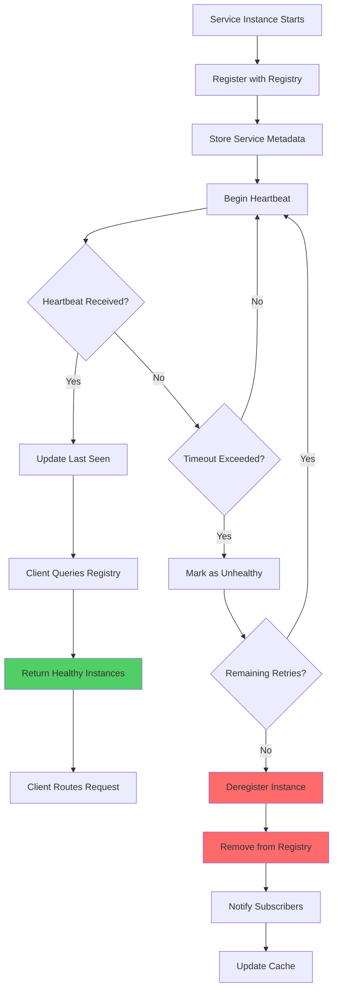

# Service Registry

## Overview

The Service Registry is a foundational governance pattern that provides a dynamic directory of all available services in a microservices architecture. It serves as the central source of truth for service discovery, enabling services to find and communicate with each other without hardcoding network addresses. The registry maintains information about service instances, their health status, available versions, and metadata needed for intelligent routing and负载均衡.

In dynamic cloud environments where services scale horizontally and instance IP addresses change frequently, a service registry becomes essential. Without it, services would need to maintain static configuration of all dependencies, making the system brittle and difficult to operate. The registry enables features like auto-scaling, rolling deployments, and failure recovery by automatically tracking which instances are available and healthy. It acts as the nervous system of the microservices ecosystem, enabling dynamic service interaction.

The registry pattern typically works in conjunction with client-side discovery (where clients query the registry directly) or server-side discovery (where a load balancer or gateway queries the registry). Regardless of the discovery pattern chosen, the registry must be highly available, support frequent updates as services come online and go offline, and provide efficient querying capabilities.

### Registry Operations

The service registry supports several key operations: registration (when a service instance starts), heartbeat (ongoing health signals), deregistration (when a service instance stops), and querying (when other services need to discover available instances). These operations must be implemented reliably to ensure the registry accurately reflects the current state of the system.

## Flow Chart



## Standard Example (TypeScript)

```typescript
/**
 * Service Registry Implementation
 * Provides dynamic service discovery with health monitoring
 */

interface ServiceInstance {
  instanceId: string;
  serviceName: string;
  host: string;
  port: number;
  healthUrl: string;
  metadata: Record<string, string>;
  version: string;
  status: InstanceStatus;
  registeredAt: Date;
  lastUpdated: Date;
  lastHeartbeat: Date;
  unhealthyCount: number;
}

enum InstanceStatus {
  HEALTHY = 'healthy',
  UNHEALTHY = 'unhealthy',
  STARTING = 'starting',
  STOPPING = 'stopping'
}

interface ServiceRegistration {
  serviceName: string;
  host: string;
  port: number;
  healthUrl?: string;
  metadata?: Record<string, string>;
  version?: string;
}

interface HealthCheck {
  serviceName: string;
  instanceId: string;
  status: InstanceStatus;
  responseTime?: number;
  error?: string;
}

interface ServiceQuery {
  serviceName: string;
  version?: string;
  metadata?: Record<string, string>;
  healthyOnly?: boolean;
}

interface RegistryConfig {
  heartbeatInterval: number;
  heartbeatTimeout: number;
  maxUnhealthyRetries: number;
  cleanupInterval: number;
  enableMetrics: boolean;
}

class ServiceRegistry {
  private instances: Map<string, ServiceInstance[]> = new Map();
  private subscribers: Map<string, Set<(event: RegistryEvent) => void>> = new Map();
  private config: RegistryConfig;
  private heartbeatTimers: Map<string, NodeJS.Timeout> = new Map();
  private metrics: RegistryMetrics;

  constructor(config: RegistryConfig) {
    this.config = config;
    this.metrics = {
      totalRegistrations: 0,
      totalDeregistrations: 0,
      totalHealthChecks: 0,
      healthyInstances: 0,
      unhealthyInstances: 0
    };

    this.startCleanupInterval();
  }

  /**
   * Register a new service instance
   */
  async register(registration: ServiceRegistration): Promise<ServiceInstance> {
    const instanceId = this.generateInstanceId(registration.serviceName);

    const instance: ServiceInstance = {
      instanceId,
      serviceName: registration.serviceName,
      host: registration.host,
      port: registration.port,
      healthUrl: registration.healthUrl || `http://${registration.host}:${registration.port}/health`,
      metadata: registration.metadata || {},
      version: registration.version || 'v1',
      status: InstanceStatus.STARTING,
      registeredAt: new Date(),
      lastUpdated: new Date(),
      lastHeartbeat: new Date(),
      unhealthyCount: 0
    };

    const key = registration.serviceName;
    if (!this.instances.has(key)) {
      this.instances.set(key, []);
    }

    const instances = this.instances.get(key)!;
    instances.push(instance);

    this.metrics.totalRegistrations++;
    this.emitEvent({
      type: 'REGISTERED',
      serviceName: registration.serviceName,
      instance
    });

    console.log(`Service registered: ${registration.serviceName}:${instanceId} at ${registration.host}:${registration.port}`);

    this.performHealthCheck(instance);

    return instance;
  }

  /**
   * Deregister a service instance
   */
  async deregister(serviceName: string, instanceId: string): Promise<void> {
    const instances = this.instances.get(serviceName);
    if (!instances) {
      throw new Error(`No instances found for service: ${serviceName}`);
    }

    const index = instances.findIndex(i => i.instanceId === instanceId);
    if (index === -1) {
      throw new Error(`Instance not found: ${instanceId}`);
    }

    const instance = instances[index];
    instance.status = InstanceStatus.STOPPING;
    
    instances.splice(index, 1);

    if (instances.length === 0) {
      this.instances.delete(serviceName);
    }

    this.stopHeartbeat(serviceName, instanceId);
    this.metrics.totalDeregistrations++;

    this.emitEvent({
      type: 'DEREGISTERED',
      serviceName,
      instance
    });

    console.log(`Service deregistered: ${serviceName}:${instanceId}`);
  }

  /**
   * Update heartbeat for an instance
   */
  async heartbeat(serviceName: string, instanceId: string): Promise<void> {
    const instances = this.instances.get(serviceName);
    if (!instances) {
      throw new Error(`Service not found: ${serviceName}`);
    }

    const instance = instances.find(i => i.instanceId === instanceId);
    if (!instance) {
      throw new Error(`Instance not found: ${instanceId}`);
    }

    instance.lastHeartbeat = new Date();
    instance.lastUpdated = new Date();

    if (instance.status === InstanceStatus.UNHEALTHY) {
      instance.status = InstanceStatus.HEALTHY;
      instance.unhealthyCount = 0;
      this.metrics.healthyInstances++;
      this.metrics.unhealthyInstances--;

      this.emitEvent({
        type: 'HEALTHY',
        serviceName,
        instance
      });
    }

    console.log(`Heartbeat received: ${serviceName}:${instanceId}`);
  }

  /**
   * Query for service instances
   */
  query(query: ServiceQuery): ServiceInstance[] {
    let instances = this.instances.get(query.serviceName);

    if (!instances) {
      return [];
    }

    instances = instances.filter(instance => {
      if (query.version && instance.version !== query.version) {
        return false;
      }

      if (query.healthyOnly && instance.status !== InstanceStatus.HEALTHY) {
        return false;
      }

      if (query.metadata) {
        for (const [key, value] of Object.entries(query.metadata)) {
          if (instance.metadata[key] !== value) {
            return false;
          }
        }
      }

      return true;
    });

    return instances;
  }

  /**
   * Get all registered services
   */
  getAllServices(): string[] {
    return Array.from(this.instances.keys());
  }

  /**
   * Get service instance by ID
   */
  getInstance(serviceName: string, instanceId: string): ServiceInstance | null {
    const instances = this.instances.get(serviceName);
    if (!instances) {
      return null;
    }

    return instances.find(i => i.instanceId === instanceId) || null;
  }

  /**
   * Subscribe to registry events
   */
  subscribe(serviceName: string, callback: (event: RegistryEvent) => void): void {
    if (!this.subscribers.has(serviceName)) {
      this.subscribers.set(serviceName, new Set());
    }

    this.subscribers.get(serviceName)!.add(callback);
  }

  /**
   * Unsubscribe from registry events
   */
  unsubscribe(serviceName: string, callback: (event: RegistryEvent) => void): void {
    const subs = this.subscribers.get(serviceName);
    if (subs) {
      subs.delete(callback);
    }
  }

  /**
   * Perform health check on an instance
   */
  private async performHealthCheck(instance: ServiceInstance): Promise<void> {
    try {
      const startTime = Date.now();
      const response = await fetch(instance.healthUrl, {
        method: 'GET',
        signal: AbortSignal.timeout(5000)
      });

      const responseTime = Date.now() - startTime;
      this.metrics.totalHealthChecks++;

      if (response.ok) {
        instance.status = InstanceStatus.HEALTHY;
        this.metrics.healthyInstances++;
        console.log(`Health check passed: ${instance.serviceName}:${instance.instanceId}`);
      } else {
        this.handleUnhealthyInstance(instance);
      }
    } catch (error) {
      this.handleUnhealthyInstance(instance);
    }
  }

  /**
   * Handle an unhealthy instance
   */
  private handleUnhealthyInstance(instance: ServiceInstance): void {
    instance.unhealthyCount++;
    console.log(`Health check failed: ${instance.serviceName}:${instance.instanceId} (attempt ${instance.unhealthyCount})`);

    if (instance.unhealthyCount >= this.config.maxUnhealthyRetries) {
      instance.status = InstanceStatus.UNHEALTHY;
      this.metrics.healthyInstances--;
      this.metrics.unhealthyInstances++;

      this.emitEvent({
        type: 'UNHEALTHY',
        serviceName: instance.serviceName,
        instance
      });
    }
  }

  /**
   * Start heartbeat monitoring for an instance
   */
  private startHeartbeat(serviceName: string, instance: ServiceInstance): void {
    const timer = setInterval(async () => {
      const now = Date.now();
      const lastHeartbeat = new Date(instance.lastHeartbeat).getTime();
      const timeout = this.config.heartbeatTimeout;

      if (now - lastHeartbeat > timeout) {
        console.log(`Heartbeat timeout: ${serviceName}:${instance.instanceId}`);
        await this.deregister(serviceName, instance.instanceId);
      }
    }, this.config.heartbeatInterval);

    this.heartbeatTimers.set(`${serviceName}:${instance.instanceId}`, timer);
  }

  /**
   * Stop heartbeat monitoring
   */
  private stopHeartbeat(serviceName: string, instanceId: string): void {
    const key = `${serviceName}:${instanceId}`;
    const timer = this.heartbeatTimers.get(key);
    if (timer) {
      clearInterval(timer);
      this.heartbeatTimers.delete(key);
    }
  }

  /**
   * Start periodic cleanup of stale instances
   */
  private startCleanupInterval(): void {
    setInterval(async () => {
      console.log('Running registry cleanup...');
      
      for (const [serviceName, instances] of this.instances) {
        const now = Date.now();
        
        for (const instance of instances) {
          const lastHeartbeat = new Date(instance.lastHeartbeat).getTime();
          const staleTimeout = this.config.heartbeatTimeout * 3;

          if (now - lastHeartbeat > staleTimeout) {
            console.log(`Removing stale instance: ${serviceName}:${instance.instanceId}`);
            await this.deregister(serviceName, instance.instanceId);
          }
        }
      }
    }, this.config.cleanupInterval);
  }

  /**
   * Generate unique instance ID
   */
  private generateInstanceId(serviceName: string): string {
    const timestamp = Date.now().toString(36);
    const random = Math.random().toString(36).substring(2, 8);
    return `${serviceName}-${timestamp}-${random}`;
  }

  /**
   * Emit event to subscribers
   */
  private emitEvent(event: RegistryEvent): void {
    const subs = this.subscribers.get(event.serviceName);
    if (subs) {
      subs.forEach(callback => callback(event));
    }

    const allSubs = this.subscribers.get('*');
    if (allSubs) {
      allSubs.forEach(callback => callback(event));
    }
  }

  /**
   * Get registry metrics
   */
  getMetrics(): RegistryMetrics {
    return { ...this.metrics };
  }
}

interface RegistryEvent {
  type: 'REGISTERED' | 'DEREGISTERED' | 'HEALTHY' | 'UNHEALTHY';
  serviceName: string;
  instance: ServiceInstance;
}

interface RegistryMetrics {
  totalRegistrations: number;
  totalDeregistrations: number;
  totalHealthChecks: number;
  healthyInstances: number;
  unhealthyInstances: number;
}

/**
 * Service Discovery Client
 * Provides client-side service discovery capabilities
 */
class ServiceDiscoveryClient {
  private registry: ServiceRegistry;
  private cache: Map<string, { instances: ServiceInstance[]; timestamp: number }> = new Map();
  private cacheTtl: number;

  constructor(registry: ServiceRegistry, cacheTtl: number = 30000) {
    this.registry = registry;
    this.cacheTtl = cacheTtl;
  }

  /**
   * Discover service with caching
   */
  async discover(serviceName: string, version?: string): Promise<ServiceInstance[]> {
    const cacheKey = `${serviceName}:${version || 'all'}`;
    const cached = this.cache.get(cacheKey);

    if (cached && Date.now() - cached.timestamp < this.cacheTtl) {
      console.log(`Using cached instances for: ${serviceName}`);
      return cached.instances;
    }

    const instances = this.registry.query({
      serviceName,
      version,
      healthyOnly: true
    });

    this.cache.set(cacheKey, {
      instances,
      timestamp: Date.now()
    });

    return instances;
  }

  /**
   * Get healthy instance using round-robin
   */
  async getNextInstance(serviceName: string, version?: string): Promise<ServiceInstance | null> {
    const instances = await this.discover(serviceName, version);

    if (instances.length === 0) {
      return null;
    }

    const index = Math.floor(Math.random() * instances.length);
    return instances[index];
  }

  /**
   * Invalidate cache for a service
   */
  invalidateCache(serviceName: string): void {
    for (const key of this.cache.keys()) {
      if (key.startsWith(serviceName)) {
        this.cache.delete(key);
      }
    }
  }
}

// Example usage
const config: RegistryConfig = {
  heartbeatInterval: 30000,
  heartbeatTimeout: 90000,
  maxUnhealthyRetries: 3,
  cleanupInterval: 60000,
  enableMetrics: true
};

const registry = new ServiceRegistry(config);
const discoveryClient = new ServiceDiscoveryClient(registry);

const paymentService = await registry.register({
  serviceName: 'payment-api',
  host: '10.0.1.100',
  port: 8080,
  metadata: { region: 'us-east-1', tier: 'standard' },
  version: 'v2'
});

const userService = await registry.register({
  serviceName: 'user-api',
  host: '10.0.2.100',
  port: 8080,
  metadata: { region: 'us-east-1' },
  version: 'v1'
});

console.log('\n--- Service Discovery ---');
const instances = discoveryClient.discover('payment-api');
console.log('Found payment-api instances:', instances.length);

const nextInstance = await discoveryClient.getNextInstance('payment-api');
console.log('Selected instance:', nextInstance?.instanceId);

registry.subscribe('payment-api', (event) => {
  console.log(`Event: ${event.type} - ${event.instance.instanceId}`);
});

await registry.heartbeat('payment-api', paymentService.instanceId);

console.log('\n--- Registry Metrics ---');
console.log(registry.getMetrics());
```

## Real-World Examples

### Netflix Eureka

Netflix Eureka is a widely-used service registry:

- **Registry Storage**: AWS ELB integrates with Eureka for server-side discovery
- **Heartbeat Protocol**: Instances send heartbeats every 30 seconds
- **Region/Availability Zone**: Supports multi-region service discovery
- **Self-Preservation Mode**: Prevents mass deregistration during network issues

### Consul by HashiCorp

HashiCorp Consul provides service registry with additional features:

- **Health Checking**: Multiple health check types (HTTP, TCP, script)
- **DNS Interface**: Service discovery via DNS queries
- **Key-Value Store**: Distributed configuration support
- **Multi-Datacenter**: Native support for multiple data centers

### Kubernetes Service Discovery

Kubernetes provides built-in service discovery:

- **DNS-Based**: Services discoverable via Kubernetes DNS
- **Environment Variables**: Automatic environment variable injection
- **Endpoint Slices**: Scalable endpoint tracking
- **Service Mesh Integration**: Works with Istio, Linkerd for advanced features

## Output Statement

The Service Registry pattern enables dynamic service discovery by:

- **Decoupled Service References**: Services reference each other by logical name, not IP addresses
- **Automatic Instance Tracking**: Health monitoring keeps registry current
- **Load Distribution**: Multiple instances can be discovered and load balanced
- **Failure Isolation**: Unhealthy instances are automatically excluded
- **Scaling Support**: New instances are automatically discoverable

## Best Practices

1. **Ensure High Availability**: Deploy registry as a cluster with multiple replicas to prevent single points of failure.

   ```typescript
   const REGISTRY_DEPLOYMENT = {
     replicas: 3,
     strategy: 'rolling-update',
     healthCheck: '/health',
     resourceRequirements: { cpu: '500m', memory: '512Mi' }
   };
   ```

2. **Implement Robust Health Checks**: Use multiple health check mechanisms (HTTP, TCP, script) for accurate instance status.

   ```typescript
   const HEALTH_CHECK_CONFIG = {
     type: 'http',
     path: '/health',
     interval: '10s',
     timeout: '5s',
     healthyThreshold: 2,
     unhealthyThreshold: 3
   };
   ```

3. **Cache Registry Data Locally**: Implement client-side caching to reduce registry load and improve latency.

   ```typescript
   const CACHE_CONFIG = {
     ttl: 30000,
     refreshOnCacheMiss: true,
     backgroundRefresh: true,
     maxCacheSize: 1000
   };
   ```

4. **Set Appropriate Heartbeat Intervals**: Balance between quick failure detection and network overhead.

   ```typescript
   const HEARTBEAT_CONFIG = {
     interval: 30000,
     timeout: 90000,
     maxRetries: 3,
     jitter: 5000
   };
   ```

5. **Implement Circuit Breaker on Registry Access**: Prevent cascade failures when registry is temporarily unavailable.

   ```typescript
   const CIRCUIT_BREAKER_CONFIG = {
     failureThreshold: 5,
     timeout: 30000,
     fallbackStrategy: 'use-last-known'
   };
   ```

6. **Use Version-Aware Discovery**: Support service versioning in discovery to enable controlled rollouts.

   ```typescript
   const VERSION_DISCOVERY = {
     strategies: ['exact', 'compatible', 'latest'],
     defaultStrategy: 'compatible',
     compatibleVersions: ['v1', 'v1.1', 'v2']
   };
   ```

7. **Monitor Registry Metrics**: Track registration rates, heartbeat failures, and query latency.

   ```typescript
   const METRICS_COLLECTION = {
     registrations: true,
     deregistrations: true,
     heartbeatFailures: true,
     queryLatency: true,
     cacheHitRate: true
   };
   ```

8. **Support Metadata-Based Discovery**: Enable filtering by metadata like region, environment, or deployment type.

   ```typescript
   const METADATA_FILTERS = {
     available: ['region', 'environment', 'tier', 'az'],
     required: ['region'],
     defaultFilters: { environment: 'production' }
   };
   ```

9. **Implement Graceful Shutdown**: Ensure instances deregister cleanly to prevent traffic being routed to stopping services.

   ```typescript
   const GRACEFUL_SHUTDOWN = {
     deregisterOnStop: true,
     preStopDelay: 10000,
     pendingRequestsTimeout: 30000,
     notifyRegistry: true
   };
   ```

10. **Secure Registry Communication**: Use TLS for all registry communication and implement authentication.

    ```typescript
    const SECURITY_CONFIG = {
      tls: { enabled: true, certPath: '/certs/registry.crt' },
      authentication: { type: 'jwt', issuer: 'registry' },
      authorization: { requireServiceToken: true }
    };
    ```