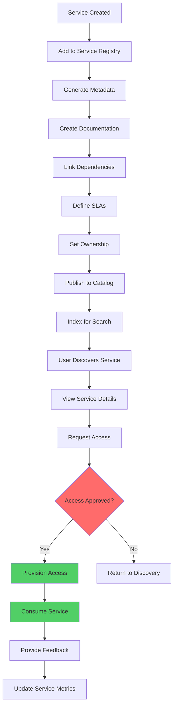

# Service Catalog

## Overview

The Service Catalog is a comprehensive governance pattern that provides a centralized portal for discovering, understanding, and consuming services within an organization. Unlike the Service Registry which focuses on technical service discovery, the Service Catalog emphasizes documentation, governance, and the business context of services. It serves as the single source of truth for service metadata, enabling developers, operators, and business stakeholders to find and adopt services effectively.

A well-designed Service Catalog addresses several key needs: developers need to find existing services before building new functionality; operators need to understand service dependencies and health; product managers need visibility into service capabilities and ownership; and security teams need to track data flows and compliance requirements. The catalog integrates with the Service Registry to combine operational metadata with business and technical documentation.

The Service Catalog typically includes service descriptions, API documentation, ownership information, SLAs, dependencies, deployment information, and operational runbooks. Modern implementations provide self-service provisioning, approval workflows, and analytics on service usage. The catalog becomes a critical governance tool, enabling organizations to understand their service landscape, prevent duplication, and make informed architectural decisions.

### Catalog Components

The Service Catalog consists of multiple integrated components: the metadata store for service information, the documentation engine for API specs and runbooks, the visualization layer for dependency graphs, the search and discovery interface, and the governance enforcement point for access control and compliance.

## Flow Chart



## Standard Example (TypeScript)

```typescript
/**
 * Service Catalog Implementation
 * Comprehensive service metadata management and discovery
 */

interface ServiceCatalogEntry {
  id: string;
  name: string;
  description: string;
  serviceType: ServiceType;
  owner: ServiceOwner;
  metadata: ServiceMetadata;
  api: ApiSpecification;
  dependencies: DependencyInfo[];
  slas: ServiceLevelAgreement[];
  documentation: DocumentationSet;
  security: SecurityInfo;
  lifecycle: LifecycleInfo;
  metrics: ServiceMetrics;
  tags: string[];
}

enum ServiceType {
  REST_API = 'rest_api',
  GRAPHQL = 'graphql',
  GRPC = 'grpc',
  MESSAGE_CONSUMER = 'message_consumer',
  MESSAGE_PRODUCER = 'message_producer',
  WORKER = 'worker',
  SCHEDULED_JOB = 'scheduled_job',
  WEB_UI = 'web_ui'
}

interface ServiceOwner {
  teamId: string;
  teamName: string;
  contactEmail: string;
  slackChannel: string;
  onCallRotation: string;
  productOwner?: string;
  technicalLead?: string;
}

interface ServiceMetadata {
  repositoryUrl: string;
  dockerImage?: string;
  language: string;
  framework: string;
  createdAt: Date;
  lastUpdated: Date;
  environment: string;
  region: string;
  costCenter?: string;
}

interface ApiSpecification {
  openApiUrl?: string;
  graphqlSchemaUrl?: string;
  protoDefinitionUrl?: string;
  baseUrl: string;
  version: string;
  endpoints: ApiEndpoint[];
}

interface ApiEndpoint {
  path: string;
  method: string;
  summary: string;
  deprecated: boolean;
  authRequired: boolean;
  rateLimit?: RateLimitInfo;
}

interface RateLimitInfo {
  requestsPerSecond: number;
  burstLimit: number;
}

interface DependencyInfo {
  serviceId: string;
  serviceName: string;
  type: 'required' | 'optional' | 'runtime';
  direction: 'upstream' | 'downstream';
}

interface ServiceLevelAgreement {
  name: string;
  description: string;
  target: number;
  window: string;
  errorBudget: number;
}

interface DocumentationSet {
  overview: string;
  quickStart?: string;
  apiDocs?: string;
  runbooks: Runbook[];
  architectureDiagram?: string;
  faqs: FaqItem[];
}

interface Runbook {
  id: string;
  title: string;
  url: string;
  category: string;
  lastUpdated: Date;
}

interface FaqItem {
  question: string;
  answer: string;
  tags: string[];
}

interface SecurityInfo {
  classification: DataClassification;
  complianceRequirements: string[];
  authenticationType: string;
  requiresEncryption: boolean;
  vulnerabilityScanDate?: Date;
}

enum DataClassification {
  PUBLIC = 'public',
  INTERNAL = 'internal',
  CONFIDENTIAL = 'confidential',
  RESTRICTED = 'restricted'
}

interface LifecycleInfo {
  status: LifecycleStatus;
  stage: 'development' | 'beta' | 'general_availability' | 'deprecated' | 'retired';
  retirementDate?: Date;
  supportLevel: 'community' | 'standard' | 'premium';
  changelogUrl?: string;
}

enum LifecycleStatus {
  ACTIVE = 'active',
  BETA = 'beta',
  DEPRECATED = 'deprecated',
  RETIRED = 'retired'
}

interface ServiceMetrics {
  uptime: number;
  avgResponseTime: number;
  requestsPerSecond: number;
  errorRate: number;
  activeConsumers: number;
  lastIncident?: IncidentInfo;
}

interface IncidentInfo {
  id: string;
  severity: 'critical' | 'high' | 'medium' | 'low';
  title: string;
  resolvedAt: Date;
}

interface CatalogSearchQuery {
  text?: string;
  serviceType?: ServiceType[];
  owner?: string;
  tags?: string[];
  classification?: DataClassification[];
  status?: LifecycleStatus[];
}

interface AccessRequest {
  serviceId: string;
  requesterId: string;
  requesterEmail: string;
  purpose: string;
  accessLevel: 'read' | 'write' | 'admin';
  requestedAt: Date;
  status: RequestStatus;
}

enum RequestStatus {
  PENDING = 'pending',
  APPROVED = 'approved',
  REJECTED = 'rejected',
  EXPIRED = 'expired'
}

class ServiceCatalog {
  private entries: Map<string, ServiceCatalogEntry> = new Map();
  private accessRequests: Map<string, AccessRequest[]> = new Map();
  private searchIndex: SearchIndex;

  constructor() {
    this.searchIndex = new SearchIndex();
  }

  /**
   * Register a new service in the catalog
   */
  async registerService(entry: ServiceCatalogEntry): Promise<void> {
    if (this.entries.has(entry.id)) {
      throw new Error(`Service ${entry.name} is already registered`);
    }

    this.entries.set(entry.id, entry);
    this.searchIndex.index(entry);

    console.log(`Service registered in catalog: ${entry.name}`);
  }

  /**
   * Update an existing service entry
   */
  async updateService(id: string, updates: Partial<ServiceCatalogEntry>): Promise<ServiceCatalogEntry> {
    const entry = this.entries.get(id);
    if (!entry) {
      throw new Error(`Service not found: ${id}`);
    }

    const updated = { ...entry, ...updates, metadata: { ...entry.metadata, lastUpdated: new Date() } };
    this.entries.set(id, updated);
    this.searchIndex.reindex(updated);

    console.log(`Service updated in catalog: ${entry.name}`);
    return updated;
  }

  /**
   * Get service by ID
   */
  getService(id: string): ServiceCatalogEntry | null {
    return this.entries.get(id) || null;
  }

  /**
   * Get service by name
   */
  getServiceByName(name: string): ServiceCatalogEntry | null {
    for (const entry of this.entries.values()) {
      if (entry.name === name) {
        return entry;
      }
    }
    return null;
  }

  /**
   * Search services in the catalog
   */
  search(query: CatalogSearchQuery): ServiceCatalogEntry[] {
    return this.searchIndex.search(query);
  }

  /**
   * Get all services owned by a team
   */
  getServicesByOwner(teamId: string): ServiceCatalogEntry[] {
    return Array.from(this.entries.values())
      .filter(e => e.owner.teamId === teamId);
  }

  /**
   * Get service dependencies
   */
  getDependencies(serviceId: string): DependencyInfo[] {
    const entry = this.entries.get(serviceId);
    return entry?.dependencies || [];
  }

  /**
   * Get consumers of a service
   */
  getConsumers(serviceId: string): ServiceCatalogEntry[] {
    const consumers: ServiceCatalogEntry[] = [];

    for (const entry of this.entries.values()) {
      const dependsOn = entry.dependencies.some(d => d.serviceId === serviceId);
      if (dependsOn) {
        consumers.push(entry);
      }
    }

    return consumers;
  }

  /**
   * Generate service dependency graph
   */
  generateDependencyGraph(rootServiceId: string): DependencyGraph {
    const visited = new Set<string>();
    const graph = new DependencyGraph(rootServiceId);

    const buildGraph = (serviceId: string, depth: number) => {
      if (visited.has(serviceId) || depth > 10) return;
      visited.add(serviceId);

      const entry = this.entries.get(serviceId);
      if (!entry) return;

      graph.addNode(serviceId, entry.name, entry.serviceType);

      for (const dep of entry.dependencies) {
        graph.addEdge(serviceId, dep.serviceId, dep.type);
        buildGraph(dep.serviceId, depth + 1);
      }
    };

    buildGraph(rootServiceId, 0);
    return graph;
  }

  /**
   * Request access to a service
   */
  requestAccess(request: Omit<AccessRequest, 'status'>): AccessRequest {
    const accessRequest: AccessRequest = {
      ...request,
      status: RequestStatus.PENDING
    };

    if (!this.accessRequests.has(request.serviceId)) {
      this.accessRequests.set(request.serviceId, []);
    }

    this.accessRequests.get(request.serviceId)!.push(accessRequest);
    console.log(`Access requested for service by ${request.requesterEmail}`);

    return accessRequest;
  }

  /**
   * Approve or reject access request
   */
  processAccessRequest(
    serviceId: string,
    requesterEmail: string,
    approved: boolean,
    approverNotes?: string
  ): AccessRequest | null {
    const requests = this.accessRequests.get(serviceId);
    if (!requests) return null;

    const request = requests.find(r => r.requesterEmail === requesterEmail && r.status === RequestStatus.PENDING);
    if (!request) return null;

    request.status = approved ? RequestStatus.APPROVED : RequestStatus.REJECTED;
    console.log(`Access ${approved ? 'approved' : 'rejected'} for ${requesterEmail} on service ${serviceId}`);

    return request;
  }

  /**
   * Get pending access requests for a service
   */
  getPendingAccessRequests(serviceId: string): AccessRequest[] {
    const requests = this.accessRequests.get(serviceId);
    if (!requests) return [];

    return requests.filter(r => r.status === RequestStatus.PENDING);
  }

  /**
   * Generate catalog analytics
   */
  generateAnalytics(): CatalogAnalytics {
    const entries = Array.from(this.entries.values());

    return {
      totalServices: entries.length,
      byType: this.groupByType(entries),
      byOwner: this.groupByOwner(entries),
      byClassification: this.groupByClassification(entries),
      byStatus: this.groupByStatus(entries),
      averageDependencies: this.calculateAverageDependencies(entries),
      coverage: this.calculateDocumentationCoverage(entries)
    };
  }

  private groupByType(entries: ServiceCatalogEntry[]): Record<string, number> {
    return entries.reduce((acc, e) => {
      acc[e.serviceType] = (acc[e.serviceType] || 0) + 1;
      return acc;
    }, {} as Record<string, number>);
  }

  private groupByOwner(entries: ServiceCatalogEntry[]): Record<string, number> {
    return entries.reduce((acc, e) => {
      acc[e.owner.teamName] = (acc[e.owner.teamName] || 0) + 1;
      return acc;
    }, {} as Record<string, number>);
  }

  private groupByClassification(entries: ServiceCatalogEntry[]): Record<string, number> {
    return entries.reduce((acc, e) => {
      acc[e.security.classification] = (acc[e.security.classification] || 0) + 1;
      return acc;
    }, {} as Record<string, number>);
  }

  private groupByStatus(entries: ServiceCatalogEntry[]): Record<string, number> {
    return entries.reduce((acc, e) => {
      acc[e.lifecycle.status] = (acc[e.lifecycle.status] || 0) + 1;
      return acc;
    }, {} as Record<string, number>);
  }

  private calculateAverageDependencies(entries: ServiceCatalogEntry[]): number {
    const total = entries.reduce((sum, e) => sum + e.dependencies.length, 0);
    return total / entries.length;
  }

  private calculateDocumentationCoverage(entries: ServiceCatalogEntry[]): number {
    const documented = entries.filter(e => 
      e.documentation.overview && 
      e.documentation.runbooks.length > 0
    ).length;
    return (documented / entries.length) * 100;
  }
}

/**
 * Search Index for Service Catalog
 */
class SearchIndex {
  private index: Map<string, Set<string>> = new Map();

  index(entry: ServiceCatalogEntry): void {
    const keywords = this.extractKeywords(entry);
    
    for (const keyword of keywords) {
      if (!this.index.has(keyword)) {
        this.index.set(keyword, new Set());
      }
      this.index.get(keyword)!.add(entry.id);
    }
  }

  reindex(entry: ServiceCatalogEntry): void {
    this.remove(entry.id);
    this.index(entry);
  }

  remove(serviceId: string): void {
    for (const ids of this.index.values()) {
      ids.delete(serviceId);
    }
  }

  search(query: CatalogSearchQuery): ServiceCatalogEntry[] {
    const allIds = new Set<string>();

    if (query.text) {
      const keywords = query.text.toLowerCase().split(' ');
      for (const keyword of keywords) {
        const matching = this.index.get(keyword) || new Set();
        if (allIds.size === 0) {
          matching.forEach(id => allIds.add(id));
        } else {
          const intersection = new Set([...allIds].filter(id => matching.has(id)));
          allIds.clear();
          intersection.forEach(id => allIds.add(id));
        }
      }
    }

    return Array.from(allIds);
  }

  private extractKeywords(entry: ServiceCatalogEntry): string[] {
    const keywords: string[] = [];

    keywords.push(...entry.name.toLowerCase().split('-'));
    keywords.push(...entry.description.toLowerCase().split(' '));
    keywords.push(...entry.tags);
    keywords.push(entry.serviceType);
    keywords.push(entry.owner.teamName.toLowerCase());

    return keywords.filter(k => k.length > 2);
  }
}

/**
 * Service Dependency Graph
 */
class DependencyGraph {
  private nodes: Map<string, { name: string; type: ServiceType }> = new Map();
  private edges: { from: string; to: string; type: string }[] = [];
  private rootId: string;

  constructor(rootId: string) {
    this.rootId = rootId;
  }

  addNode(id: string, name: string, type: ServiceType): void {
    this.nodes.set(id, { name, type });
  }

  addEdge(from: string, to: string, type: string): void {
    this.edges.push({ from, to, type });
  }

  getNodes(): { id: string; name: string; type: ServiceType }[] {
    return Array.from(this.nodes.entries()).map(([id, data]) => ({
      id,
      ...data
    }));
  }

  getEdges(): { from: string; to: string; type: string }[] {
    return this.edges;
  }
}

interface CatalogAnalytics {
  totalServices: number;
  byType: Record<string, number>;
  byOwner: Record<string, number>;
  byClassification: Record<string, number>;
  byStatus: Record<string, number>;
  averageDependencies: number;
  coverage: number;
}

// Example usage
const catalog = new ServiceCatalog();

const paymentServiceEntry: ServiceCatalogEntry = {
  id: 'payment-svc-001',
  name: 'payment-api',
  description: 'Handles all payment processing operations including credit cards, debit cards, and digital wallets',
  serviceType: ServiceType.REST_API,
  owner: {
    teamId: 'payments-team',
    teamName: 'Payments',
    contactEmail: 'payments-team@company.com',
    slackChannel: '#payments-team',
    onCallRotation: 'https://opsgenie.com/schedules/payments',
    technicalLead: 'john.smith@company.com'
  },
  metadata: {
    repositoryUrl: 'https://github.com/company/payment-service',
    dockerImage: 'company/payment-service:v2.1.0',
    language: 'TypeScript',
    framework: 'Node.js/Express',
    createdAt: new Date('2023-01-15'),
    lastUpdated: new Date(),
    environment: 'production',
    region: 'us-east-1',
    costCenter: 'CC-001'
  },
  api: {
    baseUrl: 'https://api.company.com/v1/payments',
    version: '1.0.0',
    openApiUrl: 'https://api.company.com/docs/payments/openapi.json',
    endpoints: [
      { path: '/payments', method: 'POST', summary: 'Process a payment', deprecated: false, authRequired: true, rateLimit: { requestsPerSecond: 100, burstLimit: 200 } },
      { path: '/payments/{id}', method: 'GET', summary: 'Get payment details', deprecated: false, authRequired: true },
      { path: '/payments/{id}/refund', method: 'POST', summary: 'Refund a payment', deprecated: false, authRequired: true }
    ]
  },
  dependencies: [
    { serviceId: 'billing-svc-001', serviceName: 'billing-api', type: 'required', direction: 'upstream' },
    { serviceId: 'fraud-svc-001', serviceName: 'fraud-detection', type: 'required', direction: 'upstream' },
    { serviceId: 'notification-svc-001', serviceName: 'notification-service', type: 'optional', direction: 'downstream' }
  ],
  slas: [
    { name: 'Response Time', description: '95th percentile response time', target: 200, window: '5m', errorBudget: 0.05 },
    { name: 'Availability', description: 'Service uptime', target: 99.9, window: '30d', errorBudget: 0.001 }
  ],
  documentation: {
    overview: 'Payment service handles all payment operations...',
    quickStart: 'https://docs.company.com/payments/quickstart',
    apiDocs: 'https://docs.company.com/payments/api',
    runbooks: [
      { id: 'rb-001', title: 'Handle Payment Failures', url: 'https://runbooks.company.com/payment-failures', category: 'incident', lastUpdated: new Date() }
    ],
    faqs: [
      { question: 'What payment methods are supported?', answer: 'Credit cards, debit cards, PayPal, Apple Pay', tags: ['payments', 'methods'] }
    ]
  },
  security: {
    classification: DataClassification.RESTRICTED,
    complianceRequirements: ['PCI-DSS', 'SOC2'],
    authenticationType: 'OAuth 2.0',
    requiresEncryption: true,
    vulnerabilityScanDate: new Date()
  },
  lifecycle: {
    status: LifecycleStatus.ACTIVE,
    stage: 'general_availability',
    supportLevel: 'premium',
    changelogUrl: 'https://github.com/company/payment-service/blob/main/CHANGELOG.md'
  },
  metrics: {
    uptime: 99.95,
    avgResponseTime: 45,
    requestsPerSecond: 500,
    errorRate: 0.01,
    activeConsumers: 12
  },
  tags: ['payments', 'core', ' PCI', 'revenue']
};

await catalog.registerService(paymentServiceEntry);

const searchResults = catalog.search({ text: 'payment', serviceType: [ServiceType.REST_API] });
console.log('Search results:', searchResults.length);

const dependencyGraph = catalog.generateDependencyGraph('payment-svc-001');
console.log('Dependency graph nodes:', dependencyGraph.getNodes().length);

const analytics = catalog.generateAnalytics();
console.log('Catalog analytics:', analytics);

catalog.requestAccess({
  serviceId: 'payment-svc-001',
  requesterId: 'user-123',
  requesterEmail: 'developer@company.com',
  purpose: 'Building new checkout feature',
  accessLevel: 'read',
  requestedAt: new Date()
});
```

## Real-World Examples

### Spotify Service Catalog

Spotify maintains an internal service catalog known as "Backstage":

- **Developer Portal**: Single pane of glass for all service information
- **Tech Docs**: Markdown-based documentation stored in repositories
- **Service Dashboard**: Visual overview of service health and dependencies
- **Plugin Ecosystem**: Extensible platform for different tooling integrations

### Netflix Service Discovery Dashboard

Netflix provides comprehensive service visibility:

- **Application Registry**: All applications registered with metadata
- **Dependency Visualization**: Interactive dependency graphs
- **Chaos Engineering Integration**: Links to chaos experiments
- **Deployment History**: Track of all deployments with links to builds

### Uber Service Overview Platform

Uber's internal platform provides:

- **Service Metadata**: Comprehensive service information
- **Ownership Registry**: Team assignments with contact information
- **SLO Tracking**: Error budget and SLA compliance monitoring
- **Cost Attribution**: Infrastructure cost per service

## Output Statement

The Service Catalog provides essential governance by:

- **Centralized Discovery**: Single source for finding all services with rich metadata
- **Documentation Enablement**: Encourages comprehensive service documentation
- **Ownership Visibility**: Clear accountability through owner information
- **Dependency Management**: Understanding of service relationships and cascades
- **Compliance Tracking**: Data classification and security requirements visibility

## Best Practices

1. **Integrate with Service Registry**: Connect the catalog to the service registry for automatic instance tracking and health data.

   ```typescript
   const CATALOG_REGISTRY_INTEGRATION = {
     syncInterval: 60000,
     autoDiscover: true,
     enrichMetadata: true,
     healthDataFlow: 'registry-to-catalog'
   };
   ```

2. **Enforce Documentation Standards**: Require minimum documentation before services can be marked as production-ready.

   ```typescript
   const DOCUMENTATION_REQUIREMENTS = {
     required: ['overview', 'api-endpoints', 'owner-contact'],
     recommended: ['quick-start', 'runbooks', 'architecture-diagram'],
     minimumRunbooks: 3,
     maxAgeDays: 90
   };
   ```

3. **Provide Self-Service Access**: Enable automated access provisioning through the catalog with appropriate approval workflows.

   ```typescript
   const ACCESS_WORKFLOW = {
     autoApprove: ['read-access', 'non-production'],
     requireApproval: ['write-access', 'production', 'sensitive-data'],
     approvalChain: ['service-owner', 'security-team'],
     expirationPolicy: '90 days'
   };
   ```

4. **Generate Interactive Dependency Graphs**: Provide visual representations of service dependencies to understand blast radius of changes.

   ```typescript
   const DEPENDENCY_VISUALIZATION = {
     depthLimit: 5,
     includeOptional: true,
     showDataFlow: true,
     interactive: true,
     exportFormats: ['png', 'svg', 'json']
   };
   ```

5. **Track Service Metrics**: Display operational metrics in the catalog to help consumers evaluate service health.

   ```typescript
   const METRICS_DISPLAY = {
     uptime: true,
     responseTime: true,
     errorRate: true,
     activeConsumers: true,
     lastIncident: true,
     updateFrequency: 60000
   };
   ```

6. **Implement Search and Filtering**: Provide powerful search capabilities to find services by name, tag, owner, type, or metadata.

   ```typescript
   const SEARCH_CAPABILITIES = {
     fullTextSearch: true,
     facetedFilters: true,
     autocomplete: true,
     filters: ['service-type', 'owner', 'tags', 'classification', 'status'],
     sortBy: ['name', 'popularity', 'recently-updated']
   };
   ```

7. **Add Service Lifecycle Management**: Track service stages from development through deprecation with appropriate policies at each stage.

   ```typescript
   const LIFECYCLE_POLICIES = {
     development: { visibleTo: ['developers'], requiredDocs: 'minimal' },
     beta: { visibleTo: ['selected-teams'], requiredDocs: 'standard' },
     general_availability: { visibleTo: ['all'], requiredDocs: 'complete' },
     deprecated: { visibleTo: ['consumers'], migrationGuide: true },
     retired: { visibleTo: ['none'], archiveOnly: true }
   };
   ```

8. **Require Security Classification**: Mandate data classification for all services to enable compliance tracking and appropriate controls.

   ```typescript
   const SECURITY_CLASSIFICATION = {
     required: true,
     options: ['public', 'internal', 'confidential', 'restricted'],
     triggersReview: ['confidential', 'restricted'],
     requiredApprovals: { restricted: ['security-team', 'legal-team'] }
   };
   ```

9. **Enable Feedback Loops**: Allow consumers to rate services, report issues, and request improvements through the catalog.

   ```typescript
   const FEEDBACK_MECHANISMS = {
     ratings: true,
     comments: true,
     issueReporting: true,
     featureRequests: true,
     responseTimeSLA: '48 hours'
   };
   ```

10. **Regular Catalog Audits**: Schedule periodic reviews to ensure service metadata remains accurate and documentation is current.

    ```typescript
    const AUDIT_SCHEDULE = {
      reviewFrequency: 'quarterly',
      reviewScope: ['metadata-accuracy', 'documentation-currency', 'dependency-validity'],
      ownersNotified: true,
      escalationOnInactivity: true,
      staleServiceThreshold: 180
    };
    ```