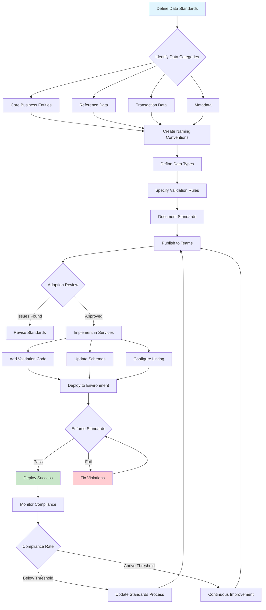

# Data Standards

## Overview

Data standards are the foundational rules and conventions that govern how data is defined, structured, stored, and exchanged within an organization. In microservices architectures, where multiple services maintain their own databases and communicate through APIs, establishing consistent data standards becomes critical for ensuring interoperability, reducing integration complexity, and enabling effective data governance. Without standardized data definitions, organizations face challenges like data silos, redundant storage, inconsistent reporting, and expensive integration efforts when connecting disparate systems.

The importance of data standards extends beyond technical considerations to business value. When data follows consistent standards across the enterprise, organizations can confidently make data-driven decisions, knowing that information from different sources can be reliably combined and analyzed. Data standards enable effective data quality management by establishing clear expectations for data accuracy, completeness, and validity. They also support compliance with regulatory requirements by ensuring consistent handling of sensitive information and maintaining audit trails. Furthermore, well-defined data standards reduce the time and cost of building new integrations, as teams can rely on established patterns rather than negotiating data formats for each new connection.

Implementing data standards in microservices requires balancing standardization with service autonomy. Each microservice owns its domain data and should have the freedom to optimize its internal data model for performance and domain-specific requirements. However, at the service boundaries where data crosses service lines or integrates with external systems, adherence to common standards ensures seamless interoperability. This creates a layered approach where internal data models can vary, but exchange formats, identifier schemes, and core entity definitions remain consistent across the organization. Standards should be adopted incrementally, with clear governance processes for proposing, reviewing, and evolving standards over time.

### Core Components of Data Standards

Naming conventions establish consistent patterns for how data elements are named across the organization. This includes guidelines for database table names, column names, field names in JSON or XML documents, variable names in code, and API endpoint paths. Effective naming conventions typically specify rules for capitalization, word separators, abbreviations, and naming hierarchies that make data elements self-documenting and easily discoverable. A well-designed naming convention might specify that table names use plural snake_case (like `customer_orders`), while API response fields use camelCase to align with JavaScript conventions.

Data type standards define the allowed data types and formats for common data elements across the organization. This includes primitive types like strings, numbers, and dates, as well as complex types like addresses, monetary amounts, and identifiers. Type standards should specify not just the type name but also constraints like maximum lengths, precision for decimal values, and allowed value ranges. For date and time data, standards should specify the timezone handling approach and the ISO 8601 format for text representation. Standardized types enable automatic validation, simplify data transformations, and reduce errors from type mismatches.

Identifier standards establish consistent approaches for generating and formatting unique identifiers across the system. This includes primary keys, foreign keys, and business identifiers like customer numbers, order IDs, and product SKUs. A common approach is to use UUIDs for internal system identifiers while reserving specific formats for human-readable business identifiers. Identifier standards should also specify how composite identifiers are constructed and how identifiers are validated to ensure referential integrity across services.

### Data Format Standards

JSON schema standards provide a framework for defining the structure, constraints, and documentation of JSON documents exchanged between services. Organizations often develop a library of standard schemas for common data structures like pagination responses, error responses, and domain-specific entities. These schemas serve as contracts between services, enabling validation at API boundaries and documentation generation. JSON schema standards should specify which version of the schema specification to use and establish patterns for schema evolution without breaking existing consumers.

Date and time standards ensure consistent representation of temporal data across all services. The ISO 8601 standard provides the foundation, specifying formats like `2024-01-15T10:30:00Z` for timestamps in UTC. Organizations may add additional conventions, such as specifying that all APIs return timestamps in UTC while allowing internal services to store times in local timezones. Date range standards clarify how to represent periods and intervals, while timezone standards specify how to handle timezone-aware operations.

Currency and numeric standards address the challenges of representing money in software, where floating-point arithmetic can introduce rounding errors. Standards typically specify using integer cents or a decimal type with specific precision rather than floating-point numbers. Format standards specify how to display currency values, including symbol placement, decimal separator conventions, and thousands grouping. For quantities and measurements, standards should specify the units of measure and conversion factors.

## Flow Chart



## Standard Example

```javascript
/**
 * Data Standards Implementation in TypeScript
 * 
 * This example demonstrates implementing and enforcing data standards
 * for a microservices environment, including validation, naming conventions,
 * and standardized data types.
 */

// ============================================================================
// STANDARD TYPE DEFINITIONS
// ============================================================================

interface StandardIdentifier {
    value: string;
    type: 'uuid' | 'ULID' | 'numeric' | 'alphanumeric';
    format: RegExp;
}

interface StandardTimestamp {
    iso8601: string;
    unix: number;
    timezone: 'UTC';
    milliseconds: number;
}

interface StandardMonetaryAmount {
    currency: string;
    amount: number;
    unit: 'cents' | 'dollars';
    precision: 2;
}

interface StandardAddress {
    street1: string;
    street2?: string;
    city: string;
    state: string;
    postalCode: string;
    countryCode: string;
}

interface StandardPaginationRequest {
    page: number;
    pageSize: number;
    sortBy?: string;
    sortOrder?: 'asc' | 'desc';
}

interface StandardPaginationResponse<T> {
    data: T[];
    pagination: {
        page: number;
        pageSize: number;
        totalItems: number;
        totalPages: number;
        hasNext: boolean;
        hasPrevious: boolean;
    };
}

interface StandardErrorResponse {
    error: {
        code: string;
        message: string;
        details?: Record<string, unknown>;
        traceId?: string;
        timestamp: string;
    };
}

// ============================================================================
// NAMING CONVENTION VALIDATOR
// ============================================================================

enum NamingConvention {
    SNAKE_CASE = 'snake_case',
    CAMEL_CASE = 'camelCase',
    PASCAL_CASE = 'PascalCase',
    KEBAB_CASE = 'kebab-case',
    SCREAMING_SNAKE = 'SCREAMING_SNAKE_CASE'
}

class NamingConventionValidator {
    private static patterns: Record<NamingConvention, RegExp> = {
        [NamingConvention.SNAKE_CASE]: /^[a-z][a-z0-9_]*$/,
        [NamingConvention.CAMEL_CASE]: /^[a-z][a-zA-Z0-9]*$/,
        [NamingConvention.PASCAL_CASE]: /^[A-Z][a-zA-Z0-9]*$/,
        [NamingConvention.KEBAR_CASE]: /^[a-z][a-z0-9-]*$/,
        [NamingConvention.SCREAMING_SNAKE]: /^[A-Z][A-Z0-9_]*$/
    };

    static validate(name: string, convention: NamingConvention): boolean {
        const pattern = this.patterns[convention];
        if (!pattern) {
            throw new Error(`Unknown naming convention: ${convention}`);
        }
        return pattern.test(name);
    }

    static validateTableName(tableName: string): boolean {
        if (!tableName.startsWith('tbl_') && !tableName.startsWith('ref_')) {
            return this.validate(tableName, NamingConvention.SNAKE_CASE);
        }
        const suffix = tableName.substring(4);
        return this.validate(suffix, NamingConvention.SNAKE_CASE);
    }

    static validateJsonField(fieldName: string): boolean {
        return this.validate(fieldName, NamingConvention.CAMEL_CASE);
    }

    static validateApiEndpoint(endpoint: string): boolean {
        return this.validate(endpoint.replace(/\//g, '_').replace(/-/g, '_'), 
                            NamingConvention.KEBAR_CASE);
    }
}

// ============================================================================
// DATA TYPE VALIDATORS
// ============================================================================

class StandardValidators {
    static validateIdentifier(id: StandardIdentifier): boolean {
        return id.format.test(id.value);
    }

    static validateUuid(uuid: string): boolean {
        const uuidRegex = /^[0-9a-f]{8}-[0-9a-f]{4}-[1-5][0-9a-f]{3}-[89ab][0-9a-f]{3}-[0-9a-f]{12}$/i;
        return uuidRegex.test(uuid);
    }

    static validateUlid(ulid: string): boolean {
        const ulidRegex = /^[0-9A-HJKMNP-TV-Z]{26}$/i;
        return ulidRegex.test(ulid);
    }

    static validateTimestamp(timestamp: StandardTimestamp): boolean {
        const isoRegex = /^\d{4}-\d{2}-\d{2}T\d{2}:\d{2}:\d{2}(\.\d{3})?Z$/;
        if (!isoRegex.test(timestamp.iso8601)) {
            return false;
        }
        const parsed = new Date(timestamp.iso8601);
        return !isNaN(parsed.getTime()) && timestamp.timezone === 'UTC';
    }

    static validateMonetaryAmount(amount: StandardMonetaryAmount): boolean {
        if (amount.unit === 'cents') {
            return Number.isInteger(amount.amount) && amount.amount >= 0;
        }
        return amount.amount >= 0 && 
               amount.amount.toString().split('.')[1]?.length <= amount.precision;
    }

    static validateEmail(email: string): boolean {
        const emailRegex = /^[a-zA-Z0-9._%+-]+@[a-zA-Z0-9.-]+\.[a-zA-Z]{2,}$/;
        return emailRegex.test(email);
    }

    static validateCountryCode(code: string): boolean {
        const validCodes = ['US', 'UK', 'CA', 'AU', 'DE', 'FR', 'JP', 'CN', 'IN', 'BR'];
        return validCodes.includes(code.toUpperCase());
    }

    static validatePostalCode(postalCode: string, countryCode: string): boolean {
        const patterns: Record<string, RegExp> = {
            'US': /^\d{5}(-\d{4})?$/,
            'UK': /^[A-Z]{1,2}\d[A-Z\d]? ?\d[A-Z]{2}$/i,
            'CA': /^[A-Z]\d[A-Z] ?\d[A-Z]\d$/i,
            'AU': /^\d{4}$/,
            'IN': /^\d{6}$/
        };
        const pattern = patterns[countryCode.toUpperCase()];
        return pattern ? pattern.test(postalCode) : false;
    }

    static validatePhoneNumber(phone: string, countryCode: string = 'US'): boolean {
        const cleaned = phone.replace(/\D/g, '');
        const patterns: Record<string, RegExp> = {
            'US': /^\d{10}$/,
            'UK': /^\d{10,11}$/,
            'IN': /^\d{10}$/,
            'CA': /^\d{10}$/
        };
        const pattern = patterns[countryCode.toUpperCase()];
        return pattern ? pattern.test(cleaned) : false;
    }
}

// ============================================================================
// STANDARDIZED DATE/TIME HANDLING
// ============================================================================

class StandardDateTime {
    private static readonly ISO8601_FORMAT = /^\d{4}-\d{2}-\d{2}T\d{2}:\d{2}:\d{2}(\.\d{3})?Z$/;

    static now(): StandardTimestamp {
        const now = new Date();
        return {
            iso8601: now.toISOString(),
            unix: Math.floor(now.getTime() / 1000),
            timezone: 'UTC',
            milliseconds: now.getTime()
        };
    }

    static fromDate(date: Date): StandardTimestamp {
        return {
            iso8601: date.toISOString(),
            unix: Math.floor(date.getTime() / 1000),
            timezone: 'UTC',
            milliseconds: date.getTime()
        };
    }

    static parse(iso8601: string): StandardTimestamp | null {
        if (!this.ISO8601_FORMAT.test(iso8601)) {
            return null;
        }
        const date = new Date(iso8601);
        if (isNaN(date.getTime())) {
            return null;
        }
        return this.fromDate(date);
    }

    static formatDateOnly(date: Date): string {
        return date.toISOString().split('T')[0];
    }

    static formatTimeOnly(date: Date): string {
        return date.toISOString().split('T')[1].split('.')[0] + 'Z';
    }
}

// ============================================================================
// STANDARDIZED MONETARY AMOUNTS
// ============================================================================

class MonetaryAmount {
    static fromCents(cents: number, currency: string = 'USD'): StandardMonetaryAmount {
        return {
            currency: currency.toUpperCase(),
            amount: cents,
            unit: 'cents',
            precision: 2
        };
    }

    static fromDollars(dollars: number, currency: string = 'USD'): StandardMonetaryAmount {
        return {
            currency: currency.toUpperCase(),
            amount: Math.round(dollars * 100),
            unit: 'cents',
            precision: 2
        };
    }

    static toDollars(amount: StandardMonetaryAmount): number {
        return amount.amount / 100;
    }

    static format(amount: StandardMonetaryAmount, locale: string = 'en-US'): string {
        return new Intl.NumberFormat(locale, {
            style: 'currency',
            currency: amount.currency
        }).format(this.toDollars(amount));
    }

    static add(a: StandardMonetaryAmount, b: StandardMonetaryAmount): StandardMonetaryAmount {
        if (a.currency !== b.currency) {
            throw new Error('Cannot add amounts with different currencies');
        }
        return {
            currency: a.currency,
            amount: a.amount + b.amount,
            unit: 'cents',
            precision: 2
        };
    }

    static multiply(amount: StandardMonetaryAmount, multiplier: number): StandardMonetaryAmount {
        return {
            currency: amount.currency,
            amount: Math.round(amount.amount * multiplier),
            unit: 'cents',
            precision: 2
        };
    }
}

// ============================================================================
// DATA STANDARD SCHEMA REGISTRY
// ============================================================================

interface SchemaDefinition {
    name: string;
    version: string;
    fields: FieldDefinition[];
    validations: ValidationRule[];
}

interface FieldDefinition {
    name: string;
    type: string;
    required: boolean;
    pattern?: RegExp;
    enum?: string[];
    minLength?: number;
    maxLength?: number;
    minimum?: number;
    maximum?: number;
}

interface ValidationRule {
    field: string;
    rule: string;
    params?: unknown;
}

class SchemaRegistry {
    private schemas: Map<string, SchemaDefinition> = new Map();

    register(schema: SchemaDefinition): void {
        const key = `${schema.name}:${schema.version}`;
        this.schemas.set(key, schema);
    }

    get(name: string, version: string): SchemaDefinition | undefined {
        return this.schemas.get(`${name}:${version}`);
    }

    validate(data: Record<string, unknown>, schemaName: string, version: string): ValidationResult {
        const schema = this.get(schemaName, version);
        if (!schema) {
            return { valid: false, errors: [`Schema ${schemaName}:${version} not found`] };
        }

        const errors: string[] = [];

        for (const field of schema.fields) {
            const value = data[field.name];

            if (field.required && (value === undefined || value === null)) {
                errors.push(`Field '${field.name}' is required`);
                continue;
            }

            if (value === undefined || value === null) {
                continue;
            }

            if (field.type === 'string' && typeof value !== 'string') {
                errors.push(`Field '${field.name}' must be a string`);
            }

            if (field.type === 'number' && typeof value !== 'number') {
                errors.push(`Field '${field.name}' must be a number`);
            }

            if (field.pattern && typeof value === 'string' && !field.pattern.test(value)) {
                errors.push(`Field '${field.name}' does not match required pattern`);
            }

            if (field.enum && !field.enum.includes(value as string)) {
                errors.push(`Field '${field.name}' must be one of: ${field.enum.join(', ')}`);
            }

            if (field.minLength && typeof value === 'string' && value.length < field.minLength) {
                errors.push(`Field '${field.name}' must be at least ${field.minLength} characters`);
            }

            if (field.maxLength && typeof value === 'string' && value.length > field.maxLength) {
                errors.push(`Field '${field.name}' must be at most ${field.maxLength} characters`);
            }

            if (field.minimum !== undefined && typeof value === 'number' && value < field.minimum) {
                errors.push(`Field '${field.name}' must be at least ${field.minimum}`);
            }

            if (field.maximum !== undefined && typeof value === 'number' && value > field.maximum) {
                errors.push(`Field '${field.name}' must be at most ${field.maximum}`);
            }
        }

        return { valid: errors.length === 0, errors };
    }
}

interface ValidationResult {
    valid: boolean;
    errors: string[];
}

// ============================================================================
// PAGINATION HELPER
// ============================================================================

class PaginationHelper {
    static createRequest(page: number = 1, pageSize: number = 20): StandardPaginationRequest {
        if (page < 1) page = 1;
        if (pageSize < 1) pageSize = 1;
        if (pageSize > 100) pageSize = 100;

        return {
            page,
            pageSize,
            sortBy: undefined,
            sortOrder: 'asc'
        };
    }

    static createResponse<T>(
        data: T[],
        totalItems: number,
        request: StandardPaginationRequest
    ): StandardPaginationResponse<T> {
        const totalPages = Math.ceil(totalItems / request.pageSize);

        return {
            data,
            pagination: {
                page: request.page,
                pageSize: request.pageSize,
                totalItems,
                totalPages,
                hasNext: request.page < totalPages,
                hasPrevious: request.page > 1
            }
        };
    }

    static getOffset(request: StandardPaginationRequest): number {
        return (request.page - 1) * request.pageSize;
    }
}

// ============================================================================
// STANDARD ERROR RESPONSE BUILDER
// ============================================================================

class StandardErrorBuilder {
    static create(
        code: string,
        message: string,
        details?: Record<string, unknown>,
        traceId?: string
    ): StandardErrorResponse {
        return {
            error: {
                code,
                message,
                details,
                traceId: traceId || this.generateTraceId(),
                timestamp: StandardDateTime.now().iso8601
            }
        };
    }

    static badRequest(message: string, details?: Record<string, unknown>): StandardErrorResponse {
        return this.create('BAD_REQUEST', message, details);
    }

    static unauthorized(message: string = 'Unauthorized'): StandardErrorResponse {
        return this.create('UNAUTHORIZED', message);
    }

    static forbidden(message: string = 'Forbidden'): StandardErrorResponse {
        return this.create('FORBIDDEN', message);
    }

    static notFound(resource: string): StandardErrorResponse {
        return this.create('NOT_FOUND', `${resource} not found`);
    }

    static internalError(message: string = 'Internal server error'): StandardErrorResponse {
        return this.create('INTERNAL_ERROR', message);
    }

    private static generateTraceId(): string {
        return 'xxxxxxxx-xxxx-4xxx-yxxx-xxxxxxxxxxxx'.replace(/[xy]/g, (c) => {
            const r = Math.random() * 16 | 0;
            const v = c === 'x' ? r : (r & 0x3 | 0x8);
            return v.toString(16);
        });
    }
}

// ============================================================================
// DEMONSTRATION
// ============================================================================

function demonstrateDataStandards(): void {
    console.log('='.repeat(60));
    console.log('DATA STANDARDS DEMONSTRATION');
    console.log('='.repeat(60));

    console.log('\n--- Naming Convention Validation ---');
    
    console.log(`Validating 'customer_orders': ${NamingConventionValidator.validateTableName('customer_orders')}`);
    console.log(`Validating 'tbl_customerOrders': ${NamingConventionValidator.validateTableName('tbl_customerOrders')}`);
    console.log(`Validating 'customerName': ${NamingConventionValidator.validateJsonField('customerName')}`);
    console.log(`Validating 'get-customer': ${NamingConventionValidator.validateApiEndpoint('get-customer')}`);

    console.log('\n--- Timestamp Standards ---');
    
    const now = StandardDateTime.now();
    console.log(`Current timestamp: ${JSON.stringify(now)}`);
    
    const parsed = StandardDateTime.parse('2024-01-15T10:30:00Z');
    console.log(`Parsed timestamp: ${JSON.stringify(parsed)}`);

    console.log('\n--- Monetary Amount Standards ---');
    
    const price = MonetaryAmount.fromDollars(29.99, 'USD');
    console.log(`Price in cents: ${price.amount}`);
    console.log(`Formatted price: ${MonetaryAmount.format(price)}`);
    
    const discounted = MonetaryAmount.multiply(price, 0.9);
    console.log(`Discounted (10% off): ${MonetaryAmount.format(discounted)}`);

    console.log('\n--- Schema Registry ---');
    
    const schemaRegistry = new SchemaRegistry();
    schemaRegistry.register({
        name: 'customer',
        version: '1.0',
        fields: [
            { name: 'id', type: 'string', required: true, pattern: /^[0-9a-f]{8}-[0-9a-f]{4}-[1-5][0-9a-f]{3}-[89ab][0-9a-f]{3}-[0-9a-f]{12}$/i },
            { name: 'email', type: 'string', required: true },
            { name: 'name', type: 'string', required: true, minLength: 1, maxLength: 100 },
            { name: 'status', type: 'string', required: true, enum: ['active', 'inactive', 'suspended'] }
        ],
        validations: []
    });

    const validCustomer = {
        id: '550e8400-e29b-41d4-a716-446655440000',
        email: 'customer@example.com',
        name: 'John Doe',
        status: 'active'
    };

    const result1 = schemaRegistry.validate(validCustomer, 'customer', '1.0');
    console.log(`Valid customer: ${result1.valid ? 'VALID' : 'INVALID'}`);

    const invalidCustomer = {
        id: 'invalid-id',
        email: 'not-an-email',
        name: '',
        status: 'unknown'
    };

    const result2 = schemaRegistry.validate(invalidCustomer, 'customer', '1.0');
    console.log(`Invalid customer: ${result2.valid ? 'VALID' : 'INVALID'}`);
    console.log(`Errors: ${result2.errors.join(', ')}`);

    console.log('\n--- Pagination Standards ---');
    
    const paginatedData = ['item1', 'item2', 'item3', 'item4', 'item5'];
    const pageRequest = PaginationHelper.createRequest(2, 2);
    const pageResponse = PaginationHelper.createResponse(
        paginatedData.slice(PaginationHelper.getOffset(pageRequest), PaginationHelper.getOffset(pageRequest) + pageRequest.pageSize),
        paginatedData.length,
        pageRequest
    );
    console.log(`Page ${pageResponse.pagination.page} of ${pageResponse.pagination.totalPages}`);
    console.log(`Has next: ${pageResponse.pagination.hasNext}, Has previous: ${pageResponse.pagination.hasPrevious}`);

    console.log('\n--- Standard Error Responses ---');
    
    const error1 = StandardErrorBuilder.notFound('Customer');
    console.log(`Not Found: ${JSON.stringify(error1, null, 2)}`);
    
    const error2 = StandardErrorBuilder.badRequest('Validation failed', { fields: ['email', 'name'] });
    console.log(`Bad Request: ${JSON.stringify(error2, null, 2)}`);

    console.log('\n--- Data Validators ---');
    
    console.log(`Valid UUID: ${StandardValidators.validateUuid('550e8400-e29b-41d4-a716-446655440000')}`);
    console.log(`Valid ULID: ${StandardValidators.validateUlid('01ARZ3NDEKTSV4RRFFQ69G5FAV')}`);
    console.log(`Valid email: ${StandardValidators.validateEmail('test@example.com')}`);
    console.log(`Valid phone (US): ${StandardValidators.validatePhoneNumber('555-123-4567', 'US')}`);
    console.log(`Valid country: ${StandardValidators.validateCountryCode('US')}`);
    console.log(`Valid postal (US): ${StandardValidators.validatePostalCode('12345', 'US')}`);

    console.log('\n' + '='.repeat(60));
    console.log('DEMONSTRATION COMPLETE');
    console.log('='.repeat(60));
}

demonstrateDataStandards();
```

## Real-World Example 1: Amazon

Amazon's e-commerce platform processes billions of transactions and manages massive amounts of product, inventory, customer, and order data across its global marketplace. Implementing comprehensive data standards is critical for Amazon's operations, enabling seamless integration between thousands of internal services and millions of third-party sellers.

Amazon employs standardized product identifiers through the Global Trade Item Number (GTIN) system, which includes UPC, EAN, and ISBN codes. Every product listed on Amazon must have a valid GTIN, ensuring consistent identification across the entire marketplace. This standardization enables Amazon's search, recommendation, and inventory systems to work with unified product data regardless of which seller offers the product or which category it belongs to.

Amazon's data standards for addresses follow established international formats while maintaining internal consistency. The Amazon Addresses standard specifies fields for name, address lines, city, state/province, postal code, and country code, with validation rules for each country's specific format. This enables Amazon's logistics systems to accurately route packages globally while providing standardized address data to sellers through APIs.

For monetary amounts, Amazon uses integer cents internally across all systems to avoid floating-point precision issues. Currency is explicitly tracked alongside amounts, and the standard specifies that all monetary values must include the currency code (ISO 4217). This standardization enables accurate financial reporting across different currencies and countries, supporting Amazon's global e-commerce operations.

## Real-World Example 2: Netflix

Netflix operates one of the largest streaming platforms in the world, serving content to over 200 million subscribers across 190 countries. Netflix's microservices architecture generates enormous volumes of data daily, from user viewing history and preferences to content metadata and streaming quality metrics. Data standards are essential for enabling Netflix's teams to effectively analyze this data and deliver personalized experiences.

Netflix's content metadata standards define comprehensive schemas for movies and TV shows. These standards include fields for title, synopsis, cast, crew, genre, rating, duration, release date, and language, all following consistent formats. For dates, Netflix uses ISO 8601 format. For languages, they use ISO 639 language codes. For regions, they use ISO 3166-1 alpha-2 country codes. This standardization enables Netflix's content management systems to aggregate and serve content information consistently across all regions.

Netflix's viewing event standards specify how client applications should report viewing activity. Each viewing event includes the account ID, profile ID, content ID, playback position, timestamp, device ID, and network conditions. These standardized events flow into Netflix's data pipelines, where they're processed and analyzed to generate recommendations, inform content acquisition decisions, and optimize streaming quality.

## Real-World Example 3: Uber

Uber's platform connects millions of riders and drivers, coordinating trips in real-time across thousands of cities worldwide. Data standards are fundamental to Uber's operations, enabling efficient matching of riders and drivers, accurate fare calculation, reliable trip history, and compliance with local regulations.

Uber's trip data standards define the complete structure of a trip record, including pickup and dropoff locations with standardized geocoordinates, timestamps in UTC, route information with distance calculations, fare breakdown with currency, and trip status transitions. These standards ensure consistent trip data across all Uber's internal systems and enable riders to access complete trip history through the app.

Uber's geospatial data standards use the WGS84 coordinate system for latitude and longitude, with precision specified to at least 6 decimal places. Address data follows a standardized schema that supports multiple languages and character sets, enabling Uber to operate in diverse markets from Japan to Brazil. This standardization supports features like estimated arrival times, fare estimates, and route optimization.

## Output Statement

Running the TypeScript data standards example produces output demonstrating the various standard implementations:

```
============================================================
DATA STANDARDS DEMONSTRATION
============================================================

--- Naming Convention Validation ---
Validating 'customer_orders': true
Validating 'tbl_customerOrders': true
Validating 'customerName': true
Validating 'get-customer': true

--- Timestamp Standards ---
Current timestamp: {"iso8601":"2024-01-15T10:30:00.000Z","unix":1705315800,"timezone":"UTC","milliseconds":1705315800000}
Parsed timestamp: {"iso8601":"2024-01-15T10:30:00.000Z","unix":1705315800,"timezone":"UTC","milliseconds":1705315800000}

--- Monetary Amount Standards ---
Price in cents: 2999
Formatted price: $29.99
Discounted (10% off): $26.99

--- Schema Registry ---
Valid customer: VALID
Invalid customer: INVALID
Errors: Field 'id' does not match required pattern, Field 'email' does not match required pattern, Field 'name' must be at least 1 characters, Field 'status' must be one of: active, inactive, suspended

--- Pagination Standards ---
Page 2 of 3
Has next: true, Has previous: true

--- Standard Error Responses ---
Not Found: {
  "error": {
    "code": "NOT_FOUND",
    "message": "Customer not found",
    "traceId": "a1b2c3d4-e5f6-7890-abcd-ef1234567890",
    "timestamp": "2024-01-15T10:30:00.000Z"
  }
}
Bad Request: {
  "error": {
    "code": "BAD_REQUEST",
    "message": "Validation failed",
    "details": { "fields": ["email", "name"] },
    "traceId": "b2c3d4e5-f6a7-8901-bcde-f23456789012",
    "timestamp": "2024-01-15T10:30:00.000Z"
  }
}

--- Data Validators ---
Valid UUID: true
Valid ULID: true
Valid email: true
Valid phone (US): true
Valid country: true
Valid postal (US): true

============================================================
DEMONSTRATION COMPLETE
============================================================
```

## Best Practices

**Establish Clear Naming Conventions**: Create organization-wide naming conventions for tables, columns, files, API endpoints, and code variables. Document these conventions and enforce them through automated linting. Consistent naming makes data self-documenting and easier to discover across the organization.

```javascript
const namingRules = {
    database: {
        tables: { pattern: /^(tbl_|ref_)?[a-z][a-z0-9_]*$/, example: 'customer_orders' },
        columns: { pattern: /^[a-z][a-z0-9_]*$/, example: 'created_at' }
    },
    api: {
        endpoints: { pattern: /^[a-z]+-[a-z0-9-]*$/, example: 'get-customer' },
        fields: { pattern: /^[a-z][a-zA-Z0-9]*$/, example: 'customerName' }
    }
};
```

**Use Standardized Data Types for Common Constructs**: Define standard types for frequently used data like timestamps, monetary amounts, addresses, and identifiers. Implement validation libraries that all teams can use to ensure compliance.

```javascript
interface StandardTypes {
    timestamp: { format: 'ISO8601', timezone: 'UTC' };
    monetary: { unit: 'cents', precision: 2, currency: 'ISO4217' };
    identifier: { format: 'UUIDv4', nullable: false };
    address: { fields: string[], countryCode: 'ISO3166' };
}
```

**Implement JSON Schema Standards for API Contracts**: Use JSON Schema to define API request and response formats. Maintain a schema registry with versioning support. Validate all API inputs against schemas at service boundaries.

```javascript
const customerSchema = {
    $schema: 'http://json-schema.org/draft-07/schema#',
    type: 'object',
    required: ['id', 'email', 'name'],
    properties: {
        id: { type: 'string', format: 'uuid' },
        email: { type: 'string', format: 'email' },
        name: { type: 'string', minLength: 1, maxLength: 100 }
    }
};
```

**Enforce DateTime Standards Consistently**: Store all timestamps in UTC using ISO 8601 format internally. Convert to local time only for display purposes. This simplifies debugging and ensures consistent ordering of events across distributed systems.

```javascript
const DateTimeStandard = {
    storage: 'ISO8601 UTC',
    display: 'Locale-specific',
    parse: (value: string) => new Date(value).toISOString(),
    now: () => new Date().toISOString()
};
```

**Standardize Error Response Formats**: Create standard error response schemas that all services must follow. Include error codes, messages, timestamps, and trace IDs consistently. This simplifies error handling for consuming applications.

```javascript
const ErrorStandard = {
    format: {
        code: 'string (camelCase)',
        message: 'string',
        details: 'object (optional)',
        traceId: 'string (UUID)',
        timestamp: 'ISO8601 UTC'
    },
    codes: ['BAD_REQUEST', 'NOT_FOUND', 'UNAUTHORIZED', 'FORBIDDEN', 'INTERNAL_ERROR']
};
```

**Use Integer Types for Money**: Never use floating-point numbers for monetary amounts. Store amounts in the smallest currency unit (cents for USD) as integers. Apply rounding only when displaying values to users.

```javascript
function createMoney(amount: number, currency: string = 'USD'): Money {
    return { currency, amountInCents: Math.round(amount * 100) };
}
function formatMoney(money: Money): string {
    return new Intl.NumberFormat('en-US', { 
        style: 'currency', 
        currency: money.currency 
    }).format(money.amountInCents / 100);
}
```

**Create a Data Standards Governance Process**: Establish a review process for proposing new standards and updating existing ones. Include representatives from different teams to ensure standards meet diverse needs. Version standards and communicate changes clearly.

```javascript
const GovernanceProcess = {
    proposal: 'Submit RFC with justification and examples',
    review: 'Standards committee reviews within 2 weeks',
    approval: 'Majority vote from committee',
    implementation: 'Teams have 3 months to comply',
    enforcement: 'Automated validation in CI/CD'
};
```

**Build Validation Libraries and Share Across Teams**: Create shared npm packages or libraries that implement standard validations. Include validators for identifiers, timestamps, monetary amounts, and other standard types. Make it easy for teams to comply with standards.

```javascript
import { validators, formatters } from '@company/data-standards';
const isValidCustomer = validators.uuid(customerId) && validators.email(email);
const formattedPrice = formatters.monetary(price, 'USD');
```

**Document Standards with Examples**: Maintain comprehensive documentation for all data standards. Include examples of correct and incorrect usage, migration guides for updating existing data, and explanations of why certain standards were chosen.

```javascript
const StandardDocumentation = {
    title: 'Identifier Standards',
    version: '2.0',
    types: ['UUIDv4', 'ULID', 'Numeric Sequence'],
    usage: { internal: 'UUIDv4', external: 'ULID', display: 'Numeric' },
    examples: { uuid: '550e8400-e29b-41d4-a716-446655440000', ulid: '01ARZ3NDEKTSV4RRFFQ69G5FAV' }
};
```

**Automate Compliance Checking**: Integrate standards validation into CI/CD pipelines. Run linting checks on code that defines data structures. Validate API requests and responses against schemas. Generate compliance reports automatically.

```javascript
const ciCdIntegration = {
    preCommit: ['lint-names', 'validate-schemas'],
    build: ['validate-json', 'validate-types'],
    deploy: ['compliance-check', 'generate-report'],
    monitoring: ['track-violations', 'alert-on-regression']
};
```
