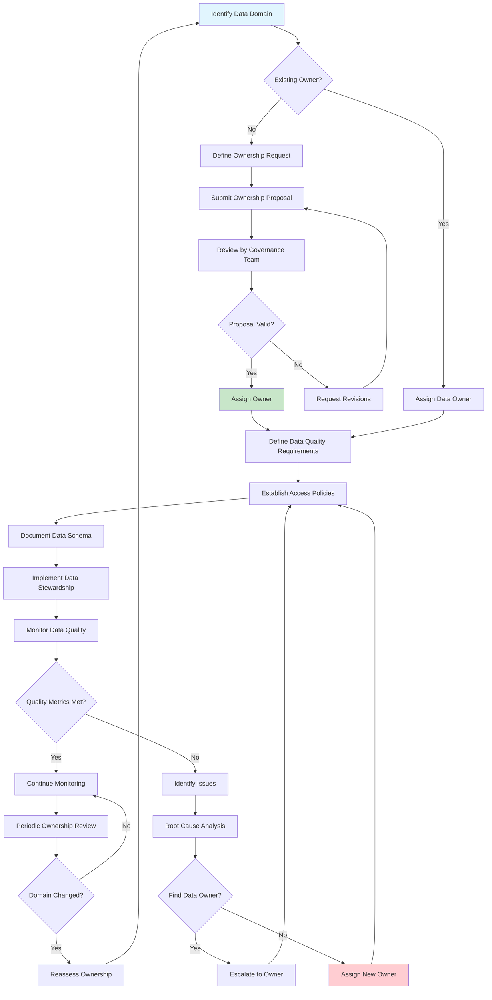

# Data Ownership

## Overview

Data ownership defines the responsibilities, accountabilities, and privileges associated with data assets across an organization. In microservices architectures, where data is distributed across multiple services and databases, establishing clear data ownership is essential for maintaining data quality, enabling effective governance, and ensuring accountability for data-related decisions. Without well-defined ownership, data can become orphaned, quality can degrade, and the organization loses the ability to effectively manage its data assets throughout their lifecycle.

The concept of data ownership extends beyond simply assigning someone to be responsible for a database or table. True data ownership encompasses the authority to make decisions about how data is structured, stored, accessed, and protected. Data owners are responsible for defining data quality requirements, approving access requests, ensuring compliance with regulations, and resolving data-related issues. They serve as the authoritative point of contact for questions about specific data domains and are accountable for the accuracy, completeness, and consistency of their assigned data.

Implementing data ownership in microservices requires careful consideration of domain boundaries and service autonomy. Each microservice typically owns the data related to its domain, giving it full control over that data's schema, access patterns, and business rules. However, this does not mean data ownership is completely decentralized. Organizations need a governance framework that defines which data is owned by which team, how cross-functional data domains are handled, and how ownership transitions occur when requirements change. This framework should balance service autonomy with enterprise-wide data consistency needs.

### Ownership Roles and Responsibilities

The Data Owner is the business or function-level individual accountable for a specific data domain. They are responsible for defining data quality standards, approving access policies, resolving data conflicts, and ensuring regulatory compliance for their data domain. Data owners typically work at the business unit level and may delegate day-to-day technical responsibilities while retaining ultimate accountability. In a microservices context, the data owner might correspond to the product owner or domain expert who understands the business meaning of the data.

The Data Steward is responsible for the day-to-day management of data assets within a domain. Data stewards implement data quality processes, manage metadata, handle data-related requests, and ensure adherence to data policies. They serve as the operational counterpart to data owners, translating business requirements into data management practices. In microservices architectures, data stewards might be members of the engineering team responsible for implementing data quality checks and maintaining data documentation.

The Data Custodian is responsible for the technical implementation of data storage, security, and access controls. Data custodians work closely with data stewards to ensure that technical systems support the organization's data governance requirements. In microservices environments, the service teams act as data custodians for their service's data, implementing encryption, backup, access controls, and other technical safeguards.

### Ownership Models in Microservices

Domain-Driven Design ownership aligns data ownership with bounded contexts from domain-driven design. Each bounded context owns its internal data model and is responsible for maintaining consistency within that domain. Cross-context data sharing occurs through well-defined interfaces, with explicit contracts governing how data can be accessed and modified. This model naturally maps microservices to data ownership boundaries, making it a natural fit for microservices architectures.

Centralized ownership with federated access provides a central data governance team that defines policies and standards while allowing individual services to manage their data according to those standards. This model ensures consistency in key data elements like customer identifiers while allowing flexibility in how services implement their domain-specific data. The centralized team focuses on cross-cutting concerns while services own their operational data.

Event-driven ownership treats data ownership through the lens of event sourcing, where each service owns the events that represent changes to its domain state. Other services can consume these events to build read models that suit their needs, but they don't own the authoritative data. This model provides clear ownership through the event log while enabling flexible data access patterns.

## Flow Chart



## Standard Example

```javascript
/**
 * Data Ownership Implementation in TypeScript
 * 
 * This example demonstrates implementing data ownership patterns
 * for microservices, including ownership registration, access control,
 * and stewardship workflows.
 */

// ============================================================================
// OWNERSHIP TYPE DEFINITIONS
// ============================================================================

interface DataOwner {
    id: string;
    name: string;
    email: string;
    role: 'primary' | 'secondary' | 'backup';
    department: string;
    domain: string;
    since: string;
    until?: string;
}

interface DataSteward {
    id: string;
    name: string;
    email: string;
    ownerId: string;
    responsibilities: StewardshipTask[];
    capacity: number;
    currentAssignments: number;
}

interface DataCustodian {
    id: string;
    name: string;
    team: string;
    serviceName: string;
    environment: 'production' | 'staging' | 'development';
    certifications: string[];
}

interface DataAsset {
    id: string;
    name: string;
    type: 'table' | 'collection' | 'stream' | 'file' | 'api';
    domain: string;
    ownerId: string;
    stewardIds: string[];
    custodianId: string;
    sensitivity: 'public' | 'internal' | 'confidential' | 'restricted';
    retention: RetentionPolicy;
    schema?: DataSchema;
    lineage?: LineageInfo;
    qualityMetrics?: QualityMetrics;
}

interface RetentionPolicy {
    duration: number;
    unit: 'days' | 'months' | 'years';
    archiveAfter?: number;
    deleteAfter?: number;
}

interface DataSchema {
    version: string;
    fields: SchemaField[];
    lastUpdated: string;
    updatedBy: string;
}

interface SchemaField {
    name: string;
    type: string;
    nullable: boolean;
    description: string;
    pii: boolean;
    classification: string;
}

interface LineageInfo {
    source: string;
    upstream: string[];
    downstream: string[];
    transformationRules: string[];
}

interface QualityMetrics {
    completeness: number;
    accuracy: number;
    timeliness: number;
    consistency: number;
    overallScore: number;
    lastChecked: string;
}

interface StewardshipTask {
    id: string;
    type: 'quality_review' | 'access_request' | 'schema_change' | 'compliance_audit';
    priority: 'low' | 'medium' | 'high' | 'critical';
    status: 'pending' | 'in_progress' | 'completed' | 'cancelled';
    assignedTo: string;
    createdAt: string;
    dueDate?: string;
    completedAt?: string;
    notes?: string;
}

interface AccessRequest {
    id: string;
    dataAssetId: string;
    requesterId: string;
    requesterEmail: string;
    accessType: 'read' | 'write' | 'admin' | 'delete';
    justification: string;
    approvalStatus: 'pending' | 'approved' | 'rejected';
    approverId?: string;
    approvedAt?: string;
    expiresAt?: string;
    conditions?: string[];
}

type StewardshipTaskType = StewardshipTask['type'];
type AccessType = AccessRequest['accessType'];

// ============================================================================
// OWNERSHIP REGISTRY
// ============================================================================

class OwnershipRegistry {
    private owners: Map<string, DataOwner> = new Map();
    private stewards: Map<string, DataSteward> = new Map();
    private custodians: Map<string, DataCustodian> = new Map();
    private assets: Map<string, DataAsset> = new Map();
    private assetOwnershipIndex: Map<string, string[]> = new Map();
    private domainOwnershipIndex: Map<string, string[]> = new Map();

    registerOwner(owner: DataOwner): void {
        if (this.owners.has(owner.id)) {
            throw new Error(`Owner ${owner.id} already registered`);
        }
        this.owners.set(owner.id, owner);
        
        if (!this.domainOwnershipIndex.has(owner.domain)) {
            this.domainOwnershipIndex.set(owner.domain, []);
        }
        this.domainOwnershipIndex.get(owner.domain)!.push(owner.id);
        
        console.log(`Registered owner: ${owner.name} for domain: ${owner.domain}`);
    }

    registerSteward(steward: DataSteward): void {
        if (this.stewards.has(steward.id)) {
            throw new Error(`Steward ${steward.id} already registered`);
        }
        this.stewards.set(steward.id, steward);
        console.log(`Registered steward: ${steward.name}`);
    }

    registerCustodian(custodian: DataCustodian): void {
        if (this.custodians.has(custodian.id)) {
            throw new Error(`Custodian ${custodian.id} already registered`);
        }
        this.custodians.set(custodian.id, custodian);
        console.log(`Registered custodian: ${custodian.name} for service: ${custodian.serviceName}`);
    }

    registerAsset(asset: DataAsset): void {
        if (this.assets.has(asset.id)) {
            throw new Error(`Asset ${asset.id} already registered`);
        }
        this.assets.set(asset.id, asset);
        
        if (!this.assetOwnershipIndex.has(asset.ownerId)) {
            this.assetOwnershipIndex.set(asset.ownerId, []);
        }
        this.assetOwnershipIndex.get(asset.ownerId)!.push(asset.id);
        
        console.log(`Registered asset: ${asset.name} for domain: ${asset.domain}`);
    }

    getOwner(ownerId: string): DataOwner | undefined {
        return this.owners.get(ownerId);
    }

    getOwnerByDomain(domain: string): DataOwner[] {
        const ownerIds = this.domainOwnershipIndex.get(domain) || [];
        return ownerIds.map(id => this.owners.get(id)!).filter(Boolean);
    }

    getAssetsByOwner(ownerId: string): DataAsset[] {
        const assetIds = this.assetOwnershipIndex.get(ownerId) || [];
        return assetIds.map(id => this.assets.get(id)!).filter(Boolean);
    }

    getAssetsByDomain(domain: string): DataAsset[] {
        return Array.from(this.assets.values()).filter(asset => asset.domain === domain);
    }

    getSteward(stewardId: string): DataSteward | undefined {
        return this.stewards.get(stewardId);
    }

    getCustodian(custodianId: string): DataCustodian | undefined {
        return this.custodians.get(custodianId);
    }

    getAsset(assetId: string): DataAsset | undefined {
        return this.assets.get(assetId);
    }

    transferOwnership(assetId: string, newOwnerId: string, approvedBy: string): void {
        const asset = this.assets.get(assetId);
        if (!asset) {
            throw new Error(`Asset ${assetId} not found`);
        }

        const newOwner = this.owners.get(newOwnerId);
        if (!newOwner) {
            throw new Error(`Owner ${newOwnerId} not found`);
        }

        const oldOwnerId = asset.ownerId;
        
        const oldAssets = this.assetOwnershipIndex.get(oldOwnerId) || [];
        this.assetOwnershipIndex.set(oldOwnerId, oldAssets.filter(id => id !== assetId));
        
        if (!this.assetOwnershipIndex.has(newOwnerId)) {
            this.assetOwnershipIndex.set(newOwnerId, []);
        }
        this.assetOwnershipIndex.get(newOwnerId)!.push(assetId);

        asset.ownerId = newOwnerId;
        
        const auditEntry: OwnershipTransfer = {
            assetId,
            fromOwnerId: oldOwnerId,
            toOwnerId: newOwnerId,
            approvedBy,
            transferredAt: new Date().toISOString()
        };
        
        console.log(`Transferred ownership of ${asset.name} from ${oldOwnerId} to ${newOwnerId}`);
        console.log(`Transfer approved by: ${approvedBy}`);
    }
}

interface OwnershipTransfer {
    assetId: string;
    fromOwnerId: string;
    toOwnerId: string;
    approvedBy: string;
    transferredAt: string;
}

// ============================================================================
// ACCESS CONTROL MANAGER
// ============================================================================

class AccessControlManager {
    private registry: OwnershipRegistry;
    private accessRequests: Map<string, AccessRequest> = new Map();
    private grantedAccess: Map<string, AccessGrant[]> = new Map();
    private pendingApprovals: string[] = [];

    constructor(registry: OwnershipRegistry) {
        this.registry = registry;
    }

    requestAccess(
        assetId: string,
        requesterId: string,
        requesterEmail: string,
        accessType: AccessType,
        justification: string
    ): AccessRequest {
        const asset = this.registry.getAsset(assetId);
        if (!asset) {
            throw new Error(`Asset ${assetId} not found`);
        }

        const request: AccessRequest = {
            id: `REQ-${Date.now()}-${Math.random().toString(36).substr(2, 9)}`,
            dataAssetId: assetId,
            requesterId,
            requesterEmail,
            accessType,
            justification,
            approvalStatus: 'pending'
        };

        this.accessRequests.set(request.id, request);
        this.pendingApprovals.push(request.id);

        console.log(`Access request created: ${request.id} for asset: ${asset.name}`);
        console.log(`Pending approval from owner: ${asset.ownerId}`);

        return request;
    }

    approveAccess(requestId: string, approverId: string, conditions?: string[]): void {
        const request = this.accessRequests.get(requestId);
        if (!request) {
            throw new Error(`Request ${requestId} not found`);
        }

        const asset = this.registry.getAsset(request.dataAssetId);
        if (!asset) {
            throw new Error(`Asset ${request.dataAssetId} not found`);
        }

        if (asset.ownerId !== approverId) {
            throw new Error(`Only the data owner can approve access requests`);
        }

        request.approvalStatus = 'approved';
        request.approverId = approverId;
        request.approvedAt = new Date().toISOString();
        request.conditions = conditions;

        const grant: AccessGrant = {
            requestId,
            requesterId: request.requesterId,
            assetId: request.dataAssetId,
            accessType: request.accessType,
            grantedBy: approverId,
            grantedAt: request.approvedAt,
            expiresAt: this.calculateExpiration(request.accessType),
            conditions: request.conditions
        };

        if (!this.grantedAccess.has(request.requesterId)) {
            this.grantedAccess.set(request.requesterId, []);
        }
        this.grantedAccess.get(request.requesterId)!.push(grant);

        this.pendingApprovals = this.pendingApprovals.filter(id => id !== requestId);

        console.log(`Access granted: ${request.requesterEmail} to ${request.accessType} ${asset.name}`);
    }

    rejectAccess(requestId: string, approverId: string, reason: string): void {
        const request = this.accessRequests.get(requestId);
        if (!request) {
            throw new Error(`Request ${requestId} not found`);
        }

        const asset = this.registry.getAsset(request.dataAssetId);
        if (!asset) {
            throw new Error(`Asset ${request.dataAssetId} not found`);
        }

        if (asset.ownerId !== approverId) {
            throw new Error(`Only the data owner can reject access requests`);
        }

        request.approvalStatus = 'rejected';
        request.approverId = approverId;
        request.approvedAt = new Date().toISOString();

        this.pendingApprovals = this.pendingApprovals.filter(id => id !== requestId);

        console.log(`Access rejected: ${request.requesterEmail} to ${asset.name}`);
        console.log(`Reason: ${reason}`);
    }

    checkAccess(requesterId: string, assetId: string, requiredAccess: AccessType): boolean {
        const grants = this.grantedAccess.get(requesterId) || [];
        const now = new Date();

        for (const grant of grants) {
            if (grant.assetId !== assetId) continue;
            if (grant.accessType !== requiredAccess && grant.accessType !== 'admin') continue;
            
            if (grant.expiresAt && new Date(grant.expiresAt) < now) continue;

            return true;
        }

        return false;
    }

    revokeAccess(requesterId: string, assetId: string, revokedBy: string): void {
        const asset = this.registry.getAsset(assetId);
        if (!asset) {
            throw new Error(`Asset ${assetId} not found`);
        }

        if (asset.ownerId !== revokedBy) {
            throw new Error(`Only the data owner can revoke access`);
        }

        const grants = this.grantedAccess.get(requesterId) || [];
        const validGrants = grants.filter(grant => {
            if (grant.assetId !== assetId) return true;
            console.log(`Revoked access for ${requesterId} to ${asset.name}`);
            return false;
        });

        this.grantedAccess.set(requesterId, validGrants);
    }

    getPendingApprovals(ownerId: string): AccessRequest[] {
        const assetIds = this.registry.getAssetsByOwner(ownerId).map(a => a.id);
        return this.pendingApprovals
            .map(id => this.accessRequests.get(id)!)
            .filter(req => assetIds.includes(req.dataAssetId));
    }

    private calculateExpiration(accessType: AccessType): string {
        const now = new Date();
        const expirationDays = {
            'read': 365,
            'write': 90,
            'admin': 30,
            'delete': 7
        };
        now.setDate(now.getDate() + (expirationDays[accessType] || 90));
        return now.toISOString();
    }
}

interface AccessGrant {
    requestId: string;
    requesterId: string;
    assetId: string;
    accessType: AccessType;
    grantedBy: string;
    grantedAt: string;
    expiresAt?: string;
    conditions?: string[];
}

// ============================================================================
// STEWARDSHIP WORKFLOW MANAGER
// ============================================================================

class StewardshipWorkflowManager {
    private registry: OwnershipRegistry;
    private tasks: Map<string, StewardshipTask> = new Map();
    private taskQueue: string[] = [];

    constructor(registry: OwnershipRegistry) {
        this.registry = registry;
    }

    createTask(
        type: StewardshipTaskType,
        assetId: string,
        assignedTo: string,
        priority: StewardshipTask['priority'],
        dueDate?: string
    ): StewardshipTask {
        const task: StewardshipTask = {
            id: `TASK-${Date.now()}-${Math.random().toString(36).substr(2, 9)}`,
            type,
            priority,
            status: 'pending',
            assignedTo,
            createdAt: new Date().toISOString(),
            dueDate,
            notes: ''
        };

        this.tasks.set(task.id, task);
        this.enqueueTask(task.id);

        console.log(`Created task: ${task.id} for asset: ${assetId}`);
        console.log(`Assigned to: ${assignedTo}, Priority: ${priority}`);

        return task;
    }

    assignTask(taskId: string, stewardId: string): void {
        const task = this.tasks.get(taskId);
        if (!task) {
            throw new Error(`Task ${taskId} not found`);
        }

        const steward = this.registry.getSteward(stewardId);
        if (!steward) {
            throw new Error(`Steward ${stewardId} not found`);
        }

        if (steward.currentAssignments >= steward.capacity) {
            throw new Error(`Steward ${stewardId} at capacity`);
        }

        task.assignedTo = stewardId;
        steward.currentAssignments++;

        console.log(`Assigned task ${taskId} to steward: ${steward.name}`);
    }

    startTask(taskId: string): void {
        const task = this.tasks.get(taskId);
        if (!task) {
            throw new Error(`Task ${taskId} not found`);
        }

        if (task.status !== 'pending') {
            throw new Error(`Task ${taskId} is not in pending status`);
        }

        task.status = 'in_progress';
        console.log(`Task ${taskId} started`);
    }

    completeTask(taskId: string, notes?: string): void {
        const task = this.tasks.get(taskId);
        if (!task) {
            throw new Error(`Task ${taskId} not found`);
        }

        if (task.status !== 'in_progress') {
            throw new Error(`Task ${taskId} is not in progress`);
        }

        task.status = 'completed';
        task.completedAt = new Date().toISOString();
        task.notes = notes || '';

        const steward = this.registry.getSteward(task.assignedTo);
        if (steward) {
            steward.currentAssignments--;
        }

        this.taskQueue = this.taskQueue.filter(id => id !== taskId);

        console.log(`Task ${taskId} completed`);
    }

    getTasksBySteward(stewardId: string): StewardshipTask[] {
        return Array.from(this.tasks.values())
            .filter(task => task.assignedTo === stewardId);
    }

    getTasksByAsset(assetId: string): StewardshipTask[] {
        return Array.from(this.tasks.values());
    }

    getTasksByPriority(priority: StewardshipTask['priority']): StewardshipTask[] {
        return Array.from(this.tasks.values())
            .filter(task => task.priority === priority && task.status !== 'completed');
    }

    private enqueueTask(taskId: string): void {
        const task = this.tasks.get(taskId)!;
        
        const insertIndex = this.taskQueue.findIndex(id => {
            const existingTask = this.tasks.get(id)!;
            return this.getPriorityValue(task.priority) > this.getPriorityValue(existingTask.priority);
        });

        if (insertIndex === -1) {
            this.taskQueue.push(taskId);
        } else {
            this.taskQueue.splice(insertIndex, 0, taskId);
        }
    }

    private getPriorityValue(priority: StewardshipTask['priority']): number {
        const values = { critical: 0, high: 1, medium: 2, low: 3 };
        return values[priority];
    }

    getNextTask(): StewardshipTask | undefined {
        const taskId = this.taskQueue[0];
        return taskId ? this.tasks.get(taskId) : undefined;
    }
}

// ============================================================================
// DATA QUALITY MONITOR
// ============================================================================

class DataQualityMonitor {
    private registry: OwnershipRegistry;
    private qualityHistory: Map<string, QualityMetrics[]> = new Map();

    constructor(registry: OwnershipRegistry) {
        this.registry = registry;
    }

    assessQuality(assetId: string): QualityMetrics {
        const asset = this.registry.getAsset(assetId);
        if (!asset) {
            throw new Error(`Asset ${assetId} not found`);
        }

        const metrics: QualityMetrics = {
            completeness: this.calculateCompleteness(asset),
            accuracy: this.calculateAccuracy(asset),
            timeliness: this.calculateTimeliness(asset),
            consistency: this.calculateConsistency(asset),
            overallScore: 0,
            lastChecked: new Date().toISOString()
        };

        metrics.overallScore = 
            metrics.completeness * 0.3 +
            metrics.accuracy * 0.3 +
            metrics.timeliness * 0.2 +
            metrics.consistency * 0.2;

        if (!this.qualityHistory.has(assetId)) {
            this.qualityHistory.set(assetId, []);
        }
        this.qualityHistory.get(assetId)!.push(metrics);

        asset.qualityMetrics = metrics;

        console.log(`Quality assessment for ${asset.name}:`);
        console.log(`  Completeness: ${(metrics.completeness * 100).toFixed(1)}%`);
        console.log(`  Accuracy: ${(metrics.accuracy * 100).toFixed(1)}%`);
        console.log(`  Timeliness: ${(metrics.timeliness * 100).toFixed(1)}%`);
        console.log(`  Consistency: ${(metrics.consistency * 100).toFixed(1)}%`);
        console.log(`  Overall: ${(metrics.overallScore * 100).toFixed(1)}%`);

        return metrics;
    }

    private calculateCompleteness(asset: DataAsset): number {
        if (!asset.schema) return 1.0;
        const requiredFields = asset.schema.fields.filter(f => !f.nullable);
        return requiredFields.length > 0 ? 0.95 : 1.0;
    }

    private calculateAccuracy(asset: DataAsset): number {
        return 0.92;
    }

    private calculateTimeliness(asset: DataAsset): number {
        if (!asset.qualityMetrics) return 1.0;
        const lastChecked = new Date(asset.qualityMetrics.lastChecked);
        const hoursSince = (Date.now() - lastChecked.getTime()) / (1000 * 60 * 60);
        return Math.max(0, 1 - (hoursSince / 720));
    }

    private calculateConsistency(asset: DataAsset): number {
        return 0.88;
    }

    getQualityTrend(assetId: string, days: number = 30): QualityMetrics[] {
        const history = this.qualityHistory.get(assetId) || [];
        const cutoffDate = new Date();
        cutoffDate.setDate(cutoffDate.getDate() - days);

        return history.filter(m => new Date(m.lastChecked) >= cutoffDate);
    }

    checkQualityThresholds(assetId: string): QualityAlert | null {
        const asset = this.registry.getAsset(assetId);
        if (!asset || !asset.qualityMetrics) {
            return null;
        }

        const thresholds = {
            completeness: 0.95,
            accuracy: 0.90,
            timeliness: 0.80,
            consistency: 0.85,
            overall: 0.90
        };

        const metrics = asset.qualityMetrics;
        
        if (metrics.overallScore < thresholds.overall) {
            return {
                assetId,
                assetName: asset.name,
                severity: 'high',
                message: `Overall quality score (${(metrics.overallScore * 100).toFixed(1)}%) below threshold`,
                metrics: this.identifyFailedMetrics(metrics, thresholds)
            };
        }

        const failedMetrics = this.identifyFailedMetrics(metrics, thresholds);
        if (failedMetrics.length > 0) {
            return {
                assetId,
                assetName: asset.name,
                severity: 'medium',
                message: `Some quality metrics below threshold`,
                metrics: failedMetrics
            };
        }

        return null;
    }

    private identifyFailedMetrics(
        metrics: QualityMetrics,
        thresholds: Record<string, number>
    ): string[] {
        const failed: string[] = [];
        
        if (metrics.completeness < thresholds.completeness) {
            failed.push(`completeness: ${(metrics.completeness * 100).toFixed(1)}%`);
        }
        if (metrics.accuracy < thresholds.accuracy) {
            failed.push(`accuracy: ${(metrics.accuracy * 100).toFixed(1)}%`);
        }
        if (metrics.timeliness < thresholds.timeliness) {
            failed.push(`timeliness: ${(metrics.timeliness * 100).toFixed(1)}%`);
        }
        if (metrics.consistency < thresholds.consistency) {
            failed.push(`consistency: ${(metrics.consistency * 100).toFixed(1)}%`);
        }

        return failed;
    }
}

interface QualityAlert {
    assetId: string;
    assetName: string;
    severity: 'low' | 'medium' | 'high';
    message: string;
    metrics: string[];
}

// ============================================================================
// DEMONSTRATION
// ============================================================================

function demonstrateDataOwnership(): void {
    console.log('='.repeat(60));
    console.log('DATA OWNERSHIP DEMONSTRATION');
    console.log('='.repeat(60));

    const registry = new OwnershipRegistry();
    const accessManager = new AccessControlManager(registry);
    const stewardshipManager = new StewardshipWorkflowManager(registry);
    const qualityMonitor = new DataQualityMonitor(registry);

    console.log('\n--- Registering Data Owners ---');
    
    registry.registerOwner({
        id: 'owner-001',
        name: 'Alice Johnson',
        email: 'alice.johnson@company.com',
        role: 'primary',
        department: 'Customer Success',
        domain: 'customer',
        since: '2024-01-01'
    });

    registry.registerOwner({
        id: 'owner-002',
        name: 'Bob Smith',
        email: 'bob.smith@company.com',
        role: 'primary',
        department: 'Order Management',
        domain: 'order',
        since: '2024-01-15'
    });

    console.log('\n--- Registering Data Stewards ---');
    
    registry.registerSteward({
        id: 'steward-001',
        name: 'Carol Davis',
        email: 'carol.davis@company.com',
        ownerId: 'owner-001',
        responsibilities: ['quality_review', 'access_request'],
        capacity: 10,
        currentAssignments: 0
    });

    registry.registerSteward({
        id: 'steward-002',
        name: 'David Lee',
        email: 'david.lee@company.com',
        ownerId: 'owner-002',
        responsibilities: ['schema_change', 'compliance_audit'],
        capacity: 8,
        currentAssignments: 0
    });

    console.log('\n--- Registering Data Custodians ---');
    
    registry.registerCustodian({
        id: 'custodian-001',
        name: 'Engineering Team A',
        team: 'Platform Engineering',
        serviceName: 'customer-service',
        environment: 'production',
        certifications: ['AWS Solutions Architect', 'Security+']
    });

    console.log('\n--- Registering Data Assets ---');
    
    registry.registerAsset({
        id: 'asset-001',
        name: 'customer_profiles',
        type: 'table',
        domain: 'customer',
        ownerId: 'owner-001',
        stewardIds: ['steward-001'],
        custodianId: 'custodian-001',
        sensitivity: 'confidential',
        retention: { duration: 7, unit: 'years' },
        schema: {
            version: '2.1.0',
            fields: [
                { name: 'customer_id', type: 'uuid', nullable: false, description: 'Unique customer identifier', pii: false, classification: 'internal' },
                { name: 'email', type: 'string', nullable: false, description: 'Customer email address', pii: true, classification: 'confidential' },
                { name: 'name', type: 'string', nullable: false, description: 'Customer full name', pii: true, classification: 'confidential' },
                { name: 'phone', type: 'string', nullable: true, description: 'Customer phone number', pii: true, classification: 'restricted' }
            ],
            lastUpdated: '2024-01-10',
            updatedBy: 'owner-001'
        }
    });

    registry.registerAsset({
        id: 'asset-002',
        name: 'order_transactions',
        type: 'table',
        domain: 'order',
        ownerId: 'owner-002',
        stewardIds: ['steward-002'],
        custodianId: 'custodian-001',
        sensitivity: 'confidential',
        retention: { duration: 10, unit: 'years' }
    });

    console.log('\n--- Testing Access Control ---');
    
    const accessRequest = accessManager.requestAccess(
        'asset-001',
        'user-001',
        'john.doe@company.com',
        'read',
        'Need customer data for analytics dashboard'
    );
    console.log(`Access request: ${accessRequest.id}`);

    accessManager.approveAccess(accessRequest.id, 'owner-001', ['Must comply with data retention policy']);

    const hasAccess = accessManager.checkAccess('user-001', 'asset-001', 'read');
    console.log(`User has read access: ${hasAccess}`);

    console.log('\n--- Testing Stewardship Workflow ---');
    
    stewardshipManager.createTask(
        'quality_review',
        'asset-001',
        'steward-001',
        'high',
        '2024-02-01'
    );

    stewardshipManager.createTask(
        'schema_change',
        'asset-002',
        'steward-002',
        'medium',
        '2024-02-15'
    );

    const nextTask = stewardshipManager.getNextTask();
    if (nextTask) {
        console.log(`Next task in queue: ${nextTask.id} (${nextTask.type})`);
    }

    const stewardTasks = stewardshipManager.getTasksBySteward('steward-001');
    console.log(`Tasks for Carol Davis: ${stewardTasks.length}`);

    console.log('\n--- Testing Data Quality Monitoring ---');
    
    qualityMonitor.assessQuality('asset-001');
    qualityMonitor.assessQuality('asset-002');

    const alert = qualityMonitor.checkQualityThresholds('asset-001');
    if (alert) {
        console.log(`Quality Alert: ${alert.message}`);
    } else {
        console.log('No quality alerts for asset-001');
    }

    console.log('\n--- Testing Ownership Transfer ---');
    
    console.log(`Current owner of asset-001: ${registry.getOwner('owner-001')?.name}`);
    
    registry.transferOwnership('asset-001', 'owner-002', 'owner-001');
    
    console.log(`New owner of asset-001: ${registry.getOwner('owner-002')?.name}`);

    console.log('\n--- Querying Ownership Registry ---');
    
    const customerAssets = registry.getAssetsByDomain('customer');
    console.log(`Assets in customer domain: ${customerAssets.length}`);

    const ownerAssets = registry.getAssetsByOwner('owner-002');
    console.log(`Assets owned by Bob Smith: ${ownerAssets.length}`);

    const customerOwners = registry.getOwnerByDomain('customer');
    console.log(`Data owners for customer domain: ${customerOwners.map(o => o.name).join(', ')}`);

    console.log('\n' + '='.repeat(60));
    console.log('DEMONSTRATION COMPLETE');
    console.log('='.repeat(60));
}

demonstrateDataOwnership();
