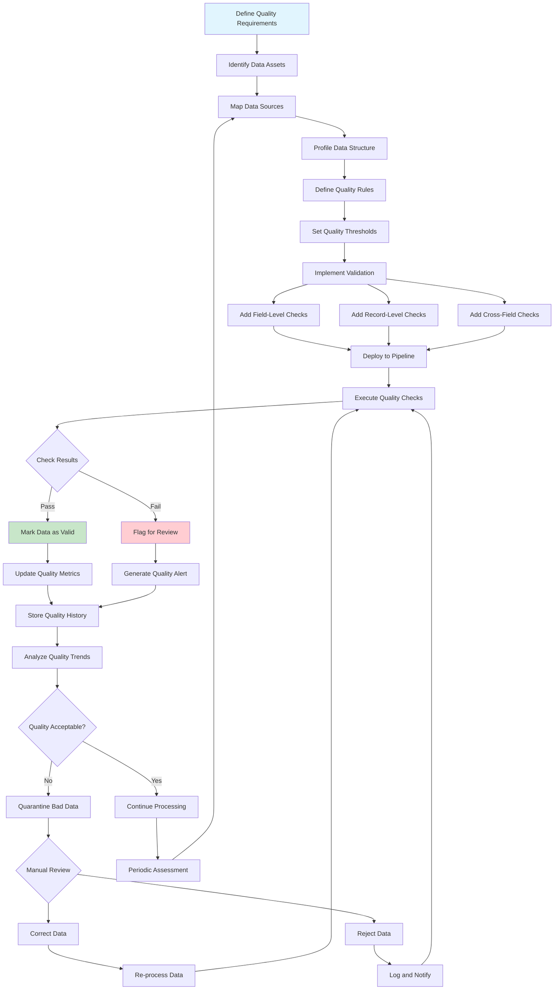

# Data Quality

## Overview

Data quality management ensures that data is accurate, complete, consistent, valid, and timely for its intended use. In microservices architectures, where data is distributed across multiple services and often flows through complex pipelines, maintaining high data quality becomes a significant challenge. Poor data quality can lead to incorrect business decisions, failed transactions, customer dissatisfaction, and regulatory compliance issues. Implementing comprehensive data quality management is essential for building reliable microservices systems that can be trusted for critical business operations.

The dimensions of data quality provide a framework for understanding and measuring data quality. Accuracy measures how closely data reflects the real-world values it represents. Completeness refers to the presence of all required data values without missing entries. Consistency ensures that data values are coherent across different systems and within the same dataset. Validity checks whether data conforms to defined rules, formats, and constraints. Timeliness measures whether data is current enough for its intended purpose. Each of these dimensions requires specific techniques and tools to assess and improve.

Data quality management in microservices requires a multi-layered approach. At the service level, each microservice is responsible for validating incoming data and maintaining quality for its owned data. At the integration level, data quality checks should occur at service boundaries when data is received or sent. At the enterprise level, centralized data quality monitoring provides visibility into the overall health of data across the organization. This distributed but coordinated approach ensures that data quality is maintained throughout the data lifecycle.

### Data Quality Rules and Validation

Business rules define the constraints and relationships that data must satisfy to be considered valid. These rules capture domain knowledge and business logic that go beyond simple type checking. For example, a business rule might specify that an order's total amount must equal the sum of line items, or that a customer's age must be non-negative, or that a shipping address must include both city and country. Business rules should be documented alongside data definitions and enforced consistently across all systems that process the data.

Referential integrity ensures that relationships between data entities remain valid. In microservices, where related data may be distributed across services, maintaining referential integrity requires careful API design and coordination. Foreign key relationships should be validated when data is created or modified, and orphan records should be detected and resolved. Event-driven architectures can help maintain referential integrity by ensuring that related data changes are coordinated through transactions or compensating actions.

Cross-field validation examines relationships between multiple fields within a record. This type of validation ensures that the combination of values is logically consistent, such as checking that a start date is before an end date, or that a country-state combination is valid. Cross-field validation rules should be defined as part of the data schema and enforced at data entry points.

### Data Quality Measurement and Monitoring

Data quality metrics provide quantitative measures of data quality dimensions. These metrics should be collected regularly and tracked over time to identify trends and improvements. Key metrics include the percentage of records with complete required fields, the error rate for validation rules, the age of data relative to when it was created or modified, and the rate of duplicate records. Dashboards and alerts help stakeholders stay informed about data quality status.

Data profiling analyzes data to understand its structure, content, and quality. Profiling techniques include discovering data types and formats, identifying value distributions and patterns, detecting anomalies and outliers, finding relationships between datasets, and assessing data quality dimensions. Regular profiling helps identify quality issues that may not be caught by validation rules.

Data cleansing identifies and corrects quality issues in existing data. This includes standardizing inconsistent values, removing duplicate records, filling in missing values where possible, and correcting invalid data. Cleansing should be performed carefully with appropriate tracking of changes, as incorrect cleansing can introduce new errors.

## Flow Chart



## Standard Example

```javascript
/**
 * Data Quality Implementation in TypeScript
 * 
 * This example demonstrates implementing data quality management
 * for microservices, including validation rules, quality metrics,
 * and cleansing operations.
 */

// ============================================================================
// QUALITY TYPE DEFINITIONS
// ============================================================================

interface DataQualityRule {
    id: string;
    name: string;
    description: string;
    type: 'completeness' | 'accuracy' | 'consistency' | 'validity' | 'timeliness';
    severity: 'critical' | 'high' | 'medium' | 'low';
    targetField: string;
    condition: ValidationCondition;
    threshold?: number;
    enabled: boolean;
}

interface ValidationCondition {
    operator: 'equals' | 'not_equals' | 'greater_than' | 'less_than' | 'between' | 'in' | 'not_in' | 'matches' | 'not_null' | 'is_null' | 'custom';
    value?: unknown;
    values?: unknown[];
    pattern?: string;
    customFunction?: string;
}

interface QualityResult {
    ruleId: string;
    ruleName: string;
    recordId: string;
    passed: boolean;
    value?: unknown;
    expected?: unknown;
    message?: string;
    timestamp: string;
}

interface DataQualityReport {
    assetId: string;
    assetName: string;
    totalRecords: number;
    validatedRecords: number;
    passedRecords: number;
    failedRecords: number;
    passRate: number;
    resultsByRule: Map<string, RuleResult>;
    qualityDimensions: QualityDimensionScores;
    generatedAt: string;
    generatedBy: string;
}

interface RuleResult {
    ruleId: string;
    ruleName: string;
    totalChecks: number;
    passedChecks: number;
    failedChecks: number;
    passRate: number;
}

interface QualityDimensionScores {
    completeness: number;
    accuracy: number;
    consistency: number;
    validity: number;
    timeliness: number;
    overall: number;
}

interface DuplicateGroup {
    key: unknown;
    records: Record<string, unknown>[];
    fields: string[];
}

type QualityRuleType = DataQualityRule['type'];

// ============================================================================
// QUALITY RULE ENGINE
// ============================================================================

class QualityRuleEngine {
    private rules: Map<string, DataQualityRule> = new Map();
    private results: QualityResult[] = [];
    private customValidators: Map<string, (value: unknown) => boolean> = new Map();

    registerRule(rule: DataQualityRule): void {
        if (this.rules.has(rule.id)) {
            throw new Error(`Rule ${rule.id} already exists`);
        }
        this.rules.set(rule.id, rule);
        console.log(`Registered quality rule: ${rule.name}`);
    }

    registerCustomValidator(name: string, validator: (value: unknown) => boolean): void {
        this.customValidators.set(name, validator);
    }

    validateRecord(record: Record<string, unknown>, recordId: string): QualityResult[] {
        const results: QualityResult[] = [];

        for (const rule of this.rules.values()) {
            if (!rule.enabled) continue;

            const fieldValue = record[rule.targetField];
            const result = this.validateField(fieldValue, rule, recordId);
            results.push(result);
        }

        this.results.push(...results);
        return results;
    }

    validateRecords(records: Record<string, unknown>[], idField: string = 'id'): DataQualityReport {
        const resultsByRule = new Map<string, RuleResult>();
        let totalPassed = 0;
        let totalFailed = 0;

        for (const record of records) {
            const recordId = String(record[idField] || 'unknown');
            const recordResults = this.validateRecord(record, recordId);

            for (const result of recordResults) {
                if (!resultsByRule.has(result.ruleId)) {
                    resultsByRule.set(result.ruleId, {
                        ruleId: result.ruleId,
                        ruleName: result.ruleName,
                        totalChecks: 0,
                        passedChecks: 0,
                        failedChecks: 0,
                        passRate: 0
                    });
                }

                const ruleResult = resultsByRule.get(result.ruleId)!;
                ruleResult.totalChecks++;
                
                if (result.passed) {
                    ruleResult.passedChecks++;
                } else {
                    ruleResult.failedChecks++;
                }
            }

            const allPassed = recordResults.every(r => r.passed);
            if (allPassed) {
                totalPassed++;
            } else {
                totalFailed++;
            }
        }

        for (const ruleResult of resultsByRule.values()) {
            ruleResult.passRate = ruleResult.totalChecks > 0 
                ? ruleResult.passedChecks / ruleResult.totalChecks 
                : 0;
        }

        const passRate = records.length > 0 ? totalPassed / records.length : 0;

        const dimensionScores = this.calculateDimensionScores(resultsByRule);

        return {
            assetId: 'unknown',
            assetName: 'Unknown',
            totalRecords: records.length,
            validatedRecords: records.length,
            passedRecords: totalPassed,
            failedRecords: totalFailed,
            passRate,
            resultsByRule,
            qualityDimensions: dimensionScores,
            generatedAt: new Date().toISOString(),
            generatedBy: 'QualityRuleEngine'
        };
    }

    private validateField(value: unknown, rule: DataQualityRule, recordId: string): QualityResult {
        const condition = rule.condition;
        let passed = false;
        let message = '';

        try {
            switch (condition.operator) {
                case 'not_null':
                    passed = value !== null && value !== undefined;
                    message = passed ? '' : `Value is null or undefined`;
                    break;

                case 'is_null':
                    passed = value === null || value === undefined;
                    message = passed ? '' : `Value is not null`;
                    break;

                case 'equals':
                    passed = value === condition.value;
                    message = passed ? '' : `Expected ${condition.value}, got ${value}`;
                    break;

                case 'not_equals':
                    passed = value !== condition.value;
                    message = passed ? '' : `Value should not equal ${condition.value}`;
                    break;

                case 'greater_than':
                    passed = Number(value) > Number(condition.value);
                    message = passed ? '' : `Value must be greater than ${condition.value}`;
                    break;

                case 'less_than':
                    passed = Number(value) < Number(condition.value);
                    message = passed ? '' : `Value must be less than ${condition.value}`;
                    break;

                case 'between':
                    const numValue = Number(value);
                    const [min, max] = condition.values as number[];
                    passed = numValue >= min && numValue <= max;
                    message = passed ? '' : `Value must be between ${min} and ${max}`;
                    break;

                case 'in':
                    passed = condition.values!.includes(value);
                    message = passed ? '' : `Value must be one of: ${condition.values!.join(', ')}`;
                    break;

                case 'not_in':
                    passed = !condition.values!.includes(value);
                    message = passed ? '' : `Value must not be one of: ${condition.values!.join(', ')}`;
                    break;

                case 'matches':
                    const regex = new RegExp(condition.pattern!);
                    passed = regex.test(String(value));
                    message = passed ? '' : `Value does not match pattern: ${condition.pattern}`;
                    break;

                case 'custom':
                    const customValidator = this.customValidators.get(condition.customFunction!);
                    if (customValidator) {
                        passed = customValidator(value);
                    } else {
                        passed = false;
                        message = `Custom validator not found: ${condition.customFunction}`;
                    }
                    break;
            }

            if (rule.threshold !== undefined) {
                const thresholdPass = passed;
                passed = thresholdPass;
            }
        } catch (error) {
            passed = false;
            message = `Validation error: ${error}`;
        }

        return {
            ruleId: rule.id,
            ruleName: rule.name,
            recordId,
            passed,
            value,
            expected: condition.value || condition.values,
            message,
            timestamp: new Date().toISOString()
        };
    }

    private calculateDimensionScores(resultsByRule: Map<string, RuleResult>): QualityDimensionScores {
        const scores: Record<string, { total: number; passed: number }> = {
            completeness: { total: 0, passed: 0 },
            accuracy: { total: 0, passed: 0 },
            consistency: { total: 0, passed: 0 },
            validity: { total: 0, passed: 0 },
            timeliness: { total: 0, passed: 0 }
        };

        for (const rule of this.rules.values()) {
            if (!rule.enabled) continue;
            
            const result = resultsByRule.get(rule.id);
            if (!result) continue;

            const dimension = scores[rule.type];
            if (dimension) {
                dimension.total += result.totalChecks;
                dimension.passed += result.passedChecks;
            }
        }

        const calculateScore = (dimension: { total: number; passed: number }) => {
            return dimension.total > 0 ? dimension.passed / dimension.total : 1.0;
        };

        const completeness = calculateScore(scores.completeness);
        const accuracy = calculateScore(scores.accuracy);
        const consistency = calculateScore(scores.consistency);
        const validity = calculateScore(scores.validity);
        const timeliness = calculateScore(scores.timeliness);

        return {
            completeness,
            accuracy,
            consistency,
            validity,
            timeliness,
            overall: (completeness + accuracy + consistency + validity + timeliness) / 5
        };
    }

    getRules(): DataQualityRule[] {
        return Array.from(this.rules.values());
    }

    enableRule(ruleId: string): void {
        const rule = this.rules.get(ruleId);
        if (rule) {
            rule.enabled = true;
            console.log(`Enabled rule: ${rule.name}`);
        }
    }

    disableRule(ruleId: string): void {
        const rule = this.rules.get(ruleId);
        if (rule) {
            rule.enabled = false;
            console.log(`Disabled rule: ${rule.name}`);
        }
    }
}

// ============================================================================
// DATA PROFILER
// ============================================================================

class DataProfiler {
    profile(records: Record<string, unknown>[]): DataProfile {
        if (records.length === 0) {
            return { fields: [], totalRecords: 0 };
        }

        const fields = Object.keys(records[0]);
        const profile: DataProfile = {
            fields: [],
            totalRecords: records.length,
            generatedAt: new Date().toISOString()
        };

        for (const field of fields) {
            const fieldProfile = this.profileField(records, field);
            profile.fields.push(fieldProfile);
        }

        return profile;
    }

    private profileField(records: Record<string, unknown>[], field: string): FieldProfile {
        const values = records.map(r => r[field]);
        const nonNullValues = values.filter(v => v !== null && v !== undefined);
        
        const typeDistribution = this.getTypeDistribution(nonNullValues);
        const valueDistribution = this.getValueDistribution(nonNullValues);
        const statistics = this.getStatistics(nonNullValues);

        return {
            name: field,
            totalCount: values.length,
            nullCount: values.length - nonNullValues.length,
            uniqueCount: new Set(nonNullValues.map(v => JSON.stringify(v))).size,
            typeDistribution,
            valueDistribution: valueDistribution.slice(0, 10),
            statistics,
            patterns: this.detectPatterns(nonNullValues)
        };
    }

    private getTypeDistribution(values: unknown[]): TypeDistribution {
        const distribution: TypeDistribution = {
            string: 0,
            number: 0,
            boolean: 0,
            object: 0,
            array: 0,
            null: 0
        };

        for (const value of values) {
            const type = typeof value;
            if (type === 'string') distribution.string++;
            else if (type === 'number') distribution.number++;
            else if (type === 'boolean') distribution.boolean++;
            else if (type === 'object') {
                if (Array.isArray(value)) distribution.array++;
                else distribution.object++;
            }
        }

        return distribution;
    }

    private getValueDistribution(values: unknown[]): ValueCount[] {
        const counts = new Map<string, number>();
        
        for (const value of values) {
            const key = String(value);
            counts.set(key, (counts.get(key) || 0) + 1);
        }

        return Array.from(counts.entries())
            .map(([value, count]) => ({ value, count }))
            .sort((a, b) => b.count - a.count);
    }

    private getStatistics(values: unknown[]): FieldStatistics | null {
        const numericValues = values.filter(v => typeof v === 'number') as number[];
        
        if (numericValues.length === 0) {
            return null;
        }

        const sorted = [...numericValues].sort((a, b) => a - b);
        const sum = numericValues.reduce((a, b) => a + b, 0);

        return {
            min: sorted[0],
            max: sorted[sorted.length - 1],
            mean: sum / numericValues.length,
            median: sorted[Math.floor(sorted.length / 2)],
            stdDev: this.calculateStdDev(numericValues),
            numericCount: numericValues.length,
            totalCount: values.length
        };
    }

    private calculateStdDev(values: number[]): number {
        const mean = values.reduce((a, b) => a + b, 0) / values.length;
        const squaredDiffs = values.map(v => Math.pow(v - mean, 2));
        return Math.sqrt(squaredDiffs.reduce((a, b) => a + b, 0) / values.length);
    }

    private detectPatterns(values: unknown[]): string[] {
        const patterns: string[] = [];
        const stringValues = values.filter(v => typeof v === 'string') as string[];

        const emailPattern = /^[^\s@]+@[^\s@]+\.[^\s@]+$/;
        const phonePattern = /^\+?[\d\s-]{10,}$/;
        const urlPattern = /^https?:\/\/.+/;
        const datePattern = /^\d{4}-\d{2}-\d{2}/;

        const emailMatches = stringValues.filter(v => emailPattern.test(v)).length;
        const phoneMatches = stringValues.filter(v => phonePattern.test(v)).length;
        const urlMatches = stringValues.filter(v => urlPattern.test(v)).length;
        const dateMatches = stringValues.filter(v => datePattern.test(v)).length;

        if (emailMatches > stringValues.length * 0.5) patterns.push('email');
        if (phoneMatches > stringValues.length * 0.5) patterns.push('phone');
        if (urlMatches > stringValues.length * 0.5) patterns.push('url');
        if (dateMatches > stringValues.length * 0.5) patterns.push('date');

        return patterns;
    }
}

interface DataProfile {
    fields: FieldProfile[];
    totalRecords: number;
    generatedAt: string;
}

interface FieldProfile {
    name: string;
    totalCount: number;
    nullCount: number;
    uniqueCount: number;
    typeDistribution: TypeDistribution;
    valueDistribution: ValueCount[];
    statistics: FieldStatistics | null;
    patterns: string[];
}

interface TypeDistribution {
    string: number;
    number: number;
    boolean: number;
    object: number;
    array: number;
    null: number;
}

interface ValueCount {
    value: string;
    count: number;
}

interface FieldStatistics {
    min: number;
    max: number;
    mean: number;
    median: number;
    stdDev: number;
    numericCount: number;
    totalCount: number;
}

// ============================================================================
// DATA CLEANSER
// ============================================================================

class DataCleanser {
    private transformations: Map<string, Transformation[]> = new Map();

    registerTransformation(field: string, transformation: Transformation): void {
        if (!this.transformations.has(field)) {
            this.transformations.set(field, []);
        }
        this.transformations.get(field)!.push(transformation);
    }

    cleanseRecord(record: Record<string, unknown>): Record<string, unknown> {
        const cleansed = { ...record };

        for (const [field, transformations] of this.transformations.entries()) {
            if (field in cleansed) {
                let value = cleansed[field];
                for (const transformation of transformations) {
                    value = transformation.apply(value);
                }
                cleansed[field] = value;
            }
        }

        return cleansed;
    }

    cleanseRecords(records: Record<string, unknown>[]): CleansingReport {
        let processed = 0;
        let modified = 0;
        const changes: CleansingChange[] = [];

        for (const record of records) {
            const original = JSON.stringify(record);
            const cleansed = this.cleanseRecord(record);
            const result = JSON.stringify(cleansed);

            if (original !== result) {
                modified++;
                changes.push({
                    recordId: String(record.id || 'unknown'),
                    changes: this.findChanges(JSON.parse(original), cleansed)
                });
            }
            processed++;
        }

        return {
            totalProcessed: processed,
            totalModified: modified,
            modificationRate: processed > 0 ? modified / processed : 0,
            changes,
            cleansedAt: new Date().toISOString()
        };
    }

    private findChanges(original: Record<string, unknown>, cleansed: Record<string, unknown>): string[] {
        const changes: string[] = [];
        
        for (const key of Object.keys(cleansed)) {
            if (JSON.stringify(original[key]) !== JSON.stringify(cleansed[key])) {
                changes.push(`${key}: ${original[key]} -> ${cleansed[key]}`);
            }
        }

        return changes;
    }

    removeDuplicates(records: Record<string, unknown>[], keyFields: string[]): DuplicateRemovalReport {
        const groups = new Map<string, Record<string, unknown>[]>();

        for (const record of records) {
            const key = keyFields.map(f => String(record[f] || '')).join('|');
            if (!groups.has(key)) {
                groups.set(key, []);
            }
            groups.get(key)!.push(record);
        }

        let duplicatesRemoved = 0;
        const deduplicated: Record<string, unknown>[] = [];

        for (const [, group] of groups) {
            if (group.length > 1) {
                duplicatesRemoved += group.length - 1;
            }
            deduplicated.push(this.mergeRecords(group));
        }

        return {
            originalCount: records.length,
            deduplicatedCount: deduplicated.length,
            duplicatesRemoved,
            duplicateGroups: Array.from(groups.entries())
                .filter(([, g]) => g.length > 1)
                .map(([key, records]) => ({
                    key,
                    count: records.length,
                    records: records.map(r => r.id || 'unknown')
                })),
            deduplicatedAt: new Date().toISOString()
        };
    }

    private mergeRecords(records: Record<string, unknown>[]): Record<string, unknown> {
        const merged: Record<string, unknown> = {};
        
        for (const record of records) {
            for (const [key, value] of Object.entries(record)) {
                if (value !== null && value !== undefined) {
                    if (merged[key] === undefined) {
                        merged[key] = value;
                    } else if (typeof value === 'string' && value.length > String(merged[key]).length) {
                        merged[key] = value;
                    }
                }
            }
        }

        return merged;
    }
}

interface Transformation {
    name: string;
    apply: (value: unknown) => unknown;
}

interface CleansingReport {
    totalProcessed: number;
    totalModified: number;
    modificationRate: number;
    changes: CleansingChange[];
    cleansedAt: string;
}

interface CleansingChange {
    recordId: string;
    changes: string[];
}

interface DuplicateRemovalReport {
    originalCount: number;
    deduplicatedCount: number;
    duplicatesRemoved: number;
    duplicateGroups: DuplicateGroupInfo[];
    deduplicatedAt: string;
}

interface DuplicateGroupInfo {
    key: string;
    count: number;
    records: (string | number)[];
}

// ============================================================================
// QUALITY MONITOR
// ============================================================================

class QualityMonitor {
    private history: DataQualityReport[] = [];
    private alertThresholds: Record<string, number> = {
        critical: 0.95,
        high: 0.90,
        medium: 0.80,
        low: 0.70
    };

    recordReport(report: DataQualityReport): void {
        this.history.push(report);
        console.log(`Recorded quality report for ${report.assetName}`);
        console.log(`Pass rate: ${(report.passRate * 100).toFixed(2)}%`);
    }

    getHistory(assetId?: string, limit: number = 30): DataQualityReport[] {
        let filtered = this.history;
        
        if (assetId) {
            filtered = filtered.filter(r => r.assetId === assetId);
        }

        return filtered.slice(-limit);
    }

    getTrend(assetId: string, metric: keyof QualityDimensionScores): TrendData {
        const reports = this.getHistory(assetId).reverse();
        
        return {
            data: reports.map(r => ({
                date: r.generatedAt,
                value: r.qualityDimensions[metric]
            })),
            direction: this.calculateTrendDirection(reports.map(r => r.qualityDimensions[metric]))
        };
    }

    private calculateTrendDirection(values: number[]): 'improving' | 'declining' | 'stable' {
        if (values.length < 2) return 'stable';

        const firstHalf = values.slice(0, Math.floor(values.length / 2));
        const secondHalf = values.slice(Math.floor(values.length / 2));

        const firstAvg = firstHalf.reduce((a, b) => a + b, 0) / firstHalf.length;
        const secondAvg = secondHalf.reduce((a, b) => a + b, 0) / secondHalf.length;

        const diff = secondAvg - firstAvg;
        
        if (diff > 0.05) return 'improving';
        if (diff < -0.05) return 'declining';
        return 'stable';
    }

    checkAlerts(report: DataQualityReport): QualityAlert[] {
        const alerts: QualityAlert[] = [];

        for (const [severity, threshold] of Object.entries(this.alertThresholds)) {
            if (report.passRate < threshold) {
                alerts.push({
                    assetId: report.assetId,
                    assetName: report.assetName,
                    severity: severity as 'critical' | 'high' | 'medium' | 'low',
                    passRate: report.passRate,
                    threshold,
                    message: `Quality pass rate (${(report.passRate * 100).toFixed(2)}%) below ${severity} threshold (${(threshold * 100).toFixed(0)}%)`,
                    generatedAt: new Date().toISOString()
                });
            }
        }

        return alerts;
    }

    setAlertThreshold(severity: string, threshold: number): void {
        if (severity in this.alertThresholds) {
            this.alertThresholds[severity] = threshold;
            console.log(`Set ${severity} alert threshold to ${threshold}`);
        }
    }
}

interface TrendData {
    data: { date: string; value: number }[];
    direction: 'improving' | 'declining' | 'stable';
}

interface QualityAlert {
    assetId: string;
    assetName: string;
    severity: 'critical' | 'high' | 'medium' | 'low';
    passRate: number;
    threshold: number;
    message: string;
    generatedAt: string;
}

// ============================================================================
// DEMONSTRATION
// ============================================================================

function demonstrateDataQuality(): void {
    console.log('='.repeat(60));
    console.log('DATA QUALITY DEMONSTRATION');
    console.log('='.repeat(60));

    const ruleEngine = new QualityRuleEngine();
    const profiler = new DataProfiler();
    const cleanser = new DataCleanser();
    const monitor = new QualityMonitor();

    console.log('\n--- Defining Quality Rules ---');
    
    ruleEngine.registerRule({
        id: 'rule-001',
        name: 'email_not_null',
        description: 'Email must not be null',
        type: 'completeness',
        severity: 'critical',
        targetField: 'email',
        condition: { operator: 'not_null' },
        enabled: true
    });

    ruleEngine.registerRule({
        id: 'rule-002',
        name: 'email_format',
        description: 'Email must be valid format',
        type: 'validity',
        severity: 'high',
        targetField: 'email',
        condition: { operator: 'matches', pattern: '^[^\\s@]+@[^\\s@]+\\.[^\\s@]+$' },
        enabled: true
    });

    ruleEngine.registerRule({
        id: 'rule-003',
        name: 'age_positive',
        description: 'Age must be positive',
        type: 'validity',
        severity: 'high',
        targetField: 'age',
        condition: { operator: 'greater_than', value: 0 },
        enabled: true
    });

    ruleEngine.registerRule({
        id: 'rule-004',
        name: 'age_reasonable',
        description: 'Age must be under 150',
        type: 'accuracy',
        severity: 'medium',
        targetField: 'age',
        condition: { operator: 'less_than', value: 150 },
        enabled: true
    });

    ruleEngine.registerRule({
        id: 'rule-005',
        name: 'status_valid',
        description: 'Status must be valid value',
        type: 'validity',
        severity: 'high',
        targetField: 'status',
        condition: { operator: 'in', values: ['active', 'inactive', 'pending', 'suspended'] },
        enabled: true
    });

    console.log('\n--- Validating Sample Data ---');
    
    const customerRecords = [
        { id: '1', name: 'Alice', email: 'alice@example.com', age: 30, status: 'active' },
        { id: '2', name: 'Bob', email: 'bob@example.com', age: 25, status: 'active' },
        { id: '3', name: 'Charlie', email: 'invalid-email', age: 35, status: 'active' },
        { id: '4', name: 'Diana', email: null, age: 28, status: 'inactive' },
        { id: '5', name: 'Eve', email: 'eve@example.com', age: -5, status: 'pending' },
        { id: '6', name: 'Frank', email: 'frank@example.com', age: 200, status: 'unknown' },
        { id: '7', name: 'Grace', email: 'grace@example.com', age: 32, status: 'suspended' }
    ];

    const report = ruleEngine.validateRecords(customerRecords);
    
    console.log(`Total records: ${report.totalRecords}`);
    console.log(`Passed records: ${report.passedRecords}`);
    console.log(`Failed records: ${report.failedRecords}`);
    console.log(`Overall pass rate: ${(report.passRate * 100).toFixed(2)}%`);
    
    console.log('\n--- Quality Dimension Scores ---');
    console.log(`Completeness: ${(report.qualityDimensions.completeness * 100).toFixed(1)}%`);
    console.log(`Accuracy: ${(report.qualityDimensions.accuracy * 100).toFixed(1)}%`);
    console.log(`Consistency: ${(report.qualityDimensions.consistency * 100).toFixed(1)}%`);
    console.log(`Validity: ${(report.qualityDimensions.validity * 100).toFixed(1)}%`);
    console.log(`Timeliness: ${(report.qualityDimensions.timeliness * 100).toFixed(1)}%`);
    console.log(`Overall: ${(report.qualityDimensions.overall * 100).toFixed(1)}%`);

    console.log('\n--- Data Profiling ---');
    
    const profile = profiler.profile(customerRecords);
    
    for (const field of profile.fields) {
        console.log(`\nField: ${field.name}`);
        console.log(`  Type: string=${field.typeDistribution.string}, number=${field.typeDistribution.number}`);
        console.log(`  Null: ${field.nullCount}/${field.totalCount}`);
        console.log(`  Unique: ${field.uniqueCount}`);
        if (field.statistics) {
            console.log(`  Min: ${field.statistics.min}, Max: ${field.statistics.max}, Mean: ${field.statistics.mean.toFixed(2)}`);
        }
        if (field.patterns.length > 0) {
            console.log(`  Patterns: ${field.patterns.join(', ')}`);
        }
    }

    console.log('\n--- Data Cleansing ---');
    
    cleanser.registerTransformation('email', {
        name: 'trim',
        apply: (value) => typeof value === 'string' ? value.trim() : value
    });

    cleanser.registerTransformation('name', {
        name: 'title_case',
        apply: (value) => typeof value === 'string' 
            ? value.split(' ').map(w => w.charAt(0).toUpperCase() + w.slice(1).toLowerCase()).join(' ')
            : value
    });

    const dirtyRecords = [
        { id: '1', name: '  alice  ', email: 'alice@EXAMPLE.com ', age: 30 },
        { id: '2', name: 'bob', email: 'bob@example.com', age: 25 },
        { id: '3', name: 'CHARLIE', email: 'charlie@example.com', age: 35 }
    ];

    const cleansingReport = cleanser.cleanseRecords(dirtyRecords);
    console.log(`Processed: ${cleansingReport.totalProcessed}`);
    console.log(`Modified: ${cleansingReport.totalModified}`);
    
    for (const change of cleansingReport.changes) {
        console.log(`Record ${change.recordId}: ${change.changes.join(', ')}`);
    }

    console.log('\n--- Duplicate Detection ---');
    
    const potentialDuplicates = [
        { id: '1', name: 'Alice', email: 'alice@example.com' },
        { id: '2', name: 'Alice', email: 'alice@example.com' },
        { id: '3', name: 'Bob', email: 'bob@example.com' },
        { id: '4', name: 'ALICE', email: 'alice@example.com' }
    ];

    const dedupReport = cleanser.removeDuplicates(potentialDuplicates, ['name', 'email']);
    console.log(`Original count: ${dedupReport.originalCount}`);
    console.log(`Deduplicated count: ${dedupReport.deduplicatedCount}`);
    console.log(`Duplicates removed: ${dedupReport.duplicatesRemoved}`);

    console.log('\n--- Quality Monitoring ---');
    
    report.assetId = 'customer-records';
    report.assetName = 'customer_profiles';
    monitor.recordReport(report);

    const alerts = monitor.checkAlerts(report);
    if (alerts.length > 0) {
        for (const alert of alerts) {
            console.log(`Alert [${alert.severity}]: ${alert.message}`);
        }
    } else {
        console.log('No quality alerts triggered');
    }

    console.log('\n' + '='.repeat(60));
    console.log('DEMONSTRATION COMPLETE');
    console.log('='.repeat(60));
}

demonstrateDataQuality();
