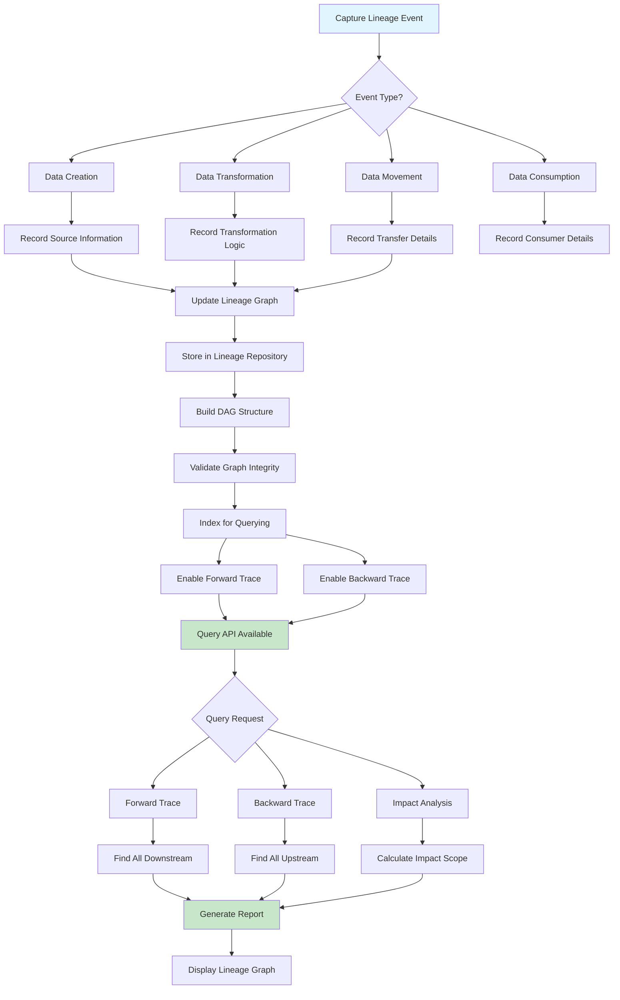

# Data Lineage

## Overview

Data lineage tracks the origin, movement, and transformation of data throughout its lifecycle across an organization. In microservices architectures, where data flows through multiple services, databases, message queues, and external systems, maintaining comprehensive lineage information is critical for understanding data dependencies, troubleshooting issues, ensuring compliance, and making informed decisions about data changes. Data lineage provides visibility into how data is created, modified, aggregated, and consumed across the entire data ecosystem.

The importance of data lineage extends across multiple dimensions of data management. For troubleshooting, lineage helps pinpoint the source of data quality issues by tracing errors back to their origin. When downstream systems receive bad data, lineage information enables rapid investigation of which upstream component introduced the problem. For impact analysis, before making changes to a data source or transformation, teams can understand which systems and processes depend on that data and assess the potential impact of changes. For compliance, lineage supports regulatory requirements for data traceability, particularly in industries with strict reporting and audit obligations.

Implementing data lineage in microservices requires capturing information at multiple points in the data flow. At data creation, lineage should record the source of new data, whether it's user input, external system integration, or generated data. During data processing, each transformation should be documented, including the logic applied, the inputs consumed, and the outputs produced. At data movement, when data crosses service boundaries through APIs, events, or message queues, the transfer should be recorded. At data consumption, when data is read by downstream consumers, this access should be tracked for completeness.

### Lineage Capture Strategies

Event-based lineage captures data movements and transformations through an event-driven architecture. Each data operation publishes an event that describes what happened, including the operation type, the data affected, the source and destination, and the timestamp. This approach provides comprehensive coverage with minimal manual effort and naturally fits with event-driven microservices. However, it requires careful schema design to ensure events contain sufficient lineage information without becoming too verbose.

Metadata-based lineage derives lineage information from system metadata and configuration. Database query logs, API access logs, and ETL job configurations can be analyzed to infer data flows. This approach requires less instrumentation but may miss certain types of lineage information and can be less accurate than explicit capture.

Manual lineage documentation complements automated approaches by capturing business context and semantic relationships that automated systems cannot easily infer. Data stewards can document data dictionaries, business rules, and domain knowledge that provide important context for understanding data lineage. This documentation should be linked to the automated lineage graphs for complete visibility.

### Lineage Graph Structure

The lineage graph represents data flows as a directed acyclic graph (DAG) where nodes represent data assets and edges represent transformations or data movements. Each node contains metadata about the data asset including its schema, owner, and business description. Each edge contains information about the transformation applied, including the logic, the inputs consumed, and the outputs produced. This graph structure enables both forward tracing (what happens to this data) and backward tracing (where did this data come from).

Node types in the lineage graph include source systems, databases, tables, files, API endpoints, message topics, services, and logical data entities. Edge types include data flows through ETL jobs, data replication, API calls, event publishing, and manual transformations. The graph can span multiple layers of abstraction, from physical data stores to logical business entities.

## Flow Chart



## Standard Example

```javascript
/**
 * Data Lineage Implementation in TypeScript
 * 
 * This example demonstrates implementing data lineage tracking
 * for microservices, including lineage capture, graph construction,
 * and impact analysis.
 */

// ============================================================================
// LINEAGE TYPE DEFINITIONS
// ============================================================================

interface LineageNode {
    id: string;
    name: string;
    type: NodeType;
    namespace: string;
    owner?: string;
    description?: string;
    metadata?: Record<string, unknown>;
    createdAt: string;
    updatedAt: string;
}

type NodeType = 
    | 'source_system'
    | 'database'
    | 'table'
    | 'collection'
    | 'file'
    | 'api_endpoint'
    | 'message_topic'
    | 'service'
    | 'transformation'
    | 'data_product'
    | 'report'
    | 'dashboard';

interface LineageEdge {
    id: string;
    sourceId: string;
    targetId: string;
    transformation?: TransformationInfo;
    transport?: TransportInfo;
    createdAt: string;
}

interface TransformationInfo {
    name: string;
    type: TransformationType;
    description?: string;
    code?: string;
    version?: string;
    inputs: string[];
    outputs: string[];
}

type TransformationType = 
    | 'filter'
    | 'map'
    | 'aggregate'
    | 'join'
    | 'derive'
    | 'normalize'
    | 'aggregate'
    | 'custom';

interface TransportInfo {
    method: 'sync_api' | 'async_event' | 'batch_etl' | 'stream' | 'replication';
    protocol?: string;
    frequency?: string;
}

interface LineageEvent {
    id: string;
    eventType: LineageEventType;
    timestamp: string;
    sourceNodeId?: string;
    targetNodeId?: string;
    transformation?: TransformationInfo;
    data?: Record<string, unknown>;
    context?: EventContext;
}

type LineageEventType = 
    | 'data_created'
    | 'data_read'
    | 'data_updated'
    | 'data_deleted'
    | 'transformation_executed'
    | 'data_transferred'
    | 'data_consumed';

interface EventContext {
    serviceName: string;
    serviceVersion: string;
    environment: string;
    userId?: string;
    traceId?: string;
}

interface LineageQuery {
    nodeId?: string;
    direction?: 'upstream' | 'downstream' | 'both';
    depth?: number;
    nodeTypes?: NodeType[];
    includeTransformations?: boolean;
}

interface LineagePath {
    nodes: LineageNode[];
    edges: LineageEdge[];
    totalHops: number;
}

interface ImpactAnalysis {
    sourceNodeId: string;
    downstreamNodes: LineageNode[];
    downstreamEdges: LineageEdge[];
    criticalPaths: LineagePath[];
    affectedSystems: string[];
    riskLevel: 'low' | 'medium' | 'high' | 'critical';
    impactSummary: string;
}

// ============================================================================
// LINEAGE GRAPH
// ============================================================================

class LineageGraph {
    private nodes: Map<string, LineageNode> = new Map();
    private edges: Map<string, LineageEdge> = new Map();
    private nodeIndex: Map<string, Set<string>> = new Map();
    private reverseNodeIndex: Map<string, Set<string>> = new Map();

    addNode(node: LineageNode): void {
        if (this.nodes.has(node.id)) {
            console.log(`Node ${node.id} already exists, updating`);
        }
        this.nodes.set(node.id, node);
        console.log(`Added node: ${node.name} (${node.type})`);
    }

    addEdge(edge: LineageEdge): void {
        if (!this.nodes.has(edge.sourceId) || !this.nodes.has(edge.targetId)) {
            throw new Error(`Cannot add edge: source or target node does not exist`);
        }

        if (this.edges.has(edge.id)) {
            console.log(`Edge ${edge.id} already exists, updating`);
        }

        this.edges.set(edge.id, edge);

        if (!this.nodeIndex.has(edge.sourceId)) {
            this.nodeIndex.set(edge.sourceId, new Set());
        }
        this.nodeIndex.get(edge.sourceId)!.add(edge.targetId);

        if (!this.reverseNodeIndex.has(edge.targetId)) {
            this.reverseNodeIndex.set(edge.targetId, new Set());
        }
        this.reverseNodeIndex.get(edge.targetId)!.add(edge.sourceId);

        console.log(`Added edge: ${edge.sourceId} -> ${edge.targetId}`);
    }

    getNode(nodeId: string): LineageNode | undefined {
        return this.nodes.get(nodeId);
    }

    getEdge(edgeId: string): LineageEdge | undefined {
        return this.edges.get(edgeId);
    }

    getAllNodes(): LineageNode[] {
        return Array.from(this.nodes.values());
    }

    getAllEdges(): LineageEdge[] {
        return Array.from(this.edges.values());
    }

    getDownstreamNodes(nodeId: string, depth: number = Infinity): LineageNode[] {
        if (!this.nodeIndex.has(nodeId)) {
            return [];
        }

        const visited = new Set<string>();
        const queue: { nodeId: string; currentDepth: number }[] = [{ nodeId, currentDepth: 0 }];
        const downstream: LineageNode[] = [];

        while (queue.length > 0) {
            const { nodeId: currentId, currentDepth } = queue.shift()!;

            if (currentDepth > 0) {
                const node = this.nodes.get(currentId);
                if (node) {
                    downstream.push(node);
                }
            }

            if (currentDepth < depth) {
                const children = this.nodeIndex.get(currentId) || new Set();
                for (const childId of children) {
                    if (!visited.has(childId)) {
                        visited.add(childId);
                        queue.push({ nodeId: childId, currentDepth: currentDepth + 1 });
                    }
                }
            }
        }

        return downstream;
    }

    getUpstreamNodes(nodeId: string, depth: number = Infinity): LineageNode[] {
        if (!this.reverseNodeIndex.has(nodeId)) {
            return [];
        }

        const visited = new Set<string>();
        const queue: { nodeId: string; currentDepth: number }[] = [{ nodeId, currentDepth: 0 }];
        const upstream: LineageNode[] = [];

        while (queue.length > 0) {
            const { nodeId: currentId, currentDepth } = queue.shift()!;

            if (currentDepth > 0) {
                const node = this.nodes.get(currentId);
                if (node) {
                    upstream.push(node);
                }
            }

            if (currentDepth < depth) {
                const parents = this.reverseNodeIndex.get(currentId) || new Set();
                for (const parentId of parents) {
                    if (!visited.has(parentId)) {
                        visited.add(parentId);
                        queue.push({ nodeId: parentId, currentDepth: currentDepth + 1 });
                    }
                }
            }
        }

        return upstream;
    }

    getPath(sourceId: string, targetId: string): LineagePath | null {
        if (!this.nodes.has(sourceId) || !this.nodes.has(targetId)) {
            return null;
        }

        const visited = new Set<string>();
        const queue: { nodeId: string; path: LineageNode[]; edges: LineageEdge[] }[] = [
            { nodeId: sourceId, path: [], edges: [] }
        ];

        while (queue.length > 0) {
            const { nodeId, path, edges } = queue.shift()!;

            if (nodeId === targetId) {
                const nodes = [...path, this.nodes.get(sourceId)!];
                return { nodes, edges, totalHops: edges.length };
            }

            if (visited.has(nodeId)) {
                continue;
            }
            visited.add(nodeId);

            const children = this.nodeIndex.get(nodeId) || new Set();
            for (const childId of children) {
                const childNode = this.nodes.get(childId);
                const childEdges = Array.from(this.edges.values()).filter(
                    e => e.sourceId === nodeId && e.targetId === childId
                );

                if (childNode) {
                    queue.push({
                        nodeId: childId,
                        path: [...path, childNode],
                        edges: [...edges, ...childEdges]
                    });
                }
            }
        }

        return null;
    }

    query(query: LineageQuery): LineagePath {
        const nodes: LineageNode[] = [];
        const edges: LineageEdge[] = [];
        
        if (!query.nodeId) {
            return { nodes, edges, totalHops: 0 };
        }

        const sourceNode = this.nodes.get(query.nodeId);
        if (!sourceNode) {
            return { nodes, edges, totalHops: 0 };
        }

        const depth = query.depth || Infinity;

        if (query.direction === 'downstream' || query.direction === 'both') {
            const downstreamNodes = this.getDownstreamNodes(query.nodeId, depth);
            const filteredNodes = query.nodeTypes 
                ? downstreamNodes.filter(n => query.nodeTypes!.includes(n.type))
                : downstreamNodes;
            nodes.push(...filteredNodes);

            for (const node of filteredNodes) {
                const path = this.getPath(query.nodeId, node.id);
                if (path) {
                    edges.push(...path.edges);
                }
            }
        }

        if (query.direction === 'upstream' || query.direction === 'both') {
            const upstreamNodes = this.getUpstreamNodes(query.nodeId, depth);
            const filteredNodes = query.nodeTypes
                ? upstreamNodes.filter(n => query.nodeTypes!.includes(n.type))
                : upstreamNodes;
            nodes.push(...filteredNodes);

            for (const node of filteredNodes) {
                const path = this.getPath(node.id, query.nodeId);
                if (path) {
                    edges.push(...path.edges);
                }
            }
        }

        return { nodes, edges, totalHops: edges.length };
    }

    analyzeImpact(nodeId: string): ImpactAnalysis {
        const sourceNode = this.nodes.get(nodeId);
        if (!sourceNode) {
            throw new Error(`Node ${nodeId} not found`);
        }

        const downstreamNodes = this.getDownstreamNodes(nodeId);
        const downstreamEdges = this.edges.values().filter(
            e => e.sourceId === nodeId || downstreamNodes.some(n => n.id === e.sourceId)
        ).filter(e => {
            return downstreamNodes.some(n => n.id === e.targetId);
        }).map(e => this.edges.get(e.id)!).filter(Boolean);

        const affectedSystems = new Set<string>();
        for (const node of downstreamNodes) {
            affectedSystems.add(node.namespace);
            if (node.type === 'service') {
                affectedSystems.add(node.name);
            }
        }

        let riskLevel: ImpactAnalysis['riskLevel'] = 'low';
        if (affectedSystems.size > 10 || downstreamNodes.length > 20) {
            riskLevel = 'critical';
        } else if (affectedSystems.size > 5 || downstreamNodes.length > 10) {
            riskLevel = 'high';
        } else if (affectedSystems.size > 2 || downstreamNodes.length > 5) {
            riskLevel = 'medium';
        }

        const downstreamServices = downstreamNodes.filter(n => n.type === 'service').length;
        const downstreamDataProducts = downstreamNodes.filter(n => n.type === 'data_product').length;
        const downstreamReports = downstreamNodes.filter(n => n.type === 'report' || n.type === 'dashboard').length;

        return {
            sourceNodeId: nodeId,
            downstreamNodes,
            downstreamEdges: downstreamEdges,
            criticalPaths: [],
            affectedSystems: Array.from(affectedSystems),
            riskLevel,
            impactSummary: `Changes to ${sourceNode.name} will affect ${downstreamNodes.length} downstream nodes including ${downstreamServices} services, ${downstreamDataProducts} data products, and ${downstreamReports} reports.`
        };
    }
}

// ============================================================================
// LINEAGE CAPTURE SERVICE
// ============================================================================

class LineageCaptureService {
    private graph: LineageGraph;
    private eventBuffer: LineageEvent[] = [];
    private batchSize: number = 100;
    private flushInterval: number = 60000;

    constructor(graph: LineageGraph) {
        this.graph = graph;
    }

    captureDataCreation(
        sourceNodeId: string,
        context: EventContext,
        data?: Record<string, unknown>
    ): LineageEvent {
        return this.captureEvent({
            id: this.generateEventId(),
            eventType: 'data_created',
            timestamp: new Date().toISOString(),
            sourceNodeId,
            context,
            data
        });
    }

    captureDataRead(
        sourceNodeId: string,
        targetNodeId: string,
        context: EventContext
    ): LineageEvent {
        return this.captureEvent({
            id: this.generateEventId(),
            eventType: 'data_read',
            timestamp: new Date().toISOString(),
            sourceNodeId,
            targetNodeId,
            context
        });
    }

    captureTransformation(
        sourceNodeIds: string[],
        targetNodeId: string,
        transformation: TransformationInfo,
        context: EventContext
    ): LineageEvent {
        return this.captureEvent({
            id: this.generateEventId(),
            eventType: 'transformation_executed',
            timestamp: new Date().toISOString(),
            targetNodeId,
            transformation,
            context
        });
    }

    captureDataTransfer(
        sourceNodeId: string,
        targetNodeId: string,
        transport: TransportInfo,
        context: EventContext
    ): LineageEvent {
        return this.captureEvent({
            id: this.generateEventId(),
            eventType: 'data_transferred',
            timestamp: new Date().toISOString(),
            sourceNodeId,
            targetNodeId,
            context,
            data: { transport }
        });
    }

    captureDataConsumption(
        sourceNodeId: string,
        consumerNodeId: string,
        context: EventContext
    ): LineageEvent {
        return this.captureEvent({
            id: this.generateEventId(),
            eventType: 'data_consumed',
            timestamp: new Date().toISOString(),
            sourceNodeId,
            targetNodeId: consumerNodeId,
            context
        });
    }

    processEvent(event: LineageEvent): void {
        console.log(`Processing lineage event: ${event.eventType}`);

        if (event.eventType === 'transformation_executed' && event.targetNodeId) {
            const sourceIds = event.transformation?.inputs || [];
            
            for (const sourceId of sourceIds) {
                const edge: LineageEdge = {
                    id: `edge-${event.id}-${sourceId}`,
                    sourceId,
                    targetId: event.targetNodeId,
                    transformation: event.transformation,
                    createdAt: event.timestamp
                };
                
                try {
                    this.graph.addEdge(edge);
                } catch (error) {
                    console.log(`Edge may already exist: ${error}`);
                }
            }
        }

        if ((event.eventType === 'data_read' || 
             event.eventType === 'data_transferred' ||
             event.eventType === 'data_consumed') && 
            event.sourceNodeId && 
            event.targetNodeId) {
            
            const edge: LineageEdge = {
                id: `edge-${event.id}`,
                sourceId: event.sourceNodeId,
                targetId: event.targetNodeId,
                transport: event.data?.transport as TransportInfo,
                createdAt: event.timestamp
            };

            try {
                this.graph.addEdge(edge);
            } catch (error) {
                console.log(`Edge may already exist: ${error}`);
            }
        }
    }

    private captureEvent(event: LineageEvent): LineageEvent {
        this.eventBuffer.push(event);

        if (this.eventBuffer.length >= this.batchSize) {
            this.flush();
        }

        return event;
    }

    flush(): void {
        console.log(`Flushing ${this.eventBuffer.length} lineage events`);
        
        for (const event of this.eventBuffer) {
            this.processEvent(event);
        }
        
        this.eventBuffer = [];
    }

    private generateEventId(): string {
        return `evt-${Date.now()}-${Math.random().toString(36).substr(2, 9)}`;
    }
}

// ============================================================================
// LINEAGE QUERY SERVICE
// ============================================================================

class LineageQueryService {
    private graph: LineageGraph;

    constructor(graph: LineageGraph) {
        this.graph = graph;
    }

    findUpstreamDependencies(nodeId: string, maxDepth: number = 5): LineageNode[] {
        return this.graph.getUpstreamNodes(nodeId, maxDepth);
    }

    findDownstreamDependencies(nodeId: string, maxDepth: number = 5): LineageNode[] {
        return this.graph.getDownstreamNodes(nodeId, maxDepth);
    }

    findImpact(nodeId: string): ImpactAnalysis {
        return this.graph.analyzeImpact(nodeId);
    }

    findDataFlowPath(sourceId: string, targetId: string): LineagePath | null {
        return this.graph.getPath(sourceId, targetId);
    }

    findCommonAncestors(nodeIds: string[]): LineageNode[] {
        if (nodeIds.length === 0) return [];
        if (nodeIds.length === 1) return [this.graph.getNode(nodeIds[0])!];

        const ancestorSets = nodeIds.map(id => {
            const ancestors = this.graph.getUpstreamNodes(id);
            ancestors.push(this.graph.getNode(id)!);
            return new Set(ancestors.map(n => n.id));
        });

        const commonIds = Array.from(ancestorSets[0]).filter(id => 
            ancestorSets.every(set => set.has(id))
        );

        return commonIds.map(id => this.graph.getNode(id)!).filter(Boolean);
    }

    findAffectedServices(nodeId: string): string[] {
        const downstream = this.graph.getDownstreamNodes(nodeId);
        
        return downstream
            .filter(n => n.type === 'service')
            .map(n => n.name);
    }

    findDataProductsImpacted(nodeId: string): LineageNode[] {
        const downstream = this.graph.getDownstreamNodes(nodeId);
        
        return downstream.filter(n => n.type === 'data_product');
    }

    generateLineageReport(nodeId: string): LineageReport {
        const node = this.graph.getNode(nodeId);
        if (!node) {
            throw new Error(`Node ${nodeId} not found`);
        }

        const upstream = this.graph.getUpstreamNodes(nodeId);
        const downstream = this.graph.getDownstreamNodes(nodeId);
        const impact = this.graph.analyzeImpact(nodeId);

        return {
            node,
            upstream: upstream.slice(0, 20),
            downstream: downstream.slice(0, 20),
            upstreamCount: upstream.length,
            downstreamCount: downstream.length,
            impact,
            generatedAt: new Date().toISOString()
        };
    }
}

interface LineageReport {
    node: LineageNode;
    upstream: LineageNode[];
    downstream: LineageNode[];
    upstreamCount: number;
    downstreamCount: number;
    impact: ImpactAnalysis;
    generatedAt: string;
}

// ============================================================================
// AUTOMATIC LINEAGE DETECTION
// ============================================================================

class AutomaticLineageDetector {
    private graph: LineageGraph;

    constructor(graph: LineageGraph) {
        this.graph = graph;
    }

    detectFromApiCall(
        sourceTableId: string,
        targetServiceId: string,
        apiEndpoint: string,
        context: EventContext
    ): void {
        let sourceNode = this.graph.getNode(sourceTableId);
        
        if (!sourceNode) {
            sourceNode = {
                id: sourceTableId,
                name: sourceTableId,
                type: 'table',
                namespace: 'database',
                createdAt: new Date().toISOString(),
                updatedAt: new Date().toISOString()
            };
            this.graph.addNode(sourceNode);
        }

        const apiNode: LineageNode = {
            id: targetServiceId,
            name: apiEndpoint,
            type: 'api_endpoint',
            namespace: targetServiceId,
            createdAt: new Date().toISOString(),
            updatedAt: new Date().toISOString()
        };

        try {
            this.graph.addNode(apiNode);
        } catch (e) {}

        const edge: LineageEdge = {
            id: `edge-api-${sourceTableId}-${targetServiceId}`,
            sourceId: sourceTableId,
            targetId: targetServiceId,
            transport: { method: 'sync_api', protocol: 'REST' },
            createdAt: new Date().toISOString()
        };

        try {
            this.graph.addEdge(edge);
        } catch (e) {}
    }

    detectFromEventProcessing(
        sourceTopicId: string,
        targetTableId: string,
        transformationName: string,
        context: EventContext
    ): void {
        let topicNode = this.graph.getNode(sourceTopicId);
        
        if (!topicNode) {
            topicNode = {
                id: sourceTopicId,
                name: sourceTopicId,
                type: 'message_topic',
                namespace: 'messaging',
                createdAt: new Date().toISOString(),
                updatedAt: new Date().toISOString()
            };
            this.graph.addNode(topicNode);
        }

        const transformNode: LineageNode = {
            id: `transform-${transformationName}`,
            name: transformationName,
            type: 'transformation',
            namespace: context.serviceName,
            owner: context.serviceName,
            description: `Event-driven transformation: ${transformationName}`,
            createdAt: new Date().toISOString(),
            updatedAt: new Date().toISOString()
        };

        try {
            this.graph.addNode(transformNode);
        } catch (e) {}

        let targetNode = this.graph.getNode(targetTableId);
        
        if (!targetNode) {
            targetNode = {
                id: targetTableId,
                name: targetTableId,
                type: 'table',
                namespace: 'database',
                createdAt: new Date().toISOString(),
                updatedAt: new Date().toISOString()
            };
            this.graph.addNode(targetNode);
        }

        const edge1: LineageEdge = {
            id: `edge-event-${sourceTopicId}-${transformNode.id}`,
            sourceId: sourceTopicId,
            targetId: transformNode.id,
            transformation: {
                name: transformationName,
                type: 'custom',
                inputs: [sourceTopicId],
                outputs: [targetTableId]
            },
            createdAt: new Date().toISOString()
        };

        const edge2: LineageEdge = {
            id: `edge-transform-${transformNode.id}-${targetTableId}`,
            sourceId: transformNode.id,
            targetId: targetTableId,
            transformation: {
                name: transformationName,
                type: 'custom',
                inputs: [sourceTopicId],
                outputs: [targetTableId]
            },
            createdAt: new Date().toISOString()
        };

        try {
            this.graph.addEdge(edge1);
            this.graph.addEdge(edge2);
        } catch (e) {}
    }
}

// ============================================================================
// DEMONSTRATION
// ============================================================================

function demonstrateDataLineage(): void {
    console.log('='.repeat(60));
    console.log('DATA LINEAGE DEMONSTRATION');
    console.log('='.repeat(60));

    const lineageGraph = new LineageGraph();
    const captureService = new LineageCaptureService(lineageGraph);
    const queryService = new LineageQueryService(lineageGraph);
    const autoDetector = new AutomaticLineageDetector(lineageGraph);

    console.log('\n--- Creating Lineage Nodes ---');
    
    const nodes: LineageNode[] = [
        {
            id: 'source-crm',
            name: 'CRM System',
            type: 'source_system',
            namespace: 'crm',
            owner: 'Sales Team',
            description: 'Customer Relationship Management System',
            createdAt: new Date().toISOString(),
            updatedAt: new Date().toISOString()
        },
        {
            id: 'table-customers',
            name: 'customers',
            type: 'table',
            namespace: 'crm.database',
            owner: 'Sales Team',
            description: 'Customer master data table',
            createdAt: new Date().toISOString(),
            updatedAt: new Date().toISOString()
        },
        {
            id: 'api-customer-service',
            name: '/api/v1/customers',
            type: 'api_endpoint',
            namespace: 'customer-service',
            owner: 'Platform Team',
            description: 'Customer data API',
            createdAt: new Date().toISOString(),
            updatedAt: new Date().toISOString()
        },
        {
            id: 'topic-customer-events',
            name: 'customer.events',
            type: 'message_topic',
            namespace: 'kafka',
            description: 'Customer event stream',
            createdAt: new Date().toISOString(),
            updatedAt: new Date().toISOString()
        },
        {
            id: 'transform-customer-enrichment',
            name: 'customer-enrichment',
            type: 'transformation',
            namespace: 'etl-pipeline',
            description: 'Enriches customer data with additional attributes',
            createdAt: new Date().toISOString(),
            updatedAt: new Date().toISOString()
        },
        {
            id: 'table-customer-analytics',
            name: 'customer_analytics',
            type: 'table',
            namespace: 'analytics.database',
            owner: 'Analytics Team',
            description: 'Enriched customer data for analytics',
            createdAt: new Date().toISOString(),
            updatedAt: new Date().toISOString()
        },
        {
            id: 'data-product-customer-360',
            name: 'customer_360',
            type: 'data_product',
            namespace: 'data-products',
            owner: 'Data Team',
            description: 'Unified customer 360 view',
            createdAt: new Date().toISOString(),
            updatedAt: new Date().toISOString()
        },
        {
            id: 'dashboard-executive',
            name: 'Executive Dashboard',
            type: 'dashboard',
            namespace: 'bi',
            owner: 'Executive Team',
            description: 'Executive KPI dashboard',
            createdAt: new Date().toISOString(),
            updatedAt: new Date().toISOString()
        }
    ];

    for (const node of nodes) {
        lineageGraph.addNode(node);
    }

    console.log('\n--- Creating Lineage Edges ---');
    
    const edges: LineageEdge[] = [
        {
            id: 'edge-1',
            sourceId: 'source-crm',
            targetId: 'table-customers',
            transport: { method: 'batch_etl' },
            createdAt: new Date().toISOString()
        },
        {
            id: 'edge-2',
            sourceId: 'table-customers',
            targetId: 'api-customer-service',
            transport: { method: 'sync_api' },
            createdAt: new Date().toISOString()
        },
        {
            id: 'edge-3',
            sourceId: 'api-customer-service',
            targetId: 'topic-customer-events',
            transport: { method: 'async_event' },
            createdAt: new Date().toISOString()
        },
        {
            id: 'edge-4',
            sourceId: 'topic-customer-events',
            targetId: 'transform-customer-enrichment',
            transformation: {
                name: 'customer-enrichment',
                type: 'derive',
                inputs: ['topic-customer-events'],
                outputs: ['transform-customer-enrichment']
            },
            createdAt: new Date().toISOString()
        },
        {
            id: 'edge-5',
            sourceId: 'transform-customer-enrichment',
            targetId: 'table-customer-analytics',
            transformation: {
                name: 'customer-enrichment',
                type: 'derive',
                inputs: ['transform-customer-enrichment'],
                outputs: ['table-customer-analytics']
            },
            createdAt: new Date().toISOString()
        },
        {
            id: 'edge-6',
            sourceId: 'table-customer-analytics',
            targetId: 'data-product-customer-360',
            transport: { method: 'replication' },
            createdAt: new Date().toISOString()
        },
        {
            id: 'edge-7',
            sourceId: 'data-product-customer-360',
            targetId: 'dashboard-executive',
            transport: { method: 'sync_api' },
            createdAt: new Date().toISOString()
        }
    ];

    for (const edge of edges) {
        lineageGraph.addEdge(edge);
    }

    console.log('\n--- Querying Lineage ---');
    
    const upstream = queryService.findUpstreamDependencies('dashboard-executive');
    console.log(`Upstream from Executive Dashboard: ${upstream.length} nodes`);
    for (const node of upstream.slice(0, 5)) {
        console.log(`  - ${node.name} (${node.type})`);
    }

    const downstream = queryService.findDownstreamDependencies('table-customers');
    console.log(`\nDownstream from customers table: ${downstream.length} nodes`);
    for (const node of downstream.slice(0, 5)) {
        console.log(`  - ${node.name} (${node.type})`);
    }

    console.log('\n--- Impact Analysis ---');
    
    const impact = queryService.findImpact('table-customers');
    console.log(`Impact analysis for customers table:`);
    console.log(`  Risk Level: ${impact.riskLevel}`);
    console.log(`  Downstream Nodes: ${impact.downstreamNodes.length}`);
    console.log(`  Affected Systems: ${impact.affectedSystems.join(', ')}`);
    console.log(`  ${impact.impactSummary}`);

    console.log('\n--- Finding Data Flow Path ---');
    
    const path = queryService.findDataFlowPath('table-customers', 'dashboard-executive');
    if (path) {
        console.log(`Data flow path found (${path.totalHops} hops):`);
        for (const node of path.nodes) {
            console.log(`  -> ${node.name} (${node.type})`);
        }
    }

    console.log('\n--- Finding Common Ancestors ---');
    
    const commonAncestors = queryService.findCommonAncestors([
        'dashboard-executive',
        'data-product-customer-360'
    ]);
    console.log(`Common ancestors: ${commonAncestors.map(n => n.name).join(', ')}`);

    console.log('\n--- Automatic Lineage Detection ---');
    
    autoDetector.detectFromApiCall(
        'table-orders',
        'order-service',
        '/api/v1/orders',
        { serviceName: 'order-service', serviceVersion: '1.0', environment: 'production' }
    );

    autoDetector.detectFromEventProcessing(
        'topic-orders',
        'table-orders-analytics',
        'order-analytics-enrichment',
        { serviceName: 'etl-pipeline', serviceVersion: '2.0', environment: 'production' }
    );

    console.log('\n--- Generating Full Report ---');
    
    const report = queryService.generateLineageReport('table-customers');
    console.log(`Lineage Report for ${report.node.name}:`);
    console.log(`  Upstream dependencies: ${report.upstreamCount}`);
    console.log(`  Downstream dependencies: ${report.downstreamCount}`);
    console.log(`  Impact risk level: ${report.impact.riskLevel}`);

    console.log('\n--- Current Lineage Graph Stats ---');
    console.log(`Total nodes: ${lineageGraph.getAllNodes().length}`);
    console.log(`Total edges: ${lineageGraph.getAllEdges().length}`);

    console.log('\n' + '='.repeat(60));
    console.log('DEMONSTRATION COMPLETE');
    console.log('='.repeat(60));
}

demonstrateDataLineage();
