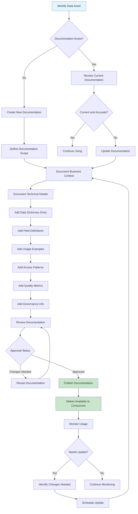

# Data Documentation

## Overview

Data documentation provides the context, definitions, and usage information necessary for understanding and effectively using data assets. In microservices architectures, where data is distributed across multiple services and may be consumed by numerous internal and external users, comprehensive documentation is essential for enabling self-service data discovery, reducing onboarding time, ensuring consistent data usage, and maintaining regulatory compliance. Without proper documentation, even well-designed data systems become difficult to use and can lead to incorrect interpretations and decisions.

Effective data documentation serves multiple audiences and purposes. For developers, documentation provides the technical details needed to correctly implement data access, including schemas, data types, relationships, and validations. For analysts, documentation explains the business meaning of data elements, how they should be interpreted, and any calculations or transformations applied. For data stewards and governance teams, documentation supports data quality initiatives, compliance reporting, and impact analysis. For auditors and regulators, documentation provides evidence of proper data handling practices.

The scope of data documentation extends beyond simple schema definitions. It includes business definitions that explain what data represents in business terms, data dictionaries that define each field and its properties, technical specifications for data storage and access, usage examples that demonstrate how to work with data, data lineage information that shows how data flows through systems, quality metrics that indicate data reliability, and governance information including ownership, retention policies, and access requirements. This comprehensive approach to documentation enables organizations to treat data as a valuable asset that can be effectively managed and utilized.

### Documentation Components

A data dictionary serves as the central repository for information about data elements. Each data element should have a comprehensive entry that includes its technical name, display name, description, data type, format, valid values, default values, whether it's required or optional, relationships to other elements, and any business rules or constraints. Data dictionaries should be version-controlled and maintained as living documents that evolve with the data.

Business glossaries provide standardized definitions for business terms used across the organization. These glossaries ensure consistent understanding and usage of business concepts, eliminating ambiguity that can lead to misunderstandings. Terms in the glossary should link to relevant data elements, business rules, and processes, creating a connected network of business knowledge.

Technical documentation covers the implementation details that developers need. This includes database schemas, API specifications, message formats, ETL processes, and integration patterns. Technical documentation should be automatically generated where possible from code artifacts, and manually maintained for higher-level architectural decisions and patterns.

## Flow Chart



## Standard Example

```javascript
/**
 * Data Documentation Implementation in TypeScript
 * 
 * This example demonstrates implementing data documentation
 * for microservices, including data dictionaries, business glossaries,
 * and technical specifications.
 */

// ============================================================================
// DOCUMENTATION TYPE DEFINITIONS
// ============================================================================

interface DataElement {
    id: string;
    name: string;
    displayName: string;
    description: string;
    dataType: string;
    format?: string;
    nullable: boolean;
    defaultValue?: unknown;
    validValues?: ValidValue[];
    constraints?: Constraint[];
    relationships?: Relationship[];
    pii: boolean;
    classification: DataClassification;
    createdAt: string;
    updatedAt: string;
    updatedBy: string;
}

interface ValidValue {
    value: string;
    displayName: string;
    description?: string;
    isDefault?: boolean;
}

interface Constraint {
    type: 'range' | 'length' | 'pattern' | 'custom';
    expression: string;
    errorMessage: string;
}

interface Relationship {
    targetElement: string;
    type: 'parent' | 'child' | 'reference' | 'derived';
    cardinality: 'one-to-one' | 'one-to-many' | 'many-to-many';
    description?: string;
}

type DataClassification = 'public' | 'internal' | 'confidential' | 'restricted';

interface DataDictionary {
    id: string;
    name: string;
    version: string;
    domain: string;
    owner: string;
    description: string;
    elements: DataElement[];
    dependencies?: string[];
    relatedDictionaries?: string[];
    createdAt: string;
    updatedAt: string;
}

interface BusinessTerm {
    id: string;
    term: string;
    definition: string;
    abbreviation?: string;
    synonyms?: string[];
    category: string;
    relatedTerms?: string[];
    relatedDataElements?: string[];
    examples?: string[];
    owner: string;
    steward?: string;
    approvedAt?: string;
    expiresAt?: string;
}

interface BusinessGlossary {
    id: string;
    name: string;
    version: string;
    owner: string;
    terms: BusinessTerm[];
    categories: string[];
    createdAt: string;
    updatedAt: string;
}

interface TechnicalSpec {
    id: string;
    name: string;
    type: 'api' | 'database' | 'message_queue' | 'file_format' | 'service';
    version: string;
    namespace: string;
    endpoint?: string;
    protocol?: string;
    schema?: string;
    security?: SecuritySpec;
    rateLimiting?: RateLimitSpec;
    documentation?: string;
    examples?: ExampleSpec[];
    createdAt: string;
    updatedAt: string;
}

interface SecuritySpec {
    authentication: string[];
    authorization: string;
    encryption: 'none' | 'tls' | 'mutual_tls';
    dataMasking?: string[];
}

interface RateLimitSpec {
    requestsPerSecond?: number;
    requestsPerMinute?: number;
    burstSize?: number;
}

interface ExampleSpec {
    name: string;
    request?: unknown;
    response?: unknown;
    description?: string;
}

interface UsageExample {
    id: string;
    title: string;
    description: string;
    language: string;
    code: string;
    dataElementIds: string[];
    useCase: string;
    createdBy: string;
    verified: boolean;
}

interface DocumentationMetadata {
    id: string;
    title: string;
    type: 'data_dictionary' | 'glossary' | 'technical_spec' | 'usage_guide';
    version: string;
    status: 'draft' | 'review' | 'approved' | 'deprecated';
    owner: string;
    reviewer?: string;
    approvedBy?: string;
    tags: string[];
    createdAt: string;
    updatedAt: string;
    effectiveFrom?: string;
    effectiveTo?: string;
}

// ============================================================================
// DATA DICTIONARY MANAGER
// ============================================================================

class DataDictionaryManager {
    private dictionaries: Map<string, DataDictionary> = new Map();
    private elementsIndex: Map<string, DataElement> = new Map();

    createDictionary(dictionary: DataDictionary): void {
        if (this.dictionaries.has(dictionary.id)) {
            throw new Error(`Dictionary ${dictionary.id} already exists`);
        }

        for (const element of dictionary.elements) {
            this.elementsIndex.set(element.id, element);
        }

        this.dictionaries.set(dictionary.id, dictionary);
        console.log(`Created data dictionary: ${dictionary.name} v${dictionary.version}`);
    }

    getDictionary(dictionaryId: string): DataDictionary | undefined {
        return this.dictionaries.get(dictionaryId);
    }

    getElement(elementId: string): DataElement | undefined {
        return this.elementsIndex.get(elementId);
    }

    updateDictionary(dictionaryId: string, updates: Partial<DataDictionary>): void {
        const existing = this.dictionaries.get(dictionaryId);
        if (!existing) {
            throw new Error(`Dictionary ${dictionaryId} not found`);
        }

        const updated: DataDictionary = {
            ...existing,
            ...updates,
            updatedAt: new Date().toISOString()
        };

        if (updates.elements) {
            for (const element of updates.elements) {
                this.elementsIndex.set(element.id, element);
            }
        }

        this.dictionaries.set(dictionaryId, updated);
        console.log(`Updated data dictionary: ${dictionaryId}`);
    }

    addElement(dictionaryId: string, element: DataElement): void {
        const dictionary = this.dictionaries.get(dictionaryId);
        if (!dictionary) {
            throw new Error(`Dictionary ${dictionaryId} not found`);
        }

        if (this.elementsIndex.has(element.id)) {
            throw new Error(`Element ${element.id} already exists`);
        }

        dictionary.elements.push(element);
        this.elementsIndex.set(element.id, element);
        
        console.log(`Added element ${element.name} to dictionary ${dictionaryId}`);
    }

    searchElements(query: string): DataElement[] {
        const results: DataElement[] = [];
        const lowerQuery = query.toLowerCase();

        for (const element of this.elementsIndex.values()) {
            if (element.name.toLowerCase().includes(lowerQuery) ||
                element.displayName.toLowerCase().includes(lowerQuery) ||
                element.description.toLowerCase().includes(lowerQuery)) {
                results.push(element);
            }
        }

        return results;
    }

    getElementsByClassification(classification: DataClassification): DataElement[] {
        return Array.from(this.elementsIndex.values())
            .filter(e => e.classification === classification);
    }

    getPiiElements(): DataElement[] {
        return Array.from(this.elementsIndex.values())
            .filter(e => e.pii);
    }

    generateMarkdown(dictionaryId: string): string {
        const dictionary = this.dictionaries.get(dictionaryId);
        if (!dictionary) {
            throw new Error(`Dictionary ${dictionaryId} not found`);
        }

        let markdown = `# ${dictionary.name}\n\n`;
        markdown += `**Version:** ${dictionary.version}\n\n`;
        markdown += `**Domain:** ${dictionary.domain}\n\n`;
        markdown += `**Owner:** ${dictionary.owner}\n\n`;
        markdown += `${dictionary.description}\n\n`;
        markdown += `---\n\n`;
        markdown += `## Data Elements\n\n`;

        for (const element of dictionary.elements) {
            markdown += `### ${element.displayName} (${element.name})\n\n`;
            markdown += `${element.description}\n\n`;
            markdown += `**Type:** ${element.dataType}`;
            if (element.format) markdown += ` (${element.format})`;
            markdown += `\n\n`;
            markdown += `**Nullable:** ${element.nullable}\n\n`;
            markdown += `**Classification:** ${element.classification}\n\n`;
            markdown += `**PII:** ${element.pii ? 'Yes' : 'No'}\n\n`;

            if (element.validValues && element.validValues.length > 0) {
                markdown += `**Valid Values:**\n\n`;
                for (const value of element.validValues) {
                    markdown += `- \`${value.value}\`: ${value.displayName}`;
                    if (value.isDefault) markdown += ` (default)`;
                    markdown += `\n`;
                }
                markdown += `\n`;
            }

            if (element.constraints && element.constraints.length > 0) {
                markdown += `**Constraints:**\n\n`;
                for (const constraint of element.constraints) {
                    markdown += `- ${constraint.type}: \`${constraint.expression}\`\n`;
                }
                markdown += `\n`;
            }

            if (element.relationships && element.relationships.length > 0) {
                markdown += `**Relationships:**\n\n`;
                for (const rel of element.relationships) {
                    markdown += `- ${rel.type} \`${rel.targetElement}\` (${rel.cardinality})\n`;
                }
                markdown += `\n`;
            }

            markdown += `---\n\n`;
        }

        return markdown;
    }
}

// ============================================================================
// BUSINESS GLOSSARY MANAGER
// ============================================================================

class BusinessGlossaryManager {
    private glossary: BusinessGlossary | null = null;
    private termsIndex: Map<string, BusinessTerm> = new Map();
    private categoryIndex: Map<string, BusinessTerm[]> = new Map();

    initialize(glossary: BusinessGlossary): void {
        this.glossary = glossary;
        
        for (const term of glossary.terms) {
            this.termsIndex.set(term.id, term);
            
            if (!this.categoryIndex.has(term.category)) {
                this.categoryIndex.set(term.category, []);
            }
            this.categoryIndex.get(term.category)!.push(term);
        }

        console.log(`Initialized business glossary: ${glossary.name}`);
    }

    addTerm(term: BusinessTerm): void {
        if (!this.glossary) {
            throw new Error('Glossary not initialized');
        }

        if (this.termsIndex.has(term.id)) {
            throw new Error(`Term ${term.id} already exists`);
        }

        this.glossary.terms.push(term);
        this.termsIndex.set(term.id, term);

        if (!this.categoryIndex.has(term.category)) {
            this.categoryIndex.set(term.category, []);
        }
        this.categoryIndex.get(term.category)!.push(term);

        console.log(`Added term: ${term.term}`);
    }

    updateTerm(termId: string, updates: Partial<BusinessTerm>): void {
        const term = this.termsIndex.get(termId);
        if (!term) {
            throw new Error(`Term ${termId} not found`);
        }

        Object.assign(term, updates, { updatedAt: new Date().toISOString() });
        console.log(`Updated term: ${term.term}`);
    }

    getTerm(termId: string): BusinessTerm | undefined {
        return this.termsIndex.get(termId);
    }

    searchTerms(query: string): BusinessTerm[] {
        const results: BusinessTerm[] = [];
        const lowerQuery = query.toLowerCase();

        for (const term of this.termsIndex.values()) {
            if (term.term.toLowerCase().includes(lowerQuery) ||
                term.definition.toLowerCase().includes(lowerQuery) ||
                term.synonyms?.some(s => s.toLowerCase().includes(lowerQuery))) {
                results.push(term);
            }
        }

        return results;
    }

    getTermsByCategory(category: string): BusinessTerm[] {
        return this.categoryIndex.get(category) || [];
    }

    getRelatedTerms(termId: string): BusinessTerm[] {
        const term = this.termsIndex.get(termId);
        if (!term || !term.relatedTerms) {
            return [];
        }

        return term.relatedTerms
            .map(t => this.termsIndex.get(t))
            .filter((t): t is BusinessTerm => t !== undefined);
    }

    getDataElementTerms(dataElementId: string): BusinessTerm[] {
        return Array.from(this.termsIndex.values())
            .filter(t => t.relatedDataElements?.includes(dataElementId));
    }

    generateMarkdown(): string {
        if (!this.glossary) {
            throw new Error('Glossary not initialized');
        }

        let markdown = `# ${this.glossary.name}\n\n`;
        markdown += `**Version:** ${this.glossary.version}\n\n`;
        markdown += `**Owner:** ${this.glossary.owner}\n\n`;
        markdown += `---\n\n`;

        for (const category of this.glossary.categories) {
            const terms = this.categoryIndex.get(category) || [];
            
            if (terms.length === 0) continue;

            markdown += `## ${category}\n\n`;

            for (const term of terms) {
                markdown += `### ${term.term}\n\n`;
                if (term.abbreviation) {
                    markdown += `**Abbreviation:** ${term.abbreviation}\n\n`;
                }
                markdown += `**Definition:** ${term.definition}\n\n`;

                if (term.synonyms && term.synonyms.length > 0) {
                    markdown += `**Synonyms:** ${term.synonyms.join(', ')}\n\n`;
                }

                if (term.relatedTerms && term.relatedTerms.length > 0) {
                    markdown += `**Related Terms:** ${term.relatedTerms.join(', ')}\n\n`;
                }

                if (term.examples && term.examples.length > 0) {
                    markdown += `**Examples:**\n\n`;
                    for (const example of term.examples) {
                        markdown += `- ${example}\n`;
                    }
                    markdown += `\n`;
                }

                markdown += `**Owner:** ${term.owner}\n\n`;
                if (term.steward) {
                    markdown += `**Steward:** ${term.steward}\n\n`;
                }
                markdown += `---\n\n`;
            }
        }

        return markdown;
    }
}

// ============================================================================
// TECHNICAL SPECIFICATION MANAGER
// ============================================================================

class TechnicalSpecManager {
    private specs: Map<string, TechnicalSpec> = new Map();
    private namespaceIndex: Map<string, TechnicalSpec[]> = new Map();

    createSpec(spec: TechnicalSpec): void {
        if (this.specs.has(spec.id)) {
            throw new Error(`Specification ${spec.id} already exists`);
        }

        this.specs.set(spec.id, spec);

        if (!this.namespaceIndex.has(spec.namespace)) {
            this.namespaceIndex.set(spec.namespace, []);
        }
        this.namespaceIndex.get(spec.namespace)!.push(spec);

        console.log(`Created technical specification: ${spec.name}`);
    }

    getSpec(specId: string): TechnicalSpec | undefined {
        return this.specs.get(specId);
    }

    getSpecByEndpoint(endpoint: string): TechnicalSpec | undefined {
        for (const spec of this.specs.values()) {
            if (spec.endpoint === endpoint) {
                return spec;
            }
        }
        return undefined;
    }

    getSpecsByNamespace(namespace: string): TechnicalSpec[] {
        return this.namespaceIndex.get(namespace) || [];
    }

    getSpecsByType(type: TechnicalSpec['type']): TechnicalSpec[] {
        return Array.from(this.specs.values())
            .filter(s => s.type === type);
    }

    updateSpec(specId: string, updates: Partial<TechnicalSpec>): void {
        const spec = this.specs.get(specId);
        if (!spec) {
            throw new Error(`Specification ${specId} not found`);
        }

        Object.assign(spec, updates, { updatedAt: new Date().toISOString() });
        console.log(`Updated specification: ${spec.name}`);
    }

    generateOpenApi(spec: TechnicalSpec): string {
        const openApi: Record<string, unknown> = {
            openapi: '3.0.0',
            info: {
                title: spec.name,
                version: spec.version,
                description: spec.documentation
            },
            servers: [
                {
                    url: `https://api.example.com${spec.namespace}`,
                    description: 'Production server'
                }
            ],
            paths: {}
        };

        if (spec.endpoint) {
            const path = spec.endpoint.replace(/{(\w+)}/g, '/$1');
            (openApi.paths as Record<string, unknown>)[path] = {
                get: {
                    summary: spec.name,
                    responses: {
                        '200': {
                            description: 'Successful response',
                            content: {
                                'application/json': {
                                    schema: spec.schema ? JSON.parse(spec.schema) : {}
                                }
                            }
                        }
                    }
                }
            };
        }

        return JSON.stringify(openApi, null, 2);
    }

    generateMarkdown(spec: TechnicalSpec): string {
        let markdown = `# ${spec.name}\n\n`;
        markdown += `**Type:** ${spec.type}\n\n`;
        markdown += `**Version:** ${spec.version}\n\n`;
        markdown += `**Namespace:** ${spec.namespace}\n\n`;

        if (spec.endpoint) {
            markdown += `**Endpoint:** ${spec.endpoint}\n\n`;
        }

        if (spec.protocol) {
            markdown += `**Protocol:** ${spec.protocol}\n\n`;
        }

        if (spec.security) {
            markdown += `## Security\n\n`;
            markdown += `**Authentication:** ${spec.security.authentication.join(', ')}\n\n`;
            markdown += `**Authorization:** ${spec.security.authorization}\n\n`;
            markdown += `**Encryption:** ${spec.security.encryption}\n\n`;

            if (spec.security.dataMasking && spec.security.dataMasking.length > 0) {
                markdown += `**Data Masking:** ${spec.security.dataMasking.join(', ')}\n\n`;
            }
        }

        if (spec.rateLimiting) {
            markdown += `## Rate Limiting\n\n`;
            if (spec.rateLimiting.requestsPerSecond) {
                markdown += `- ${spec.rateLimiting.requestsPerSecond} requests per second\n`;
            }
            if (spec.rateLimiting.requestsPerMinute) {
                markdown += `- ${spec.rateLimiting.requestsPerMinute} requests per minute\n`;
            }
            if (spec.rateLimiting.burstSize) {
                markdown += `- Burst size: ${spec.rateLimiting.burstSize}\n`;
            }
            markdown += `\n`;
        }

        if (spec.examples && spec.examples.length > 0) {
            markdown += `## Examples\n\n`;
            for (const example of spec.examples) {
                markdown += `### ${example.name}\n\n`;
                if (example.description) {
                    markdown += `${example.description}\n\n`;
                }
                if (example.request) {
                    markdown += `**Request:**\n\n`;
                    markdown += '```json\n';
                    markdown += JSON.stringify(example.request, null, 2);
                    markdown += '\n```\n\n';
                }
                if (example.response) {
                    markdown += `**Response:**\n\n`;
                    markdown += '```json\n';
                    markdown += JSON.stringify(example.response, null, 2);
                    markdown += '\n```\n\n';
                }
            }
        }

        return markdown;
    }
}

// ============================================================================
// DOCUMENTATION CATALOG
// ============================================================================

class DocumentationCatalog {
    private entries: Map<string, DocumentationMetadata> = new Map();
    private contentStore: Map<string, unknown> = new Map();

    register(metadata: DocumentationMetadata, content: unknown): void {
        if (this.entries.has(metadata.id)) {
            console.log(`Updating documentation: ${metadata.id}`);
        }

        this.entries.set(metadata.id, metadata);
        this.contentStore.set(metadata.id, content);

        console.log(`Registered documentation: ${metadata.title} (${metadata.type})`);
    }

    getMetadata(id: string): DocumentationMetadata | undefined {
        return this.entries.get(id);
    }

    getContent<T>(id: string): T | undefined {
        return this.contentStore.get(id) as T;
    }

    search(query: string): DocumentationMetadata[] {
        const results: DocumentationMetadata[] = [];
        const lowerQuery = query.toLowerCase();

        for (const metadata of this.entries.values()) {
            if (metadata.title.toLowerCase().includes(lowerQuery) ||
                metadata.tags.some(t => t.toLowerCase().includes(lowerQuery))) {
                results.push(metadata);
            }
        }

        return results;
    }

    getByType(type: DocumentationMetadata['type']): DocumentationMetadata[] {
        return Array.from(this.entries.values())
            .filter(e => e.type === type);
    }

    getByStatus(status: DocumentationMetadata['status']): DocumentationMetadata[] {
        return Array.from(this.entries.values())
            .filter(e => e.status === status);
    }

    getByOwner(owner: string): DocumentationMetadata[] {
        return Array.from(this.entries.values())
            .filter(e => e.owner === owner);
    }

    approve(id: string, approvedBy: string): void {
        const metadata = this.entries.get(id);
        if (!metadata) {
            throw new Error(`Documentation ${id} not found`);
        }

        metadata.status = 'approved';
        metadata.approvedBy = approvedBy;
        metadata.updatedAt = new Date().toISOString();

        console.log(`Approved documentation: ${id} by ${approvedBy}`);
    }

    deprecate(id: string): void {
        const metadata = this.entries.get(id);
        if (!metadata) {
            throw new Error(`Documentation ${id} not found`);
        }

        metadata.status = 'deprecated';
        metadata.updatedAt = new Date().toISOString();
        metadata.effectiveTo = new Date().toISOString();

        console.log(`Deprecated documentation: ${id}`);
    }

    getChangeHistory(id: string): DocumentationMetadata[] {
        return Array.from(this.entries.values())
            .filter(e => e.id.startsWith(id))
            .sort((a, b) => b.updatedAt.localeCompare(a.updatedAt));
    }
}

// ============================================================================
// DOCUMENTATION GENERATOR
// ============================================================================

class DocumentationGenerator {
    private dictionaryManager: DataDictionaryManager;
    private glossaryManager: BusinessGlossaryManager;
    private specManager: TechnicalSpecManager;
    private catalog: DocumentationCatalog;

    constructor(
        dictionaryManager: DataDictionaryManager,
        glossaryManager: BusinessGlossaryManager,
        specManager: TechnicalSpecManager,
        catalog: DocumentationCatalog
    ) {
        this.dictionaryManager = dictionaryManager;
        this.glossaryManager = glossaryManager;
        this.specManager = specManager;
        this.catalog = catalog;
    }

    generateCompleteDocumentation(): string {
        let documentation = `# Data Documentation\n\n`;
        documentation += `Generated: ${new Date().toISOString()}\n\n`;
        documentation += `---\n\n`;

        documentation += `## Data Dictionaries\n\n`;
        for (const [, dictionary] of this.dictionaryManager['dictionaries']) {
            documentation += `### ${dictionary.name}\n\n`;
            documentation += dictionary.description + '\n\n';
            documentation += `Domain: ${dictionary.domain}\n\n`;
            documentation += `Owner: ${dictionary.owner}\n\n`;
            documentation += `Elements: ${dictionary.elements.length}\n\n`;
            documentation += `---\n\n`;
        }

        documentation += `## Business Glossary\n\n`;
        if (this.glossaryManager['glossary']) {
            const glossary = this.glossaryManager['glossary'];
            documentation += `Terms: ${glossary.terms.length}\n\n`;
            documentation += `Categories: ${glossary.categories.join(', ')}\n\n`;
            documentation += `---\n\n`;
        }

        documentation += `## Technical Specifications\n\n`;
        for (const spec of this.specManager['specs'].values()) {
            documentation += `### ${spec.name}\n\n`;
            documentation += `Type: ${spec.type}\n\n`;
            documentation += `Namespace: ${spec.namespace}\n\n`;
            if (spec.endpoint) {
                documentation += `Endpoint: ${spec.endpoint}\n\n`;
            }
            documentation += `---\n\n`;
        }

        return documentation;
    }

    generateDataLineageReport(): string {
        let report = `# Data Lineage Report\n\n`;
        report += `Generated: ${new Date().toISOString()}\n\n`;
        report += `---\n\n`;

        report += `## Data Elements Overview\n\n`;
        
        for (const [id, element] of this.dictionaryManager['elementsIndex']) {
            report += `### ${element.displayName}\n\n`;
            report += `Name: ${element.name}\n\n`;
            report += `Type: ${element.dataType}\n\n`;
            report += `PII: ${element.pii ? 'Yes' : 'No'}\n\n`;
            report += `Classification: ${element.classification}\n\n`;
            
            if (element.relationships && element.relationships.length > 0) {
                report += `Relationships:\n`;
                for (const rel of element.relationships) {
                    report += `- ${rel.type}: ${rel.targetElement} (${rel.cardinality})\n`;
                }
                report += `\n`;
            }

            const terms = this.glossaryManager.getDataElementTerms(id);
            if (terms.length > 0) {
                report += `Business Terms:\n`;
                for (const term of terms) {
                    report += `- ${term.term}: ${term.definition}\n`;
                }
                report += `\n`;
            }

            report += `---\n\n`;
        }

        return report;
    }
}

// ============================================================================
// DEMONSTRATION
// ============================================================================

function demonstrateDataDocumentation(): void {
    console.log('='.repeat(60));
    console.log('DATA DOCUMENTATION DEMONSTRATION');
    console.log('='.repeat(60));

    const dictionaryManager = new DataDictionaryManager();
    const glossaryManager = new BusinessGlossaryManager();
    const specManager = new TechnicalSpecManager();
    const catalog = new DocumentationCatalog();
    const generator = new DocumentationGenerator(
        dictionaryManager, glossaryManager, specManager, catalog
    );

    console.log('\n--- Creating Data Dictionary ---');
    
    dictionaryManager.createDictionary({
        id: 'dict-customer',
        name: 'Customer Data Dictionary',
        version: '2.0',
        domain: 'customer',
        owner: 'Customer Team',
        description: 'Standard definitions for customer-related data elements',
        elements: [
            {
                id: 'elem-customer-id',
                name: 'customer_id',
                displayName: 'Customer ID',
                description: 'Unique identifier for a customer in the system',
                dataType: 'uuid',
                format: 'UUID v4',
                nullable: false,
                pii: false,
                classification: 'internal',
                createdAt: new Date().toISOString(),
                updatedAt: new Date().toISOString(),
                updatedBy: 'admin'
            },
            {
                id: 'elem-email',
                name: 'email',
                displayName: 'Email Address',
                description: 'Customer email address for communication',
                dataType: 'string',
                format: 'RFC 5322',
                nullable: false,
                validValues: [],
                pii: true,
                classification: 'confidential',
                constraints: [
                    { type: 'pattern', expression: '^[^\\s@]+@[^\\s@]+\\.[^\\s@]+$', errorMessage: 'Invalid email format' }
                ],
                createdAt: new Date().toISOString(),
                updatedAt: new Date().toISOString(),
                updatedBy: 'admin'
            },
            {
                id: 'elem-phone',
                name: 'phone_number',
                displayName: 'Phone Number',
                description: 'Customer phone number with country code',
                dataType: 'string',
                format: 'E.164',
                nullable: true,
                pii: true,
                classification: 'confidential',
                createdAt: new Date().toISOString(),
                updatedAt: new Date().toISOString(),
                updatedBy: 'admin'
            },
            {
                id: 'elem-status',
                name: 'customer_status',
                displayName: 'Customer Status',
                description: 'Current status of the customer account',
                dataType: 'enum',
                nullable: false,
                validValues: [
                    { value: 'active', displayName: 'Active', description: 'Customer account is active' },
                    { value: 'inactive', displayName: 'Inactive', description: 'Customer account is inactive', isDefault: true },
                    { value: 'suspended', displayName: 'Suspended', description: 'Account suspended due to issues' }
                ],
                pii: false,
                classification: 'internal',
                createdAt: new Date().toISOString(),
                updatedAt: new Date().toISOString(),
                updatedBy: 'admin'
            },
            {
                id: 'elem-address',
                name: 'billing_address',
                displayName: 'Billing Address',
                description: 'Customer billing address',
                dataType: 'object',
                nullable: true,
                pii: true,
                classification: 'confidential',
                relationships: [
                    { targetElement: 'elem-country', type: 'reference', cardinality: 'one-to-one', description: 'Country code reference' }
                ],
                createdAt: new Date().toISOString(),
                updatedAt: new Date().toISOString(),
                updatedBy: 'admin'
            }
        ],
        createdAt: new Date().toISOString(),
        updatedAt: new Date().toISOString()
    });

    console.log('\n--- Creating Business Glossary ---');
    
    glossaryManager.initialize({
        id: 'glossary-main',
        name: 'Enterprise Business Glossary',
        version: '1.0',
        owner: 'Data Governance Team',
        terms: [
            {
                id: 'term-customer',
                term: 'Customer',
                definition: 'An individual or organization that has purchased products or services from the company',
                abbreviation: 'CUST',
                synonyms: ['Client', 'Account'],
                category: 'Party',
                relatedTerms: ['Customer ID', 'Customer Status'],
                relatedDataElements: ['elem-customer-id', 'elem-status'],
                examples: ['Individual buyer', 'Corporate account'],
                owner: 'Sales Team',
                steward: 'Data Steward',
                approvedAt: new Date().toISOString()
            },
            {
                id: 'term-active-customer',
                term: 'Active Customer',
                definition: 'A customer who has made a purchase within the last 12 months',
                category: 'Party',
                relatedTerms: ['Customer'],
                owner: 'Sales Team',
                approvedAt: new Date().toISOString()
            }
        ],
        categories: ['Party', 'Transaction', 'Product', 'Financial'],
        createdAt: new Date().toISOString(),
        updatedAt: new Date().toISOString()
    });

    console.log('\n--- Creating Technical Specifications ---');
    
    specManager.createSpec({
        id: 'spec-customer-api',
        name: 'Customer API',
        type: 'api',
        version: '2.0',
        namespace: '/api/v2/customers',
        endpoint: '/api/v2/customers/{customerId}',
        protocol: 'REST',
        security: {
            authentication: ['OAuth 2.0', 'API Key'],
            authorization: 'Role-based',
            encryption: 'TLS'
        },
        rateLimiting: {
            requestsPerSecond: 100,
            requestsPerMinute: 5000,
            burstSize: 200
        },
        documentation: 'API for accessing and managing customer data',
        examples: [
            {
                name: 'Get Customer',
                description: 'Retrieve customer details by ID',
                request: { method: 'GET', headers: { Authorization: 'Bearer token' } },
                response: {
                    customerId: '550e8400-e29b-41d4-a716-446655440000',
                    email: 'customer@example.com',
                    status: 'active'
                }
            }
        ],
        createdAt: new Date().toISOString(),
        updatedAt: new Date().toISOString()
    });

    console.log('\n--- Registering Documentation in Catalog ---');
    
    catalog.register(
        {
            id: 'doc-customer-dict',
            title: 'Customer Data Dictionary',
            type: 'data_dictionary',
            version: '2.0',
            status: 'approved',
            owner: 'Customer Team',
            approvedBy: 'Data Governance',
            tags: ['customer', 'core-data', 'pii'],
            createdAt: new Date().toISOString(),
            updatedAt: new Date().toISOString()
        },
        dictionaryManager.getDictionary('dict-customer')
    );

    catalog.register(
        {
            id: 'doc-customer-api',
            title: 'Customer API Specification',
            type: 'technical_spec',
            version: '2.0',
            status: 'approved',
            owner: 'Platform Team',
            approvedBy: 'API Governance',
            tags: ['api', 'rest', 'customer'],
            createdAt: new Date().toISOString(),
            updatedAt: new Date().toISOString()
        },
        specManager.getSpec('spec-customer-api')
    );

    console.log('\n--- Searching Documentation ---');
    
    const searchResults = catalog.search('customer');
    console.log(`Found ${searchResults.length} documents for 'customer':`);
    for (const result of searchResults) {
        console.log(`  - ${result.title} (${result.type})`);
    }

    console.log('\n--- Searching Data Elements ---');
    
    const elementResults = dictionaryManager.searchElements('email');
    console.log(`Found ${elementResults.length} elements for 'email':`);
    for (const element of elementResults) {
        console.log(`  - ${element.displayName}: ${element.description}`);
    }

    console.log('\n--- Searching Business Terms ---');
    
    const termResults = glossaryManager.searchTerms('customer');
    console.log(`Found ${termResults.length} terms for 'customer':`);
    for (const term of termResults) {
        console.log(`  - ${term.term}: ${term.definition}`);
    }

    console.log('\n--- Getting PII Elements ---');
    
    const piiElements = dictionaryManager.getPiiElements();
    console.log(`Found ${piiElements.length} PII elements:`);
    for (const element of piiElements) {
        console.log(`  - ${element.displayName} (${element.classification})`);
    }

    console.log('\n--- Getting Terms by Category ---');
    
    const categoryTerms = glossaryManager.getTermsByCategory('Party');
    console.log(`Found ${categoryTerms.length} terms in 'Party' category:`);
    for (const term of categoryTerms) {
        console.log(`  - ${term.term}`);
    }

    console.log('\n--- Generating Markdown Documentation ---');
    
    const dictMarkdown = dictionaryManager.generateMarkdown('dict-customer');
    console.log('Generated data dictionary markdown:');
    console.log(dictMarkdown.substring(0, 500) + '...');

    const glossaryMarkdown = glossaryManager.generateMarkdown();
    console.log('\nGenerated glossary markdown:');
    console.log(glossaryMarkdown.substring(0, 500) + '...');

    const specMarkdown = specManager.generateMarkdown(specManager.getSpec('spec-customer-api')!);
    console.log('\nGenerated technical spec markdown:');
    console.log(specMarkdown.substring(0, 500) + '...');

    console.log('\n--- Generating Complete Documentation ---');
    
    const completeDoc = generator.generateCompleteDocumentation();
    console.log(`Complete documentation generated (${completeDoc.length} characters)`);

    console.log('\n--- Catalog Statistics ---');
    console.log(`Total documents: ${catalog.getByStatus('approved').length} approved`);
    console.log(`Data dictionaries: ${catalog.getByType('data_dictionary').length}`);
    console.log(`Technical specs: ${catalog.getByType('technical_spec').length}`);

    console.log('\n' + '='.repeat(60));
    console.log('DEMONSTRATION COMPLETE');
    console.log('='.repeat(60));
}

demonstrateDataDocumentation();
