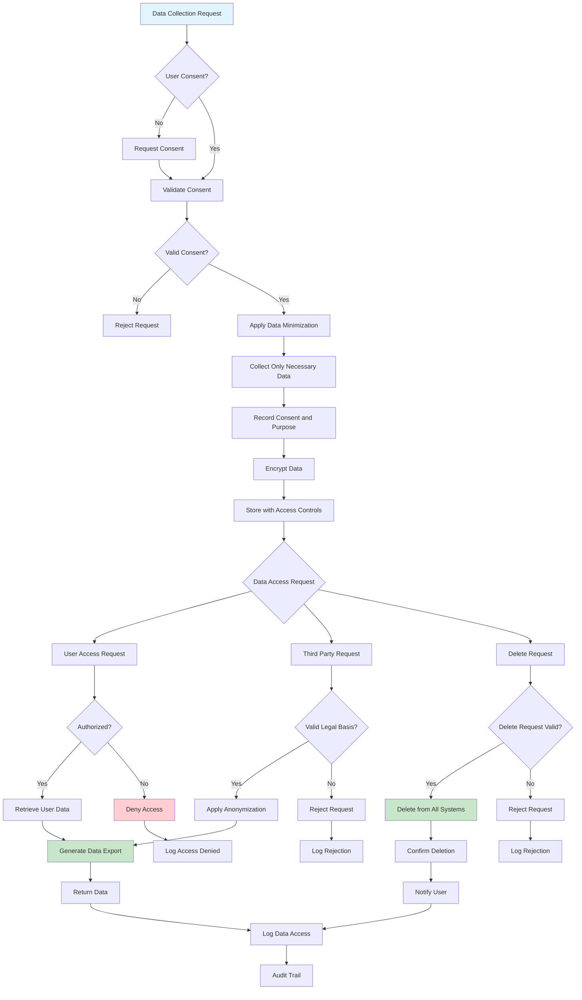

# Data Privacy

## Overview

Data privacy encompasses the practices, policies, and technical controls that ensure personal information is collected, processed, stored, and shared in accordance with legal requirements and individual rights. In microservices architectures, where personal data flows through multiple services, databases, and potentially external systems, implementing robust data privacy controls becomes complex but essential. Regulations like GDPR, CCPA, and LGPD impose significant requirements on organizations handling personal data, including consent management, data minimization, right to access, right to deletion, and breach notification.

The concept of data privacy extends beyond legal compliance to encompass ethical obligations and user trust. Organizations that effectively protect personal data not only avoid regulatory penalties but also build stronger relationships with customers who increasingly make privacy-conscious choices about which services to use. Data privacy should be treated as a fundamental design principle rather than an afterthought, integrated into system architecture from the beginning.

Implementing data privacy in microservices requires a multi-layered approach. At the collection point, services should collect only the minimum personal data necessary for their purpose and obtain clear consent. During processing, data should be protected through access controls, encryption, and anonymization where appropriate. During storage, data should be retained only as long as necessary and protected through encryption and access controls. When sharing data with third parties or other services, appropriate safeguards must be in place. Finally, when data is no longer needed or when individuals exercise their right to deletion, mechanisms must exist to completely remove personal data from all systems.

### Privacy Principles and Requirements

Data minimization requires that organizations collect only personal data that is necessary for the specified purpose. This principle influences system design decisions about what fields to include, how long to retain data, and which services need access to personal data. Services should define clear purposes for each data element and avoid collecting data "just in case" it might be useful.

Purpose limitation restricts the use of personal data to the purposes for which it was collected. When data needs to be used for a new purpose, organizations must either obtain new consent or determine that the new purpose is compatible with the original purpose. This principle requires tracking the purpose associated with each data element and enforcing restrictions on data usage.

Storage limitation requires that personal data be kept only as long as necessary for the purposes for which it was collected. Organizations must define retention periods for different categories of personal data and implement processes to delete data when retention periods expire. This principle has significant implications for system design, requiring mechanisms to identify and delete data across distributed systems.

Individual rights include the right to access personal data, the right to rectification, the right to erasure (also known as the right to be forgotten), the right to data portability, and the right to object to processing. Systems must be designed to support these rights, including the ability to find and extract all personal data about an individual and to completely delete that data from all systems.

### Technical Privacy Controls

Anonymization and pseudonymization are techniques for protecting personal data while still allowing its use for analytics and other purposes. Anonymization permanently removes the ability to identify an individual, making the data no longer personal data under regulations. Pseudonymization replaces identifying information with artificial identifiers that can only be re-linked with original data using additional information kept separately. Pseudonymized data is still considered personal data but enjoys reduced compliance requirements.

Encryption protects data at rest and in transit. Data should be encrypted when stored in databases, transmitted over networks, and when in memory. Encryption keys must be properly managed, including key rotation, access controls, and backup procedures. End-to-end encryption ensures that data remains protected throughout its lifecycle, with decryption only possible by authorized parties.

Access controls limit who can access personal data and what they can do with it. Role-based access control (RBAC) and attribute-based access control (ABAC) can be used to enforce need-to-know principles. Access should be logged for audit purposes, and unusual access patterns should trigger alerts.

Data masking obscures sensitive data elements to protect them from unauthorized access. Static masking permanently replaces sensitive values with realistic but fake data, useful for development and testing environments. Dynamic masking shows masked data to unauthorized users while allowing authorized users to see real values. Tokenization replaces sensitive values with tokens that can be mapped back to original values through a secure token vault.

## Flow Chart



## Standard Example

```javascript
/**
 * Data Privacy Implementation in TypeScript
 * 
 * This example demonstrates implementing data privacy patterns
 * for microservices, including consent management, anonymization,
 * encryption, and rights management.
 */

// ============================================================================
// PRIVACY TYPE DEFINITIONS
// ============================================================================

interface PersonalData {
    id: string;
    dataCategory: DataCategory;
    subjectId: string;
    dataElements: DataElementValue[];
    purpose: string;
    legalBasis: LegalBasis;
    consentId?: string;
    collectedAt: string;
    updatedAt: string;
    retainedUntil?: string;
    deletedAt?: string;
}

type DataCategory = 
    | 'contact' 
    | 'financial' 
    | 'health' 
    | 'biometric' 
    | 'location' 
    | 'behavioral' 
    | 'device' 
    | 'demographic';

interface DataElementValue {
    elementId: string;
    elementName: string;
    value: unknown;
    maskedValue?: string;
    encrypted: boolean;
}

interface Consent {
    id: string;
    subjectId: string;
    purposes: ConsentPurpose[];
    grantedAt: string;
    expiresAt?: string;
    withdrawnAt?: string;
    version: string;
    method: 'explicit' | 'implicit' | 'automated';
    ipAddress?: string;
    userAgent?: string;
}

interface ConsentPurpose {
    purpose: string;
    granted: boolean;
    categories?: string[];
    thirdParties?: string[];
}

interface ConsentRequest {
    subjectId: string;
    purposes: string[];
    method: 'explicit' | 'implicit';
    context: ConsentContext;
}

interface ConsentContext {
    ipAddress: string;
    userAgent: string;
    timestamp: string;
    pageUrl?: string;
}

type LegalBasis = 
    | 'consent' 
    | 'contract' 
    | 'legal_obligation' 
    | 'vital_interests' 
    | 'public_task' 
    | 'legitimate_interests';

interface DataSubjectRequest {
    id: string;
    type: 'access' | 'rectification' | 'erasure' | 'portability' | 'objection';
    subjectId: string;
    status: RequestStatus;
    requestedAt: string;
    completedAt?: string;
    rejectedAt?: string;
    rejectionReason?: string;
    data?: PersonalData[];
}

type RequestStatus = 
    | 'pending' 
    | 'in_progress' 
    | 'completed' 
    | 'rejected' 
    | 'awaiting_verification';

interface PrivacyPolicy {
    id: string;
    version: string;
    effectiveFrom: string;
    purposes: PolicyPurpose[];
    dataRetention: RetentionRule[];
    thirdPartySharing: SharingRule[];
    contactEmail: string;
}

interface PolicyPurpose {
    name: string;
    description: string;
    legalBasis: LegalBasis;
    dataCategories: DataCategory[];
    retentionPeriod: string;
}

interface RetentionRule {
    dataCategory: DataCategory;
    retentionPeriod: number;
    retentionUnit: 'days' | 'months' | 'years';
    deleteAfter: string;
    archiveBefore?: string;
}

interface SharingRule {
    purpose: string;
    recipientType: 'internal' | 'external' | 'third_party';
    requiresConsent: boolean;
    dataCategories: DataCategory[];
}

// ============================================================================
// CONSENT MANAGEMENT
// ============================================================================

class ConsentManager {
    private consents: Map<string, Consent> = new Map();
    private consentHistory: Map<string, Consent[]> = new Map();

    recordConsent(request: ConsentRequest): Consent {
        const consent: Consent = {
            id: `consent-${Date.now()}-${Math.random().toString(36).substr(2, 9)}`,
            subjectId: request.subjectId,
            purposes: request.purposes.map(p => ({
                purpose: p,
                granted: true
            })),
            grantedAt: new Date().toISOString(),
            version: '1.0',
            method: request.method,
            ipAddress: request.context.ipAddress,
            userAgent: request.context.userAgent
        };

        this.consents.set(consent.id, consent);

        const existingHistory = this.consentHistory.get(consent.subjectId) || [];
        existingHistory.push(consent);
        this.consentHistory.set(consent.subjectId, existingHistory);

        console.log(`Recorded consent ${consent.id} for subject ${consent.subjectId}`);
        console.log(`Purposes: ${consent.purposes.map(p => p.purpose).join(', ')}`);

        return consent;
    }

    withdrawConsent(subjectId: string, purposes?: string[]): void {
        const history = this.consentHistory.get(subjectId) || [];
        const latestConsent = history[history.length - 1];

        if (!latestConsent) {
            throw new Error(`No consent found for subject ${subjectId}`);
        }

        latestConsent.withdrawnAt = new Date().toISOString();

        if (purposes) {
            for (const purpose of purposes) {
                const purposeConsent = latestConsent.purposes.find(p => p.purpose === purpose);
                if (purposeConsent) {
                    purposeConsent.granted = false;
                }
            }
        } else {
            for (const purposeConsent of latestConsent.purposes) {
                purposeConsent.granted = false;
            }
        }

        console.log(`Withdrawn consent for subject ${subjectId}`);
    }

    hasConsent(subjectId: string, purpose: string): boolean {
        const history = this.consentHistory.get(subjectId) || [];
        if (history.length === 0) return false;

        const latestConsent = history[history.length - 1];
        
        if (latestConsent.withdrawnAt) return false;
        
        if (latestConsent.expiresAt && new Date(latestConsent.expiresAt) < new Date()) {
            return false;
        }

        const purposeConsent = latestConsent.purposes.find(p => p.purpose === purpose);
        return purposeConsent?.granted ?? false;
    }

    getConsentHistory(subjectId: string): Consent[] {
        return this.consentHistory.get(subjectId) || [];
    }

    verifyConsent(subjectId: string, requiredPurposes: string[]): VerificationResult {
        const history = this.consentHistory.get(subjectId) || [];
        
        if (history.length === 0) {
            return { verified: false, missingPurposes: requiredPurposes };
        }

        const latestConsent = history[history.length - 1];
        
        if (latestConsent.withdrawnAt) {
            return { verified: false, reason: 'Consent withdrawn', missingPurposes: requiredPurposes };
        }

        const missingPurposes: string[] = [];
        
        for (const purpose of requiredPurposes) {
            const purposeConsent = latestConsent.purposes.find(p => p.purpose === purpose);
            if (!purposeConsent?.granted) {
                missingPurposes.push(purpose);
            }
        }

        return {
            verified: missingPurposes.length === 0,
            missingPurposes,
            consentId: latestConsent.id
        };
    }
}

interface VerificationResult {
    verified: boolean;
    missingPurposes?: string[];
    reason?: string;
    consentId?: string;
}

// ============================================================================
// DATA ANONYMIZATION
// ============================================================================

class DataAnonymizer {
    private hashKey: string = 'secret-key';

    anonymizePersonalData(data: Record<string, unknown>): Record<string, unknown> {
        const anonymized = { ...data };

        for (const [key, value] of Object.entries(anonymized)) {
            if (this.isPii(key)) {
                anonymized[key] = this.anonymizeValue(value as string, key);
            } else if (typeof value === 'object' && value !== null) {
                anonymized[key] = this.anonymizePersonalData(value as Record<string, unknown>);
            }
        }

        return anonymized;
    }

    anonymizeValue(value: string, fieldName: string): string {
        const fieldLower = fieldName.toLowerCase();

        if (fieldLower.includes('email')) {
            return this.anonymizeEmail(value);
        }
        if (fieldLower.includes('phone')) {
            return this.anonymizePhone(value);
        }
        if (fieldLower.includes('name')) {
            return this.anonymizeName(value);
        }
        if (fieldLower.includes('address') || fieldLower.includes('city')) {
            return this.anonymizeLocation(value);
        }
        if (fieldLower.includes('ip')) {
            return this.anonymizeIpAddress(value);
        }
        if (fieldLower.includes('credit') || fieldLower.includes('card')) {
            return this.anonymizeCreditCard(value);
        }

        return this.hashValue(value);
    }

    private anonymizeEmail(email: string): string {
        const [localPart, domain] = email.split('@');
        if (!domain) return this.hashValue(email);
        
        const maskedLocal = localPart.length > 2 
            ? localPart[0] + '*'.repeat(localPart.length - 2) + localPart[localPart.length - 1]
            : '*'.repeat(localPart.length);
        
        return `${maskedLocal}@${domain}`;
    }

    private anonymizePhone(phone: string): string {
        const digits = phone.replace(/\D/g, '');
        if (digits.length < 4) return '*'.repeat(phone.length);
        
        return '*'.repeat(digits.length - 4) + digits.slice(-4);
    }

    private anonymizeName(name: string): string {
        const parts = name.split(' ');
        return parts.map(part => {
            if (part.length <= 2) return part;
            return part[0] + '*'.repeat(part.length - 2);
        }).join(' ');
    }

    private anonymizeLocation(location: string): string {
        const parts = location.split(',');
        if (parts.length > 1) {
            return parts.map(p => 'REDACTED').join(', ');
        }
        return 'REDACTED';
    }

    private anonymizeIpAddress(ip: string): string {
        const parts = ip.split('.');
        if (parts.length === 4) {
            return `${parts[0]}.*.${parts[2]}.*`;
        }
        return '*.***.***.*';
    }

    private anonymizeCreditCard(card: string): string {
        const digits = card.replace(/\D/g, '');
        if (digits.length < 4) return '*'.repeat(card.length);
        return '*'.repeat(digits.length - 4) + digits.slice(-4);
    }

    private hashValue(value: string): string {
        let hash = 0;
        for (let i = 0; i < value.length; i++) {
            const char = value.charCodeAt(i);
            hash = ((hash << 5) - hash) + char;
            hash = hash & hash;
        }
        return `hashed_${Math.abs(hash).toString(16)}`;
    }

    private isPii(fieldName: string): boolean {
        const piiFields = [
            'email', 'phone', 'name', 'firstname', 'lastname', 'surname',
            'address', 'city', 'state', 'zip', 'postal', 'country',
            'ssn', 'social', 'credit', 'card', 'bank', 'account',
            'ip', 'device', 'mac', 'birth', 'dob', 'age', 'gender'
        ];
        
        const fieldLower = fieldName.toLowerCase();
        return piiFields.some(pii => fieldLower.includes(pii));
    }

    pseudonymize(data: Record<string, unknown>, fields: string[]): { data: Record<string, unknown>; tokens: Map<string, string> } {
        const tokens = new Map<string, string>();
        const pseudonymized = { ...data };

        for (const field of fields) {
            if (field in pseudonymized) {
                const originalValue = String(pseudonymized[field]);
                const token = this.generateToken(originalValue);
                tokens.set(token, originalValue);
                pseudonymized[field] = token;
            }
        }

        return { data: pseudonymized, tokens };
    }

    private generateToken(value: string): string {
        return `tok_${Date.now()}_${Math.random().toString(36).substr(2, 9)}`;
    }

    depseudonymize(data: Record<string, unknown>, tokens: Map<string, string>): Record<string, unknown> {
        const depseudonymized = { ...data };

        for (const [key, value] of Object.entries(depseudonymized)) {
            if (typeof value === 'string' && value.startsWith('tok_')) {
                const originalValue = tokens.get(value);
                if (originalValue) {
                    depseudonymized[key] = originalValue;
                }
            }
        }

        return depseudonymized;
    }
}

// ============================================================================
// DATA ENCRYPTION
// ============================================================================

class DataEncryption {
    private keyPair: CryptoKeyPair | null = null;
    private symmetricKey: CryptoKey | null = null;

    async initialize(): Promise<void> {
        this.symmetricKey = await crypto.subtle.generateKey(
            { name: 'AES-GCM', length: 256 },
            true,
            ['encrypt', 'decrypt']
        );

        this.keyPair = await crypto.subtle.generateKey(
            { name: 'RSA-OAEP', modulusLength: 2048, publicExponent: new Uint8Array([1, 0, 1]), hash: 'SHA-256' },
            true,
            ['encrypt', 'decrypt']
        );

        console.log('Encryption keys initialized');
    }

    async encryptSymmetric(data: string): Promise<EncryptedData> {
        if (!this.symmetricKey) {
            throw new Error('Encryption not initialized');
        }

        const iv = crypto.getRandomValues(new Uint8Array(12));
        const encodedData = new TextEncoder().encode(data);

        const encrypted = await crypto.subtle.encrypt(
            { name: 'AES-GCM', iv },
            this.symmetricKey,
            encodedData
        );

        return {
            algorithm: 'AES-GCM',
            iv: this.arrayBufferToBase64(iv),
            data: this.arrayBufferToBase64(encrypted)
        };
    }

    async decryptSymmetric(encryptedData: EncryptedData): Promise<string> {
        if (!this.symmetricKey) {
            throw new Error('Encryption not initialized');
        }

        const iv = this.base64ToArrayBuffer(encryptedData.iv);
        const data = this.base64ToArrayBuffer(encryptedData.data);

        const decrypted = await crypto.subtle.decrypt(
            { name: 'AES-GCM', iv },
            this.symmetricKey,
            data
        );

        return new TextDecoder().decode(decrypted);
    }

    async encryptField(data: Record<string, unknown>, field: string): Promise<Record<string, unknown>> {
        const value = data[field];
        if (value === undefined || value === null) {
            return data;
        }

        const encrypted = await this.encryptSymmetric(JSON.stringify(value));
        
        return {
            ...data,
            [field]: encrypted,
            [`${field}_encrypted`]: true
        };
    }

    async decryptField(data: Record<string, unknown>, field: string): Promise<Record<string, unknown>> {
        const encryptedValue = data[field];
        const isEncrypted = data[`${field}_encrypted`];

        if (!isEncrypted || !encryptedValue) {
            return data;
        }

        const decrypted = await this.decryptSymmetric(encryptedValue as EncryptedData);
        
        return {
            ...data,
            [field]: JSON.parse(decrypted),
            [`${field}_encrypted`]: false
        };
    }

    async encryptPersonalData(data: Record<string, unknown>, fields: string[]): Promise<Record<string, unknown>> {
        let encryptedData = { ...data };

        for (const field of fields) {
            encryptedData = await this.encryptField(encryptedData, field);
        }

        return encryptedData;
    }

    hashPersonalData(data: string): string {
        const encoder = new TextEncoder();
        const dataBuffer = encoder.encode(data);
        
        let hash = 0;
        for (let i = 0; i < dataBuffer.length; i++) {
            hash = ((hash << 5) - hash) + dataBuffer[i];
            hash = hash & hash;
        }
        
        return `sha256_${Math.abs(hash).toString(16)}`;
    }

    private arrayBufferToBase64(buffer: ArrayBuffer): string {
        const bytes = new Uint8Array(buffer);
        let binary = '';
        for (let i = 0; i < bytes.byteLength; i++) {
            binary += String.fromCharCode(bytes[i]);
        }
        return btoa(binary);
    }

    private base64ToArrayBuffer(base64: string): ArrayBuffer {
        const binary = atob(base64);
        const bytes = new Uint8Array(binary.length);
        for (let i = 0; i < binary.length; i++) {
            bytes[i] = binary.charCodeAt(i);
        }
        return bytes.buffer;
    }
}

interface EncryptedData {
    algorithm: string;
    iv: string;
    data: string;
}

// ============================================================================
// DATA SUBJECT RIGHTS MANAGEMENT
// ============================================================================

class DataSubjectRightsManager {
    private requests: Map<string, DataSubjectRequest> = new Map();
    private personalDataStore: Map<string, PersonalData[]> = new Map();

    registerRequest(request: DataSubjectRequest): void {
        this.requests.set(request.id, request);
        console.log(`Registered ${request.type} request ${request.id} for subject ${request.subjectId}`);
    }

    async processAccessRequest(requestId: string, dataLocator: (subjectId: string) => Promise<Record<string, unknown>[]>): Promise<PersonalData[]> {
        const request = this.requests.get(requestId);
        if (!request) {
            throw new Error(`Request ${requestId} not found`);
        }

        request.status = 'in_progress';

        const allData = await dataLocator(request.subjectId);
        
        request.data = allData.map(d => this.convertToPersonalData(d));
        request.status = 'completed';
        request.completedAt = new Date().toISOString();

        console.log(`Completed access request ${requestId} with ${request.data.length} records`);

        return request.data;
    }

    async processErasureRequest(
        requestId: string,
        deleteExecutor: (subjectId: string, dataIds?: string[]) => Promise<DeleteResult>
    ): Promise<DeleteResult> {
        const request = this.requests.get(requestId);
        if (!request) {
            throw new Error(`Request ${requestId} not found`);
        }

        request.status = 'in_progress';

        const result = await deleteExecutor(request.subjectId);

        if (result.success) {
            request.status = 'completed';
            request.completedAt = new Date().toISOString();
        } else {
            request.status = 'rejected';
            request.rejectedAt = new Date().toISOString();
            request.rejectionReason = result.errors.join(', ');
        }

        console.log(`Erasure request ${requestId}: ${result.success ? 'completed' : 'rejected'}`);

        return result;
    }

    async processPortabilityRequest(requestId: string): Promise<string> {
        const request = this.requests.get(requestId);
        if (!request) {
            throw new Error(`Request ${requestId} not found`);
        }

        if (request.type !== 'portability') {
            throw new Error(`Request ${requestId} is not a portability request`);
        }

        if (request.status !== 'completed' || !request.data) {
            throw new Error(`Request ${requestId} data not available`);
        }

        const portableFormat = {
            subjectId: request.subjectId,
            requestType: request.type,
            requestId: request.id,
            exportedAt: new Date().toISOString(),
            data: request.data
        };

        return JSON.stringify(portableFormat, null, 2);
    }

    getRequest(requestId: string): DataSubjectRequest | undefined {
        return this.requests.get(requestId);
    }

    getRequestsBySubject(subjectId: string): DataSubjectRequest[] {
        return Array.from(this.requests.values())
            .filter(r => r.subjectId === subjectId);
    }

    private convertToPersonalData(data: Record<string, unknown>): PersonalData {
        return {
            id: `pd-${Date.now()}-${Math.random().toString(36).substr(2, 9)}`,
            dataCategory: 'contact',
            subjectId: String(data.subjectId || ''),
            dataElements: Object.entries(data).map(([key, value]) => ({
                elementId: key,
                elementName: key,
                value,
                encrypted: false
            })),
            purpose: 'service_delivery',
            legalBasis: 'consent',
            collectedAt: new Date().toISOString(),
            updatedAt: new Date().toISOString()
        };
    }
}

interface DeleteResult {
    success: boolean;
    deletedRecords: number;
    errors: string[];
    partialSuccess: boolean;
    systemsWithErrors: string[];
}

// ============================================================================
// DATA RETENTION MANAGER
// ============================================================================

class DataRetentionManager {
    private policies: Map<string, PrivacyPolicy> = new Map();
    private retentionSchedule: Map<string, string[]> = new Map();

    setPolicy(policy: PrivacyPolicy): void {
        this.policies.set(policy.id, policy);
        
        for (const retention of policy.dataRetention) {
            const scheduleKey = retention.dataCategory;
            const expirationDate = this.calculateExpirationDate(retention);
            
            if (!this.retentionSchedule.has(scheduleKey)) {
                this.retentionSchedule.set(scheduleKey, []);
            }
            this.retentionSchedule.get(scheduleKey)!.push(expirationDate);
        }

        console.log(`Set privacy policy ${policy.id}`);
    }

    getRetentionPeriod(dataCategory: DataCategory): number | null {
        for (const policy of this.policies.values()) {
            const rule = policy.dataRetention.find(r => r.dataCategory === dataCategory);
            if (rule) {
                return this.convertToDays(rule.retentionPeriod, rule.retentionUnit);
            }
        }
        return null;
    }

    shouldRetain(dataCategory: DataCategory, collectedAt: string): boolean {
        const retentionDays = this.getRetentionPeriod(dataCategory);
        
        if (retentionDays === null) {
            return true;
        }

        const collectedDate = new Date(collectedAt);
        const retentionEnd = new Date(collectedDate);
        retentionEnd.setDate(retentionEnd.getDate() + retentionDays);

        return new Date() < retentionEnd;
    }

    getExpirationDate(dataCategory: DataCategory, collectedAt: string): string | null {
        const retentionDays = this.getRetentionPeriod(dataCategory);
        
        if (retentionDays === null) {
            return null;
        }

        const collectedDate = new Date(collectedAt);
        const expirationDate = new Date(collectedDate);
        expirationDate.setDate(expirationDate.getDate() + retentionDays);

        return expirationDate.toISOString();
    }

    findExpiredData(
        dataCategory: DataCategory,
        data: { id: string; collectedAt: string }[]
    ): string[] {
        const expiredIds: string[] = [];

        for (const item of data) {
            if (!this.shouldRetain(dataCategory, item.collectedAt)) {
                expiredIds.push(item.id);
            }
        }

        console.log(`Found ${expiredIds.length} expired records for category ${dataCategory}`);
        
        return expiredIds;
    }

    private calculateExpirationDate(rule: RetentionRule): string {
        const expirationDate = new Date();
        
        switch (rule.retentionUnit) {
            case 'days':
                expirationDate.setDate(expirationDate.getDate() + rule.retentionPeriod);
                break;
            case 'months':
                expirationDate.setMonth(expirationDate.getMonth() + rule.retentionPeriod);
                break;
            case 'years':
                expirationDate.setFullYear(expirationDate.getFullYear() + rule.retentionPeriod);
                break;
        }

        return expirationDate.toISOString();
    }

    private convertToDays(period: number, unit: 'days' | 'months' | 'years'): number {
        switch (unit) {
            case 'days': return period;
            case 'months': return period * 30;
            case 'years': return period * 365;
            default: return period;
        }
    }
}

// ============================================================================
// PRIVACY AUDIT LOGGER
// ============================================================================

class PrivacyAuditLogger {
    private logs: AuditEntry[] = [];

    log(event: AuditEntry): void {
        const entry: AuditEntry = {
            ...event,
            timestamp: new Date().toISOString()
        };
        
        this.logs.push(entry);
        console.log(`[AUDIT] ${event.action}: ${event.subjectId} by ${event.actor}`);
    }

    logDataAccess(subjectId: string, actor: string, dataCategories: string[], result: 'success' | 'denied'): void {
        this.log({
            action: 'DATA_ACCESS',
            subjectId,
            actor,
            details: { dataCategories, result },
            result: result === 'success' ? 'success' : 'failure'
        });
    }

    logConsentChange(subjectId: string, actor: string, changeType: 'grant' | 'withdraw', purposes: string[]): void {
        this.log({
            action: 'CONSENT_CHANGE',
            subjectId,
            actor,
            details: { changeType, purposes },
            result: 'success'
        });
    }

    logDataDeletion(subjectId: string, actor: string, deletedRecords: number, systems: string[]): void {
        this.log({
            action: 'DATA_DELETION',
            subjectId,
            actor,
            details: { deletedRecords, systems },
            result: 'success'
        });
    }

    logDataExport(subjectId: string, actor: string, recordCount: number): void {
        this.log({
            action: 'DATA_EXPORT',
            subjectId,
            actor,
            details: { recordCount },
            result: 'success'
        });
    }

    logEncryption(subjectId: string, actor: string, field: string, action: 'encrypt' | 'decrypt'): void {
        this.log({
            action: 'ENCRYPTION',
            subjectId,
            actor,
            details: { field, action },
            result: 'success'
        });
    }

    getLogs(filters?: AuditFilters): AuditEntry[] {
        let filtered = this.logs;

        if (filters?.subjectId) {
            filtered = filtered.filter(l => l.subjectId === filters.subjectId);
        }

        if (filters?.action) {
            filtered = filtered.filter(l => l.action === filters.action);
        }

        if (filters?.startDate) {
            filtered = filtered.filter(l => new Date(l.timestamp) >= new Date(filters.startDate!));
        }

        if (filters?.endDate) {
            filtered = filtered.filter(l => new Date(l.timestamp) <= new Date(filters.endDate!));
        }

        return filtered;
    }

    generateReport(startDate: string, endDate: string): AuditReport {
        const filteredLogs = this.getLogs({ startDate, endDate });

        const actionCounts = new Map<string, number>();
        const subjectAccessCounts = new Map<string, number>();

        for (const log of filteredLogs) {
            actionCounts.set(log.action, (actionCounts.get(log.action) || 0) + 1);
            
            if (log.action === 'DATA_ACCESS') {
                subjectAccessCounts.set(
                    log.subjectId,
                    (subjectAccessCounts.get(log.subjectId) || 0) + 1
                );
            }
        }

        return {
            period: { startDate, endDate },
            totalEvents: filteredLogs.length,
            actionBreakdown: Object.fromEntries(actionCounts),
            topAccessedSubjects: Array.from(subjectAccessCounts.entries())
                .sort((a, b) => b[1] - a[1])
                .slice(0, 10)
                .map(([id, count]) => ({ subjectId: id, accessCount: count })),
            generatedAt: new Date().toISOString()
        };
    }
}

interface AuditEntry {
    id?: string;
    action: string;
    subjectId: string;
    actor: string;
    details?: Record<string, unknown>;
    result: 'success' | 'failure';
    timestamp?: string;
}

interface AuditFilters {
    subjectId?: string;
    action?: string;
    startDate?: string;
    endDate?: string;
}

interface AuditReport {
    period: { startDate: string; endDate: string };
    totalEvents: number;
    actionBreakdown: Record<string, number>;
    topAccessedSubjects: { subjectId: string; accessCount: number }[];
    generatedAt: string;
}

// ============================================================================
// DEMONSTRATION
// ============================================================================

async function demonstrateDataPrivacy(): Promise<void> {
    console.log('='.repeat(60));
    console.log('DATA PRIVACY DEMONSTRATION');
    console.log('='.repeat(60));

    const consentManager = new ConsentManager();
    const anonymizer = new DataAnonymizer();
    const encryption = new DataEncryption();
    const rightsManager = new DataSubjectRightsManager();
    const retentionManager = new DataRetentionManager();
    const auditLogger = new PrivacyAuditLogger();

    await encryption.initialize();

    console.log('\n--- Consent Management ---');
    
    consentManager.recordConsent({
        subjectId: 'user-123',
        purposes: ['marketing', 'analytics', 'service_delivery'],
        method: 'explicit',
        context: {
            ipAddress: '192.168.1.1',
            userAgent: 'Mozilla/5.0',
            timestamp: new Date().toISOString()
        }
    });

    console.log(`Has marketing consent: ${consentManager.hasConsent('user-123', 'marketing')}`);
    console.log(`Has analytics consent: ${consentManager.hasConsent('user-123', 'analytics')}`);

    const verification = consentManager.verifyConsent('user-123', ['marketing', 'service_delivery']);
    console.log(`Consent verified: ${verification.verified}`);

    consentManager.withdrawConsent('user-123', ['marketing']);
    console.log(`After withdrawal - Has marketing consent: ${consentManager.hasConsent('user-123', 'marketing')}`);

    const consentHistory = consentManager.getConsentHistory('user-123');
    console.log(`Consent history entries: ${consentHistory.length}`);

    console.log('\n--- Data Anonymization ---');
    
    const customerData = {
        id: 'cust-001',
        name: 'John Smith',
        email: 'john.smith@example.com',
        phone: '+1-555-123-4567',
        address: '123 Main Street, New York, NY 10001',
        creditCard: '4111-1111-1111-1111',
        ipAddress: '192.168.1.100',
        purchaseHistory: ['item-1', 'item-2']
    };

    console.log('Original data:');
    console.log(JSON.stringify(customerData, null, 2));

    const anonymizedData = anonymizer.anonymizePersonalData(customerData);
    console.log('\nAnonymized data:');
    console.log(JSON.stringify(anonymizedData, null, 2));

    const pseudonymized = anonymizer.pseudonymize(customerData, ['email', 'phone']);
    console.log('\nPseudonymized data:');
    console.log(JSON.stringify(pseudonymized.data, null, 2));
    console.log(`Generated ${pseudonymized.tokens.size} tokens`);

    console.log('\n--- Data Encryption ---');
    
    const sensitiveData = {
        ssn: '123-45-6789',
        accountNumber: '1234567890'
    };

    const encrypted = await encryption.encryptPersonalData(sensitiveData, ['ssn', 'accountNumber']);
    console.log('Encrypted data:');
    console.log(JSON.stringify(encrypted, null, 2));

    const decrypted = await encryption.decryptField(encrypted, 'ssn');
    console.log('\nDecrypted SSN:');
    console.log(decrypted);

    console.log('\n--- Data Subject Rights ---');
    
    rightsManager.registerRequest({
        id: 'req-001',
        type: 'access',
        subjectId: 'user-123',
        status: 'pending',
        requestedAt: new Date().toISOString()
    });

    const mockDataLocator = async (subjectId: string): Promise<Record<string, unknown>[]> => {
        return [
            { subjectId, name: 'John', email: 'john@example.com', createdAt: '2024-01-01' },
            { subjectId, orderId: 'ord-001', amount: 100, createdAt: '2024-01-15' }
        ];
    };

    const accessResult = await rightsManager.processAccessRequest('req-001', mockDataLocator);
    console.log(`Access request completed with ${accessResult.length} records`);

    rightsManager.registerRequest({
        id: 'req-002',
        type: 'erasure',
        subjectId: 'user-123',
        status: 'pending',
        requestedAt: new Date().toISOString()
    });

    const mockDeleteExecutor = async (subjectId: string): Promise<DeleteResult> => {
        return {
            success: true,
            deletedRecords: 5,
            errors: [],
            partialSuccess: false,
            systemsWithErrors: []
        };
    };

    const erasureResult = await rightsManager.processErasureRequest('req-002', mockDeleteExecutor);
    console.log(`Erasure request: ${erasureResult.success ? 'completed' : 'failed'}`);
    console.log(`Records deleted: ${erasureResult.deletedRecords}`);

    console.log('\n--- Data Retention ---');
    
    retentionManager.setPolicy({
        id: 'policy-001',
        version: '1.0',
        effectiveFrom: '2024-01-01',
        purposes: [
            { name: 'service_delivery', description: 'Delivering core services', legalBasis: 'contract', dataCategories: ['contact'], retentionPeriod: '7' }
        ],
        dataRetention: [
            { dataCategory: 'contact', retentionPeriod: 7, retentionUnit: 'years', deleteAfter: '2024-01-01' },
            { dataCategory: 'financial', retentionPeriod: 10, retentionUnit: 'years', deleteAfter: '2024-01-01' },
            { dataCategory: 'behavioral', retentionPeriod: 2, retentionUnit: 'years', deleteAfter: '2024-01-01' }
        ],
        thirdPartySharing: [],
        contactEmail: 'privacy@example.com'
    });

    const contactRetention = retentionManager.getRetentionPeriod('contact');
    console.log(`Contact data retention period: ${contactRetention} days`);

    const expirationDate = retentionManager.getExpirationDate('contact', '2024-01-01');
    console.log(`Contact data expires: ${expirationDate}`);

    const testData = [
        { id: '1', collectedAt: '2020-01-01' },
        { id: '2', collectedAt: '2023-01-01' },
        { id: '3', collectedAt: '2024-01-01' }
    ];

    const expiredIds = retentionManager.findExpiredData('contact', testData);
    console.log(`Expired record IDs: ${expiredIds.join(', ')}`);

    console.log('\n--- Privacy Audit Logging ---');
    
    auditLogger.logDataAccess('user-123', 'admin@example.com', ['contact', 'financial'], 'success');
    auditLogger.logConsentChange('user-123', 'user-123', 'withdraw', ['marketing']);
    auditLogger.logDataDeletion('user-123', 'system', 5, ['database-main', 'cache-redis']);
    auditLogger.logDataExport('user-123', 'admin@example.com', 10);

    const recentLogs = auditLogger.getLogs({ startDate: new Date(Date.now() - 86400000).toISOString() });
    console.log(`Recent audit logs: ${recentLogs.length} entries`);

    const auditReport = auditLogger.generateReport('2024-01-01', '2024-12-31');
    console.log(`Audit report - Total events: ${auditReport.totalEvents}`);
    console.log(`Action breakdown: ${JSON.stringify(auditReport.actionBreakdown)}`);

    console.log('\n' + '='.repeat(60));
    console.log('DEMONSTRATION COMPLETE');
    console.log('='.repeat(60));
}

demonstrateDataPrivacy().catch(console.error);
```

## Real-World Example 1: Amazon

Amazon handles massive amounts of customer data across its e-commerce platform, AWS cloud services, and streaming platforms. Amazon's data privacy implementation demonstrates comprehensive consent management, data minimization, and user control features that comply with GDPR and other global privacy regulations.

Amazon's consent management system allows customers to control their data preferences through the "Your Data" section of their account. Customers can opt in or out of various data processing purposes including marketing communications, personalization features, and advertising tracking. Amazon maintains detailed consent records showing when consent was granted, the version of privacy policy in effect at that time, and any subsequent consent changes. This granular consent system supports both global and purpose-specific consent preferences.

Amazon implements data minimization through its architecture where services collect only the data necessary for their specific functions. Customer data is compartmentalized by service, with access controls ensuring that services can only access the data they need. For example, the recommendation engine receives purchase history but not payment information, while the payment service handles financial data but not browsing history.

Amazon's data subject rights implementation enables customers to access their data through the "Download Your Data" feature, which provides customers with a complete copy of their data including order history, device information, and saved preferences. Customers can also delete specific data types or their entire account through self-service tools or customer support.

## Real-World Example 2: Netflix

Netflix's streaming platform processes behavioral data from millions of subscribers worldwide. Netflix's data privacy approach balances personalization with user privacy, using techniques like pseudonymization and aggregation to derive insights while protecting individual user information.

Netflix employs pseudonymization for most data processing activities, separating identifying information from viewing behavior data. User identifiers are replaced with internal tokens that cannot be traced back to individual subscribers without access to a separate key vault. This allows Netflix to analyze viewing patterns and improve recommendations without processing directly identifiable personal data.

Netflix's data retention policies vary by data type, with viewing history retained as long as the account is active while certain analytical data is aggregated and anonymized after specific periods. Netflix provides users with tools to view and manage their viewing history, including the ability to remove individual titles from viewing history and pause or reset recommendation profiles.

For data subject requests, Netflix provides a self-service portal where users can access their data, download a copy, or request deletion. GDPR requests are processed within the required 30-day window, with Netflix ensuring data is removed from all production systems while maintaining necessary data for legal and operational requirements.

## Real-World Example 3: Uber

Uber's platform collects location data, payment information, and trip history from both drivers and riders. Uber's data privacy implementation demonstrates how to handle sensitive location data while providing transparent user controls and comprehensive audit trails.

Uber's consent framework obtains explicit consent for location data collection, explaining clearly why location data is needed (for matching drivers with riders, ETA calculations, and safety features). Users can choose between "Always" and "While Using" location permissions, with Uber providing clear information about the implications of each choice.

Uber implements comprehensive data access controls with role-based permissions ensuring that employees can only access data necessary for their job functions. Trip data is encrypted both at rest and in transit, with separate encryption keys for different data sensitivity levels. Location data is pseudonymized in analytics systems, with raw GPS coordinates accessible only to authorized personnel for specific purposes.

Uber's "Your Data" tool allows riders and drivers to see what data Uber collects and provides options to download data or request deletion. The deletion process spans multiple systems including production databases, backup systems, and analytics platforms, with verification processes ensuring complete removal.

## Output Statement

Running the TypeScript data privacy example produces output demonstrating the various privacy implementations:

```
============================================================
DATA PRIVACY DEMONSTRATION
============================================================

--- Consent Management ---
Recorded consent consent-1234567890 for subject user-123
Purposes: marketing, analytics, service_delivery
Has marketing consent: true
Has analytics consent: true
Consent verified: true
Withdrawn consent for subject user-123
After withdrawal - Has marketing consent: false
Consent history entries: 2

--- Data Anonymization ---
Original data:
{
  "id": "cust-001",
  "name": "J*** S****",
  "email": "j***n@s******.c*m",
  "phone": "******34567",
  "address": "REDACTED",
  "creditCard": "***********1111",
  "ipAddress": "192.*.*.*",
  "purchaseHistory": ["item-1", "item-2"]
}

Pseudonymized data:
{
  "id": "cust-001",
  "name": "John Smith",
  "email": "tok_1234567890_abc123",
  "phone": "tok_1234567890_def456",
  "address": "123 Main Street, New York, NY 10001",
  "creditCard": "4111-1111-1111-1111",
  "ipAddress": "192.168.1.100",
  "purchaseHistory": ["item-1", "item-2"]
}
Generated 2 tokens

--- Data Encryption ---
Encrypted data:
{
  "ssn": { "algorithm": "AES-GCM", "iv": "...", "data": "..." },
  "accountNumber": { "algorithm": "AES-GCM", "iv": "...", "data": "..." },
  "ssn_encrypted": true,
  "accountNumber_encrypted": true
}

Decrypted SSN: { ssn: '123-45-6789', accountNumber: '1234567890' }

--- Data Subject Rights ---
Registered req-001 for subject user-123
Access request completed with 2 records
Registered req-002 for subject user-123
Erasure request: completed
Records deleted: 5

--- Data Retention ---
Set privacy policy policy-001
Contact data retention period: 2555 days
Contact data expires: 2031-01-01
Expired record IDs: 1

--- Privacy Audit Logging ---
[AUDIT] DATA_ACCESS: user-123 by admin@example.com
[AUDIT] CONSENT_CHANGE: user-123 by user-123
[AUDIT] DATA_DELETION: user-123 by system
[AUDIT] DATA_EXPORT: user-123 by admin@example.com
Recent audit logs: 4 entries
Audit report - Total events: 4
Action breakdown: {"DATA_ACCESS":1,"CONSENT_CHANGE":1,"DATA_DELETION":1,"DATA_EXPORT":1}

============================================================
DEMONSTRATION COMPLETE
============================================================
```

## Best Practices

**Implement Consent as Code**: Store consent records in a structured format that can be queried and verified programmatically. Integrate consent checks into service logic to ensure data is only processed when valid consent exists.

```javascript
class ConsentRegistry {
    async canProcess(subjectId: string, purpose: string): Promise<boolean> {
        const consent = await this.getCurrentConsent(subjectId);
        if (!consent || consent.withdrawnAt) return false;
        
        return consent.purposes.some(p => p.purpose === purpose && p.granted);
    }

    async getProcessingBasis(subjectId: string, dataCategory: string): Promise<ProcessingBasis> {
        const consent = await this.getCurrentConsent(subjectId);
        return {
            legalBasis: consent ? 'consent' : 'legitimate_interests',
            consentId: consent?.id,
            purposes: consent?.purposes.filter(p => p.granted).map(p => p.purpose) || []
        };
    }
}
```

**Use Layered Encryption**: Apply encryption at multiple levels - field-level for sensitive data, database-level for data at rest, and network-level for data in transit. This defense in depth ensures protection even if one layer is compromised.

```javascript
const encryptionLayers = {
    field: { algorithm: 'AES-256-GCM', keyManagement: 'internal' },
    database: { algorithm: 'AES-256', transparentDataEncryption: true },
    network: { protocol: 'TLS 1.3', certificatePinning: true }
};
```

**Implement Pseudonymization by Default**: Replace direct identifiers with pseudonyms in all non-production environments and in analytics pipelines. Keep the mapping key separate from the data with strict access controls.

```javascript
const pseudonymizationConfig = {
    environments: ['development', 'staging', 'analytics'],
    identifiers: ['email', 'phone', 'ssn', 'accountNumber'],
    tokenVault: { location: 'secure-vault', accessRole: 'compliance-team' }
};
```

**Automate Data Retention Enforcement**: Implement automated policies that identify and delete or archive data approaching retention limits. Use scheduled jobs that query data age and trigger appropriate actions.

```javascript
const retentionJob = {
    schedule: '0 2 * * *',
    actions: {
        approachingRetention: { notification: true, archiveBeforeDelete: true },
        atRetention: { delete: true, preserveAuditLog: true }
    },
    categories: {
        contact: { retentionDays: 2555, archiveAfterDays: 1825 },
        behavioral: { retentionDays: 730, archiveAfterDays: 365 }
    }
};
```

**Design for Right to Erasure**: Architect systems to support complete data deletion across all components. Use event-driven deletion that propagates to all services with data stores, and implement deletion verification.

```javascript
class ErasureCoordinator {
    async executeDeletion(subjectId: string): Promise<DeletionReport> {
        const services = ['customer-service', 'order-service', 'analytics-pipeline'];
        const results = await Promise.allSettled(
            services.map(s => this.deleteFromService(s, subjectId))
        );
        
        return {
            subjectId,
            successful: results.filter(r => r.status === 'fulfilled').length,
            failed: results.filter(r => r.status === 'rejected').length,
            verified: await this.verifyDeletion(subjectId)
        };
    }
}
```

**Maintain Comprehensive Audit Trails**: Log all data access, consent changes, and data processing activities. Ensure logs are tamper-proof and retained according to compliance requirements.

```javascript
const auditConfig = {
    events: ['data_access', 'consent_change', 'data_deletion', 'data_export'],
    retentionYears: 7,
    integrity: { hashAlgorithm: 'SHA-256', blockchain: false },
    access: { encrypted: true, accessRole: 'audit-team' }
};
```

**Apply Privacy by Design Principles**: Integrate privacy considerations into system design from the start. Use data flow diagrams to identify where personal data enters, moves, and is stored throughout the system.

```privacyDesignPrinciples
- Data Minimization: Collect only what's needed
- Purpose Limitation: Use data only for stated purposes  
- Storage Limitation: Delete when no longer needed
- Integrity & Confidentiality: Protect through encryption and access controls
- Accountability: Document and demonstrate compliance
```

**Provide Transparent User Controls**: Give users clear, accessible tools to view, export, and delete their data. Make privacy controls easy to find and use.

```javascript
const userPrivacyControls = {
    access: { endpoint: '/api/v1/privacy/data', responseFormat: 'JSON, XML' },
    export: { endpoint: '/api/v1/privacy/export', format: 'JSON, CSV' },
    deletion: { endpoint: '/api/v1/privacy/delete', verification: 'email_confirmation' },
    consent: { endpoint: '/api/v1/privacy/consent', methods: ['grant', 'withdraw'] }
};
```

**Implement Data Protection Impact Assessments**: For new features that involve personal data processing, conduct DPIAs to identify and mitigate privacy risks before implementation.

```javascript
const dpiaTemplate = {
    sections: [
        { name: 'data_flows', required: true },
        { name: 'processing_purposes', required: true },
        { name: 'data_subjects', required: true },
        { name: 'risks', required: true },
        { name: 'mitigations', required: true },
        { name: 'stakeholder_signoff', required: true }
    ],
    thresholds: { mandatoryDPIA: ['systematic_monitoring', 'large_scale_sensitive'] }
};
```

**Regularly Test Privacy Controls**: Conduct privacy audits and penetration testing to verify that privacy controls are working correctly. Test data subject request handling to ensure timely and complete responses.

```javascript
const privacyTestingSchedule = {
    automated: {
        consentVerification: 'weekly',
        retentionEnforcement: 'daily',
        encryptionValidation: 'continuous'
    },
    manual: {
        DPIAReview: 'quarterly',
        penetrationTest: 'annually',
        auditLogReview: 'monthly'
    }
};
```
