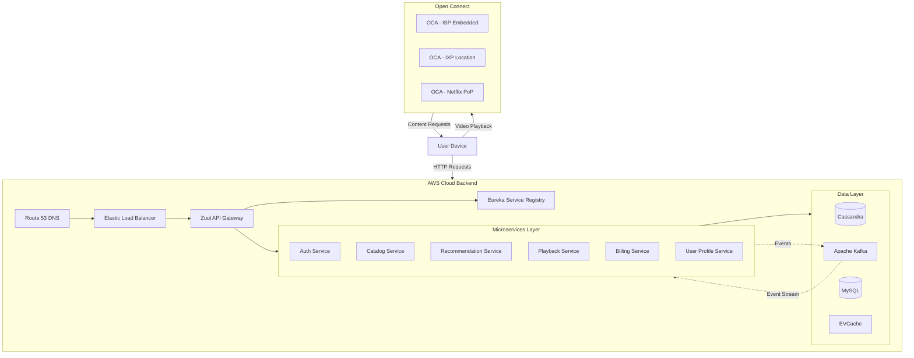

# Netflix Architecture Overview

## Overview

Netflix operates as one of the world's largest streaming platforms, serving over 230 million subscribers across 190+ countries. To achieve this scale, Netflix pioneered a cloud-native microservices architecture that has become a benchmark for the industry. The architecture consists of three primary components: the Client (user devices), the Backend (AWS-based services), and Open Connect (Netflix's custom CDN). Understanding this architecture provides deep insights into how modern distributed systems achieve massive scale while maintaining high availability and reliability.

The Netflix migration from a monolithic architecture to microservices began in 2009 after a significant database corruption incident that took down the service for several days. This event catalyzed a complete transformation of their technical infrastructure. The company chose to embrace microservices architecture to enable independent scaling, faster deployments, fault isolation, and technology flexibility across different service components. Today, Netflix runs over 1,000 microservices, each responsible for specific business capabilities, from user authentication to video encoding to recommendation algorithms.

The architectural philosophy at Netflix centers on building resilient, loosely coupled services that can evolve independently. This approach allows different teams to work on different services simultaneously without affecting the entire system. The company uses AWS as its primary cloud infrastructure provider, with services deployed across multiple availability zones and regions. Netflix also built custom solutions like Open Connect for content delivery, demonstrating their commitment to building purpose-built infrastructure rather than relying solely on existing commercial solutions.

---

## Netflix System Architecture Components

### 1. Client Layer

The client layer encompasses all device applications that users interact with to watch Netflix content. This includes smart TV applications, mobile apps (iOS and Android), web browsers, gaming consoles, and set-top boxes. Netflix invests heavily in maintaining consistent user experiences across all these platforms by developing custom SDKs and player components that can adapt to various device capabilities and network conditions. The client applications are responsible for handling video playback, adaptive bitrate streaming, DRM (Digital Rights Management), and user interface rendering. Each client type communicates with the backend through standardized APIs, allowing the backend services to remain agnostic of the specific device being used.

### 2. Backend Layer (AWS)

The backend layer runs on Amazon Web Services and handles all operations that occur before video playback begins. This includes user authentication, subscription management, content metadata retrieval, recommendation generation, and playback authorization. The backend consists of hundreds of microservices that communicate through APIs and event-driven patterns. Key backend components include the API Gateway (Zuul), service discovery (Eureka), circuit breaker (Hystrix), and various data stores including Cassandra, MySQL, and EVCache. The backend also handles video processing workflows, where raw video content is encoded into multiple quality levels and formats suitable for different network conditions and device capabilities.

### 3. Open Connect CDN

Open Connect is Netflix's globally distributed content delivery network, purpose-built for efficient video delivery. Unlike traditional CDNs that rely on demand-driven caching, Netflix's Open Connect uses proactive content provisioning to store popular content closer to users. The network consists of Open Connect Appliances (OCAs) deployed at Internet Exchange Points (IXPs) and within ISP networks worldwide. This approach reduces backbone network traffic, improves video quality, and decreases latency. The OCAs continuously report their health and content availability to AWS-based control plane services, which use this information to direct clients to the optimal server for their playback requests.

---

## Architecture Flow Diagram



---

## Standard Example: Microservices Architecture

The following example demonstrates a basic microservices architecture inspired by Netflix's design patterns, implementing service discovery, API gateway, and circuit breaker patterns.

```java
// EurekaServerApplication.java - Service Registry
package com.example.eureka;

import org.springframework.boot.SpringApplication;
import org.springframework.boot.autoconfigure.SpringBootApplication;
import org.springframework.cloud.netflix.eureka.server.EnableEurekaServer;

@SpringBootApplication
@EnableEurekaServer
public class EurekaServerApplication {
    public static void main(String[] args) {
        SpringApplication.run(EurekaServerApplication.class, args);
    }
}

// application.yml - Eureka Server Configuration
eureka:
  instance:
    hostname: localhost
  client:
    registerWithEureka: false
    fetchRegistry: false
    serviceUrl:
      defaultZone: http://${eureka.instance.hostname}:${server.port}/eureka/
  server:
    enableSelfPreservation: false
    evictionIntervalTimerInMs: 60000
```

```java
// MovieServiceApplication.java - Movie Catalog Microservice
package com.example.movies;

import org.springframework.boot.SpringApplication;
import org.springframework.boot.autoconfigure.SpringBootApplication;
import org.springframework.cloud.client.circuitbreaker.EnableCircuitBreaker;
import org.springframework.cloud.client.discovery.EnableDiscoveryClient;
import org.springframework.cloud.netflix.hystrix.EnableHystrix;
import org.springframework.context.annotation.Bean;
import org.springframework.web.client.RestTemplate;

@SpringBootApplication
@EnableDiscoveryClient
@EnableCircuitBreaker
@EnableHystrix
public class MovieServiceApplication {
    
    public static void main(String[] args) {
        SpringApplication.run(MovieServiceApplication.class, args);
    }
    
    @Bean
    @LoadBalanced
    public RestTemplate restTemplate() {
        return new RestTemplate();
    }
}

// MovieController.java - REST Controller
package com.example.movies.controller;

@RestController
@RequestMapping("/api/v1/movies")
public class MovieController {
    
    @Autowired
    private MovieService movieService;
    
    @Autowired
    private RestTemplate restTemplate;
    
    @GetMapping
    public ResponseEntity<List<Movie>> getAllMovies(
            @RequestParam(defaultValue = "1") int page,
            @RequestParam(defaultValue = "20") int limit) {
        
        List<Movie> movies = movieService.getMovies(page, limit);
        return ResponseEntity.ok(movies);
    }
    
    @GetMapping("/{id}")
    public ResponseEntity<Movie> getMovieById(@PathVariable String id) {
        Movie movie = movieService.getMovieById(id);
        if (movie == null) {
            return ResponseEntity.notFound().build();
        }
        return ResponseEntity.ok(movie);
    }
    
    @GetMapping("/{id}/recommendations")
    @HystrixCommand(fallbackMethod = "getRecommendationsFallback")
    public ResponseEntity<List<Movie>> getRecommendations(@PathVariable String id) {
        // Call Recommendation Service via service name
        String url = "http://recommendation-service/api/v1/recommendations/movie/" + id;
        ResponseEntity<List> response = restTemplate.exchange(
            url, 
            HttpMethod.GET, 
            null, 
            new ParameterizedTypeReference<List>() {}
        );
        return ResponseEntity.ok(response.getBody());
    }
    
    // Fallback method when recommendation service fails
    public ResponseEntity<List<Movie>> getRecommendationsFallback(String id) {
        return ResponseEntity.ok(movieService.getPopularMovies());
    }
}

// MovieService.java - Business Logic
package com.example.movies.service;

@Service
public class MovieService {
    
    @Autowired
    private MovieRepository movieRepository;
    
    @Autowired
    private CacheService cacheService;
    
    public List<Movie> getMovies(int page, int limit) {
        String cacheKey = "movies:page:" + page + ":limit:" + limit;
        List<Movie> cached = cacheService.get(cacheKey);
        if (cached != null) {
            return cached;
        }
        
        List<Movie> movies = movieRepository.findAll(page, limit);
        cacheService.set(cacheKey, movies, 300); // Cache for 5 minutes
        return movies;
    }
    
    public Movie getMovieById(String id) {
        String cacheKey = "movie:" + id;
        Movie cached = cacheService.get(cacheKey);
        if (cached != null) {
            return cached;
        }
        
        Movie movie = movieRepository.findById(id);
        if (movie != null) {
            cacheService.set(cacheKey, movie, 600); // Cache for 10 minutes
        }
        return movie;
    }
    
    public List<Movie> getPopularMovies() {
        return movieRepository.findTopRated(10);
    }
}
```

```java
// ZuulGatewayApplication.java - API Gateway
package com.example.gateway;

import org.springframework.boot.SpringApplication;
import org.springframework.boot.autoconfigure.SpringBootApplication;
import org.springframework.cloud.netflix.zuul.EnableZuulProxy;

@SpringBootApplication
@EnableZuulProxy
public class ZuulGatewayApplication {
    public static void main(String[] args) {
        SpringApplication.run(ZuulGatewayApplication.class, args);
    }
}

// application.yml - Zuul Configuration
zuul:
  host:
    connect-timeout-millis: 5000
    socket-timeout-millis: 10000
  routes:
    movie-service:
      path: /api/movies/**
      serviceId: movie-service
      stripPrefix: false
    recommendation-service:
      path: /api/recommendations/**
      serviceId: recommendation-service
    user-service:
      path: /api/users/**
      serviceId: user-service
  semaphore:
    max-semaphores: 500
  ribbon-isolated-executor: true

hystrix:
  command:
    default:
      execution:
        timeout:
          enabled: true
        isolation:
          thread:
            timeoutInMilliseconds: 10000
      circuitBreaker:
        enabled: true
        requestVolumeThreshold: 20
        sleepWindowInMilliseconds: 5000
      fallback:
        enabled: true
```

---

## Real-World Examples: Netflix Implementation Details

### Netflix Service Discovery (Eureka)

Netflix built Eureka to solve the problem of dynamic service registration and discovery in a cloud environment. In Netflix's architecture, every microservice registers itself with Eureka on startup, providing metadata such as hostname, port, health check URL, and instance ID. Eureka clients send heartbeat signals to the server every 30 seconds to indicate they are healthy. If Eureka doesn't receive heartbeats from an instance for a configurable period, it removes that instance from its registry. This approach allows services to discover each other dynamically without hardcoded IP addresses, enabling auto-scaling and failover capabilities.

The architecture uses Virtual IPs (VIPs) to represent services. A service can advertise both a regular VIP for insecure communication and a Secure VIP (SVIP) for encrypted traffic. For example, the playback service might advertise "playback" on port 7001 for internal communication and "playback-secure" on port 7002 for external clients. This abstraction allows clients to reference services by name rather than IP addresses, providing flexibility for infrastructure changes without modifying client code.

Netflix operates Eureka in a multi-region setup with peer nodes in each region. Each Eureka server replicates registry information to its peers, ensuring that the service discovery remains available even if some servers fail. The client-side caching of registry information ensures that services can continue communicating even during brief Eureka outages, demonstrating the importance of building resilient systems that can tolerate partial failures.

### Netflix API Gateway (Zuul)

Zuul serves as Netflix's API gateway, handling all incoming traffic from client applications and routing requests to appropriate backend services. Beyond basic routing, Zuul provides critical capabilities including authentication, rate limiting, request filtering, and dynamic routing. Netflix developed Zuul to handle the unique challenges of their traffic patterns, which include massive scale during peak viewing hours and the need to support dozens of different client applications across various devices.

The gateway uses filters extensively to implement cross-cutting concerns. Netflix defines multiple filter types including pre-filters (executed before routing to origin), route-filters (handling routing to origin), post-filters (processing responses from origin), and error-filters (handling errors throughout the filter chain). These filters can perform functions like authentication validation, request logging, header manipulation, and response transformation. The filter architecture allows Netflix to add new functionality without modifying core gateway code.

Netflix also developed Zuul 2, which uses a non-blocking, asynchronous architecture to handle significantly higher throughput than the original blocking implementation. Zuul 2 runs as a Netty-based server that handles connections more efficiently, allowing Netflix to reduce infrastructure costs while improving response times. The evolution from Zuul 1 to Zuul 2 demonstrates Netflix's commitment to continuous infrastructure optimization.

### Netflix Circuit Breaker (Hystrix)

Hystrix implements the circuit breaker pattern to prevent cascading failures across Netflix's microservices. When a service experiences high latency or failures, Hystrix opens the circuit to stop further requests to that failing service. This prevents resource exhaustion and allows the failing service time to recover. While the circuit is open, Hystrix returns fallback responses or cached data, maintaining partial functionality for users.

The library provides configurable parameters for controlling circuit breaker behavior. The requestVolumeThreshold determines how many requests must occur before the circuit can trip (default 20). The sleepWindowInMilliseconds specifies how long to wait before attempting to test if the service has recovered (default 50 seconds). The errorThresholdPercentage sets the error rate threshold that triggers the circuit opening (default 50%). Netflix extensively tunes these parameters based on the criticality and performance characteristics of each service.

Netflix has deprecated Hystrix in favor of resilience mechanisms built into their service mesh, but the patterns it introduced remain influential in microservices architecture. Many organizations continue to use Hystrix or similar libraries like Resilience4j to implement similar functionality. Netflix's experience with Hystrix demonstrated both the value of circuit breakers and the complexity of configuring them correctly across hundreds of services with varying characteristics.

### Netflix Data Layer Architecture

Netflix uses a polyglot persistence approach, selecting different database technologies based on the specific requirements of each service. Apache Cassandra serves as the primary distributed database, handling massive write loads for user viewing history, recommendations, and other high-volume data. MySQL continues to serve business-critical data requiring strong consistency, such as billing and subscription information. EVCache (a distributed in-memory cache built on Memcached) provides the extreme performance required for latency-sensitive operations.

The migration to Cassandra in 2012 after a significant database outage demonstrated Netflix's willingness to make bold architectural changes when necessary. The engineering team spent months carefully planning the migration, developing tools for data migration, and ensuring that the new system could handle Netflix's specific requirements including global distribution and high availability. This migration became a case study in managing large-scale database transitions while maintaining service availability.

Netflix also pioneered the concept of separating the data plane from the control plane. The data plane (Open Connect CDN) handles the massive volume of video streaming traffic, while the control plane (AWS-based services) handles business logic, user management, and playback authorization. This separation allows each component to scale independently according to its specific load patterns and performance requirements.

---

## Output Statement

Netflix's microservices architecture demonstrates that building highly available, globally distributed systems requires careful consideration of multiple architectural concerns including service decomposition, communication patterns, data management, and infrastructure design. The company spent over a decade evolving their architecture from a monolithic DVD rental system to a cloud-native streaming platform serving hundreds of millions of users. Their journey provides valuable lessons for organizations undertaking similar transformations, showing both the benefits of microservices and the challenges that come with distributed system complexity.

---

## Best Practices

### 1. Start with a Monolith and Evolve Incrementally

Netflix began their migration after years of operating a monolithic codebase that had become difficult to maintain. Organizations should not adopt microservices prematurely but should instead understand their domain deeply before decomposing. The natural boundaries that emerge from working with a monolith often provide the best clues about service boundaries. Split too early, and you may create artificial boundaries that create coordination overhead without corresponding benefits. The decision to adopt microservices should be driven by genuine operational needs, not theoretical scalability requirements.

### 2. Invest Heavily in Observability

Netflix builds comprehensive observability into every aspect of their architecture. This includes distributed tracing to track requests across service boundaries, centralized logging for debugging, and detailed metrics for capacity planning. Without these capabilities, debugging issues in a distributed system becomes extremely difficult. Tools like Atlas (Netflix's telemetry platform) and Atlas UI provide real-time visibility into system behavior. Organizations adopting microservices should prioritize building observability capabilities before or alongside service decomposition. The ability to quickly identify and diagnose issues is critical to maintaining reliability at scale.

### 3. Design for Failure

Netflix designs every service assuming that dependencies will fail. This mindset leads to implementing circuit breakers, fallback responses, bulkheads for resource isolation, and retry mechanisms with exponential backoff. The famous Chaos Monkey tool randomly terminates production instances to ensure that applications can survive infrastructure failures. This approach, called chaos engineering, systematically tests system resilience rather than waiting for failures to occur in production. Organizations should embrace failure as inevitable and build systems that can degrade gracefully rather than catastrophically when components fail.

### 4. Automate Deployment and Infrastructure

Netflix deploys thousands of times per day using their Spinnaker continuous delivery platform. Automation is essential for managing microservices at scale, reducing human error, and enabling rapid iteration. Infrastructure-as-code tools ensure that environment configurations are consistent and repeatable. Automated testing at multiple levels, from unit tests to integration tests to canary analysis, provides confidence that changes won't cause regressions. The investment in automation pays dividends in reduced operational burden and faster delivery of new features.

### 5. Maintain Clear Service Boundaries

Netflix organizes services around business capabilities, with each service having a single, well-defined responsibility. This organization minimizes the need for cross-team coordination during development and deployment. Services should own their data and expose functionality through well-defined APIs. Avoid the temptation to share databases between services, as this creates tight coupling that undermines the benefits of microservices architecture. Clear boundaries enable teams to work independently while maintaining system coherence.

### 6. Implement Cross-Cutting Concerns at the Edge

Authentication, authorization, rate limiting, and other cross-cutting concerns should be handled at the API gateway layer rather than replicated in each service. This approach reduces code duplication, ensures consistent policy enforcement, and simplifies service implementation. Netflix's Zuul gateway handles these concerns for all incoming traffic, allowing backend services to focus on business logic. The gateway should remain relatively thin, however, avoiding the temptation to add too much business logic that would create a new monolith.

### 7. Use Asynchronous Communication Where Appropriate

Netflix uses both synchronous (REST, gRPC) and asynchronous (message queues, event streaming) communication patterns depending on requirements. Asynchronous communication via Apache Kafka enables services to process high-volume event streams without tight coupling. This pattern is particularly valuable for operations that don't require immediate responses, such as analytics data processing or notification delivery. However, synchronous communication remains appropriate for user-facing operations where immediate feedback is required. Understanding when to use each pattern is crucial for building efficient distributed systems.

---

## Summary

Netflix's architecture represents one of the most successful implementations of microservices at scale. The company's journey from monolithic DVD rental system to global streaming platform demonstrates both the potential benefits of microservices architecture and the significant operational challenges it introduces. Key takeaways include the importance of starting with a clear understanding of domain boundaries, investing heavily in observability and automation, designing systems that embrace failure, and maintaining clear service boundaries that enable independent team operation. While Netflix's specific implementation may not be directly replicable for all organizations, the principles and patterns they developed continue to influence modern distributed system architecture.

---

## References

1. Netflix Tech Blog - Open Connect Overview
2. Netflix Tech Blog - Eureka: Service Discovery
3. Netflix Tech Blog - Zuul: Edge Gateway
4. Netflix Tech Blog - Hystrix: Circuit Breaker
5. Netflix Tech Blog - Spinnaker: Continuous Delivery
6. Netflix Open Source - NetflixOSS Components
7. AWS re:Invent - Netflix Cloud Architecture Presentations
