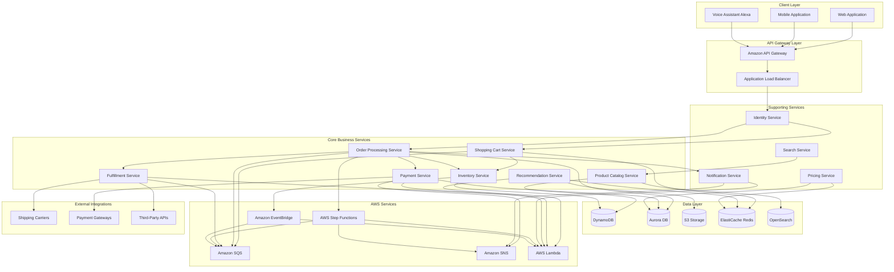
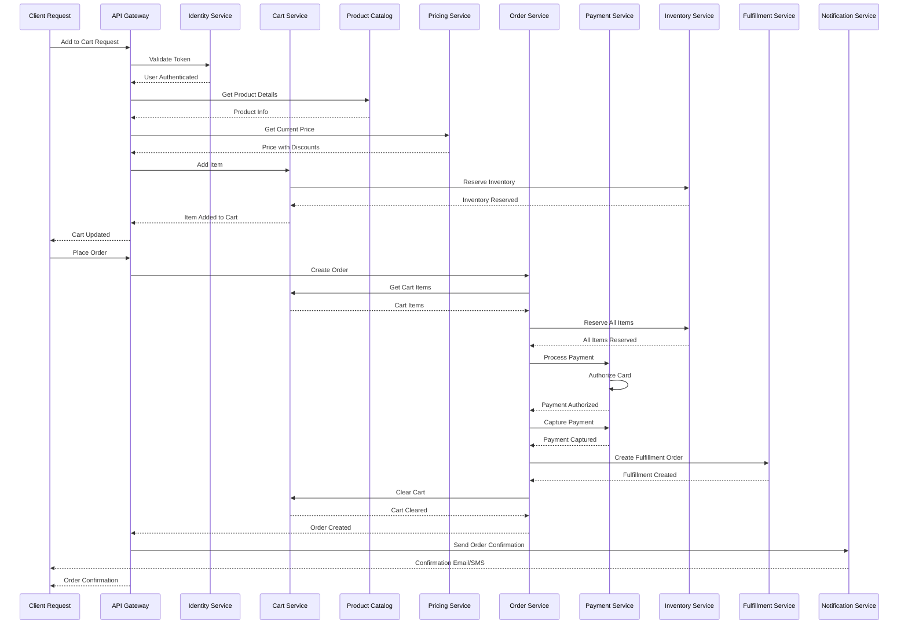

# Amazon Microservices Architecture Overview

## Table of Contents

1. [Overview](#overview)
2. [Architecture Components](#architecture-components)
3. [Flow Chart](#flow-chart)
4. [Standard Example (Java Code)](#standard-example-java-code)
5. [Real-World Implementation](#real-world-implementation)
6. [Output Statement](#output-statement)
7. [Best Practices](#best-practices)

---

## Overview

### Amazon's Microservices Journey

Amazon's transformation from a monolithic architecture to microservices represents one of the most significant architectural evolutions in technology history. This journey began around 2002 when Amazon's founder, Jeff Bezos, issued a now-famous mandate that would fundamentally reshape how the company built and operated software.

#### The Monolithic Beginning (1994-2002)

In Amazon's early years, the architecture was a traditional two-tier system consisting of a frontend application and a backend database. This monolithic architecture served the company well during its initial growth phase, but as Amazon expanded its product offerings and customer base, the limitations became increasingly apparent.

The monolith suffered from several critical issues:
- **Deployment Coupling**: Any code change required rebuilding and redeploying the entire application
- **Team Bottlenecks**: Small teams had to coordinate their changes, causing delays
- **Technology Lock-in**: All teams were forced to use the same technology stack
- **Scalability Limitations**: Scaling required replicating the entire application

#### The Service-Oriented Architecture Phase (2002-2008)

In 2002, Jeff Bezos issued a company-wide mandate that would become the foundation of Amazon's microservices evolution. The mandate stated that all teams must communicate through service interfaces. This decree forced a fundamental shift in how Amazon approached software development.

Key aspects of the SOA phase included:
- **Service Decomposition**: Large applications were broken into services that communicated via APIs
- **Data Isolation**: Each service became responsible for its own data store
- **Interface Standardization**: RESTful APIs became the standard for inter-service communication
- **Independent Deployability**: Teams could deploy their services independently

#### The Microservices Evolution (2008-Present)

The transition from SOA to microservices at Amazon was gradual and evolutionary rather than revolutionary. Amazon continued to decompose services into smaller, more focused units, eventually leading to what we now recognize as microservices architecture.

By 2021, Amazon had evolved to a system of approximately 100-150 microservices handling different aspects of the e-commerce platform, with many services being decomposed further into even smaller units. This evolution was driven by several factors:

1. **Business Agility**: Smaller teams could move faster and innovate more rapidly
2. **Operational Efficiency**: Services could be scaled and optimized independently
3. **Fault Isolation**: Failures in one service didn't cascade to others
4. **Technology Diversity**: Teams could choose the best tools for their specific needs

### Amazon's Architecture Philosophy: "You Build It, You Run It"

The "You Build It, You Run It" philosophy is perhaps Amazon's most influential contribution to modern software engineering practices. This principle, championed by Werner Vogels (Amazon's CTO), fundamentally changes how software development and operations interact.

#### Core Principles

**Ownership**: Development teams are fully responsible for their services from conception through production operation. This includes:

- Writing the code and designing the service
- Deploying the service to production
- Monitoring the service's health and performance
- Responding to incidents and outages
- On-call rotations and support

**Accountability**: When something goes wrong, the team that built the service is accountable for fixing it. This creates direct feedback loops between development and production issues.

**Empowerment**: Teams have complete autonomy over their services, including:
- Technology choices
- Deployment strategies
- Scaling decisions
- Feature development priorities

#### Implementation at Scale

At Amazon's scale, implementing "You Build It, You Run It" required significant investment in tooling and infrastructure:

1. **Internal Developer Platform**: Amazon built extensive internal tools to support developers in operating their services
2. **Automation**: CI/CD pipelines, automated testing, and deployment automation became essential
3. **Monitoring and Observability**: Comprehensive logging, metrics, and tracing systems
4. **On-Call Culture**: Engineers participate in on-call rotations for their services

### Scale Metrics

Amazon's e-commerce platform operates at unprecedented scale, demonstrating the power and challenges of microservices at scale:

- **Requests per Day**: Over 100 billion API calls daily across all services
- **Product Catalog**: Contains over 350 million products across global marketplaces
- **Orders per Year**: Processes billions of customer orders annually
- **Concurrent Users**: Supports millions of concurrent shopping sessions during peak periods
- **Service Count**: Operates hundreds of microservices for the e-commerce platform alone
- **Data Volume**: Processes petabytes of data daily for recommendations and analytics
- **Global Reach**: Serves customers in over 200 countries and territories

---

## Architecture Components

### Key Services Architecture

Amazon's e-commerce platform is composed of numerous specialized microservices, each responsible for a specific domain. The following sections detail the most critical services and their responsibilities.

### 1. Product Catalog Service

The Product Catalog Service is the foundational service that manages all product information in the Amazon ecosystem. It serves as the single source of truth for product data across all channels.

**Responsibilities:**
- Product information management (title, description, specifications)
- Inventory tracking and availability status
- Product categorization and taxonomy
- Search indexing and optimization
- Media management (images, videos)
- Pricing information (basic price storage, not promotional pricing)

**Technology Stack:**
- Amazon DynamoDB for product data storage
- Amazon OpenSearch for search functionality
- Amazon S3 for media storage
- Amazon CloudFront for content delivery

**Scale Characteristics:**
- Stores information for 350+ million products
- Handles millions of read requests per minute
- Sub-100ms latency requirements for product lookups

### 2. Recommendation Service

The Recommendation Service is one of Amazon's most sophisticated and valuable systems, responsible for personalized product suggestions that drive a significant portion of revenue.

**Responsibilities:**
- Collaborative filtering for user-to-user recommendations
- Content-based filtering for item similarity
- Real-time personalization based on browsing history
- "Frequently bought together" and "Customers also bought" suggestions
- Category and department-level recommendations
- A/B testing framework for recommendation algorithms

**Technology Stack:**
- Amazon Personalize for ML-based recommendations
- Apache Spark for batch processing of recommendation models
- Amazon Neptune for graph-based recommendations
- Redis for caching personalized recommendations

**Scale Characteristics:**
- Generates billions of recommendations daily
- Personalized recommendations generated in real-time (<50ms)
- Machine learning models trained on petabytes of user data

### 3. Order Processing Service

The Order Processing Service orchestrates the end-to-end order lifecycle, from cart creation through order confirmation.

**Responsibilities:**
- Shopping cart management
- Order creation and validation
- Order status tracking
- Order history and archival
- Fraud detection integration
- Multi-item order aggregation
- Currency and tax calculation

**Technology Stack:**
- Amazon Aurora for transactional order data
- Amazon SQS for order event processing
- Amazon EventBridge for event-driven workflows
- AWS Step Functions for order processing workflows

**Scale Characteristics:**
- Processes millions of orders daily
- Handles extreme loads during peak events (Prime Day, Black Friday)
- 99.99% availability requirement for order processing

### 4. Payment Service

The Payment Service manages all financial transactions, ensuring secure and reliable processing of customer payments.

**Responsibilities:**
- Payment method management
- Transaction processing
- Payment authorization and capture
- Refund and cancellation processing
- Currency conversion
- PCI DSS compliance
- Fraud detection and prevention

**Technology Stack:**
- Amazon Aurora for payment records
- AWS PrivateLink for secure communication
- Hardware Security Modules (HSM) for cryptographic operations
- Amazon CloudWatch for payment monitoring

**Scale Characteristics:**
- Processes millions of transactions daily
- Handles 100+ payment methods globally
- Zero tolerance for data loss or inconsistencies

### 5. Fulfillment Service

The Fulfillment Service coordinates the physical movement of goods from warehouses to customers.

**Responsibilities:**
- Inventory allocation across fulfillment centers
- Order fulfillment workflow orchestration
- Pick, pack, and ship coordination
- Delivery tracking integration
- Returns processing
- Multi-channel fulfillment (MFN - Merchant Fulfilled Network)
- Fulfillment Center capacity management

**Technology Stack:**
- Amazon DynamoDB for real-time inventory data
- Amazon SQS for fulfillment task queues
- Amazon ECS for fulfillment workflow processing
- AWS IoT for warehouse automation

**Scale Characteristics:**
- Manages inventory across 100+ fulfillment centers globally
- Processes millions of fulfillment tasks daily
- Integrates with hundreds of carriers worldwide

### Supporting Services

Beyond the core services, Amazon's architecture includes numerous supporting services:

| Service | Purpose | Key Technology |
|---------|---------|----------------|
| Identity Service | User authentication and authorization | Amazon Cognito, DynamoDB |
| Search Service | Product search and discovery | Amazon OpenSearch |
| Pricing Service | Dynamic pricing and promotions | Aurora, Redis |
| Review Service | Customer reviews and ratings | DynamoDB, OpenSearch |
| Notification Service | Email, SMS, push notifications | Amazon SES, SNS, Pinpoint |
| Shipping Service | Shipping rate calculation and label generation | External carrier APIs |
| Tax Service | Sales tax calculation | Vertex, AvaTax integration |
| Address Service | Address validation and geocoding | Amazon Location Service |

### AWS Service Integration

Amazon leverages AWS services extensively for their e-commerce platform, creating a powerful synergy between AWS product development and AWS cloud services:

**Compute Services:**
- Amazon EC2 for general-purpose compute
- AWS Lambda for event-driven processing
- Amazon ECS/EKS for container orchestration
- AWS Fargate for serverless containers

**Data Services:**
- Amazon DynamoDB for NoSQL data storage
- Amazon Aurora for relational data
- Amazon S3 for object storage
- Amazon ElastiCache for in-memory caching
- Amazon CloudFront for content delivery

**Integration Services:**
- Amazon SQS for message queuing
- Amazon SNS for pub/sub notifications
- Amazon EventBridge for event routing
- AWS Step Functions for workflow orchestration
- Amazon API Gateway for API management

**Monitoring Services:**
- Amazon CloudWatch for metrics and logging
- AWS X-Ray for distributed tracing
- Amazon CloudWatch Synthetics for canary testing
- AWS Config for compliance monitoring

---

## Flow Chart

### Amazon E-Commerce Order Processing Flow



### Service Communication Patterns



---

## Standard Example (Java Code)

### Service Interface Definition

```java
package com.amazon.example.orderservice;

import org.springframework.boot.SpringApplication;
import org.springframework.boot.autoconfigure.SpringBootApplication;
import org.springframework.cloud.openfeign.EnableFeignClients;
import org.springframework.context.annotation.Bean;
import org.springframework.web.client.RestTemplate;

@SpringBootApplication
@EnableFeignClients
public class OrderServiceApplication {
    
    public static void main(String[] args) {
        SpringApplication.run(OrderServiceApplication.class, args);
    }
    
    @Bean
    public RestTemplate restTemplate() {
        return new RestTemplate();
    }
}
```

### Order Service Implementation

```java
package com.amazon.example.orderservice.service;

import com.amazon.example.orderservice.model.*;
import com.amazon.example.orderservice.repository.OrderRepository;
import com.amazon.example.orderservice.client.*;
import com.amazon.example.orderservice.event.OrderEventPublisher;
import lombok.RequiredArgsConstructor;
import lombok.extern.slf4j.Slf4j;
import org.springframework.stereotype.Service;
import org.springframework.transaction.annotation.Transactional;

import java.math.BigDecimal;
import java.time.Instant;
import java.util.List;
import java.util.UUID;

@Service
@RequiredArgsConstructor
@Slf4j
public class OrderService {
    
    private final OrderRepository orderRepository;
    private final CartServiceClient cartServiceClient;
    private final PaymentServiceClient paymentServiceClient;
    private final InventoryServiceClient inventoryServiceClient;
    private final FulfillmentServiceClient fulfillmentServiceClient;
    private final NotificationServiceClient notificationServiceClient;
    private final OrderEventPublisher orderEventPublisher;
    
    private static final int MAX_RETRY_ATTEMPTS = 3;
    private static final long RETRY_DELAY_MS = 1000;

    @Transactional
    public Order createOrder(String userId, CreateOrderRequest request) {
        log.info("Creating order for user: {} with {} items", userId, 
                 request.getItems().size());
        
        Cart cart = cartServiceClient.getCart(userId);
        if (cart == null || cart.getItems().isEmpty()) {
            throw new OrderException("Cart is empty or not found");
        }
        
        Order order = Order.builder()
                .orderId(UUID.randomUUID().toString())
                .userId(userId)
                .items(mapCartItemsToOrderItems(cart.getItems()))
                .shippingAddress(request.getShippingAddress())
                .paymentMethod(request.getPaymentMethodId())
                .status(OrderStatus.PENDING)
                .createdAt(Instant.now())
                .updatedAt(Instant.now())
                .build();
        
        try {
            inventoryServiceClient.reserveInventory(order.getOrderId(), 
                                                     order.getItems());
            log.info("Inventory reserved for order: {}", order.getOrderId());
            
        } catch (InventoryException e) {
            log.error("Failed to reserve inventory for order: {}", 
                      order.getOrderId(), e);
            order.setStatus(OrderStatus.INVENTORY_RESERVATION_FAILED);
            orderRepository.save(order);
            throw new OrderException("Failed to reserve inventory", e);
        }
        
        try {
            PaymentResult paymentResult = paymentServiceClient.processPayment(
                PaymentRequest.builder()
                    .orderId(order.getOrderId())
                    .amount(calculateOrderTotal(order))
                    .paymentMethodId(request.getPaymentMethodId())
                    .currency("USD")
                    .build()
            );
            
            order.setPaymentId(paymentResult.getTransactionId());
            order.setPaymentStatus(paymentResult.getStatus());
            log.info("Payment processed for order: {}, transaction: {}", 
                     order.getOrderId(), paymentResult.getTransactionId());
            
        } catch (PaymentException e) {
            log.error("Payment failed for order: {}", order.getOrderId(), e);
            inventoryServiceClient.releaseInventory(order.getOrderId());
            order.setStatus(OrderStatus.PAYMENT_FAILED);
            orderRepository.save(order);
            throw new OrderException("Payment processing failed", e);
        }
        
        try {
            FulfillmentResult fulfillmentResult = fulfillmentServiceClient
                .createFulfillmentOrder(
                    FulfillmentRequest.builder()
                        .orderId(order.getOrderId())
                        .items(order.getItems())
                        .shippingAddress(request.getShippingAddress())
                        .shippingMethod(request.getShippingMethod())
                        .build()
                );
            
            order.setFulfillmentId(fulfillmentResult.getFulfillmentId());
            order.setStatus(OrderStatus.FULFILLED);
            log.info("Fulfillment created for order: {}", order.getOrderId());
            
        } catch (FulfillmentException e) {
            log.error("Fulfillment creation failed for order: {}", 
                      order.getOrderId(), e);
            paymentServiceClient.refundPayment(order.getPaymentId());
            inventoryServiceClient.releaseInventory(order.getOrderId());
            order.setStatus(OrderStatus.FULFILLMENT_FAILED);
            orderRepository.save(order);
            throw new OrderException("Fulfillment creation failed", e);
        }
        
        order.setStatus(OrderStatus.CONFIRMED);
        order.setUpdatedAt(Instant.now());
        Order savedOrder = orderRepository.save(order);
        
        notificationServiceClient.sendOrderConfirmation(
            NotificationRequest.builder()
                .userId(userId)
                .orderId(savedOrder.getOrderId())
                .email(savedOrder.getEmail())
                .orderTotal(calculateOrderTotal(savedOrder))
                .build()
        );
        
        orderEventPublisher.publishOrderCreated(savedOrder);
        
        log.info("Order created successfully: {}", savedOrder.getOrderId());
        return savedOrder;
    }
    
    public Order getOrder(String orderId) {
        return orderRepository.findByOrderId(orderId)
                .orElseThrow(() -> new OrderNotFoundException(
                    "Order not found: " + orderId));
    }
    
    public List<Order> getUserOrders(String userId, int page, int size) {
        return orderRepository.findByUserIdOrderByCreatedAtDesc(
            userId, page, size);
    }
    
    @Transactional
    public Order cancelOrder(String orderId, String userId) {
        Order order = getOrder(orderId);
        
        if (!order.getUserId().equals(userId)) {
            throw new OrderException("Order does not belong to user");
        }
        
        if (!canCancelOrder(order)) {
            throw new OrderException("Order cannot be cancelled in current state");
        }
        
        switch (order.getStatus()) {
            case CONFIRMED:
            case PENDING:
                paymentServiceClient.refundPayment(order.getPaymentId());
                inventoryServiceClient.releaseInventory(orderId);
                break;
            case FULFILLED:
                fulfillmentServiceClient.cancelFulfillment(order.getFulfillmentId());
                paymentServiceClient.refundPayment(order.getPaymentId());
                inventoryServiceClient.releaseInventory(orderId);
                break;
            default:
                throw new OrderException("Cannot cancel order in status: " + 
                                         order.getStatus());
        }
        
        order.setStatus(OrderStatus.CANCELLED);
        order.setUpdatedAt(Instant.now());
        Order cancelledOrder = orderRepository.save(order);
        
        notificationServiceClient.sendOrderCancellation(
            NotificationRequest.builder()
                .userId(userId)
                .orderId(orderId)
                .reason("Order cancelled by user")
                .build()
        );
        
        orderEventPublisher.publishOrderCancelled(cancelledOrder);
        
        log.info("Order cancelled: {}", orderId);
        return cancelledOrder;
    }
    
    private boolean canCancelOrder(Order order) {
        return order.getStatus() == OrderStatus.PENDING ||
               order.getStatus() == OrderStatus.CONFIRMED ||
               order.getStatus() == OrderStatus.FULFILLED;
    }
    
    private BigDecimal calculateOrderTotal(Order order) {
        return order.getItems().stream()
                .map(item -> item.getPrice().multiply(
                    BigDecimal.valueOf(item.getQuantity())))
                .reduce(BigDecimal.ZERO, BigDecimal::add);
    }
    
    private List<OrderItem> mapCartItemsToOrderItems(List<CartItem> cartItems) {
        return cartItems.stream()
                .map(cartItem -> OrderItem.builder()
                    .productId(cartItem.getProductId())
                    .productName(cartItem.getProductName())
                    .quantity(cartItem.getQuantity())
                    .price(cartItem.getUnitPrice())
                    .build())
                .toList();
    }
}
```

### Feign Client Definitions

```java
package com.amazon.example.orderservice.client;

import com.amazon.example.orderservice.model.*;
import org.springframework.cloud.openfeign.FeignClient;
import org.springframework.web.bind.annotation.*;

import java.util.List;

@FeignClient(name = "cart-service", url = "${services.cart.url}")
public interface CartServiceClient {
    
    @GetMapping("/api/v1/carts/{userId}")
    Cart getCart(@PathVariable String userId);
    
    @DeleteMapping("/api/v1/carts/{userId}/items")
    void clearCart(@PathVariable String userId);
    
    @PostMapping("/api/v1/carts/{userId}/validate")
    CartValidationResult validateCart(@PathVariable String userId);
}
```

```java
package com.amazon.example.orderservice.client;

import com.amazon.example.orderservice.model.*;
import org.springframework.cloud.openfeign.FeignClient;
import org.springframework.web.bind.annotation.*;

@FeignClient(name = "payment-service", url = "${services.payment.url}")
public interface PaymentServiceClient {
    
    @PostMapping("/api/v1/payments/process")
    PaymentResult processPayment(@RequestBody PaymentRequest request);
    
    @PostMapping("/api/v1/payments/{transactionId}/refund")
    RefundResult refundPayment(@PathVariable String transactionId);
    
    @GetMapping("/api/v1/payments/{transactionId}")
    PaymentStatus getPaymentStatus(@PathVariable String transactionId);
    
    @PostMapping("/api/v1/payments/authorize")
    PaymentResult authorizePayment(@RequestBody PaymentRequest request);
    
    @PostMapping("/api/v1/payments/{transactionId}/capture")
    PaymentResult capturePayment(@PathVariable String transactionId, 
                                  @RequestBody CaptureRequest request);
}
```

```java
package com.amazon.example.orderservice.client;

import com.amazon.example.orderservice.model.*;
import org.springframework.cloud.openfeign.FeignClient;
import org.springframework.web.bind.annotation.*;

import java.util.List;

@FeignClient(name = "inventory-service", url = "${services.inventory.url}")
public interface InventoryServiceClient {
    
    @PostMapping("/api/v1/inventory/reserve")
    InventoryReservationResult reserveInventory(
        @RequestParam String orderId, 
        @RequestBody List<OrderItem> items);
    
    @PostMapping("/api/v1/inventory/release/{orderId}")
    void releaseInventory(@PathVariable String orderId);
    
    @GetMapping("/api/v1/inventory/{productId}")
    InventoryStatus getInventoryStatus(@PathVariable String productId);
    
    @PostMapping("/api/v1/inventory/check")
    InventoryCheckResult checkInventoryAvailability(
        @RequestBody List<OrderItem> items);
}
```

### Event Publishing

```java
package com.amazon.example.orderservice.event;

import com.amazon.example.orderservice.model.Order;
import lombok.RequiredArgsConstructor;
import lombok.extern.slf4j.Slf4j;
import org.springframework.cloud.aws.messaging.core.QueueMessagingTemplate;
import org.springframework.messaging.support.MessageBuilder;
import org.springframework.stereotype.Component;

@Component
@RequiredArgsConstructor
@Slf4j
public class OrderEventPublisher {
    
    private final QueueMessagingTemplate queueMessagingTemplate;
    
    private static final String ORDER_CREATED_QUEUE = "order-created-queue";
    private static final String ORDER_CANCELLED_QUEUE = "order-cancelled-queue";
    private static final String ORDER_UPDATED_QUEUE = "order-updated-queue";
    
    public void publishOrderCreated(Order order) {
        OrderEvent event = OrderEvent.builder()
                .eventId(java.util.UUID.randomUUID().toString())
                .eventType("ORDER_CREATED")
                .timestamp(java.time.Instant.now())
                .orderId(order.getOrderId())
                .userId(order.getUserId())
                .orderTotal(order.getTotalAmount())
                .items(order.getItems())
                .build();
        
        queueMessagingTemplate.send(
            ORDER_CREATED_QUEUE,
            MessageBuilder.withPayload(event).build()
        );
        
        log.info("Published ORDER_CREATED event for order: {}", 
                 order.getOrderId());
    }
    
    public void publishOrderCancelled(Order order) {
        OrderEvent event = OrderEvent.builder()
                .eventId(java.util.UUID.randomUUID().toString())
                .eventType("ORDER_CANCELLED")
                .timestamp(java.time.Instant.now())
                .orderId(order.getOrderId())
                .userId(order.getUserId())
                .reason("Order cancelled by user")
                .build();
        
        queueMessagingTemplate.send(
            ORDER_CANCELLED_QUEUE,
            MessageBuilder.withPayload(event).build()
        );
        
        log.info("Published ORDER_CANCELLED event for order: {}", 
                 order.getOrderId());
    }
    
    public void publishOrderUpdated(Order order) {
        OrderEvent event = OrderEvent.builder()
                .eventId(java.util.UUID.randomUUID().toString())
                .eventType("ORDER_UPDATED")
                .timestamp(java.time.Instant.now())
                .orderId(order.getOrderId())
                .userId(order.getUserId())
                .status(order.getStatus())
                .build();
        
        queueMessagingTemplate.send(
            ORDER_UPDATED_QUEUE,
            MessageBuilder.withPayload(event).build()
        );
        
        log.info("Published ORDER_UPDATED event for order: {}", 
                 order.getOrderId());
    }
}
```

### Circuit Breaker Implementation

```java
package com.amazon.example.orderservice.resilience;

import io.github.resilience4j.circuitbreaker.CircuitBreaker;
import io.github.resilience4j.circuitbreaker.CircuitBreakerConfig;
import io.github.resilience4j.circuitbreaker.CircuitBreakerRegistry;
import lombok.extern.slf4j.Slf4j;
import org.springframework.context.annotation.Bean;
import org.springframework.context.annotation.Configuration;

import java.time.Duration;

@Configuration
@Slf4j
public class CircuitBreakerConfiguration {
    
    @Bean
    public CircuitBreakerRegistry circuitBreakerRegistry() {
        CircuitBreakerConfig defaultConfig = CircuitBreakerConfig.custom()
                .failureRateThreshold(50)
                .slowCallRateThreshold(80)
                .slowCallDurationThreshold(Duration.ofSeconds(2))
                .waitDurationInOpenState(Duration.ofSeconds(30))
                .permittedNumberOfCallsInHalfOpenState(5)
                .slidingWindowType(CircuitBreakerConfig.SlidingWindowType.COUNT_BASED)
                .slidingWindowSize(10)
                .minimumNumberOfCalls(5)
                .build();
        
        CircuitBreakerConfig paymentConfig = CircuitBreakerConfig.custom()
                .failureRateThreshold(30)
                .slowCallRateThreshold(50)
                .slowCallDurationThreshold(Duration.ofSeconds(1))
                .waitDurationInOpenState(Duration.ofSeconds(60))
                .permittedNumberOfCallsInHalfOpenState(3)
                .slidingWindowType(CircuitBreakerConfig.SlidingWindowType.COUNT_BASED)
                .slidingWindowSize(20)
                .minimumNumberOfCalls(10)
                .build();
        
        return CircuitBreakerRegistry.of(defaultConfig)
                .withCircuitBreakerConfig("paymentService", paymentConfig)
                .withCircuitBreakerConfig("inventoryService", defaultConfig)
                .withCircuitBreakerConfig("fulfillmentService", defaultConfig);
    }
    
    @Bean
    public CircuitBreaker paymentCircuitBreaker(
            CircuitBreakerRegistry registry) {
        CircuitBreaker circuitBreaker = registry.circuitBreaker("paymentService");
        
        circuitBreaker.getEventPublisher()
                .onStateTransition(event -> 
                    log.warn("Payment service circuit breaker state changed: {}",
                            event.getStateTransition()))
                .onFailureRateExceeded(event ->
                    log.error("Payment service failure rate exceeded: {}",
                            event.getFailureRate()));
        
        return circuitBreaker;
    }
}
```

### Retry Configuration

```java
package com.amazon.example.orderservice.resilience;

import io.github.resilience4j.retry.Retry;
import io.github.resilience4j.retry.RetryConfig;
import io.github.resilience4j.retry.RetryRegistry;
import lombok.extern.slf4j.Slf4j;
import org.springframework.context.annotation.Bean;
import org.springframework.context.annotation.Configuration;

import java.time.Duration;

@Configuration
@Slf4j
public class RetryConfiguration {
    
    @Bean
    public RetryRegistry retryRegistry() {
        RetryConfig defaultConfig = RetryConfig.custom()
                .maxAttempts(3)
                .waitDuration(Duration.ofMillis(1000))
                .retryExceptions(Exception.class)
                .ignoreExceptions(IllegalArgumentException.class)
                .build();
        
        RetryConfig idempotentConfig = RetryConfig.custom()
                .maxAttempts(5)
                .waitDuration(Duration.ofMillis(500))
                .retryExceptions(Exception.class)
                .failAfterMaxAttempts(true)
                .build();
        
        return RetryRegistry.of(defaultConfig)
                .withRetryConfig("inventoryService", idempotentConfig)
                .withRetryConfig("notificationService", 
                    RetryConfig.custom()
                        .maxAttempts(4)
                        .waitDuration(Duration.ofMillis(200))
                        .build());
    }
    
    @Bean
    public Retry inventoryRetry(RetryRegistry registry) {
        Retry retry = registry.retry("inventoryService");
        
        retry.getEventPublisher()
                .onRetry(event -> 
                    log.warn("Retrying inventory service call, attempt: {}, " +
                            "exception: {}",
                            event.getNumberOfRetryAttempts(),
                            event.getLastThrowable().getMessage()))
                .onError(event ->
                    log.error("Inventory service retry failed after {} attempts",
                            event.getNumberOfRetryAttempts()));
        
        return retry;
    }
}
```

---

## Real-World Implementation

### Amazon's Service Communication Patterns

In production, Amazon's services communicate through well-defined patterns that ensure reliability, scalability, and maintainability.

#### Synchronous Communication

Synchronous communication is used when a service needs an immediate response. Amazon uses HTTP/REST and gRPC for these interactions:

**REST over HTTP**: Used for most external-facing APIs and internal service-to-service communication. Services typically expose RESTful endpoints using API Gateway or Application Load Balancers for routing.

**gRPC**: Used for high-performance, low-latency internal communication between services. gRPC's binary protocol and HTTP/2 support make it ideal for inter-service communication where performance is critical.

#### Asynchronous Communication

Asynchronous communication is used for decoupled, event-driven interactions:

**Amazon SQS**: Simple Queue Service handles task distribution between services. For example, the Order Service sends fulfillment tasks to an SQS queue, which the Fulfillment Service processes asynchronously.

**Amazon SNS**: Simple Notification Service handles pub/sub messaging for broadcasting events to multiple subscribers. When an order is placed, SNS notifies various services (Inventory, Fulfillment, Notification, Analytics).

**Amazon EventBridge**: Event-driven architecture using events to trigger workflows across services. Amazon heavily uses EventBridge for service orchestration.

### Data Management Strategy

#### Database per Service

Each microservice owns its data and exposes it only through APIs. This pattern prevents tight coupling and allows services to evolve independently.

**Implementation:**
- Order Service uses Amazon Aurora for transactional integrity
- Product Catalog uses DynamoDB for flexible schema and high scalability
- Inventory Service uses DynamoDB with Streams for real-time updates
- Session data uses ElastiCache (Redis) for sub-millisecond access

#### Event Sourcing

Some services use event sourcing for audit trails and eventual consistency:

- Payment Service records all transaction events
- Order Service maintains order history through events
- Inventory Service tracks all inventory movements as events

#### CQRS (Command Query Responsibility Segregation)

Amazon implements CQRS for services with different read and write patterns:

- Product Catalog: Write-optimized for updates, read-optimized for search
- Order Service: Separate models for order creation vs. order history queries

### Service Discovery and Configuration

#### Service Discovery

Services discover each other through AWS Cloud Map or internal service registries:

```yaml
# Service registration example
service:
  name: order-service
  port: 8080
  healthCheck:
    path: /health
    interval: 30s
  tags:
    team: orders
    tier: critical
```

#### Configuration Management

Configuration is externalized using AWS Systems Manager Parameter Store:

- Service configurations stored as parameters
- Secrets encrypted using AWS KMS
- Configuration changes don't require redeployment
- Feature flags controlled through configuration

### Deployment and Operations

#### Deployment Pipeline

Amazon uses a sophisticated CI/CD pipeline:

1. **Code Commit**: Developers commit code to CodeCommit repositories
2. **Build**: CodeBuild compiles code, runs tests, creates container images
3. **Test**: Automated testing in multiple environments
4. **Staging**: Deployment to staging environment for integration testing
5. **Production**: Canary deployment to production
6. **Monitoring**: Continuous monitoring during deployment

#### Canary Deployments

New versions are rolled out gradually:

- Initial 1% traffic to new version
- Monitor error rates and latency
- Gradually increase to 10%, 50%, 100%
- Automatic rollback if thresholds exceeded

#### Infrastructure as Code

All infrastructure is managed through AWS CloudFormation or Terraform:

```yaml
# Example CloudFormation for Order Service
Resources:
  OrderServiceCluster:
    Type: AWS::ECS::Cluster
    Properties:
      ClusterName: order-service-cluster
  
  OrderServiceTaskDefinition:
    Type: AWS::ECS::TaskDefinition
    Properties:
      Family: order-service
      ContainerDefinitions:
        - Name: order-service
          Image: !Sub ${AWS::AccountId}.dkr.ecp.${AWS::Region}.amazonaws.com/order-service:latest
          PortMappings:
            - ContainerPort: 8080
          Environment:
            - Name: SPRING_PROFILES_ACTIVE
              Value: production
          LogConfiguration:
            LogDriver: awslogs
            Options:
              awslogs-group: /ecs/order-service
              awslogs-region: !Ref AWS::Region
```

### Monitoring and Observability

#### The Four Golden Signals

Amazon services are monitored using the four golden signals:

1. **Latency**: p50, p95, p99 response times
2. **Traffic**: Requests per second, concurrent connections
3. **Errors**: Error rates, error types
4. **Saturation**: CPU, memory, connection pool usage

#### Distributed Tracing

AWS X-Ray provides end-to-end request tracing:

```java
// Adding tracing to service calls
@Bean
public AWSXRayRecorder awsxRayRecorder() {
    AWSXRayRecorderBuilder builder = AWSXRayRecorderBuilder.standard();
    builder.withPlugin(new EC2Plugin());
    builder.withPlugin(new ECSPlugin());
    builder.withPlugin(new ElasticBeanstalkPlugin());
    return builder.build();
}
```

#### Custom Metrics

Services publish custom business metrics:

- Orders created per minute
- Payment processing time
- Inventory reservation success rate
- Fulfillment throughput

### Fault Tolerance Patterns

#### Bulkheads

Services use bulkhead patterns to isolate failures:

- Separate thread pools for different service calls
- Connection pools sized per downstream service
- Circuit breakers prevent cascading failures

#### Timeouts

All external calls have defined timeouts:

```java
// Timeout configuration
@Configuration
public class TimeoutConfiguration {
    
    @Bean
    public RestTemplate restTemplate() {
        SimpleClientHttpRequestFactory factory = new SimpleClientHttpRequestFactory();
        factory.setConnectTimeout(Duration.ofMillis(1000));
        factory.setReadTimeout(Duration.ofMillis(3000));
        return new RestTemplate(factory);
    }
}
```

#### Graceful Degradation

Services implement graceful degradation:

- If recommendations are slow, show popular products instead
- If payment service is down, queue transactions for later processing
- If search is unavailable, fall back to browse categories

---

## Output Statement

Amazon's microservices architecture represents a landmark achievement in distributed systems engineering. The company's journey from a monolithic architecture to hundreds of loosely-coupled services offers invaluable lessons for organizations undertaking similar transformations.

### Key Achievements

Amazon's architecture enables:

- **Business Agility**: Teams can deploy changes independently, with hundreds of deployments per day across the platform
- **Scalability**: Individual services can scale based on their specific needs, from hundreds to millions of requests
- **Reliability**: 99.99%+ availability for critical services through fault isolation and graceful degradation
- **Innovation**: Independent teams can experiment with new technologies without affecting other services
- **Global Scale**: Serving hundreds of millions of customers across 200+ countries with localized experiences

### Lessons Learned

The Amazon case study demonstrates several critical success factors:

1. **Culture First**: Technical success stems from organizational culture. The "You Build It, You Run It" philosophy requires significant cultural change.

2. **Evolution Over Revolution**: Amazon's transformation occurred over nearly two decades. Organizations should expect gradual evolution, not instant results.

3. **Invest in Platform**: A robust internal developer platform is essential for enabling teams to operate their services effectively.

4. **Automate Everything**: At scale, manual processes become bottlenecks. CI/CD, automated testing, and infrastructure as code are necessities.

5. **Measure Everything**: Comprehensive observability is critical for understanding system behavior and troubleshooting issues.

6. **Design for Failure**: Distributed systems will fail. Services must be designed to handle partial failures gracefully.

### Impact on Industry

Amazon's microservices architecture has fundamentally shaped modern software engineering:

- **AWS Services**: Many AWS services (Lambda, ECS, API Gateway, DynamoDB) were developed from Amazon's internal needs
- **Industry Standard**: Amazon popularized many patterns now considered standard in microservices architecture
- **Open Source**: Amazon contributed tools like the AWS SDK, Circuit Breaker libraries, and container orchestration ideas

---

## Best Practices

### Service Design Principles

#### 1. Single Responsibility Principle

Each service should have a single, well-defined purpose:

```java
// Good: Focused service
public interface ProductCatalogService {
    Product getProduct(String productId);
    List<Product> searchProducts(String query);
    List<Product> getProductsByCategory(String categoryId);
    void updateProduct(String productId, ProductUpdate update);
}

// Avoid: Service doing too much
public interface ProductService {
    // Should NOT be responsible for:
    // - Order processing
    // - Payment handling
    // - User management
    // - Inventory tracking
}
```

#### 2. API-First Design

Design APIs before implementing services:

```yaml
# OpenAPI specification for Order Service
openapi: 3.0.0
info:
  title: Order Service API
  version: 1.0.0
  description: API for order processing operations

paths:
  /api/v1/orders:
    post:
      summary: Create a new order
      operationId: createOrder
      requestBody:
        required: true
        content:
          application/json:
            schema:
              $ref: '#/components/schemas/CreateOrderRequest'
      responses:
        '201':
          description: Order created successfully
          content:
            application/json:
              schema:
                $ref: '#/components/schemas/Order'
        '400':
          $ref: '#/components/responses/BadRequest'
        '409':
          $ref: '#/components/responses/Conflict'

components:
  schemas:
    CreateOrderRequest:
      type: object
      required:
        - items
        - shippingAddress
        - paymentMethodId
      properties:
        items:
          type: array
          items:
            $ref: '#/components/schemas/OrderItemRequest'
        shippingAddress:
          $ref: '#/components/schemas/ShippingAddress'
        paymentMethodId:
          type: string
```

#### 3. Versioning Strategy

Implement API versioning from the start:

```
# URL-based versioning (Amazon's approach)
GET /api/v1/products
GET /api/v2/products

# Header-based versioning
GET /products
Accept: application/vnd.amazon.v2+json
```

#### 4. Contract Testing

Test service contracts to prevent integration failures:

```java
@SpringBootTest
@AutoConfigureMockMvc
@Testcontainers
public class OrderServiceContractTest {
    
    @Container
    static PostgreSQLContainer<?> postgres = new PostgreSQLContainer<>(
        "postgres:14");
    
    @Test
    void createOrder_shouldReturnOrder_whenValidRequest() {
        // Contract test implementation
    }
}
```

### Data Management Best Practices

#### 1. Database per Service

Maintain clear data ownership:

- Each service owns its data
- No shared databases between services
- Data access only through APIs
- Eventual consistency for cross-service data

#### 2. Event-Driven Data Sharing

Share data through events, not direct database access:

```java
// Product Service publishes events
@Bean
public ApplicationEventPublisher eventPublisher() {
    return new CompositeApplicationEventPublisher(
        publishEventFunction,
        new ApplicationEventPublisherWrapper()
    );
}

// Inventory Service subscribes to events
@EventListener
public void handleProductUpdated(ProductUpdatedEvent event) {
    inventoryService.updateProductCache(event.getProductId());
}
```

#### 3. Saga Pattern for Distributed Transactions

Use sagas instead of distributed transactions:

```java
@Service
@RequiredArgsConstructor
@Slf4j
public class OrderSaga {
    
    private final InventoryServiceClient inventoryService;
    private final PaymentServiceClient paymentService;
    private final FulfillmentServiceClient fulfillmentService;
    
    @Transactional
    public Order executeSaga(CreateOrderRequest request) {
        try {
            // Step 1: Reserve inventory
            InventoryReservation reservation = 
                inventoryService.reserveInventory(request.getItems());
            
            try {
                // Step 2: Process payment
                PaymentResult payment = 
                    paymentService.processPayment(request);
                
                try {
                    // Step 3: Create fulfillment
                    FulfillmentResult fulfillment = 
                        fulfillmentService.createFulfillment(
                            reservation.getReservationId(),
                            payment.getTransactionId()
                        );
                    
                    return Order.builder()
                        .items(request.getItems())
                        .status(OrderStatus.CONFIRMED)
                        .build();
                        
                } catch (Exception e) {
                    // Compensating transaction: refund payment
                    paymentService.refund(payment.getTransactionId());
                    throw e;
                }
                
            } catch (Exception e) {
                // Compensating transaction: release inventory
                inventoryService.release(reservation.getReservationId());
                throw e;
            }
            
        } catch (Exception e) {
            log.error("Saga execution failed", e);
            throw new OrderCreationException("Failed to create order", e);
        }
    }
}
```

### Resilience Best Practices

#### 1. Implement Circuit Breakers

Protect services from cascading failures:

```java
@Bean
public CircuitBreakerRegistry circuitBreakerRegistry() {
    return CircuitBreakerRegistry.of(
        CircuitBreakerConfig.custom()
            .failureRateThreshold(50)
            .slowCallRateThreshold(80)
            .slowCallDurationThreshold(Duration.ofSeconds(2))
            .waitDurationInOpenState(Duration.ofSeconds(30))
            .slidingWindowType(SlidingWindowType.COUNT_BASED)
            .slidingWindowSize(10)
            .build()
    );
}

@Service
@RequiredArgsConstructor
public class OrderService {
    
    private final CircuitBreakerRegistry registry;
    private final PaymentServiceClient paymentService;
    
    @PostConstruct
    public void init() {
        CircuitBreaker paymentCircuitBreaker = 
            registry.circuitBreaker("paymentService");
        
        paymentCircuitBreaker.getEventPublisher()
            .onStateTransition(stateTransition -> 
                log.warn("Circuit breaker state changed: {}", 
                        stateTransition.getStateTransition()));
    }
    
    public PaymentResult processPaymentSafely(PaymentRequest request) {
        return registry.circuitBreaker("paymentService")
            .executeSupplier(() -> paymentService.processPayment(request));
    }
}
```

#### 2. Implement Retries with Exponential Backoff

Handle transient failures gracefully:

```java
@Service
@RequiredArgsConstructor
public class ReliableInventoryClient {
    
    private final InventoryServiceClient inventoryClient;
    
    public InventoryReservation reserveWithRetry(
            String orderId, List<OrderItem> items) {
        
        int maxAttempts = 3;
        long backoffMs = 1000;
        
        for (int attempt = 1; attempt <= maxAttempts; attempt++) {
            try {
                return inventoryClient.reserveInventory(orderId, items);
            } catch (RetryableException e) {
                if (attempt == maxAttempts) {
                    throw e;
                }
                
                long delay = backoffMs * (long) Math.pow(2, attempt - 1);
                try {
                    Thread.sleep(delay);
                } catch (InterruptedException ie) {
                    Thread.currentThread().interrupt();
                    throw e;
                }
                
                log.warn("Retry attempt {} for inventory reservation", attempt);
            }
        }
        
        throw new IllegalStateException("Should not reach here");
    }
}
```

#### 3. Implement Bulkheads

Isolate failures using bulkheads:

```java
@Configuration
public class BulkheadConfiguration {
    
    @Bean
    public ThreadPoolExecutor paymentExecutor() {
        return new ThreadPoolExecutor(
            10,  // core pool size
            20,  // max pool size
            60,  // keep alive time
            TimeUnit.SECONDS,
            new LinkedBlockingQueue<>(100),
            new ThreadFactoryBuilder()
                .setNameFormat("payment-pool-%d")
                .build(),
            new ThreadPoolExecutor.CallerRunsPolicy()
        );
    }
    
    @Bean
    public ThreadPoolExecutor inventoryExecutor() {
        return new ThreadPoolExecutor(
            20,
            50,
            60,
            TimeUnit.SECONDS,
            new LinkedBlockingQueue<>(500),
            new ThreadFactoryBuilder()
                .setNameFormat("inventory-pool-%d")
                .build(),
            new ThreadPoolExecutor.CallerRunsPolicy()
        );
    }
}
```

#### 4. Implement Timeouts

Always set timeouts for external calls:

```java
@Configuration
public class RestClientConfiguration {
    
    @Bean
    public RestTemplate restTemplate() {
        SimpleClientHttpRequestFactory factory = 
            new SimpleClientHttpRequestFactory();
        factory.setConnectTimeout(Duration.ofSeconds(2));
        factory.setReadTimeout(Duration.ofSeconds(5));
        factory.setWriteTimeout(Duration.ofSeconds(5));
        
        return new RestTemplate(factory);
    }
    
    @Bean
    public OkHttpClient okHttpClient() {
        return new OkHttpClient.Builder()
            .connectTimeout(Duration.ofSeconds(2))
            .readTimeout(Duration.ofSeconds(5))
            .writeTimeout(Duration.ofSeconds(5))
            .retryOnConnectionFailure(true)
            .build();
    }
}
```

### Security Best Practices

#### 1. Zero Trust Networking

Never trust the network; always authenticate and authorize:

```java
@Service
public class SecureOrderService {
    
    private final TokenValidator tokenValidator;
    private final PermissionChecker permissionChecker;
    
    public Order createSecureOrder(
            String authToken, CreateOrderRequest request) {
        
        AuthenticatedUser user = tokenValidator.validate(authToken);
        
        if (!permissionChecker.hasPermission(user, "ORDER_CREATE")) {
            throw new UnauthorizedException("Insufficient permissions");
        }
        
        // Validate request data
        validateRequest(request);
        
        // Audit logging
        auditLogger.log(
            AuditEvent.builder()
                .userId(user.getUserId())
                .action("ORDER_CREATE")
                .resource(request.getItems())
                .timestamp(Instant.now())
                .build()
        );
        
        return orderService.createOrder(user.getUserId(), request);
    }
}
```

#### 2. Secure Inter-Service Communication

Use mTLS and service mesh for service-to-service communication:

```yaml
# AWS App Mesh configuration
apiVersion: appmesh.k8s.io/v1beta2
kind: Mesh
metadata:
  name: order-service-mesh
spec:
  namespaceSelector:
    matchLabels:
      mesh: order-service
  egress:
    - type: dnsrewrite
      port:
        number: 443
      rewrite:
        hostname: .svc.cluster.local
```

#### 3. Secrets Management

Use AWS Secrets Manager for sensitive data:

```java
@Service
@RequiredArgsConstructor
public class DatabaseConnectionService {
    
    private final AWSSecretsManager secretsManager;
    
    @Value("${aws.secret.name}")
    private String secretName;
    
    public Connection getConnection() {
        GetSecretValueRequest request = GetSecretValueRequest.builder()
            .secretId(secretName)
            .build();
        
        GetSecretValueResponse response = 
            secretsManager.getSecretValue(request);
        
        DatabaseCredentials credentials = 
            new ObjectMapper().readValue(
                response.secretString(), 
                DatabaseCredentials.class
            );
        
        return DriverManager.getConnection(
            credentials.getJdbcUrl(),
            credentials.getUsername(),
            credentials.getPassword()
        );
    }
}
```

### Operational Best Practices

#### 1. Comprehensive Logging

Implement structured logging for all services:

```java
@Service
@RequiredArgsConstructor
@Slf4j
public class OrderService {
    
    public Order createOrder(String userId, CreateOrderRequest request) {
        MDC.put("orderId", UUID.randomUUID().toString());
        MDC.put("userId", userId);
        
        log.info("Creating order with {} items", request.getItems().size());
        
        try {
            Order order = orderRepository.save(buildOrder(userId, request));
            
            log.info("Order created successfully with ID: {}", 
                    order.getOrderId());
            
            return order;
        } catch (Exception e) {
            log.error("Failed to create order for user: {}", userId, e);
            throw e;
        } finally {
            MDC.clear();
        }
    }
}
```

#### 2. Health Checks and Readiness Probes

Implement proper health endpoints:

```java
@Component
@RequiredArgsConstructor
public class OrderServiceHealthIndicator 
        implements HealthIndicator {
    
    private final OrderRepository orderRepository;
    private final PaymentServiceClient paymentService;
    private final InventoryServiceClient inventoryService;
    
    @Override
    public Health health() {
        try {
            // Check database connectivity
            orderRepository.count();
            
            // Check critical dependencies
            boolean paymentHealthy = checkDependency(
                () -> paymentService.healthCheck());
            boolean inventoryHealthy = checkDependency(
                () -> inventoryService.healthCheck());
            
            if (paymentHealthy && inventoryHealthy) {
                return Health.up()
                    .withDetail("database", "connected")
                    .withDetail("paymentService", "healthy")
                    .withDetail("inventoryService", "healthy")
                    .build();
            } else {
                return Health.down()
                    .withDetail("paymentService", 
                        paymentHealthy ? "healthy" : "unhealthy")
                    .withDetail("inventoryService", 
                        inventoryHealthy ? "healthy" : "unhealthy")
                    .build();
            }
        } catch (Exception e) {
            return Health.down()
                .withException(e)
                .build();
        }
    }
    
    private boolean checkDependency(Supplier<Boolean> check) {
        try {
            return check.get();
        } catch (Exception e) {
            return false;
        }
    }
}
```

#### 3. Graceful Shutdown

Handle shutdown signals properly:

```java
@Component
@RequiredArgsConstructor
@Slf4j
public class GracefulShutdownHandler {
    
    private final ApplicationContext context;
    private final OrderService orderService;
    
    @PreDestroy
    public void onShutdown() {
        log.info("Initiating graceful shutdown...");
        
        // Stop accepting new requests
        // (handled by Spring Boot automatically)
        
        // Wait for in-flight requests to complete
        try {
            Thread.sleep(5000); // 5 seconds for requests to complete
        } catch (InterruptedException e) {
            Thread.currentThread().interrupt();
        }
        
        // Complete pending operations
        orderService.flushPendingOrders();
        
        log.info("Graceful shutdown completed");
    }
}
```

#### 4. Cost Optimization

Monitor and optimize service costs:

- Right-size compute resources based on actual usage
- Use auto-scaling to match demand
- Implement efficient caching to reduce database costs
- Use reserved capacity for predictable workloads
- Monitor and eliminate waste

### Conclusion

Amazon's microservices architecture provides a comprehensive blueprint for building scalable, resilient distributed systems. By following these best practices, organizations can learn from Amazon's experience while adapting patterns to their specific needs. The key is to start with clear service boundaries, invest in platform infrastructure, prioritize operational excellence, and continuously iterate based on real-world feedback.

---

**Document Version**: 1.0  
**Last Updated**: 2026-04-09  
**Author**: Microservices Architecture Team
