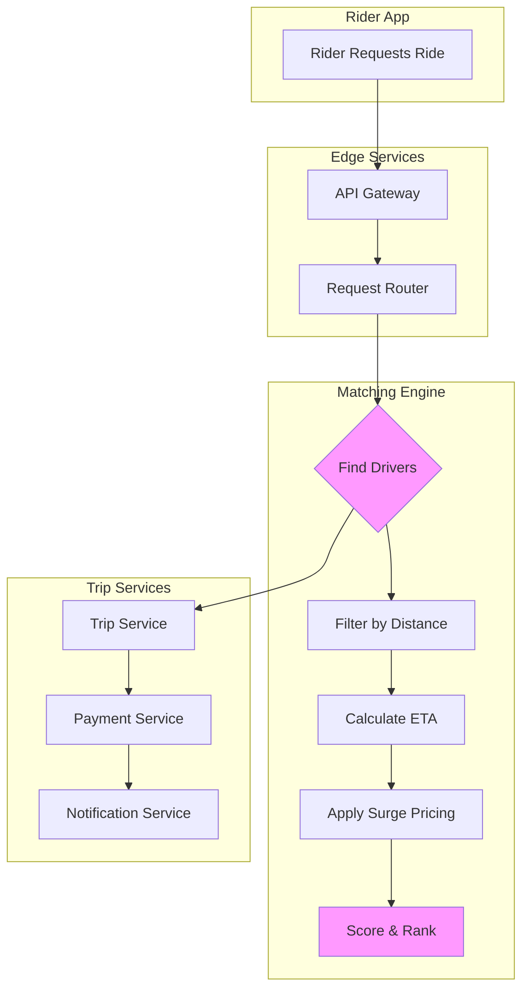

# Uber Microservices Architecture

## Overview

Uber's transformation from a monolithic startup to a global ride-sharing platform demonstrates the power of microservices architecture in handling real-time, location-based services at massive scale. Uber's architecture must process millions of ride requests daily, match riders with drivers in seconds, handle dynamic pricing, and ensure reliable communication across multiple regions while maintaining sub-second latency requirements.

The Uber platform serves over 130 million monthly active users and 6 million+ driver partners across 10,000+ cities in 72 countries. Each ride request involves complex computations: finding nearby drivers, calculating estimated arrival times, applying dynamic pricing, calculating optimal routes, and coordinating real-time communication between rider and driver. This complexity necessitated Uber's evolution from a monolithic Python application to a Go and Java-based microservices architecture.

Uber's microservices architecture evolved significantly over the years. The original monolith (named "Berlin") was built in Python using the Tornado web framework and served Uber well through early growth. However, as the platform scaled, the limitations became apparent - deployments required careful coordination across teams, scaling meant scaling the entire application, and introducing new features risked destabilizing existing functionality. The migration to microservices began around 2014 and accelerated after the successful IPO in 2019.

The key architectural principles at Uber include: service ownership (teams own their services end-to-end), location-aware computing (placing computation near users), real-time orchestration (matching engines handle sub-second decisions), and domain-driven decomposition (services organized around business domains like trip, supply, demand, and billing).

## Core Architecture

### Service Domains

Uber's microservices are organized around several core domains:

**Trip Domain** handles the entire lifecycle of a ride from request to completion. The core services include TripService (managing active trips), TripMatchingService (pairing riders with drivers), TripPricingService (calculating fares with dynamic pricing), and TripAnalyticsService (tracking trip metrics).

**Supply Domain** manages driver availability and vehicle information. Key services include DriverService (driver profiles and status), DriverLocationService (real-time driver positions), VehicleService (vehicle information), and AvailabilityService (driver availability states).

**Demand Domain** handles rider interactions and requests. Core services include RiderService (rider accounts), RequestService (ride requests), EstimatesService (price and ETA estimates), and PromoService (promotion management).

**Billing Domain** processes payments and financial operations. Services include PaymentService (payment processing), BillingService (invoice generation), RefundService (refund processing), and SplitFareService (shared ride payments).

### Core Services Flow



## Standard Implementation

```java
// Uber-style Trip Matching Service
@Service
public class TripMatchingService {
    
    @Autowired
    private DriverLocationService driverLocationService;
    
    @Autowired
    private TripService tripService;
    
    @Autowired
    private PricingService pricingService;
    
    /**
     * Find available drivers near the pickup location
     * Uses geohash for efficient spatial queries
     */
    public List<Driver> findNearbyDrivers(GeoLocation pickupLocation, double radiusMeters) {
        String geohash = GeoHash.withCharacterPrecision(pivotLocation, 6);
        
        // Find drivers in nearby geohash tiles
        List<String> nearbyTiles = geohash.getNearbyTiles(radiusMeters);
        
        return driverLocationService.findDriversInTiles(nearbyTiles).stream()
            .filter(driver -> isDriverAvailable(driver))
            .filter(driver -> isDriverInRadius(driver, pickupLocation, radiusMeters))
            .sorted(Comparator.comparing(driver -> 
                calculateDistance(driver.getLocation(), pickupLocation)))
            .collect(Collectors.toList());
    }
    
    /**
     * Create a trip and match with driver
     * Uses saga pattern for distributed transaction
     */
    @Transactional
    public Trip createTripMatch(String riderId, String driverId, 
                                TripRequest request) {
        // Step 1: Validate driver availability
        Driver driver = driverLocationService.getDriver(driverId);
        if (!isDriverAvailable(driver)) {
            throw new DriverUnavailableException(driverId);
        }
        
        // Step 2: Calculate fare
        BigDecimal fare = pricingService.calculateFare(
            request.getPickupLocation(),
            request.getDropoffLocation()
        );
        
        // Step 3: Create trip record
        Trip trip = Trip.builder()
            .riderId(riderId)
            .driverId(driverId)
            .pickupLocation(request.getPickupLocation())
            .dropoffLocation(request.getDropoffLocation())
            .fare(fare)
            .status(TripStatus.ASSIGNED)
            .build();
        
        trip = tripService.create(trip);
        
        // Step 4: Update driver status to assigned
        driverLocationService.updateDriverStatus(driverId, 
            DriverStatus.ASSIGNED);
        
        // Step 5: Notify rider and driver
        notificationService.sendTripAssigned(trip);
        
        return trip;
    }
    
    /**
     * Match multiple drivers for redundancy
     */
    public List<Trip> matchBackupDrivers(String primaryTripId, 
                                   List<String> backupDriverIds) {
        Trip primaryTrip = tripService.get(primaryTripId);
        
        List<Trip> backupTrips = new ArrayList<>();
        
        for (String driverId : backupDriverIds) {
            Trip backupTrip = Trip.builder()
                .riderId(primaryTrip.getRiderId())
                .driverId(driverId)
                .pickupLocation(primaryTrip.getPickupLocation())
                .dropoffLocation(primaryTrip.getDropoffLocation())
                .fare(primaryTrip.getFare())
                .status(TripStatus.BACKUP_ASSIGNED)
                .build();
            
            backupTrips.add(tripService.create(backupTrip));
        }
        
        return backupTrips;
    }
}

// Uber Matching Algorithm
@Service
public class MatchingAlgorithm {
    
    /**
     * Score and rank drivers for trip assignment
     * Considers multiple factors: distance, rating, arrival time, surge
     */
    public double calculateDriverScore(Driver driver, TripRequest request) {
        double distanceScore = calculateDistanceScore(
            driver.getLocation(), 
            request.getPickupLocation()
        );
        
        double ratingScore = driver.getRating() / 5.0;
        
        double arrivalTimeScore = calculateArrivalTimeScore(
            driver.getLocation(),
            request.getPickupLocation()
        );
        
        double surgeMultiplier = request.getSurgeMultiplier();
        double surgeScore = 1.0 / surgeMultiplier;
        
        // Weighted scoring
        return (distanceScore * 0.4) + 
               (ratingScore * 0.2) + 
               (arrivalTimeScore * 0.3) + 
               (surgeScore * 0.1);
    }
}
```

## Real-World Implementation

### Dynamic Pricing (Surge Pricing)

Uber's surge pricing demonstrates complex microservices orchestration:

1. **Demand Sensing Service** monitors request volume and driver supply in real-time
2. **Supply Flux Service** tracks driver availability and departure rates
3. **Pricing Service** calculates surge multiplier based on supply/demand ratio
4. **Notification Service** alerts users of surge pricing
5. **Optimization Service** adjusts surge based on historical patterns

```java
@Service
public class DynamicPricingService {
    
    /**
     * Calculate surge multiplier
     * Multiplier increases as demand exceeds supply
     */
    public BigDecimal calculateSurgeMultiplier(
            GeoLocation location, 
            int demandCount, 
            int availableDrivers) {
        
        if (availableDrivers == 0) {
            return new BigDecimal("5.0"); // Maximum surge
        }
        
        double ratio = (double) demandCount / availableDrivers;
        
        if (ratio < 1.0) {
            return new BigDecimal("1.0"); // No surge
        } else if (ratio < 2.0) {
            return new BigDecimal("1.25");
        } else if (ratio < 3.0) {
            return new BigDecimal("1.5");
        } else if (ratio < 4.0) {
            return new BigDecimal("2.0");
        } else if (ratio < 5.0) {
            return new BigDecimal("2.5");
        } else {
            return new BigDecimal("5.0"); // Maximum
        }
    }
}
```

## Best Practices

Uber's microservices journey provides several valuable lessons:

1. **Organize Around Business Domains**: Uber decomposes services around real business capabilities (trip, supply, demand, billing) rather than technical layers. This enables independent scaling and team autonomy.

2. **Design for Location-Aware Computing**: Place services geographically near users to minimize latency. Uber uses edge computing and regional deployments to ensure sub-second matching.

3. **Implement Robust Matching**: Use multi-stage matching with backup drivers to ensure reliability. Primary assignment may fail, so system must handle cascading failures gracefully.

4. **Handle Dynamic Pricing Gracefully**: Surge pricing requires careful service orchestration. Ensure pricing services can handle high load without cascading failures.

5. **Invest in Real-Time Communication**: WebSocket and push notification services are critical for rider-driver communication. Build these with reliability in mind.

---

## Output Statement

```
Uber Architecture Metrics:
=========================
- Daily Trip Requests: 20+ million
- Real-time Matching: < 10 seconds
- Driver Locations Tracked: 6+ million
- Active Cities: 10,000+
- Countries: 72+

Technical Stack:
- Languages: Go, Java, Node.js
- Infrastructure: AWS, GCP
- Databases: PostgreSQL, MySQL, Cassandra
- Message Queues: Kafka, RabbitMQ
- Caching: Redis, Memcache

Key Microservices:
- Trip Service: Core trip lifecycle
- Matching Engine: Driver-rider pairing
- Supply Service: Driver management
- Demand Service: Rider requests
- Payment Service: Financial processing
- Notification Service: Real-time alerts
```