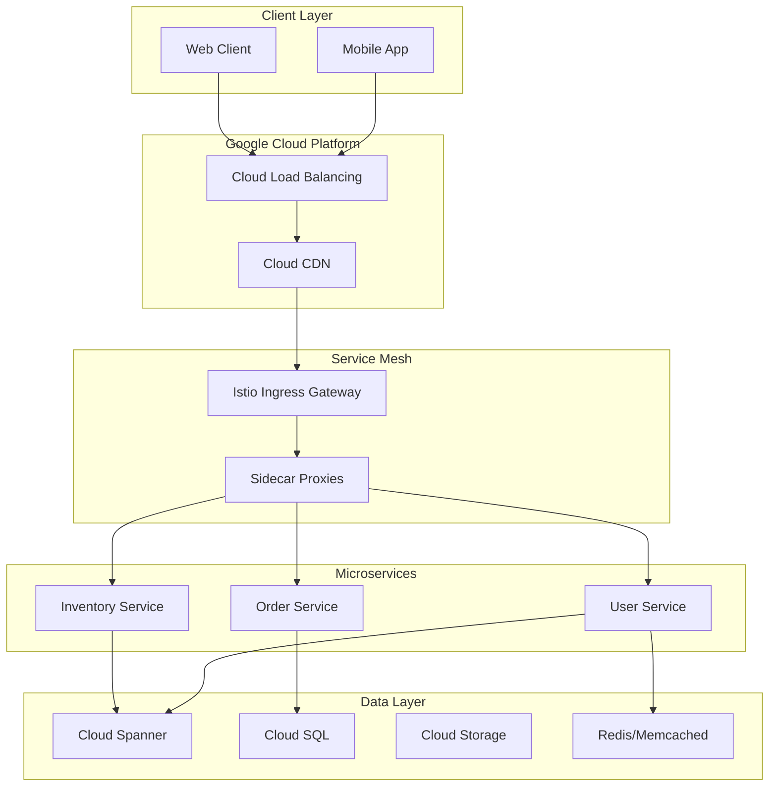

# Google Cloud Microservices Architecture

## Overview

Google's microservices architecture is unique because Google pioneered many of the patterns and technologies that define modern microservices computing. Internal systems like Borg, Chubby, and BigTable formed the foundation for Google's external cloud offerings including Kubernetes, Cloud Spanner, and Pub/Sub. Understanding Google's architecture provides deep insights into how to build planet-scale distributed systems.

Google's journey with microservices began in the early 2000s when they needed to scale internal systems beyond what monolithic architectures could handle. The development of Borg (the predecessor to Kubernetes) around 2003-2004 allowed Google to run thousands of applications across hundreds of thousands of machines. This internal experience with container orchestration and service management informed Google's approach to cloud-native microservices.

Google Cloud serves millions of customers running microservices architectures across various scales. The key differentiator is that Google's infrastructure is battle-tested internally before being offered externally. Technologies like Kubernetes (originally developed at Google based on Borg), gRPC (for efficient inter-service communication), and Spanner (globally distributed database) emerged from Google's internal needs and were then open-sourced or offered as cloud services.

Google's architecture philosophy emphasizes: declarative infrastructure (define desired state, let system achieve it), self-healing systems (automatic recovery from failures), resource efficiency (high utilization through multi-tenancy), and global distribution (low latency anywhere in the world).

## Core Architecture

### Key Technologies

**Kubernetes (K8s)**: Container orchestration system that automates deployment, scaling, and management of containerized applications. Originally based on Google's Borg system, Kubernetes has become the industry standard for container orchestration.

**gRPC**: High-performance, open-source RPC framework that uses Protocol Buffers for efficient serialization. gRPC enables efficient communication between services with support for bi-directional streaming.

**Istio**: Service mesh that provides traffic management, security, and observability without requiring code changes. Istio uses sidecar proxies to intercept all network communication between services.

**Cloud Spanner**: Globally distributed relational database that provides strong consistency, horizontal scaling, and high availability. Spanner combines the benefits of traditional databases with NoSQL horizontal scaling.

### Architecture Components



## Implementation Example

```yaml
# Kubernetes Deployment for User Service
apiVersion: apps/v1
kind: Deployment
metadata:
  name: user-service
  labels:
    app: user-service
spec:
  replicas: 3
  selector:
    matchLabels:
      app: user-service
  template:
    metadata:
      labels:
        app: user-service
      annotations:
        # Istio sidecar injection
        sidecar.istio.io/inject: "true"
    spec:
      containers:
      - name: user-service
        image: gcr.io/my-project/user-service:v1.0.0
        ports:
        - containerPort: 8080
        resources:
          requests:
            cpu: 100m
            memory: 128Mi
          limits:
            cpu: 500m
            memory: 512Mi
        livenessProbe:
          httpGet:
            path: /health
            port: 8080
          initialDelaySeconds: 30
          periodSeconds: 10
        readinessProbe:
          httpGet:
            path: /ready
            port: 8080
          initialDelaySeconds: 5
          periodSeconds: 5
        env:
        - name: DATABASE_HOST
          valueFrom:
            configMapKeyRef:
              name: user-service-config
              key: database.host
        - name: REDIS_HOST
          valueFrom:
            configMapKeyRef:
              name: user-service-config
              key: redis.host
---
# Kubernetes Service
apiVersion: v1
kind: Service
metadata:
  name: user-service
spec:
  selector:
    app: user-service
  ports:
  - protocol: TCP
    port: 80
    targetPort: 8080
  type: ClusterIP
```

```java
// gRPC Service Definition (Protocol Buffers)
syntax = "proto3";

package com.example.userservice;

option java_package = "com.example.userservice";

service UserService {
    // Get user by ID
    rpc GetUser(GetUserRequest) returns (User);
    
    // Create new user
    rpc CreateUser(CreateUserRequest) returns (User);
    
    // Update user
    rpc UpdateUser(UpdateUserRequest) returns (User);
    
    // Delete user
    rpc DeleteUser(DeleteUserRequest) returns (Empty);
    
    // Stream user updates
    rpc WatchUsers(WatchRequest) returns (stream UserUpdate);
}

message User {
    string id = 1;
    string email = 2;
    string name = 3;
    int64 created_at = 4;
    UserStatus status = 5;
}

message GetUserRequest {
    string user_id = 1;
}

message CreateUserRequest {
    string email = 1;
    string name = 2;
}
```

## Google Cloud Services for Microservices

| Service | Purpose | Use Case |
|---------|---------|----------|
| Cloud Run | Serverless containers | Event-driven services |
| GKE | Managed Kubernetes | Container orchestration |
| Cloud Functions | Serverless functions | Lightweight operations |
| Cloud Spanner | Global database | Transactional data |
| Cloud SQL | Managed SQL databases | Relational data |
| Firestore | Document database | Flexible schema data |
| Cloud Pub/Sub | Event streaming | Async communication |
| Cloud CDN | Content delivery | Static content |
| Cloud Load Balancing | Traffic distribution | Global scaling |
| Cloud Armor | Security | DDoS protection |

## Best Practices

1. **Use Managed Services**: Leverage Google Cloud's managed offerings (Cloud Run, Cloud SQL, Pub/Sub) to reduce operational burden and improve reliability.

2. **Implement Service Mesh**: Use Istio for traffic management, security, and observability without modifying application code.

3. **Use gRPC for Inter-Service Communication**: gRPC's efficiency and strong typing make it ideal for microservice communication.

4. **Design for Global Distribution**: Use Cloud Spanner for globally distributed data, and deploy services across multiple regions.

5. **Leverage Declarative Infrastructure**: Use Terraform or Deployment Manager to define infrastructure as code for reproducibility.

---

## Output Statement

```
Google Cloud Microservices Metrics:
===================================
- Kubernetes Clusters: Millions globally
- Daily gRPC Calls: Trillions
- Regions Available: 40+
- Availability Zones: 120+

Key Differentiators:
- Borg-derived orchestration (Kubernetes)
- Efficient RPC (gRPC)
- Service mesh (Istio)
- Global database (Spanner)
- Serverless (Cloud Run/Functions)

Enterprise Usage:
- Scale: Millions of containers
- Industries: Finance, Healthcare, Retail
- Compliance: SOC2, HIPAA, GDPR
```