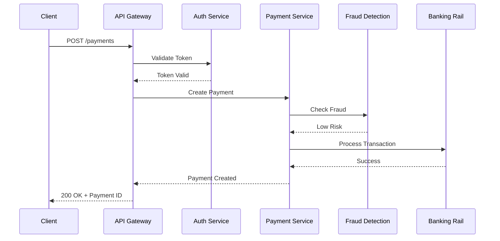

# Stripe Microservices Architecture

## Overview

Stripe provides the economic infrastructure for the internet, processing hundreds of billions of dollars in payments annually for millions of businesses worldwide. Stripe's microservices architecture demonstrates how to build highly reliable financial systems that process transactions with zero tolerance for errors while maintaining the speed and flexibility required to serve internet businesses globally.

Stripe's journey began in 2010 as a simple API for accepting payments. As the platform grew to support complex payment flows, subscription billing, fraud detection, and multi-currency transactions, the original monolithic architecture reached its limits. The transformation to microservices allowed Stripe to scale from processing thousands of dollars daily to hundreds of billions annually while maintaining 99.99%+ uptime and sub-100-millisecond API latency.

The key challenges Stripe solved through microservices include: maintaining ACID compliance across distributed services, handling complex multi-step payment workflows, achieving PCI DSS compliance at scale, and providing a developer-friendly API that abstracts underlying complexity. Stripe's architecture demonstrates how microservices can be applied to financial services where correctness and reliability are paramount.

Stripe's architectural philosophy emphasizes: developer experience (simple, powerful APIs), reliability by default (assume failures will happen), incremental complexity (add complexity only when needed), and security as a foundation (PCI compliance built-in).

## Core Architecture

### Payment Processing Flow



### Key Services

**Core Payment Services:**
- PaymentIntent Service: Manages payment lifecycle
- Charge Service: Processes payment attempts
- Refund Service: Handles refund processing
- Dispute Service: Manages chargebacks

**Supporting Services:**
- Tokenization Service: Securely tokenizes card data
- Risk Service: Fraud detection and prevention
- Routing Service: Selects optimal payment processors
- Webhook Service: Delivers payment events

## Implementation Example

```python
# Stripe-style Payment Service
from dataclasses import dataclass
from typing import Optional, List
from enum import Enum
import stripe

class PaymentStatus(Enum):
    REQUIRES_PAYMENT_METHOD = "requires_payment_method"
    REQUIRES_CONFIRMATION = "requires_confirmation"
    REQUIRES_ACTION = "requires_action"
    PROCESSING = "processing"
    SUCCEEDED = "succeeded"
    CANCELED = "canceled"

@dataclass
class PaymentIntent:
    id: str
    amount: int
    currency: str
    status: PaymentStatus
    customer_id: Optional[str]
    metadata: dict

class PaymentService:
    """Core payment processing service"""
    
    def __init__(self, 
                 stripe_client: stripe,
                 risk_service: 'RiskService',
                 tokenization_service: 'TokenizationService'):
        self.stripe = stripe_client
        self.risk_service = risk_service
        self.tokenization_service = tokenization_service
    
    async def create_payment_intent(
        self,
        amount: int,
        currency: str,
        customer_id: Optional[str] = None,
        metadata: Optional[dict] = None
    ) -> PaymentIntent:
        """Create a new payment intent"""
        
        # Tokenize payment method
        payment_method_id = await self.tokenization_service.tokenize(
            request.payment_method
        )
        
        # Check for fraud risk
        risk_assessment = await self.risk_service.assess_risk(
            amount=amount,
            currency=currency,
            customer_id=customer_id,
            payment_method_id=payment_method_id
        )
        
        if risk_assessment.block:
            raise FraudBlockError(
                f"Payment blocked: {risk_assessment.reason}"
            )
        
        # Create payment intent
        intent = PaymentIntent(
            id=f"pi_{self._generate_id()}",
            amount=amount,
            currency=currency,
            status=PaymentStatus.REQUIRES_PAYMENT_METHOD,
            customer_id=customer_id,
            metadata=metadata
        )
        
        # Store in database
        await self._store_payment_intent(intent)
        
        return intent
    
    async def confirm_payment(
        self,
        payment_intent_id: str,
        payment_method_id: str
    ) -> PaymentIntent:
        """Confirm a payment intent"""
        
        intent = await self._get_payment_intent(payment_intent_id)
        
        # Process payment via stripe
        try:
            charge = await self.stripe.charges.create(
                amount=intent.amount,
                currency=intent.currency,
                payment_method=payment_method_id,
                customer=intent.customer_id,
                capture='automatic'
            )
            
            if charge.status == 'succeeded':
                intent.status = PaymentStatus.SUCCEEDED
            else:
                intent.status = PaymentStatus.PROCESSING
            
            await self._update_payment_intent(intent)
            
            # Emit event for other services
            await self._publish_event(
                "payment.intent.succeeded",
                {"payment_intent_id": intent.id}
            )
            
            return intent
            
        except stripe.CardError as e:
            intent.status = PaymentStatus.CANCELED
            await self._update_payment_intent(intent)
            raise PaymentError(str(e))

class RiskService:
    """Fraud detection service"""
    
    async def assess_risk(
        self,
        amount: int,
        currency: str,
        customer_id: Optional[str],
        payment_method_id: str
    ) -> RiskAssessment:
        """Assess transaction risk"""
        
        # Query risk models
        signals = await self._collect_signals(
            amount=amount,
            customer_id=customer_id,
            payment_method_id=payment_method_id
        )
        
        # Evaluate using ML model
        risk_score = await self._evaluate_model(signals)
        
        return RiskAssessment(
            score=risk_score,
            block=risk_score > 0.8,
            reason=risk_score > 0.8
        )
```

## Best Practices

1. **Idempotency is Critical**: Implement idempotency keys for all payment operations to prevent duplicate charges.

2. **Compensating Transactions**: Use saga patterns for multi-step operations with rollback capabilities.

3. **Event-Driven Architecture**: Emit events for all state changes to enable downstream services to react.

4. **Defense in Depth**: Implement fraud detection, velocity checks, and 3D Secure at multiple layers.

5. **PCI Compliance by Design**: Never handle raw card data - use tokenization and payment processors.

---

## Output Statement

```
Stripe Architecture Metrics:
========================
- Annual Volume: $800B+
- API Latency: <100ms
- Uptime: 99.99%+
- Daily API Requests: 100M+

Technical Stack:
- Language: Ruby, Go, Python, Java
- Infrastructure: AWS
- Database: PostgreSQL, CockroachDB
- Cache: Redis
- Message Queue: Kafka

Payment Services:
- PaymentIntents API
- Stripe Connect (marketplaces)
- Billing (subscriptions)
- Radar (fraud detection)
```